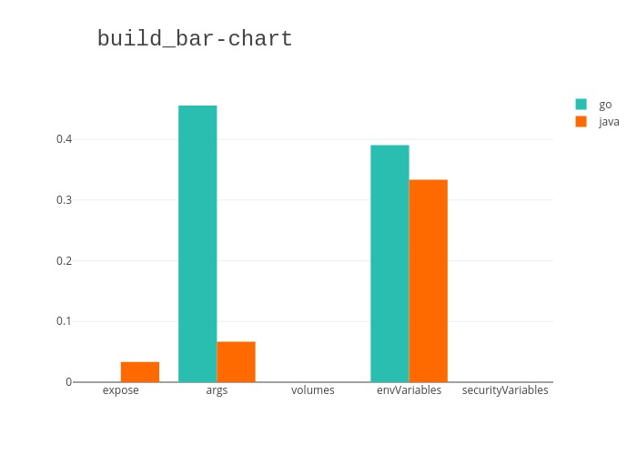
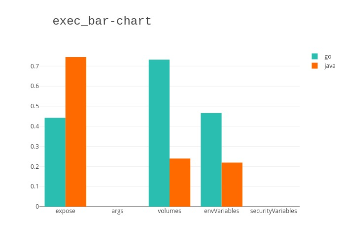
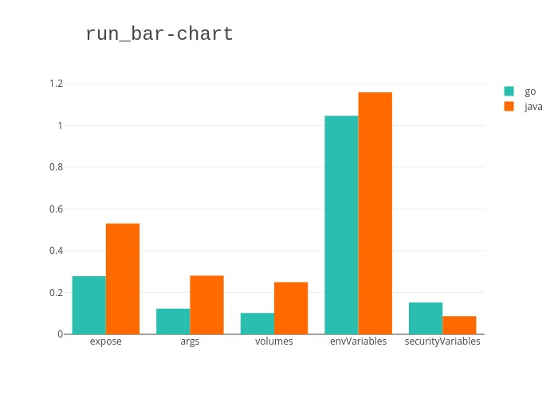
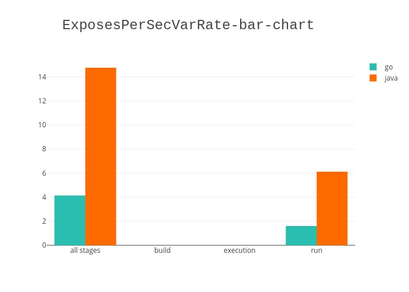
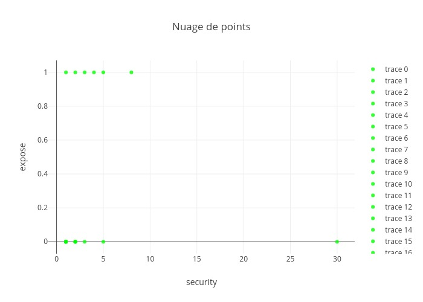

## Auteurs
Nous sommes quatre étudiants en 5ème année de diplôme d'ingénieur à Polytech Nice-Sophia, spécialisés en architecture logiciel :  

* Corentin Artaud &lt;corentin.artaud@etu.unice.fr&gt;
* Théos Mariani &lt;theos.mariani@etu.unice.fr&gt;
* Elena Moron Vidal &lt;elena.moron-vidal@etu.unice.fr&gt;
* Alexandre Bolot &lt;alexandre.bolot@etu.unice.fr&gt;

## I. Contexte de notre recherche

### Comment les paramètres de haut niveau agissent sur des logiciels conteneurisés ?

De plus en plus de systèmes actuels utilisent des logiciels conteneurisés. Or, il existe de nombreux moyens de paramétriser des conteneurs Docker, et cela crée une forte hétérogénéité entre les différents projets.

Ces nombreux moyens possibles de paramètrisation permettent de faire varier le comportement au cours des différents cycles de vie d'une application.
Dans le cadre de notre recherche, nous avons décidé de nous concentrer sur les phases suivantes : 
- La construction de l'application (à la génération de l'éxécutable).
- La création de l'image Docker
- L'exécution de cette image

Si nous avons choisi ces trois phases c'est parce qu'elles représentent les principaux moments où l'application est impactée par les paramètres de haut niveau. 

#### Exclude :

Nous avons décidé d'exclure les projets utilisant un docker-compose et donc plus généralement les solutions utilisant une architecture micro-service.
Ceux-ci sont trop spécifiques à analyser car ils contiennent énormément de duplication d'information entre les mico-services, contrairement aux projets monolythes qui n'utilisent qu'un seul Dockerfile pour s'exécuter dans un environement donné.
Si nous avions pris en compte les projets micro-services, cela aurai rendu nos résultats incohérents. Cependant, il serait intéressant pour une future étude de les intégrer, mais en considérant que chaque service est un projet à part entière. 

## II. Observations/General question

Quels sont les paramètres utilisés dans les différents cycles de vie d'une application conténeurisées ? Y a t-il des similarités entre differents langages de programmation ?

L'intérêt principal de ces questions est de pouvoir déterminer s'il existe des normes pour un langage donné. De plus, nous voulons savoir si celles-ci sont généralisables à un ensemble de projets informatiques ou si les différentes technologies ont un impact sur la manière de paramétriser une application.

L'objectif, s'il existe des normes ou généralités de paramétrisation, serait de faciliter la construction d'une solution conteneurisé en établissant des templates d'utilisation de docker ou encore en automatisant un maximun d'actions récurrentes.

## III. Notre approche du sujet

Le premier travail de notre recherche a été de définir des catégories de types de paramètre de haut niveau à partir d'une analyse statique et manuelle d'un petit ensemble de projets.

Cela nous a permis par la suite de développer des algorithmes capables d'analyser en grand nombre de projets en labélisant les paramètres trouvés dans les catégories suivante : 

- Réseau
- Sécurité/Authentification
- Variable d'environnement 
- Et enfin les inconnus, dans le but d'améliorer au fûr et a messure notre analyse. 

Dans le cadre de nos recherches nous avons décidé de nous concentrer dans un premier temps sur les projets développés en GoLang car ceux-ci ont des particularités très intéressantes :

1. La phase de compilation de l'application et de la création de l'image docker sont décrites dans le dockerfile.
2. L'utilisation de variables d'environnement récurentes.

Ensuite nous avons décidé d'effectuer une comparaison avec des projets en Java car c'est un langage qui est beaucoup utilisé dans l'industrie.  

 
## IV. Hypothesis & Experiences

Pour nous guider dans nos recherches nous avons émis les hypothèses suivantes :

- Existe-t-il des liens entre les différents types de paramètres de haut niveau ?
- Existe-t-il des points communs de paramètrage entre plusieurs technologies/langages ?
- Existe-t-il des corélations entre différents types de paramètre ?
 
Pour essayer de confirmer ou invalider nos hypothèses nous avons généré toute sortes graphe afin d'avoir une visualisation des données récupérées sur notre ensemble de projets. 

## V. Results

Nous avons généré des graphes pour chaque cycle de vie d'une application: build (construction application/compilation du code source), exec (construction de l'image docker) et run (instanciation de l'image docker en un conteneur).
Ceux-ci mettent en avant le taux d'apparition des exposes, args, volumes, nombre de variables d'environnement et nombre de variables de sécurité dans les différents projet que nous avons étudié.
De plus, nous avons fait la distinction entre Java et Go pour comparer leur utilisation des paramètres de haut niveau.

Dans cette phase nous nous attendions à ne pas trouver d'expose car cela n'a pas de sens d'ouvrir un port lors de la construction.
Cependant nous remarquons dans ce schéma qu'une application Java en utilise un. Après avoir verifié manuellement dans le projet concerné, nous avons remarqué qu'il s'agissait d'une anomalie de notre analyseur de dockerfile qui rencontrait 2 primitive `FROM` l'une après l'autre et les interprète mal. 

**Relation entre le nombre d'exposes et le nombre de variables de sécurité déclarées**

Nous avons fait le calcul par phase ainsi que pour le global, de nouveau nous avons montré la distinction entre les langages pour les comparer.
> Nous voyons que même si nous n'avons des données que pour la phase *run*, la moyenne est différente parce que si dans une phase il n'y a pas des variables de sécurité déclarées, le calcul ne se fait pas.
> Alors nous pouvons trouver des exposes comme on remarque dans les graphs dessus et ils sont pris en compte pour le calcul global (*all stages*). 

Nous avons également analysé les variables d'environnement et de sécurité les plus utilisées dans les deux langages. Si le même nom de variable apparaît dans deux projets différents, nous ajoutons une apparition à cette variable. 

Les résultats pour les variables d'environnement de **GO** ont été:

| Rang | Variable      | Apparitions |
|:----:| ------------- |:-----------:|
|  1   | 'GOPATH'      |     48      |
|  2   | 'PATH'        |     34      |
|  3   | 'CGO_ENABLED' |      9      |
|  4   | 'DOCKER_HOST' |      5      | 

À partir de ce point, nous trouvons quelques variables avec 2, 3 voir 4 apparitions, mais la majeure partie n'apparaît qu'une seule fois. 

Du côté des variables de sécurité, le résultat n'offre rien à remarquer parce chaque variable n'a qu'une seule apparition.

Pour les variables d'environnement de **JAVA**, leur nombre d'apparitions maximal pour une même variable est de deux. Cela ne nous permet pas de déterminer une norme mais de déduire que l'utilisation des variables en java est fortement dépendante du contexte dans lequels il évolue.  
En étant les suivantes:
* 'JAVA_MINIMAL'
* 'MAVEN_HOME'
* 'APP_HOME'
* 'LANG'
* 'LANGUAGE'
* 'LC_ALL'
* 'SPRING_RABBITMQ_ADDRESSES'

>TODO : :sweat_smile: ?
Tant que pour la sécurité nous trouvons moins de déclarations de variables que dans les projets GO et sont différentes entre les projets alors il n'y a rien de particulier à distinguer. Il faut remarquer aussi que le nombre de projets JAVA est moitié moins, que le nombre de projets GO.

> PROPOSITION : :bulb: 
Pour ce qui concerne les vraible de sécurité en **Java**, comme pour **GO** nous ne pouvons rien remarquer de particulier car nous en trouvons encore moins et toujours en une seul instance. Cela viens surement du fait que nous avons moitié moins de projet **Java** que de projet **Go** ( moins de dockerFile et moins de dockerFile valides, c'est à dire avec au plus deux stages).

## VI. Analyse

Les résultats que nous avons présentés dans la partie précédente sont relativement hétérogènes.
En effet, sur certains critères, les langages Java et Go ont de fortes similarités alors que sur d'autres mesures, il y a de fortes disparités.

Par exemple il y a une forte similarité pour l'étape de `RUN` du Dockerfile, où l'utilisation des paramètres entre Go et Java suit la même tendance. 
>(laquelle?)

En revanche pour la phase de build et d'execution, les valeurs sont très différentes.

* Selon nos observations et connaissances de ces deux langages, il n'est pas surprenant d'avoir une différence pour l'étape de build étant donné que Java est compilé en amont, alors que Go est compilé pendant la création de l'image Docker.
* Concernant l'utilisation des variables d'environnement du langage Go, nous avons appris de cette étude qu'en dehors de la variable PATH (ou GOPATH), il n'y a pas de généralité ni de norme dans ce qui est utilisé.
Il en va de même pour les variables d'environnement de Java : leur utilisation est très hétérogène et il n'y a pas (ou très peu) de variables similaires d'un projet à l'autre.

Nous pouvons faire deux suppositions pour expliquer l'hétérogénéité des variables d'environnement :
1. Leur utilisation est très fortement couplé à chaque projet et à son contexte : impossible de trouver des points communs métiers/d'infrastructure dans une grande quantité de projets.
2. Des variables ayant un rôle et une fonction similaire existent, mais son nommées différemment entre les projets, par manque ou non respect des conventions de la communauté. Cela aurait pour conscéquence que notre algorithme de détection les traites séparément étant donné qu'il utilise le nommage pour les catégoriser.

Lors de cette étude nous n'avons pas pu vérifier laquelle de ces deux supposition est la plus pertinente étant donné qu'il faudrait analyser "à la main" de très nombreux projets, comprendre l'utilité de chaque paramètre, et estimer (avec quelle précision ?) si des variables au nom différent remplissent ou non la même fonction.

## VII. Méthode

Pour obtenir tous ces résultats nous avons développé trois scripts en javascript et typescript.  
Le premier en javascript pur, utilise l'API de github, il nous sert à récupérer une liste de repository contenant au moins un dockerFile et écrit dans le langage que l'on souhaite analysé (Golang et Java).Pour être sûr de récupérer des projets ayant de la valeur pour notre étude nous avons décidé de les trier en fonction de leur nombre d'étoile. Chaque étoile signifie qu'un utilisateur a souhaité ajouter le projet à ses favoris et y porte de l'intérêt.

Le second script écrit en typescript prend en entrée un fichier contenant la liste des repository interessant pour un language. Pour chaque répository il va vérifier si le DockerFile contient bien au moins la phase de build de l'image et pas plus de 2 phases (comilation du code source et construction de l'image).  
Il va ensuite extraire de ce repository des données provenant de différents fichiers: 
- Dockerfile pour récupérer principalement les paramètres des phases de construction de l'application et de l'image. 
- Les scripts bash `.sh` pour le phase d'instation de l'image.
- Et enfin les fichiers markdown pour trouver la commande de lancement du projet.

Puis il va stocker ces différentes données dans un fichier JSON (1 par repository) afin de pouvoir les utiliser pour d'autres utilisations.  
Ce script gère les repositories par batch de 10 en parallelisant gràce aux fonctionnalitées de nodeJs les appels systèmes et réseau (clone des répos, appels files systèmes dont lectures des fichier, etc ..). Afin d'optimiser le temps de traitement, cela nous permet de gérer les 475 repos Golang en une vingtaine de minutes avec une bonne connexion à internet fibre et un ssd mvme.  

Le troisième scripts écrits en typescript il génère les graphes en utilisant la bibliothèque plotly et les données obtenues avec le script précédement décrit.  

## VII. References

>lister les projets utilisé :
1. [DockerFile reference](https://docs.docker.com/engine/reference/builder/)
2. [github api v3](https://developer.github.com/v3/)
