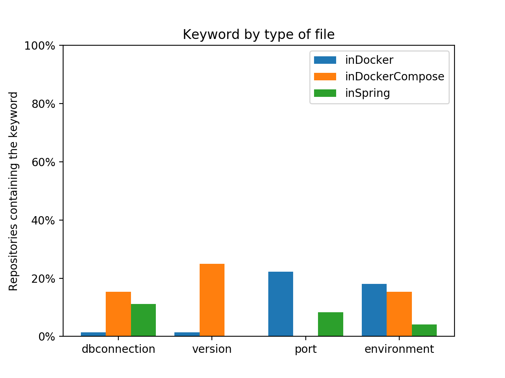
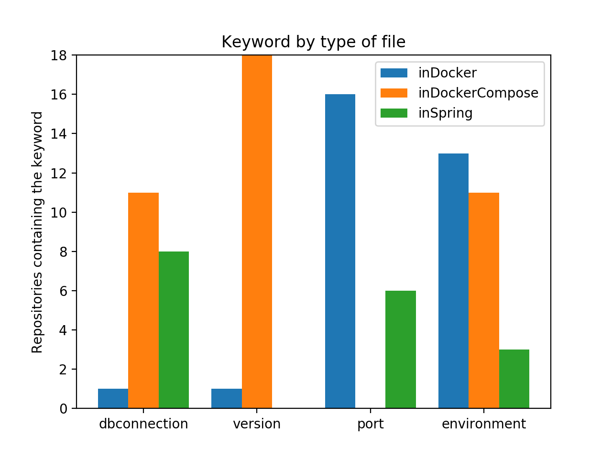

## Auteurs

Nous somme quatre étudiants en dernière année d'architecture logicielle à Polytech Nice-Sophia : 

* BENAZET-LACARRE Laurent-Jérôme &lt;laurent-jerome.benazet-lacarre@etu.univ-cotedazur.fr&gt;
* FRERE Baptiste &lt;baptiste.frere@etu.univ-cotedazur.fr&gt;
* MENARD Noé &lt;noe.menard@etu.univ-cotedazur.fr&gt;
* SALORD Florian &lt;florian.salord@etu.univ-cotedazur.fr&gt;

## I. Projet / contexte de recherche

Docker est un logiciel libre permettant de lancer des applications dans des conteneurs logiciels [[1]](https://fr.wikipedia.org/wiki/Docker_(logiciel)).  
C'est un logiciel récent, sa première version open source datant de mars 2013.  
En l'espace de quelques années, il s'est imposé comme un standard de l'industrie. Son succès provient de plusieurs aspects tels que : 

* Une véritable alternative aux machines virtuelles traditionnelles dans le cadre d'un déploiement d'application
* Une grande portabilité pour les applications, qui les rend agnostiques du système d'exploitation de la machine hôte.
* Des capacités de configuration pour l'utilisateur.
* Une isolation des processus.


Nous avons choisi de nous pencher sur l'étude de Docker pour plusieurs raisons : 

D'une part, c'est une question qui nous parle. 
Nous avons déjà réalisé des projets d'architecture logicielle où la question d'avoir une solution configurable est apparue, que cela soit pour séparer un environnement de développement et de production, ou pour livrer un produit qui soit adapté aux attentes d'un client.  

D'autre part, c'est un sujet d'actualité. De plus en plus d'applications sont conteneurisées afin d'être déployées dans des solutions *cloud* ou des *clusters* d'orchestrateurs de conteneurs. Ces applications ont besoin d'être configurées à différents niveaux en fonction du type de paramètre. 


## II. Observations / questions générales

Dans ce projet nous nous focaliserons sur la question suivante :  
**Comment les paramètres de haut niveau agissent sur des logiciels conteneurisés ?**

C'est une question très vaste. 
En analysant différents projets utilisant Docker, on se rend compte que les mêmes paramètres peuvent être définis à différents niveaux.  
La même variable peut être définie au niveau d'un fichier `Dockerfile` [[2]](https://docs.docker.com/engine/reference/builder/), d'un fichier `docker-compose.yml` [[3]](https://docs.docker.com/compose/) ou dans des fichiers de configuration spécifiques au langage ou *framework* utilisé par l'application.  
On est alors amené à se demander : À quels niveaux peut-on définir théoriquement chaque paramètre et plus concrètement, à quels niveaux sont-ils réellement définis ?  

Cette question reste encore très vaste, on ne peut pas analyser tous les paramètres qui existent.  
Pour réaliser notre étude, nous avons ainsi décidé de nous focaliser sur des paramètres fréquemment utilisés dans des applications.  

* Les URLs de base de données.
* La gestion des versions.
* Le port exposé par un serveur.
* Les environnements (production, développement, test).

Nous avons aussi décidé de restreindre notre analyse aux projets utilisant Docker et le *framework* Spring [[4]](https://spring.io).  
Nous avons choisi ce *framework* au vu de nos connaissance préalables et du fait que l'ensemble de la configuration se fait dans un fichier `application.properties`.  
Ce fichier unique permet une automatisation de nos analyses.

## III. Regroupement d'informations

Nous avons dans un premier temps effectué des recherches afin de savoir où et comment les différents paramètres qui nous intéressent peuvent être définis. 

L'objectif de l'étude étant de comparer ces postulats avec les informations recueillies suite à l'analyse d'un ensemble de dépôts Git, nous avons tout d'abord sélectionné un échantillon de projets sur GitHub afin de réaliser nos premières analyses.  
Ces projets devaient contenir à la fois le tag 'Docker' et le tag 'Spring' afin d'être sélectionnés et ont été retenus de par leur nombre important d'étoiles GitHub (signe de popularité).  
Une étape de pre-processing était ensuite effectuée afin de s'assurer que les projets retenus comportaient bien au moins un `Dockerfile` ou un `docker-compose.yml` et un fichier de configuration Spring.  
Tout ce processus de selection du dataset a été automatisé grâce à un script Python utilisant les *packages* PyGitHub pour la sélection des dépôts et PyGit2 pour leur clonage.

Une fois le dataset constitué, une phase d'analyse pour chacun des projets a lieu.  
Dans un premier temps, il faut déterminer si un paramètre a été utilisé, et si c'est le cas à quel niveau ce dernier a été défini.  
Le même paramètre pouvant être défini différemment dans les différents niveaux de définition, chaque type de paramètre correspond à un ensemble de mot-clés permettant d'affirmer ou infirmer sa présence dans une couche.  
Par exemple, pour la connexion à une base de données, les mot-clés `mongodb`, `mysql` peuvent être cherchés dans un `Dockerfile`, mais peuvent correspondre à une image dans un `docker-compose.yml`, aussi les mot-clés `url` ou `database` ont été préférés pour ce niveau.


Lors de nos recherches, nous nous sommes inspirés de certains articles, que ce soit au niveau des résultats obtenus ou de la démarche mise en place :  
[To Docker or Not to Docker: A Security Perspective](https://www.researchgate.net/publication/309965523_To_Docker_or_Not_to_Docker_A_Security_Perspective?fbclid=IwAR0F04G9mmHWX3eeWzSZFDO4wOl54dcY7sBE3GlGz0yHIjSvXh-FC94vTBA)  
[The Impact of Continuous Integration on Other Software Development Practices: A Large-Scale Empirical Study](https://web.cs.ucdavis.edu/~filkov/papers/CI_adoption.pdf)

 
## IV. Hypothèses et expériences

Nous sommes partis de l'hypothèse que certains paramètres de haut niveau sont définis dans différentes couches d'une application déployé sur Docker. Ces couches étant le code ou *framework* utilisé et les fichiers `Dockerfile` et `docker-compose.yml`, qui correspondent respectivement à la construction de l'image Docker, et à son exécution.  
L'objectif de l'étude est de comparer nos hypothèses sur les niveaux de définitions des différents paramètres et ce qui est réellement utilisé dans un ensemble de projets tirés depuis GitHub.

Nous avons ainsi fait les hypothèses suivantes : 

- Code / *framework* : versions (du projet, des dépendances), port par défaut pour un serveur.
- Dockerfile : type d’environnement (production, développement, test), version des dépendances.
- Docker Compose : URL de ressources, port pour un serveur.

Ces choix ont été faits suite à une étude sur quelques dépôts populaires sur les thèmes de Spring et Docker qui ont montré une utilisation conséquente de ces paramètres. Ils ont été appuyé par notre propre expérience dans l'utilisation de Docker et Spring.

Il n'est pas possible d'analyser l'ensemble des paramètres existants aussi nous avons décidé de nous focaliser sur ceux-ci pour l'analyse des résultats.

## V. Analyse des résultats et conclusion

Après analyse de 72 dépôts GitHub ayant pour `topic` Docker et Spring, nous avons obtenu les résultats suivants :


{:height="500px" }

*Figure 1 : Parameter presence according to file repartition in percentage*

{:height="500px" }

*Figure 2 : Parameter presence according to file repartition in values*


On observe pour chacun des paramètres une répartition bien différente au niveau de leur localisation.  

### Connexion à une base de données

Pour la connexion à une base de données, la présence de l'url majoritairement dans le `docker-compose` correspond aux hypothèses que nous avions posé vis-à-vis du fait que les URLs de ressources soient principalement dans les niveaux les plus élevés, à savoir à l'exécution des conteneurs Docker. 
On constate néanmoins un résultat qui n'était pas attendu : une forte prévalence de ces paramètres est présente dans les fichiers de configuration Spring. Ce fait peut être dû à la simplicité d'utiliser différents fichiers de configuration en fonction de l'environnement utilisé.

### Version
Les versions sont en grande majorité déclarées dans les fichiers `docker-compose.yml`. Ce résultat peut être dû à une erreur dans les mots clés choisis pour représenter les versions, mais ne va à l'encontre de nos hypothèses qui étaient l'utilisation des versions dans le code / *framework*, et le fichier `docker-compose.yml`.


### Port

Les résultats sur les ports nous paraissent étonnant. En effet il est fréquent dans notre usage de Compose d'exposer les ports des serveurs via le mot-clé `ports`, qui n'a ici été retrouvé dans aucun des projets analysés.   
On constate une prévalence de déclaration de port au niveau du `Dockerfile` plutôt que dans les configurations Spring.  
Une explication possible de ce déséquilibre peut venir de l'utilisation du port par défaut des projets Spring, qui peut suffire dans le cas de serveur conteneurisé.

### Environnement

Avec les connexions aux bases de données, la gestion d'environnements est la seule à être présente sur tous les niveaux de déclaration possibles.  
En majorité présent dans le Dockerfile, qui permet de définir du comportement de manière statique, il permet notamment d'avoir de multiples images avec des configurations différentes prêtes à l'emploi.  
Leur utilisation dans les `docker-compose` est assez proche, ce qui permet de n'avoir qu'une seule image du projet et de pouvoir changer d'environnement *on the fly*. Cette utilisation nécessite cependant d'embarquer l'intégralité des dépendances des différentes configurations dans l'image Docker. Ce dernier point est la raison pour laquelle nous n'attendions pas de déclaration d'environnement dans les fichiers `docker-compose.yml`.   
Enfin l'utilisation des variables d'environnement au niveau de Spring peut être due à une prévalence de l'utilisation des profils Maven, souvent associés aux projets Spring, d'où sa faible représentation ici.


## VI. Outils

[Lien vers le dépôt GitHub du projet](https://github.com/salord-f/rimel)

Ce projet utilise plusieurs scripts Python afin de mener à bien ses analyses :

- crawler : permet de sélectionner et cloner les dépôts GitHub d'intérêt, c'est-à-dire ayant les tags 'Docker' et 'Spring'. Ils sont clonés par ordre décroissant d'étoiles.

	```
	export TOKEN=${GitHub Token} && python3 crawler.py
	```
- analyzer : permet de parcourir l'ensemble des dépôts clonés et d'en extraire les données souhaitées, à savoir la quantité et le type de paramètres trouvés en fonction du niveau de définition. Génère un fichier au format xlsx (Excel) avec ces données.

	```
	python3 analyzer.py
	```
- graphs et filereader : permettent de générer des graphes à partir des données du fichier xlsx généré par analyzer.
	```
	python3 fileReader.py data.xlsx
	```


## VI. Références
[Best practices for writing Dockerfiles](https://docs.docker.com/develop/develop-images/dockerfile_best-practices/?fbclid=IwAR0OWIdF30kuCeuWTzn2-hm7_EVjeD37ftcbZ1uqwT-Uno83apMN37OeXhI)  
[Compose file version 3 reference](https://docs.docker.com/compose/compose-file/?fbclid=IwAR3r4LMfRqDAXEekEBNNb8aE93gzDhGVclxAJaduKYIHI9--zSEbrwUiQBI)  
[Spring official documentation](https://spring.io/docs)
