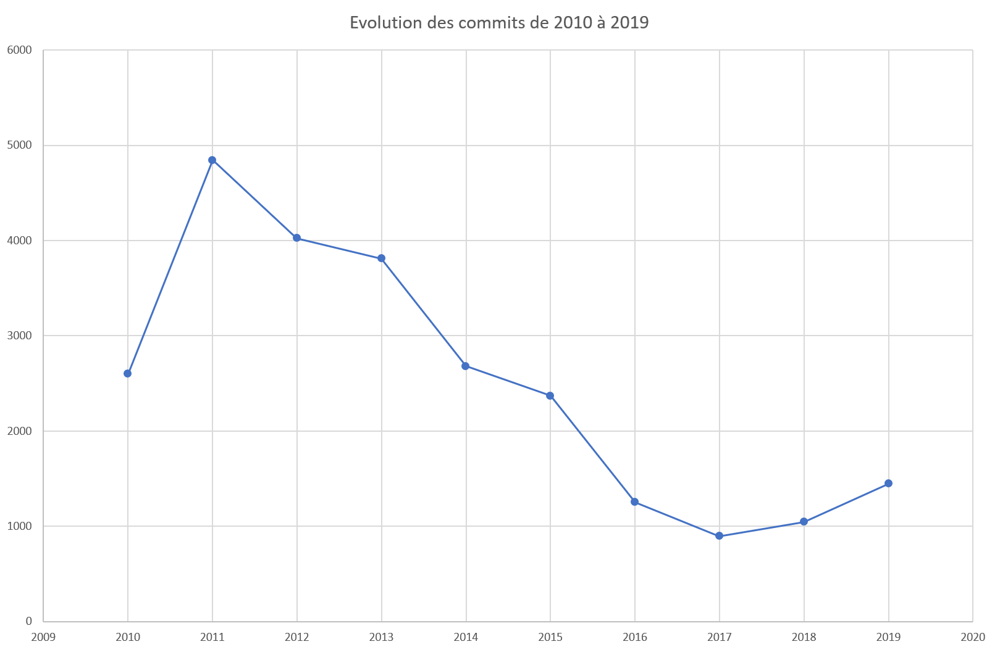
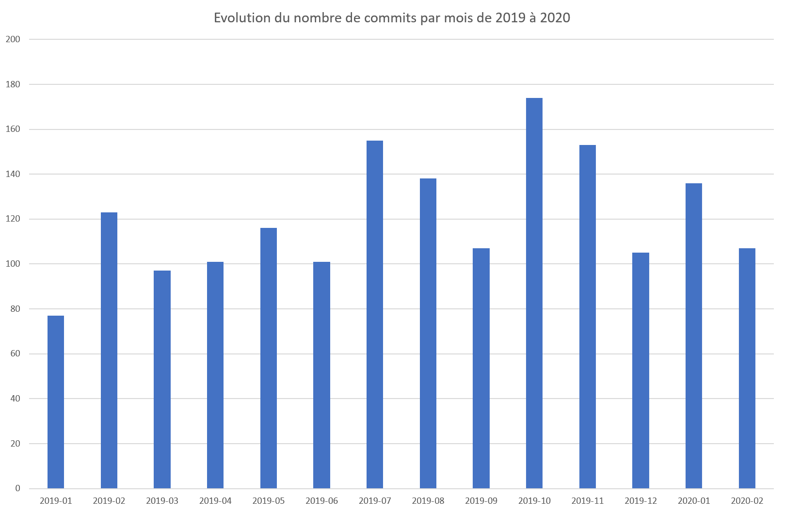
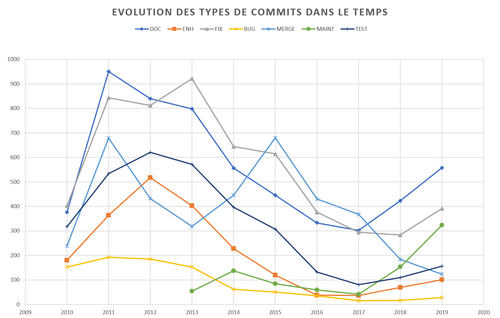
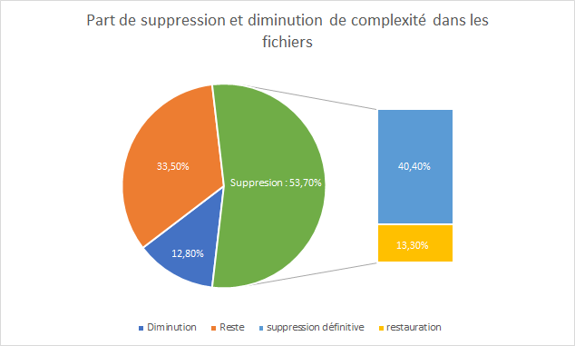
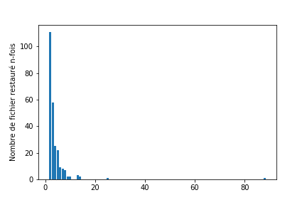
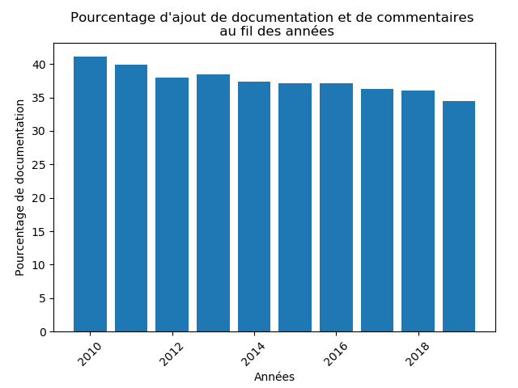
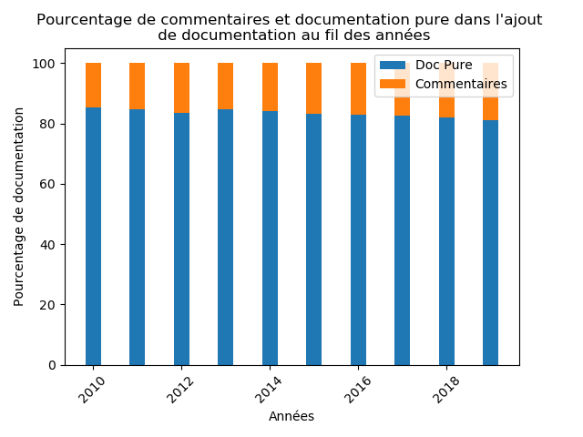
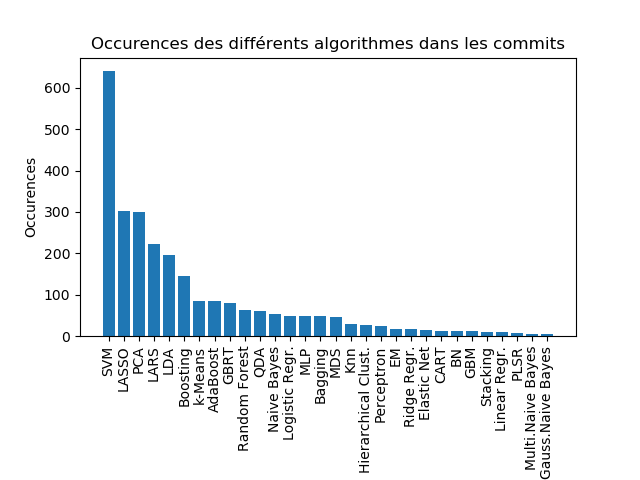
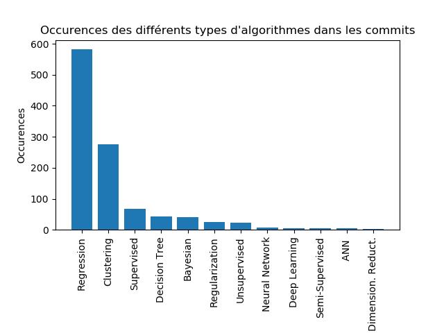

<!-- # Comment les bibliothèques de codes de Machine Learning évoluent-elles ? -->

## Auteurs :

Ce groupe est composé de 4 étudiants de Master :

* Romain GARNIER &lt;romain.garnier@etu.univ-cotedazur.fr&gt; (AL)
* Enzo ROSTAING &lt;enzo.rostaing@etu.univ-cotedazur.fr&gt; (AL)
* Sherine SOUMARE DIT SABATHIER &lt;sherine.soumare-dit-sabathier@etu.univ-cotedazur.fr&gt; (IHM)
* Nadeur MOSBAH &lt;nadeur.mosbah@etu.univ-cotedazur.fr&gt; (AL)

## Introduction :

De nos jours, le *Machine Learning* est un champ d'étude en vogue.
Il suscite l'attention de nombreuses personnes et les recherches ne font qu'évoluer.

Cet intérêt affecte de façon non négligeable les projets *Open-source*. De nombreux projets voient le jours, la population contribuant à de tels projets grandit et évolue. Nous pouvons alors nous demander comment a évolué cette population ou encore si la qualité des projets a été affectée.

Ce chapitre va présenter les résultats de nos recherches et de nos observations au travers des différentes problématiques que nous nous sommes posées. Nous présenterons tout d'abord le contexte de notre recherche, puis nous parlerons de notre démarche et enfin des résultats que nous avons obtenus.

## I. Contexte : 

### 1.1 - Pourquoi l'évolution des projets Open-Source ?

 Lors de ces deux dernières décennies, le développement collaboratif de projets open-source a connu une croissance exponentielle.
De tels projets peuvent impliquer de nombreuses personnes et de ce fait, certaines études se sont concentrées sur l'évolution et l'organisation des projets. Elles parlent alors de l'*écosystème* des logiciels. Ces écosystèmes sont alors comparés aux écosystèmes que nous pouvons retrouver dans la nature.
 
Ainsi, selon l'article *Ecological studies of Open Source Software Ecosystem*, pour pouvoir étudier cette évolution, il est nécessaire que le système sélectionné soit résistant aux changements environnementaux et ce, sans perturber de trop les communautés.
Cela implique que lors d'une période de déséquilibre, le système doit être capable de revenir à un état proche de celui de départ.
Les écosystèmes anciens et avec une grande *biodiversité* ont plus de chance d'être résistants.

Dans ce contexte, nous avons choisis d'étudier une seule bibliothèque open source de Machine Learning : **Scikit-learn**.

### 1.2 - Qu'est-ce que Scikit-learn ?

Scikit-learn est une bibliothèque *Python* destinée au machine learning.  
Le projet Scikit-learn a débuté en 2007, il s'agissait d'un projet développé par David Cournapeau pour le *Google summer of code*.
Depuis, de nombreux volontaires ont contribué au projet et il est actuellement maintenu par une équipe de volontaires. A ce jour, Scikit-learn regroupe plus de 1600 contributeurs pour un total de plus de 25000 commits.

## II. Problématiques : 

Comme précisé dans la partie précédente, notre étude se concentrera uniquement sur le projet open-source Scikit-learn.
La problématique de départ de notre étude est donc la suivante : Comment évoluent les bibliothèques Open Source de Machine Learning ?
Cette problématique étant trop générale, il nous a fallu délimiter notre sujet d'étude et nous concentrer sur certains points révélateurs. Ainsi, nous avons pu tirer trois "sous-problématiques" sur lesquelles nous avons décidé de nous pencher : 

* Problématique 1 : Quelle est l'évolution des différents types de contribution ?
* Problématique 2 : Comment la qualité du code au sein de Scikit-learn a-t-elle évoluée ?
* Problématique 3 : Quels algorithmes/techniques de Machine Learning ont reçu le plus de contribution au sein de la bibliothèque ?

### 2.1 - Quelle est l'évolution des différents types de contribution ?

Pour commencer l'analyse du projet, nous souhaitons d’abord avoir une vue générale de l'évolution du projet. Nous avons donc décidé de commencer par l’identification des types de contributions apportés au projet depuis sa création. Nous pensons que ces informations nous donnerons une idée générale de la manière dont le projet a évolué. Nous espérons aussi pouvoir estimer l'orientation qu'a pris le projet et identifier différentes périodes de développement durant l'évolution du projet.

A la fin de cette partie, nous nous attendons à ce que le nombre de commits ait augmenté depuis le début du projet. Concernant les types de contributions majoritaires, nous nous attendons à ce que cela concerne la documentation, l'ajout de fonctionnalités, les tests et les bugs.
Selon nous, plusieurs types de contributions verront le jour au cours du projet, mais les types les plus significatifs pour le projet seront toujours majoritaires.

### 2.2 - Comment la qualité du code au sein de Sickit-learn a-t-elle évoluée ?

Nous pouvons dire que le code est ce qui représente la contribution d'une communauté dans un projet Open Source. Nous avons donc souhaité nous pencher sur le code produit au travers des années et plus précisément sur sa qualité.
Cependant, cette problématique soulevait une question, qu'est-ce qu'un code de bonne qualité ? Comment mesurer cette qualité ?
Nous avons décidé d'utiliser différents facteurs, qui nous permettraient d'étudier la réponse sous différents angles. Nous étudierons alors la complexité cyclomatique des fichiers au court du temps et l'évolution de la documentation au travers des années.

Selon nous, la qualité du code et les pratiques des utilisateurs vont évoluer de façon similaire à la population d'un écosystème naturel.
Ainsi, les fichiers seront plus souvent entretenus, les complexités diminueront s'il est possible de le faire et la documentation manquante sera apportée au fil du temps.

### 2.3 - Quels méthodes/techniques de Machine Learning ont reçu le plus de contribution au sein de la bibliothèque ?

Il existe bon nombre de techniques qui sont utilisées dans le domaine du Machine Learning, leur utilisation dépendant de la tâche à résoudre.  Étant le cœur du domaine, nous avons jugé intéressant de nous pencher sur la diversité de celles-ci au sein de Scikit-learn afin d'avoir une idée de la variété de méthode qu'une bibliothèque open source peut proposer et utiliser, mais également de savoir quelles sont celles qui apparaissent le plus dans les contributions. 
Nos premières intuitions sur ces questions sont que, étant dans une bibliothèque open source, nous pouvons y trouver une large variété de techniques de Machine Learning et qu'il y aura bien certaines méthodes qui seront plus référencées que d'autres dans les contributions de la communauté (car étant plus populaires, plus accessibles à tous les niveaux des contributeurs, plus utilisées dans le domaine du Machine Learning en général, etc...).
Bien que nous jugions très intéressante cette problématique, celle-ci ne sera pas étudiée en profondeur car nous avons préféré nous focaliser en majeure partie sur les deux premières problématiques. 

## III. Recherches et expérimentations : 
### 3.1 - Outils utilisés

Pour effectuer nos expérimentations et répondre aux problématiques précédentes, nous avons décidé d'utiliser ***Pydriller***. Ce framework, utilisable via Python, permet d'analyser les répertoires Github pour en obtenir de nombreuses informations telles que les commits effectués, les modifications, les contributeurs, etc...
Avec cet outil, nous avons également utilisé la librairie ***Pyplot*** de Python, afin de mettre en forme les différents résultats que nous avons pu obtenir grâce à nos scripts Python.
De plus, nous avons utilisé ***Jupyter Notebook*** avec l'intention de mieux organiser nos codes et nos résultats.

### 3.2 - Démarches

#### 3.2.1 - Problématique 1 : Quelle est l'évolution des différents types de contribution ?

Nous avons tout d’abord remarqué que les modérateurs du projet demandaient une syntaxe particulière pour nommer un commit. Selon cette pratique, le commit doit commencer par la dénomination d'un type de commit : [MRG] pour un merge ou [DOC] pour de la documentation. Nous avons donc décidé d'effectuer des recherches sur les premiers mots de chaque commit pour obtenir l'évolution des types de contribution sur tous les commits.
Notre étude a été compliquée car certaines personnes, ne suivant pas les conventions établies, nomment mal les types de contributions et pour un même type nous aurons plusieurs dénominations différentes (DOC, Doc, DOCS...).
Pour pallier ce problème et éviter de trop nous égarer, nous nous sommes limités aux types de contributions qui revenaient le plus souvent et avons établi des "groupes de types" de contributions.
* Documentation : DOC, doc, Doc, DOCS, docs, documentation, Documentation, Document, document
* Enhancement : ENH, enh, EHN, Enh
* Maintenance : MAINT, MNT, MANIT
* Fix : FIX, fix, Fix, bugfix, fixed, fixing, Fixing,fixes, Corrected
* Bug : BUG, bug, Bug, bugs, Bugs
* Cosmetic : COSMETIC, cosmit, Cosmit, COSMIT, Cosmetic, COMSIT, Comsit, Cosmit, cosmetic
* Test : TEST, TST, Test, test, Tests, tests
* Merge : MERGE, Merge, merge, MRG			

Nous avons ensuite recherché le nombre de commits par an, pour chacun de ces groupes.

Pour cela, nous avons récupéré l'ensembles des commits sur la branche master et les avons insérés dans une table SQL. Nous avons utilisé une base de données *Postgres* pour supporter cette table. Ce choix a été fait pour comparer les méthodes d'analyse possibles. Cela nous a permis de remarquer que pour une analyse plus précise des commits, les requêtes SQL étaient plus limitées que des scripts python.

#### 3.2.2 - Problématique 2 : Evolution de la qualité du code

Pour débuter nos recherches sur la qualité du code, nous avons décidé de nous concentrer sur la complexité cyclomatique. Nous avons alors, pour chaque fichier présent dans le projet, calculé la complexité grâce à *Pydriller* puis tracé le graphe correspondant. Cette approche s'est révélée peu fructueuse car nous avons obtenu plus de 1400 tracés. Ne pouvant analyser une telle quantité de données, nous avons changé d'approche et nous avons alors décidé de compter parmi tous les fichiers présents, combien avaient subi une baisse significative de leur complexité (c'est à dire une baisse d'au moins 10 points) et combien avait été supprimés.
Pour retrouver les fichiers supprimés, nous nous sommes servis de la complexité de ceux-ci, en effet, lorsqu'une complexité est égale à "*None*", nous pouvons en déduire que le fichier a été supprimé.
Une fois le résultat obtenu nous avons eu deux nouveaux objectifs. 
Premièrement, parmi les fichiers supprimés, certains ont-ils été restaurés et si oui combien de fois et deuxièmement, quelle est la durée moyenne entre la création d'un fichier et la première baisse de complexité.
Après avoir récupéré les différentes fréquences de restauration des fichiers, nous avons souhaité en connaître la raison, malheureusement cet axe ne sera pas couvert dans notre étude pour nous éviter de nous éloigner des axes de notre recherche.

Après cela, pour avoir plus d'information sur la qualité du code et ainsi baser notre réflexion sur plus qu'un axe, nous avons fait des recherches sur la documentation.
Nous avons tout d'abord récupéré, pour chaque année, la quantité de documentation dans le code. Puis, au sein de cette documentation, nous avons cherché quelle était la part de commentaires et de *docstrings*.

#### 3.2.3 - Problématique 3 : méthodes de Machine Learning au sein de Scikit-Learn

Afin de déterminer quels techniques/méthodes apparaissent dans les contributions de la bibliothèque Scikit-learn, nous avons d'abord dû nous documenter sur le sujet. En nous basant sur plusieurs sites internets, nous avons dressé une première liste non-exhaustive, dans un tableur Excel, des techniques les plus communes et connues dans le monde du Machine Learning (leurs noms ainsi que les abréviations par lesquelles elles sont couramment nommées). A l'issue de ces premières recherches nous avons ainsi pu dresser une liste de près de 60 méthodes.
Pour chercher  leurs apparitions dans les différentes contributions, nous avons décidé d'analyser les messages des commits. Ce choix a été fait car la communauté Scikit-learn encourage ses contributeurs à faire apparaître dans les messages de leurs commits les différentes méthodes utilisées/concernées dans/par la contribution. Il devient ainsi plus simple de détecter l'apparition de celles-ci dans les contributions.
Nous avons donc, à l'aide d'un script Python et Pydriller, parcouru l'ensemble des commits du répertoire. Pour chaque commit, nous avons vérifié si le message associé contenait le nom d'une des techniques listées, ou bien l'abréviation de celle-ci (si c'était le cas, nous comptions ça comme une occurrence).
Une fois les résultats obtenus, nous les avons mis en forme à l'aide de Pyplot.

## IV. Analyse des résultats : 

À la suite des différentes démarches présentées, nous avons obtenu des résultats nous permettant d'appuyer nos hypothèses ou encore de changer complètement notre vision des choses.

### 4.1 - Métrique

Nos expériences introduisent les notions de qualité de code. Cette notion peut être évaluée grâce à différents critères : 
*  **Complexité** : Il s'agit de la complexité cyclomatique des fichiers. Cette complextié est obtenu par le biais de *Pydriller*.

*  **Documentation** : Nous parlons ici de la documentation et des commentaires dans le codes. Nous identifierons deux catégories, la documentation "pure" ou *docstrings* et les commentaires.
*  **Fréquence de restauration** : Cette métrique fait référence à la fréquence de restauration des fichiers qui ont été supprimés.

### 4.2 - Problématique 1 : Evolution des types de contribution

Dans un premier temps, nous avons observé l'évolution du nombre de commits au sein du projet depuis 2010 à 2019. Bien que le projet ait été créé en 2007, Les premiers commits sur le répertoire actuel commencent en 2010. Pour cette analyse, nous n'avons pas récupéré les commits de 2020 car, étant en début d'années, ils ne sont actuellement pas significatifs.

Comme nous pouvons le voir sur le graphique précédent, l'évolution du nombre de commits ne correspond pas à ce à quoi nous nous attendions. En effet, le nombres de commits a pratiquement doublé entre 2010 (2601 commits) et 2011 (4845 commits). Mais, le plus surprenant est que le nombre de commits a diminué progressivement depuis 2011 jusqu'à arriver à environ 896 commits en 2017.
Nous avons ensuite remarqué que le nombre de commits est légèrement en hausse depuis 2018. Nous nous sommes alors demandé si cette augmentation était visible en 2020.
Nous avons donc analysé le nombre de commits par mois sur 2019 et 2020 pour évaluer la tendance d'évolution.

Etant donné que nous n'avons que les deux premiers mois de l'année, les résultats ne permettent pas de conclure si l'évolution du nombre de commits en 2020 va continuer à augmenter ou baisser. Cependant nous pouvons observer que le nombre de commits sur les deux premiers mois de 2020 suivent la moyenne des commits de 2019.

En ce qui concerne l'évolution en détails des types de contributions, nous avons récupéré l'ensemble des commits pour chacun de ces types et avons observé leur évolution de 2010 à 2019.

* **Documentation** : Ce type de contribution est l'un des plus présent et celui qui suit le plus l'évolution des commits en générale. Cela témoigne de l'importance apporté à la documentation par les contributeurs et rassure quant à la qualité de la documentation du projet.
* **Fix** : Les commits liés à la correction des bugs sont les plus récurrents sur l'ensemble du projet. L'évolution des commits est moins constant que celui des autres, les commits ont augmenté en 2013 pour atteindre un maximum de 900 commits.
* **Enhancement** : Les commits liés à l'amélioration du code suivent la tendance générale bien que leur quantité soit moindre. Nous n'observons cependant pas de pic important après 2012.
* **Bug** : Les commits en lien avec les bugs sont ceux qui sont le moins représentés. Nous pourrons remarquer qu'ils sont continuellement en baisse et qu'après 2013, ils passent à moins de cent occurrences par an. Nous pouvons penser que cela est lié à l'évolution de bonnes pratiques, tels que les tests avant de push.
* **Merge** : Les commits référençant les merges sont ceux qui ont la représentation la moins stable. En effet, nous pouvons remarquer plusieurs pics, l'un en 2011 (comme les autres types de commit) et un autre en 2015. Après 2015, nous noterons une baisse continue des commits.
* **Maintenance** : Les contributions liées à la maintenance ne sont apparues qu'à partir 2013. Parmi les types de contributions n'étant pas présent depuis 2010, le type "maintenance" est le seul comptant suffisamment de commits pour que nous ayons pu le sélectionner. Nous pouvons noter une forte augmentation de la maintenance à partir de 2017.
* **Test** : Les commits liés aux tests suivant la tendance générale avec un pic en 2012, une baisse dans les commits puis une légère hausse à partir de 2017.

### 4.3 - Problématique 2 : Evolution de la qualité du code

Pour donner suite à notre démarche présentée plus tôt, nous avons pu tracer le diagramme circulaire suivant.
Il s'agit d'une représentation de la part des fichiers ayant subi une baisse de leur complexité et des fichiers ayant été supprimés au moins une fois. Une fois ces deux types "d'actions" extraites, nous pouvons avoir la part de fichiers *autre*, il pourra s'agir de fichier dont la complexité a augmenté ou n'a simplement pas évolué. 

Nous pouvons constater que seul 12,8% des fichiers ont eu une baisse de leur complexité, c'est moins que ce que nous pensions pour un projet aussi important. 

#### Suppression
De plus, le pourcentage de suppression est supérieur à 50%. Ceci signifie que plus de la moitié des fichiers ont été supprimés. Nous avons alors essayé de comprendre ce que représentait ce nombre, nous avons alors extrait deux catégories : les fichiers supprimés définitivement (ou par erreur) et les fichiers restaurés.
Nous parlons de suppression par erreur car, pour avoir la part de fichiers restaurés nous avons retiré les fichiers restaurés une seule fois. Ce choix a été fait car les fichiers avec une occurrence peuvent être des fichiers déplacés, des fichiers supprimés suites à une mauvaise manipulation ou autre.

Etant donné que nous n'avons pas les causes de ces suppressions, nous ne pouvons déterminer s'il s'agit de bonnes pratiques visant à supprimer les fichiers n'ayant plus d'intérêt ou s'il s'agit, par exemple, d'erreur.

#### Restauration
Nous avons 13,3% des fichiers qui ont été restaurés deux fois ou plus. Ce nombre reste faible si nous considérons *Scikit-learn* la part de fichiers supprimés.
Pour pousser un peu plus notre recherche sur la restauration des fichiers, nous avons cherché les fréquences communes de restauration.

Nous pouvons nous rendre compte que les fichiers restaurés deux fois sont les plus communs. En effet, parmi les 251 fichiers restaurés, plus de 100 l'ont été deux fois.
Nous remarquerons cependant des comportements anormaux (88 restaurations pour un fichier) qu'il aurait été intéressant de comprendre.

La restauration de fichier découle directement des suppressions. Là encore, nous manquons d'informations claires pour déterminer les causes des restaurations, cependant, nous pouvons affirmer qu'un fichier restauré 88 fois n’est pas le fruit d'une bonne pratique et n'est pas signe de qualité.

#### Complexité cyclomatique
Après cela, nous nous sommes concentrés sur les baisses de complexité cyclomatique des fichiers. Nous avons donc 12,8% des fichiers qui ont eu au moins une baisse de complexité.
Nous avons tout d'abord récupéré la date de la première baisse pour chaque fichier concerné puis nous avons calculé la durée écoulée entre la création des fichiers et la diminution de la complexité.
Le but de cette expérience est d'obtenir la durée moyenne que mettent les contributeurs à réduire la complexité du code. Cette pratique peut être vue comme une forme de maintenance et représente un point important de la qualité d'un code. 
En moyenne, la durée est de 469 jours, mais cette durée ne peut être utilisée seule, il est nécessaire de compléter cette information. 
Ainsi, selon les résultats des occurrences obtenues grâce aux scripts, nous pouvons voir, par exemple, que 47 des 152 fichiers présents ont vu leur complexité diminuer le même jour que leur création tandis qu'un fichier a dû attendre 3215 jours.

D'après ce que nous avons pu constater, de nombreux fichiers sont entretenus. Nous avons pu remarquer que certains fichiers ont été retravaillés après plus de 6 ans, ceci montre qu'il y a des personnes volontaires et qu'elles ont pour but d'entretenir et de maintenir le projet dans un état stable.

#### Documentation

La documentation fait partie des axes essentiels d'un projet Open Source, sans elle, la collaboration serait extrêmement compliquée et elle pourrait mener à des erreurs ou des duplications de fonction.

Nécessaire au bon fonctionnement, nous avons tout d'abord cherché quelle était la part de documentation dans le code.

Comme nous pouvons le constater sur le graphe ci-dessus, la présence de documentation est restée stable pendant les dix dernières années.
En effet, par rapport à la quantité de code ajoutée, la documentation occupe au moins 35% du code.

Nous avons alors voulu savoir quelle était la part de documentation "pure" ou *docstrings* servant à associer de la documentation *Python* à des modules/fonctions et la part de commentaires, laissés par les utilisateurs pour expliquer une chose précise dans la fonction.

Comme nous pouvons le constater, à l'aide du diagramme ci-dessus, la *docstrings* prévaut énormément avec une moyenne supérieure à 80%.
De plus, les commentaires, s'ils ne sont pas utilisés correctement, peuvent aussi servir à créer de la documentation. La différence avec la documentation "pure" est qu'elle ne sera pas associée aux différents modules et fonctions.

De façon générale, la documentation est restée, malgré les années, constante. 
Nous pouvons dire qu'une bonne utilisation de la documentation est faite depuis le début de ce projet et qu'elle est maintenue.

### 4.4 - Problématique 3 : Les méthodes de Machine Learning
Après avoir lancé le script servant à détecter les mentions des algorithmes dans les messages de commits, nous avons pu réduire la liste de plus de 60 algorithmes à seulement 30. En effet, plus de la moitié des algorithmes que nous avions listé n'apparaissait pas dans l'ensemble des messages des 25000 commits. Pour la clarté de l'affichage des résultats nous avons trouvé plus judicieux de nous en défaire et de ne montrer que ceux ayant au moins une occurrence.
 Les résultats obtenus sont présentés dans le schéma ci-dessous. 
 

Comme nous pouvons voir, la technique de Machine Learning ayant le plus d'occurrence dans les messages des commits est celle des *Support-Vector Machines* (SVM) avec environ 650 occurrences. Nous avons ensuite celle de *Least Absolute Shrinkage and Selection Operator* (LASSO) et de *Principal Component Analysis* (PCA) avec environ 300 occurrences. 
Même si nous n'arrivons pas à savoir pourquoi ces algorithmes ci ressortent plus que les autres (bien qu'ils apparaissent souvent dans les tops 10 des techniques de Machine Learning les plus populaires), cela nous permet tout de même d'observer un groupe de techniques/algorithmes (SVM, LASSO, PCA, LARS, LDA) bien plus présent que les autres. 
D'une manière similaire à la précédente, nous avons essayé de savoir quels types/catégories d'algorithmes sont les plus concernés par les contributions. Nous avons obtenu la figure suivante :

Nous pouvons clairement voir que les techniques de régression sont celles qui ont plus de contribution.
Dans les deux cas étudiés (occurrences des algorithmes/techniques et occurrences des types de techniques), nous ne nous attendions pas à voir une telle disparité apparaître.

Si cette problématique n'a pas été plus poussée, c'est dû aux problèmes que nous avons rencontrés lors de nos diverses expérimentations. Comme nous avons pu voir sur les graphiques, le nombre maximum d'occurrences trouvé avoisine les 600, ce qui, sur un répertoire de plus de 25000 commits nous semble quelque peu faible. Cela nous a donc amené à remettre en question la démarche utilisée. Rechercher les occurrences d'utilisation des différentes techniques, via les messages des commits peut ne pas mener à des résultats fiables. 
La première raison peut provenir de notre manière de les rechercher. En effet, nous n'avons utilisé que les noms et abréviations des méthodes de Machine Learning. Il est donc possible que ces techniques soient nommées d'une manière différente au sein de la communauté Scikit, voir même par chaque individu en général. Cela nous amène à l'autre point qui peut poser un problème, le manque de rigueur de la part des contributeurs. En effet, bien que Scikit encourage ses contributeurs à expliciter au maximum l'objet de leurs contributions, ces derniers ne suivent pas tous les règles de bonne conduite ce qui peut rendre la tâche de recherche compliquée.

## V. Conclusion : 

Au terme de cette étude, nous ne pouvons malheureusement pas expliquer comment Scikit a évolué au cours de ces dernières années et nous ne pouvons pas non plus généraliser nos conclusions aux autres bibliothèques de Machine Learning.

Notre approche initiale était trop large pour que nous puissions effectuer des expériences et avoir un semblant de résultats, nous avons donc dû réduire nos champs de recherche à trois problématiques et nous restreindre durant toutes nos expériences.

Notre première problématique s'axait sur les types de contributions et les contributions en général. Selon nous, l'intérêt, croissant, porté au Machine Learning impacterait le projet et le nombre de commit n'aurait fait qu'augmenter. 
De plus, nous nous attendions à ce qu'une augmentation de la population sur le projet impose de nouvelles règles de conduite et qu'ainsi de nouveaux types de contributions auraient vu le jour, que de nouvelles pratiques auraient été appliquées.
A notre grande surprise, le nombre de commit sur ce projet va en diminuant mais cela ne veut pas dire pour autant que l'intérêt pour celui-ci s'amoindrit. De plus, nous avons pu remarquer que certains types de commits ressortent particulièrement, la documentation qui est toujours très active et la maintenance qui est apparue tardivement mais qui gagne progressivement du terrain.
Ces deux dernières sont signes que le code est entretenu et maintenu.
Nous ne savons pas si cette tendance est propre à Scikit ou si elle s'applique aux autres projets, mais il peut être intéressant d'en chercher les causes et d'effectuer des comparaisons avec d'autres projets similaires.

Notre seconde problématique avait pour sujet la qualité du code.
Avec, en tête, l'image de l'écosystème, nous pensions que la qualité évoluerait doucement mais sûrement. Que les anciens fichiers seraient régulièrement entretenus ou supprimés en cas de besoin.
Avec les résultats obtenus, l'une des choses que nous pouvons affirmer est que la documentation est bien entretenue depuis le début. Ce point peut être propre à Scikit donc sans études des autres projets nous ne pouvons étendre notre observation.
Concernant le reste de nos observations, elles ne nous permettent pas de tirer de conclusions sur la qualité du code et les bonnes pratiques appliquées. Néanmoins, nous avons pu remarquer quelques irrégularités de comportement.

Pour notre dernière problématique, bien que celle-ci soit globalement intéressante à traiter, la démarche que nous avons utilisée n'a pas été convaincante. Face aux premiers résultats obtenus via la recherche de l'utilisation des algorithmes au travers des messages des commits, nous avons préféré ne pas pousser plus loin cette problématique. Bien qu'il aurait pu être intéressant de voir l'évolution dans le temps de l'utilisation des différents algorithmes, des résultats satisfaisants auraient été compliqués à obtenir au vu du nombre d'algorithmes et de techniques existants. 
De manière plus générale, déterminer si une technique particulière a été mentionnée ou utilisée pour une contribution reste relativement difficile. Le meilleur moyen est de se baser sur les informations données par les contributeurs, mais ceux-ci ne sont pas toujours rigoureux dans leur manière de décrire leurs contributions et de nommer les algorithmes.

Pour cette étude, certains des choix que nous avons fait peuvent être discutable et pourraient être amenés à changer. Par exemple, les choix pour la troisième problématique.

Pour conclure, cette étude n'est pas réellement une conclusion mais plus une étude générale dégageant de nouvelles problématiques qui peuvent être creuser.

## VI. Références : 

* Les [sources](https://github.com/scikit-learn/scikit-learn) du projet Scikit-learn
* L'[article](https://www.researchgate.net/profile/Tom_Mens/publication/271551387_ECOS_Ecological_studies_of_open_source_software_ecosystems/links/54ef23710cf2e55866f42b16/ECOS-Ecological-studies-of-open-source-software-ecosystems.pdf?origin=publication_detail) de Tom Mens, Maelick Claes et Philippe Grosjean traitant de l'écosystème
* Les différents sites ayant servi de référence pour la classification des algorithmes : 
    - [Top](https://towardsdatascience.com/top-10-machine-learning-algorithms-for-data-science-cdb0400a25f9) 10 des algorithmes de Machine Learning
    - Un [tour](https://machinelearningmastery.com/a-tour-of-machine-learning-algorithms/) d'horizon des algorithmes de Machine Learning
    - [L'article](https://fr.wikipedia.org/wiki/Apprentissage_automatique) Wikipédia sur le Machine Learning
* Le [lien](https://github.com/SherineSoumare/RimelScript.git) vers le Github où nous avons déposé l'ensemble des scripts et ressources utilisées pour ce projet.
