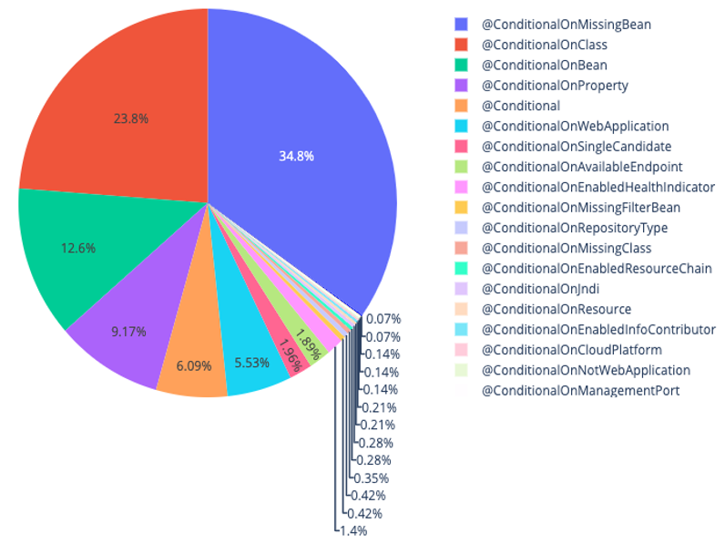
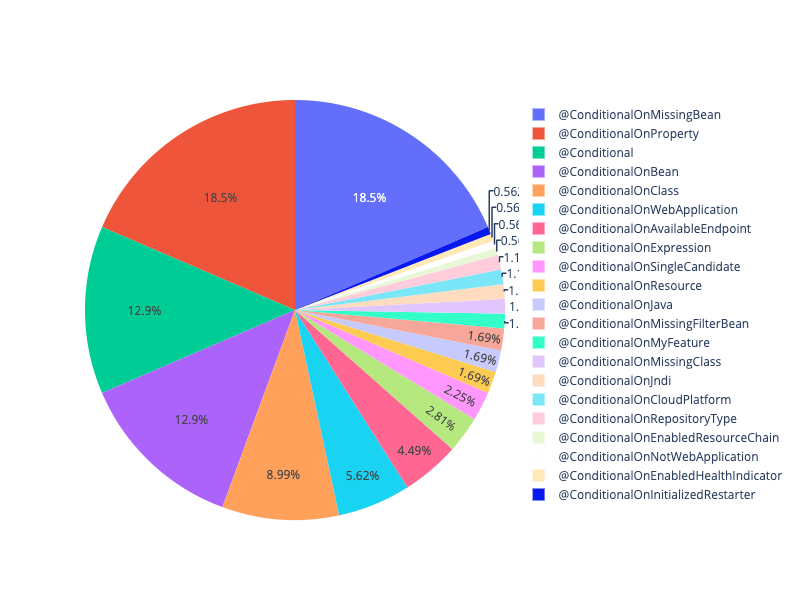
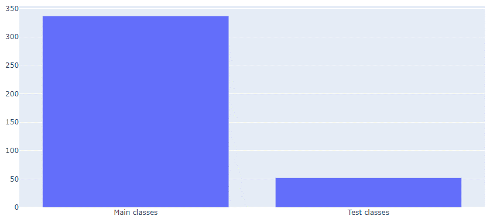
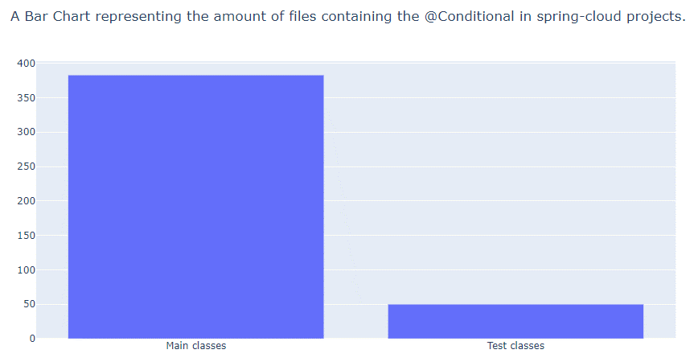
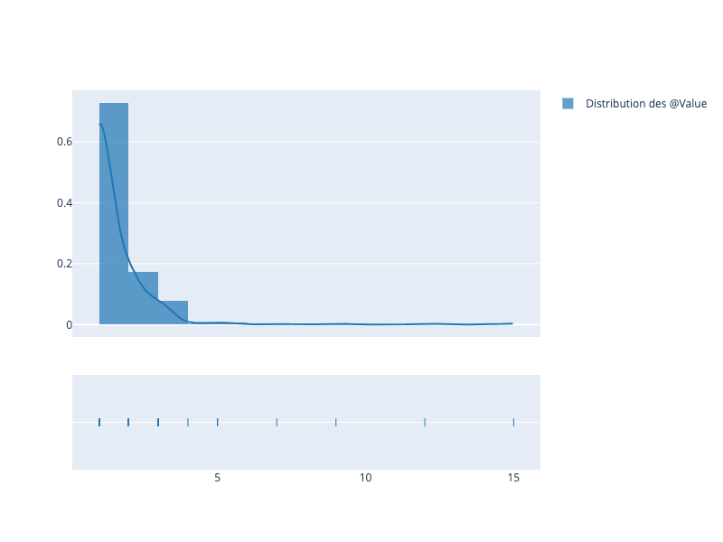

## Auteurs

Nous sommes quatre étudiants en dernière année à Polytech Nice Sophia en architecture logicielle :

* Laura Lopez &lt;laura.lopez1@etu.unice.fr&gt;
* Alexis Gardin &lt;alexis.gardin@etu.unice.fr&gt;
* Hugo Croenne &lt;hugo.croenne@etu.unice.fr&gt;
* Mathieu Paillart &lt;mathieu.paillart@etu.unice.fr&gt;

## I. Contexte de la recherche

Spring est un framework open-source qui facilite la mise en place et le développement d'applications Java. Son fonctionnement se base sur un système d'annotations. 

A l'heure actuelle, diverses annotations permettent d'effectuer de la variabilité dans Spring.
Quelques releases plus tôt, l'annotation @Profile, introduite dans la version 3.1 de Spring, était la première à apporter un mécanisme de paramétrage. En effet, avec cette annotation, nous pouvons activer des profils différents (un profil dev, un profil prod par exemple). C'est un moyen d’introduire de la variabilité basée uniquement sur des vérifications booléennes,
en lien avec les fichiers *properties* de Spring.

Cette annotation a par la suite été raffinée, notamment dans la version 4 de Spring. Elle se base désormais sur @Conditional apportant la possibilité supplémentaire de pouvoir être utilisée à l'échelle d'une méthode ce qui était impossible auparavant.
En effet, dans cette même version, l'annotation *@Conditional* de Spring fait son apparition afin de répondre à des problématiques de condition de chargement de classe en fonction d'un contexte.

Cette annotation est beaucoup plus puissante que le *@Profile*, nous pouvons effectuer de la variabilité en fonction des *Beans*. (Exemple : Si un *bean* est présent, Si un *bean* n'est pas présent, une classe, etc)
Nous pouvons donc voir que cette annotation offre de nouvelles possibilités.

C'est donc pour cette raison que lors de cette étude, nous aimerions nous concentrer sur les annotations permettant d'offrir de la variabilité incluant *@Conditional*, mais aussi *Profile*, *@Value* et *@Resource*

## II. Observation générale

Nous avions tous au sein de l'équipe déjà utilisé Spring lors de projets Polytech, mais aucun de nous n'avait utilisé l'annotation *Conditional* et nous étions peu qualifiés sur les outils de paramétrage de Spring. La première question émergeant de nos réflexions était donc :

**Comment les outils de paramétrage de Spring sont t-il utilisés et à quelle fréquence ?**

Cette question d'ordre général a été notre première étape afin d'orienter nos recherches vers d'autres questions plus précises. Au fil de nos découvertes, nous avons pu cibler un ensemble de nouvelles questions qu'il nous semblait pertinent et intéressant d'étudier.

### Comment l'annotation @Conditional est-elle utilisée ? 

N'étant pas familiers avec l'annotation, il était important pour nous dans un premier temps de rassembler le plus d'informations possible sur *@Conditional*. Nous avons remarqué durant nos recherches que l'annotation de paramétrage que l'on appelle *@Conditional* possède en réalité plusieurs déclinaisons : *@ConditionalOnMissingBean*, *@ConditionalOnClass*, *@ConditionalOnBean*, *@ConditionalOnProperty*, etc. 
Nous aimerions savoir comment l’annotation est utilisée en général ? Notamment nous souhaitons nous intéresser à la fréquence d'usage de chacune de ses déclinaisons au sein de projets afin d'en déduire qu'elles sont les annotations les plus utilisées et dans quel contexte d'usage. 
Nous aimerions aussi nous intéresser au type de fichier (configuration, propriétés, tests, etc.) au sein desquels elle est potentiellement la plus utilisée, puis étendre cette logique aux types de projets où elle est présente. Nous pensons qu’étudier son application de manière générale au sein des projets nous permettrait de pouvoir ensuite plus facilement cerner l'usage des annotations de paramétrage.

### Comment et à quelle fréquence est-elle testée ? 

Il nous paraissait d'autre part intéressant d'étudier la fréquence de test de l'annotation étudiée. En effet, cela nous permettrait de nous renseigner sur la facilité de tests de l'annotation, mais également potentiellement en déduire que son utilisation est une bonne pratique et n'affecte pas la couverture de tests d'un projet. D'autre part, nous trouvions également intéressant de savoir si celle-ci était utilisée au sein de fichiers tests dans le but de tester d'autres fonctionnalités afin d'avoir une vue d'ensemble plus large de son utilisation. 

### Quelle annotation de configuration est la plus utilisée parmi les existantes (Conditional, Profile, Value, Ressources) ? 

Nous avons pu remarquer lors de nos recherches, l'existence de plusieurs annotations de configuration autres que *@Conditional*. Nous avons tout de suite pensé qu'il serait intéressant, lorsque nous l'aurions étudiée, de la mettre en corrélation avec ses équivalents. Les autres annotations notées sont : 
- *@Profile* qui est le prédécesseur de *@Conditional*, cette annotation est apparue dans *Spring 3.1* et est principalement utilisée afin de gérer des profils définis selon des fichiers de configuration (par exemple un fichier *".properties*). Un exemple d'utilisation serait la mise en place de profils de développement (dev), production (prod) et test. Le type de *Bean* chargé pourrait ensuite dépendre du profil sélectionné. 
- *@Ressource* cette annotation n'est pas propre à Spring mais à JSR (Java Specification Requests), elle sert néanmoins également à faire de la variabilité de la même manière que les autres annotations fournies par Spring. Nous avons choisi de la prendre également en compte, car nous nous sommes rendus compte lors de nos recherches de son importance et de sa similitude avec les annotations de paramétrage Spring. Elle est d'ailleurs presque tout le temps associées à celles-ci au sein d'exemples, tutoriels et documentations. De plus, cela nous permettait également de nous apercevoir de l'utilisation générale des annotations de paramétrage, même en dehors des annotations Spring afin de pouvoir réguler notre étude.
- *@Value* cette annotation peut être utilisée pour injecter des valeurs dans des champs de *Beans* gérés par Spring et peut être appliquée au niveau d'un attribut ou constructeur/méthode d'une classe Java. Elle est apparue pour la première fois dans Spring 3.0, il s’agit donc d’une annotation ancrée dans le *framework*, nous trouvons intéressant de l’étudiant notamment en comparaison à  *@Conditional* qui est plus récente.
Il nous paraissait également pertinent dans le cadre de cette étude d'étudier la fréquence d'utilisation de chacune de ces annotations, de constater dans quel type de projet elles apparaissent le plus souvent et de constater comment elles sont utilisées au sein de ces projets. Cela nous permettrait d'établir une potentielle correspondance entre toutes ses annotations dédiées à des pratiques de paramétrage, ou d'en comprendre les différences. 

### Comment est utilisée l'annotation @Value ? 

Lors de nos recherches, une seconde annotation a particulièrement attiré notre attention, il s'agit de l'annotation *@Value*. Celle-ci peut être utilisée à la fois au niveau de méthodes, de paramètres de méthodes, de variables de classes et a permis d’introduire très tôt dès la *release* 3.0 des notions de condition et variabilité au sein des projets Spring. Sa modularité et la diversité de sa portée nous a amenés à nous demander si son mode d'utilisation se confirmait à du *tangling* (signifiant enchevêtré) ou du *spreading* (signifiant diffusé). 
De plus, nous avions envie de la mettre en opposition à *@Conditional*, la plus récente annotation de paramétrage proposée par Spring. Nous pensons également que son usage est potentiellement différent et ses conditions d’utilisation également. Nous nous attendons en revanche à ce qu’elle soit relativement présente au sein des projets Java que nous allons étudier. 

## III. Collecte d'informations

N'étant pas familiers avec les annotations de paramétrage de Spring, nous avons durant cette phase essayés de nous documenter autant que possible.
Pour cela, nous avons lu plusieurs articles qui nous ont permis d'être plus en phase avec les concepts de rétro-ingénierie et de réutilisabilité du code. Ces concepts nous ont apporté une approche différente de la tâche d'analyse, notamment en mettant en avant des processus d'automatisation. Les articles que nous avons trouvés particulièrement pertinents sont les suivants : 'Mining Implicit Design Templates for Actionable Code Reuse', 'Are Developers Aware of the Architectural Impact of Their Change', 'Titan: A Toolset That Connects Software Architecture with Quality Analysis' et son listés dans les références. 
Nous avons également longuement lu la documentation fournie par Spring, principalement au niveau de l'utilisation des annotations. Nous avons également étudié de nombreux projets hébergés par Spring sur Github. Nous avons pu trouver un grand nombre d'informations notamment au niveau des fichiers de *.changelog*, *release notes* ou au niveau des messages de *commits* des développeurs. Ces informations étaient d'ordre plus techniques, elles nous ont permis de comprendre à plus fin grain les problématiques relatives à l'utilisation de l'annotation et son utilité au sein de projets. 

## IV. Hypothèses émises et expériences réalisées

### Comment l'annotation @Conditional est-elle utilisée ?

#### Hypothèse n°1 : L'annotation @Conditional est utilisée dans des fichiers de configuration. 

Nous avions l'intuition que l'annotation devait être utilisée principalement pour de la configuration de projets. Puisque celle-ci offre notamment la possibilité de charger des *Beans* en fonction de conditions établies, cela pourrait parfaitement correspondre à un cas d’utilisation tel que le besoin d’instancier un *bean* en fonction d’un environnement donné.

#### Expérimentation

Afin de prouver notre intuition, nous allons relever la fréquence d'apparition de l'annotation dans différents fichiers au sein des différents projets du *dataset*. Pour cela, nous allons utiliser un script Python qui nous permettra d’automatiser la recherche. Nous utiliserons des libraires compatibles en Python permettant de récupérer, cloner et exploiter des projets Java. Nous allons utiliser des libraires comme PyPlot afin de générer des graphiques en fonction de nos résultats, pour rendre ces derniers plus visuels. Ce script permettra donc d’identifier la présence d’une annotation au sein de fichiers d’un projet. La reconnaissance de l’annotation est basée sur le préfixe “@” puis le nom de l’annotation et ne prend pas en compte les annotations en commentaire.
Une fois les fichiers identifiés, nous allons parser leur nom afin d'isoler les mots clefs "Configuration", "Config", "Conf". Cela nous permettra d'en déduire le pourcentage de répartition de l'annotation au sein des fichiers de configuration dans le *dataset*.

#### Hypothèse n°2 : L'annotation @Conditional est particulièrement utilisée dans les frameworks et bibliothèques. 

Nous avions l'intuition que grâce à son apport fonctionnel, l'annotation serait particulièrement utilisée au sein de *frameworks* et bibliothèques car elle facilite l’ajout de variabilité. 

#### Expérimentation

Pour vérifier cela, nous allons sélectionner un ensemble de projets différents : *Frameworks*, *API*, bibliothèques, plateformes, etc. Nous allons ensuite relever la fréquence d'apparition de l'annotation au sein de ces projets et corréler les résultats avec le type de chaque projet. Cela nous permettra d'établir s'il y a bien une distinction significative de fréquence d'apparition de l'annotation de paramétrage. Lorsqu’une annotation est présente plusieurs fois au sein d’un fichier, nous n’ajoutons pas sa présence plusieurs fois. 
Pour cela, nous allons reprendre le fonctionnement précédent à l’aide d’un script Python.

### Comment et à quelle fréquence est-elle testée ?

#### Hypothèse : L'annotation Conditional est souvent testée lorsqu'elle est utilisée. 

Ce questionnement nous permettrait d'obtenir des informations concernant la facilité de test de l'annotation, mais également si il est fréquent de tester une annotation de paramétrage et éventuellement comment celle-ci est testée. Au vue de sa fonction déterminante pour le chargement d'un *Bean*, nous avons émis l'hypothèse que *@Conditional* est généralement testée lorsqu'elle est utilisée.

#### Expérimentation

Afin de pouvoir valider notre hypothèse, nous allons séparer les fichiers des projets testés en fonction de leur package. Nous savons que pour les fichiers Java, le code source est compris dans un package *'src'* et les tests dans un package *'test'*. Nous savons également que les mots clés "Test" et "Tests" sont par convention utilisés afin de nommer les fichiers contenant des tests. Grâce à ces deux conventions, nous allons pouvoir isoler les fichiers sources des fichiers tests et procéder à deux analyses de la présence de l'annotation *@Conditional*. Nous comparerons ensuite sa présence dans les deux types de fichiers différents afin de déduire la fréquence de test. 
Nous pourrons selon les résultats obtenus effectuer d'autre recherches, comme par exemple quelle déclinaison de l'annotation est la plus testée. Nous envisageons également d'étudier manuellement au sein d'une sélection de fichiers, comment est utilisée l'annotation au sein des fichiers.

### Quelle annotation de configuration est la plus utilisée parmi les existantes (Conditional, Profile, Value, Ressources) ? 

#### Hypothèse : La répartition des annotations de paramétrage n'est pas homogène.

En constatant l’ancienneté de certaines annotations et les différences d’usage, nous avions l’impression que celles-ci n’étaient pas utilisées pour les même problématiques, au sein des mêmes projets et à fréquence également. Nous avons trouvé intéressant de ne pas nous restreindre uniquement à l’annotation *Conditional* mais étendre nos recherches aux autres annotations de paramétrages connues.

#### Expérimentation

Afin de relever la répartition des annotations au sein de projets, nous allons réutiliser le script précédent en l’adaptant aux différentes annotations. Nous allons également prendre en compte les différentes déclinaisons de *@Conditional* afin d’obtenir une comparaison optimale des annotations utilisées en pratique. 

### Comment est utilisée l'annotation @Value ? 

#### Hypothèse n°1 : L'annotation @Value utilisée dans les *if* fonctionne en *spreading* au sein d'un projet.

Le premier questionnement que nous avions concernait le spectre d’utilisation de l’annotation *@Value*. Nous avions l’impression qu’elle pourrait être utilisée de manière répétée au sein d’un même projet, afin d’appliquer dans plusieurs fichiers une même conditions, permettant d’apporter de la variabilité à l’échelle d’un projet depuis des *Beans* particuliers. 

#### Expérimentation

Afin de vérifier cette hypothèse, nous allons parser les fichiers Java contenant l’annotation. Le script d’identification d’une annotation au sein d’un fichier précédemment établie sera réutilisé. Puis nous irons chercher au sein des conditions “if”, la clause de la condition et nous la mettrons en corrélation avec les autres conditions établies au sein d’un même projet. Cela nous permettra de savoir si une condition est généralement utilisée plusieurs fois au sein d’un même projet. 

#### Hypothèse n°3 : L'annotation est fréquemment utilisée au sein de projets lambdas, mais moins utilisée que *@Conditional* au sein de bibliothèques.

Nous pensons qu’il serait intéressant d’opposer l’utilisation de *@Conditional* et *@Value*, ces deux annotations nous semblent être les plus populaires en terme de paramétrage au sein de Spring. De part la variabilité de *Bean* apportée grâce à *@Conditional*, nous pensons que celle-ci sera plus présente au sein de bibliothèques car elle correspond mieux au besoin. Néanmoins, nous pensons que l’annotation *@Value* grâce à son ancienneté et sa modularité, est globalement plus utilisée. 

#### Expérimentation

Afin de vérifier cette hypothèse, nous allons utiliser un script Python permettant de relever la présence d’une annotation au sein d’un projet Java utilisant Spring. Nous allons ensuite mettre en corrélation les résultats  obtenus pour chacune des annotations afin de valider ou réfuter l’hypothèse émise.

## V. Ressources utilisées

Afin de pouvoir fournir des réponses à nos questions, nous avons constitué un *dataset* de projets Java utilisant Spring. La récupération des *dataset* a été réalisée depuis la plateforme Github, hébergeur de projets open-source fonctionnant avec le gestionnaire de version Git. La plateforme contient des millions de projets qui nous ont permis d'établir un dataset complet et exhaustif. Il nous semblait important d’extraire les projets exemples, les tutoriels, les modules annexes de notre étude car ceux-ci ne correspondent pas à une réelle utilisation mise en contexte au sein d’un projet. Les annotations utilisées au sein de ces projets ne répondent pas à un besoin de développement mais sont incluses afin d’enseigner un usage, elles ne permettent pas de répondre à nos questions.
 Nous avons constitué notre *dataset* en deux étapes distinctes. 
Tout d'abord, le premier *dataset* était constitué uniquement de projets Spring. Ne sachant pas comment l'annotation était utilisée et son utilité précise au sein de projets, nous pensions qu'acquérir des données de renseignement au niveau du créateur de l'annotation pourrait être très enrichissant pour cette étude. Pour cela, nous avons utilisé un ensemble de projets hébergés par Spring, décrit dans le tableau suivant.

| Organisation                  | Nombre de projets        | 
|-----------------------------|----------------------|
| Spring Projects             | 48 |
| Spring Cloud             | 63 |

Nous avons par la suite constitué un second *set*, uniquement constitué de projets utilisant Spring mais n'appartenant pas à Spring. En effet, se limiter aux projets Spring n'aurait pas reflété l'utilisation réelle de l'annotation au sein de projets lambdas. Nous les avons classés dans le tableau suivant en fonction de leur type.

| Frameworks                  | Bibliothèques        | Autres                            |
|-----------------------------|----------------------|-----------------------------------|
| zkoss/zk                    | permazen/permazen    | naver/pinpoint                    |
| typetools/checker-framework | zalando/riptide      | jeremylong/DependencyCheck        |
|                             | jmrozanec/cron-utils | micronaut-projects/micronaut-core |
|                             | line/armeria         | debezium/debezium                 |
|                             | INRIA/spoon          | spring-io/sagan                   |
|                             |                      | eclipse/hawkbit                   |
|                             |                      | eugenp/tutorials                  |

## VI. Technologies utilisées 

### Jupyter Notebook 

Afin d'optimiser nos recherches, nous les avons automatisées à l'aide de scripts en Python. Le développement python était effectué sur l'outil Jupyter Notebook. Nous avons choisi cette application, car elle apportait plusieurs avantages :
* la visualisation des scripts et des résultats d'exécution directement dans un navigateur web
* la mémoire en cache des exécutions des scripts, ce qui a permit d'accélérer le développement, car les scripts n'ont pas besoin d'être relancés à chaque nouvelle exécution
* les scripts partagés avec Jupyter Notebook Collaboration au sein desquels le stockage des projets clonés se fait directement dans le cloud (Google Drive)

### Javalang

Javalang est une bibliothèque en Python permettant de parser des fichiers Java afin d'obtenir une représentation sous forme d'objets en Python. Pour cela, elle définit un modèle de données représentant un fichier Java comprenant des attributs, annotations, méthodes, références, etc. Son implémentation est basée sur la spécification de Java réalisée par Oracle, disponible sur la page suivante :  https://docs.oracle.com/javase/specs/jls/se8/html/. Cet outil nous a permis de manipuler des objets contenant toutes les informations relatives aux fichiers Java étudiés. Nous avons ainsi pu directement utiliser les champs renseignés de ces objets au sein de nos scripts Python, plutôt que parser à chaque fois un fichier reçu sous forme de chaîne de caractères pour aller récolter des informations. 

## VII. Analyse des résultats

### Comment l'annotation @Conditional est-elle utilisée ?

Nous avons effectué notre tests sur un *dataset* composé des projets Spring afin de pouvoir observer une utilisation optimale de l’annotation au sein de projets mis en place par son créateur. Nous avons obtenu la répartition suivante au niveau des déclinaisons de l’annotation : 

On compte un total de 1401 annotations du type *@Conditional* dans Spring boot avec le top 5 de fréquence de déclinaisons suivant : 
@ConditionalOnMissingBean (34,8%),
@ConditionalOnClass (23,8%),
@ConditionalOnBean (12,6%),
@ConditionalOnProperty (9,17%),
@Conditional (6,09%)

D’autre part, le projet Spring Cloud contient 1654 annotations du type *@Conditional* avec le top 5 de fréquence suivant :
@ConditionalOnMissingBean (35,7%),
@ConditionalOnProperty (20,8%),
@ConditionalOnClass (17,5%),
@ConditionalOnBean (9,31%),
@Conditional (3,51%)

On remarque que les annotations présentes en majorité sont identiques au sein des deux environnements différents bien que l’ordre soit légèrement différent. Cela nous permet de déduire que les annotations principalement utilisées sont *@ConditionalOnMissingBean*, *@ConditionalOnProperty*, *@ConditionalOnClass*, *@ConditionalOnBean* et *@Conditional*. 

Nous avons également pu observer en étudiant Spring boot plus en détails que le projet contient 337 fichiers différents pour 4,15 @Conditional en moyenne par fichier. Nous avons également pu remarquer que l’annotation est présente au sein de 316 fichiers de configuration grâce à un script isolant les fichiers de configuration des autres fichiers.

Nos analyses nous ont donc permis de répondre à la question précédemment posée : 
Comment l'annotation @Conditional est-elle utilisée ?

En relatant la fréquence d’usage des différentes déclinaisons de l’annotation ou encore la présence de l’annotation au sein d’un fichier. Nous avons pu observer que l’annotation est généralement contenue plusieurs fois au sein d’un même fichier, elle est très rarement utilisée seule. Une autre information précieuse que nous avons pu obtenir est la fréquence d’utilisation de l’annotation au sein des projets Spring. Nous avons remarqué que celle-ci était très présente, ce qui démontre une grande diversité de cas d’utilisation. 

**Notre hypothèse : “L'annotation @Conditional est utilisée dans des fichiers de configuration” est validée pour notre dataset.** 

### Comment et à quelle fréquence est-elle testée ? 

Nous avons utilisé un script Python permettant de mettre en corrélation la fréquence d’apparition des annotations *@Conditional* au sein de code source et de tests pour les projets Spring et Spring Cloud. Nous avons ensuite généré les graphiques suivants : 

**Nous considérons que notre hypothèse “l'annotation Conditional est souvent testée lorsqu'elle est utilisée” n'est pas vérifiée.** 

Nos résultats montrent une faible fréquence d'apparition de l'annotation *@Conditional* au sein de fichiers de tests. Mais ces chiffres ne permettaient pas de savoir si elle n'était pas testée par choix ou parce qu'il était difficile de la tester. Nous avons donc par la suite réalisé une recherche manuelle au niveau des projets. 

Cette deuxième phase de recherche nous a permis de comprendre que nos mesures étaient faussées pour deux raisons : 
* afin de tester les annotations *@Conditional*, il n’est pas nécessaire que celles-ci soient contenues dans un fichier de test. A l’inverse, des vérifications vont être directement réalisées sur les *Beans* chargés pour un environnement donné. Le résultat de l’utilisation de l’annotation est testé, l’annotation en elle-même n’est pas présente. 
* nous nous sommes rendus compte que malheureusement de nombreux fichiers contenant des tests au sein de notre *dataset* ne suivaient pas les conventions d’usage Java sur lesquelles nous nous étions basés pour notre script (en utilisant les mots clef “Test, “Tests”). Nous ne pouvions pas à l’échelle de si grands projets réalisée une étude satisfaisant manuellement et il était également impossible de considérer ses projets dont les noms ne suivaient aucune convention.

Nous n’avons donc pas réussi à fonder nos propos en terme de test de l’annotation. Nous n’avons donc pas pu en déduire la facilité de test de celle-ci, ni si elle risquait d’apporter une régression de la couverture de test. 

### Quelle annotation de configuration est la plus utilisée parmi les existantes (Conditional, Profile, Value, Ressources) ? 

Nous avons réalisé des scripts Python permettant de comptabiliser la présence d’annotations au sein de projets, puis restituer les informations sous les graphiques suivants : 

Nous avons pu vérifier nos intuitions, notamment l'hypothèse émise "la répartition des annotations de paramétrage n'est pas homogène". Nous avons constaté que les annotation *@Profile* et *@Resource* sont très peu présente à l'échelle du *dataset*. En revanche les annotations *@Conditional* et *@Value* sont très présente, principalement cette dernière. Nous avions supposé que de par son ancienneté, *@Value* serait probablement la plus fréquente et nos résultats prouvent ce postulat. 

D'autre part, nous avons également pu valider nos deux hypothèses suivantes : **"l'annotation est fréquemment utilisée au sein de projets lambdas, mais moins utilisée que *@Conditional* au sein de librairies"** et **"l'annotation @Conditional est particulièrement utilisée dans les frameworks et bibliothèques"** car nous observons une répartition des *@Value* forte au sein de projet lambdas. Celle-ci s'efface néanmoins au profit des *@Conditional* dans les bibliothèques.

Nous avons également pu nous apercevoir que les déclinaisons de *@Conditional* les plus utilisées au sein de ce *dataset* sont identiques à celles précédemment relevés au sein des projets Spring, ce qui confirme notre analyse en terme d'utilisation de l'annotation. 

### Comment est utilisée l'annotation @Value ? 

Grâce à un script complet d'analyse de l'annotation *@Value* au sein des fichiers Java des projets du *dtaset*, nous avons pu établir le tableau suivant : 

| Informations concernant cette annotation              | Valeurs trouvées | 
|-----------------------------|----------------------|
| Nombre de fichier contenant l'annotation @Value                   | 207  |
| Nombre de fichiers de configuration contenant l'annotation @Value | 54   |
| Nombre d'attributs ayant l'annotation @Value                      | 2533 |
| Nombre d'attributs uniques ayant l'annotation @Value              | 274  |
| Nombre de if ayant un @Value en paramètre                         | 195  |
| Nombre d'attributs avec @Value unique utilisé dans un if          | 19   |

On remarque que celui-ci démontre une présence forte de l'annotation *@Value* pour les attributs. On remarque également qu'elle est contenu dans de nombreux fichiers et utilisée assez souvent dans des conditions *if*. 

Nous nous sommes intéressés à l'étalement des conditions *if* d'un *@Value* sur plusieurs fichiers et avons restitué nos résultats sous le graphique suivant : 

On remarque notamment que le @Value le plus présent est dans 15 fichiers différents. Cette étude confirme une utilisation de l'annotation *@Value* en mode *spreading* au sein des projets.  Notre hypothèse **"l'annotation @Value utilisée dans les *if* fonctionne en *spreading* au sein d'un projet" est vérifiée.**  

## VIII. Synthèse

Nous pouvons désormais répondre la question posée au début de la démarche : **Comment les outils de paramétrage de Spring sont t-il utilisés et à quelle fréquence ?** 

Nous pouvons constater que certains projets utilisent uniquement @Value afin d’ajouter de la variabilité. Les projets provenant majoritairement des dépôts de Spring utilisent le @Conditional, ce qui nous paraît logique, étant donné qu’ils ont crée l’annotation, ils maîtrisent son utilisation, cependant l’annotation @Value est aussi utilisée. Concernant d’autres projets, @Conditional est la seule annotation utilisée. 
De plus, nous voyons que 6 dépôts ne contiennent pas d’annotations @Value ou @Conditional.

Les résultats obtenus cependant sont à prendre avec des pincettes, en effet le parseur que nous avons utilisé *JavaLang* n’arrivait pas à parser certaines classes (qu’il détectait comme étant mal formées), donc il est possible que nous passions à côté de certains résultats, étant donné que certaines classes n’ont pas été prises en compte lors de l’étude. 

Nous remarquons donc que la fréquence d'utilisation des annotations varie selon l'annotation mais également selon les projets évalués.

Nous concluons cette étude en ayant appris beaucoup sur l'utilisation des annotations de paramétrages de Spring en général mais aussi plus particulièrement concernant *@Conditional* et *@Value* sur lesquelles nous nous sommes concentrés. Nos hypothèses ont pu être vérifiées ou réfutées grâce à des expériences mises en place sur un *dataset*. Ces expériences ont été aussi bien manuelle, qu'automatiques grâce à l'utilisation de scripts Python.
Il est important de noter que nos résultats sont à pondérer, tout d'abord compte tenu du nombre de projets évalués. Nous avons sélectionné 111 projets relatifs à Spring puis 14 projets d'organisations diverses. Ce *dataset* est assez restreint et pourrait ne pas être assez représentatif des projets Java utilisant les annotations de paramétrage fournies par Spring. De plus, les projets récoltés sont uniquement issus de la plateforme Github, cela constitue également un biais non négligeable bien qu'il s'agisse d'une plateforme extrêmement populaire, utilisée dans l'hébergement de projets.

## IX. Références

https://spring.io/docs  
[Mining Implicit Design Templates for Actionable Code Reuse](http://linyun.info/micode/micode.pdf)  
[Are Developers Aware of the Architectural Impact of Their Change](http://www0.cs.ucl.ac.uk/staff/j.krinke/publications/ase17.pdf)  
[Titan: A Toolset That Connects Software Architecture with Quality Analysis](https://www.cs.drexel.edu/~lx52/LuXiao/papers/FSE-TD-14.pdf)  
[https://github.com/naver/pinpoint](https://github.com/naver/pinpoint)  
[https://github.com/permazen/permazen](https://github.com/permazen/permazen)  
[https://github.com/jeremylong/DependencyCheck](https://github.com/jeremylong/DependencyCheck)  
[https://github.com/micronaut-projects/micronaut-core](https://github.com/micronaut-projects/micronaut-core)  
[https://github.com/zkoss/zk](https://github.com/zkoss/zk)  
[https://github.com/spring-projects/spring-boot](https://github.com/spring-projects/spring-boot)  
[https://github.com/typetools/checker-framework](https://github.com/typetools/checker-framework)  
[https://github.com/debezium/debezium](https://github.com/debezium/debezium)  
[https://github.com/spring-io/sagan](https://github.com/spring-io/sagan)  
[https://github.com/eclipse/hawkbit](https://github.com/eclipse/hawkbit)  
[https://github.com/zalando/riptide](https://github.com/zalando/riptide)  
[https://github.com/spring-projects/spring-framework](https://github.com/spring-projects/spring-framework)  
[https://github.com/eugenp/tutorials](https://github.com/eugenp/tutorials)
[https://github.com/INRIA/spoon](https://github.com/INRIA/spoon)

