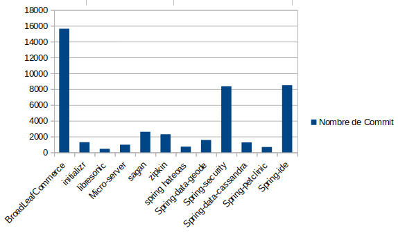
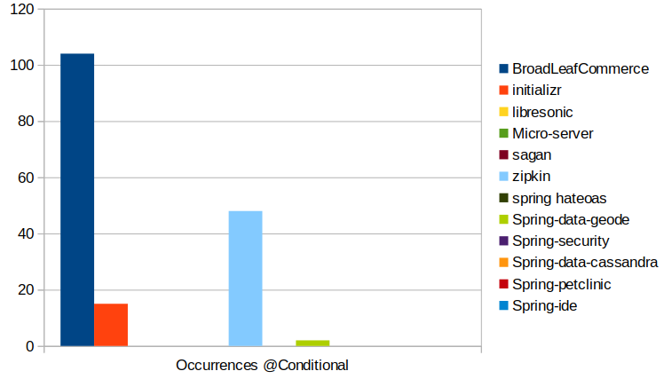
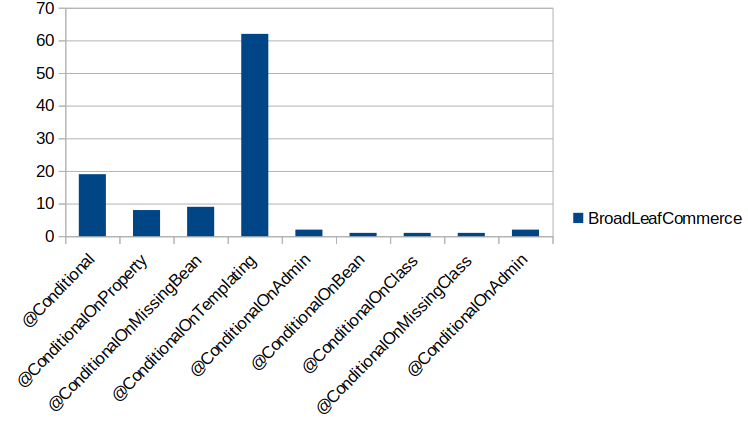
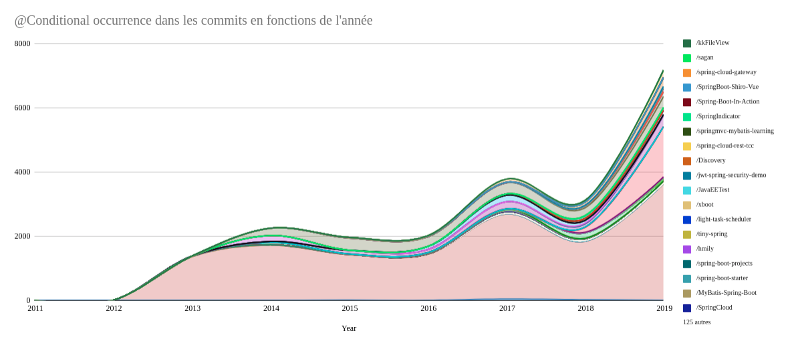

## Authors

We are four students in last year of Polytech' Nice-Sophia specialized in Software Architecture :

* Brandon Fontany-Legall &lt;brandon.fontany--legall@etu.unice.fr&gt;
* Thomas Mahe &lt;thomas.mahe@etu.unice.fr&gt;
* Aymeric Valdenaire &lt;aymeric.valdenaire@etu.unice.fr&gt;
* Michel Marmone--Marini &lt;michel.marmone--marini@etu.univ-cotedazur.fr&gt;

## I. Research context /Project

Spring est un framework qui permet de concevoir des applications Java plus simplement. Spring fournit un ensemble d'annotations pour aider le développeur dans la confection de son application et nous permet notamment de créer des composants et de les faire communiquer simplement.

Dans ce contexte, il est intéressant de voir comment créer et configurer les dits composants dans les projets Spring. 
Nous allons plus spécifiquement étudier comment configurer la création de beans en fonction de conditions définies au préalable. 

Dans cette optique, Spring 3.1 a introduit l'annotation @Profile qui permet de créer des beans en fonction des profils qui sont en général définis dans les fichiers de configuration XML.
Dans Spring 4, l'annotation @Profile existe toujours cependant une nouvelle annotation a été introduite qui est @Conditional. Cette annotation permet, tout comme @Profile, de configurer les beans. 
Cependant, @Conditional permet de créer une configuration sans @Profile préalable, notamment basé sur des stratégies sous format booléennes. Cette nouvelle approche permet une plus grande liberté de création de stratégie, notamment, n'importe quelle stratégie peut être utilisée tant qu'elle est testable par valeur booléenne.

Nous allons donc, dans notre étude, nous concentrer sur cette nouvelle annotation, @Conditional, et définir quels sont les impacts de cette annotation sur les projets Spring.

{:height="50px" }

## II. Observations/Question générale

### Comment sont configurés les projets Spring à l'aide de l'annotation @Conditionnal

Nous nous sommes alors intéressés à ce changement effectué de @Profile vers @Conditional et notamment pourquoi @Profile a été remplacé par @Conditional.
D'après ce que nous avons vu dans nos recherches, ce changement a été posé par une demande de la part de la communauté, il nous paraît donc intéressant de voir quels sont les cas d'usage qui impliquent une telle modification.

Pour ce faire, nous nous sommes posé plusieurs sous-questions auxquelles nous pourrons répondre à l'aide de metrics dont l'extraction est automatisable.

#### 1. Est-ce que le @Conditional a été adopté ?

L'annotation a été poussée par la communauté, comme vu précédemment. 
Il est donc, d'après nous, intéressant de savoir si cette dernière a été adoptée par la communauté.
En effet, ceci permettrait de savoir si cette nouvelle annotation répond bien aux attentes qui ont entraîné sa création.

Pour ce faire, nous pouvons regarder dans les projets Github utilisant Spring le taux d'apparition de l'annotation @Conditional.

#### 2. Comparaison de l’utilisation de @Profile et @Conditional

Après l'introduction de la nouvelle annotation, il est intéressant de savoir si l'ancienne annotation @Profile est remplacée par @Conditional.

Nous pouvons donc, pour faire ceci, récupérer la liste des git diff dans chaque projet Spring utilisant l'une des deux annotations.
Nous aurons donc la liste des ajouts et retraits de chacune des annotations.

L'analyse sur les commis nous permet de faire ressortir l'information concernant l'évolution de l'annotation dans le temps.
En effet chaque commit est associé à une date. Avec l'outil PyDriller nous avons pu parcourir l'ensemble des commits pour chaque projet. Pour chaque commits nous nous sommes intéressés à dénombrer chaque ajout dans le code des annotations @Conditional et @Profile. Les données résultantes sont ensuite triées en fonction des années.

#### 3. Comment sont utilisés les différentes variantes de @Conditional ?

Nous avons observé que l'annotation @Conditional n'a pas été seule. 
En effet, une multitude de variantes ont été introduites qui sont :
- @ConditionalOnProperty : @Conditional qui vérifie si une propriété, qui par défaut est présente dans l'environnement a une valeur spécifique
- @ConditionalOnWebApplication : @Conditional qui est valide dans le cas où l'application courante est une application web. Cette application web peut notamment être de type spécifique, dont le mode servlet ou réactive.
- @ConditionalOnClass : @Conditional qui est valide uniquement si la classe spécifiée est présente dans le classpath.
- @ConditionalOnMissingBean: @Conditional qui n’est valide uniquement quand aucun autre bean n'est pas déjà instancié.
- @ConditionalOnExpression : @Conditional basé sur les résultats SpEL (Spring Expression Language)

Il est donc intéressant de savoir comment la communauté Spring utilise ces annotations. 
Pour ce faire, nous allons regarder les occurrences dans les différents projets Spring de chaque variante et voir dans quel contexte avec les raisons d'ajout/remplacement.

#### 4. Quels autres mécanismes peuvent remplacer @Conditional ?

Il existe d'autres mécanismes permettant de configurer son projet Spring. Par exemple, l'annotation @Profile toujours utilisé couvre une partie des fonctionnalités proposée par @Conditional. 

Notre approche est de comparer le nombre d'occurrences de l'annotation par rapport au nombre d'occurrences de l'annotation @Profile, @Value et @Resource, l'objectif étant de déterminer si d'autres mécanismes utilisant ces annotations permettent de remplacer @Conditional.

#### 5. Est-ce que @Conditional est vraiment utile et dans quels cas ? 

Comme nous avons dit précédemment l'annotation @Conditional a été réclamé par la communauté, il est donc intéressant de se demander si elle a été adoptée. Afin de répondre, nous allons comparer le nombre de projets sans l'annotation @Contional par rapport au nombre de projets avec au moins une occurrence de l'annotation.

La deuxième partie de la question "dans quel cas" est plus complexe à traiter. En effet, nous n'avons pas pu proposer de metric dont l'extraction est automatisable afin de déterminer le contexte d'utilisation de l'annotation.

## III. Information gathering & Tools

### La récupération des projets

Pour la base de nos recherches, nous avons utilisé les projets Github que nous allons récupérer par clonage de façon automatique.
Bien évidemment, tous les projets Github ne sont pas intéressants pour nous, c'est pourquoi nous devons mettre des règles de filtrage et notamment en utilisant l'API de Github.
- Pour commencer, le projet doit contenir du java ce qui va permettre d'écarter énormément de projets
- De plus, nous avons trié par mot clé à l'aide du mot clé "spring"
- Pour finir, nous avons pris les projets avec le plus d'étoiles et qui sont donc susceptibles d'être plus intéressants à étudier

### La récupération de données dans les projets

Une fois les projets récupérés, nous avons utilisé des scripts Python pour récupérer les différentes données.

#### Pydriller

Pour notre étude, nous avons utilisé [PyDriller](https://github.com/ishepard/pydriller) qui est framework pour l'analyse de repository Git. Nous pouvons notamment extraire les commits, les modifications, les diffs et le code source.

#### Autre scripts
En addition à Pydriller, nous avons effectué de multiples codes Python pour analyser le code des différents projets. Ces scripts nous permettent notamment de chercher le nombre d'apparitions des annotations dans le code.

__**Notre repository est présent ici :**__ [https://github.com/FontanyLegall-Brandon/SpringProjectDriller.git](https://github.com/FontanyLegall-Brandon/SpringProjectDriller.git)

## IV. Hypothesis & Experiences

Nos hypothèses correspondent aux questions posées dans la partie II.
* L'annotation @Conditional a été adoptée par la communauté au détriment de l'annotation @Profile 
* Les variantes de l'annotation @Conditional sont utilisées pour configurer les projets Spring
* L'annotation @Conditional est préférée aux autres mécanismes de configurations 
### Première analyse 
Nous avons pris comme hypothèse de départ que l'annotation avait été adoptée.
Pour vérifier cette hypothèse, nous avons récupéré des projets et regardé le nombre d'apparitions dans ces projets.

Dans cette première expérimentation, nous avons pris 12 projets choisis au préalable. 

Nous avons notamment, dans les plus remarquables, BroadleafCommerce qui est un framework de site e-commerce, Spring sécurité qui fournit un service de sécurité pour Spring ou encore Spring IDE qui améliore Eclipse avec des outils pour créer des applications basées sur Spring.

Avec ce dataset, nous avons analysé le nombre d'occurrences de @Conditional. 

Nous nous sommes donc aperçus que, au niveau du dataset choisi, l'utilisation des annotations dépend du projet et donc du contexte.
Nous avons aussi analysé les différentes variantes dans le projet BroadLeafCommerce qui utilise le plus de Conditional de notre dataset.

Nous nous sommes aperçus que dans ce projet, une annotation particulière était utilisée (@ConditionalOnTemplating).
Or, cette annotation n'existe pas dans Spring, c'est une annotation créée par BroadLeafCommerce.
Cette fameuse annotation créée utilise une classe de matcher qui correspond à l'ancienne implémentation via @Profile.
Nous avons donc déjà une première réponse à notre questionnement.

Cependant, ce dataset n'est pas assez grand donc nos résultats ne sont pas assez significatifs pour en sortir des conclusions.

### Agrandissement du dataset
Suite à notre première analyse, il nous a semblé clair que notre dataset n'était pas suffisamment large. Nous nous sommes donc aidés de l'API github afin de récupérer un grand nombre projets respectant les critères de recherche précédemment cités. Nous avons récupéré l'ensemble des projets que nous étudions via deux requêtes à cette API.

Nous avons appliqué les filtres sur nos deux requêtes. Dans la première nous nous intéressons à l'ensemble des projets github, alors que dans le second seulement aux projets appartenant à l'organisation "Spring".

Finalement, nous avons récupéré 214 projets qui constituent notre dataset.

### Experience
Notre objectif est de répondre aux questions posées dans la section II. Nous utiliserons donc les métriques présentés précédement afin d'y répondre.

## V. Analyse des résultats

### Adoption de l'annotation @Conditional
Nous avons analysé le nombre d'apparitions de l'annotation @Conditional dans les 214 projets. Il est important de noter qu'il est possible que certains projets ne soient pas représentatifs (tutoriels, etc.) ce qui peut produire un biais dans notre analyse. Toutefois, nous estimons que cela est négligeable, car nous travaillons sur un grand nombre de projets.
Le graphique ci-dessous représente le nombre d'occurrences de l'annotation dans chaque projet. Le graphique est à l'échelle logarithmique afin d'avoir une meilleure représentation des résultats. On remarque que le projet spring-boot se distingue des autres projets. Cette observation n'est pas étonnante, car spring-boot fournit des conditions prédéfinies afin que les développeurs n'aient pas à les implémenter eux-mêmes.

Finalement, il ressort de cette analyse qu’uniquement 68 des 214 projets utilisent l'annotation soit environ 32%. Nous nous sommes demandé avant de conclure s’il était possible que la date de création du projet soit un facteur pouvant altérer ces résultats. Nous avons donc effectué une deuxième analyse du dataset en ne prenant en compte cette fois que les projets créés en 2013 (année de la release de spring 4.0 et donc de l'intégration de l'annotation @Conditional). 
Nous avons constaté cette fois que 57 projets sur les 146 projets débutant en 2013 utilisaient l'annotation soit 39%. Ces résultats semblent cohérents, en effet remplacer les anciens mécanismes de configuration par l'annotation @Conditonal peut-être un processus complexe, qui n'est effectué que lorsqu'il existe un réel besoin.  

Nous estimons donc que l'annotation a bien été adoptée par les développeurs puisque 32% de l'ensemble des projets analysés et 39% des projets créés à partir de 2013 l'utilisent.  

### Comparaison de l’utilisation de @Profile et @Conditional

Afin de comparer l'utilisation des deux annotations :
- Dans un premier temps, nous avons comparé l'utilisation ou non des deux annotations dans chaque projets.
- Puis dans chaque commits nous avons comparé le nombre d'apparitions de l'annotation pour voir si nous observons un changement de tendance de la part de l'annotation @Profile au moment de l'introduction de l'annotation @Conditional.

Le tableau ci-dessous nous montre le pourcentage de projets utilisant chaque annotation et le pourcentage de projets créés à partir de 2013. 

|          | Projets | Projets créés aprés 2013 | 
| -------- | -------- |-------- | 
|@Conditional|	32%| 39%|
| @Profile |	23%| 21%|

Nous pouvons voir que l'annotations @Conditional est préférée à @Profile, ces résultats ne sont pas étonnants puisque @Conditional est une version de @Profile avec l'ajout d'améliorations comme la possibilité de vérification par expression booléenne. De plus, nous remarquons une diminution de l'utilisation de @Profile contre une augmentation de l'utilisation de @Conditional dans les projets créés à partir de 2013.

A cette analyse peut s'ajouter l'analyse des commits pour chaque projet. Avec l'outil PyDriller nous avons exploré les commits pour chaque projet afin de comparer l'évolution des annotations dans le temps.

Le graphique ci-dessus représente le nombre d'occurrences de l'annotation @Conditional dans les commits en fonctions des années. Nous observons dans ce graphique que le nombre d'apparitions de l'annotation @Conditonal est croissant dans le temps. Encore une fois le projet spring-boot influence les résultats. 

Le graphique ci-dessus représente le nombre d'occurrence de l'annotation @Profile dans les commits en fonctions des années. 

Notre hypothèse de départ était que l'annotation @Conditionnal avait remplacé l'annotation @Profile dans les projets. Cependant au vu des deux courbes (et surtout de l'échelle) il apparait clairement que ce n'est pas le cas. En effet l'échelle du graphique représentant les occurrences de @Conditional est 40 fois supérieure à celle de @Profile. Même en ne prenant pas en compte "Spring-boot" la différence entre le nombre occurences des annotations reste significatif. De plus nous avons constaté dans notre dataset que l'annotation @Profile est plus souvant utilisée en association à l'annotation @Conditionnal. Au vue de ces éléments, nous pouvons dire que l'annotation @Conditional a répondu à un besoin auquel l'annotation @Profile ne répondait pas. 

### Utilisation des différentes variantes de @Conditional

Nous avons regardé dans chaque projet la proportion de chaque variante de l'annotation. L'histogramme ci-dessous affiche le nombre d'occurrences de chaque annotation dans chaque projet de notre dataset. 

Le tableau ci-dessous nous montre le nombre de projets utilisant chaque annotation.

| Annotation | Nombre de projets |Pourcentages | 
| -------- | -------- |-------- | 
|@Conditional| 21|10%|
|@ConditionalOnProperty |42|20%|
|@ConditionalOnMissingBean |36|17%|
|@ConditionalOnAdmin |0|0%
|@ConditionalOnBean| 32|15%
|@ConditionalOnClass|45|21%
|@ConditionalOnMissingClass|12|6%

Nous remarquons qu'un projet influence nos résultats (spring-boot pour la même raison qu'énoncée précédemment). Nous remarquons qu’aucun projet n'utilise l'annotation @ConditionalOnAdmin. De même, il y a très peu d'occurrences de l'annotation @ConditionalOnMissingClass, cela peut être expliqué par le fait qu'il existe l'annotation inverse @ConditionalOnClass et qu’elle est la plus utilisée. 

Une autre valeur intéressante est le nombre de projets utilisant l'annotation @Conditional de base, il n'y en a que 21. Cela montre que les variantes définies par spring-boot sont utilisées par les développeurs.

### Autres mécanismes pouvant remplacer @Conditional

Nous sommes intéressés aux autres mécanismes pouvant permettre le paramétrage de projets Spring. Nous avons donc comparé l'utilisation de @Conditional par rapport à @Profile, @Value et @Ressource. Afin de savoir qu'elles sont les moyens répandus pour configurer un projet Spring. Nous avons notamment effectué plusieurs recherches dans l'outil google trend. Nous avons vu que le sujet "yaml" est souvent associé à cette recherche.  Nous avons donc cherché dans notre dataset toutes les occurrences pour chacune de ces annotations et le nombre de fichiers yaml dans les projets. 

|  | Nombre de projets | Pourcentages
| -------- | -------- | -------- | 
|@Conditional| 68| 32%|
|@Profile |48| 22%|
|@Value |123| 58%|
|@Resource |52| 24%|
|Yaml| 97| 45%|

Nous obtenons les résultats présentés dans le tableau ci-dessus. Nous remarquons que l'annotation @value est utilisée dans environ la moitié des projets. Cette annotation permet d'injecter des valeurs dans les champs des beans gérés par Spring.

Nous nous regardons seulement les projets ne faisant aucune référence a @Conditional et nous regardons si ces projets utilisent @Resource, @Value, @Profile ou des fichiers yaml. L'objectif de cette approche est de déterminer une corrélation entre l'absence de l'annotation @Conditional et la présence d'une autre annotation ou de fichier yaml.

Dans un premier temps, nous remarquons que 20% des projets n'utilisent aucun de ces mécanismes. Soit ils utilisent d'autres mécanismes de configuration, soit le projet n'a pas besoin de configuration.

<table class="tg">
  <tr>
    <th class="tg-0pky">Annotations</th>
    <th class="tg-0pky" colspan="2">Sans @Conditional</th>
    <th class="tg-0pky" colspan="2">Avec @Conditional</th>
  </tr>
  <tr>
    <td class="tg-lboi"></td>
    <td class="tg-lboi">Nombres projets</td>
    <td class="tg-lboi">Pourcentages</td>
    <td class="tg-lboi">Nombres projets</td>
    <td class="tg-lboi">Pourcentages</td>
  </tr>
  <tr>
    <td class="tg-0pky">@Profile</td>
    <td class="tg-0pky">23</td>
    <td class="tg-0pky">11%</td>
    <td class="tg-0pky">25</td>
    <td class="tg-0pky">12%</td>
  </tr>
  <tr>
    <td class="tg-lboi">@Value</td>
    <td class="tg-lboi">67</td>
    <td class="tg-lboi">31%</td>
    <td class="tg-lboi">56</td>
    <td class="tg-lboi">27%</td>
  </tr>
  <tr>
    <td class="tg-lboi">@Ressource</td>
    <td class="tg-lboi">30</td>
    <td class="tg-lboi">14%</td>
    <td class="tg-lboi">22</td>
    <td class="tg-lboi">10%</td>
  </tr>
  <tr>
    <td class="tg-lboi">Yaml</td>
    <td class="tg-lboi">52</td>
    <td class="tg-lboi">24%</td>
    <td class="tg-lboi">45</td>
    <td class="tg-lboi">21%</td>
  </tr>
</table>

Le tableau ci-dessus représente le nombre de projets ayant au moins une occurrence de chaque annotation ou au moins un fichier yaml, qui utilise l'annotation @Conditional. Nous remarquons que @Profile est utilisé dans moins de projets sans @Conditonal, alors que tous les autres mécanismes sont utilisés dans plus de projets lorsqu'il n'y a pas de @Conditional.
Ces résultats ne nous permettent pas d'en sortir une corrélation.

### L'annotation @Conditional est-elle vraiment utile ?

Au vu des éléments vus précédemment nous pouvons répondre positivement à cette question. En effet, nous avons observé que l'annotation a été réclamée par la communauté ainsi qu'environ 32% des projets de notre dataset l'utilisent au moins une fois. 

## VI. Conclusion

Nous avons comparé l'utilisation des annotations @Conditional et @Profile de cette analyse nous en concluons que bien que @Conditional apporte plus de fonctionnalité que @Profile, mais elle ne l'a pas totalement remplacé.

Nous avons vu que les développeurs préfèrent utiliser les variantes de l'annotation définie par Spring-boot, plutôt que la version de base.

Nous avons vu que @Conditional est présent dans environ 32% des projets, et que 20% des projets que nous avons dans notre dataset n'utilisent aucun des mécanismes de configurations que nous avons étudiés, cela laisse à supposer qu'il existe d'autres moyens afin de configurer les projets Spring que nous n'avons pas pu étudier.

Nous avons cependant certaines pistes d'amélioration pour l'avenir au niveau de nos métriques. En effet, nous avons remarqué, lors de l'analyse des git diff, que certains commentaires pouvaient impacter nos statistiques. De plus, une [recherche en fonction des conditional dans les fichiers de tests](https://regex101.com/r/DTZRmB/1) pourrait être une piste intéressante pour les études futures.

## References

Outils : [https://github.com/FontanyLegall-Brandon/SpringProjectDriller.git](https://github.com/FontanyLegall-Brandon/SpringProjectDriller.git)

1. https://docs.spring.io/spring-framework/docs/current/javadoc-api/overview-summary.html
2. https://docs.spring.io/spring-framework/docs/current/javadoc-api/org/springframework/context/annotation/Conditional.html 
3. https://github.com
4. https://blog.ippon.fr/2014/01/07/conditional-de-spring-4-au-coeur-de-lauto-configuration-de-spring-boot/
5. https://javapapers.com/spring/spring-conditional-annotation/ 
6. https://github.com/BroadleafCommerce/BroadleafCommerce
7. https://github.com/spring-projects/spring-security
8. https://github.com/spring-projects/spring-ide
9. https://github.com/ishepard/pydriller