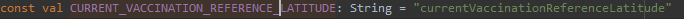
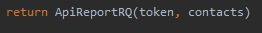
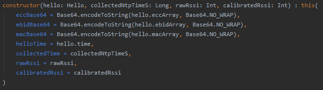
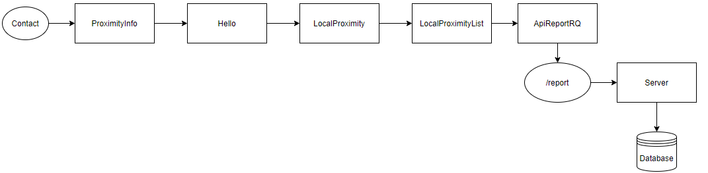
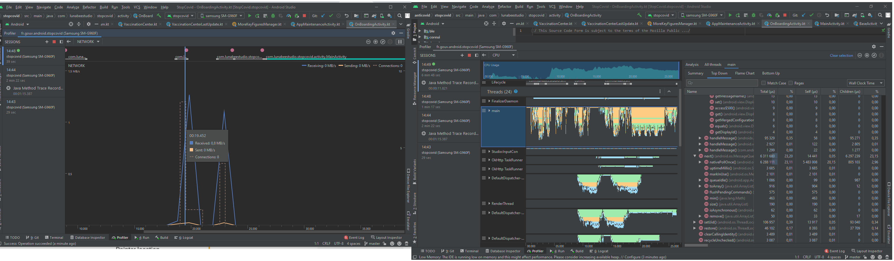
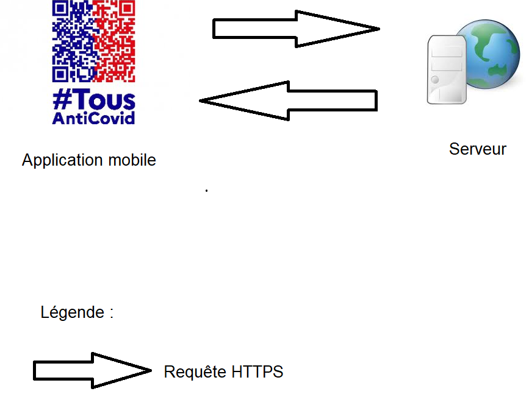
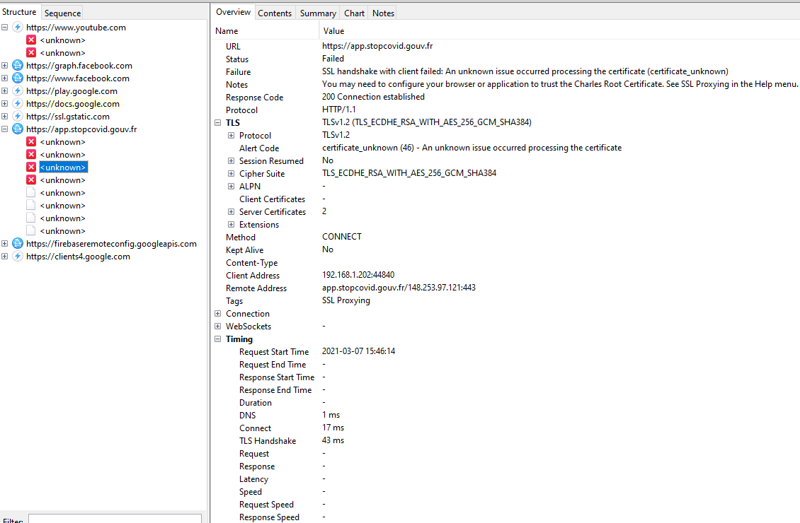
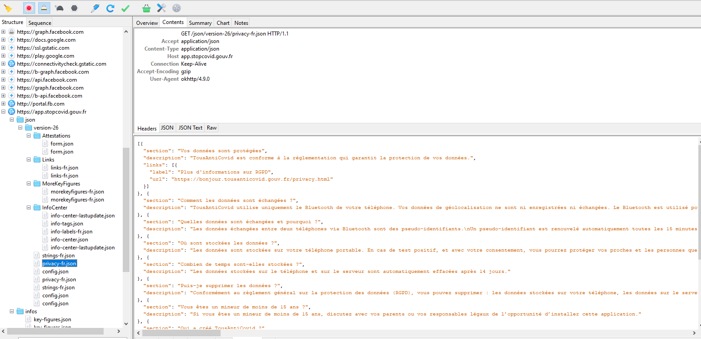
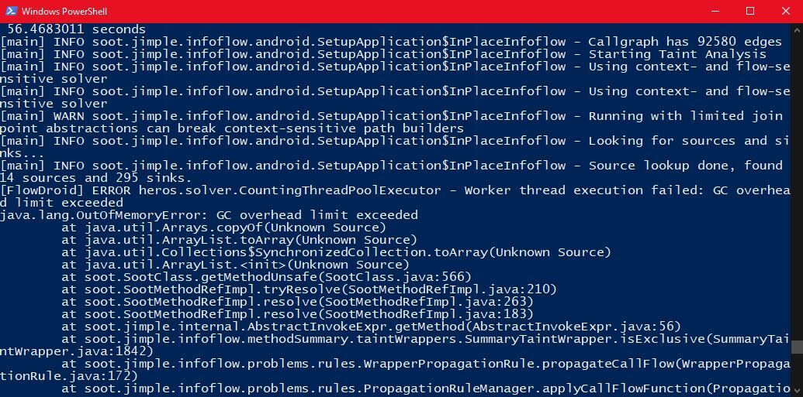

---

## Authors

Nous comme quatre étudiants en dernière année à Polytech Nice-Sophia spécialisés en Architecture Logicielle :

- Yassine JRAD &lt;yassine.jrad@etu.univ-cotedazur.fr&gt;
- Adrien VASSEUR &lt;adrien.vasseur@etu.univ-cotedazur.fr&gt;
- Maël DELABY &lt;mael.delaby@etu.unice.fr&gt;
- Fabrice SIMON &lt;fabrice.simon@etu.univ-cotedazur.fr&gt;

## I. Research context /Project

Actuellement nous faisons face à une crise sanitaire de l'ordre mondial, plusieurs solutions ont été proposés pour aider à gérer la crise sanitaire Covid-19. On a ainsi pu voir l'apparition de nombreuses applications émergeantes (TousAntiCovid en France, CovidShield au canada,etc...). Chacun de ses pays gère la protection des données et de la vie privée selon des directives qu'ils doivent respectées. Le projet consiste à savoir quelles méthodes permettraient de suivre les flots de données de ces applications. Le but de ce projet permettrait à d'autres personnes curieuses d'avoir des outils et des méthodes pour pouvoir comprendre comment les applications gère nos données.

## II. Observations/General question

Nous avons décidé d'utiliser l'application "TousAntiCovid" pour répondre à la question "Quelles sont les méthodes qui permettent d'étudier des flots de données ?", à partir de cette question une autre question émerge, si des méthodes sont possibles pour étudier les flots de données, quelles sont les résultats qui seraient intéressants pour nous ? Dans notre contexte, on utilise l'application gouvernementale "TousAntiCovid", on s'est posé plusieurs questions que l'on pense intéressante car sur les réseaux sociaux on voyait souvent des affirmations sans preuve revenir, et qui amène souvent à de la confusion, voir de la méfiance vis-à-vis de cette application (exemple : "L'application ne sert qu'à manipuler les gens", "Tous nos données sont vendus à des tiers",etc...). Mais qu'en est t-il vraiment ? Plusieurs sous questions apparaissent

- Comment sont stockées nos informations personnelles à travers l'application ?
- Quelles sont les traitements de données réalisées ?
- Qui peut accéder aux informations ?
- Est-ce que la réglementation influe sur le traitement de nos données ?

## III. information gathering

Pour répondre à nos différentes questions, on a utilisés plusieurs documents qui nous ont servi durant ce projet. "TousAntiCovid" est un projet open-source, qui dispose d'une documentation accessible sur github, on a récupéré le projet entier. Dans ce projet se trouvait plusieurs ressources qui nous ont servi durant ce projet

On a aussi utilisé divers outils où l'on expliquera plus tard le choix de ces outils dans le rapport

- Charles Proxy
- Android Profiler
- Gitlab

## IV. Hypothesis & Experiences

Nous voulons démontrer que les méthodes que l'on va utilisés vont permettre de répondre à ces différentes sous questions. Si on peut répondre à ces différentes sous-questions alors on a bien la des méthodes permettant d'étudier un flot de données au sein d'une application (qui peut être une autre que celle qu'on va utiliser pour notre expérimentation).

Les méthodes sont les suivantes :

- Analyse statique : Analyser le comportement de l'application

- Analyse Dynamique : Analyser le comportement d'une application lors de l'éxecution du programme
- Analyse du ticketing sur git : Etudier les issues des développeurs fournis sur leur repository Gitlab
- Analyse du code-source et de la documentation : Comprendre l'architecture de l'application ainsi que les différents choix réalisés dans l'application

### Analyse de ticketing

Afin de se placer du point de vue de la méthodologie du développement d’une telle application, nous avons trouvé intéressant de nous intéresser aux tickets (issues) situés dans le repository Gitlab de [stop covid](https://gitlab.inria.fr/groups/stopcovid19/-/issues)
Différemment des autres méthodes, le ticketing fournit un très grand nombre d’informations intéressantes malgré le peu de tickets présents, nous avons donc décidé de recentrer son étude en nous concentrant sur la problématique suivante :

- La réglementation a-t-elle un impact sur le flot de données d’une application de traçage ?
- Quelles sont les instances qui encadrent les applications françaises ?

Nous allons émettre l'hypothèse que oui, la réglementation a un impact sur le flot de données d’une application de traçage, et les instances qui encadrent ce flot doivent être françaises, européennes ou non gouvernementales.
Pour répondre nous allons étudier le descriptif des tickets ainsi que les réponses fournies par les autres développeurs à ces derniers.

#### Problèmes liés à cette approche dans ce cas de figure

##### Peu d’issues

Nous comptons au total du projet : 154 issues ouvertes ou fermées.
Cela est dû au fait que l’application est assez simple et n’a donc pas demandé beaucoup de développement. De plus certains systèmes comme “Bluetooth Low Energy SDK for Android” ont été développés sans utiliser le principe de ticketing, ces derniers pourront tout de même être analysés grâce à une étude des commits.

##### Un sujet sur les flows assez vague

Quand il faut trouver des tickets qui correspondent à cette problématique il est assez difficile de trouver des mots clefs précis s’assurant que le ticket est en lien direct avec la problématique.

#### Choix des mots clefs pour trouver des tickets correspondants

Nous avons décidé de filtrer les tickets grâce à plusieurs mots clefs, comme dit précédemment il n’y a pas beaucoup d’issues, nous avons donc décidé d’étudier ces issues manuellement si possible.

##### ROBERT

[ROBERT (ROBust and privacy-presERving proximity Tracing)](https://www.inria.fr/fr/publication-du-protocole-robert#:~:text=Le%20protocole%20ROBERT%20est%20une,protection%20des%20donn%C3%A9es%2C%20de%20vie), est un protocole développé par des équipes d’Inria et du Fraunhofer/AISEC. Son but est de permettre le développement de solutions interopérables de suivi de contact, respectueuses des normes européennes en matière de protection des données, de vie privée et de sécurité.
Nous avons choisi ce mot clef car c’est un protocole d’échange de données, il est donc en lien avec l’étude de flot de données.
En utilisant ce mot clef nous arrivons à 42 issues, nous avons essayé d’en regarder certaines mais elles étaient sans grand intérêt, cela fait donc beaucoup trop de tickets à regarder pour le peu d’informations intéressantes qu'ils nous donnent.

##### Sent to

Ces deux mots sont assez vagues mais représentent bien ce qu’est un flot de données, ce sont des données venant d’un système, “envoyées à” un autre système.
Nous comptabilisons un total de 12 tickets correspondants avec ces mots, nous allons étudier ceux ayant un intérêt :

###### #21 QR Codes

Proposition d’ajout d’un fonctionnalité de QR Code déjà présente mais pas activé, cette issue fait lien avec l’issue “#65 (Problèmes de) sécurité du protocole TAC-WARNING”. Cette issue n’a donc pas grand intérêt mais elle nous permet de découvrir l’issue #65 que nous n'aurions pas trouvé grâce aux mots clefs que nous avons sélectionnés.

###### #15 [New feature] Exposure Notification API (more and more required)

Ce ticket un peu politique, expose le point de vue que la France, en utilisant le protocole ROBERT, se délie de l’Europe et du monde, et donc qu’il faudrait utiliser la “Exposure Notification API” basé sur un [protocole européen](https://github.com/DP-3T/documents), cela permettrait d’unifier les efforts mondiaux au lieu de se battre chacun dans son coin. Cela fait écho avec notre sujet de base qui était sur la comparaison entre tous-anti-covid et CovidShield (application canadienne), la France ayant fait le choix d’utiliser son propre protocole et donc d’utiliser une application isolée du reste du monde, alors que le Canada à fait le choix d’utiliser une application permettant de lier ses données facilement aux données d’autres pays.

Dans cette issue on peut aussi prendre connaissance d’une résolution du parlement européen datant du 17 avril 2020, déclarant que les état souhaitant mettre en place une application de traçage afin de combattre le Covid “soient totalement transparents sur le fonctionnement des applications de recherche des contacts, afin que les gens puissent vérifier à la fois le protocole sous-jacent pour la sécurité et la confidentialité, et vérifier le code lui-même pour voir si l'application fonctionne comme les autorités le prétendent”. C’est en partie grâce à cette demande que nous pouvons actuellement étudier le code de cette application, nous pouvons donc aussi en conclure que la réglementation n’a pas un impact que sur le flot de données mais aussi sur notre capacité à étudier ce dernier.

###### #43 Too much contact data sent to the server

Cette issue datant de 8 mois met en évidence un non-respect d’une des demandes de la CNIL et du RGPD quant à la minimisation des données demandées. En effet, le décret correspondant mentionne que seuls les contacts avec un risque de transmission doivent être envoyés au serveur lorsqu’un utilisateur se déclare malade, alors que l’application envoyait tous les contacts croisés pendant les 14 derniers jours.
Après la création de ce ticket, une grande discussion s’en est allée approuvant les dires du créateur de l’issue, le problème a ensuite été vite résolu et donc l’issue fermée.

##### Autre

Dans cette partie il y a un ticket qui a été mis en évidence à l’aide d’une autre ticket (#21)

###### #65 (Problèmes de) sécurité du protocole TAC-WARNING

Cette issue pose la question d’un éventuel problème de sécurité en mettant en évidence différents risques liés à ce protocole et à son utilisation, ce protocole est utilisé afin de tracer les allées et venues des utilisateurs dans des lieux publics disposant d’un système de QR code TousAntiCovid.
Elle pointe l’avis de la CNIL à propos du décret permettant l’intégration de ce dispositif, cet avis pointe le manque de transparence du développement d’une telle fonctionnalité et demande qu’on lui fournisse l'AIPD (L'analyse d'impact relative à la protection des données) afin qu’elle l’étudie. Ce décret datant du 12 Février 2021 les demandes de la CNIL n’ont pour ce jour pas été réalisées, elle devrait l’être dans les semaines à venir car la CNIL à un pouvoir de décision, elle peut donc mettre en demeure un organisme quel qu'il soit.

#### Conclusion

Grâce à l’étude des issues présentes dans le repository nous pouvons nous rendre compte de quels organismes et documents sont importants dans la conception d’une application et plus particulièrement dans la gestion des flots de données en France.
La CNIL, le parlement européen et le RGPD sont donc des maillons importants lors de la conception d’une application et surtout dans la gestion des données et flots de données de cette dernière. Cela est encore plus flagrant sur l’application StopCovid car elle touche un public important, est recommandée par le gouvernement français, prend part dans une “guerre” très médiatisée et est une application purement française s'émancipant d’un grand nombre d'applications étrangères.
Ces instances et documents ont donc un impact important sur les flots de données car elles émettent des directives et conseils afin que l’application soit le plus sécurisée possible et afin de minimiser son immixtion dans notre vie privée.
Le repository étant composé d’un grand nombre de tickets ayant pour beaucoup de très long texte de loi et ayant de longue réponse fournie par d’autres développeurs, l’approche du ticketing reste très intéressante même si étudier tous les tickets serait trop long, l’aide que fournient certains outils tel que le champ de recherche est donc la bienvenue afin de trouver plus rapidement et facilement les informations qui nous intéresses.

### Analyse manuelle

Le code source de Tous Anti Covid étant disponible publiquement, il est bien évidemment intéressant de faire une analyse manuelle du code directement pour pouvoir répondre à une partie de nos questions. Toutefois, si cette méthodologie peut fournir certaines réponses que nous ne pouvons obtenir avec une analyse dynamique, elle présente rapidement ses limites :

- Le code est énorme et réparti sur deux repo Gitlab (application Android et serveur central). Tout analyser prendrait beaucoup trop de temps.
- Il est difficile de trouver les informations que l’on cherche dans un si gros code, entre tous les appels de fonctions et les changements de variables.

#### Méthodologie

Nous avons effectué cette analyse par deux méthodes :

1. En partant de mots-clés que nous considérions comme “PII” (Personally Identifiable Information), comme “position”, “phone”, etc. Nous cherchons ces mots-clés dans le code et nous voyons si, premièrement, elles existent, et deuxièmement, comment et où elles sont traitées.
2. En partant de l’API REST définie dans le code. Dans l’application Android il y a un nombre de routes limité que l’application peut appeler, et nous pouvons voir ce que chaque appel envoie. Nous partons donc de ces appels et nous retraçons tout le chemin inverse jusqu’à la création de chaque donnée que l’application envoie.

#### 1ère méthode

Dans l’application Android nous avons cherché dans l’entièreté du code certains mots-clés comme “position”, “latitude”, “phone”, “id”, etc. Les résultats de cette méthode sont plutôt décevants :

Les mots-clés comme “phone”, “number”, “name”, “postcode” n’existent tout simplement pas, ou ne mènent pas aux informations que nous recherchons.

“id” est un mot-clé beaucoup trop large qui mène à énormément de résultats, mais pas à des données personnelles comme nous le recherchions.

“Latitude” et “longitude” existent ; mais ils ne correspondent pas à la position géographique de l’utilisateur comme nous en avions fait l’hypothèse, ils correspondent aux positions géographiques des centres de vaccinations en France. Il semble donc que l’application ne traite jamais la position GPS des utilisateurs.

#### 2e méthode

Cette méthode est plus intéressante bien que complexe à mettre en place dans son ensemble. Nous partons de l’appel de l’application vers le serveur et nous analysons les données qui sont envoyées. La route la plus intéressante à étudier est **POST /report** qui correspond à un utilisateur qui se déclare comme malade. Voici les résultats en suivant ce cheminement :

- En appelant /report, l’application envoie un token (correspondant à l’utilisateur et changeant tous les 14 jours) et une liste “contacts”.

  

- La liste de contacts est une liste “localProximityList” qui contient des objets LocalProximity

- LocalProximity est créé à partir d’un objet Hello et de métadonnées bluetooth

  

  Rssi correspond à “Raw Signal Strength Indicator” qui indique la puissance du signal reçu lors d’un contact entre deux personnes, utilisé pour mesurer la distance entre ces personnes durant le contact.

- L’objet Hello est construit sur la base d’un “ProximityInfo”, un tableau de taille 16 construit lors du contact entre deux personnes. Les segments du tableau sont dissociés pour isoler certaines informations : l’ebid (bluetooth identifier) qui sert d’identifiant pour la personne rencontrée, “time” qui correspond à la durée du contact, et “ecc” et “mac” qui sont des informations liées à la sécurité et au chiffrement du transfert en bluetooth (le message transféré est chiffré en SHA256).

Nous remarquons que lors de l’envoi au serveur la liste de contacts est filtrée selon trois modes : FULL, MEDIUM et RISK. Par défaut le mode RISK est utilisé, et la liste va être filtrée pour ne garder que les contacts qui durent assez longtemps et dont la proximité entre les personnes est assez forte pour justifier un risque de contamination. Donc, si le téléphone enregistre tous les contacts que la personne rencontre, seuls les contacts “à risque” sont gardés et envoyés au serveurs.

Nous remarquons également qu’aucune information identifiable de l’utilisateur ou des contacts n’est envoyée : ni la position GPS, ni le numéro de téléphone ; seulement la date des contacts et les tokens.

Enfin, dans la documentation de l’application, il est noté qu’après un appel vers /report, l’application est supposée appeler /unregister pour effacer les informations du malade, mais nous n’avons rien trouvé dans le code pour prouver cela.

#### Résultats

A partir de cela nous obtenons, du contact entre deux personnes au stockage dans les bases de données, le schéma suivant :

D’après ce que nous avons trouvé, nous pouvons dire qu’aucune information personnelle n’est envoyée par l’application vers le serveur. Les seules données envoyées sont les dates des contacts entre l’utilisateur et les autres personnes, et les tokens permettant au serveur de les notifier en cas de risque. De plus, dans la méthode 1, nous n’avons rien trouvé qui peut s’apparenter à des données personnelles récupérées par l’application (numéro de téléphone ou position GPS).

Cependant, ce que nous avons trouvé n’est qu’une petite partie de ce qu’il se passe dans l’application. Il est possible que certaines données nous aient échappé, ou qu’elles se “cachent” dans d’autres variables. C’est la limite de l’analyse manuelle dans un code si conséquent.

Enfin, il y a d’autres routes vers lesquelles l’application peut effectuer des requêtes, mais elles sont moins intéressantes à analyser. Il y a notamment /status qui demande au serveur si l’utilisateur est à risque, ou encore les routes pour obtenir les captchas.

### Analyse dynamique

Bien que le code source de “TOUS ANTI COVID” soit disponible, il est assez difficile de comprendre quand est-ce que les appels de fonctions sont réalisés, l’idée de l’analyse dynamique est d'exécuter l’application en regardant les appels qui sont réalisées pour comprendre le comportement du programme. Cette méthode est utilisée dans beaucoup d’applications pour profiler des programmes, mais elle a également ses limites. Lorsqu’on exécute le programme on prend un chemin parmi tant d’autres dans le programme, ainsi beaucoup d’autres chemins sont négligés lors de l'exécution du programme. Mais on a pu voir qu’avec l'exécution d’analyse statique qu’on n’a pas pu analyser l'entièreté des branches avec l’outil utilisé, ainsi cette méthode est une autre approche.

Outil utilisé pour analyser le programme en cours d'exécution
Afin de réaliser l’analyse dynamique, on a utilisé l’outil “Android Profiler” qui permet d’analyser une application Android sur plusieurs points :

- Analyse mémoire
- Analyse réseau
- Analyse de l’énergie utilisé par l’application
- Analyse CPU

Ce qui nous intéresse est l’analyse réseau, mémoire et/ou CPU.

Avec tout ceci on pourrait mieux comprendre quels sont les appels de fonctions lors d’une action réalisée dans l’application et quelles sont les données échangées entre les fonctions, et même savoir quelles sont les données qui sont envoyées vers le serveur de l’application. Ce qui nous permettrait de tracer par exemple une donnée comme la “géolocalisation” de l’utilisateur.

### Première expérience

Lors de la première expérience, on enregistre les fonctions appelées lorsque l’on se connecte pour la toute première fois sur l’application, lorsqu’on se connecte à l’application on nous demande l’autorisation pour activer la géolocalisation, la bluetooth, et d’autoriser les notifications.

Cependant Android Profiler permet dans le cas de l’analyse du réseau d’uniquement afficher la taille des paquets envoyés et reçus, et dans les appels de fonctions, on peut voir que Android Profiler affiche les fonctions natives d'android et non les fonctions “de plus haut niveau”, ce qui complexifie la tâche, comme nous ne somme pas des experts d' Android, on a décidé de chercher une autre solution.

### Sniffer le réseau

Comme nous n’avons pas réussi à obtenir de résultat pour la première méthode, nous avons décidé de partir sur une autre méthode. Nous avons décidé d’analyser les appels réseau de l’application. Dans le domaine de la sécurité on parle aussi de “sniffage de réseau”.

#### Outil utilisé

Afin de réaliser ceci, on a utilisé le logiciel “Charles Proxy” qui va nous permettre de savoir quelles sont les requêtes envoyées et reçues par l’application. C’est un proxy qui permet à quiconque de visualiser l’ensemble du trafic HTTP et SSL/HTTPS sur le réseau. Ci-dessous se trouve un schéma permettant de mieux comprendre comment cela fonctionne

### Deuxième expérience

Lors de la deuxième expérience, l’idée était que depuis le téléphone mobile on exécute l’application “TOUS ANTI COVID”. Notre ordinateur servira de proxy pour sniffer le réseau (Charles sera installé) et ainsi on pourra voir ce qui se passe dans le réseau.

Le problème comme on peut le voir étant que les requêtes sont en HTTPS et que les requêtes sont chiffrées (certificat SSL), pour palier à ce problème on a utilisé le SSL proxying. De plus on avait le code source android, on a pu ainsi ajouter les autorités de certifications auxquelles l’application fait confiance en ajoutant le nôtre dans un fichier “network_security_config.xml”.

Suite à cela on a pu ainsi capturer le trafic en clair ! On a ainsi pu mieux comprendre quels étaient les appels réseaux effectués avec le serveur lorsque l’on s’enregistre et s’authentifie, et obtenir plus d’informations sur le serveur de l’application. Mais l’analyse dynamique a ses limites comme on peut le voir, il y a des scénarios qu'on n’a pas pu explorer comme savoir ce qui se passe lorsqu’on une personne est déclarée positive au covid (aucun de nous n’est tombé malade…), ou encore de savoir ce qui se passe lorsqu’on passe proche d’un cas positive (mettre sa vie en danger pour voir les appels réseaux n’était pas une solution non plus).

### Analyse statique

FlowDroid est un outil intéressant qui, à partir de l'apk d'une application android, permet de construire un "call graph" pour montrer le flot de données dans une application.

Malheureusement cet outil n'a jamais fonctionné pour nous ; nous sommes quatre à l'avoir testé, et pour chacun le programme se terminait brusquement à cause de différentes erreurs liées à la mémoire. Chaque essai du programme prenant environ 10 heures, il fut très difficile d'essayer de le configurer correctement pour pouvoir le lancer sans erreurs.

Nous pensons que, pour une application aussi conséquente que TousAntiCovid, nos machines ne sont tout simplement pas assez puissantes, ou n'ont pas assez de mémoire vive pour pouvoir terminer l'exécution de FlowDroid. Nous n'avons donc pu malheureusement rien tirer de cette méthode d'analyse.

## V. Result Analysis and Conclusion

Finalement avec toutes ces méthodes nous sommes loin d'avoir répondu à toutes les questions que l'on s'était posées. Chaque méthode a sa propre limite, dans l'analyse manuelle, on a pu voir qu'on a réussi à savoir comment les informations étaient stockées mais comme indiqué, dans un code assez large, il est difficile de tout explorer. Avec le ticketing on a vu que la règlementation provenant de différents acteurs (ANSSI,INRIA,...) impacter également le gestion des données. Le ticketing est un outil intéressant permettant de récolter un grand nombre d'informations, pas seulement sur l'application final mais aussi sur la chronologie qui a permit d'arriver à cette application final, et ainsi voir les décisions qui ont été faits sur l'application. Il est un outil qui peut être utilisé dans la plupart des projets ce qui en fait un atout indispensable dans l'étude d'une application. Enfin en effectuant une analyse dynamique, on n'a pas pu en tirer quelque chose d'intéressant car les scénarios qui nous intéressaient ne pouvaient être exécutés (car trop dangereux). Pour conclure sur le projet, nous pensons que ces méthodes peuvent être intéressantes pour l'analyse de flot de données, on a répondu partiellement à la question principale, mais on pense que cela peut servir de base pour approfondir le sujet.

## VI. References

1. [Projet TousAntiCovid](https://gitlab.inria.fr/stopcovid19/accueil/-/tree/master)
2. [Charles SSL proxying](https://www.charlesproxy.com/documentation/proxying/ssl-proxying/)
3. [Android profiler](https://developer.android.com/studio/profile/generate-trace-logs)
4. [Article covid19](https://arxiv.org/pdf/2006.10933.pdf)
5. [FlowDroid](https://github.com/secure-software-engineering/FlowDroid)
