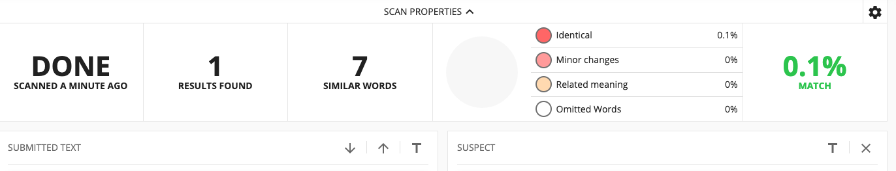
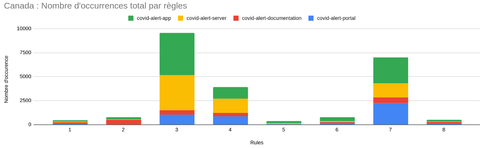
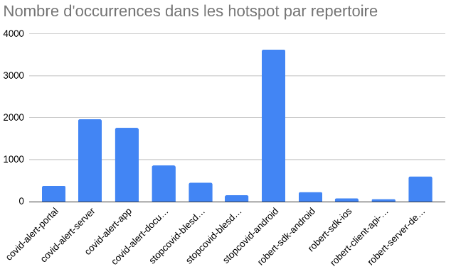
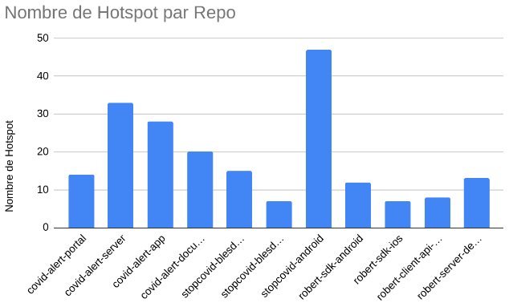
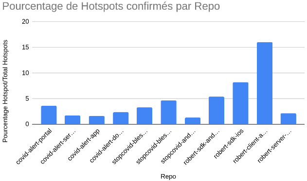
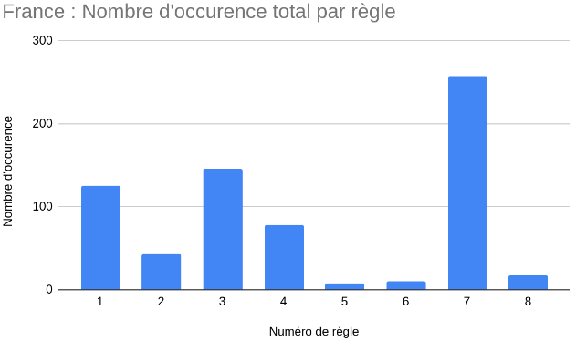
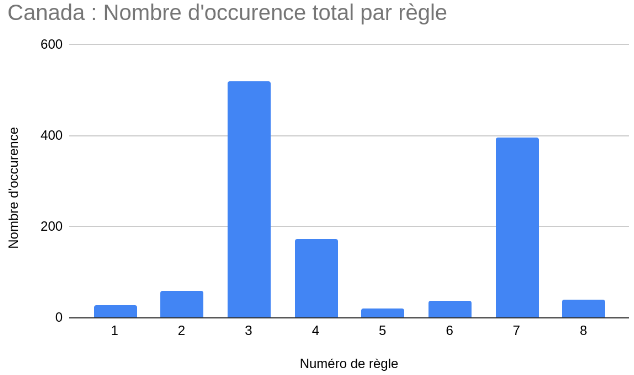

**_mars 2021_**

## Authors

Nous sommes quatre étudiants en dernière année à Polytech Nice Sophia, dans la spécialité Architecture Logicielle :

* David Bisegna &lt;david.bisegna@etu.univ-cotedazur.fr&gt;
* Yan Conigliaro &lt;yan.conigliaro@etu.univ-cotedazur.fr&gt;
* Florian Focas &lt;florian.focas@etu.univ-cotedazur.fr&gt;
* Pierre Gatto &lt;pierre.gatto@etu.univ-cotedazur.fr&gt;

## I. Contexte de recherche

Le virus du Covid-19 a touché le monde entier au début de l’année 2020. Pour répondre à cette crise sanitaire planétaire, les gouvernements ont alors créé des applications permettant de tracer les chaînes de contamination.

La technologie la plus largement utilisée dans ces applications est le Bluetooth LE (pour Low Energy). Le Bluetooth LE est une technologie à faible portée permettant une communication sans fil entre deux appareils. Grâce aux capteurs Bluetooth des utilisateurs, ces applications sont capables de détecter les individus à proximité et si une personne est déclarée par la suite malade, alors les personnes qui ont été en contact en sont informées.

Dans nos recherches, nous devions étudier l’application Canadienne CovidAlert (ou CovidShield) et Française StopCovid (ou TousAntiCovid). Cette approche est très intéressante puisqu’en fonction des pays les réglementations sont différentes autour de la protection des données et de la vie privée. La France, étant membre de l’Union Européenne doit suivre le fameux **Règlement Général sur la Protection des Données (RGPD)**. Le Canada a également son équivalent : la **Loi sur la protection des renseignements personnels et les documents électroniques (LPRPDE)**. 

Ce sujet nous a tout de suite intéressé, car nous avons tous été sensibilisés à la RGPD au cours de nos études et de nos stages puisque nous étudions l’informatique, de plus nous sommes utilisateurs de l’application TousAntiCovid et, par curiosité, nous voulions savoir comment celle-ci avait été implémentée.

Nous avons décidé de nous axer sur la traçabilité des règles dans ces applications. A l’initiation de ces projets, des règles ont été établies pour respecter la loi, et ces règles ou encore leurs évolutions ont certainement eu des répercussions sur les codes sources, et c’est ce que nous voulions vérifier.
## II. Question générale
La question générale que nous nous posons est : 
> Existe-t-il une traçabilité ou est-il possible de tracer les règles suivies par les applications dans leurs codes sources ?

Cette question nous paraît intéressante car au vu du très grand nombre de règles et de leur criticité, il serait préférable d’avoir un moyen mis en œuvre par les développeurs afin de pouvoir tracer l’implémentation de ces règles dans le code source ou encore dans la gestion de projet. De plus, cela faciliterait les audits en charge de la vérification des règles.


De la question générale en découle plusieurs : 
> Existe-t-il des règles communes aux 2 applications ? Si oui, quelles sont ses règles ?

Cette question, nous paraît intéressante car il doit exister des règles communes ou similaires entre la France et le Canada concernant la protection des données. De plus, notre sujet étant très large, celle-ci permet de réduire son scope, aux règles communes aux deux applications. 


> Ont-ils mis en place des mécaniques d'autoévaluation ?

Une autre question serait de savoir s’ils ont mis en place des mécaniques d’autoévaluation, afin de rendre plus simple, pour les développeurs, de savoir s’ils respectent bien les règles imposées. Mais il sera aussi plus simple pour nous de tracer l’existence d’implémentation pour ces règles, d’en plus faciliter les audits de sécurité. 


> Pour une règle commune aux deux applications, quelles sont les différences d'implémentation ?

Il serait intéressant de savoir, si, pour une règle commune aux deux applications, l’implémentation et la compréhension de celle-ci, est la même pour les deux pays ou s’il existe une différence dû à la culture, la langue ou autre.

Les questions désormais clarifiées, et avant de passer à la partie suivante, nous allons définir le vocabulaire que nous utiliserons tout au long de ce rapport :  

Nous avons défini une règle comme une directive ou une loi qui impose des contraintes à un produit. Le code source réunit l’ensemble du code, ainsi que le répertoire GitHub ou GitLab dans lequel il se trouve. Et pour finir, la traçabilité est la capacité à mettre en relation du code source avec une règle.
## III. Collecte d’informations

Les principales sources d’informations pour travailler sont les répertoires GitHub et GitLab des deux projets. Ce sont des sources très utiles puisqu’elles réunissent le code source, les issues et les commits des projets, suffisamment de données pour créer des métriques et en savoir plus la traçabilité des règles.

Les liens des répertoires canadiens que nous avons utilisés sont : 
- [covid-alert-app](https://github.com/cds-snc/covid-alert-app)
- [covid-alert-portal](https://github.com/cds-snc/covid-alert-portal)
- [covid-alert-server](https://github.com/cds-snc/covid-alert-server)
- [covid-alert-documentation](https://github.com/cds-snc/covid-alert-documentation)

On peut remarquer que ces liens ne proviennent pas du répertoire publique de [COVID Shield](https://github.com/CovidShield) comme indiqué dans le sujet, mais du répertoire du [Service numérique canadien](https://github.com/cds-snc). En effet, le premier répertoire ne contient que les “releases” principales provenant du répertoire du Service numérique canadien, ce qui nous fournira moins d’informations que le répertoire original.

Les liens des répertoires français que avons utilisés sont : 
- [TousAntiCovid sources - GitLab](https://gitlab.inria.fr/stopcovid19)

Afin de nous aider dans notre recherche parmis tous ces répertoires et leurs fichiers, nous avons créé un script qui recherche des mots-clés afin d’y trouver les occurrences. 
Nous avons ensuite créé un script qui recherche des mots-clés à partir de plusieurs listes de mots à trouver (les mots sont tirés des lois que nous avions trouvées). Chaque liste correspond à une règle, avec des mots qui correspondent à la règle. Ces listes sont fournies au démarrage du script qui effectue la recherche dans un dossier donné (ainsi que ses sous-dossiers). 
Le résultat de l’exécution est un résumé des résultats sous forme de fichier `.csv`, afin de pouvoir utiliser ces données dans un outil de tableur. Puis un dossier est généré pour chaque règle, où chacun de ces dossiers contient un fichier pour chaque mot de la liste en question. Ces fichiers contiennent le nombre d'occurrences du mot en question, et dans quel fichier l’occurrence a été trouvée. Il y a aussi un autre dossier, qui contient un fichier pour chaque mot avec les occurrences du mots en questions et la ligne de texte à laquelle le mot a été trouvé.

En ce qui concerne la recherche en elle-même, nous avons utilisé la commande suivante : 
```find <nom_dossier> -type f ! -path './rules/*' -print | xargs grep -in <mot_clé>  | grep -v ':0$'```.

Cette commande permet de chercher parmi tous les fichiers du dossier donné en paramètre au démarrage du script.
L’opérateur `!` associée à l’option -path ‘./rules*’ indique que la commande find ne va pas (opérateur NOT) rentrer dans le dossier ./rules* pendant ses itérations. Ce dossier est un dossier que nous créons lors de l’exécution du script, et qui contient des données sur les mots clés et les résultats de recherche. Il est donc obligatoire de l’exclure de la recherche. L’argument `-print`, permet d'afficher les noms des fichiers trouvés sur la sortie standard.
La commande xargs permet de d’exécuter des commandes à partir de ce qui se trouve dans la sortie standard, ensuite on exécute la commande grep sur ce qui a été trouvé (ce qui est donc dans la sortie standard), avec les options “-i”, qui permet d’ignorer la casse, ainsi que l’option “-n” qui permet d’ajouter le numéro de la ligne à laquelle l'occurrence a été trouvée.
Le pipeline ‘| grep - v ‘:0$’’ a pour rôle de sélectionner, et donc d’afficher, toutes les lignes n’ayant aucune correspondance de chaînes de caractères correspondant à “:0$” où $ est un méta-caractère représentant la fin de la ligne.
Ensuite le code du script exécute cette commande pour chaque mot clé.

Nous avons donc fait attention aux faux positifs, car cette recherche assez basique implique que, si par exemple, nous avons choisi comme mot clé “table” pour rechercher des interactions avec une table de base de données, nous allons aussi trouver des mots qui n’ont aucun rapport (immutable, selectable, acceptable, etc.). Une recherche plus poussée aurait permis de préciser si l’on veut que le mot corresponde entièrement et non pas partiellement. Nous avons décidé de ne pas faire cela, pour ne pas rater d’occurrences de mots intéressants, on a donc dû vérifier les faux positifs avant d’identifier les fichiers comme hotspot ou non.

De plus, nous avons utilisé des articles trouvé sur internet, qui énoncent les règles à suivre en ce qui concerne certaines lois comme la protection des données des utilisateurs, provenant d’organisme comme la CNIL ou l’ANSSI :

Documentation Française (TousAntiCovid) :
- [Spécification du protocole de communication ROBERT](https://raw.githubusercontent.com/ROBERT-proximity-tracing/documents/master/ROBERT-specification-EN-v1_1.pdf)
- [Publication de l'avis de la CNIL sur le projet d'application mobile « StopCovid » | CNIL](https://www.cnil.fr/fr/publication-de-lavis-de-la-cnil-sur-le-projet-dapplication-mobile-stopcovid)
- [Données personnelles au sein de l'application TousAntiCovid](https://bonjour.tousanticovid.gouv.fr/privacy.html)
- [Délibération n° 2020-056 du 25 mai 2020 portant avis sur un projet de décret relatif à l’application mobile dénommée « StopCovid »](https://www.cnil.fr/sites/default/files/atoms/files/deliberation-2020-056-25-mai-2020-avis-projet-decret-application-stopcovid.pdf)
- [Application StopCovid – L'ANSSI apporte à Inria son expertise technique sur le volet sécurité numérique du projet](https://www.ssi.gouv.fr/uploads/2020/04/anssi-communique_presse-20200427-application_stopcovid.pdf)

Documentation Canadienne (CovidShield) :
- [Politique de confidentialité](https://www.covidshield.app/fr/privacy/)
- [Principes de protection de la vie privée et des renseignements personnels pour les applications de traçage des contacts](https://priv.gc.ca/fr/nouvelles-du-commissariat/allocutions/2020/s-d_20200507/)
- [Coronavirus statement | Waterloo Cybersecurity and Privacy Institute](https://uwaterloo.ca/cybersecurity-privacy-institute/news/coronavirus-statement)
- [Supporting public health, building public trust: Privacy principles for contact tracing and similar apps - Office of the Privacy Commissioner of Canada](https://priv.gc.ca/en/opc-news/speeches/2020/s-d_20200507/)
- [CONDITIONS D'ACCEPTABILITÉ ÉTHIQUE](https://www.ethique.gouv.qc.ca/media/1329/cest-conditions-acceptabilite-ethique_v7.pdf)
## IV. Hypothèses & Expériences

Les hypothèses que nous avons énoncées au début du projet sont les suivantes :
- Les codes sources de ces applications permettent d’une certaine manière de retrouver les règles qu’elles suivent et comment elles les respectent. 
- Les deux applications suivent des règles communes ou similaires.

La démarche utilisée pour répondre à ces questions et valider nos hypothèses est la suivante :

### Recherche des règles communes aux deux applications dans le code source et la documentation

Cette étape consiste à identifier les règles que les des applications suivent, afin de voir lesquelles sont communes aux deux. Pour ce faire, nous avions récupéré tous les éléments de documentations des deux applications et créé deux fichiers textes, un contenant toute la documentation canadienne[3] et l'autre contenant toute la documentation française[4]. Il ne restait plus qu’à identifier des similitudes dans les documentations pour trouver les règles communes. 

Notre première approche a été d’utiliser un logiciel de détection de plagiat sur les deux fichiers pour trouver des concordances, ce qui aurait eu comme bénéfice de nous faire gagner du temps. 
Cependant, nous ne connaissions aucun logiciel de ce type, et étant étudiants, nous n’avions pas les accès nécessaires pour utiliser et essayer ces applications. C’est donc Mme Blay qui s’est chargée de mettre ces deux fichiers dans le logiciel Compilatio[5]. Ce premier logiciel n’a pas donné de résultats puisqu'il ne compare les fichiers qu’aux données sur le web et ne compare pas les fichiers entre eux. Mme Blay a ensuite utilisé CopyLeaks[6] qui lui compare bel et bien les fichiers entre eux, mais malheureusement cette technique fut un échec. 
En effet les résultats obtenus sont très faibles, puisque très peu de similitudes ont été trouvées. On peut expliquer ce phénomène par la présence de synonymes, mais également parce qu’un détecteur de plagiat n’est pas fait pour comprendre le sens des phrases, ainsi certaines phrases veulent dire la même chose mais ne sont pas pour autant mises en relation.



La seconde et dernière technique pour trouver ces règles communes, fut la recherche manuelle à l'intérieur des deux fichiers canadien et français. Cette approche a été un succès puisque nous sommes parvenus à trouver 8 règles communes :
 - Utiliser des protocoles qui minimisent et protègent les données
 - Limiter l’atteinte à la vie privée, garder seulement ce qui est nécessaire 
 - Sécuriser les canaux de communications
 - Réguler le traçage des informations
 - Dissocier les informations
 - Informer les utilisateurs sur le traitements de leurs données
 - Supprimer les données
 - Être transparent avec les utilisateurs

 ### Création de champ lexicaux pour chacune des règles

Après avoir trouvé les règles communes, nous avons soigneusement créé des champs lexicaux pour chacune d’entre elles. 
Notre démarche pour trouver des mot-clés était la suivante : nous avons récupéré ceux de la règle en question issue de la documentation, puis nous avons cherché plus largement des mots qui étaient liés à cette dernière. Les mot trouvés ont ensuite été tous traduit en anglais car d’une part le Canada possède deux langues officielles l’anglais et le français, mais également parce que nous savons qu’un grand nombre de développeurs écrivent, commentent et codent en anglais, dans un but de lisibilité internationale.

Ces champs lexicaux, nous permettront de chercher les occurrences de ces mots dans le code source.

Voici les différentes règles et champs lexicaux que nous en avons extrait :

| Règles | Mots |
|--|--|
| 1 | protocole,ROBERT,protection des données,vie privée,protection,minimisation,protocol,privacy,personal data,protection,data minimization,minimization |
| 2 | privacy,rights,necessary,information,collect,minimize,justify,invasion,injure,quantity,personnal,law,protection,vie privée,nécessaire,renseignement,recueillir,minimiser,justifier,atteinte,quantité,personnel,droit,protection |
| 3 | securiser,sécuriser,securise,sécurise,secure,communication,canal,canaux,cyber,transférer,transfer,TLS,SSL,encrypt,crypt,key,cle,clef,clé,https,authentication |
| 4 |traçage,tracage,tracing,trace,tracabilite,traçabilité,tracabilité,tracing,collect,données,data,donnees,db,database,sql,sqlite,table,stock,stockage,pseudo,pseudonymisation,pseudonimize,anonymize,anonym,anonymization |
| 5 | coffre-fort,dissocier,pseudo,sécurisé,séparer,robuste,safe,vault,dissociate,separate,secure,robust |
| 6 | consentement,permission,permissions,permit,consent,allow,deny,forbid |
| 7 | delete,remove,data,after,since,stop,interrupt,inform,not use,erase,export,storage,internal storage,external,storage,server,self,period,inactive,useless,keep,preserve,uninstall,supprimer,supprimé,donnée,après,depuis,stop,interrompre,informer,pas utilisé,effacer,exporter,exporte,stocker,stockage,stockage interne,stockage externe,serveur,sois même,période,inactif,inutile,conserve,préserve,désinstaller |
| 8 | consentement,accepter,refuser,confiance,transparence,information,respect,constitution,consent,accept,refuse,confidence,transparency,condition |

 ### Recherche d'occurrence des champs lexicaux dans le code source :
 
Une fois nos champs lexicaux identifiés, nous avons créé le script python qui recherche les occurrences de mots dans un répertoire donné.
Nous avons alors cloné les répertoires des projets et cherché les occurrences. Nous avons ensuite importé les fichiers .csv de sortie du script, sur un tableur, afin de générer des graphes et de favoriser leurs analyses.

Cette méthode ne permet pas de récupérer les occurrences dans les messages de commit et les issues des projets. Nous avons alors créé un second script, qui récupère toutes ces données auprès de GitHub et GitLab via leurs API REST et les stockent dans des fichiers. 

Voici les routes que nous avons utilisé :

- Pour les projets GitLab : 

| URL | But |
|--|--|
| https://gitlab.inria.fr/api/v4/projects/:projectId/repository/commits | Recupérer les commits et messages de commits d'un projet |
| https://gitlab.inria.fr/api/v4/projects/:projectId/issues | Recupérer les titres et messages des issues d'un projet |

- Pour les projets GitHub : 

| URL | But |
|--|--|
| https://api.github.com/repos/:owner/:repo/issues| Recupérer les titres et messages des issues d'un projet |
| https://api.github.com/repos/:owner/:repo/commits | Recupérer les messages des commits d'un projet |
| https://api.github.com/repos/:owner/:repo/comments | Recupérer les commentaires des commits d'un projet |
| https://api.github.com/repos/:owner/:repo/issues/comments | Recupérer les commentaires des issues d'un projet |

Nous n’avions plus qu’à utiliser le script qui compte les occurrences sur les fichiers de sortie du second script, afin d’obtenir les occurrences dans les messages de commits et les issues des projets.

### Recherche des hotspots

Un hotspot est un fichier où on retrouve un grand nombre d'occurrences d’un champ lexical d’une règle. En étant optimiste, s’il y a un grand nombre d’occurence, ce fichier a de fortes chances d’être un point d’implémentation de la règle.
Nous avons, dans un premier temps, pour chaque répertoires, sélectionné les règles qui étaient majoritaires, ensuite nous avons parcouru les fichiers de sortie du script qui compte les occurrences pour rechercher et vérifier les hotspots de ces règles. 

Cette recherche a été faite à la main, afin de vérifier et sélectionner les hotspots, en évitant les faux-positifs pouvant être dus à la syntaxe de certains langages (par exemple : `export` en JavaScript et `data` en XML) ou tout simplement à certains mots qui ont été mal choisis car trop généraux.

Une fois la liste des hotspots obtenue, nous sommes allés directement constater ces fichiers, et indiquer si oui ou non ces hotspots étaient en lien avec la règle concernée.
Pour cela, nous avons renseigné dans un tableur, pour chaque hotspots, si celui-ci était ou n'était pas en relation avec sa règle.

### Recherche manuelle de l’implémentation des règles dans les répertoires

Une des méthodes d’analyse que nous avions auparavant envisagé était de chercher à la main dans tous les répertoires, au moins dans le but de trouver l’implémentation d’une seule règle. L’énorme désavantage de cette méthode est qu’elle est extrêmement fastidieuse, nécessitant l’analyse à la main de 8 répertoires, pour une équipe de 4. Il va de soi qu’il n’est pas possible de vérifier toutes les règles dans ces conditions, donc seule la traçabilité éventuelle d’une règle peut être établie. De plus, le simple fait d’utiliser cette méthode pour trouver quoi que ce soit, est un indicateur en lui-même que la traçabilité des règles est extrêmement faible, puisque autrement, les métriques précédentes auraient dû fournir un résultat nous permettant d’éviter ce scénario.
## V. Analyse des résultats et Conclusion

Après application de nos scripts sur l'entièreté des répertoires, nous sommes parvenus à des résultats bruts satisfaisants, non pas que leur présence ne donne des réponses à nos questions, mais parce qu’ils nous donnent une piste à suivre dans le but d’atteindre un résultat final satisfaisant.





Après un premier découpage des règles communes, puis un scan de tous les répertoires français et canadiens, nous sommes parvenus à atteindre ces résultats-ci. 
On peut noter que quelque soit le pays, les règles 5, 6 et 8 (à l’exception d’un répertoire) n’ont que très peu de résultats positifs (en accord avec les mots-clés définis pour ces règles-ci). Les causes possibles de ce manque de résultat peuvent être soit une mauvaise définition des mots-clés utilisés pour rechercher l’implémentation de ces règles-ci, soit une non implémentation des règles (ou une implémentation très difficile à tracer). A l’inverse, les règle 3, 4 et 7 ont un très grand nombre d’occurrences, ce qui ne veut pas pour autant dire qu’elles sont traçables (car il peut y avoir un fort nombre de faux-positifs), mais qu’il existe peut-être un moyen de vérifier l’implémentation des règles. Les règles 1 et 2 quant à elles peuvent sembler être mieux suivies en France qu’au Canada au vu de nos résultats.

Après avoir obtenu ces résultats, nous avons donc su quelles règles étaient potentiellement traçables dans chaque application. Vérifier à la main tous les fichiers trouvés par nos algorithmes étant une tâche beaucoup trop fastidieuse pour nous, nous avons décidé 
dans un premier temps de trouver des hotspots et vérifier ensuite leur contenu.




Au début, on peut constater qu’on a un nombre très élevés de hotspots (ici, toute règle confondue), jusqu’à 3500 pour stopcovid-android. Toutefois, ces hotspots sont ceux que notre programme a trouvés et que nous avons défini sur la base du nombre d’occurrences de mots clés uniquement. Une vérification manuelle va permettre d’établir ou de retirer ce statut à chaque fichier considéré comme étant hotspot.

Ainsi, pour chaque hotspot que nous avons trouvé, nous allons vérifier que les mots-clés trouvés sont bel et bien en relation avec une règle, et ne sont pas du bruit, ou ne constituent pas un faux-positif nous amenant à considérer un fichier sans réelle importance comme étant un point d’implémentation d’une règle.



Après vérification, nous obtenons un graphe suivant une courbe fortement similaire à précédemment, toutefois les chiffres ont été grandement revus à la baisse, avec pour notre grande source de hotspots stopcovid-android passant de presque 5 000 hotspots à maintenant un peu moins de 50. Ces chiffres obtenus ont cette fois-ci été vérifiés par un humain, et sont donc beaucoup plus crédibles qu'une simple correspondance de mots. 



On obtient alors le graphique suivant, qui indique le pourcentage de bons hotspots parmi tous les hotspots trouvés, toutes règles confondues. Il va de soi que certaines règles sont plus propices à faire augmenter ou diminuer ce chiffre. Une bonne conclusion de ces valeurs est que, pour une règle, pour un mot-clé, plus ce rapport est faible, plus le nombre de faux-positifs est élevé, plus le mot-clé choisi est imprécis ou sujet à erreur. Inversement, plus le nombre est élevé, plus le nombre de faux-positifs est faible et on considère le mot choisi comme étant précis. 

Afin de consolider nos théories sur les implémentations des règles dans les différents répertoires, nous avons décidé de nous fier aussi à la gestion de projet de chaque application, en utilisant l’API de Github (pour l’application Canadienne) et celle de GitLab (pour l’application Française). En extrayant les issues et commits, et en appliquant le même scan que celui appliqué sur les répertoires.





Dans les deux graphiques ci-dessus, on retrouve des règles dominantes dans les deux applications, comme les règles 3, 4 et 7, à l'exception de la règle 1 qui est plus importante dans l’application française. 

Nous pouvons tirer plusieurs conclusions de ces valeurs. La première, est que cette forte présence de certains mots pourrait nous indiquer que les règles qui s’y réfèrent sont plus facilement traçables dans les issues et messages de commits. La deuxième conclusion possible est que, puisque la courbe des occurrences des mots sur les issues suit celle des occurrences sur les commentaires et le code, on peut conclure que ce sont bel et bien ces règles là qui sont traçables, ou que les développeurs ont bel et bien voulu implémenter. Il est cependant possible qu’une règle n'ait pas été considérée comme traçable à cause d’un manque de mots-clés valides.

Il était question d’une analyse manuelle des répertoires, mis en avant précédemment dans le dernier point de la partie IV. Cependant, au vu des résultats que nous avons trouvés jusqu’ici, nous avons décidé de ne pas nous servir de cette méthode. Les raisons sont simples, cette méthode est beaucoup trop chronophage au vu du temps restant, pour être utilisée en parallèle du traitement des données des autres métriques. Ainsi, nous nous sommes passés de cette méthode.

Maintenant que nous avons analysé les résultats, nous allons essayer de passer aux conclusions, en répondant au mieux aux questions que nous avons soulevées lors de la partie II. Ces conclusions se feront au simple format question puis réponse :

> Existe-t-il une traçabilité ou est-il possible de tracer les règles suivies par les applications dans leurs codes sources ?

Après toutes ces analyses, nous pouvons répondre à cette question en disant simplement que oui, il est possible de tracer certaines des règles que nous pensons que les applications suivent. Cependant, sur toutes les méthodes trouvées pour mesurer la traçabilité de ses règles, aucune ne vient des développeurs eux-mêmes, ce qui signifie que nous avons dû nous même trouver des façons de vérifier la transparence des règles suivies. Qui plus est, malgré les résultats obtenus, nous ne pouvons pas dire avec confiance que les règles sont complètement et entièrement traçables.
Cela signifie, en conclusion, que la traçabilité des règles dans les applications est, au mieux, partielle, incomplète, et non assistée par les développeurs.

> Existe-t-il des règles communes aux 2 applications ? Si oui, quelles sont ses règles ?

Nous sommes bel et bien parvenus à trouver des règles communes entre les deux applications, puisqu’ après les avoir cherchées manuellement dans les documentations des applications, nous avons trouvé 8 règles communes.

> Ont-ils mis en place des mécaniques d'autoévaluation ?

Malgré des recherches manuelles approfondies dans les codes sources des deux applications, nous ne sommes pas parvenus à trouver quelconques mécanismes permettant aux développeurs de s’auto-évaluer. Et si des méthodes d’auto-évaluations ont été mises en place, elles sont très peu traçables dans les projets.

> Pour une règle commune aux deux applications, quelles sont les différences d'implémentation ?

Compte tenu de la difficulté de la tâche donnée, ainsi que tout le temps passé à trouver des preuves de traçabilité des règles dans les applications, nous ne sommes pas parvenus à trouver des méthodes et métriques pertinentes nous permettant de valider ou d’invalider les différences d’implémentation dans les temps.
## VI. Références
1. [TousAntiCovid sources · GitLab](https://gitlab.inria.fr/stopcovid19)
2. [cds-snc/covid-alert-app: Exposure notification client application / Application client de notification d'exposition](https://github.com/cds-snc/covid-alert-app)
3. [Doc canada](https://docs.google.com/document/d/17fwXqRZ2euEapRHrZLe2tdklGSccPX59Uq4T-cEaa1A/edit?usp=sharing)
4. [Doc fr](https://docs.google.com/document/d/1TRzcqWzSESCHVik_pHYmtpv0JUN_r9SCN7XKQVkiLF4/edit?usp=sharing)
5. [Compilatio](https://www.compilatio.net/)
6. [CopyLeaks](https://copyleaks.com/)
