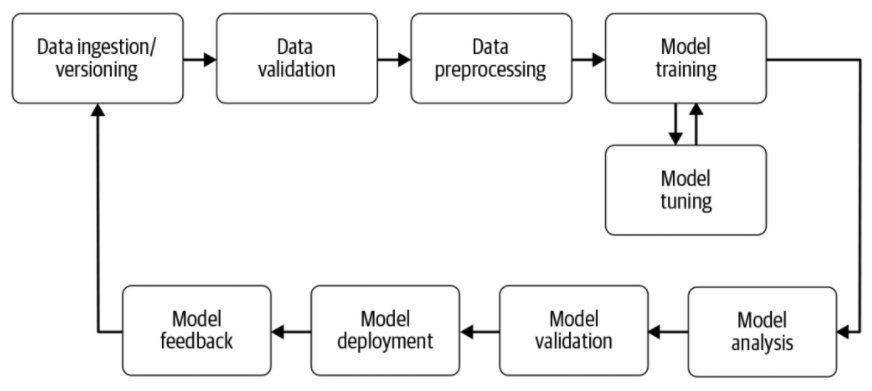
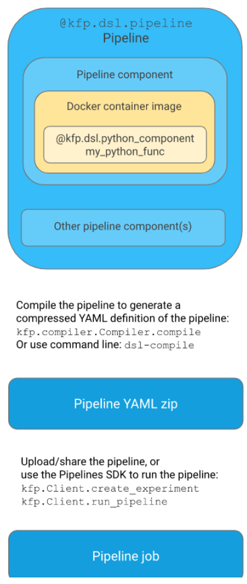
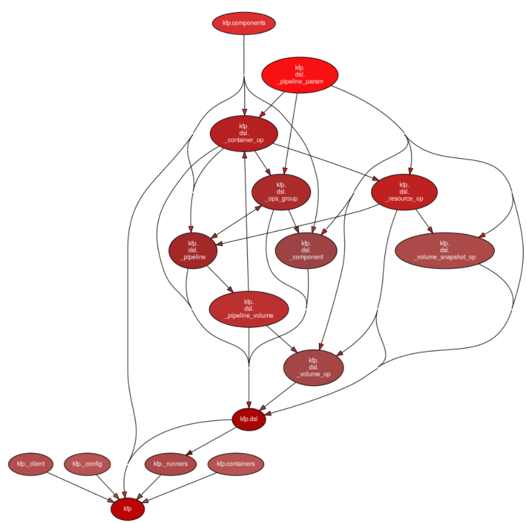

# Comment Kubeflow Pipelines permet-il de gérer les erreurs ?

## Auteurs

Nous sommes quatre étudiants en dernière année de diplôme d’ingénieur en informatique à Polytech Nice-Sophia en Architecture Logicielle :

* Sylvain Masia &lt;sylvain.masia@etu.univ-cotedazur.fr&gt;
* Damien Montoya &lt;damien.montoya@etu.univ-cotedazur.fr&gt;
* Richard Peres &lt;richard.peres@etu.univ-cotedazur.fr&gt;
* François Rigaut &lt;francois.rigaut@etu.univ-cotedazur.fr&gt;


## I. Contexte de recherche

Le machine learning attire de plus en plus l’intérêt des professionnels et son utilisation dans les applications de tous types est plus privilégiée que jamais. 
C’est pourquoi faire l’étude d’une solution open source permettant de faire l'entraînement de son modèle de ML et de réaliser son déploiement nous a particulièrement intéressés. 
De plus, Kubeflow reposant sur Kubernetes, qui est également une technologie très en vogue en ce moment, ce sujet a de fait suscité un fort intérêt de notre part.

Premièrement, qu’est-ce que Kubeflow ? Kubeflow est un framework open source de Kubernetes permettant de faciliter la mise en place de workflows de machine learning. 
Nous nous intéressons dans cet article à un composant essentiel de Kubeflow, Kubeflow Pipelines. Pour comprendre l'intérêt de Kubeflow Pipelines, il est important de connaître le principe d’un workflow de machine learning. 
Un workflow traditionnel peut être schématisé comme suit :



Certains workflows cependant présentent plus de dépendances entre chaque composant et gérer le flux de données devient assez compliqué. 
C’est un des problèmes auquel Kubleflow Pipelines permet de répondre. 
En effet, Kubeflow Pipelines se repose sur un DSL interne à python pour définir tous les composants du workflow ainsi que les dépendances entre ces derniers afin de fournir un pipeline d’exécution sous Kubernetes.


## II. Problématiques

Kubeflow Pipeline étant un projet à la fois récent et complexe, nous avons décidé de centrer notre problématique sur le DSL et notamment sur la manière dont ce dernier permettait de gérer les erreurs.

Pour répondre à cette problématique principale, nous avons décomposé notre démarche en plusieurs sous-problématiques:

### II.1. Quelle est la structure de KubeFlow Pipelines ?

Dans un premier temps, afin de comprendre comment les erreurs peuvent être gérées, où elles peuvent être produites et où elles pourraient éventuellement être récupérées, il est nécessaire d’avoir une bonne compréhension de KubeFlow Pipelines et notamment de sa structure et du positionnement du DSL au sein du code.

### II.2. Quels sont les types d’erreurs qui sont générées par le DSL?

Analyser les erreurs et les contextes d’utilisation dans lesquels elles sont le plus présentes permet d’émettre des hypothèses sur leur gestion et de s’orienter vers une analyse plus ciblée.

### II.3. Quels sont les moyens de gérer les erreurs produites par le DSL de KubeFlow Pipelines ?

Enfin, il est intéressant de se pencher sur les moyens offerts par le système pour gérer les erreurs et exceptions remontées par le système. Pour cette problématique, se pencher sur des exemples d’utilisation réels et existants du DSL permet d’utiliser des cas concrets comme bases pour des éléments de réponses à notre problématique principale.

## III. Informations collectées

### III.1. Articles et documents de référence

Pour nous aider durant notre recherche, nous avons principalement utilisé les articles suivants :
- la documentation de Kubeflow
- le répertoire Github de Kubeflow Pipelines
- les forks du répertoire de kfp
- StackOverflow

### III.2. Outils utilisés

Concernant l’utilisation d’outils, il nous a été plutôt difficile de trouver des outils pour nous aider durant notre recherche. 
Cependant, nous avons finalement utilisé deux outils nous permettant de générer des informations. 
En effet, pour établir un diagramme de dépendances, nous avons utilisé conjointement pydeps et graphviz, permettant respectivement de générer un graphe de dépendances et de le visualiser.

Nous avons par la suite utilisé l’API de Github pour récupérer automatiquement les répertoires avec les termes “kubeflow pipelines” pour ainsi analyser tous les fichiers utilisant le DSL et obtenir des statistiques quant à l’utilisation des erreurs.

### III.3. Quelle est la structure de Kubeflow Pipelines

Avant d’entrer plus en détails dans l’exploration du code source et de l’utilisation du DSL, nous nous sommes penchés, dans un premier temps, sur la compréhension du DSL et de son utilisation.

#### III.3.a. Le DSL de Kubeflow Pipelines

Pour pouvoir générer un pipeline, Kubeflow met donc à disposition un DSL écrit en python. 
Ce DSL ajoute certaines fonctionnalités et annotations pour permettre la gestion du pipeline. 
La définition du pipeline se fait avec l’annotation `@dsl.pipeline`. Ainsi, on peut établir l’exemple suivant :

```
@dsl.pipeline(  
    name="Mnist ml",  
    description="A Mnist pipeline"  
)  
def pipeline_steps(): ...  
```

Ensuite, les différents composants du pipeline seront définis dans la méthode pipeline steps, méthode pouvant être renommée sans problème. 
Chaque étape de ce pipeline est lancée dans un container et définie avec la méthode `dsl.containerOp(args...)`. 
De plus, Kubeflow permet également de déclarer des volumes pour charger les script et sauvegarder les résultats via la méthode `dsl.VolumeOp(args...)`.

Pour illustrer le DSL, voici un exemple de déclaration de volume et de conteneur :

```
vop = dsl.VolumeOp(
    name="create_pvc",
    resource_name="my-pvc",
    size="10Gi",
    modes=dsl.VOLUME_MODE_RWM
) # définition d’un volume de 10Go

    step1 = dsl.ContainerOp(
        name="step1",
        image="library/bash:4.4.23",
        command=["sh", "-c"],
        arguments=["echo 1 | tee /mnt/file1"],
        pvolumes={"/mnt": vop.volume}
    ) # définition d’un composant du workflow

    step2 = dsl.ContainerOp(
        name="step2",
        image="library/bash:4.4.23",
        command=["sh", "-c"],
        arguments=["echo 2 | tee /mnt2/file2"],
        pvolumes={"/mnt2": vop.volume}
    ).after(step1) # définition d’un second composant s’exécutant une fois que step1 a terminé
```

#### III.3.b. Flow de compilation du DSL

Pour que le workflow soit généré, KubeFlow Pipelinessuit une certaine procédure.

Dans un premier temps, l’utilisateur devra disposer de son code de machine learning via trois moyens:
- code directement dans le dsl
- code stocké sur le cluster ou s'exécute Kubeflow
- code stocké sur divers clouds

En effet, Kubeflow propose plusieurs API pour récupérer facilement des documents stockés sur Google Store, sur le cloud Amazon Web Services... 
Dans le cas de l’écriture du code dans le DSL, chaque composant du workflow doit être séparé dans une méthode qui représente le composant. 
Pour les cas où le fichier est stocké, chaque composant devra être écrit dans un code séparé. 
Parmi les exemples que nous avons étudiés, les codes lancés étaient soit des scripts python, soit des scripts bash. Une fois que l’utilisateur dispose de son code, il devra alors définir le pipeline ainsi que son flow d’exécution comme montré dans la partie précédente. 
Enfin, le pipeline sera converti en un fichier .yaml qui sera alors utilisé par Kubeflow Pipelines pour exécuter le workflow.


Nous pouvons donc schématiser le flow de compilation par le graphique suivant :



## IV. Hypothèses & Expérimentations

Au commencement du projet, nous n’avions que très peu, voire aucun indice concernant une potentielle réponse à notre problématique principale. 
En effet, aucun d’entre nous n’avait utilisé KubeFlow Pipelines auparavant, et, étant donné la complexité du système, émettre une hypothèse sur son comportement vis-à-vis de sa gestion d’erreur aurait été très présomptueux. 
C’est pourquoi nos premières expérimentations nous ont aidés à nous positionner sur ce qui deviendra notre hypothèse principale.

Dans un premier temps, nous avons exploré et tenté de comprendre la structure du DSL de KubeFlow Pipelines, afin de repérer de potentiels endroits où des erreurs provoquées dans le dsl pourraient être remontées. 
En utilisant pydeps et GraphViz, nous avons pu produire un graphe de dépendances entre les différents modules de la partie sdk du projet :



En plus de cela, nous avons pu explorer le projet avec des scripts bash pour repérer les mots clés ‘raise’, ‘error’ ou encore ‘exception’ dans le code de KFP afin d’entamer une analyse manuelle plus fine sur les types d’erreurs présents dans le système. 
C’est en remarquant que la quasi-intégralité de ces erreurs et exceptions étaient de l’ordre d’une mauvaise utilisation du système (données de configuration fournies à KFP invalides ou absentes) ou de contraintes définies par l’utilisateur lui-même non validées (structure de données transmises entre deux éléments du pipeline non-conforme aux attentes de l’utilisateur) que nous avons pu émettre notre hypothèse principale :

“Les erreurs levées par le DSL de KFP ne sont gérées par personne d’autre que l’utilisateur lui-même.”

## V. Résultats d’analyse et Conclusion

Après notre première analyse rapide pour produire notre hypothèse, nous avons entamé une démarche plus rigoureuse pour pouvoir confirmer ou infirmer nos hypothèses. Après avoir collecté les premières informations, nous avons débuté la phase d’analyse et d’interprétation de ces résultats afin d’avoir une idée plus claire sur la conduite de l’hypothèse principale.

Nous avons enfin automatisé l’analyse des différentes erreurs traitées dans le DSL par l’utilisation de scripts programmés pour faire du grattage dans le code source de Kubeflow Pipelines SDK et du DSL pour faire ressortir les mots-clés de la gestion d’erreur dans le code.

Nous avons par la suite automatisé un second script python permettant de récupérer les 30 répertoires Github les plus utilisés en se basant sur les “stars” et contenant “kubeflow pipelines”, via l’API de Github. 
Ces répertoires varient de 1995 stars pour le répertoire officiel Kubeflow Pipelines, à 1 star, soit un répertoire plutôt lambda utilisé par quelques personnes. Sur ces répertoires, le script va alors parcourir tous les fichiers python utilisant le DSL et ainsi fournir diverses statistiques. 
Premièrement, sur les 30 répertoires, seulement 15 utilisaient le dsl, c’est à dire qu’au moins un fichier contenait `@dsl.pipeline` dans le répertoire. Cette première partie nous montre que Kubeflow Pipelines est une technologie encore récente et peu utilisée. Sur ces 15 répertoires, se trouvaient 288 fichiers python utilisant le DSL. Parmi ces 288 fichiers, nous avons pu extraires les informations suivantes :
- 63 scripts utilisent dsl.Condition()
- 33 scripts utilisent dsl.ExitHandler()
- aucun script n’utilise de raise Error
- aucun script n’utilise raise Exception

Pour comprendre ces statistiques, nous vous devons quelques explications. 
La méthode dsl.Condition() permet de lancer des composants du workflow si la condition est vérifiée. 
Cela équivaut donc à faire un “if” et donc cela permet une gestion minime des erreurs. 
Le méthode ExitHandler permet de définir une fonction personnalisée qui sera appelée lorsque la fonction sys.exit() sera appelée, notamment suite à une erreur. 
Un exemple d’utilisation que nous avons rencontré est celui de l’intégration d’un hook Slack pour générer des messages en cas d’erreur d’exécution du pipeline.

Concernant les “raise”, le fait de n’avoir aucun script les utilisant nous montre que la gestion d’erreurs à l’intérieur des composants se fait avec la méthode dsl.ExitHandler(), et que les exception levées par le dsl doivent directement être gérées par l’utilisateur.

## VI. Outils

Voici la liste des outils utilisés:
- pydeps : pour générer le graphe des dépendances
- Graphviz : Pour dessisner et visualiser le graphe de dépendances
- GitHub API : pour récupérer les répertoires GitHub
- [Script .sh](./scripts/script.sh)
- [Script .py](./scripts/githubgetrepositories.py)
  - To use the script you need to replace the API Key line 12 with your github API Key

## VII. Références

[Documentation officielle Kubeflow](https://www.kubeflow.org/docs/)

[Github officiel Kubeflow Pipelines](https://github.com/kubeflow/pipelines)

[StackOverflow](https://stackoverflow.com/questions/tagged/kubeflow-pipelines)

Source de la figure 1 : Livre “Building Machine Learning Pipelines” de Hannes Hapke & Catherine Nelson
