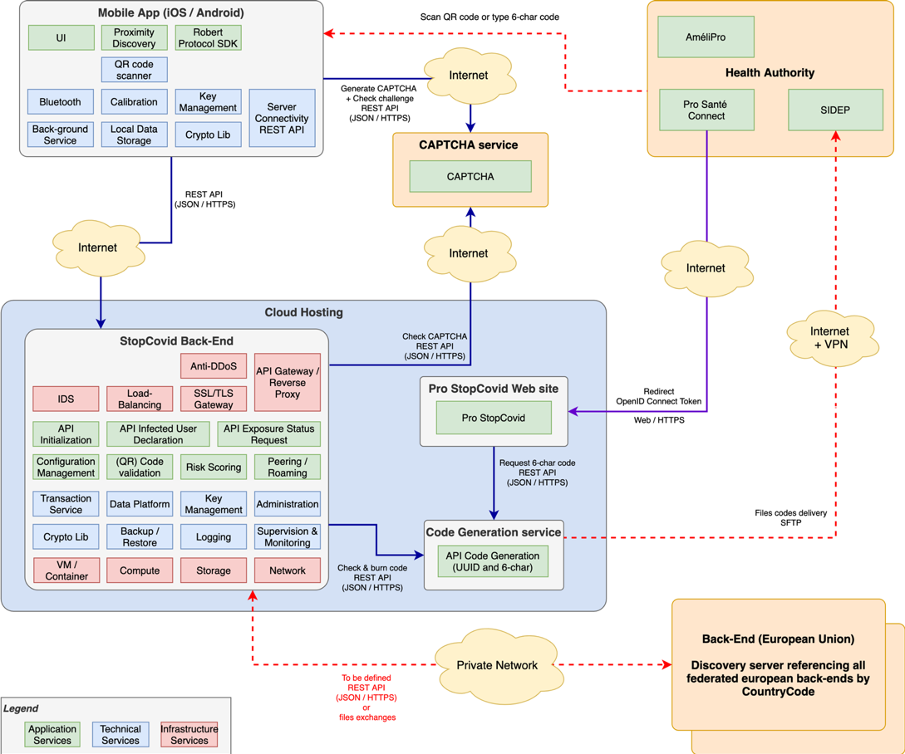
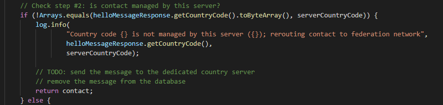
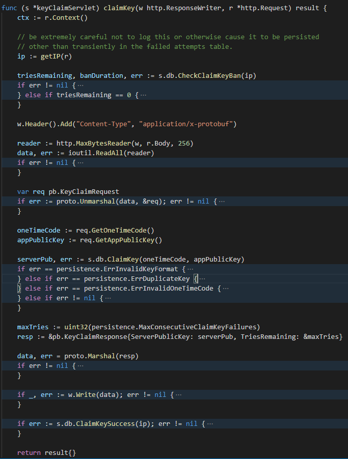
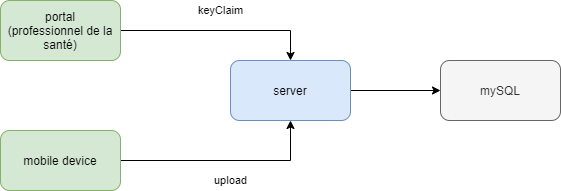
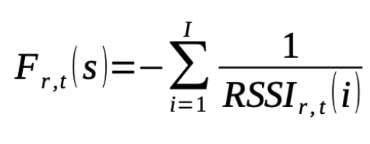
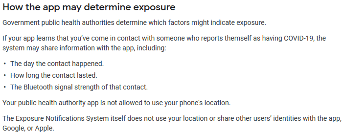
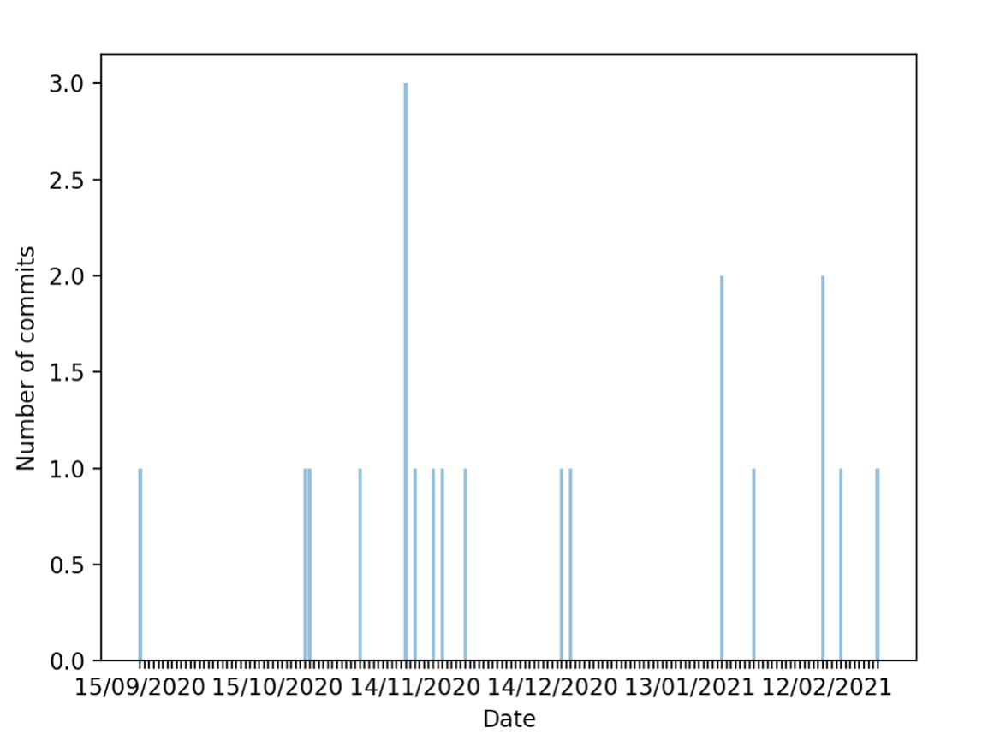
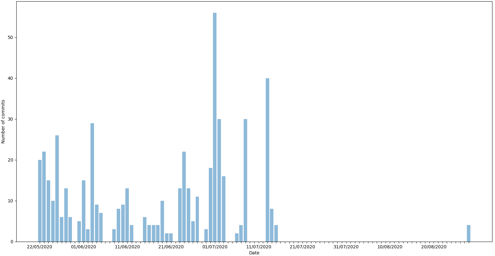

---

> **Date de rendu finale : Mars 2021 au plus tard**
> - Respecter la structure pour que les chapitres soient bien indépendants
> - Remarques :
>>    - Les titres peuvent changer pour être en adéquation avec votre étude.
>>    - De même il est possible de modifier la structure, celle qui est proposée ici est là pour vous aider.
>>    - Utiliser des références pour justifier votre argumentaire, vos choix etc.

---

**_janvier 2021_**

## Authors

We are four students in last year of Polytech' Nice-Sophia specialized in Software Architecture :

* Loïc Bertin &lt;loic.bertin@etu.univ-cotedazur.fr&gt;
* Virgile Fantauzzi &lt;virgile.fantauzzi@etu.univ-cotedazur.fr&gt;
* Guillaume Ladorme &lt;guillaume.ladorme@etu.univ-cotedazur.fr&gt;
* Stéphane Viale &lt;stephane.viale2@etu.univ-cotedazur.fr&gt;

## I. Research context /Project

Notre contexte d'étude se base sur la comparaison des applications de détection et de tracage du COVID-19 et en particulier sur les applications françaises et canadiennes. Nous allons donc nous baser sur l'application TousAntiCovid (ex StopCovid) et l'application CovidShield. 
- Projet canadien : https://github.com/CovidShield/
- Projet français : https://gitlab.inria.fr/stopcovid19

Avec toutes les plaintes autour de la sécurisation de nos données et de la conservation de la vie privée, l'étude de ces deux projets est très intéréssante afin de comprendre si l'inquiétude générale est justifiée ou non. 
De plus, en tant qu'élève architecte logicielle, la rétro ingénierie de projet tels que ceux ci nous permet de comprendre et d'analyser les choix qui ont été fait, à nuancer évidemment avec la rapidité des décisions et les contraintes temporelles dûes à la crise.

## II. Observations/General question

Notre problématique est issue d'une idée qui nous est venu en tant que citoyen français qui commençons à découvrir petit à petit la complexité de notre système. En effet, lors du développement de l'application, les développeurs ont du prendre en compte toutes les nuances du système de santé français afin d'informer les bonnes institutions et de s'interfacer correctement avec les organismes déjà en place. C'est cette complexité qui nous a intrigué et qui nous a donné envie de répondre à cette problématique générale : 
**En quoi l'architecture des projets reflète l'organisation administrative des pays et leur gestion de la crise du covid-19**

Cette problématique va nous permettre de nous intérésser à la fois à l'architecture globale des projets mais aussi de venir investiguer dans le code l'implémentation concrète des mesures gouvernementales. Il y aura donc 2 axes de reflexion à suivre, portés sur différentes échelles de vision de l'architecture, une vision gros grain et un zoom dans le code.
La question étant beaucoup trop générale et impossible à traiter par une équipe de 4 personnes avec le temps accordé, nous nous sommes intéréssés à deux sous questions qui seront détaillées plus bas dans ce rapport. Ces deux sous questions nous paraissent très intéréssante car elles reprennent l'idée générale de la problématique globale mais axée sur de la compréhension des projets et leur comparaison.

## III. Information gathering

Afin d'avoir une bonne maitrise des 2 projets, nous avons dans un premier temps pris connaissance des différentes documentations présentes dans les github.
Le projet français ne possède pas de readme à la racine du projetmais un schéma d'architecture permettant de comprendre les différents liens entre les composants. Ce schéma est disponible dans le dossier documentation : https://gitlab.inria.fr/stopcovid19/accueil/-/tree/master/documentation
L'application canadienne, quant-à-elle, possède un readme très complet ainsi qu'un repository de documentation qui regroupe plusieurs informations utiles sur le projet (https://github.com/CovidShield/rationale)
Nous avons également utilisé les informations fournies par google sur leur système de notification d'exposition pour Android (https://support.google.com/android/answer/9888358) et pour iOS (https://covid19-static.cdn-apple.com/applications/covid19/current/static/contact-tracing/pdf/ExposureNotification-BluetoothSpecificationv1.2.pdf)
Pour la compréhension de la détection d'un cas contact nous nous sommes appuyés sur cet article : https://www.acteurspublics.fr/upload/media/default/0001/28/4f9351ca4dc6503a5165b76bceaff6ca6646f9b0.pdf

Cette phase de prise d'information c'est également accompagné d'une investigation manuelle du code afin de comprendre la place de chaque composant ainsi que l'articulation entre les composants.
Pour l'étude des commits nous avons utilisé un script python fait à la main utilisant l'api de github.
 
## IV. Hypothesis & Experiences

1. Il s'agit ici d'énoncer sous forme d' hypothèses ce que vous allez chercher à démontrer. Vous devez définir vos hypothèses de façon à pouvoir les _mesurer facilement._ Bien sûr, votre hypothèse devrait être construite de manière à v_ous aider à répondre à votre question initiale_.Explicitez ces différents points.
2. Test de l’hypothèse par l’expérimentation. 1. Vos tests d’expérimentations permettent de vérifier si vos hypothèses sont vraies ou fausses. 2. Il est possible que vous deviez répéter vos expérimentations pour vous assurer que les premiers résultats ne sont pas seulement un accident.
3. Explicitez bien les outils utilisés et comment.
4. Justifiez vos choix

Afin de réduire la charge de travail et de nous donner un scope plus réalisable nous avons découpé la question générale en 2 sous-questions.

Notre première sous-question est liée à l'architecture gros grain des deux projets. Notre hypothèse est que l'organisation administrative des pays se reflètent dans les dépendances externes des projets ainsi que dans leur architecture. Ainsi notre première sous question est la suivante : 
En quoi les dépendances externes reflètent l’organisation administrative du pays autour de la crise du COVID-19 ?

Notre seconde sous-question est liée à l'étude du code et les composants internes. Nos hypothèses pour cette sous-question sont les suivantes : 
- la gestion de la distanciation sociale a évolué en fonction des mesures gouvernementales
- la gestion des cas contacts est différente dans les 2 projets
Nos deux sous-questions liées à ces hypothèses sont les suivantes : 
- Comment est implémenté la gestion de la distanciation sociale et des cas contacts dans les applications ?
- Ces implémentations ont-elles évoluées au fil des décisions gouvernementales ?

## V. Result Analysis and Conclusion

1. Analyse des résultats & construction d’une conclusion : Une fois votre expérience terminée, vous récupérez vos mesures et vous les analysez pour voir si votre hypothèse tient la route. 

### En quoi les dépendances externes reflètent l’organisation administrative du pays autour de la crise du COVID-19 ?

#### France

En se basant sur cette architecture nous sommes allé cherché dans le code comment tous-anti-covid communiquait et ce qu’elle communiquait aux services externes.

Nous voyons ici deux points qui vont nous intéresser dans cette question:
- le back-end européen pour discovery
- L’autorité de santé française dont la SIDEP fait partie

Pour le lien avec la SIDEP, nous voyons dans le bucket submission code server_snapshot que dans le fichier submission-code-server-ws-rest.src.main.java.fr.gouv.stopc.submission.code.server.ws.service.SFTPServiceImpl.java il y a un transfert de fichier par SFTP où un zip est transmis à la SIDEP. Ce zip est créé dans la méthode zipExport de la même classe où l’on va créer un zip avec les informations récoltées entre deux dates. En effet, la SIDEP étant un organisme de suivi exhaustif des tests réalisés ainsi que différentes autres informations pour suivre l’évolution de l’épidémie, la SIDEP est donc intéressée de recevoir les informations sur les cas contacts détectés par tous-anti-covid.
	
 En ce qui concerne les communications avec le back-end européen, pour identifier le pays source, chaque pays a un code, il s’agit en réalité du même code que l’indicateur téléphonique du pays, soit 33 écrit en hexadécimal soit 0x21 pour la France.
	
 Dans le bucket robert-server-develop, dans le fichier robert-server-batch.src.main.java.fr.gouv.stopc.robert.server.batch.processor.ContactProcessor.java Cette méthode est utilisée pour traiter chacun des messages et valider si ceux-ci sont correct et atteste d’un cas contact (à la fin de cette méthode on vérifie que le temps est inférieur au temps max d’une contamination). Mais ce qui nous intéresse ici c’est que l’on observe une tentative d’application européenne à la ligne 119. 

En effet, on observe ci-dessus que cette gestion du countryCode devait permettre de rediriger un message vers le bon serveur de traitement et ainsi pouvoir identifier des cas contact dans toute l’Europe. Ce qui peut expliquer pourquoi l’Union européenne à toujours chercher à garder la zone schengen ouverte au maximum. Toutefois, une communication avec l’union européenne est bien présente dans l’application.
En effet, le code que je vous ai présenté ci-dessus est en réalité du code mort, on voit dans la documentation de la fonction que les spécifications ont évoluées et que la validation des messages se fait maintenant dans le “crypto back-end”. En parcourant le repository on voit que dans robert-crypto-grpc-server.src.main.java.fr.gouv.stopc.robert.crypto.grpc.server.impl.CryptoGrpcServiceBaseImpl.java nous trouvons la méthode “getInfoFromHelloMessage” Qui réalise le travail décrit précédemment. Toutefois cette implémentation en grpc est cryptée et dans un premier temps il faut décrypter l’ECC (Encrypted Country Code) où cette fois, si celui-ci ne correspond pas à la celui de la France il est bien renvoyé au serveur européen correspondant dans le but de lui envoyer l’information qu’un de ses citoyens est un cas contact.

En conclusion, la France utilise différents services externes. Tout d’abord, elle communique son nombre de cas contact à la SIDEP pour qu’elle puisse évaluer la situation journalière de plus lorsqu’un cas contact européen est détecté le pays concerné est prévenu ce qui montre que la gestion française de la crise est en fait une gestion européenne. Bien que certains services propres à la France soient utilisés dans cette crise (comme Ameli qui permet aux professionnels de santé de se connecter au web pro).

#### Canada

L’application Canadienne a une philosophie totalement différente de celle française avec comme objectif d’être éventuellement mondialisée et ne doit donc pas être dépendante d’une institution gouvernementale. Comme prévu dans les risques étudiés le système est donc en mode “pull” et le gouvernement devra donc venir chercher les informations directement dans les bases de données du produit. Cependant il y certains points intéressants à relever dans cette architecture.
 
Dans un premier temps, un citoyen doit forcément récupérer un code auprès d’un professionnel de la santé avant de pouvoir uploader sa positivité au covid. L’application ayant comme vocation d’être mondialisée, cela paraît pertinent puisque les professionnels de la santé sont les seuls points communs entre tous les pays au niveau gestion des soins. Ce sont donc eux qui valident la positivité au COVID puis demandent la génération d’une clé via le front de covidShield puis fournissent cette clé à leur patient pour qu’il puisse envoyer ses informations au serveur.
La méthode du serveur permettant de générer la clé s’appelle “*claimKey*” et elle se situe dans le package “*pkg/server*” du serveur. Voici un aperçu de la méthode à laquelle nous avons réduit les codes d’erreurs pour mieux comprendre l'enchaînement : 

Comme précisé dans le readme de l’application, les seules données personnelles stockées sont l’adresse ip de la personne utilisant le serveur. Dans le cas de cette méthode, l’adresse IP permet de s’assurer que c’est bien un professionnel de la santé qui fait appel à ce service et qu’il n’a pas été banni par le serveur. Une fois que la clé unique temporaire a été générée, le professionnel de la santé la fournit à son patient. La méthode upload, visible dans les résultats bruts car trop longue, permet d’envoyer ses résultats en précisant la clé fournie par son médecin. Une paire cléMedecin/cléPatient est ensuite stockée en base de données pour identifier la personne contaminée.

Les dépendances externes sont donc inexistantes dans ce projet. Cette application CovidShield est complètement autonome et ne nécessite que ses 2 composants principaux pour fonctionner à savoir l’application mobile (IOS et Android) et le serveur. Le frontEnd est un composant optionnel, facilitant l’utilisation du produit (faire faire des appels REST via postman par un médecin pour envoyer une information au serveur n’est pas très intuitif). Il faut évidemment en plus de cela déployer la base de données, qui est dans le docker-compose du back et qui est une technologie mySQL.

L’architecture du produit est donc très simple, et monolithique. Comme précisé par les développeurs dans le readme, la scalabilité est très facile. En effet, tous les appels sont stateless, il suffit donc de dupliquer le serveur et de rajouter un load balancer en entrée pour tenir la montée en charge.

### Comment est implémenté la gestion de la distanciation sociale et des cas contacts dans les applications ?

#### France

L’application française se base sur le signal bluetooth afin de déterminer si un utilisateur est à proximité d’un autre et ainsi établir le lien des cas contacts. Il se base sur le RSSI, c’est à dire l’ atténuation du signal bluetooth des smartphones environnants, cette donnée est très imparfaite pour mesurer la distance entre deux smartphone et pas tout à fait précise, ils en prennent donc plusieurs afin de les agréger et de pouvoir en sortir une donnée plus précise et exploitable.
Détail du calcul :

Afin que les deux utilisateurs connaissent l’identité de l’autre, avec le signal RSSI, un identifiant propre pour chaque utilisateur est transmis à l'autre.
Le cas contact est donc établi si les conditions suivantes sont respectées :
- Le transmetteur est positif au covid
- Le récepteur est resté à moins de 2m pendant plus de 1 minute
- Le transmetteur et le récepteur se sont rencontrés 14 jours ou moins depuis le test positif.

#### Canada

L’application canadienne Android et iOS font appel au service Exposure Notification, un service réalisé conjointement par Apple et Google pour combattre le COVID-19 qui permet à tous les appareils (iOS et Android) de pouvoir communiquer à travers ce service.
Nous retrouvons des explications détaillées du service Exposure Notification sur chacun des systèmes d’exploitation:
- Android : [https://support.google.com/android/answer/9888358](https://support.google.com/android/answer/9888358)
- Apple : [ExposureNotification-BluetoothSpecificationv1.2.pdf](https://covid19-static.cdn-apple.com/applications/covid19/current/static/contact-tracing/pdf/ExposureNotification-BluetoothSpecificationv1.2.pdf)

Malheureusement, ce service ne calcule pas la distance entre deux appareils. Cependant, si on suit la spécification de Google :

On remarque que la distance entre deux appareils est basée sur l’intensité du signal bluetooth. Sachant que ce service fait appel au Bluetooth Low Energy. Si on se réfère au spécification de cette technologie, cela correspond à une distance théorique inférieure à 100 mètres.

Pour ce qui est des cas contacts, l’implémentation est toujours basée sur le service Exposure Notification. Le service génère un identifiant qui correspond à une séquence de nombre aléatoire toutes les 10-20 minutes. Le service partage cet identifiant en arrière-plan avec les autres appareils aux alentours. Lorsque le service détecte un identifiant d’un autre appareil, il l’enregistre et si cet identifiant est signalé comme positif au COVID, le service notifie l’application.

### Ces implémentations ont-elles évoluées au fil des décisions gouvernementales ?

#### France

Comme on peut le voir il y a des commits assez régulièrement (1 tous les 10 jours environs), mais les implémentations n’ont pas changés suites aux annonces du gouvernement ce sont principalement des mise à jours (Mise à jours du Bluetooth Low Energy) ou des fix de bug.
En revanche, nous avons pu voir sur un de leur document, qu'ils travaillent sur une nouvelle approche.

Le problème avec la méthode précédente est qu'elle se concentre sur les interactions doubles et ignore le fait qu'une personne peut avoir été contaminée par plusieurs sources possibles. Une autre méthode repose sur le suivi d'une population de n individus (par exemple quelques centaines), qui peut être testée chaque jour. Si nous pouvons suivre la population de référence (en identifiant le contact), nous pouvons faire une prédiction postérieure du cas positif en fonction des informations de contact et des informations positives du contact. Ce programme fournit des informations sur la capacité de prédire l’état d’un individu et permet de répondre à deux types de questions:
Comparez différents modèles de quantification des contacts: par exemple, un seuil plus élevé peut améliorer les performances de prédiction en supprimant les contacts qui ne fournissent pas d'informations.
Recherchez la profondeur de temps la plus appropriée pour le modèle: raccourcir le temps d'analyse de 14 jours à 10 jours peut conduire à des prédictions plus précises. Nous pouvons également envisager d'utiliser un mécanisme d'oubli pour réduire l'impact des contacts passés sur les prévisions actuelles.

L’implémentation évolue donc afin d’avoir de meilleurs résultats, en revanche ce n’est pas directement lié aux décisions gouvernementales.

#### Canada

Ces implémentations sur les applications canadiennes se basent essentiellement sur le service Exposure Notification. La majorité des commits sur le répertoire des applications ([https://github.com/CovidShield/mobile/commits/master](https://github.com/CovidShield/mobile/commits/master)) sont des commits de maintenance pour fixer des soucis techniques. C’est encore plus flagrant avec ce graphe qui affiche le nombre de commits par jours sur le répertoire des applications :

Les derniers commits datent du 28 octobre 2020. Ce qui nous a surpris, en cherchant un peu, il semblerait que le Canada n’utilise plus CovidShield mais COVID Alert ([https://github.com/cds-snc](https://github.com/cds-snc)).

## VI. Tools

Pour avoir le graphique des commits par jour pour voir l'évolution des applications avec les décisions gouvernementales, nous avons développé un script qui communique avec l'API de Github. Qui peut se trouver [ici](../assets/Physical&LogicalComparisonOfArchitecture/code/commitsAnalyzer.py). Pour l'executer, il faut utiliser : `python commitsAnalyzer.py`. Par défaut, le script analyse le répertoire mobile de l'organisation CovidShield. Pour modifier de répertoire, il suffit de modifier les variables qui se situe à la ligne 36 et 37.

## VI. References

1. ref1
1. ref2

