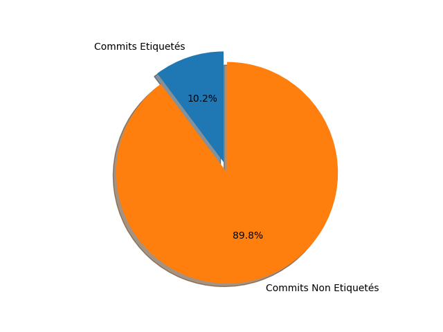
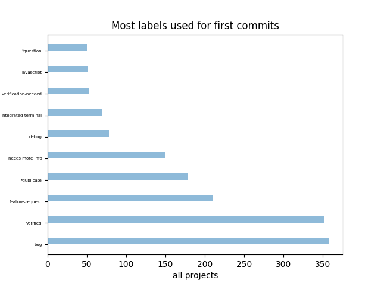

## Auteurs

Nous sommes quatre étudiants en dernière année d'ingénierie informatique à Polytech Nice-Sophia, spécialisés en architecture logicielle :

* Paul-Marie DJEKINNOU <[paul-marie.djekinnou@etu.univ-cotedazur.fr](paul-marie.djekinnou@etu.univ-cotedazur.fr)>
* Paul KOFFI <[merveille.koffi@etu.univ-cotedazur.fr](merveille.koffi@etu.univ-cotedazur.fr)>
* Florian AINADOU <[florian.ainadou@etu.univ-cotedazur.fr](florian.ainadou@etu.univ-cotedazur.fr)>
* Djotiham NABAGOU <[djotiham.nabagou@etu.univ-cotedazur.fr](djotiham.nabagou@etu.univ-cotedazur.fr)>

## I. Contexte du projet

Les tickets permettent-ils une meilleure compréhension de l’architecture d’un système ?\
Tel est le sujet qui nous a intéressé parmi ceux qui étaient proposés.

À Polytech Nice-Sophia, nous avons appris à développer de façon AGILE ces trois dernières années en utilisant des outils de VCS adéquats tel que Git dont la plateforme en ligne Github n'est plus à présenter.
Pour organiser au mieux notre développement, nous avons appris à utiliser les nombreuses fonctionnalités que Github mettait à notre disposition.\
Parmi ces fonctionnalités, l'une d'entre elle devenue incontournable aujourd'hui est l'utilisation des tickets.\
Ils permettent de documenter le code publié tout le long du projet et d'établir ainsi une traçabilité des fonctionnalités implémentées dans le temps.\
Pour une entité qui décide d'utiliser Github comme son outil de VCS, les tickets peuvent alors fournir une description de l'architecture de leur système.\
Mais est-elle complète ? Sous quelle forme se présente-t-elle ? Est-elle facile à comprendre et surtout comment procéder pour la mettre en oeuvre ?\
Telles sont les raisons qui nous ont tout de suite incité à nous intéresser à ce sujet.

De plus, en effectuant des recherches, nous avons remarqué qu'il n'y a pas que Github qui utilise ce système de tickets.\
De grandes firmes telles que Mozilla, Google ou encore MongoDB possèdent leurs propres gestionnaires de tickets (Bugzilla, IssueTracker, Jira...) et ils ont également l'avantage d'être Open Source pour la plupart.\
Ayant donc à disposition un catalogue de projets que nous pouvions étudier, le choix du sujet était devenu définitif.

## II. Observations - Question générale

Le contexte du projet étant choisi, il nous fallait une question générale pour tenter d'y répondre.\
Nous avons essayé de remonter à la source en se disant qu'il n'existe pas d'architecture sans contributeurs pour la concevoir.\
Nous nous sommes donc recentrés sur les contributeurs en se posant les questions suivantes :
En quoi consistent les premiers commits d'un nouveau contributeur de projet ? Appréhende-t-il toute l'architecture du système avant de commencer à contribuer ? Utilise-t-il les tickets dès sa première contribution et si oui, comment les utilise-t-il ?\
Ces pistes nous ont permis de nous mettre d'accord sur une question générale qu'est :

**Quels sont les éléments d'un ticket qui permettent à un nouveau contributeur d'intégrer le développement d'un projet ?**

Pour répondre à cette question, nous avons énuméré deux sous-questions :
* Les premiers commits d'un contributeur sont-ils toujours associés à des tickets existants ?
* Quelles sont les caractéristiques communes à ces tickets (types de labels, format du titre, description) ?

## III. Collecte d'informations

Pour répondre aux questions posées, il nous fallait des projets à analyser sur lesquels poser nos hypothèses et y répondre.\
Nous nous sommes encore une fois recentrés sur Github car nous étions familiers à son utilisation d'une part et nous avions à notre disposition l'API Github qui permet de faire des tests à grande échelle.\
Nous avons ainsi choisi les projets open source suivants :

* [Flutter](https://github.com/flutter/flutter)
* [Vscode](https://github.com/microsoft/vscode)
* [Facebook-React-Native](https://github.com/facebook/react-native)
* [Kubernetes](https://github.com/kubernetes/kubernetes)
* [Tensorflow](https://github.com/tensorflow/tensorflow)
* [Ansible](https://github.com/ansible/ansible)
* [OhmyZsh](https://github.com/ohmyzsh/ohmyzsh)
* [Linux](https://github.com/torvalds/linux)

Pourquoi ceux-là et pas d'autres ? Tout d'abord parce qu'ils sont open source ce qui nous permet un libre accès pour nos analyses.\
Ensuite parce que ce sont de gros projets qui regorgent de beaucoup de contributeurs, de quoi faire une analyse exhaustive.
Nous avons également consulté l'article d'un groupe de la promotion 2019 qui portait sur l'amélioration des intégrations des contributeurs et la pérennité de la communauté :

**[How to improve contributors onboarding](https://rimel-uca.github.io/chapters/2019/code-quality-in-open-source-projects-xwiki-2019/contents)**

Dans cet article, les auteurs étudient les facteurs qui attirent les contributeurs dans un projet open source pour tenter d'introduire une dynamique de contribution et pérenniser la communauté de contributeurs.\
L'analyse de grands projets tels JUnit5, Mockito, Hibernate, Apache Log4j2 et XWiki leur a permis de réaliser un sondage autour de la complexité des projets open source, l'investissement des mainteneurs de ces projets et la communication au sein de la communauté.

Parallèlement à notre étude qui traite des tickets comme points d'entrée d'un contributeur dans un projet open source, cet article traite plutôt des raisons ou motivations qui poussent les contributeurs à rejoindre un projet et propose des moyens d'amélioration des intégrations qu'ils effectuent sur les projets.\
Un contributeur peut très bien être payé pour contribuer sur un projet mais ses contributions seront-elles aussi efficaces ou innovantes que s'il appartenait à une communauté étroitement soudée sur laquelle il peut compter et si ses contributions représentaient pour lui un objectif personnel, un moyen de démontrer ses capacités et performances ?\
Et pour les mainteneurs, la complexité de leurs projets est-elle si importante qu'elle nécessite de recourir à des contributeurs externes ?\
Voici entre autres les principales questions auxquelles les auteurs de cet article ont tenté de répondre.

S'intéresser à leur étude nous a permis d'avoir une approche différente mais semblable de notre problème.\
En effet le choix des `KPI` utilisés pour corroborer ou infirmer les différentes hypothèses émises pour leur étude peut nous aider ou influer sur nos propres choix.\
Ayant décidé d'analyser les `labels`, `issues` et `commits` liés aux contributeurs pour répondre à nos hypothèses, le fait de retrouver ces `KPI` également au sein de leur article nous confirme d'une certaine façon que nous analysons les bonnes données. Les résultats des expérimentations nous en dirons plus.

## IV. Hypothèses et expérimentations

### 1. Outils utilisés

Pour effectuer nos expérimentations et répondre à nos questions, nous avons décidé d'utiliser :

* l'`API Github` qui nous permet de récupérer les informations liées aux projets tels que les `commits`, les `issues` ou encore les différents contributeurs, etc.
* Des scripts `Python` pour effectuer des requêtes vers l'API avec la librairie `Requests` et `Pyplot` pour la mise en forme des différents résultats obtenus par nos scripts.

### 2. Démarche
Pour tenter de répondre à notre question, il nous fallait répondre aux deux sous-questions. Nous avons donc émis une hypothèse tout d'abord pour la première sous-question :

* ### Sous-question 1 : Les premiers commits d'un contributeur sont-ils toujours associés à des tickets existants ?

Notre hypothèse consiste en celle-ci : **Le premier commit d'un contributeur est associé à un ticket existant.**

Pour répondre à cette question, nous avons eu besoin des premiers commits des différents contributeurs de plusieurs projets. Puisque nous parlons d'intégration dans un projet, cette intégration est représentée par les premiers commits. Nous avons donc analysé ces commits afin de savoir s'ils sont associés à des tickets existants ce qui les définirait comme des `commits étiquetés`.

Nous avons dans un premier temps recherché dans l'API Github, une url nous permettant de récupérer les commits d'un contributeur sur un projet passé en paramètre.
C'est ainsi que nous nous sommes retrouvés dans une première impasse : l'API ne renvoyait que trente(30) éléments d'une requête.
Pour une requête qui doit récupérer les commits d'un contributeur par exemple, la requête ne renvoie que les trente derniers commits du contributeur.
Ceci est dû au système de pagination que Github a mis en place pour éviter de renvoyer toutes les données (données qui peuvent être très volumineuses selon la requête) d'une requête et ainsi éviter de surcharger l'API.
Une des contraintes liées à notre analyse a d'ailleurs été la limitation du nombre de requêtes pouvant être effectuées en une heure : 5000 requêtes par heure. Dépassé ce seuil, il faut attendre patiemment que les soixantes minutes soient écoulées.

Il nous fallait donc se déplacer dans les différentes pages, la difficulté étant de trouver la dernière page, celle qui contient les premiers commits du contributeur.
Nous avons manuellement cherché la dernière page puis à partir de ce point de repère, nous avons analysé les trois dernières pages de commits.
Mais cette méthode ne convenait pas non plus car nous manœuvrions par tâtonnement pour trouver la dernière page. Nous nous sommes donc mis à chercher une information nous permettant de récupérer la dernière page de n'importe quelle requête.
Notre script analysait alors les informations récupérées dans les en-têtes des réponses retournées par le serveur pour tenter de retrouver les informations sur la pagination et indirectement sur la dernière page.
Une fois trouvée nous avons pu avancer de nouveau sur notre expérience. Cette fois-ci, nous parcourions tous les commits des 3 dernières pages (quand c'était possible car certains n'en avaient qu'une) et pour chacun d'entre eux, nous effectuions une analyse sur le message du commit. Le message du commit est un attribut du corps (body) du commit. L'analyse du message consistait à savoir si ce dernier contenait un hashtag (#) car c'était la condition pour reconnaître un commit étiqueté.

* ### Sous-question 2 : Quelles sont les caractéristiques communes à ces tickets (types de labels, format du titre, description) ?

Ici nous avons le choix entre les labels, le format du titre du ticket ou encore sa description.
La description n'est pas un indicateur de performance mesurable car elle donne juste des détails sur les fonctionnalités couvertes par le ticket concerné.
Chaque ticket ayant une description différente, la description ne peut donc constituer une caractéristique commune d'autant plus que Les niveaux de compréhension et d'interprétation de chacun étant différents.
Donc concrètement, c'était une caractéristique qui ne nous aurait pas permis de répondre à notre sous question.

Le titre du ticket était similaire à la description mais nous avons pensé que contrairement à la description, le titre pouvait avoir un certain format d'écriture qui pourrait nous permettre de répondre à notre question.
En effet, d'après un des articles de l'année dernière intitulé "***[Comment les bibliothèques de codes de Machine Learning évoluent-elles ?](https://github.com/RIMEL-UCA/RIMEL-UCA.github.io/blob/master/chapters/2020/MLAndEvolution/model2020.md)***", le format d'un commit peut suivre une certaine logique. Par exemple si le contributeur commit sur un bug il écrira dans le message de son commit `[Bug]` suivi du reste.
Nous avons donc pensé à utiliser le format d'écriture du titre d'un ticket.
Mais après avoir effectué des recherches dans les dépôts Github, nous avons remarqué que cette approche d'écriture n'était pas fortement utilisée.
Nous n'aurions donc pas eu des résultats convaincants après analyse.

Notre dernière caractéristique est donc le label.
Cette caractéristique est très fortement utilisée dans les dépôts Github pour les tickets mais aussi pour les **pull requests**.
Le label apporte une indication forte sur un ticket : son type.
Un ticket ayant pour label `bug` laisse facilement deviner le contributeur qu'il s'agit d'un bug à corriger sans même lire le titre ou la description.
Ou encore un ticket ayant pour label `help wanted` qui laisse facilement deviner qu'une aide est souhaitée ou requise sur ce ticket.
On peut ainsi penser qu'un contributeur a tendance à se concentrer sur des types de tickets.

L'autre raison qui a favorisé l'étude les labels c'est le fait que sur beaucoup de projets, nous avons remarqué la présence de labels tels que `good first issue` ou `good first contribution`.
Puisque nous analysons l'intégration dans un projet et que nous récupérons les premiers commits étiquetés, il pourrait avoir un lien entre ces commits et les labels cités précédemment.
Il nous était assez facile de récupérer les labels associés à un ticket.
Nous avons donc décidé d'étudier les labels des premiers commits étiquetés.

Notre hypothèse était alors la suivante : **les premiers commits étiquetés sont associés à des tickets ayant pour labels good first issues ou good first contribution**.

Pour vérifier notre hypothèse, nous avons recensé tous les labels des premiers commits étiquetés.
Ensuite nous avons sommé les résultats obtenus pour ressortir les 5 à 10 labels les plus utilisés.
Si dans ces derniers apparaissent les labels good first issue ou good first contribution alors notre hypothèse est vraie.
Nous avons recensé tous les labels associés aux différents tickets que nous avons trouvés sur les trois dernières page de commits étiquetés.
Ensuite nous avons récupéré le nombre qui se trouve juste après le hashtag (#) qui référence un ticket.
Une fois cela fait, on effectuait de nouveau une requête sur l'API afin de récupérer dans le corps de la réponse du ticket, les labels associés à ce ticket.
Enfin, nous enregistrons chacun de ces labels et leur nombre total correspondant, dans un fichier json nommé `nom_de_l'organisation`-`nom_du_projet`.`json` puis ces valeurs se cumulent d'un contributeur à un autre et ainsi de suite.

Pour représenter nos résultats graphiquement, nous avons parcouru chaque fichier json pour sommer tous les labels de tous les projets dans un fichier json unique nommé `all-projects`.
Ensuite nous avons calculé le nombre total de chaque attribut ou clé.
Par exemple pour la clé `labels` nous avons sommé les labels puis trié dans l'ordre décroissant.
On obtenait finalement les labels les plus utilisés aux moins utilisés. Nous avons retenu les premiers labels (environ entre 5 et 10).

## V. Analyse des résultats obtenus

* ### Sous-question 1

Après avoir analysé un bon nombre de premiers commits sur des projets, nous avons remarqué sur la base des résultats obtenus que notre hypothèse était vérifiée.
En effet sur l'ensemble des commits analysés, la majeure partie des commits sont étiquetés.
Le diagramme suivant le montre clairement :

    

La présence de commits non étiquetés peut s'expliquer par le fait que nous avons analysé 3 pages de commits pour chaque contributeur.
Cela correspond au minimum à 60 commits car excepté la dernière page, les 2 autres en ont forcément 30 chacune.
Donc en 60 commits, il peut arriver que certains commits ne soient pas associés à des tickets existants.
En revanche sur des projets comme `OhmyZsh` il faut préciser que nous avons dû réadapter notre script car la plupart des contributeurs n'avaient pas un nombre de commits pouvant aller jusqu'à 3 pages.
Certains de ces commits voire la plupart n'étaient pas étiquetés.
Nous avons également vérifié manuellement sur le dépôt Github du projet pour s'assurer du résultat obtenu.
Sur les projets de ce type, on peut remarquer que les contributeurs ne committent pas toujours en référençant des tickets.

    

Ce n'est pas le seul sur lequel nous avons remarqué des commits non étiquetés. **Tensorflow**, **Kubernetes** et **Facebook-React-Native** aussi sont dans le même cas.
En effectuant une recherche manuelle dans ces projets, on a remarqué qu'ils utilisaient un autre système de gestion de tickets que Github.
Nous avons déduit cette information à partir des messages de commits. On s'en aperçoit en regardant les images suivantes :

    
    <h5 style="text-align:center">Commits tensorflow</h5>

    
    <h5 style="text-align:center">Commits react native</h5>

Pour conclure sur cette sous-question, dans la plupart des projets Github, les contributeurs intègrent les projets avec des commits étiquetés.

* ### Sous-question 2

Comme dans la partie précédente les projets **Tensorflow** et **Kubernetes** vu qu'ils utilisent un autre système de gestion de tickets ne peuvent pas être analysés par notre script.
En effet l'attribut qui nous permettait de récupérer le numéro de la dernière page de commits (qui représente les premiers commits) n'est pas présent pour les requêtes de ces projets.
Ce qui nous contraint à déterminer cet attribut manuellement pour ensuite modifier le script. Nous avons donc préféré ne pas les inclure dans l'analyse.

En revanche, d'autres projets tels que **vscode** et **flutter** méritent approfondissement.
Nous allons vérifier si ces projets tendent à valider notre hypothèse de départ et ensuite nous analyserons le résultat général sur l'ensemble des projets que nous avons analysés.

Par souci de lisibilité, nous avons mis les graphes des labels les plus utilisés en bar chart horizontal.

**1- vscode**

Pour faire un état des lieux de vscode, nous avons analysés 744 commits dont 327 sont étiquetés.
Les raisons de la présence de commits non étiquetés ont déjà été explicitées plus haut.
Sur les 327 tickets détectés, 307 d'entre elles étaient labellisées.

Voici les dix(10) labels utilisés dans le projet :

    

On peut remarquer très rapidement l'absence de labels good first issue ou good first contribution.
On peut voir que les labels `bug` et `verified` sont extrêmement utilisés dans ce projet.
Cela peut s'expliquer par la maturité et la complexité croissante du projet où beaucoup de bugs sont détectés et répertoriés dans les tickets.
C'est un projet à complexité croissante car le label `feature-request` est juste derrière les 2 premiers et montre donc qu'il y a un certain nombre de fonctionnalités qui sont en cours d'intégration.
Ceci se déduit également au vu du nombre de mises à jour et aux ajouts d'extension par des contributeurs.
Quant au label `verified`, son utilisation fréquente peut s'expliquer par le fait qu'un membre vérifie une nouvelle partie de code intégrée sur la branche principale du projet et s'assure que les nouvelles fonctionnalités s'intègrent bien aux fonctionnalités existantes.
Si tout est correct, il finit par donner son approbation via une pull request.

**2- flutter**

Pour faire un état des lieux de flutter, nous avons analysés 802 commits dont 721 sont étiquetés.
Sur les 721 tickets détectés, 592 d'entre eux étaient labellisées.

Voici les dix(10) labels utilisés dans le projet :

    

Comme dans le projet vscode, on retrouve également en tête les labels `bug` et `verified` suivi par `feature-request`.
Là encore on note l'absence des labels `good first issue` ou `good first contribution`.
Flutter rejoint vscode dans le fait que sa complexité est croissante avec l'ajout fréquente de fonctionnalités ou de plugins de la part de contributeurs externes et internes à l'équipe du projet.
Ceci justifie donc ces trois labels car avec un ajout de fonctionnalités et/ou de plugins il faut que ces ajouts soient validés par les personnes chargées de les valider, d'autant plus que les intégrations sont suceptibles de rajouter des bugs qui doivent être corrigés.

L'analyse de ces 2 projets nous mène à croire que notre hypothèse de base est faussée et que ce sont plutôt des labels tels que `bug`, `verified` et `feature-request` qui sont pris par les contributeurs pour intégrer un projet ou du moins ce sont les labels via lesquelles les nouveaux contributeurs intègrent des projets.

Nous allons à présent passer à l'analyse générale qui prend en compte tous les projets analysés.

**3- Analyse générale**

Nous passerons directement à l'analyse des labels puisque l'analyse sur les commits a été faite précédemment.

    

Notre intuition à la fin de l'analyse des deux projets précédents s'est avérée exact.
Ici nous voyons bien que les labels `verified`, `bug` et `feature-request` sont largement devant tous les autres mais aussi que `good first issue` et `good first contribution` sont totalement absents.
Nous pourrions en réalité exclure le label `verified` car pour toute intégration d'un bout de code dans la branche principale, il faut que la procédure soit approuvée donc ce label n'est pas très pertinent à prendre en compte dans l'étude.
Nous avons d'autres labels qui spécifient des besoins auxquels les différents contributeurs répondent.
Quand nous y réfléchissons, nous avons pris des projets assez matures à grandes complexités croissantes dûs à leurs succès et leur utilisation quotidienne.
Ces projets ont des fonctionnalités qui ne cessent d'augmenter ainsi que les bugs qui sont sans cesse détectés.
Cela paraît donc logique qu'au vu de ces projets que nous aboutissions à de pareils résultats.
Tout ceci infirme notre hypothèse sur les tickets `good first` en apportant indirectement comme réponse que ce sont plutôt les labels `bug` et `feature-request` qui sont fréquemment utilisés lors des premiers commits malgré le fait qu'il y ait tout de même un nombre non négligeable sur des labels qui expriment des besoins plus spécifiques comme `integrated-terminal` ou encore `javascript`.
Même si les projets **Kubernetes** et **Tensorflow** faisaient partie de l'analyse nous pensons que leurs résultats seraient presque les même puisqu'eux aussi sont comme vscode ou flutter c'est-à-dire des projets qui grandissent au fil du temps.
Nous n'analysons pas les débuts de ces projets mais les intégrations ou contributions effectuées sur ces projets déjà en cours de développement.
Et finalement, on en vient à se poser la question suivante : **A quoi servent réellement les labels `good first issue` ou `good first contribution`?**

## **VI. Prise de recul et conclusion**

Par rapport à nos expériences, nous aurions voulu avoir un échantillon de projets encore plus grand pour avoir encore plus de données à traiter.
Mais pour le grand nombre de commits étiquetés analysés nous avons conclu qu'il y avait une tendance pour les nouveaux contributeurs à intégrer un projet par le biais de tickets labellisés `bug` ou `feature-requests` de manière générale et plus spécifiquement avec d'autres labels.
Notre analyse pourrait s'avérer biaisée par le fait qu'il soit possible que certains contributeurs dont les commits ont été analysés soient en réalité des membres de l'équipe de projet c'est-à-dire des nouveaux arrivants.
N'ayant pas eu à disposition une liste des membres de l'équipe sur les différents dépôts Github, il a fallu estimer manuellement.
Nous pouvons également ajouter que nous avons pris des projets en forte croissance avec des ajouts de fonctionnalités (ou de refactoring) très fréquentes et à cela s'ajoute un nombre assez conséquent de bugs détectés par les membres de l'équipe projet ou de simples utilisateurs du projet qui peuvent faire remonter l'information en ticket labelisé `bug`.
Le label `verified` n'est pas pertinent dans notre analyse puisqu'il est tout à fait normal qu'un nouveau code qui doit être intégré soit vérifié et approuvé (surtout pour si grands projets).

Nous pourrions donc dire que les contributeurs intègrent le développement d'un projet au travers de tickets dont les labels sont `bug` ou `feature-request` s'ils se sentent en mesure de l'achever, ou des tickets plus spécifiques qui peuvent montrer la spécialité de ces contributeurs.
Par exemple un contributeur qui intègre un projet sur un ticket `javascript` ou encore `markdown`.

Mais alors, qu'en est-il de l'utilité des labels `good first issue` ou `good first contribution`?
Sur l'article suivant : ***[An Initial Exploration of the “Good First Issue”
Label for Newcomer Developers
](https://azaidman.github.io/publications/alderliestenCHASE2021.pdf)*** qui nous a été relayé par notre encadrant de projet, on y retrouve une certaine utilité de ces labels.
L'auteur de l'article parle du fait que les labels `good first issue` sont en un sens, présents pour aider les nouveaux contributeurs à intégrer le projet.
Les tickets qui portent ce label indiquent que les contributeurs sont soit familiers au projet, soit qu'ils ne peuvent pas achever les fonctionnalités couvertes par le ticket.
Jusque-là, cela correspond à l'idée qu'on se faisait sur ces labels. L'auteur ajoute par la suite que son échantillon d'étude est beaucoup plus grand que le nôtre (environ un facteur 10 nous sépare).
Ce qui rejoint la critique que nous avons émise sur le fait que notre échantillon était encore petit.
Puisque sur son échantillon, l'auteur a rencontré près 1.5 % de tickets avec le label `good first issue`.
Même si le nombre est faible, cela montre bien que ces labels sont bel et bien utilisés.
Un peu plus loin il énumérera des types de labels qui sont pris par des développeurs novices ou expérimentés.
De ce fait, il dit dans son article que les développeurs pensent que ces labels sont utiles mais que certains contribuent à un projet car ils ont identifié les tickets sur lesquels ils voulaient travailler sans se référer aux labels et que la plupart des nouveaux contributeurs préfèrent les tickets `bug`, `documentation` comme première contribution.

Pour conclure après la lecture de cet article et sur notre étude, nous pouvons dire que les contributeurs intègrent un projet soit par des tickets qu'ils ont déjà identifiés (donc le titre et/ou la description du ticket) sans se fier aux labels soit par les labels `bug`, `documentation`, `enhancement feature` ou encore `feature-request`.
L'usage des labels `good first issue` est encore faible même si elle est très appréciée par les développeurs et peut être qu'avec une meilleure mise en avant, cette dernière pourrait devenir très utile.

## **VII. Outils**

* Postman
* Github API
* Python

## **VIII. References**

1. [Top 50 projects on github 2020](https://www.attosol.com/top-50-projects-on-github-2020/)
2. [Flutter](https://github.com/flutter/flutter)
3. [Vscode](https://github.com/microsoft/vscode)
4. [Facebook-React-Native](https://github.com/facebook/react-native)
5. [Kubernetes](https://github.com/kubernetes/kubernetes)
6. [Tensorflow](https://github.com/tensorflow/tensorflow)
7. [Ansible](https://github.com/ansible/ansible)
8. [OhmyZsh](https://github.com/ohmyzsh/ohmyzsh)
9. [Linux](https://github.com/torvalds/linux)
10. [How to improve contributors onboarding](https://rimel-uca.github.io/chapters/2019/code-quality-in-open-source-projects-xwiki-2019/contents)
11. [An Initial Exploration of the “Good First Issue” Label for Newcomer Developers](https://azaidman.github.io/publications/alderliestenCHASE2021.pdf)
12. [Scripts d'exécution des expérimentations](https://github.com/wak-nda/Rimel-TicketsForNewContributors)
