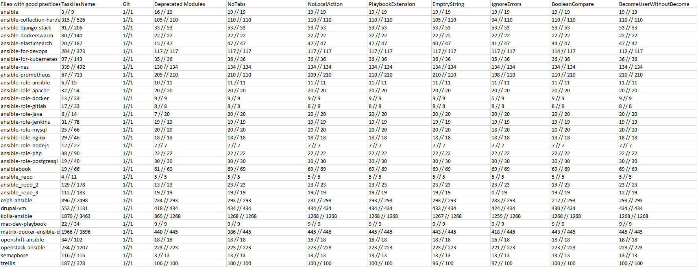
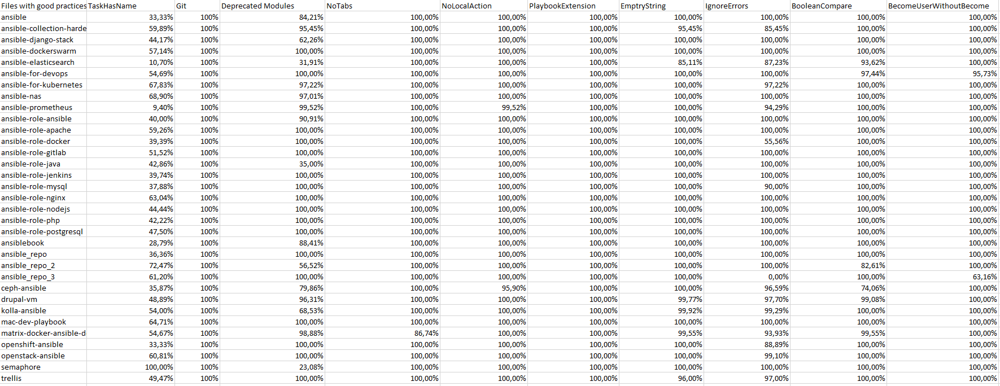

**_January 2022_**

## Auteurs

Nous sommes 5 étudiants en dernière année à Polytech Nice-Sophia spécialisés en Architecture Logicielles :

* Sofian Moumen <sofian.moumen@etu.univ-cotedazur.fr\>
* Zaïd Burkutally <mohummad-zaid.burkutally@etu.univ-cotedazur.fr\>
* Loïc Filippi <loic.filippi@etu.univ-cotedazur.fr\>
* Yannis Falco <yannis.falco@etu.univ-cotedazur.fr\>
* Kilian Clark <kilian.clark@etu.univ-cotedazur.fr\>

## I. Contexte de recherche/Projet

Ansible est un logiciel Open Source par Red Hat qui permet de gérer une infrastructure informatique, les déploiements automatisés multi-environnements, les serveurs et les configurations systèmes.
Cet outil a été développé par Michael Dehaan en Python en 2012 et fonctionne sous un environnement Linux.
Il est facile à déployer et utilise la syntaxe YAML, un langage simple, facile à lire et à écrire.
Nous constatons qu’avec l’émergence du cloud, beaucoup d’entreprises préfèrent déployer leurs infrastructures chez les providers de cloud publiques comme Amazon Web Service, Microsoft Azure ou Google Cloud Platform.
Ceci demande l’automatisation des déploiements et c’est là que les outils comme Ansible et Terraform entrent en jeu avec leur service de IaC (Infrastructure as Code).

## II. Problématiques

Cependant on remarque que lors de l'exécution d'un fichier Ansible, on ne sait pas quelle est la tâche en cours de traitement.
Les outils comme Ansible sont souvent mal utilisés en grande partie parce que les bonnes pratiques de ces outils ne sont pas respectées.
Nous avons décomposé notre problématique en sous problèmes afin de s'assurer que les bonnes pratiques pour Ansible soient bien respectées

### - Quelles sont les bonnes pratiques qui sont le plus souvent conseillées ?

La première étape consiste à rechercher, dans les blogs et dans les forums connus, comment est composé un fichier d’Ansible et quelles sont les bonnes pratiques le plus souvent conseillées par des personnes expérimentés en Ansible.

### - Peut-on identifier de façon automatique si les bonnes pratiques sont appliquées ?

Après avoir rassemblé les bonnes pratiques, on souhaite pouvoir s'assurer de leurs utilisations dans les fichiers de configurations.

### - Comment affecter un metric sur les bonnes pratiques afin de rendre les bonnes pratiques mesurable et mesurer la conformité?

Après avoir identifié les bonnes pratiques, on souhaite mettre en place un type de metric pour pouvoir le mesurer afin de determiner qu'un fichier est meilleure qu'un autre.
Ces metrics représenteront si un fichier Ansible respecte bien les bonnes pratiques et plus le score obtenu est elévé, plus les bonnes pratiques sont respectées.
Enfin, on pourra donner une note d'ensemble, comme une moyenne d'implémentation des bonnes pratiques à un projet.

## III. Récupération des informations

Notre projet se concentre sur la détection de l'utilisation des bonnes pratiques dans les projets ansible.
En premier lieu nous avons décidé de récupérer toutes les bonnes pratiques trouvable sans se soucier de leur pertinence.
Pour lister ces bonnes pratiques, nous avons eu a faire à plusieurs source d'information:
- La documentation officiel d'Ansible
- Stack overflow
- Github

 Pour chaque bonne pratique listé nous avons jugé alors de leur criticité "LOW-HIGH" et sa facilité à être détecté automatiquement.

## IV. Hypothèse et expériences

Maintenant que nous avons filtré les bonnes pratiques, il nous faut trouver un moyen de pouvoir les détecter automatiquement dans les projets ansibles.
Pour se faire, nous avons sélectionné un datasets de projets qui répondaient à certains critères.
En effet les projets trop petits, les projets d'étudiants ou de démo ne satisfaisant pas nos critères de sélections car contenant trop peu de fichier à parser.

Nous nous sommes basés sur les plus gros projets, contenant le plus de contributeurs et qui sont le plus suivis par la communauté d'ansible.
En d'autre termes, les projets qui ont le plus d'étoiles sur github.
Nous avons pu sélectionner plus de 30 projets de cette manière pour constituer notre dataset. 

Par la suite, nous avons développé notre parser pour qu'il puisse détecter l'usage de bonne pratique dans un projet.

Nous avons ensuite procédé à un second filtrages des bonnes pratiques. En effet, techniquement certaines bonnes pratiques sont plus difficiles à détecter que d'autres, nous avons donc filtré les bonnes pratiques par difficulté de développement tout en gardant des bonnes pratiques qui sont "intéressantes" et importantes à détecter.

Nous avons gardé environ 10 bonnes pratiques, chacun des projets sont évalués avec ces bonnes pratiques : 

- Vérification si les tâches sont nommés 
- Vérification de l'emploi de module déprécié 
- Vérification du bon emploi de Git
- Vérification du format (pas de tab dans les fichiers)
- Vérification du non-emploi du mot clé "LocalAction"
- Vérification du non-emploi du mot clé "PlaybookExtension"
- Vérification du non-emploi du mot clé "IgnoreError"
- Vérification qu'il n'y pas de chaine de caractères vide 
- Vérification du non-emploi de "become_user"

Pour chaque projet, le parser analyse tous les fichiers .yml et détecte si les bonnes pratiques ne sont pas respectées. 
Certaines bonnes pratiques sont plus critiques que d'autres par exemple, l'utilisation de modules dépréciés.

A partir de ces données, nous pouvons donc formuler l'hypothèse que les bonnes pratiques sont mesurables, en nuançant celles qui sont très difficiles à implémenter techniquement (hors scope). 

Nous avons donc utilisé notre parser sur notre dataset, nous avons pu avoir des résultats sur le taux d'utilisation des bonnes pratiques selectionnées dans notre dataset de projets.

## V. Analyse des résultats et conclusion

Voici les tableaux des résultats, le premier tableau affiche les résultats sous la forme (fichiers qui respectent les bonnes pratiques) / (nombre de fichier total parsé). 
Tandis que le second affiche le résultat en pourcentage.

Nous pouvons remarquer que les résultats sont assez homogènes par rapport au respect des bonnes pratiques sur l'ensemble des projets.
La seule bonne pratique qui donnerait quelques faux-positifs en fonction de l'analyse des résultats est la bonne pratique de nommage des tâches.

En effet, cela est dû principalement à la difficulté pour reconnaitre un fichier yaml qui contient exclusivement des tâches d'un autre fichier de configuration.

## VI. Outils

Nous avons choisi python comme langage de programmation pour notre parser car c'est un langage qui propose une simplicité de développement pour les parsers.

Pour visualiser les données à chaque compilation, nous avons utilisé une librairie qui nous permet de translater les données dans un fichier excel sans avoir besoin de rédémarrer le document.

## VII. Références

1. https://www.ansible.com/blog/ansible-best-practices-essentials
2. https://ansible.github.io/workshops/decks/ansible_best_practices.pdf

