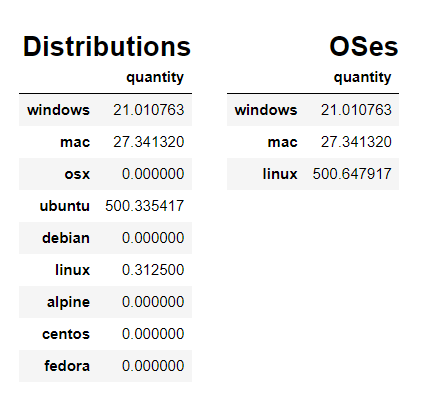
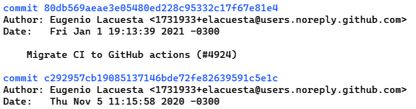

# Sujet 4 : Extraire des informations sur les systèmes de build (variabilité des builds)

**_janvier 2022_**

## __Auteurs__

Nous sommes cinq étudiants en dernière année à Polytech' Nice-Sophia specialisés en Architecture Logicielle :

* Barna Anthony &lt;anthony.barna@etu.univ-cotedazur.fr&gt;
* Burette Léo &lt;leo.burette@etu.univ-cotedazur.fr&gt;
* Defendini Lara &lt;lara.defendini@etu.univ-cotedazur.fr&gt;
* Savornin Guillaume &lt;guillaume.savornin@etu.univ-cotedazur.fr&gt;
* van der Tuijn Anton &lt;anton.van-der-tuijn@etu.univ-cotedazur.fr&gt;

## __I. Contexte de recherche__

__Contexte__

Dans un contexte où beaucoup de systèmes sont interconnectés sur des plateformes variées, il est primordial de s'assurer de l'intégrité de ces derniers. Il est par exemple difficilement imaginable que certains utilisateurs d'un navigateur possèdent une meilleure expérience d'utilisation que les autres. 
De la même manière, il existe à l'heure actuelle un nombre grandissant de systèmes d'exploitation, et la majorité d'entre eux, voire idéalement l'intégralité, doit être supportée par les logiciels que l'on crée. En effet, cela leur permettra de toucher un plus grand nombre d'utilisateurs, n'étant plus limités par la plateforme qu'ils exploitent.

__Intérêt du sujet__

Pour gérer l'ensemble de ces points, il devient donc essentiel de disposer d'une chaîne d'intégration et de déploiement continus. En effet, cela permet de tester les différents cas d'utilisation existants ainsi que leurs différents contextes, mais aussi de les déployer de manière automatique et potentiellement conditionnelle.

C'est donc la multitude de perspectives ouvertes par ce sujet, qui mène à des cas d'étude concrets sur des systèmes à la pointe de leur époque, qui le rendent intéressant.

## __II. Observations et question générale__

Les phases de mise en contexte et d'analyse ayant induit plusieurs recherches préliminaires sur ce thème nous ont permis d'affiner notre sujet et de nous focaliser sur la question générale suivante :  
### **_Comment la variabilité des différents systèmes d'exploitation est-elle gérée dans les chaînes d'intégration ?_** 

### __Décomposition du sujet en sous-questions__
- __Quels sont les systèmes d'exploitation et distributions les plus souvent supportés ?__  
La compatibilité logicielle est le point clé des recherches menées à travers ce sujet. En effet, aujourd'hui, un grand nombre de logiciels sont compatibles avec la plupart des systèmes d'exploitation (Windows, MacOS, Linux et ses dérivées...). Cependant, certains logiciels tels que les éditeurs de la suite Microsoft 365 ne sont par exemple pas disponibles sur les distributions Linux.  
Ainsi, nous souhaitons tout d'abord prendre en compte quels sont les systèmes d'exploitation et distributions les plus souvent supportés. Cela nous donne des indications sur ce que l'on peut le plus facilement trouver lors de l'analyse des CI.
Cela nous permettra de définir notre première KPI et d'obtenir des statistiques la concernant.

- __Comment une CI peut-elle s'assurer qu'un logiciel est conforme sur les différents systèmes d'exploitation qu'il doit supporter ?__  
A travers cette question, l'objectif est de comprendre, identifier et caractériser les propriétés testées dans les chaînes de CI/CD des applications multi-OS permettant d'assurer que le logiciel peut fonctionner de la même manière et avec des efficacités similaires sur les différents systèmes d'exploitation.
Après avoir compris quelles sont les propriétés testées dans les chaînes de CI/CD pour répondre à notre problématique, nous cherchons à savoir quelles sont les méthodes les plus efficaces utilisées pour tester ces propriétés.

- __Quels peuvent être les facteurs pouvant rendre difficile la prise en charge d'un système d'exploitation supplémentaire par la CI ?__  
En fin d'étude, nous nous demanderons si l'adaptation d'une application pour supporter un nouveau système d'exploitation impliquerait un fort changement au niveau de la CI. Et surtout, s'il est possible d'identifier une ou plusieurs sources de difficulté dans cette opération. Ainsi, cela relèverait de l'adaptabilité de la CI/CD à une variabilité continue du code.

## III. Collecte d'informations

Comme évoqué précédemment, nous avons choisi d'effectuer des recherches générales concernant notre sujet afin de pouvoir définir de la manière la plus juste possible les expériences à conduire.
Cela nous a permis de définir des hypothèses et expériences pertinentes apportant des informations utiles à l'élaboration de notre propos.

### __Articles de recherche__

#### __*On the notion of variability in software product lines*__
> [IEEE Xplore - On the notion of variability](https://doi.org/10.1109/WICSA.2001.948406)

Cet article ne traite pas directement de notre sujet, qui concerne la variabilité des systèmes d'exploitation. Cependant, il expose beaucoup d'informations sur ce qu'est la variabilité de manière générale et nous permet une meilleure compréhension de ce que nous devons rechercher. Dans la partie concernant la gestion de la variabilité, on apprend que cette gestion consiste en trois étapes principales : l'identification, les contraintes et l'implémentation. Dans notre cas, nous nous chargerons de repérer la partie "implémentation" mise en place par les développeurs dans les chaînes d'intégration et de déploiement.

#### __*Patterns for Continuous Integration Builds in CrossPlatform Agile Software Development*__
> [CiteSeerX - Patterns for CI Builds in CrossPlatform Agile Software Development](https://citeseerx.ist.psu.edu/viewdoc/download?doi=10.1.1.682.9894&rep=rep1&type=pdf)

Cet article est, par rapport au précédent, beaucoup plus proche de notre question principale. En effet, il expose clairement et de façon détaillée les patterns d'intégration continue des logiciels *cross-platform*. Ainsi, nous avons pu en déduire que dans chaque automatisation, on trouvera un module correspondant à l'application en elle-même et un module correspondant aux plateformes (/ systèmes d'exploitation) supportées.  
Dans la section 5.2. de l'article (page 17), le pattern *remote build* est expliqué. On y découvre que les projets de petite taille peuvent souvent utiliser des builds locaux correspondant à chaque plateforme, ce qui peut nous donner une piste sur des noms de fichiers de build à rechercher lors de nos expériences. Ce pattern est en réalité supporté par GitHub actions, ce qui facilitera nos recherches. Le principe est simple : le build à distance permet de cibler, depuis le même build, différentes plateformes. Il nous suffira donc de rechercher directement dans les fichiers des mots clés permettant de repérer les cibles sur lesquelles ces "parties" de build tourneront. *Ce sera en réalité le principe même de notre première expérience.*

#### __*Continuous Integration for mobile devices*__
> [Core organisation - Continuous Integration for mobile devices](https://core.ac.uk/download/pdf/197539516.pdf#page=153)

Dans la partie 3.1. de cet article (page 155), nous avons pu comprendre à nouveau que le point le plus important lors de la définition d'une CI/CD cross-platform est le fait de définir exactement sur quelle plateforme nos tests et builds vont tourner, afin de définir des mesures appropriées car le résultat de nos builds peut même dépendre de la __*version*__ du système d'exploitation, et pas seulement de son type. On peut trouver ci-dessous un schéma tiré de cet article  montrant les différentes étapes détaillées que l'on doit prendre en compte pour une chaîne d'intégration et de déploiement continus automatisée dans le cas du [*Xamarin Test Cloud*](https://docs.microsoft.com/en-us/appcenter/test-cloud/).

## IV. Hypothèses et Expériences

### __Quels sont les systèmes d'exploitation et distributions les plus souvent supportés ?__
#### __*Hypothèse*__
D'après [un article de Western Governor university](https://www.wgu.edu/blog/5-most-popular-operating-systems1910.html#close), les 5 systèmes d'exploitation les plus populaires seraient :  
- Microsoft Windows
- Apple macOS
- Google Android OS
- Apple iOS
- Linux  

Ces systèmes ne possèdent pas forcément le même noyau, mais macOS, Android, iOS et Linux sont basés sur des noyaux UNIX. Android est quant à lui basé sur une distribution Linux.

Notre hypothèse est donc que, concernant les systèmes d'exploitation (hors mobile), les plus populaires sont classés dans cet ordre :  
- Microsoft Windows
- Apple macOS
- Linux  

#### __*Expérience*__
Pour confirmer notre hypothèse, nous avons récupéré des échantillons de wokflows GitHub actions via [l'API GitHub](https://docs.github.com/en/rest/reference/search) qui est requêtée par un script Python. Un second script permet ensuite de générer des statistiques en analysant les fichiers au format yml.  

Avec un échantillon de 549 repositories contenant des fichiers de processus automatisés de test et/ou déploiement, nous vérifions quels systèmes d'exploitation sont couverts. Le choix de ces repositories s'est fait en fonction du nombre de "stars" qu'ils ont obtenu sur GitHub. En effet, nous sommes partis du principe que plus ce nombre était grand, plus nous avions de chances d'analyser des repositories multi-OS maintenus, ayant des fichiers "workflow" réellement utilisés.

#### __*Résultats*__
Nous avons pu, après analyse des différents fichiers obtenus, obtenir les résultats suivants. Sur le tableau de gauche, on peut voir les résultats (discrétisés) par mots clés, correspondant à ceux trouvés dans les fichiers de configuration. Sur le tableau de droite, nous avons affiché une réunion de ces statistiques cette fois par système d'exploitation, de manière plus générale.  

Voici également un diagramme représentant la répartition des configurations correspondant à des systèmes d'exploitation, cette fois calculée en pourcentage.  

Le résultat montre que dans le monde de l'open source, linux semble être bien plus couvert que les autres systèmes d'exploitation, ce qui peut ne pas paraître intuitif lorsque l'on connaît la popularité de chacun de ces systèmes.  

Le fait que les technologies de GitHub actions reposent sur Docker, qui base ses conteneurs sur des noyaux Linux aide certainement les utilisateurs à faire des choix concernant les systèmes d'exploitation à tester. Cependant, nous considérons que si les applications venaient à être exécutées sur d'autres environnements, des comportements non envisagés pourraient apparaître.  

### __Comment une CI peut-elle s'assurer qu'un logiciel est conforme sur les différents systèmes d'exploitation qu'il doit supporter ?__

#### __*Expérience*__
Nous avons décidé d'utiliser les fichiers obtenus dans la première expérience pour répondre à cette question. L'objectif était donc d'abord d'analyser manuellement les différents morceaux de code correspondant aux différentes contraintes de système d'exploitation, afin de comprendre ce que l'on testait spécifiquement selon les différences de ces plateformes.

L'objectif est donc de savoir :
- s'il existe des différences entre ces morceaux de code à tester
- si oui, sont-elles identifiables selon des mots clés permettant une possible automatisation de la recherche sur un grand nombre de fichiers.

#### __*Résultats*__
Après analyse manuelle d'une dizaine de fichiers, nous avons observé que les spécifications de système d'exploitation que nous avions trouvé n'impliquent pas forcément de critères spécifiques à tester, mais servent en réalité à simplement vérifier que tout se déroule correctement sur chaque système d'exploitation.

### __Quels peuvent être les facteurs pouvant rendre difficile la prise en charge d'un système d'exploitation supplémentaire par la CI ?__  
#### __*Hypothèse*__

Nous prenons pour hypothèse qu'ajouter le support d'un nouveau système d'exploitation à une structure d'intégration et de déploiment continus existante ne demande pas beaucoup d'efforts. Nous considérons ici uniquement l'aspect structure à implémenter et non le développement spécifique à une plateforme.

#### __*Expérience*__

Prenons [l'exemple du Framework Scrapy](https://github.com/scrapy/scrapy). 

* C'est un framework permettant l'extraction de données de pages web.
* Il supporte les trois systèmes d'exploitation principaux sur PC, à savoir Windows, macOS et Linux.
* Il utilise GitHub Actions comme technologie de CI/CD.

Notre démarche consiste en l'analyse de l'historique des commits réalisés au niveau des workflows GitHub Actions pour évaluer les efforts qui ont été demandés pour ajouter des systèmes d'exploitation à la CI/CD.

Il faut noter que nous avons effectué cette expérience de manière manuelle uniquement, car les informations que nous cherchions étaient assez subjectives. En effet, il n'existe pas de "norme" pour le nommage du type de commit que nous cherchions, et l'évaluation de la complexité de l'ajout d'un système d'exploitation à supporter ne pouvait pas être quantifiée ni de ce fait automatisée.

#### __*Résultats*__
En analysant l'historique des workflows, nous avons isolé deux commits en particulier. 
Dans le premier, les tests sont uniquement lancés dans un environnement Windows.
Le deuxième ajoute le support de Linux et macOS.

L'ajout du support de ces deux systèmes d'exploitation consiste en la création d'environnements appropriés à l'aide de technologies de conteneurisation, puis à l'appel d'une série de tests créés par les développeurs.

Sur un an, 13 commits ont suffi au maintien de la CI/CD de ce projet. Cela semble peu pour un projet de cette ampleur.

Aujourd'hui les fichiers permettant l'intégration continue et le déploiment continu sont des fichiers de configuration au format YAML n'excédant pas une cinquantaine de lignes chacun.

## V. Outils utilisés

### API de recherche GitHub
Comme nous l'avons évoqué précédemment, nous avons utilisé l'API mise à disposition par GitHub pour rechercher des fichiers dans des repositories publics, selon des critères spéciaux que nous avons définis.

### Script python de recherche et d'analyse
Comme expliqué dans l'expérience correspondant à la première question, nous avons écrit un script python utilisant l'API de recherche de GitHub afin d'obtenir des statitiaues sur les systèmes d'exploitation les plus supportés par les applications open source dont le code est disponible sur GitHub.

## VI. Analyse des résultats

### Première expérience

les résultats de cette première expérience nous on montré plusieurs choses :
- comme expliqué lors de l'expérience, le fait que les distributions linux soient les plus présentes dans les résultats obtenus peut s'expliquer par le fait que GitHub actions utilise Docker, dont les conteneurs sont basés sur des noyaux Linux;
- une grande partie des fichiers où le système d'exploitation est spécifié ne spécifie en réalité que des versions différentes d'une même distribution.  

Cela nous donne donc évidemment une estimation de la tendance générale de la répartition des systèmes d'exploitation supportés par les applications open source, mais ces données sont à manipuler avec précaution étant donné la configuration actuelle des environnements de build et de test, qui ont une forte influence sur cette répartition.  
Nous pouvons également déduire de ces résultats que, comme nous nous en étions doutés à la lecture des articles de recherche, non seulement les systèmes d'exploitation doivent être supportés, mais aussi l'intégralité de leurs versions. Cela démontre bien l'importance d'une gestion précise de la variabilité qui peut s'exprimer à différents niveaux.

### Deuxième expérience

 La deuxième expérience nous a permis de savoir qu'en réalité, la variabilité des systèmes d'exploitation est totalement gérée par le code, et non par les chaînes d'intégration et de déploiement. Les résultats obtenus ne sont pas étonnants et sont totalement compréhensibles et logiques étant donné que l'objectif premier lors du développement d'une application est qu'elle fonctionne de la même manière sur tous les systèmes d'exploitation qu'elle supporte, en fournissant les mêmes fonctionnalités.  
La CI a donc pour rôle principal de s'assurer de faire tourner les builds et tests sur les différents systèmes d'exploitation supportés afin de vérifier que tout fonctionne correctement.
 

### Troisième expérience

De cette expérience, nous avons pu déduire les points suivants :
* Pour un projet de cette envergure, l'intégration d'un nouveau système d'exploitation à la structure semble simple. 
* La complexité est déplacée dans les tests implémentés en Python. La responsabilité de gérer ces derniers est déléguée aux développeurs.
* Les technologies de conteneurisation permettent de facilement recréer des environnements de test.  

Ces résultats et leur interprétation viennent donc corréler ceux de la seconde expérience. En effet, encore une fois, nous avons un parfait exemple que toute la complexité est en réalité dans le code lors de la décision de supporter un système d'exploitation supplémentaire.

Il est important toutefois de se rappeler qu'à l'inverse, les environnements nécessitent parfois un grand nombre de configurations pour pouvoir y adapter une chaîne d'intégration. En effet, c'est par exemple le cas pour les applications mobiles (environnements Android et iOS, architectures de processeurs différentes ...).
## VII. Conclusion

Pour conclure, nous avons procédé à des expériences pour tenter de répondre aux sous-questions que nous avions déduit de notre question principale, qui était __"Comment la variabilité des différents systèmes d'exploitation est-elle gérée dans les chaînes d'intégration ?"__. 
Au fil de cette étude, nous avons donc mis en évidence que les chaînes d'intégration ne comportent pas la complexité ni la logique correspondant à l'adaptation aux différents systèmes d'exploitation. Cela est totalement sous la responsabilité des développeurs et fait entièrement partie du code source. Les CI se doivent cependant d'assurer une vérification sur tous les systèmes d'exploitation supportés, au risque de rater des erreurs causées par leur variabilité.

## VIII. References

 J. van Gurp, J. Bosch, and M. Svahnberg. 2001. On the notion of variability in software product lines. In Proceedings Working IEEE/IFIP Conference on Software Architecture, IEEE Comput. Soc, Amsterdam, Netherlands, 45–54. DOI: https://doi.org/10.1109/WICSA.2001.948406  

CHIN-YUN HSIEH, CHIEN-TSUN CHEN, 2015. Patterns for Continuous Integration Builds in Cross-Platform Agile Software Development. DOI :
https://citeseerx.ist.psu.edu/viewdoc/download?doi=10.1.1.682.9894&rep=rep1&type=pdf

Enes Erdogan, Dr. Till Riedel, 2014. Continuous Integration for mobile devices. DOI : https://core.ac.uk/download/pdf/197539516.pdf#page=153

Xamarin - introduction to test cloud, https://docs.microsoft.com/en-us/appcenter/test-cloud/  

Western Governor university, 2021. 5 most popular operating systems. https://www.wgu.edu/blog/5-most-popular-operating-systems1910.html#close  

GitHub Docs. API GitHub SEARCH. https://docs.github.com/en/rest/reference/search

GitHub. Code Source du framework Scrapy. https://github.com/scrapy/scrapy
