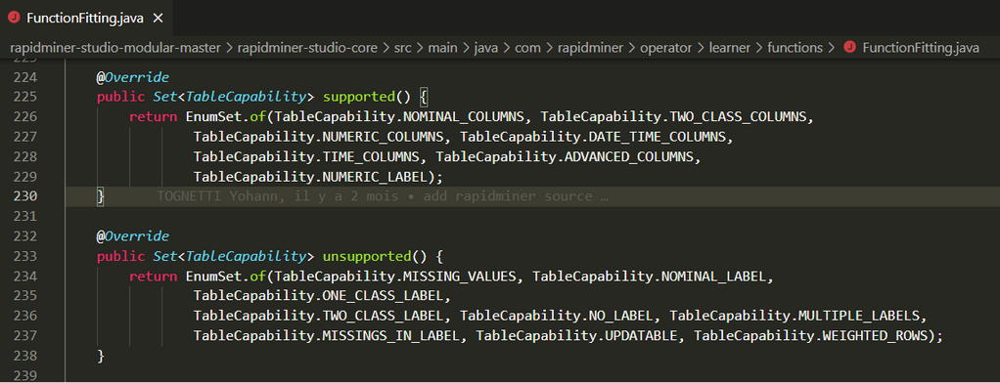
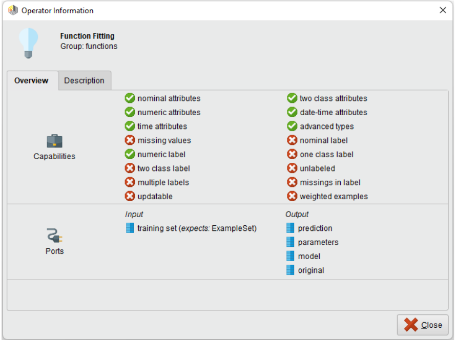
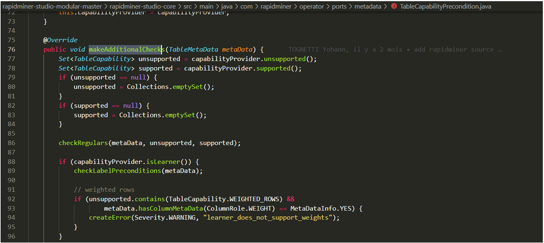
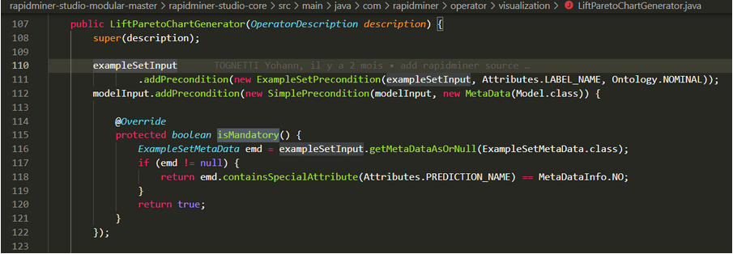
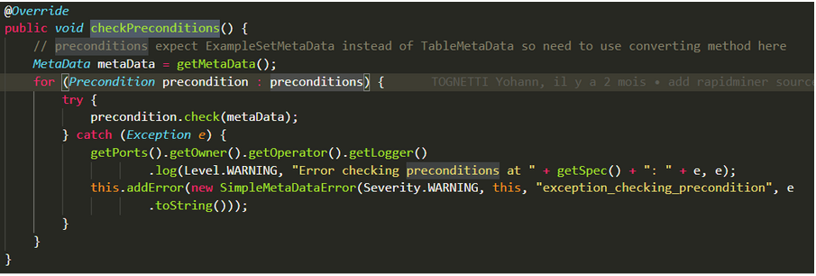
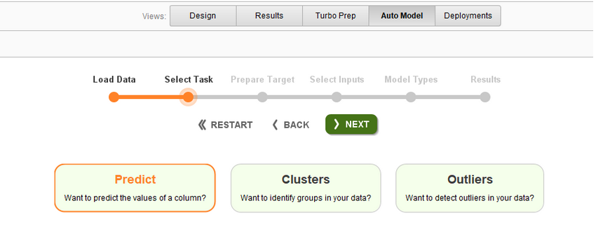
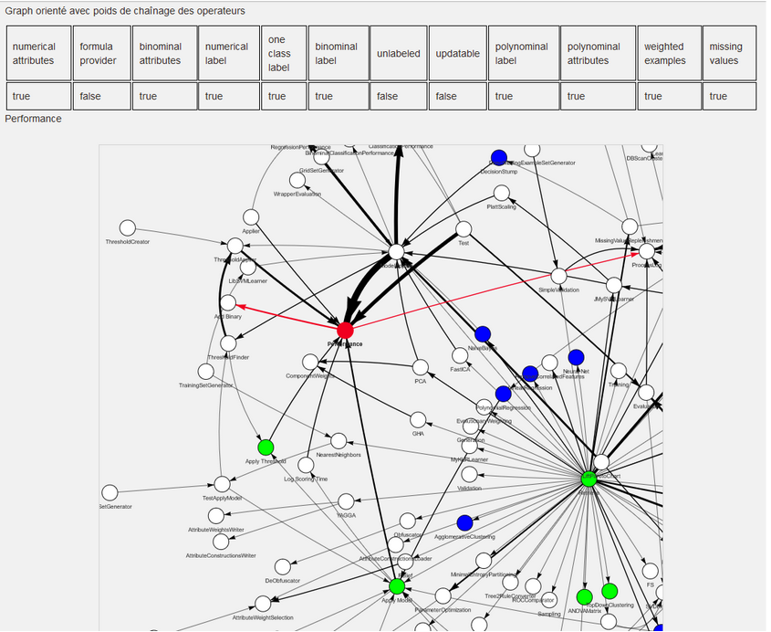
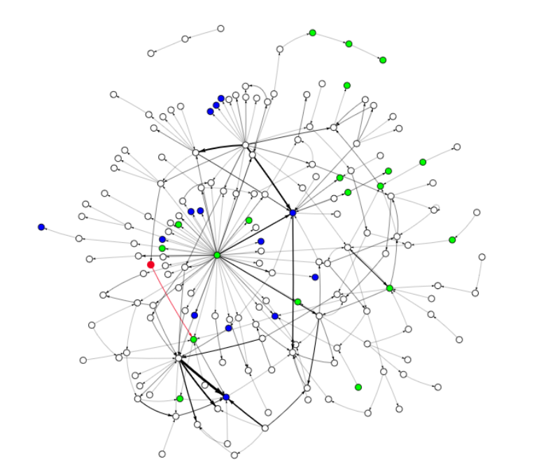
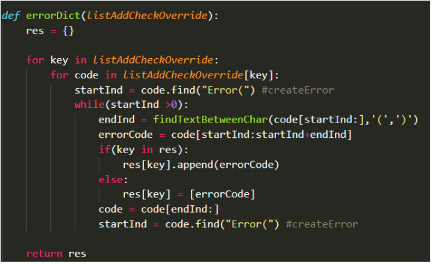

## Auteurs

Nous sommes cinq étudiants de dernière année à Polytech Nice Sophia spécialisés en Architecture Logicielle :

* Tigran Nersissian &lt;tigran.nersissian@etu.univ-cotedazur.fr&gt;
* Yann Martin D&#039;Escrienne &lt;yann.martin&dash;d&#039;escrienne@etu.univ-cotedazur.fr&gt;
* Valentin Campello &lt;valentin.campello@etu.univ-cotedazur.fr&gt;
* Lucie Morant &lt;lucie.morant@etu.univ-cotedazur.fr&gt;
* Yohann Tognetii  &lt;yohann.tognetti@etu.univ-cotedazur.fr&gt;

## I. Contexte
Dans le domaine du machine learning, tous les algorithmes utilisés requièrent des préconditions sur leur données d’entrée. Ces préconditions sont parfois très restrictives et il est donc difficile de les satisfaire. Notamment lorsque plusieurs de ses algorithmes s'utilisent les uns à la suite des autres.    
 
C’est le cas dans RapidMiner est un outil open source très avancé de construction de workflows de machine learning. Il intègre notamment la possibilité de définir de nouveaux opérateurs (algorithmes) en précisant les préconditions sur ces algorithmes et l’impact sur les données en sortie. Cette information est utilisée pour aider l’utilisateur en l’empêchant de connecter des datasets et des opérateurs inadaptés. Mais bien souvent les informations ne sont pas toujours claires ou disponibles et il n’y a qu’au moment du lancement des algorithmes que l’erreur de préconditions apparaît.    

Ainsi, en partant des codes de RapidMiner, nous aimerions “sortir” cette connaissance pour l’étudier et la ré-injecter dans un environnement dédié à l’enseignement. Plus précisément, nous voudrions extraire les préconditions des opérateurs, afin de possiblement les associer à la hiérarchie de définition des opérateurs. Nous pourrions ainsi savoir plus facilement les différentes préconditions de ceux-ci de manière générale mais aussi précise. Il serait ainsi intéressant d’avoir des statistiques sur l’utilisation des préconditions, ainsi qu’une analyse des impacts de ces différentes algorithmes (comment les données sont modifiées en sortie).     

## II. Observations
RapidMiner étant un outil nouveau pour nous, la première question que nous nous sommes posés est : **“Est-il possible d’extraire les pré-conditions des opérateurs à l’aide de l’analyse de RapidMiner ?”**.   
Cela nous a paru être une question intéressante à se poser, car, tout d’abord, le thème du machine learning nous semble intéressant et de nombreuses approches toutes différentes nous sont venues au sein du groupe. Également, s’il est effectivement possible de tirer des informations à partir du code de RapidMiner, alors notre travail sera réutilisé dans un environnement dédié à l’enseignement. Cela nous a donc encore plus motivé à trouver diverses solutions pour permettre aux étudiants d’utiliser nos outils de visualisation de manière interactive.     
Nous avons donc réfléchi à des manières d’affiner cette question afin de mieux y répondre et en sommes venus à trois sous-questions : 
1. Quels sont les types de préconditions ? Quels types de données ?
2. A quel niveau les préconditions sont-elles associées ?
3. Quels sont les impacts des opérateurs sur les données ?

## III. Collecte d'informations
Nous avons d’abord tous récupéré le même projet GitHub RapidMiner pour s’assurer que nous avions tous la même base pour la collecte d’informations. Comme il existait plusieurs repositories RapidMiner, notre choix s’est orienté vers celui le plus populaire, ainsi que le plus récent : [rapidminer-studio-modular](https://github.com/rapidminer/rapidminer-studio-modular).      
Afin d’extraire les différentes données récupérables dans RapidMiner, on utilise Sikulix pour ce qui est lié à l’interface graphique et les expressions régulières (Python) ainsi que Spoon pour ce qui est lié au code source. Quant au traitement des métriques prélevées, un tableur classique (du type Excel) nous permet de créer des tableaux et des histogrammes. De plus, nous utilisons du HTML + PureJS avec la libraire vis-network pour visualiser les graphes de chaînages des opérateurs, ainsi que les capabilities de manière dynamique directement sur Github.io.     

## IV. Hypothèses & Expériences
### 1. Quels sont les types de préconditions ? Quels types de données ?

**Hypothèse**

Le code source ajoute des préconditions sur chaque classe correspondant aux opérateurs de manière relativement uniforme. L’interface affiche des capabilities de manière similaire entre les opérateurs. Un héritage est assez fort entre les opérateurs et chacun hérite des préconditions de son parent. 

**Expérimentation**

Pour découvrir les types de préconditions existantes, nous avons effectué en parallèle une analyse sur l’interface graphique à l’aide de Sikulix et une analyse sur le code source avec les expressions régulières et Spoon.     
Sikulix nous a servi à récupérer l'overview des opérateurs qui informent des données supportées ou non afin d'en faire un tableau de résultats par la suite, chaque colonne étant l'acceptation ou non des différents types d'entrées. L’emploi de l’OCR pour récupérer les noms et les types de capabilities s’est fait aisément grâce aux fonctions built-in intégrées dans Sikulix (librairie openCV utilisant Tesseract).     
Au niveau des expressions régulières, celles-ci nous ont permis d’effectuer une analyse directe sur le code source de RapidMiner et d’obtenir la fréquence à laquelle la classe d’une certaine précondition est présente. Nous avons pu, à l’aide de ces informations, créer un histogramme montrant le nombre de fois qu’une classe est appelée et ainsi identifier les classes les plus utilisées. Également, nous avons traité et exporté les données sur les connexions existantes entre les opérateurs de RapidMiner (un exemple de connexion serait qu’un opérateur X produit des données que l’on peut fournir en entrée d’un opérateur Y).  Ce résultat a été affiché sous la forme d’un graphe avec des poids à l’aide de vis-network. Nous avons essayé de faire la même chose avec des flows déjà lancés au moins une fois dans OpenML mais les résultats n’étaient pas concluants car la version de RapidMiner Studio qu’avait été utilisée pour créer ces projets n’étaient pas compatible avec notre version de RapidMiner Studio.
Quant à Spoon, nous n’avons pas réussi à en tirer quelque chose car il nous était impossible de le faire compiler avec nos outils car nous n’avons pas pu avoir les fichiers .jar de dépendance nécessaire à la compilation du projet open source mise à disposition sur le GitHub officiel de RapidMiner car la solution RapidMiner est devenue une solution propriétaire et commercialisée, le code n’est donc plus open source. Nous avons donc vite abandonné cette piste afin de nous concentrer sur nos autres approches (parseur avec python, extraction des données avec Sikulix, etc...).     
 
### 2. A quel niveau les préconditions sont-elles associées ?

**Hypothèse**

Nous nous attendons à minima à découvrir que les préconditions sont associées et ont un lien direct avec les opérateurs que ce soit par le nom ou par un autre élément. Nous souhaitons pouvoir retrouver des préconditions communes à des familles d’opérateurs.

**Expérimentation**

Suite à nos recherches sur la première sous question, nous nous sommes retrouvés avec des données sur les préconditions ainsi que sur les capabilities extraites des opérateurs. Avec cet ensemble de données, nous aurions voulu pouvoir établir des liens entre les deux.      
Car les développeurs ne nomment pas les Opérateurs dans le code de la même manière qu’elle sont affichés sur l’interface de RapidMiner Studio, la différence de noms des fonctions de préconditions et les capabilities était trop grande. Nous n’avons pas pu le faire de façon algorithmique avec uniquement l’information sur les noms. Nous avons alors commencé à chercher un nouveau moyen de déterminer différents éléments de liaison entre préconditions et capabilities, cela s’est fait en parcourant le code source où les préconditions étaient utilisées.       
Au cours des recherches sur la question précédente, nous avons remarqué que beaucoup de préconditions étaient surchargées lors de leurs utilisations. Certaines de ces surcharges semblaient ajouter des types de données obligatoires en entrée. Du côté de l’interface, nous avons remarqué que deux des opérateurs (DBscan et Function Fitting) avaient un nombre de capabilities différentes des autres, qui eux en comptaient 8 normalement. Nous avons alors conclu que cela était lié à la surcharge précédente, comme le montre les captures d’écrans ci-dessous :  

[Extrait du code dans GitHub](https://github.com/SI5-I-2021-2022/RIMEL/blob/c65db1896fd8a1cc25b91445848443db33380c82/rapidminer-studio-modular-master/rapidminer-studio-core/src/main/java/com/rapidminer/operator/learner/functions/FunctionFitting.java#L224-L238)

Nous avons alors décidé de nous concentrer sur les différentes surcharges dans le code source. Chaque override avait de nombreux contenus assez hétérogènes mais deux comportements ressortent souvent : l’ajout de comportement sur la vérification et le fait qu’une propriété n’est plus obligatoire. 

[Lien vers le code dans le GitHub](https://github.com/SI5-I-2021-2022/RIMEL/blob/c65db1896fd8a1cc25b91445848443db33380c82/rapidminer-studio-modular-master/rapidminer-studio-core/src/main/java/com/rapidminer/operator/ports/metadata/TableCapabilityPrecondition.java#L75-L100)

[Lien vers le code dans le GitHub](https://github.com/SI5-I-2021-2022/RIMEL/blob/c65db1896fd8a1cc25b91445848443db33380c82/rapidminer-studio-modular-master/rapidminer-studio-core/src/main/java/com/rapidminer/operator/visualization/LiftParetoChartGenerator.java#L107-L122)

A côté de cela, nous avons remarqué que les méthodes dans les surcharges réalisaient beaucoup de lancement de messages d'erreur. Ces messages d’erreur ressemblaient pour la plupart à ce qui pourrait être notifié lorsqu’une des capabilities n’était pas satisfaite. Cette information pouvait donc nous offrir un lien pour lier ces deux parties. Voici un exemple de message d’erreur : “exception_checking_precondition”.     

[Lien vers la méthode checkPreconditions() ](https://github.com/SI5-I-2021-2022/RIMEL/blob/c65db1896fd8a1cc25b91445848443db33380c82/rapidminer-studio-modular-master/rapidminer-studio-core/src/main/java/com/rapidminer/operator/ports/impl/AbstractInputPort.java#L134-L147)

Ce warning est levé dans le cas où les préconditions sur les metadata ne sont pas respectées.

### 3. Quels sont les impacts des opérateurs sur les données ?

**Hypothèse**

Nous nous attendons à ce que les capabilities impactent les formats des données en sortie des opérateurs, que les chaînages des opérateurs au sein des projets fournis dans le code source de RapidMiner Studio soit correctement constitué (pas de chaînage d'opérateur incompatible).

**Expérimentation**

Pour cette expérimentation, nous avons utilisé Sikulix pour extraire les capabilites de tous les opérateurs depuis l’interface graphique de RapidMinerStudio. Nous avons construit un JSON contenant comme clé le nom de l'opérateur extrait depuis l’interface graphique (en appliquant un OCR sur les captures d’écran des vues détaillées des capabilities) et comme valeur un autre JSON contenant comme clé le nom de la capabilities (binomial attributes, polynomial attributes, etc…) et comme valeur true/false (true si la capabilitie est supportée par l'opérateur, false sinon).       

Puis nous avons extrait depuis le code source des projets (sample project) inclus dans RapidMiner (fichier .rmp) le chaînage entre les opérateurs au sein des projets. Pour finir, quand cela a été possible, nous avons relié les capabilities et les chaînages des opérateurs dans un même graph orienté.      
Pour cela, nous avons utilisé la librairie vis-network pour visualiser le graph et avons utilisé différentes légendes de couleur pour chaque nœud:

* Vert pour les opérateurs qui n’ont pas de capabilties affichées dans l’interface de RapidMiner Studio,
* Bleu pour pour les opérateurs ayant des capabilties renseignées,
* Rouge pour indiquer les opérateurs qui peuvent être chaînés à l'opérateur sélectionné,
* Blanc pour les opérateurs qui ne sont pas dans le dataset que nous avons construit.

Nous affichons aussi les capabilities quand on clique sur un nœud/opérateur de couleur bleu dans une table en utilisant Javascript. Également, la taille des flèches orientées dépend du nombre de fois qu’un opérateur est lié à un autre.     

Pour augmenter la quantité des données, nous avons aussi utilisés les options de RapidMiner Studio permettant de construire des projets en fonction de trois besoins :

* Prédire la valeur d’une colonne dans un dataset,
* Identifier des groupes (cluster) dans nos données,
* Détecter les valeurs aberrantes dans nos données.

L'hypothèse serait que plus nous aurions des projets pour enrichir notre dataset, plus le graph deviendra complet et représentatif de tous les chaînages d'opérateurs possibles de telle sorte à ce que l’utilisateur de notre solution contribue directement à la capitalisation du savoir-faire pour l'entièreté de la communauté, ceci en continuant d’utiliser RapidMiner comme à son habitude. Il aura juste à exporter son fichier .rmp et le partager avec la communauté.     

## V. Result Analysis and Conclusion
### V.1 Récupération des préconditions

Pour notre première sous-question “Quels sont les types de préconditions ? Quels types de données ?”, nous avons eu les résultats suivants :

[Lien vers l’excel stocké sur notre GitHub](https://github.com/SI5-I-2021-2022/RIMEL/blob/96070dfd57f7f521e2b87f1d8a254c70289ed06f/Nombre_Preconditions_par_fichier_java.csv#L1)

Nous avons ainsi réussi à tirer le nom de plusieurs préconditions et la fréquence à laquelle elles sont utilisées dans le code de RapidMiner. Cela permet de nous dire qu’il est possible d’extraire les préconditions, de les identifier par un nom et de connaître celles les plus communes. Ici, on voit que SimplePrecondition, ExampleSetPrecondition et AttributeSetPrecondition sont grandement utilisés par rapport aux autres préconditions.      
Également, nous avons pu obtenir ceci sur l’overview des opérateurs qui informent des données supportées ou non : 

[Lien vers l’excel stocké sur notre GitHub](https://github.com/SI5-I-2021-2022/RIMEL/blob/2761e1c0ae7040f26bad43dc219332e901ad26ce/RapidMiner.sikuli/Extraction_Sikulix_Capabilities_Synthese.csv)

On remarque qu’on obtient peu d’informations par rapport à l’ensemble des données traitées. En effet, sur à peu 450 opérateurs, on a seulement des informations sur les capabilities qu’ils gèrent (ou non) de 100 d’entre eux. Et encore, cela diminue après les 12 premières capabilities. Cela reste intéressant de pouvoir extraire ceci puisque toute information est bonne à prendre pour identifier le pré-traitement que fait RapidMiner mais il est dommage que nous ne puissions pas obtenir plus de renseignements.
Une autre donnée que nous avons pu récupérer est les connexions qu’il existe entre les différents opérateurs. Cela a été mis sous forme d’un graphe orienté afin d’avoir par exemple des poids entre deux opérateurs, dans quel sens la connexion se fait et avoir une information visuelle claire lorsque deux opérateurs sont souvent utilisés ensemble. Nous arrivons à cette arborescence :

Ici, nous pouvons voir quel type de capabilities prend en charge l'opérateur “Performance”,  quel opérateur produit des données respectant les capabilities suivantes : “Applier”, ”Apply Threshold”, ”Apply Model”, etc… et les opérateurs qui peuvent prendre les données en sortie de l'opérateur “Performance” (qui sont “Add binary” et “Process Log”).    
Nous pouvons donc visualiser l’impact des opérateurs sur les données qu’ils produisent et la corrélation qu’il y a entre les capabilities et ces opérateurs de manière interactive.    
Aussi lorsque nous avons créé le graph avec les opérateurs présents dans les fichiers d’exemple fournis dans l’interface de RapidMiner Studio, nous avions un graph peu dense en terme de nœud : 

Lorsque nous avons ajoutés les 3 fichier .RMP suivants :

* [cluster.rmp](https://github.com/SI5-I-2021-2022/RIMEL/blob/d0b928a66822c33b17ee5e19ffa94bbf67b017d2/rapidminer-studio-modular-master/rapidminer-studio-core/src/main/resources/com/rapidminer/resources/samples/processes/08_Other/cluster.rmp)

* [outliners.rmp](https://github.com/SI5-I-2021-2022/RIMEL/blob/d0b928a66822c33b17ee5e19ffa94bbf67b017d2/rapidminer-studio-modular-master/rapidminer-studio-core/src/main/resources/com/rapidminer/resources/samples/processes/08_Other/outliners.rmp)

* [predict.rmp](https://github.com/SI5-I-2021-2022/RIMEL/blob/d0b928a66822c33b17ee5e19ffa94bbf67b017d2/rapidminer-studio-modular-master/rapidminer-studio-core/src/main/resources/com/rapidminer/resources/samples/processes/08_Other/predict.rmp)

Nous avons réussi à augmenter la complexité du graph en terme de chaînage, ce qui prouve que plus nous fournirons des projets en entrée, plus pertinent deviendra la connaissance de l’utilisateur sur les différentes chaînages possibles des opérateurs comme nous pouvons le voir ci dessous :

<html lang="en">
  <head>
    <title>Vis Network | Basic usage</title>

    

    
  </head>
  <body>
    
Graph orienté avec poids de chaînage des operateurs

    <table>
    </table>
    
Click on node to see here capabilities.

    

      

      

        

          
0%

          

            

          

        

      

    

    
    
  </body>
</html>

### V.2 Liaisons entre capabilities et préconditions

Pour ce qui concerne la liaison entre les capabilites et les préconditions, nous avons obtenus les résultats suivants :

Lorsque nous avons voulu lier nos résultats sur les capabilities (extraction depuis Sikulix) avec les préconditions que nous avons extraites depuis le code, un des obstacles majeurs a été que les développeurs de RapidMiner n’ont pas appelé dans le code les opérateurs de la même manière que les opérateurs qui sont nommés sur l’interface de rapidMiner, nous n’avons donc pas pu trouver une méthode générique permettant de faire cette liaison.       

Pour ce qui est des surcharges de méthodes redondantes (makeAdditionalChecks et isMandatory), le fait qu’une propriété n’était plus obligatoire ne semblait pas apporter d’information pour créer facilement des liens entre les deux sources de données. En effet, la surcharge se contente de faire un “return false”. Néanmoins, elles pourraient avoir un impact sur les capabilities. Cet impact serait qu'elles soient cochées ou non sur l’interface pour chaque opérateur surchargé. Cela ne reste qu’une intuition, nous laissons la chance aux lecteurs de pouvoir reprendre et approfondir notre travail. De l’autre côté, l’ajout de comportement supplémentaire sur la vérification ajoute un comportement beaucoup trop irrégulier et spécifique. Il n’était pas possible de sortir un comportement identifiable aux capabilities avec cela sans faire du cas par cas. 
Pour ce qui est des messages d’erreur, nous avons essayé de récupérer les informations dans les messages, ceci dans le but d’associer préconditions et capabilities. La création de l’erreur se constitue de différentes informations comme le message d’erreur, de sa sévérité et de variables qui ne sont pas toujours présentes. Mais en raison de l’inconsistance des messages donnés, nous n’avons pas pu réaliser un lien avec les capabilites de l’interface. C’est une piste qui, avec peut être plus d’analyse, aurait pu apporter des informations cruciales mais nous n’avons pas réussi à les identifier pour le moment.       

On voit ci-dessous une capture d'écran de notre [script](https://github.com/SI5-I-2021-2022/RIMEL/blob/96070dfd57f7f521e2b87f1d8a254c70289ed06f/parserError.py#L1-L76) récupérant les erreurs : 

### V.3 Recherche de précondition à l'aide d’outils (JAVA)

L’une de nos solutions initiales était d’utiliser la librairie Spoon ainsi que la réflexion de Java. Cela avait pour but de récupérer les préconditions directement à l'exécution du code. Cependant, des problèmes techniques nous ont empêchés de continuer sur cette voie.     

Tout d’abord, nous avons essayé de compiler le projet à l'aide de Gradle (Gradle est le gestionnaire de version du projet). Il s'est avéré que les dépendances ne sont plus hébergées en ligne, Gradle a donc échoué lors de la récupération. Les dépendances suivantes ne sont plus disponibles : 

* com.rapidminer.gradle:java-basics:0.4.3
* classpath 'com.rapidminer.gradle:java-publishing:0.2.2

Nous avons donc eu comme idée d’essayer de récupérer les JAR directement dans l'exécutable de RapidMiner Studio. Après avoir chercher dans le fichier, nous avons trouvé les libraires qui permettent les fonctionnements. Elle se situe dans le répertoire “lib” du fichier d'installation. Cependant, nous n'avons pas réussi à remplacer les dépendance dû à notre manque de connaissance sur gradle. De plus, nous ne savons pas si cela est possible à l'aide d’un JAR déjà compilé pour l'exécution.      

Ensuite, nous avons vu que tous les plugins, dont java-basics et java-publishing, existent dans des répertoires git séparés. Nous avons donc essayé de les récupérer afin de les build. De nouveau, nous n’avions pas les dépendances.

Pour finir, nous avons essayé de récupérer l'ensemble des plugins du repertory pour essayer d’avoir toutes les dépendances suivantes :
* [gradle-plugin-rapidminer-java-signing](https://github.com/rapidminer/gradle-plugin-rapidminer-java-signing)
* [gradle-plugin-rapidminer-gradle-plugin](https://github.com/rapidminer/gradle-plugin-rapidminer-gradle-plugin)
* [gradle-plugin-rapidminer-code-quality](https://github.com/rapidminer/gradle-plugin-rapidminer-code-quality)
* [gradle-plugin-rapidminer-extension](https://github.com/rapidminer/gradle-plugin-rapidminer-extension)
* [gradle-plugin-rapidminer-java-publishing](https://github.com/rapidminer/gradle-plugin-rapidminer-java-publishing)
* [gradle-plugin-rapidminer-java-basics](https://github.com/rapidminer/gradle-plugin-rapidminer-java-basics)
* [gradle-plugin-rapidminer-release](https://github.com/rapidminer/gradle-plugin-rapidminer-release)

Cela ne nous a pas permis de résoudre les problèmes car nous n’avons pas réussi à en build un seul. Nous avons alors décidé de ne pas aller plus loin sur cette piste, ne donnant pas de résultat.

Suite à la première présentation de notre avancée, on nous a donné la piste de Eclipse JDT qui utilise “Core Tools”. Cette solution est ce qui permet de naviguer dans les classes et fonctions au sein de l’IDE Eclipse. Cette solution est donc une solution très intéressante, n’a pas besoin que le code soit compilé et accessible depuis un programme JAVA. Cependant, nous avions déjà à ce moment là une grosse partie des données. Nous avons donc décidé d'améliorer notre base et ne pas explorer cette solution.

## VI. Tools \(facultatif\)

Tout au long de notre projet, nous avons codé ensemble sur un repository GitHub dédié au cours de Rétro-Ingénierie, que [voici](https://github.com/SI5-I-2021-2022/RIMEL). Dedans s’y trouve des fichiers Python qui nous ont permis l’extraction des données dans le code source de RapidMiner. Il y est également présent les images utilisées pour le lancement du script sur Sikulix.     

[parserV0.py](https://github.com/SI5-I-2021-2022/RIMEL/blob/V1.0/parserV0.py) est un script qui permet de récupérer les différents résultats dans des fichiers textes. Ces différents résultats sont l’agglomération des scripts ci-dessous. Lancez donc celui-ci si vous voulez tout le contenu directement. Pour des résultats plus précis, lancez les scripts suivants séparément.    

[Ce script](https://github.com/SI5-I-2021-2022/RIMEL/blob/V1.0/parserPrecondition.py) permet de récupérer les différentes préconditions dans chacune des classes java des opérateurs. Les préconditions sont ici indifférenciées et mises dans un fichier texte dédié. C’est le script qui récupère les données les plus brutes.   

[Ce script](https://github.com/SI5-I-2021-2022/RIMEL/blob/V1.0/parserOverride.py) permet de récupérer toutes les préconditions override. Il va alors écrire le résultat dans le fichier correspondant.   

[Ce script](https://github.com/SI5-I-2021-2022/RIMEL/blob/V1.0/parserError.py) permet la récupération des messages d’erreurs dans leur totalité ou bien les données plus précises contenues dans la création des erreurs comme le message, la sévérité et les variables.     

**Comment utiliser le script Sikulix**   
Pré-requis :
* Pour lancer SikulixIDE, il faut avoir java 64 bit installé.
* Récupérer le fichier sikulixide-2.0.5-win.jar depuis le GitHub.

Se placer avec la ligne de commande sur le dossier contenant le jar puis exécuter la commande suivante :
* java -jar sikulixide-2.0.5-win.jar

Respecter ces étapes :
1. Dans l'IDE, cliquer sur Fichier->Ouvrir puis sélectionner le dossier Test.sikulix,
2. Enfin, ouvrir RapidMiner Studio Version 9.10 avec un écran ayant une résolution de 1920x1080 sous Windows 10,
3. Fermer toutes les fenêtres différentes de "Operators" puis cliquer sur le premier dossier dans Operators->Data Access afin qu'il soit surligné en bleu clair,
4. Lancer la première fois en mode "Exécuter en ralenti" et se placer directement sur RapidMiner Studio avec la fenêtre agrandi.

Conseil d'affichage :
* Cocher "Always Highlight" en cliquant sur Fichier->Préferences->more options dans SikulixIDE afin d'afficher les éléments reconnu avant de cliquer.

WARNING : Si vous perdez la main (c’est-à-dire que Sikulix ne reconnaît pas les bons éléments et clique aux mauvais endroits), il faut fermer le processus Java ayant lancé SikulixIDE. Vous pouvez soit faire CTRL+C sur l'invite de commande, soit fermer directement la fenêtre du cmd.
Avant d’appuyer sur le bouton Exécuter dans Sikulix IDE, il est préférable de vérifier en cliquant sur chacune des images dans le code de l’IDE, afin de voir la prévisualisation des correspondances possibles.    

[Ce script](https://github.com/SI5-I-2021-2022/RIMEL/blob/V1.0/processes_operators.ipynb) a pour but de récupérer dans le code brut des processus de RapidMiner Studio les connexions qui se font d’un opérateur à un autre. Il va donc parcourir chaque fichier .rmp et chercher s’il contient un “from_op”. Si c’est le cas, il regarde si, dans sa ligne, on trouve un “to_op” (pour avoir la connexion d’un opérateur vers un autre). Si ces deux conditions sont réunies, alors on sait que l’opérateur de “from_op” se connecte à celui de “to_op” et qu’un lien existe entre eux. On renseigne donc ce lien dans un dictionnaire qui a comme clé l’opérateur “from_op” et qui a comme valeur l’opérateur “to_op” ainsi que le nombre de fois que les deux ont été observés ensemble dans le code brut des processus de RapidMiner.
A la fin, on obtient donc un dictionnaire qui nous donne toutes les connexions entre les opérateurs et leurs poids. Plus le poids est fort, plus les deux opérateurs ont été souvent mentionnés ensemble.      
Pour lancer le script, il suffit d’installer Jupyter Notebook et de lancer chaque “partie” les unes après les autres afin d’obtenir le dictionnaire décrit. Il est aussi possible de changer ListFile afin de parcourir d’autres fichiers ou d’autres projets et d’y extraire les connexions entre les opérateurs (si les fichiers en question contiennt “from_op” et “to_op”).      

Pour la visualisation des graphes orientés nous avons utilisé vis-network :
Pour l’élaboration du graph nous devons rajouter les 2 JSON nécessaires pour la construction de celui-ci en copiant les contenus des fichiers JSON générés lorsque nous avons exécuté notre [script](https://github.com/SI5-I-2021-2022/RIMEL/blob/a4180439fa8ad292e781a607c1320a0ee8d262cf/RapidMiner.sikuli/Test2.py#L1) depuis Sikulix IDE et le script [parserV0.ipynb](https://github.com/SI5-I-2021-2022/RIMEL/blob/1ad7579bfaff76f6385475a95f2afff38bd44779/parserV0.ipynb) depuis un interpréteur [jupyter notebook](https://jupyter.org/).
Il faut renommer dans le ficher [app.js](https://github.com/SI5-I-2021-2022/RIMEL/blob/6fb240078ec1b999715ea35f733c1b81488819d3/AlmiumTeahter/app.js#L1) la variable [dictGraphUnfilter](https://github.com/SI5-I-2021-2022/RIMEL/blob/6fb240078ec1b999715ea35f733c1b81488819d3/AlmiumTeahter/app.js#L1) par le contenu du fichier JSON [dictGraph.json](https://github.com/SI5-I-2021-2022/RIMEL/blob/35f78c3e7b8a9a1e69f8189b37c14e5a5063ad6c/dictGraph.json) et rennomer la variable [mergedGraph](https://github.com/SI5-I-2021-2022/RIMEL/blob/6fb240078ec1b999715ea35f733c1b81488819d3/AlmiumTeahter/app.js#L21) avec le contenu du fichier [json_data.json](https://github.com/SI5-I-2021-2022/RIMEL/blob/a4180439fa8ad292e781a607c1320a0ee8d262cf/RapidMiner.sikuli/json_data.json#L1).

## VI. Références

[1] Mierswa, I., & Klinkenberg, R. (2018). RapidMiner Studio (9.1) [Data science, machine learning, predictive analytics]. Retrieved from https://rapidminer.com/ https://docs.rapidminer.com/downloads/RapidMiner-v6-user-manual.pdf

[2] Renaud Pawlak, Martin Monperrus, Nicolas Petitprez, Carlos Noguera, Lionel Seinturier. Spoon: A Library for Implementing Analyses and Transformations of Java Source Code. Software: Practice and Experience, Wiley, 2015, 46, pp.1155-1179. ff10.1002/spe.2346ff. ffhal-01078532v2f https://hal.inria.fr/hal-01078532v2/document

[3] P. Olz, Conny and Biundo, Susanne and Bercher, “Revealing Hidden pré-conditions and Effects of Compound HTN Planning Tasks–A Complexity Analysis,” in 35th AAAI Conference on Artificial Intelligence (AAAI). AAAI Press, 2021, Accessed: Jan. 03, 2022. [Online]. https://www.aaai.org/AAAI21Papers/AAAI-655.OlzC.pdf.

[4] Kietz, J U; Serban, F; Bernstein, A; Fischer, S (2010). Data mining workflow templates for intelligent discovery assistance in RapidMiner. In: Proc of RCOMM'10, Dortmund, Germany, 13 September 2010 - 16 September 2010, 19-26. https://www.zora.uzh.ch/id/eprint/44865/3/Kietz_Serban_Bernstein_Fischer_2010-2V.pdf

[5] A. P. Tampubolon, B. Hendradjaya and W. D. Sunindyo, "Feature identification of program source code using regular expression," 2016 International Conference on Data and Software Engineering (ICoDSE), 2016, pp. 1-6, doi: 10.1109/ICODSE.2016.7936133.         https://ieeexplore.ieee.org/abstract/document/7936133/keywords#keywords
