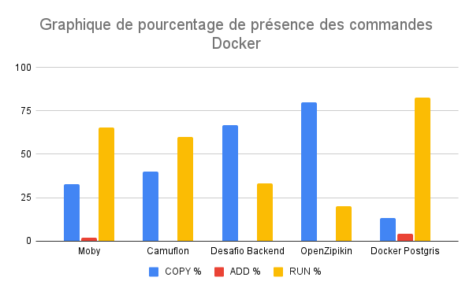
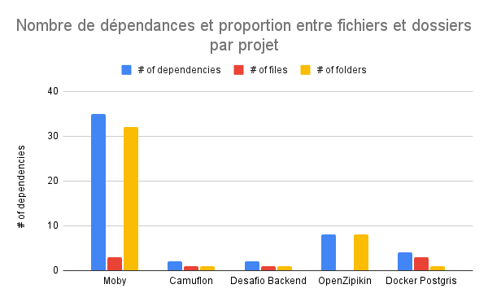
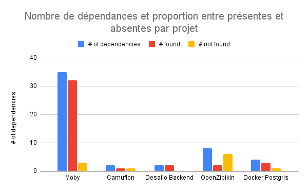
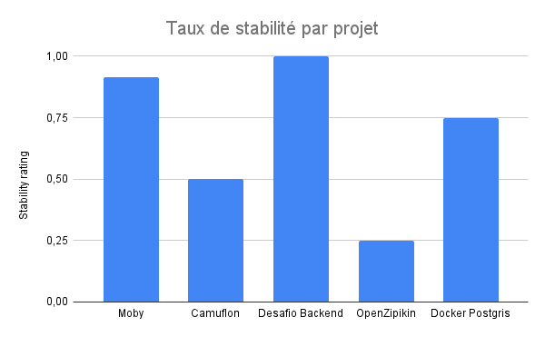
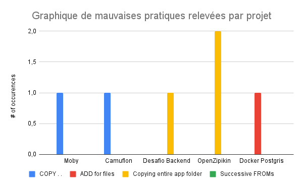

---
layout: default
title: Analyse des dépendances entre les étapes de build
date: 2022-11
---

## Authors

Nous sommes quatre étudiants en dernière année de M2 Nice-Sophia spécialisés en architecture logicielle :

- KHERROUBI Abdelkader ([@abdelkader1996](https://github.com/abdelkader1996)),
- SI DEHBI Ahmed El Hanafi ([@AhmedElHanafi](https://github.com/AhmedElHanafi)),
- NAJI Abdellah ([@abdellah07](https://github.com/abdellah07)),
- HERAUD Antoine  ([@herauda](https://github.com/herauda)).

## I. Contexte de recherche 

***Docker*** est une plateforme de conteneurs permettant d’embarquer des applications dans des environnements d’exécution légers afin d’en créer des instances facilement ou de pouvoir isoler complètement les logiques entre applications. La montée en utilisation de services *cloud* pour le déploiement d’applications a popularisé l’utilisation de *Docker*, étant l’une des meilleure solution pour conteneuriser ses applications. Cependant, la manière dont sont interprétés les *Dockerfile*, fichier décrivant la construction d'une image *Docker*, peut être considérée comme valide par le moteur mais pourrait tout de même résulter en un échec lors de l'exécution de l’application pour de multiples raisons.

  

Ainsi dans ce projet, nous souhaitons examiner les *Dockerfile* décrivant des images utilisées par des *workflows*, qui décrivent eux-même la construction d'une application, afin d’établir un degré de certitude quant à la stabilité de ce *build*. Nous chercherons à savoir si les commandes décrites dans un *Dockerfile* peuvent nous permettre d’établir une liste de ses dépendances et de valider leur présence, et d’attribuer un score selon le taux de dépendances vérifiées. Nous chercherons également à trouver d’éventuelles problèmes de description de *Dockerfile*, c'est-à-dire des mauvaises pratiques de syntaxe, qui pourraient nous empêcher d’analyser correctement ce dernier et mesurer l'impact de ces derniers sur la stabilité générale des *builds* *Docker*.

## II. Observations et Question générale

Face au grand nombre de projets *Dockerisés* dans l’ensemble des applications modernes, nous nous sommes posé la question suivante :

**Comment déterminer la stabilité du *build* *Docker* d'une application à partir de l'analyse de ses dépendances ?**

Nous chercherons donc à savoir si le *build* *Docker* d'une application, décrit dans un fichier de *workflow* par un certain nombre d’étapes, peut être analysé au préalable afin de valider que ce dernier est stable : il doit être reproductible et invariant. Nous chercherons à analyser les fichiers *Dockerfile* décrits utilisés par les étapes de *build* du *workflow* analysé et valider que les dépendances décrites par ces *Dockerfile* sont présentes.

L’ensemble des pratiques empêchant la visibilité sur les dépendances nécessaires sera considéré comme participant à l’instabilité du projet.

*Docker* étant largement utilisé aujourd’hui, nous pensons que les résultats à cette question de recherche pourraient servir aux acteurs produisant des applications *Dockerisées* et que l’analyse préalable de la stabilité des builds pourrait bénéficier à ces acteurs, afin d’améliorer la stabilité globale des builds *Docker*.

Afin de répondre à cette question de recherche, nous nous sommes posé les questions suivantes : 

1.  Comment identifier les différentes dépendances dans un *Dockerfile*?
    
2.   Comment valider la stabilité d’un build *Docker* dans son ensemble à l'aide des étapes de son *workflow*?
    
3.  Comment relever les différentes mauvaises pratiques empêchant une meilleure analyse?
    

## III. Collecte d'informations

Afin de pouvoir répondre à nos questions de recherche, nous avons cherché des projets correspondant à certains critères afin que nous puissions y effectuer notre analyse. Nous avons premièrement recherché les projets les plus populaires de *DockerHub* (ayant plus de 500 étoiles), qui utiliseraient donc des *Dockerfile*, et avons sélectionné les projets dont les *workflows* de build étaient publics, dans notre cas présent sur *GitHub* où les projets sont hébergés.  
  
Une fois un échantillon varié de projets sélectionné (en termes d'utilisation et de structure), nous procédons à l’analyse du projet grâce à plusieurs scripts *Python* : un script sera chargé de parser le contenu des fichiers de *workflow*, un autre sera chargé de déterminer l’ensemble des dépendances pour un *Dockerfile* et un dernier aura pour rôle d’agglomérer les données et produire des informations d’analyse pour l’utilisateur.  
  
  

## IV. Hypothèses et expériences

### 1. Comment identifier les différentes dépendances dans un *Dockerfile*?

**Hypothèse :**  

Les dépendances que nous considérons dans notre étude devront être limitées selon certains critères si nous souhaitons offrir un haut degré de précision pour ces dernières. Ainsi, nous nous limiterons à la présence de fichiers mentionnés dans les *Dockerfile* et aux utilisations qui pourraient en être faite par différents scripts. Nous pensons donc que ces fichiers impliqués dans les *builds* représentent la forme de dépendance la plus stricte :  ces fichiers doivent être présents s'ils sont utilisés, sans quoi le *build* sera en échec. Si leur présence ne peut être vérifiée, on considérera la dépendance comme absente. Nous considérerons également les dossiers utilisés dans les commandes *Docker* comme des dépendances, au même titre que les fichiers, car l'utilisation de répertoire n'offre pas de visibilité à notre outil.

**Expérience :** 

Nous allons donc effectuer un *parsing* des *Dockerfile* pour y chercher des commandes `COPY` et `ADD` qui manipulent des fichiers ou des archives. En effectuant ce *parsing*, nous stockons le nom des fichiers considérés comme dépendances au sein des *builds*, que nous vérifierons contre le système de fichiers à l’étape suivante. Ceci nous permet de déterminer quels éléments à analyser et à attribuer des validations ou des alertes.

  

### 2. Comment valider la stabilité d’un build *Docker* dans son ensemble à l'aide des étapes de son *workflow*?

**Hypothèse :**  

Pour cette expérience, il nous faudra examiner les étapes du *workflow* du projet en cours d’analyse et déterminer lesquelles utilisent des *Dockerfile*, que nous pouvons analyser grâce à l’étape précédente. Grâce à l’agglomération des dépendances des *Dockerfile*, nous pouvons en déduire l’ensemble des dépendances nécessaires à l’exécution d’une étape. Ainsi, en analysant les *Dockerfile* composant un *workflow*, nous pouvons vérifier la validité de leurs dépendances (leur existence pour des fichiers) et calculer le degré de stabilité d’un *workflow*, basé sur les *Dockerfile* utilisés par ses différentes étapes.

Si un projet possède un nombre trop élevé de dépendances à risque, donc non vérifiables, ce dernier sera considéré comme instable. Le taux exact de dépendances à risque reste encore à déterminer et nécessitera une analyse de nombreux projets. Nous partons également du principe que les steps du *workflow* seront visibles à l’analyse, et allons donc pour notre cas utiliser uniquement des projets ayant des *workflows*  *GitHub* publics auxquels nous aurons accès. D’autres outils tels que Jenkins pourraient également être analysés mais cet outil est largement utilisé par des organismes privés sur des pipelines auxquelles nous n’aurions pas accès.  
  

**Expérience :** 

Le but de cette expérience serait de montrer que nous pouvons élargir notre analyse au projet entier en examinant les étapes de son *workflow*. En examinant les étapes et les *Dockerfile* qu’elles mentionnent, nous pouvons établir un taux de stabilité global à l’ensemble du *workflow*.

Afin de mener à bien cette expérience, nous analysons un build possédant toutes ses dépendances et validons que son build est stable, avec un taux de stabilité que nous notons. Nous effectuons la même analyse sur le *workflow* et que ce dernier a toutes ses dépendances stables. Ensuite, nous modifions un *Dockerfile* pour qu'il possède une dépendance manquante, et validons que ce dernier est marqué comme instable car manquant une dépendance. Nous effectuons ensuite à nouveau l’analyse sur le *workflow* et validons que ce dernier est désormais marqué comme instable car une de ses dépendances, un *Dockerfile*, possède lui-même une dépendance manquante. Nous restaurons ensuite le fichier et validons que le *build* est redevenu stable, avec un taux de stabilité égal au taux avant modification.

Une fois la fonctionnalité validée, nous pouvons effectuer cette analyse sur les dépôts que nous avons choisis et comparer les résultats produits.

  

### 3. Comment relever différentes mauvaises pratiques empêchant une meilleure analyse?

**Hypothèse :** 

Nous partons du principe que toutes les mauvaises pratiques ne sont pas connues et peuvent aussi être arbitraires, mais certaines nous indiquent une impossibilité de vérification, tels que des commandes `COPY . .` , qui masquent des fichiers derrière un chemin invérifiable et que nous ne pouvons donc pas valider. Certains scripts peuvent également renommer certains fichiers et la vérification de ces derniers nécessiterait une analyse extensive de ces scripts, ce qui s’éloignerait de l’objectif initial de notre étude et de la création de notre outil. Nous nous contenterons donc d’examiner les quelques mauvaises pratiques les plus courantes et pourront faire évoluer notre étude selon de nouvelles données.  

**Expérience :** 

L’expérience serait d’analyser un haut nombre de *Dockerfile* et de repérer parmi ces derniers quelles seraient les mauvaises pratiques les plus fréquentes. Cela serait évidemment limité aux mauvaises pratiques que nous définirions et pourrait donc être donc limité. Il nous faudrait ainsi mettre cette expérience à jour avec une recherche plus complète des mauvaises pratiques durant l’écriture de *Dockerfile*.

Nous pourrions également chercher à valider qu’une mauvaise pratique, telle qu’une commande `COPY . .`, pourrait mener un *build* à l’échec sans que nous puissions le valider. Nous placerions un dossier vide là où un build aurait besoin d’un fichier, tout en effectuant une commande `COPY . .` qui serait accepté par le moteur *Docker*, et qui provoquerait une erreur lors de l’exécution de l’application.

Nous pourrions également fournir des recommandations et des alertes plus spécifiques si nous choisissons d’effectuer plus de recherches sur ce sujet.  
  

## V. Analyse des résultats et conclusion

### 1. Comment identifier les différentes dépendances dans un *Dockerfile*?

Après analyse des projets sélectionnés par notre outil, nous observons les proportions suivantes de commandes *Docker* au sein des *Dockerfiles* : 

On peut voir que les projets font majoritairement usage de la commande `COPY`, avec 10 commandes `COPY` en moyenne par *Dockerfile*. Nous avons dans nos échantillons des projets de petite et grande taille : *Moby* et *Postgris* étant des projets de grande taille, ces derniers font usage de la commande `RUN` plus fréquemment, avec 35 commandes `COPY` contre 70 `RUN` pour *Moby* et 3 `COPY` contre 19 `RUN` pour *Postgris*. Pour l'analyse des dépendances, nous nous limiterons cependant 

Nous considérons donc les commandes `COPY` comme des dépendances de notre *Dockerfile* et après analyse des fichiers et dossiers mentionnés, nous obtenons les résultats suivants : 

On peut remarquer que les projets *Moby* et *OpenZipkin*, qui présentent plus de dépendances que les autres projets, ont une majorité de dépendances sous forme de dossiers, ce qui permet de rendre les commandes plus compactes en évitant de copier les fichiers un à un. Cependant, cela peut parfois masquer des dépendances non résolues, comme un fichier manquant attendu dans un dossier copié.  On constate également que les projets de plus petite taille ont plus tendance à copier les fichiers par nom. 
  

  

### 2. Comment valider la stabilité d’un build *Docker* dans son ensemble à l'aide des étapes de son *workflow*?

Après avoir analysé les *workflows* des projets sélectionnés, en associant certaines de leurs étapes avec les *Dockerfile* qu'elles utilisent et leurs dépendances, nous analysons le projet pour vérifier l'existence des dépendances mentionnées et obtenons les résultats suivants : 

Nous pouvons voir sur ce graphique que la majorité des dépendances ont pu être vérifiées pour chaque projet mais que ces derniers présentent tous des dépendances qui n'ont pas pu être vérifiées. Ces dépendances peuvent ne pas avoir été présentes ou peuvent avoir été masquées derrière des mauvaises pratiques et soient donc invérifiables. 

Grâce à ces données, nous pouvons établir le taux de stabilité pour chacun des projets : 

Nous constatons que les taux de stabilité des projets sont relativement variés et que certains d'entre eux doivent donc présenter des descriptions *Docker* plus précises : nos deux projets les plus conséquents présentent le taux de stabilité le plus bas (*OpenZipkin*) et l'un des plus élevés (*Moby*), et nous pouvons faire référence à l'expérience précédente qui présentait *OpenZipkin* comme ayant beaucoup de dépendances sous forme de dossiers. Nous pouvons imaginer que ces dossiers absents sont générés au cours du *build* mais nous ne pouvons vérifier cette hypothèse sans nous éloigner de notre objectif initial. 

  

### 3. Comment relever différentes mauvaises pratiques empêchant une meilleure analyse?

Pour analyser les mauvaises pratiques au sein des projets, nous avons consulté des documentations (c.f. section **Références**) pour nous informer sur les différentes erreurs que l'on peut trouver dans l'écriture d'un *Dockerfile*. Ces erreurs sont acceptées par le moteur *Docker* et peuvent produire des *builds* à succès, mais ils représentent des zones d'instabilité connues qu'il faudrait adresser. 

Nous avons dressé un dictionnaire des mauvaises pratiques que nous pouvons vérifier et effectuons un *parsing* des ces dernières durant l'étape de recherche de dépendances. Certaines de ces pratiques empêchent une meilleure analyse par notre outil et d'autres sont des points d'amélioration de la stabilité globale du *build*. Parmi les mauvaises pratiques sélectionnées sont les suivantes : 
	- Une commande `COPY . .`, qui représente un chemin invérifiable et qui peut impliquer des fichiers absents que ne nous pourrions pas valider,
	- Une commande `ADD` pour des fichiers ou dossiers, il est préconisé d'utiliser la commande `COPY` pour ce type de dépendances et `ADD` uniquement pour les archives et les *URL*s,
	- Une commande `COPY` sur l'entièreté du dossier de l'application, car il faudrait alors *build* à nouveau l'entièreté de l'application pour la moindre modification. Il est recommandé de copier les fichiers nécessaires dans un premier temps et de n'effectuer la copie du dossier entier qu'en dernière étape pour prendre avantage du système de *cache* de *Docker*. 
	- Des commandes `FROM` successives sans exécutions d'autres commandes entre temps, car *Docker* ne conserve que la dernière commande `FROM` exécutée et cette écriture n'aurait donc pas l'effet escompté. 

Ce dictionnaire est évidemment amené à évoluer et reste arbitraire, mais l'analyse de ces premières mauvaises pratiques nous offre un aperçu d'une recherche que nous pourrions approfondir. 
Voici les résultats obtenus après analyse des projets selctionnés : 

On peut observer sur ce graphique que les projets analysés présentent certaines mauvaises pratiques : la plus fréquente est de copier un dossier entier d'application avant d'en copier les fichiers séparément, et celle d'effectuer des commandes `COPY . .` est également présente sur plusieurs projets. Seul un projet effectue une commande `ADD` pour un fichier et aucun des ces projets n'effectue plus d'un type de mauvaise pratique. 

Nous avons cependant dû limiter notre liste de pratiques à relever pour rester précis et nous savons qu'il existe sûrement bien d'autres pratiques néfastes à la stabilité de *builds Docker*. Il nous faudrait donc pouvoir élargir nos critères et accepter de nouvelles pratiques à analyser, et utiliser notre outil pour analyser un grand nombre de projets afin d'avoir une idée plus précise de l'impact des mauvaises pratiques dans l'écriture de fichiers *Dockerfile*.     
   

  
  

## VI. Outils

Pour les recherches sur l’analyse de dépendances *Docker* que nous avons effectué, il nous a fallu développer un outil permettant d’analyser ces dépendances au sein de fichiers *Dockerfile* en recoupant leur utilisation faite par les différents *workflows* de *build* de l’application analysée. Cet outil devrait également permettre de détecter différentes anomalies selon les dépendances analysées (absence de fichiers ou dossiers, impossibilité de vérification, etc).

A cet effet nous avons écrit un script *python* effectuant ces opérations :

-   *Parsing* d’un fichier de *workflow* spécifié en entrée et recherche d’étapes mentionnant l’utilisation de *Dockerfile*,  
      
    
-   *Parsing* de *Dockerfile* cherchant des commandes `COPY` mentionnant des fichiers :
    

	-   Le chemin est atteignable et nous pouvons vérifier leur existence donc *valide*,
    
	-   Le chemin n’est pas atteignable et il est impossible de vérifier donc *danger*,
    
	-   Le chemin est atteignable mais le fichier ne s’y trouve pas donc *alerte*.  
   Il est cependant possible que le fichier mentionné soit produit lors du build mais sans vérification certaine cela reste une *alerte*.
    

- Recherche de commandes `ADD` mentionnant fichiers, qui suivra le même traitement que `COPY`, ou des archives dont la présence sera vérifiée également.

- Durant ce *parsing*, le script analyse également les commandes pour déterminer si elles représentent une mauvaise pratique et seront remontées en tant que zones de danger car elles apportent de l’incertitude à notre analyse.

- Une fois ces dépendances analysées, nous chercherons à valider la présence des fichiers ou des archives mentionnés. Pour cela, nous effectuons une vérification dans le dossier du projet de l’existence des fichiers nécessaires. S’ils ne sont pas trouvés, la dépendance est notée comme absente.  
  
- Une fois les dépendances présentes et absentes catégorisées, nous calculons le taux de stabilité pour chaque *Dockerfile*, et pour chaque étape du *workflow* les utilisant.

- L’outil affiche les données concernant la stabilité du projet analysé à l’utilisateur.  
  
  

## VI. Références

1. [Debret 2020] Debret, J. (2020) La démarche scientifique : tout ce que vous devez savoir ! Available at: [https://www.scribbr.fr/article-scientifique/demarche-scientifique/](https://www.scribbr.fr/article-scientifique/demarche-scientifique/) (Accessed: 18 November 2022).

2. Notre outil *Python*: [Dockerfile-Analyser](https://github.com/AhmedElHanafi/Dockerfile-Analyser) est un outil développé par l'équipe dans le but d'analyser les dépendances utilisées dans les *Dockerfile* et *workflows*, et de valider la présence de ces dernières.

3. Projets avec *build Docker* utilisés après recherche sur [*Dockerhub*](https://hub.docker.com/) et *GitHub* :  
	- [Docker Postgris Project](https://github.com/kartoza/docker-postgis)  
	-  [Moby Project](https://github.com/moby/moby)
    -   [Camuflon - API](https://github.com/camuflon/camuflon-api)
    -   [Desafio Backend](https://github.com/uandisson/desafio_backend)
    -   [OpenZipkin](https://github.com/openzipkin/)
   
 4. Documentation sur [bonnes](https://sysdig.com/blog/dockerfile-best-practices/) et [mauvaises pratiques *Docker*](https://runnable.com/blog/9-common-dockerfile-mistakes) 
