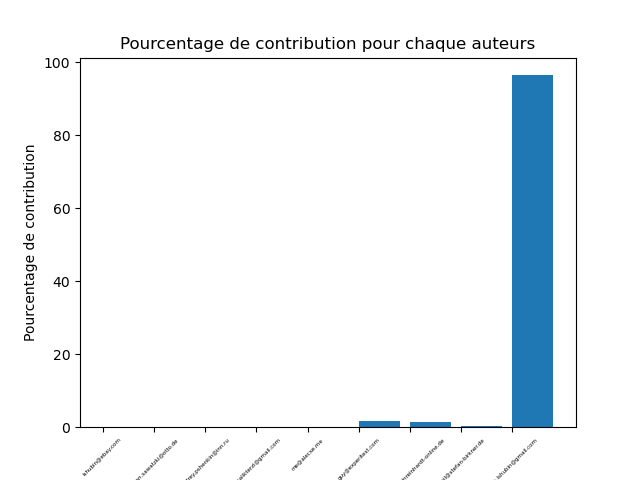
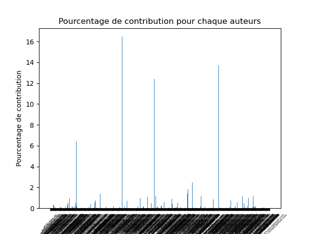
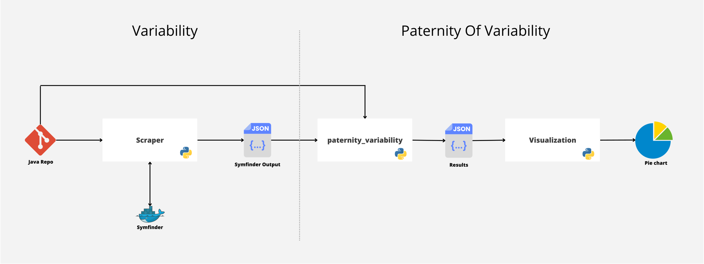

---

   **Date de rendu finale : fin février**
   - Respecter la structure pour que les chapitres soient bien indépendants
   - Remarques :
        - La structure proposée est là pour vous aider, mais peut-être adaptée à votre projet
        - Les titres peuvent être modifiés pour être en adéquation avec votre étude. 
        - Utiliser des références pour justifier votre argumentaire, vos choix, etc.
        - Vous avez le choix d'utiliser le français ou l'anglais.

    Dans l'article de Blog [Debret 2020], l'auteure donne les éléments principaux de la démarche d'une manière simple et très facile à lire, dans la partie [Quelles sont les étapes d’une bonne démarche scientifique ?](https://www.scribbr.fr/article-scientifique/demarche-scientifique/#:~:text=La%20d%C3%A9marche%20scientifique%20permet%20d,de%20nouvelles%20hypoth%C3%A8ses%20%C3%A0%20tester.)

---

**_Février 2023_**

## Auteurs

Nous sommes 4 étudiants en dernière année du cursus ingénieur informatique de Polytech' Nice-Sophia spécialisés en Architecture Logiciel :

- Alexandre Arcil ([@Alexandre-Arcil](https://github.com/AlexandreArcil)),
- Mohamed Belhassen ([@Mohamed-Belhassen](https://github.com/mohamedlouay)),
- Thomas Di Grande ([@Thomas-Di-Grande](https://github.com/DigrandeArduino)),
- Dan Nakache ([@Dan-Nakache](https://github.com/danlux18)).

## I. Contexte de recherche/Projet

Dans un monde où l'informatique est de plus en plus présente, de nombreux logiciels voient le jour.
Les entreprises réalisent des projets toujours plus grands et la complexité de ces projets augmente en conséquence.
Les équipes grandissent et le nombre de développeurs devient parfois si important qu’il est difficile d'intégrer de nouvelles recrues. 
De plus, certains développeurs peuvent quitter le développement d’un projet pendant sa réalisation. 
Il devient donc d’autant plus important de pouvoir engager de nouveaux salariés tout en les intégrants rapidement dans le projet.
Les nouveaux développeurs intégrant une équipe en cours de développement sont amenés à modifier des logiciels déjà existants.
Le problème principal est la complexité des logiciels qui augmente rapidement et le code qui est en constante évolution.

Mais alors se pose un problème de taille.
Comment faire en sorte de correctement intégrer ces nouveaux ingénieurs dans le projet existant ?
La solution la plus simple est de les confier à un développeur expert du projet pour leur transmettre les bases.
Mais si cela n’est pas possible ? 
Il faudrait ainsi répertorier les développeurs et les parties du code sur lesquelles ils ont travaillé.

C'est dans ce contexte qu'a été créé un outil d'analyse de la variabilité ``Symfinder`` pour du code orienté objet en Java.
La variabilité est l’ensemble des mécanismes permettant de configurer du logiciel pour l’adapter à un contexte précis.
La variabilité peut être implémentée dans le code par différents mécanismes génériques, comme l’héritage, la surcharge 
et certains patrons de conception dans des systèmes orientés objets.

L'outil créé va permettre de visualiser les endroits (classes, méthodes, attributs...) où on peut trouver cette variabilité.
Cette analyse du code peut servir de base pour avoir une vision d'ensemble des parties complexes du code. 
L'étape suivante est de comprendre ces points de variation pour participer au développement du logiciel.
Si la documentation est absente et que le développeur ne sait pas à qui s'adresser pour comprendre, il peut rester bloqué de son côté.
Il serait donc intéressant de savoir qui est l'auteur de cette variabilité afin de lui poser directement des questions.

Nous ne traiterons que le développement de projet orienté objets pour rester dans le cadre de notre sujet.

## II. Observations/Question générale
### Reformulation du sujet 

On peut reformuler le sujet en question de la façon suivante :
> Comment déterminer la paternité de la variabilité du code d’un projet orienté objet ?

### Intérêt

Selon le type d’application développée et le fonctionnement en entreprise, le développement peut être fait par une ou plusieurs personnes.  
Dans une entreprise, il peut y avoir des départs, des changements de postes, des nouveaux arrivants ce qui implique que les personnes qui s’occupent d’une application peuvent varier.  
C’est dans cette optique que l’analyse de la paternité est un outil qui va permettre d’améliorer la transmission de connaissances et la découverte du fonctionnement d’une application sur les parties complexes qui peuvent nécessiter une grande maitrise de ce qui a déjà été développé.  
En effet, savoir qui est où sont les développeurs principaux d’une partie de l’application permet d’améliorer la montée en compétence de ce qui n’ont pas ces connaissances.  
La mise en place de cet outil serait donc une grande amélioration dans le monde du développement.

### Question générale
Notre question générale sera donc :
> Comment la variabilité est distribuée entre plusieurs auteurs dans du code orienté objet ?

La première étape est donc de bien déterminer quel type de variabilité nous allons considérer.
Grâce à un outil de Git, il est possible d’obtenir à un instant “t” du projet, tous les auteurs d’un fichier précis.

À partir des résultats obtenus, nous avons donc reformulé la question :
> Comment analyser ces résultats pour identifier les différents auteurs de la variabilité et ressortir des statistiques sur la paternité du projet à un instant “t” ?

Comme dit précédemment, l’identification de la paternité va permettre de faciliter la transmission de connaissance 
sur les points complexes du code entre les développeurs experts et les nouveaux arrivants.
La variabilité pouvant être décomposée sous forme de "patterns" (patron de conception), le nouveau développeur pourrait cibler sa recherche 
sur un pattern spécifique afin de trouver les auteurs auprès de qui poser des questions pour comprendre le fonctionnement du pattern à travers le code.

### Limites
Dans notre approche, on peut identifier les limites suivantes :
- L'analyse du code se fait à un instant t, on prend le dernier commit de la branche principale du repository. 
  Une extension intéressante serait d'analyser les modifications à travers les différentes versions du projet.
- Plus les projets sont vieux, plus la variabilité peut être diluée à travers les différents contributeurs. 
  Les résultats obtenus pourraient être différents selon l'ancienneté du projet.
- Plusieurs contributeurs peuvent être une seule et même personne sur un projet avec des adresses mail différentes. 
  L'identification de l'auteur peut être faussée.
- Les patterns de variabilité étudiés sont "VP" et "VARIANT". 
  VP correspond à un "VARIATION POINT", c'est-à-dire une classe qui peut être implémentée par d'autres et possède des "VARIANTS" qui l'implémente.
  Ces deux patterns permettent d'identifier facilement quelles sont leurs lignes de code associées (le fichier entier correspond au code du pattern).  

## III. Collecte d'information

**1. Les articles ou documents utiles à votre projet📝**

Dans le cadre de notre recherche, nous avons basé notre travail sur les ressources suivantes :
1. [On the notion of variability in software product lines](https://doi.org/10.1109/WICSA.2001.948406)  
 Les auteurs abordent la notion de variabilité dans le développement de logiciels. 
 Ils fournissent un cadre de terminologie et de concepts, identifient des modèles courants de variabilité 
 et proposent une méthodologie pour gérer la variabilité dans les systèmes de logiciels industriels.

2. [Visualization of Object-Oriented Variability Implementations as Cities](https://hal.archives-ouvertes.fr/hal-03312487)  
   VariCity est un outil de visualisation qui représente un code orienté objet comme une ville 
   pour aider les nouveaux venus à comprendre les parties les plus importantes du projet, 
   en particulier en ce qui concerne la mise en œuvre de la variabilité. Il détecte la variabilité à travers les symétries du code 
   et la représente à travers la taille des bâtiments, la couleur et des formes de bâtiments spécifiques. 
   Les rues de la ville sont agencées en fonction des relations entre les classes. 

3. [On the usefulness of ownership metrics in open-source software projects](https://www.sciencedirect.com/science/article/abs/pii/S0950584915000294)  
  Le papier examine la relation entre les métriques de propriété de code et la qualité du logiciel dans les projets de logiciels libres.
  Les résultats montrent une relation entre les deux, mais d'autres métriques ont un plus grand impact sur la qualité du logiciel
  
  4.[Code ownership in open-source software](https://hal.science/hal-00976024v1)

  Ce papier réplique une étude sur la relation entre les métriques d'appartenance et la qualité du logiciel dans les projets Java Open Source. Les résultats ont montré une     faible corrélation entre les métriques d'appartenance et les erreurs de module, et la taille de module avait un plus grand impact sur les erreurs que l'appartenance

**2. Les jeux de données 💾**

Nous procéderons à l'analyse de projets GitHub. 
La liste contenant la totalité des projets récupérés se trouve dans un excel disponible [ici.](chapters/2023/Paternité de la variabilité sur de l'orienté objet/assets/data/GitHub_projects_list.xlsx)

Les projets GitHub que nous allons analyser comportent les caractéristiques suivants :
- langage de développement : JAVA (orienté objet),
- nombre de contributeurs : entre 10 et 605,
- taille de la base de code : maximum de 7.3 Mo.

Pour faire ressortir la notion de paternité, il faut avoir plus d'un seul contributeur. 
Il est important de noter que tous les contributeurs dans le projet sur GitHub n'ont pas forcément participé à l'écriture de la variabilité.
Notre analyse va donc prendre en compte seulement ceux qui y ont participé, ils seront dorénavant appelés "Développeurs".

Un projet peut donc être défini par son nombre de lignes de code, son nombre de contributeurs et sa quantité de variabilité (nombre de "VP" et de "VARIANT").

**3. Les outils🔨🪓**

- [git blame](https://git-scm.com/docs/git-blame) : Outil d'identification des derniers auteurs qui ont modifié les lignes de code d'un fichier. 
- [Symfinder](https://deathstar3.github.io/symfinder-demo/) : Outil d'analyse de la variabilité d’un projet orienté objet à un instant donné.
- [Docker/Docker-Compose](https://docs.docker.com/get-started/overview/) : Outil de lancement de l'analyse de la variabilité
- Scripts Python disponible dans le répertoire ``assets/code``

Pour plus de détails sur comment utiliser ces outils, voir partie [VI. Outils](#vi-outils).

## IV. Hypothèses et Expériences

Pour notre analyse, on va seulement considérer les contributeurs qui ont participé à l'écriture de code contenant de la variabilité.

### 1. Répartition de la variabilité selon le nombre de contributeurs

#### Hypothèse

*La variabilité est distribuée dans le projet selon le nombre de contributeurs. Plus le nombre de contributeurs est élevé, plus la variabilité est répartie entre eux.*

#### Sous-question

> Comment évolue la répartition de la variabilité avec le nombre de contributeurs qui augmentent ?

#### Métriques
- Pourcentage de variabilité moyenne par contributeur (%/personne)
- Nombre moyen de contributeurs ayant participé à l'écriture de la variabilité (N personnes)

#### Experience
##### Source

Les projets que nous avons choisis pour cette expérience sont les suivants :

|        Projet        | Lien                                    | Nombre de contributeurs | Nombre de développeurs | Nombre de VPs | Nombre de VARIANTS |
|:--------------------:|:----------------------------------------|:-----------------------:|:----------------------:|:-------------:|:------------------:|
| galenframework/galen | https://github.com/galenframework/galen |           13            |           9            |      71       |        226         |
| EngineHub/WorldEdit  | https://github.com/EngineHub/WorldEdit  |           96            |           52           |      265      |        700         |
|     netty/netty      | https://github.com/netty/netty          |           605           |          497           |      722      |        1574        |

#### Description

Le but de cette expérience est de déterminer si le nombre de contributeurs influe sur la répartition de la variabilité.
Pour cela, on a sélectionné des projets contenant de la variabilité avec un nombre de contributeurs croissant (de 13 à 605).
À partir de l'analyse de la variabilité de chaque projet, un filtre est appliqué pour isolé tous les "VARIANTS" 
et itérer sur chacun afin d'appliquer ``git blame`` sur le fichier contenant le "VARIANT" 
et identifier les différents auteurs ainsi que leur pourcentage de participation à l'écriture de ce fichier.

#### Démarche

Une fois que la variabilité est analysée (grâce à ``Symfinder``), la démarche à suivre est composée des étapes suivantes :

1. Execution du script python ``paternity_variability_detail.py`` avec comme argument ``lien_github_du_projet``.
   Obtention pour chaque "VARIANT" de ses auteurs ainsi que de leur pourcentage de participation (nombre de lignes écrites/nombre de lignes totales).
2. Execution du script ``mean_contributors.py`` avec comme argument ``results/nom_du_repository_paternity_result_detail.txt``.
   Obtention du nombre moyen de contributeurs ayant participé à l'écriture de la variabilité.

### 2. Paternité commune sur la variabilité de type "VP" (Variant Point) et "VARIANT"

#### Hypothèse

*Un contributeur qui modifie un VP va aussi modifier ses VARIANTS.*

#### Sous-question

> Y a-t-il une relation de paternité entre la variabilité présente dans un VP et son implémentation dans ses VARIANTS ?

#### Métriques
- Nombre (et liste) de contributeurs ayant participé à l'écriture d'un VP
- Nombre (et liste) de contributeurs ayant participé à l'écriture des VARIANTS associés au VP
- Pourcentage de corrélation entre les deux
- Le nombre moyen de contributeurs supplémentaires sur les VARIANTS (pas dans les VPs)

#### Experience
##### Source
Les projets que nous avons choisis pour cette expérience sont les suivants : 

|        Projet        | Lien                                    | Nombre de contributeurs | Nombre de développeurs | Nombre de VPs | Nombre de VARIANTS |
|:--------------------:|:----------------------------------------|:-----------------------:|:----------------------:|:-------------:|:------------------:|
| galenframework/galen | https://github.com/galenframework/galen |           13            |           9            |      71       |        226         |
| EngineHub/WorldEdit  | https://github.com/EngineHub/WorldEdit  |           96            |           52           |      265      |        700         |
|     netty/netty      | https://github.com/netty/netty          |           605           |          497           |      722      |        1574        |

##### Description

Le but de cette expérience est de déterminer s'il y a une relation entre les auteurs d'un "VP" et ceux des "VARIANTS" associés.
Pour cela, on a sélectionné des projets contenant un grand nombre de "VP" et de "VARIANT".
À partir de l'analyse de la variabilité de chaque projet, un filtre est appliqué pour isolé tous les "VARIANTS"
et itérer sur chacun afin d'appliquer ``git blame`` sur le fichier contenant le "VARIANT"
et identifier les différents auteurs ainsi que leur pourcentage de participation à l'écriture de ce fichier.

##### Démarche

Une fois que la variabilité est analysée (grâce à Symfinder), la démarche à suivre est composée des étapes suivantes :
1. Execution du script python ``paternity_variability_detail.py`` avec comme argument ``lien_github_du_projet``
   Obtention pour chaque "VARIANT" de ses auteurs ainsi que de leur pourcentage de participation (nombre de lignes écrites/nombre de lignes totales).
2. Execution du script ``percentage_vp_authors_in_vars.py`` avec comme argument ``lien_github_du_projet`` suivi git + dossier du projet

## V. Résultat d'analyse et Conclusion

### Présentation des résultats

#### Experience 1

L'expérience se fait sur 3 projets un nombre de développeurs croissant.

Projet 1 (peu de développeurs) 
- Nom : ``galenframework/galen``
- Nombre de développeurs : ``9``
- Nombre de VP : ``71``
- Nombre de VARIANT : ``226``

Projet 2 
- Nom : ``EngineHub/WorldEdit``
- Nombre de développeurs : ``52``
- Nombre de VP : ``265``
- Nombre de VARIANT : ``700``

Projet 3 (beaucoup de développeurs)
- Nom : ``netty/netty``
- Nombre de développeurs : ``497``
- Nombre de VP : ``722``
- Nombre de VARIANT : ``1574``

#### Experience 2

**Observation du projet 1 :**  
Sur ``Galen``, 87.5% des auteurs de VP ont modifié leurs VARIANTS. 35.42% des modifications d'un VARIANT n'est pas dû à un auteur du VP. 
Quand les auteurs de VP modifient leurs VARIANTS, ils vont en général modifier 98.71% du contenu.  

**Observation du projet 2 :**  
Sur ``WorlEdit``, 70.17% des auteurs de VP ont modifié leurs VARIANTS. 56.91% des modifications d'un VARIANT n'est pas dû à un auteur du VP. 
Quand les auteurs de VP modifient leurs VARIANTS, ils vont en général modifier 87.46% du contenu.  

**Observation du projet 3 :**  
Sur ``Netty``, 48.61% des auteurs de VP ont modifié leurs VARIANTS. 77.94% des modifications d'un VARIANT n'est pas dû à un auteur du VP. 
Quand les auteurs de VP modifient leurs VARIANTS, ils vont en général modifier 76.23% du contenu.  

### Analyse et interprétation des résultats en fonction des hypothèses
#### Hypothèse 1

Nous avons analysé trois les  projets(galen, WorldEdit et netty) et nous avons constaté que dans chacun d'entre eux, la contribution à la variabilité était faible, même si le nombre de développeurs était relativement élevé. Cela signifie que dans ces projets, un petit nombre de développeurs contribue davantage à la variabilité que les autres, ce qui va à l'encontre de notre hypothèse initiale.
Cela montre que le nombre de contributeurs n'est peut-être pas le seul facteur qui influence la répartition de la variabilité dans un projet.

#### Hypothèse 2

On remarque que plus le nombre de développeurs augmentent, moins la paternité entre un VP et ses VARIANTS est le même. 
Les auteurs de VP vont moins être parent de leurs VARIANTS, la paternité de contributeurs externes augmentent et les auteurs vont globalement avoir moins de paternité sur le contenu des VARIANTS.
Cela montre bien que l'augmentation de développeurs sur un projet va répartir la paternité d'un VP et de ses VARIANTS, faisant que les contributeurs d'un VP va être de moins en moins modifier ses VARIANTS.

### Limites rencontrées

Dans un 1er temps, la démarche initiale était de récupérer des projets aléatoires en utilisant l'API GitHub.
Cependant, certains projets étaient entièrement écrits par des bots, par exemple des projets générés automatiquement.
Dans ce cas-là, il n'y avait qu'un seul auteur de la variabilité. 
Grâce à cette observation, la selection des projets s'est faite en fonction du nombre de développeurs.

Pour l'expérience 1, les projets réalisés en Open-Source sont organisés différemment que les projets d'entreprises. 
En effet, pour les projets Open-Source, seuls quelques responsables du projet ont le droit de modifier tout le code sans contrainte. 
Il y a donc un grand nombre de développeurs qui peuvent seulement effectuer de petites modifications. 
À l'inverse, dans les projets d'entreprises, toute l'équipe participe à l'implémentation du projet et donc de sa variabilité.

Un critère qui peut jouer sur l'évolution de la variabilité du projet est son ancienneté. 
Sur des projets assez jeunes (entre quelques mois et 1 à 2 ans), les développeurs sont les mêmes tout le long. 
Sur des projets plus vieux (à partir de 2 ans), certains développeurs ont eu le temps de partir pour être remplacé.
La conséquence est que la variabilité a été réécrite par les nouveaux arrivés.

Une très grande limite à notre analyse et la quantité de projets analysés. 
En effet, pour les 2 experiences, seul 3 projets ont été analysés ce qui fait un échantillon très faible pour faire des observations.

### Conclusion

#### Répartition de la variabilité à travers un projet

On a pu observer que la variabilité est répartie globalement sur peu de personne malgré un grand nombre de développeurs.
En effet, même si le code est de plus en plus complexe et la quantité de lignes de plus en plus importantes, 
seul un sous-ensemble des développeurs serait apte à expliquer facilement la variabilité du code.

#### Association de l'implémentation d'un VP et de ses VARIANTS

On a pu observer que la taille des projets peut avoir des conséquences sur l'implémentation d'un "VP" et de ses "VARIANTS" par le même auteur.
On peut donc nuancer notre hypothèse en y intégrant la notion de quantité de variabilité. 
En effet, plus la quantité est importante, moins les auteurs de "VP" implémentent leurs "VARIANTS" associés.

#### Perspectives

Les principales perspectives que seraient :
- De faire l'analyse sur beaucoup plus de projets,
- D'analyser la variabilité sur plusieurs commits,
- De rentrer plus en profondeur dans l'analyse des patterns.

## VI. Outils

### Scripts Python
**scraper.py**  
Ce script permet d’analyser la variabilité des projets java. Il utilise l'API Github pour obtenir une liste de dépôts, puis pour chaque dépôt, il utilise l’outil  "SymFinder"  pour effectuer une analyse de la variabilité et enregistre le résultat sous forme de fichier JSON. Ensuite, le script "paternity_variability.py" est exécuté pour trouver la paternité de la variabilité. 

**paternity_variability.py**  
Ce script calcule la paternité de la variabilité dans un projet Git donné. Il utilise la sortie de "SymFinder" (stockée dans un fichier JSON appelé db.json) pour trouver les classes de variabilité dans le projet. Pour chaque classe de variabilité trouvée, il utilise la commande Git "blame" pour trouver les auteurs des lignes de code modifiées pour cette classe et calcule la fraction de lignes modifiées par chaque auteur. Les résultats sont ensuite stockés dans un fichier de sortie au format JSON qui va être consommer par le script ‘’ Visualization’’.

**visualization.py**  
Ce script définit une classe PlotPie qui permet de tracer des graphiques en secteurs (pie charts) à partir de données générer précédemment. Le script prend en entrée le chemin vers le fichier JSON, lit les données à partir du fichier, les trie et les utilise pour tracer un graphique en secteurs pour chaque type de variabilité. Les graphiques sont enregistrés dans un sous-dossier "Visualization" avec le même nom du projet. 

## VI. Références

 [1] J. van Gurp, J. Bosch, and M. Svahnberg. 2001. On the notion of variability in software product lines. In Proceedings Working IEEE/IFIP Conference on Software Architecture, IEEE Comput. Soc, Amsterdam, Netherlands, 45–54. DOI:https://doi.org/10.1109/WICSA.2001.948406
 
 [2] Johann Mortara, Philippe Collet, Anne-Marie Dery-Pinna. Visualization of Object-Oriented Variability Implementations as Cities. 9th IEEE Working Conference on Software Visualization (VISSOFT 2021), Sep 2021, Luxembourg https://hal.archives-ouvertes.fr/hal-03312487
 
[3] Foucault, M., Teyton, C., Lo, D., Blanc, X., & Falleri, J. R. (2015). On the usefulness of ownership metrics in open-source software projects. Information and Software Technology, 64, 102-112. https://www.sciencedirect.com/science/article/abs/pii/S0950584915

[4]Matthieu Foucault, Jean-Rémy Falleri, Xavier Blanc. Code Ownership in Open-Source Software. 2014. ⟨hal-00976024⟩https://hal.science/hal-00976024v1

