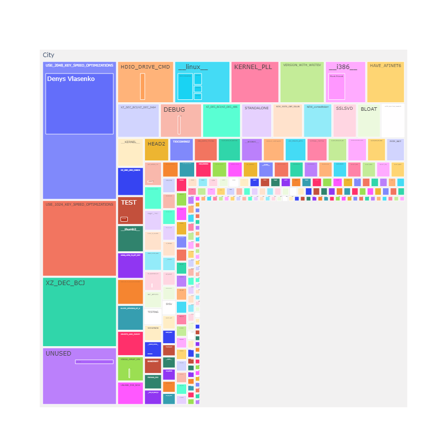

# Détection de la paternité grâce aux directives #ifdef

**_Février 2023_**

## Auteurs

Nous sommes 4 étudiants en dernière année à Polytech Nice Sophia en spécialisation Architecture Logicielle:

- CHOUHABI Amine (mohammed-amine.chouhabi@etu.unice.fr)
- BOUZOUBAA Fahde (fahde.bouzoubaa@etu.unice.fr)
- GROSS Paul (paul.gross@etu.unice.fr)
- DIJOUX Robin (robin.dijoux@etu.unice.fr)

## I. Contexte

Nous avons décidé de choisir le sujet "La paternité de la variabilité".

La variabilité réfère à la mesure du changement de la variation dans un morceau de code ou un logiciel. Cette variabilité peut être mise en œuvre, par exemple, par des directives de préprocesseur _#ifdef_. Un exemple typique de variabilité est un navigateur web qui peut fonctionner sur différentes plateformes et systèmes d'exploitation. Ce sont généralement des points critiques dans la maintenance et l'évolution d'un logicielle: les possibilités de configuration sont parfois très - voir trop - nombreuses, et il serait très bénéfique de pouvoir améliorer la prise en main de cette variabilité.
En parallèle, des recherches ont montré qu'il est possible de déterminer - de façon automatisée - l'origine du code en utilisant des informations de commit et des outils comme _git blame_ pour trouver les contributeurs les plus importants sur une partie du code ou sur une bibliothèque.
Nous allons donc nous intéresser à l'identification automatisée des parents de la variabilité d'un logiciel, les contributeurs experts de cette dernière. Selon nous pouvoir identifier le parent d’une certaine variabilité est intéressant pour différentes raisons:

- Le solliciter dans le cas d’une régression ou un bug signalé sur cette fonctionnalité.

- Toute personne ayant accès aux outils qui permettent d'identifier l’expert peuvent le solliciter directement, au lieu de demander au chef d’équipe par exemple qui lui demandera. Ce qui accélère la communication au sein d’une équipe.

- Si une nouvelle recrue commence à travailler sur un sujet en relation avec la fonctionnalité, il pourra facilement identifier l’expert et lui demander des pistes par exemple. Cela peut faciliter la montée en compétence des nouvelles recrues.

- L’expert pourrait faire des revues de code plus rapide et plus efficace des nouvelles extensions implémentées par des personnes qui ne connaissent pas bien la fonctionnalité.

## II. Question générale et décomposition en sous-questions

La question générale est :
**Comment identifier la paternité d’une fonctionnalité en se basant sur la variabilité exprimée par les directives #ifdef ?**

De cette question générale découlent des sous-questions :

- Comment définir la paternité et la variabilité en se basant sur notre vision du sujet ?

- Faut-il se limiter à la contribution de chaque personne pour déterminer la paternité ?

- Faut-il compter les personnes ayant des petites contributions dans la paternité d’une fonctionnalité ? En d’autres termes, est ce que le fait de compter les personnes avec des contributions minimales dans la patérnité a une valeur pour le sujet ?

- Quels sont les critères les plus importants pour définir la paternité ?

## III. Sources d'informations et outils de travail

Les sources que nous comptons exploiter afin de produire ce travail seront des bases de codes ainsi que les méta-données associées. Dans un premier temps nous utiliserons les code source de différents projets. Notre choix s'est porté sur:

- [BusyBox](https://github.com/mirror/busybox)
- [Curl](https://github.com/curl/curl)
- [GeckoDev (mirroir de Mozilla Firefox)](https://github.com/mozilla/gecko-dev)

Ces projets ont été séléctionné de manière précise, car ils:

- ont des nombres de contributeurs diverses (ces projets vont de 240 à 5000+ contributeurs)
- sont développés en C/C++, contenant des points de variabilités _#ifdef_
- sont open-source, pour avoir libre accès au code et aux contributions de chacun
- ont dans leur documentation des noms identifiés (parents de modules, propriétaires, etc.)

Nous utiliserons également les données annexes tel que la structure des répertoires et plus généralement la documentation. De plus nous utiliserons l’api de Github afin de récupérer les informations tel que les insights, les contributeurs etc…

Pour effectuer nos expériences nous avons construit notre propre outil qui utilise git fame et git blame afin de répondre aux questions cités ci-dessus. Nous les avons combiné à des filtres grep afin d’extraire les métriques que nous souhaitons.

Concernant les métriques, nous comptons nous basés sur les informations relatives aux commits qui portent les directives ifdef contenues dans github, informations obtenues par les outils cités ci-dessus.

## IV. Hypothèse et expériences

Intialement notre démarche a consisté à partir de l'hypothèse suivante :

**La paternité d'une feature se traduit par l'auteur du dernier commit d'un _#ifDef_**

Pour valider ou réfuter notre hypothèse, et répondre aux différentes questions que nous avons établi, nous comptons:

1. Analyser le nombre de commits à l'intérieur d'un bloc “ifdef” pour chaque personne dans le projet.
2. Déterminer pour chaque contributeur du projet et chaque point de variabilité (“ifdef”), combien de fois a-t-il contribué.
3. Comparer ces résultats avec les informations connues sur le projet (le choix des projets testés est fait en partie sur le critère de la présence de ce genre d’informations).

Cette expérience sera utile dans notre questionnement car:

- Nous pourront savoir si les plus gros contributeurs sur les points de variabilité sont les parents de cette variabilité.
- Nous pourront facilement déterminer l’ensemble des personnes possiblement compétentes sur telle ou telle fonctionnalité.
- Nous auront un aperçu de s’il existe une relation **propriétaire du projet <-> plus gros contributeur <-> parent de la variabilité**.

La limite de notre raisonnement et de notre outil est principalement la temporalité. Comme dit précédemment, nous nous intéressons aux dernières modification sur chaque ligne à l'intérieur d'un bloc _#ifdef_. Cette démarche est plus ou moins réaliste, car à l’instant T, nous avons des données sur tout le projet dans sa toute dernière version. Il serait cependant intéressant d’analyser sur l’évolution du projet, pour que les resultats ne soient pas biaisés. Comme solution,nous trouvons que la parrellisation du traitement des données est la meilleur solution.  

**Les auteurs constituant au moins 80% des commits sur un bloc _#ifdef_ est un meilleur indicateur de la paternité d'une fonctionnalité**

En effet, prendre l'ensemble du bloc permet nottamment de combler le problème lié à la temporalité. Il y a bien plus de chances que les parties écritent par le père réel des fonctionnalités soient préservées face aux bruits induit par des petits contributeurs. 

De plus, nous obtenons désormais un ensemble de contributeurs contrairement à l'expérience précédente. Cette méthode permet elle aussi réduire le bruit.

## V. Analyse des résultats et conclusion

### Résultats
   Nos outils permettent de générer des résultats et de les visualiser 
   1) Le premier est le décompte des commits par auteur pour chaque feature ifdef.
   
   Exemple projet busybox

   "DEBUG": [
         [
               "Denys Vlasenko",
               70
         ],
         [
               "Erik Andersen",
               18
         ]
      ]

   Ce résultat est ensuite exploité par notre visualisation afin de produire un graphique hiérachique tel que celui-ci.

   

   Malheureusement, l'image ne permet pas d'exploiter entièrement cette visualisation. Nous vous invitons à la lancer en local afin de pouvoir manipuler les features représentées. Vous pouvez consulter les instructions dans le README du code.

   Ces résultats nous permettent donc de connaître les personnes qui à plus de 80% sur une directive #ifdef. Ainsi, d'après nos résultats. De plus, c'est la première personne à solliciter si on a un problème concernant une fonctionnalité.
   Quoique, ce résultat ne nous permet pas de déterminer le parent d'un seul point de variabilité. En effet, le premier résultat ne nous donne pas un aperçu entre les points de variabilité et les contributeurs, d'où le besoin d'améliorer notre résultat.
   2) Le deuxième résultat montre quel contributeur a utilisé une certaine fonctionnlité combien de fois.
   Exemple projet curl : [('ENABLE_IPV6', 'Daniel Stenberg', 77), ('HAVE_SYS_TYPES_H', 'Yang Tse', 36), ('ENABLE_IPV6', 'Yang Tse', 35)]
   Ce résultat nous permet de savoir qu'elle est la personne qui a le plus commité sur un point de variabilité bien précis.
   Il nous permet aussi si on le souhaite de connaître le parent d'un point de variabilité bien précis. Donc si une personne dans une entreprise par exemple a besoin d'infos sur un point précis il sera sûr qu'il va solliciter la bonne personne. il nous permet aussi si on arrive à trouver dans les infos du projet les noms des directives #ifdef les plus importants, on peut se baser sur ce résultat afin de savoir si le plus gros contributeur du projet est celui qui a implémenté les points de variabilités les plus importants. 
   En combinant les résultats obtenus et les informations qu'on a pu trouver dans le repository du projet, on peut confirmer si le propriétaire/mainteneur du projet est bien le parent du projet s'il est la personne avec le plus de contribution sur les points de variabilité. Si le résultat n'est pas conforme on en déduit que la personne qu'on a trouvé peut être l'architecte du projet ou la personne en charge des ifdef.

### Réponse aux questions
   1) En se basant sur les résultats le parent du projet est la personne ayant le plus de contributions sur les points de variabilité et la personne qui est la plus visible dans la sortie de deuxième résultat. Vu qu'on prend la dernière personne ayant fait des commits sur le bloc des points de variabilités le premier résultat n'est pas suffisant. 
   2) D'après nos résultats sur busybox et curl et libconfini, la personne identifiée par les deux résultats est bien le propriétaire du projet, donc on peut se limiter à la contribution.
   3) Oui, on doit inclure les personnes ayant des contributions minimales dans la paternité car ils peuvent être les parents de quelques points de variabilités très importants dans le projet.
   4) D'après nos résultats, les critères les plus importants sont le nombre des commits contenant des directives #ifdef, l'importance des points de variabilités où cette personne apparaît avec le deuxième résultat et finalement les comparer aux infos qu'on trouve dans le repo du projet.

### Limites
   Notre démarche se base sur la dernière personne ayant fait des commits dans le bloc, donc si une personne rajoute que des espaces dans le bloc ifdef on va la considérer comme contributeur principal du bloc. Par conséquent, on peut avoir des faux positifs.
   Le code prend beaucoup de temps a sortir le résultat, il faudrait parrélleliser le processus pour résoudre le problème.

   En guise de conclusion, nous pouvons dire que notre outil détecte les personnes qui ont le plus contribué sur les points de variabilités ifdef et donc le parent de la variabilité d'après notre hypothèse. Mais ne nous permet pas de savoir si cette personne est le propriétaire du projet ou non. Cette liaison on la confirme ou pas en fonction des informations fournies dans le repository du projet.  

## VI. Références

[Documentation de git blame.](https://git-scm.com/docs/git-blame)

[Documentation de git fame.](https://github.com/casperdcl/git)
