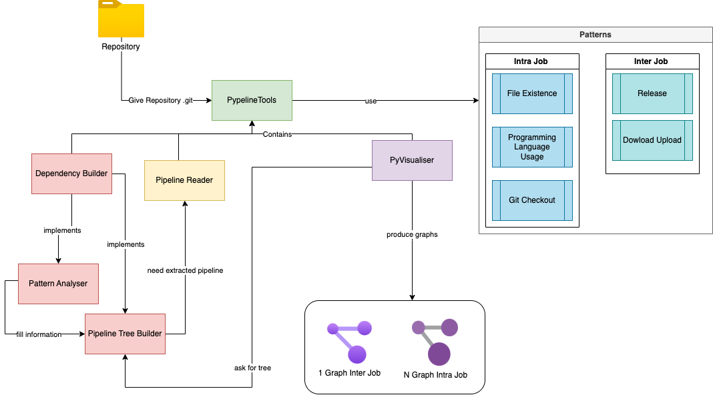
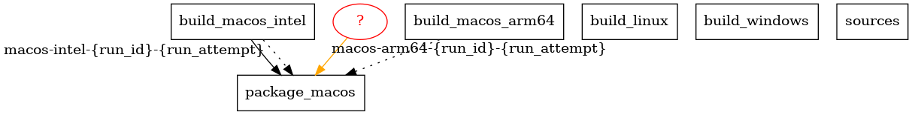
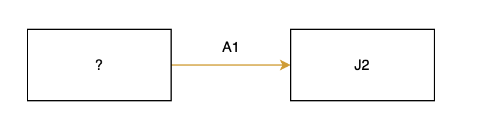
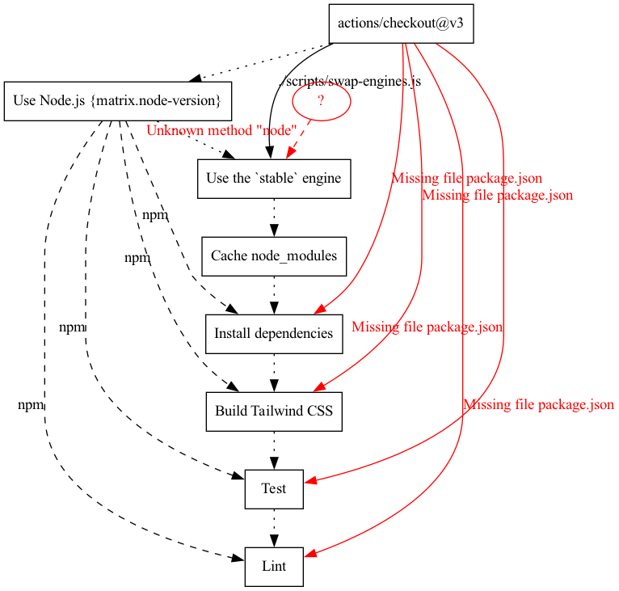

**_février 2023_**

## Auteurs
Nous sommes quatre étudiants ingénieurs en dernière année à Polytech Nice Sophia, spécialisés en Architecture Logiciel :

* Gabriel Cogne (gabriel.cogne@etu.unice.fr);
* Marine Demonchaux (marine.demonchaux@etu.unice.fr);
* William Fernandes (william.fernandes@etu.unice.fr);
* Taha Kherraf (taha.kherraf@etu.unice.fr);
    
## I. Contexte de la recherche / projet
Les projets modernes sont souvent construits, testés et déployés automatiquement grâce à l'utilisation de pipelines CI/CD. Ces pipelines sont composés de plusieurs jobs, et ces jobs de plusieurs étapes, qui peuvent produire ou nécessiter des artefacts pour s'exécuter. Cependant, ces dépendances peuvent ne pas être explicitement définies, ce qui peut entraîner des erreurs lors de l'exécution du pipeline. Par exemple, si un artefact est modifié entre l'exécution de deux jobs, cela peut provoquer des erreurs dans les jobs dépendants. Il est donc important de comprendre comment identifier ces dépendances pour améliorer la qualité et la fiabilité des pipelines CI/CD. 

La motivation derrière est ainsi de comprendre comment les dépendances entre les différents jobs et étapes d'un pipeline CI/CD peuvent être identifiés afin d'éviter les erreurs lors de l'exécution d'un pipeline, ce qui permettrait d'économiser du temps de build/déploiement qui peuvent engendrer des coûts financier. En utilisant une analyse des dépendances, il est possible d’identifier les erreurs potentielles avant qu'elles ne se produisent. 


## II. Question générale
L'intérêt de ce projet d’étude est de pouvoir comprendre les dépendances entre les différentes étapes d'un pipeline CI/CD. Cela permettrait de savoir si un changement apporté à un artefact (modification ou suppression) aurait un impact sur l'exécution du pipeline ou si un pipeline échouerait à cause d'une dépendance requise à une étape qui est générée par une étape ultérieure.

Nous allons nous demander dans cette étude s'il est possible **de déterminer avec certitude si une chaîne CI/CD va échouer ou réussir en effectuant une analyse statique du pipeline ?**

Ce qui nous amènera à nous poser les sous questions suivantes : 
* **Comment mesurer la fiabilité de l'analyse d'un pipeline ?**
* **Est-il possible d'identifier des patterns de dépendances notables ?**
* **Quelle est la meilleure façon de représenter les dépendances d'un pipeline ?**


## III. Base d’informations
### Articles  

Pour nous aider dans cette étude, nous avons décidé d’analyser les articles suivants :
* L'article *"Who broke the build?: automatically identifying changes that induce test failures in continuous integration at Google scale"*[1] peut nous donner des pistes pour cette étude car il se concentre sur la détection automatique des modifications qui causent des échecs de tests dans un environnement de construction en continu à grande échelle. Il décrit comment Google a mis en place un système pour identifier les causes des échecs de tests dans leur pipeline de construction en continu.
* L'article *"Mining Metrics to Predict Component Failures"*[2] se concentre sur l'analyse des métriques de performance pour prédire les échecs de composants dans un système logiciel. Il peut aider dans l'étude en cours en fournissant des méthodologies pour extraire des métriques à partir des pipelines CI/CD et les utiliser pour identifier les dépendances entre les jobs et les artefacts.
* L'article *"When Life Gives You Oranges: Detecting and Diagnosing Intermittent Job Failures at Mozilla"*[3] se concentre sur la détection et le diagnostic des échecs intermittents de jobs dans les systèmes de construction et de test automatisés. Il peut être utile pour cette étude en fournissant des méthodologies pour identifier les dépendances entre les jobs et les artefacts qui peuvent causer des échecs intermittents.

### Jeux de donnée 
Nous avons sélectionné des projets open source sur Github de tailles différentes pour déterminer si la taille du projet a une influence sur les dépendances dans les pipelines. Nous avons également choisi les projets en fonction de leur taille et du nombre de pipelines qu'ils proposent.Nous avons retenus certains projets qui respectait nos conditions de recherches :
* [Audacity](https://github.com/audacity/audacity)
* [Django API](https://github.com/awaisanjumx2/django-api)
* [TS down sample](https://github.com/predict-idlab/tsdownsample)
* [Cloudy Weather API](https://github.com/iiTONELOC/cloudyWeatherAPI)
* [Juice Shop](https://github.com/miguelmemm16/juiceshop)
* [Tail Wind CSS](https://github.com/tailwindlabs/tailwindcss)
* [DGS Framework](https://github.com/Netflix/dgs-framework)

## IV. Hypothèse et expériences
### Hypothèses établies
Nous avons émis plusieurs hypothèses en amont que nous allons démontrer suite à nos expériences et nos résultats.

#### 1<sup>ère</sup> hypothèse
Nous pensons que nous pouvons détecter des patterns de dépendances répétitifs entre différentes chaînes CI/CD. En effet, nos expériences antérieures montrent que les chaînes CI/CD sont souvent composées de phases de test, de construction et de déploiement, et il est probable que certains besoins en dépendances se répètent dans ces phases.

#### 2<sup>ème</sup> hypothèse
Nous estimons que l'analyse d'un pipeline doit être effectuée en deux étapes distinctes, à savoir l'analyse intra-job et l'analyse inter-job. En isolant les cas examinés, nous pourrons mieux comprendre les erreurs liées aux dépendances au sein d'un même job et aux dépendances provenant de jobs antérieurs, ce qui facilitera l'interprétation de l'analyse.

#### 3<sup>ème</sup> hypothèse
Nous considérons qu'un graphe de dépendance est une représentation efficace pour analyser les pipelines CI/CD. Les graphes sont facilement compréhensibles et permettent de visualiser les dépendances de manière claire et concise, ce qui en facilite l'analyse et l'interprétation.

#### 4<sup>ème</sup> hypothèse
Il est possible qu'un service externe puisse interagir avec les pipelines et causer des incohérences lors de l'analyse statique de la chaîne CI/CD.

### Expériences
#### Expérience 1
Dans un premier temps, nous avons examiné une seule facette des pipelines : la dépendance inter-job. Nous avons analysé un grand nombre de répertoires Github pour tenter d'identifier des patterns remarquables. Nous avons également essayé de créer manuellement des graphiques de dépendances pour comprendre les interactions entre les jobs. Cependant, nous avons constaté que chaque pipeline était différent en termes de conception, ce qui nous a incité à chercher un pattern distinct, notamment de chercher une utilisation de Github Action et à baser la suite de nos recherches sur ce modèle dans les répertoires Github.

#### Expérience 2
Nous avons développé un outil permettant de réitérer notre première expérience sur des projets quelconque. Le but était de créer un outil d’analyse statique et dans vérifier l’efficacité en comparant les graphes obtenus avec des graphes construits manuellement.

## V. Outil
Notre [outil d'analyse de pipelines](https://github.com/FernandesWilliam/retro) a été conçu pour identifier les problèmes de dépendances entre les tâches et au sein des tâches avant l'envoi de la pipeline. Il prend en entrée n'importe quel répertoire Github et tente d'extraire les pipelines de celui-ci. L'analyse comprend deux étapes : l'analyse intra-tâche et l'analyse inter-tâche. Pour chaque étape, l'analyseur utilise des modèles prédéfinis pour établir les dépendances. Une fois l'analyse terminée, plusieurs graphes sont mis à disposition : un graphe inter-tâche en format PNG et un nombre de graphes intra-tâche correspondant au nombre de tâches présentes dans la pipeline.



### Lancement du projet : 

#### Pré-requis : 
* Python 3.10+
* Graphviz

#### Command pour exécuter : 
```shell
python3 main.py <path/to/config.yml>
```
Les graphes sont accessibles depuis le dossier _results_

#### Technologies : 
Nous avons utilisé [Python](https://www.python.org/) pour faciliter d'écriture et la manipulation des dictionnaires. De plus nous avions besoin d'une librairie graphique pour représenter visuellement les dépendances, c'est pourquoi nous avons choisi [Graphiz](https://graphviz.org/)

## VI. Analyse de résultats
### Présentation des patterns identifiés 
Nous avons découvert plusieurs motifs récurrents dans nos études de pipelines. Le premier que nous avons identifié est le motif de Upload/Download, qui se compose de deux actions GitHub : "actions/upload-artifact" et "actions/download-artifact". 
* L'action "actions/upload-artifact" permet de compresser et de rendre accessible les fichiers aux runners d'autres jobs et aux utilisateurs sur l'interface web de GitHub Actions. 
* L'action "actions/download-artifact" permet de récupérer ces artefacts en utilisant un nom de paramètre pour télécharger le fichier ZIP correspondant et de l'extraire dans l'espace de travail. 

En étudiant ces différentes pipelines, nous avons identifié d'autres patterns de dépendances: 

**Présence de fichiers** : Nous avons observé que plusieurs pipelines interagissent avec des fichiers provenant du répertoire Github en cours, par exemple en utilisant un fichier package.json pour exécuter des commandes dans la pipeline. Ce schéma permet de détecter l'absence de fichiers.

**<span style="text-decoration:underline;">Exemples</span>**

- **<span style="text-decoration:underline;">Utilisation direct du fichier :</span>**
<pre>
- name: "Check out Git repository"
  uses: actions/checkout@5a4ac9002d0be2fb38bd78e4b4dbde5606d7042f
- name: "Execute smoke test on Docker"
  run: docker-compose -f docker-compose.test.yml up --exit-code-from sut
</pre>

- **<span style="text-decoration:underline;">Utilisation indirect du fichier </span>:**

<pre>
- name: Install dependencies
  run: <b style="text-decoration:underline;">npm install</b>
- name: Build Tailwind CSS
  run: <b style="text-decoration:underline;">npm run build</b>
- name: Test
  run: <b style="text-decoration:underline;">npm run test</b>
- name: Lint
  run: <b style="text-decoration:underline;">npm run style</b>
</pre>

**<span style="text-decoration:underline;">Programming language Usage</span>** : Nous avons également remarqué que pour exécuter certaines commandes, les tâches en cours sont obligées d'intégrer des versions de certains langages via des actions Github pour pouvoir automatiser les étapes de compilation, de test et de déploiement d'un projet. Il nous a semblé intéressant de les identifier comme des dépendances, car de nombreux projets que nous avons sélectionnés en comportent. Ces actions github sont de la forme : actions/setup-<language>.

**<span style="text-decoration:underline;">Exemple</span>**

<pre>
- name: Use Node.js
  uses: actions/setup-node@v3   <i style="color: green;"># Setup node to access to npm</i>
- name: Install dependencies
  run: npm install              <i style="color: green;"># Install the dependencies of the project</i>
</pre>


**<span style="text-decoration:underline;">Checkout</span>** : En examinant les étapes d'une tâche, nous avons constaté que l'utilisation d'une action Github checkout était presque systématique. Cela permet à la tâche d'accéder au projet en cours. Il est donc important de considérer ce checkout comme une dépendance, car si les actions suivantes doivent manipuler des fichiers appartenant au projet, elles ont besoin d'y avoir accès.

**<span style="text-decoration:underline;">Exemple</span>**

<pre>
- name: checkout
  uses: actions/checkout@v3   <i style="color: green;"># Give access to the repository</i>
</pre>

### Choix de la représentation des graphes 

Nous avons analysé des pipelines de grande envergure et constaté que les graphes de dépendances qui les représentent étaient difficiles à interpréter lorsqu'ils étaient complexes et couvraient à la fois les dépendances intra-job et inter-job. Pour remédier à ce problème, nous avons décidé de diviser les graphes en deux parties distinctes : un graphe représentant les interactions entre les différents jobs, et un ensemble de graphes intra-job correspondant chacun au détail d’un job présent dans le pipeline.

### Visualisation des graphes de dépendances 

Nous avons donc modélisé nos graphes grâce à un outil que nous avons créé. Ces graphes permettent d'avoir un aperçu du flow du pipeline ainsi que des dépendances entre chaque step ou chaque job avec les patterns identifiés. Nous allons pouvoir essayer de répondre aux questions que l'on s’est posées. 

Nous allons décomposer cette analyse en 2 parties :

#### Analyse inter-job[5]


Le premier graphique montre le pipeline d'Audacity avec 3 jobs indépendants. Le Job "package_macos" dépend de 2 autres jobs en parallèle "build_macos_intel" et "build_macos_arm64". Chacun de ces jobs upload un artefact qui est téléchargé par "package_macos". La dépendance est claire et directe.



Le deuxième graphique montre un problème où un des artefacts n'a pas été uploadé, ce qui a entraîné une erreur indiquant que "package_macos" a besoin d'un artefact "macos-arm64" qui n'a pas été uploadé pendant l'exécution du pipeline. Cela nous a montré que des systèmes externes tels que les images Docker Hub ou les dépôts d'artefacts peuvent interagir avec notre système et affecter notre analyse sur le bon fonctionnement du pipeline. Pour gérer ces incertitudes, nous avons établi un degré d'erreur qui nous permet de déterminer ce qui peut être déterminé de manière statique et ce qui ne peut pas l'être.

Le degré "<span style="color: orange;">warning</span>" permet d'alerter que l'utilisation d'une dépendance dans un job du pipeline n'a pas été générée à l'intérieur de celui-ci.



Le degré "<span style="color: red;">error</span>" permet de signaler qu’une étape essentielle dans la génération ou la modification de l’artéfact est manquante, ou que l’ordre n’est pas respecté.


#### Analyse intra-job[6]



<pre>
- name: Install dependencies
  run: <b style="text-decoration:underline;">npm install</b>
- name: Build Tailwind CSS
  run: <b style="text-decoration:underline;">npm run build</b>
- name: Test
  run: <b style="text-decoration:underline;">npm run test</b>
- name: Lint
  run: <b style="text-decoration:underline;">npm run style</b>
</pre>

Le graphique ci-dessus représente le job _build_ du pipeline _ci-stable_ pour le projet TailWindCSS. Il montre les différentes étapes séquentielles du processus sous forme de rectangles. Cependant, ce graphique est généré avec une erreur. Nous avons supprimé le fichier _package.json_ du projet et, comme le montre le graphique, chaque étape dépend de ce fichier pour fonctionner en utilisant la commande _NPM_. Cette dépendance est implicite, car la pipeline est construite à partir de commandes _NPM_.

## VII. Prise de Recul

### Comment mesurer la fiabilité de l’analyse d’un pipeline

Lors de nos expérimentations, nous avons pu constater que certaines dépendances pouvaient venir de systèmes externes à la chaîne CI /CD et ainsi induire des erreurs dans notre analyse.
Ainsi, pour distinguer les erreurs pouvant être induites par des oublis de celles provoquer par l’utilisation de systèmes externes, il nous a fallu déclarer un degré d’incertitude. Ce degré d’incertitude va montrer de simples warnings quand l’origine d’une dépendance peut venir d’un système externe.
Ce système a ses limites notamment lorsque les graphes sont générés par l’outil dont la base de connaissance est limitée.

### Est-il possible d'identifier des patterns de dépendances notables ?

En analysant manuellement différents pipelines, nous avons pu trouver des schémas récurrents que nous considérons comme des patterns de dépendances. Ces patterns identifiés peuvent être présents sous différentes formes dans les pipelines aussi avons nous essayé de les abstraire. Toutefois, ces patterns ont été identifiés sur des pipelines GitHub Actions et peuvent être différents sur d’autres types de pipelines et ne sont pas les seuls pouvant exister.

### Quelle est la meilleure façon de représenter les dépendances d'un pipeline ?

Les graphes peuvent être un moyen efficace de représenter les dépendances d'un pipeline, car ils permettent une visualisation claire de l'enchaînement de jobs. Cependant, il est important de noter que trop d'informations peuvent rendre la tâche d'analyse très complexe et difficile à comprendre, ce qui peut limiter la quantité d'information qui peut être affichée. Il faut donc trouver un bon équilibre entre la quantité d'information affichée et la simplicité de la représentation pour garantir une compréhension claire et efficace des dépendances du pipeline.
Une autre visualisation intéressante aurait pu être de lister les avertissements ou erreurs de manière concise, afin de ne pas submerger le lecteur d’information.

### Outil implémenté 

Notre outil d'analyse de pipelines semble donner des résultats cohérents et nous permet d'identifier les différents modèles que nous avons choisis. Les résultats facilitent la détection d'erreurs éventuelles liées à la mise en place ou au changement de la structure du pipeline, de plus l'outil permet d'avoir une vision globale du flux d'exécution du pipeline, ce qui facilite la compréhension du pipeline en termes d'interactions entre les jobs et au sein des jobs. Cependant, après avoir utilisé notre outil sur plusieurs répertoires différents, nous ne pouvons pas relever de nouveaux schémas récurrents. L'outil extrait les erreurs que nous avons identifiées et ne peut pas représenter les schémas qui ne lui ont pas été définis.
De plus, nous nous sommes demandées si en remontant l'arborescence des commits liés au pipeline, notre outil aurait pu détecter des erreurs en avance. Nous avons donc cherché pour chaque projet l'historique de chaque pipeline et essayé de relancer notre outil pour voir s'il pouvait détecter des erreurs suite à des changements, cependant cela s'est avéré infructueux. En effet, aucun des changements apportés au pipeline ne comportaient d'erreur liée au modèle que nous identifions. Il est possible que cela soit dû à une pratique commune consistant à regrouper les commits lors d'ajout de nouvelles fonctionnalités en utilisant le principe de l'amend de Git, cela permet de maintenir un historique de commits plus propre et organisé. Nous avons donc cherché dans d'autres projets où nous étions sûrs qu'un de nos patterns existait, toutefois sans résultat. Les pipelines ne comportaient aucune erreur. Il est possible que cela soit dû à la pratique mentionnée ci-dessus qui rend difficile la détection d'erreurs liées aux modèles que nous avons choisis. Nous ne pouvons pas affirmer avec certitude si c'est simplement de la malchance ou si c'est un effet de cette pratique courante.
Après avoir examiné différents répertoires GitHub, nous avons constaté que l'analyse des dépendances était utile uniquement lorsque nous ciblons le répertoire spécifique à étudier. Pour avoir des dépendances, il est nécessaire d'être sûr qu'au moins un pattern que nous avons pris en compte soit pris en charge dans la pipeline. Cela signifie-t-il que notre outil a été mal conçu ? Peut-être, car les patterns que nous avons choisis sont relatifs à nos choix. Nous pensons qu'il serait plus pertinent d'utiliser une IA, tel que décrit dans *"Who broke the build?: automatically identifying changes that induce test failures in continuous integration at Google scale"* pour comprendre les interactions. Cela permettrait de créer des graphes non liés aux patterns existants dans le projet en utilisant des modèles de clustering pour regrouper des pipelines, et des modèles d’apprentissage pour détecter les causes d’erreurs.

### Est-il possible de déterminer avec certitude si une chaîne CI/CD va échouer ou réussir en effectuant une analyse statique du pipeline ? 

On se base sur des patterns pour simplifier l’analyse. L’outil implémenté a mis en lumière que d’appliquer un ensemble de règles n’est suffisant à moins peut-être de complexifier et nuancer ces règles. Cependant l’analyse manuelle s’avère efficace dans ses résultats bien que fastidieuse à réaliser. De ce fait, on pense qu’une analyse statique faite par IA pourrait offrir des résultats satisfaisants, ainsi qu'améliorer l’analyse des pipelines en s’adaptant à de nouveaux patterns.

Néanmoins nos expérimentations nous mènent à penser qu’il y aura toujours une incertitude liée à l'environnement d’exécution et aux systèmes externes avec lesquels on peut être amené à communiquer.

## VIII. Conclusion

En résumé, notre objectif était de mettre en place une première solution pour détecter les erreurs dans les pipelines sans nécessiter leur exécution. Pour ce faire, nous avons mené une analyse des actions GitHub qui reposait sur deux types d'analyse : 

L'analyse inter-job a été conçue pour garantir que les artefacts soient correctement gérés et utilisés entre les différents jobs du pipeline. Cette approche a permis de vérifier la cohérence des artefacts à l'aide du pattern upload-download, ce qui assure que les données sont transférées en toute sécurité entre les différents jobs du pipeline.

L'analyse intra-job, quant à elle, a été conçue pour vérifier la cohérence des fichiers utilisés à l'intérieur d'un même job. Pour ce faire, deux patterns différents ont été utilisés pour s'assurer que les fichiers sont utilisés de manière cohérente et que l'ordre du job de construction est correct.

Nous sommes convaincus que notre solution peut être encore plus efficace grâce à l'utilisation de l'intelligence artificielle dans le but de la rendre plus générique et évolutive.


## IX. Références

[1]: [Who broke the build?: automatically identifying changes that induce test failures in continuous integration at Google scale](https://storage.googleapis.com/pub-tools-public-publication-data/pdf/45794.pdf)
* Auteurs : Celal Ziftci, Jim Reardon
* Date de publication : 2017/5/20
* Conférence Proceedings of the 39th International Conference on Software Engineering: Software Engineering in Practice Track
* Pages 113-122
* Description
  * Quickly identifying and fixing code changes that introduce regressions is critical to keep the momentum on
    software development, especially in very large scale software repositories with rapid development cycles, such as at
    Google. Identifying and fixing such regressions is one of the most expensive, tedious, and time consuming tasks in
    the software development life-cycle. Therefore, there is a high demand for automated techniques that can help
    developers identify such changes while minimizing manual human intervention…

[2]: [Mining Metrics to Predict Component Failures](http://linyun.info/micode/micode.pdf)
* Auteurs : Yun Lin, Guozhu Meng, Yinxing Xue, Zhenchang Xing, Jun Sun, Xin Peng, Yang Liu, Wenyun Zhao, Jinsong Dong
* Date de publication : 2017/10
* Conférence The 32nd IEEE/ACM International Conference on Automated Software Engineering
* Pages 394–404
* Description
  * In this paper, we propose an approach to detecting project-specific recurring designs in code base and abstracting
    them into design templates as reuse opportunities. The mined templates allow programmers to make further
    customization for generating new code. The generated code involves the code skeleton of recurring design as well as
    the semi-implemented code bodies annotated with comments to remind programmers of necessary modification. We
    implemented our approach as an Eclipse plugin called…

[3]: [When Life Gives You Oranges: Detecting and Diagnosing Intermittent Job Failures at Mozilla](https://www.se.cs.uni-saarland.de/publications/docs/LJA+21.pdf)
* J. Lampel, S. Just, S. Apel, and A. Zeller,
* in ESEC/FSE 2021 - Proceedings of the 29th ACM Joint Meeting European Software Engineering Conference and Symposium on the Foundations of Software Engineering, 2021,
  * vol. 21, pp. 1381–1392, doi: 10.1145/3468264.3473931.
* Continuous delivery of cloud systems requires constant running of jobs (build processes, tests, etc.). One issue
  that plagues this continuous integration (CI) process are intermittent failures-non-deterministic, false alarms that
  do not result from a bug in the software or job specification, but rather from issues in the underlying infrastructure.
  At Mozilla, such intermittent failures are called oranges as a reference to the color of the build status indicator.
  As such intermittent failures disrupt CI and lead to failures, they erode the developers' trust in the jobs. We present
  a novel approach that automatically classifies failing jobs to determine whether job execution failures arise from an
  actual software bug or were caused by flakiness in the job (e.g., test) or the underlying infrastructure. For this
  purpose, we train classification models using job telemetry data to diagnose failure patterns involving features such
  as runtime, cpu load, operating system version, or specific platform with high precision. In an evaluation on a set of
  Mozilla CI jobs, our approach achieves precision scores of 73%, on average, across all data sets with some test suites
  achieving precision scores good enough for fully automated classification (i.e., precision scores of up to 100%), and
  recall scores of 82% on average (up to 94%).

## X. Glossaire

[4]: Job : Action décrite dans un pipeline, composée de plusieurs étapes.

[5]: Dépendance intra-job : Une dépendance entre deux étapes d'un même job

[6]: Dépendance inter-job : Une dépendance entre des étapes de deux jobs différents


{:height="25px"}