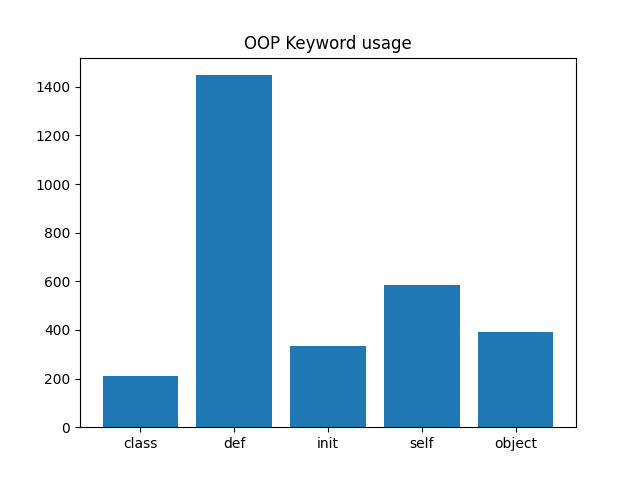
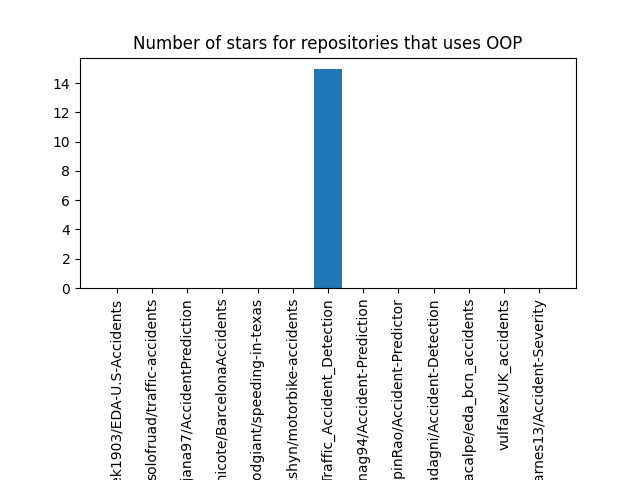
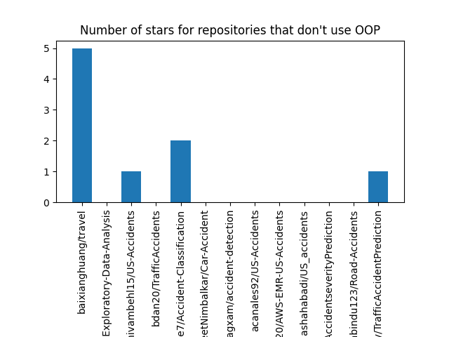
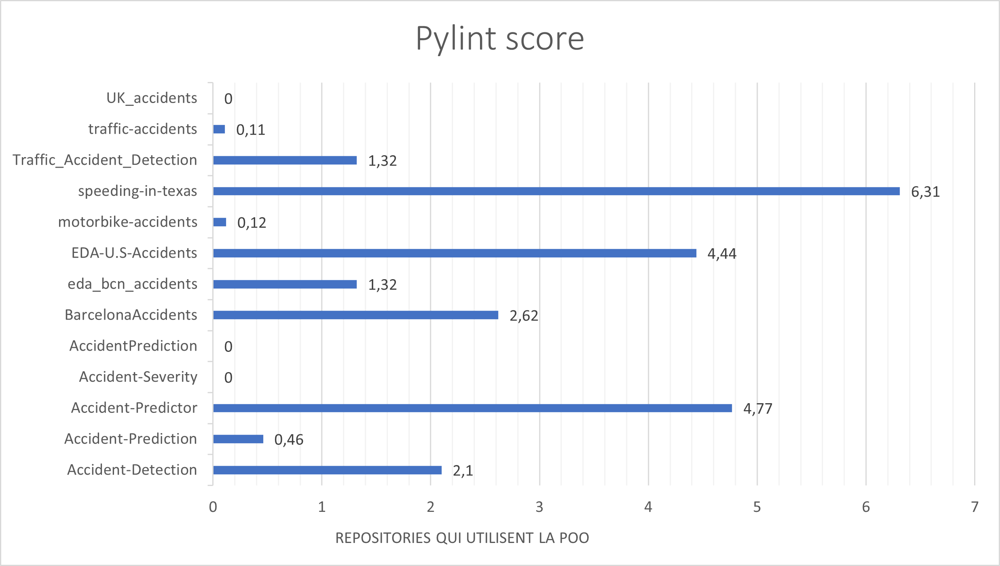
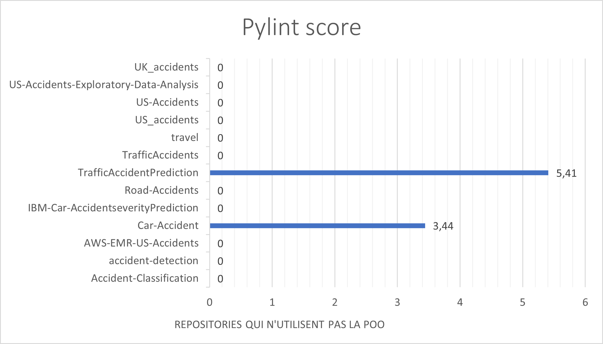

**_février 2023_**

## Auteurs

Nous sommes quatre étudiants alternants en dernière année à Polytech Nice Sophia, dans la spécialité Informatique et la mineure Architecture Logicielle :

* Nabil ABBAR - nabil.abbar@etu.univ-cotedazur.fr
* Lidaou Denis ASSOTI - lidaou-denis.assoti@etu.univ-cotedazur.fr
* Yassine BOUKHIRI - yassine.boukhiri@etu.univ-cotedazur.fr
* Amirah OUKPEDJO - amirah.oukpedjo@etu.univ-cotedazur.fr

## I. Contexte de recherche

La programmation orientée objet (POO) est un paradigme de programmation qui permet de modéliser des concepts du monde réel sous forme de classes et d'objets. Elle est devenue l'un des standards de l'industrie de développement de logiciels, car elle offre de nombreux avantages en termes de structure, de maintenance et de réutilisabilité du code.

Depuis sa création en 2011, Jupyter est devenue une plateforme populaire pour l'analyse de données et la science des données. Les notebooks Jupyter permettent aux utilisateurs de combiner du texte, du code et des visualisations dans un seul document interactif, ce qui les rend idéaux pour la documentation et la collaboration.

Cependant, il est important de se demander si la POO est utilisée dans les notebooks Jupyter et quel est son impact sur la qualité logicielle. En effet, la POO peut aider à structurer et à organiser le code de manière cohérente, ce qui peut améliorer la lisibilité et la maintenabilité du code. Cependant, il est également possible que la POO puisse rendre le code plus complexe et difficile à comprendre pour certains utilisateurs.

Il est donc intéressant de mener une étude pour évaluer l'utilisation de la POO dans les notebooks Jupyter et son impact sur la qualité logicielle. Cela pourrait être fait en examinant un échantillon de notebooks Jupyter populaires sur Kaggle et/ou Github et en analysant leur utilisation de la POO, en interrogeant les développeurs sur leur utilisation de la POO dans leur travail quotidien avec Jupyter (ce qui n'est pas applicable au contexte de ce cours), et en utilisant des outils d'analyse de code pour évaluer la qualité du code dans les notebooks Jupyter qui utilisent la POO. Les résultats de cette étude pourraient être utiles pour les développeurs de logiciels qui utilisent Jupyter plus particulièrement les Data Scientistes. 

## II. Observations / Question générale

La question générale que nous nous posons est : **la programmation orientée objet est-elle utilisée dans les notebooks Jupyter et quel est son impact sur la qualité logicielle ?**

Cette question nous intéresse car la POO est un paradigme de programmation largement utilisé dans l'industrie du développement logiciel, mais nous nous demandons si elle est également utilisée dans les notebooks Jupyter, qui sont principalement utilisés pour l'analyse de données et la science des données par les Data Scientistes. En outre, nous sommes intéressé par l'impact de l'utilisation de la POO sur la qualité logicielle dans les notebooks Jupyter, car la POO peut aider à structurer et à organiser le code de manière cohérente, mais peut également rendre le code plus complexe et difficile à comprendre voire maintenir.

De la question générale en découle plusieurs sous-questions qui nous permettent de mieux comprendre le sujet et d'aborder de manière plus précise et approfondie les différents aspects de la question : 
- **Quel est le pourcentage d’utilisation de la POO dans les notebooks Jupyter ?**

Cette sous-question vise à déterminer l'utilisation de la POO dans les notebooks Jupyter en termes de pourcentage. Cela pourrait être fait en examinant un échantillon de notebooks Jupyter python trouvés sur kaggle et/ou Github et en comptant le nombre de notebooks qui utilisent la POO (grâce à un ensemble de règles/patterns que nous deffinirons et qui nous permettrons de reconnaitre l'usage de la POO dans ces notebooks)par rapport au nombre total de notebooks.

- **Quel est l’impact de l’utilisation de la POO sur la qualité logicielle dans les notebooks Jupyter ?**

Cette sous-question vise à évaluer l'impact de l'utilisation de la POO sur la qualité logicielle dans les notebooks Jupyter python. Cela pourrait être fait en utilisant des outils d'analyse de code pour évaluer la qualité du code dans les notebooks Jupyter qui utilisent la POO, et en comparant cette qualité avec celle des notebooks qui n'utilisent pas la POO. On s'intéressera à **Pylint** qui est un outil de vérification de code python qui vise à améliorer la qualité du code en détectant les erreurs et en proposant des suggestions pour le rendre plus propre et plus maintenable.

- **Y-a-t-il une corrélation entre l'usage de la POO dans les notebooks Jupiter et leur popularité ?**

Cette sous-question vise à évaluer l'impact de l'utilisation de la POO sur la popularité des notebooks Jupyter python. Cela pourrait être fait en utilisant le nombre d'étoiles et de forks sur Github. 

## III. Collecte d'informations

Préciser vos zones de recherches en fonction de votre projet, les informations dont vous disposez, ... :

1. les articles ou documents utiles à votre projet
2. les outils
3. les jeux de données/codes que vous allez utiliser, pourquoi ceux-ci, ...

     :bulb: Cette étape est fortement liée à la suivante. Vous ne pouvez émettre d'hypothèses à vérifier que si vous avez les informations, inversement, vous cherchez à recueillir des informations en fonction de vos hypothèses. *

### Articles 

Nous avons cherché des documents de recherche et articles rédigés sur des blogs traitant de l'utilisation de la POO par les datascientistes et de l'usage de la POO dans les notebooks Jupyter python. Voici une synthèse de ce sur quoi nous avons basé notre travail : 

* [An Introduction to Object Oriented Data Science in Python](https://opendatascience.com/an-introduction-to-object-oriented-data-science-in-python)

     **Auteur :** Sev Leonard (Portland Data Science Group)

     **Date de publication :** 2016-11-29

     **Type de document :** Article 
     
     **Résumé :**

     Cet article présente les bases de la POO en python et explique comment l'utiliser dans le cadre de l'analyse de données et de la science des données. Il explique comment créer des classes et des objets, comment les utiliser pour stocker des données et comment les utiliser pour créer des fonctions et des méthodes. Il explique également comment utiliser la POO pour créer des pipelines de données et des modèles de machine learning.

* [Object-Oriented Programming (OOP) in Python 3](https://realpython.com/python3-object-oriented-programming/)

     **Auteur :** David Amos (programmer and mathematician passionate about exploring mathematics through code)

     **Type de document :** Article 
     
     **Résumé :**
     
     Cet article présente les bases de la POO en python et explique comment reconnaitre l'utilisation de la POO dans un code python. Il explique comment créer des classes et des objets, comment les utiliser pour stocker des données et comment les utiliser pour créer des fonctions et des méthodes. Il explique également comment représenter les grands conceptes de la POO en python comme l'héritage, l'encapsulation et la polymorphisme.  

### Jeux de données 

 
## IV. Hypothèses et Expériences

### Hypothèse 2 : L'utilisation de la programmation orientée objet (POO) améliore la qualité des notebooks Jupyter.
### Expérimentations : 
     Pour vérifier cette hypothèse, nous allons mener une comparaison rigoureuse entre la qualité des notebooks Jupyter utilisant la POO et ceux qui n'en utilisent pas. Nous allons mesurer la qualité du code en utilisant les critères suivants : la lisibilité, la modularité, la réutilisabilité et la documentation. 

     Pour effectuer cette comparaison, nous allons sélectionner un échantillon représentatif de notebooks Jupyter utilisant la POO et ceux qui n'en utilisent pas. Nous allons évaluer les critères de mesure de la qualité pour chacun des notebooks, puis comparer les résultats pour déterminer s'il y a une différence significative entre les deux groupes de notebooks. 

     Pylint est l’outil qui sera utilisé pour effectuer la mesure de la qualité du code comme il permet d’évaluer les notebooks en analysant différents aspects tels que : le nombre de lignes de code, le nombre de commentaires, le nombre de lignes vides, le nombre de fonctions et de méthodes, le nombre d'expressions complexes, le nombre de variables et le nombre de classes. Il peut également signaler des erreurs et des problèmes potentiels dans le code.

     Les choix et les limites de cette expérience incluent la taille de l'échantillon de notebooks sélectionnés, les critères choisis pour mesurer la qualité, ainsi que la méthodologie d'évaluation. L'hypothèse sera considérée comme vérifiée si les résultats montrent une différence significative en faveur des notebooks utilisant la POO par rapport à ceux qui n'en utilisent pas.

### Hypothèse 3 : L'utilisation de la POO augmente le score Kaggle et le nombre d'étoiles sur Github des notebooks Jupyter
### Expérimentations : 
     Pour vérifier cette hypothèse, nous allons collecter des notebooks Jupyter publiés sur Kaggle et Github qui couvrent les mêmes algorithmes et traitements de données. Nous divisons ensuite ces notebooks en deux groupes - ceux qui utilisent la POO et ceux qui n'utilisent pas la POO.

     Nous allons comparer les scores Kaggle et le nombre d'étoiles sur Github pour les notebooks de chaque groupe pour déterminer s'il y a une différence significative entre les scores des notebooks utilisant la POO et ceux n'utilisant pas la POO. Cette comparaison nous permettra de mesurer le succès relatif des notebooks utilisant la POO par rapport aux autres.

     Les choix et les limites de cette expérience incluent la qualité de la mise en œuvre de la POO dans les notebooks utilisant la POO, ainsi que l'effet éventuel de tout autre facteur qui pourrait influencer les scores Kaggle et les étoiles sur Github.

     L'hypothèse sera considérée comme vérifiée si les scores Kaggle et le nombre d'étoiles sur Github des notebooks utilisant la POO sont significativement supérieurs à ceux des notebooks n'utilisant pas la POO.

## V. Analyse des résultats et conclusion

1. Présentation des résultats

2. Interprétation/Analyse des résultats en fonction de vos hypothèses
3. Construction d’une conclusion 

     :bulb:  Vos résultats et donc votre analyse sont nécessairement limités. Préciser bien ces limites : par exemple, jeux de données insuffisants, analyse réduite à quelques critères, dépendance aux projets analysés, ...

## VI. Outils utilisés

Précisez votre utilisation des outils ou les développements \(e.g. scripts\) réalisés pour atteindre vos objectifs. Ce chapitre doit viser à \(1\) pouvoir reproduire vos expérimentations, \(2\) partager/expliquer à d'autres l'usage des outils.

Nous avons mis en place un [outil](https://github.com/ABBARNABIL/github-repository-scrapper/tree/main/github-repo-scraping/github-repo-scraping) (en réalité des scripts python automatisés) qui nous ont permis de récupérer des notebooks Jupyter python sur Github; de déterminer la présence de l'utilisation de la POO dans ces derniers; d'analyser la qualité du code dans ces notebooks et de visualiser les résultats obtenus grâce à des graphiques. 

Cet outil mise en place se base sur les outils suivant : 

* [Pylint](https://www.pylint.org/) afin d'analyser la qualité du code dans les notebooks Jupyter python.
* [L'API GitHub](https://docs.github.com/en/rest/guides/getting-started-with-the-rest-api?apiVersion=2022-11-28) afin de récupérer les notebooks Jupyter python sur Github et ainsi éviter de les télécharger manuellement.
* [PyGithub](https://pygithub.readthedocs.io/en/latest/index.html) afin de récupérer de manière automatisée les notebooks Jupyter python dans les scripts python mis en place. 
* [Matplotlib](https://matplotlib.org/stable/index.html) afin de visualiser les résultats obtenus. 

## VI. Références

1. [An Introduction to Object Oriented Data Science in Python](https://opendatascience.com/an-introduction-to-object-oriented-data-science-in-python)
2. [A Large-Scale Study About Quality and Reproducibility of Jupyter Notebooks](https://ieeexplore.ieee.org/abstract/document/8816763)
3. [Assessing and restoring reproducibility of Jupyter notebooks](https://dl.acm.org/doi/abs/10.1145/3324884.3416585)
4. [Better code, better sharing: on the need of analyzing jupyter notebooks](https://dl.acm.org/doi/abs/10.1145/3377816.3381724)

