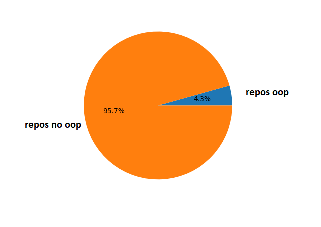
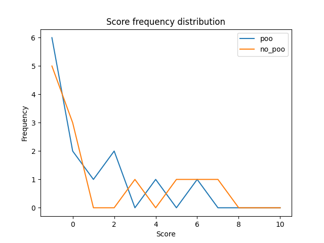
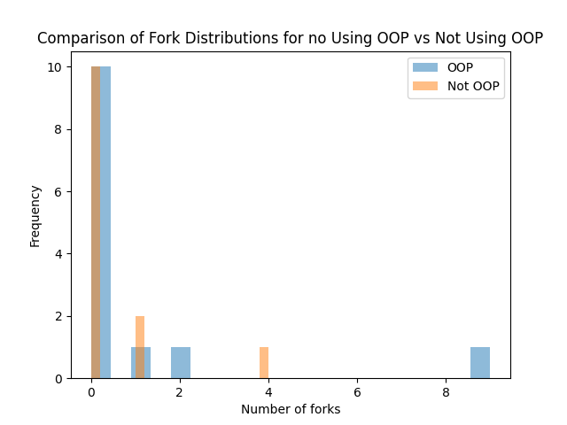
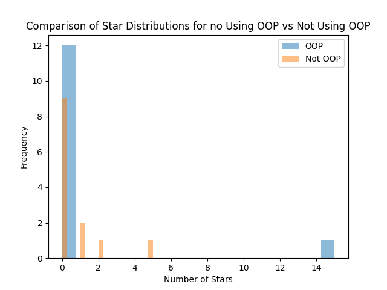
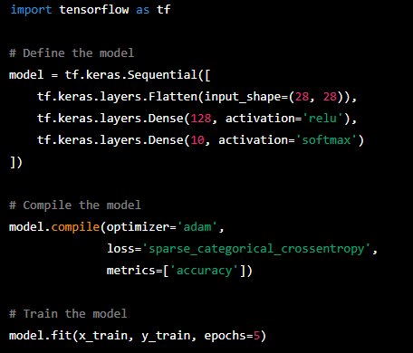

**_février 2023_**

## Auteurs

Nous sommes quatre étudiants alternants en dernière année à Polytech Nice Sophia, dans la spécialité Informatique et la mineure Architecture Logicielle :

* Nabil ABBAR - nabil.abbar@etu.univ-cotedazur.fr
* Lidaou Denis ASSOTI - lidaou-denis.assoti@etu.univ-cotedazur.fr
* Yassine BOUKHIRI - yassine.boukhiri@etu.univ-cotedazur.fr
* Amirah OUKPEDJO - amirah.oukpedjo@etu.univ-cotedazur.fr

## I. Contexte de recherche

La programmation orientée objet (POO) est un paradigme de programmation qui permet de modéliser des concepts du monde réel sous forme de classes et d'objets. Elle est devenue l'un des standards de l'industrie de développement de logiciels, car elle offre de nombreux avantages en termes de structure, de maintenance et de réutilisabilité du code.

Depuis sa création en 2011, Jupyter est devenue une plateforme populaire pour l'analyse de données et la science des données. Les notebooks Jupyter permettent aux utilisateurs de combiner du texte, du code et des visualisations dans un seul document interactif, ce qui les rend idéaux pour la documentation et la collaboration.

Cependant, il est important de se demander si la POO est utilisée dans les notebooks Jupyter et quel est son impact sur la qualité logicielle. En effet, la POO peut aider à structurer et à organiser le code de manière cohérente, ce qui peut améliorer la lisibilité et la maintenabilité du code. Cependant, il est également possible que la POO puisse rendre le code plus complexe et difficile à comprendre pour certains utilisateurs.

Il est donc intéressant de mener une étude pour évaluer l'utilisation de la POO dans les notebooks Jupyter et son impact sur la qualité logicielle. Cela pourrait être fait en examinant un échantillon de notebooks Jupyter populaires sur Github et en analysant leur utilisation de la POO, en interrogeant les développeurs sur leur utilisation de la POO dans leur travail quotidien avec Jupyter (ce qui n'est pas applicable au contexte de ce cours), et en utilisant des outils d'analyse de code pour évaluer la qualité du code dans les notebooks Jupyter qui utilisent la POO. Les résultats de cette étude pourraient être utiles pour les développeurs de logiciels qui utilisent Jupyter plus particulièrement les Data Scientistes. 

## II. Observations / Question générale

La question générale que nous nous posons est : **la programmation orientée objet est-elle utilisée dans les notebooks Jupyter et quel est son impact sur la qualité logicielle ?**

Cette question nous intéresse car la POO est un paradigme de programmation largement utilisé dans l'industrie du développement logiciel, mais nous nous demandons si elle est également utilisée dans les notebooks Jupyter, qui sont principalement utilisés pour l'analyse de données et la science des données par les Data Scientistes. En outre, nous sommes intéressé par l'impact de l'utilisation de la POO sur la qualité logicielle dans les notebooks Jupyter, car la POO peut aider à structurer et à organiser le code de manière cohérente, mais peut également rendre le code plus complexe et difficile à comprendre voire maintenir.

De la question générale en découle plusieurs sous-questions qui nous permettent de mieux comprendre le sujet et d'aborder de manière plus précise et approfondie les différents aspects de la question : 
- **Quel est le pourcentage d’utilisation de la POO dans les notebooks Jupyter ?**

Cette sous-question vise à déterminer l'utilisation de la POO dans les notebooks Jupyter en termes de pourcentage. Cela pourrait être fait en examinant un échantillon de notebooks Jupyter python trouvés sur Github et en comptant le nombre de notebooks qui utilisent la POO (grâce à un ensemble de règles/patterns que nous deffinirons et qui nous permettrons de reconnaitre l'usage de la POO dans ces notebooks)par rapport au nombre total de notebooks.

- **Quel est l’impact de l’utilisation de la POO sur la qualité logicielle dans les notebooks Jupyter ?**

Cette sous-question vise à évaluer l'impact de l'utilisation de la POO sur la qualité logicielle dans les notebooks Jupyter python. Cela pourrait être fait en utilisant des outils d'analyse de code pour évaluer la qualité du code dans les notebooks Jupyter qui utilisent la POO, et en comparant cette qualité avec celle des notebooks qui n'utilisent pas la POO. On s'intéressera à **Pylint** qui est un outil de vérification de code python qui vise à améliorer la qualité du code en détectant les erreurs et en proposant des suggestions pour le rendre plus propre et plus maintenable.

- **Y-a-t-il une corrélation entre l'usage de la POO dans les notebooks Jupyter et leur popularité ?**

Cette sous-question vise à évaluer l'impact de l'utilisation de la POO sur la popularité des notebooks Jupyter python. Cela pourrait être fait en utilisant le nombre d'étoiles et de forks sur Github. 

## III. Collecte d'informations

### Articles 

Nous avons cherché des documents de recherche et articles rédigés sur des blogs traitant de l'utilisation de la POO par les datascientistes et de l'usage de la POO dans les notebooks Jupyter python. Voici une synthèse de ce sur quoi nous avons basé notre travail : 

* [Object-Oriented Programming (OOP) in Python 3](https://realpython.com/python3-object-oriented-programming/)

     **Auteur :** David Amos (programmer and mathematician passionate about exploring mathematics through code)

     **Type de document :** Article 
     
     **Résumé :**
     
     Cet article présente les bases de la POO en python et explique comment reconnaitre l'utilisation de la POO dans un code python. Il explique comment créer des classes et des objets, comment les utiliser pour stocker des données et comment les utiliser pour créer des fonctions et des méthodes. Il explique également comment représenter les grands conceptes de la POO en python comme l'héritage, l'encapsulation et la polymorphisme. Grâce à cet article, nous avons appris les différents mots clés utilisés pour la POO en Python.

     Nous avons : 

     **class** : utilisé pour définir une classe.

     **object** : classe de base pour toutes les classes en Python, définit les méthodes de base pour les objets.

     **self** : une référence à l'objet courant lors de l'exécution d'une méthode.

     **__init__()** : une méthode spéciale appelée lors de la création d'un objet, utilisée pour initialiser les attributs de l'objet : le constructeur. 

### Jeux de données 

Afin de mener à bien notre projet de recherche sur l'utilisation de la POO dans les notebooks Jupyter Python, nous envisageons de rechercher sur GitHub les notebooks jupyter python. Pour faciliter notre recherche de notebooks, nous envisageons d'écrire des scripts Python qui vons nous nous permettre d'automatiser la recherche de fichiers d'extensions .ipynb sur GitHub grâce à son API. Les fichiers notebooks étant des fichiers scientifiques et pour avoir un grand volume de données, nous ne nous restreindrons pas à un domaine spécifique. Cela pour maximiser nos chances de trouver des notebooks utilisants la POO. 

### Outils 

Les outils que nous envisageons utiliser pour notre étude sont : 

* [Pylint](https://www.pylint.org/) est un outil puissant pour vérifier la qualité du code en Python. Il offre une analyse détaillée du code et fournit des commentaires sur les erreurs, les avertissements et les bonnes pratiques. Cet outil est simple à utiliser et facile à configurer, ce qui le rend idéal pour les petits projets.
* [SonarQube](https://www.sonarqube.org/) est un logiciel libre de qualimétrie en continu de code. Il aide à la détection, la classification et la résolution de défaut dans le code source, permet d'identifier les duplications de code, de mesurer le niveau de documentation et connaître la couverture de test déployée. 
* [PyGithub](https://pygithub.readthedocs.io/en/latest/index.html) est une bibliothèque Python pour accéder à l' API REST de GitHub. Cette bibliothèque permet de gérer les ressources GitHub telles que les référentiels, les profils utilisateur et les organisations dans les applications Python. Elle nous permettra de récupérer de manière automatisée les notebooks Jupyter python dans les scripts python qu'on mettra en place. 
* [Matplotlib](https://matplotlib.org/stable/index.html) est une bibliothèque du langage de programmation Python destinée à tracer et visualiser des données sous forme de graphiques. Elle nous permettra de visualiser les résultats obtenus. 

 
## IV. Hypothèses et Expériences

### Hypothèse 1 : L'utilisation de la Programmation Orientée Objet (POO) est largement adoptée par les data scientistes pour améliorer la qualité de leurs notebooks.
### Expérimentations : 

Pour vérifier cette hypothèse, nous allons collecter un échantillon représentatif de notebooks Jupyter publiés par des data scientists. Nous allons utiliser différentes sources telles que Github, et les sites de partage de code pour trouver ces notebooks.

Puis, nous allons utiliser une méthode automatisée pour déterminer si chaque notebook utilise ou non la POO. Cette méthode pourra être basée sur des algorithmes de reconnaissance de code ou sur l'analyse des fichiers source pour identifier les caractéristiques de la POO.

Nous prendrons en compte les limites de cette analyse, telles que le nombre limité d'échantillons disponibles et la restriction de collecte des notebooks par l’Api Github.

### Hypothèse 2 : L'utilisation de la programmation orientée objet (POO) améliore la qualité des notebooks Jupyter.
### Expérimentations : 

Pour vérifier cette hypothèse, nous allons mener une comparaison rigoureuse entre la qualité des notebooks Jupyter utilisant la POO et ceux qui n'en utilisent pas. Nous allons mesurer la qualité du code en utilisant les critères suivants : la <b>lisibilité</b>, <b>la modularité</b>, <b>la réutilisabilité</b> et la <b>documentation</b>. 

Pour effectuer cette comparaison, nous allons sélectionner un échantillon représentatif de notebooks Jupyter utilisant la POO et ceux qui n'en utilisent pas. Nous allons évaluer les critères de mesure de la qualité pour chacun des notebooks, puis comparer les résultats pour déterminer s'il y a une différence significative entre les deux groupes de notebooks. 

Pylint est l’outil qui sera utilisé pour effectuer la mesure de la qualité du code comme il permet d’évaluer les notebooks en analysant différents aspects tels que : le nombre de lignes de code, le nombre de commentaires, le nombre de lignes vides, le nombre de fonctions et de méthodes, le nombre d'expressions complexes, le nombre de variables et le nombre de classes. Il peut également signaler des erreurs et des problèmes potentiels dans le code.

Les choix et les limites de cette expérience incluent la taille de l'échantillon de notebooks sélectionnés, les critères choisis pour mesurer la qualité, ainsi que la méthodologie d'évaluation. L'hypothèse sera considérée comme vérifiée si les résultats montrent une différence significative en faveur des notebooks utilisant la POO par rapport à ceux qui n'en utilisent pas.

### Hypothèse 3 : L'utilisation de la POO augmente le nombre d'étoiles sur Github des notebooks Jupyter
### Expérimentations :

Pour vérifier cette hypothèse, nous allons collecter des notebooks Jupyter publiés sur Github qui couvrent les mêmes algorithmes et traitements de données. Nous divisons ensuite ces notebooks en deux groupes - ceux qui utilisent la POO et ceux qui n'utilisent pas la POO.

Nous allons comparer le nombre d'étoiles sur Github pour les notebooks de chaque groupe pour déterminer s'il y a une différence significative entre les scores des notebooks utilisant la POO et ceux n'utilisant pas la POO. Cette comparaison nous permettra de mesurer le succès relatif des notebooks utilisant la POO par rapport aux autres.

Les choix et les limites de cette expérience incluent la qualité de la mise en œuvre de la POO dans les notebooks utilisant la POO, ainsi que l'effet éventuel de tout autre facteur qui pourrait influencer les étoiles sur Github.

L'hypothèse sera considérée comme vérifiée si le nombre d'étoiles sur Github des notebooks utilisant la POO sont significativement supérieurs à ceux des notebooks n'utilisant pas la POO.

## V. Analyse des résultats et conclusion

### 1. Fréquence d'usage de la POO dans les notebooks 

  

D'après les données représentées sur le graphique, il est clair que l'utilisation de la Programmation Orientée Objet (POO) est très peu répandue chez les utilisateurs de notebooks. Seulement <b>4,3%</b> des utilisateurs de notebooks utilisent la POO, tandis que <b>95,7%</b> n'en font pas usage. Cependant, il est important de prendre en compte les limites de l'étude, notamment le nombre restreint d'échantillons disponibles et la restriction de collecte des notebooks via l'Api Github.

L'hypothèse 1 soutenait que "l'utilisation de la POO est largement adoptée par les data scientistes pour améliorer la qualité de leurs notebooks". Cependant, en considérant les données obtenues avec nos limites, nous pouvons conclure que l'utilisation de la POO est très peu fréquente dans les notebooks Jupyter. Par conséquent, nous rejetons <b>l'hypothèse 1</b>.

### 2. Qualité logicielle des notebooks 

  

comparaison de 13 repos poo et 13 repos non POo 
accepté dans la limite des repos

### 3. Popularité des notebooks qui utilisent la POO

  

  

accepé

2. Interprétation/Analyse des résultats en fonction de vos hypothèses
3. Construction d’une conclusion 

     :bulb:  Vos résultats et donc votre analyse sont nécessairement limités. Préciser bien ces limites : par exemple, jeux de données insuffisants, analyse réduite à quelques critères, dépendance aux projets analysés, ...

limites : limitation du nombre de repos utilisants la POO donc pas assez de données

## VI. Les limites de notre étude

## VII. Les datas scientistes utilisent de la POO sans le savoir 

De nombreux datas scientistes utilisent la POO dans leurs notebooks Jupyter sans même le savoir. Cela est dû au fait que de nombreuses bibliothèques populaires utilisées dans le domaine des sciences des données, telles que scikit-learn, TensorFlow et autres, sont construites en utilisant la POO. En utilisant ces bibliothèques, les datas scientistes manipulent souvent des objets tels que des modèles de machine learning, des jeux de données, etc. qui sont des instances de classes définies par ces bibliothèques. Même si ces datas scientistes n'ont pas nécessairement conscience de la POO, ils en bénéficient tout de même en bénéficiant de la modularité, de l'encapsulation et de l'héritage que cette technique de programmation offre. Nous l'avons constaté suite à une étude menée sur les libraires les plus populaires utilisées par les scientistes. 

Exemples : Création d'un réseau de neurone avec la bibliothèque TensorFlow

  

Dans ce code, nous utilisons la classe **Sequential** pour définir notre modèle de réseau de neurones en lui fournissant les differents paramètres par argument. Les méthodes **compile** et **fit** sont appelés sur la référence de l'objet **model** créé. Celles-ci font donc parties de la classe **Sequential**; une caractérisation de l'encapsulation. 

## VIII. Outils utilisés

Pour vérifier l'utilisation de la POO dans les fichiers notebooks, nous avons effectué une recherche de mots clés (décrit dans la section III. Collecte d'informations) en premier lieu en parcourant manuellement les fichiers, puis nous avons automatisé ce processus en utilisant des expressions régulières (regex). Cela nous a permis d'automatiser la tâche et d'augmenter notre productivité. 

Nous avons mis en place un [outil](https://github.com/ABBARNABIL/github-repository-scrapper/tree/main/github-repo-scraping/github-repo-scraping) (en réalité des scripts python automatisés) qui nous ont permis de récupérer des notebooks Jupyter python sur Github; de transformer ces notebooks en fichiers python (pour mieux les traiter); de déterminer la présence de l'utilisation de la POO dans ces derniers; d'analyser la qualité du code dans ces notebooks et de visualiser les résultats obtenus grâce à des graphiques. 

un **README.md** contenant les instructions d'utilisation de l'outil est disponible dans le repertoire **/code/** du rendu. 

## IX. Conclusion

................

Comme perspectives futures, nous pensons étendre et approfondir notre recherche en étudiant l'évolution de l'utilisation de la POO dans le notebooks jupyter python. Nous prévoyons également d'élargir notre étude aux notebooks de fichiers R.

## X. Références

1. [An Introduction to Object Oriented Data Science in Python](https://opendatascience.com/an-introduction-to-object-oriented-data-science-in-python)
2. [A Large-Scale Study About Quality and Reproducibility of Jupyter Notebooks](https://ieeexplore.ieee.org/abstract/document/8816763)
3. [Assessing and restoring reproducibility of Jupyter notebooks](https://dl.acm.org/doi/abs/10.1145/3324884.3416585)
4. [Better code, better sharing: on the need of analyzing jupyter notebooks](https://dl.acm.org/doi/abs/10.1145/3377816.3381724)
