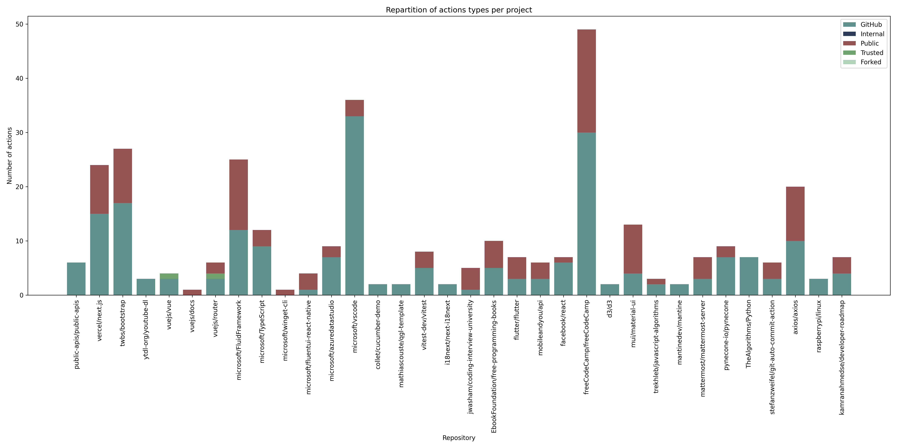
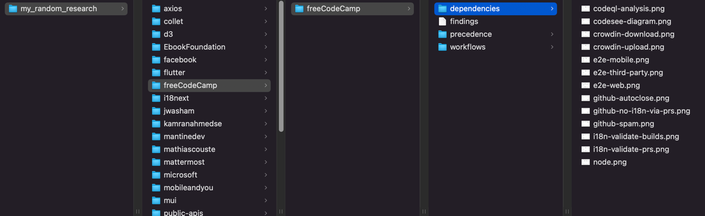
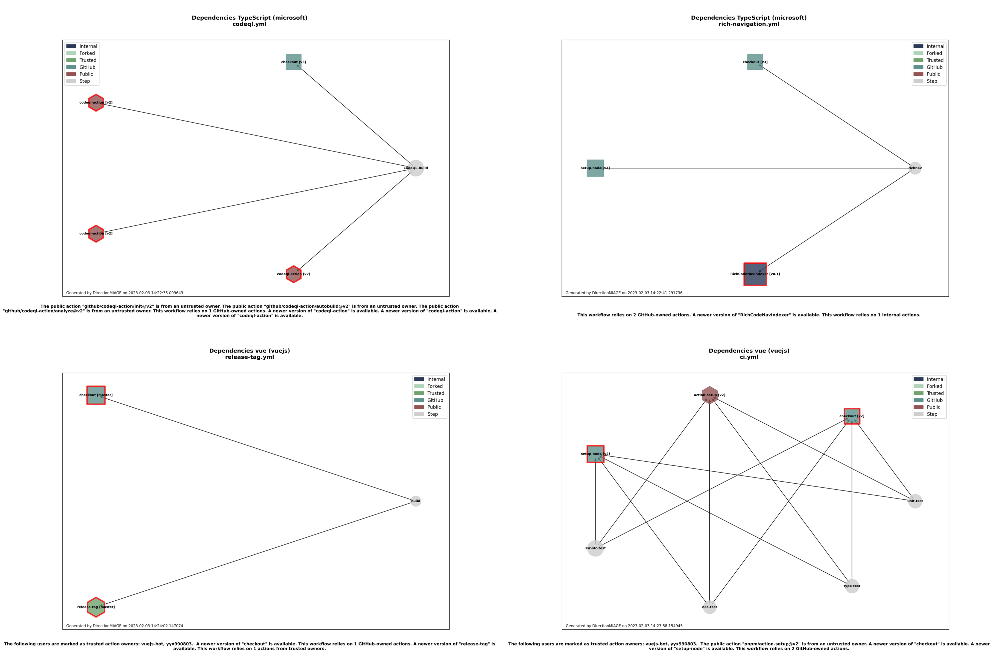
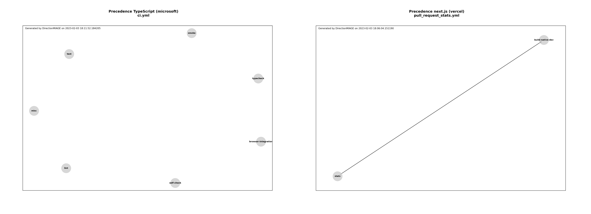

**_février 2023_**

## Auteurs

Nous sommes cinq étudiants en dernière année à Polytech Nice-Sophia specialisés en Architecture Logicielle (AL) :

- Antoine Amiard ([@AntoineAmiard](https://github.com/AntoineAmiard)),
- Romain Kugler ([@romainkugler](https://github.com/romainkugler)),
- Pierre-Yves Munoz ([@pyMNZ](https://github.com/pyMNZ)),
- Julien Satti ([@juliensatti](https://github.com/juliensatti)).


## I. Contexte

L'intégration continue (CI) est de plus en plus utilisée et préconisée dans l'utilisation de dépôts de contrôle de version (type GitHub, GitLab...). Au fil des années, de nouveaux outils ont été implémentés dans les langages descriptifs d'intégration continue (type GitHub Actions, GitLab CI/CD ; tous deux sous le format YAML). Un de ces ajouts : la réutilisation d'étapes/actions (steps) au travers d'actions partagées/"empaquetées" par la plateforme, par des tiers ou par nous même dans un autre dépôt par exemple.

Ainsi, avec cette réutilisation d'actions au travers des fichiers d'intégration continue, nous nous sommes posés la question de la maintenabilité de ces fichiers. En effet, si une action est modifiée, il faut modifier tous les fichiers d'intégration continue qui l'utilisent. De plus, si une action est supprimée, il faut supprimer tous les fichiers d'intégration continue qui l'utilisent. Même chose si elle est déplacée ou mise à jour. Cela peut vite devenir un problème.

Nous nous sommes donc demandés s'il était possible de visualiser les dépendances en actions dans chaque tâche d'un fichier d'intégration continue, avec pour chaque action empaquetée détectée : leur origine, leur niveau de confiance associée et si elles sont à jour ou non. Nous avons donc décidé de développer un outil permettant de répondre à cette problématique.

Pour réaliser cela, nous réaliserons aussi une visualisation plus parlante de la précédence de chaque tâche (job) au sein d'une chaîne d'intégration continue.

## II. Question générale

 **"Comment visualiser les dépendances d’une chaîne d’intégration continue, leur origine et leur niveau de confiance ?"**

Cette question a le mérite d'être très large et de couvrir plusieurs problématiques. Nous avons donc décidé de la décomposer en plusieurs questions plus précises :
   1. Comment détecter l’obsolescence de l’implémentation d’une tâche dans une chaine d’intégration continue ?
   2. Comment s’assurer de la pérennité de tâches tierces dans une chaîne d’intégration continue ?
   3. Comment représenter toutes ces informations clairement ?

Au terme de ce projet, nous espérons pouvoir répondre à ces questions et ainsi fournir un outil permettant de proposer une visualisation viable de la chaîne d'intégration continue de n'importe quel projet.

## III. Recueil des données

Préciser vos zones de recherches en fonction de votre projet, les informations dont vous disposez, ... :

1. les articles ou documents utiles à votre projet
2. les outils
3. les jeux de données/codes que vous allez utiliser, pourquoi ceux-ci, ...

     :bulb: Cette étape est fortement liée à la suivante. Vous ne pouvez émettre d'hypothèses à vérifier que si vous avez les informations, inversement, vous cherchez à recueillir des informations en fonction de vos hypothèses.

## IV. Hypothèses & Expériences

1. Il s'agit ici d'**énoncer sous forme d'hypothèses** ce que vous allez chercher à démontrer. Vous devez définir vos hypothèses de façon à pouvoir les _mesurer/vérifier facilement._ Bien sûr, votre hypothèse devrait être construite de manière à _vous aider à répondre à votre question initiale_. Explicitez ces différents points.
2. Vous **explicitez les expérimentations que vous allez mener** pour vérifier si vos hypothèses sont vraies ou fausses. Il y a forcément des choix, des limites, explicitez-les.

     :bulb: Structurez cette partie à votre convenance : Hypothèse 1 => Expériences, Hypothèse 2 => Expériences ou l'ensemble des hypothèses et les expériences....


## V. Analyse des résultats & Conclusion

1. Présentation des résultats
2. Interprétation/Analyse des résultats en fonction de vos hypothèses
3. Construction d’une conclusion

     :bulb:  Vos résultats et donc votre analyse sont nécessairement limités. Préciser bien ces limites : par exemple, jeux de données insuffisants, analyse réduite à quelques critères, dépendance aux projets analysés, ...



## VI. Outillage

Afin de réaliser ce projet, nous avons créé des outils permettant de détecter les actions utilisées dans un fichier d'intégration continue, de les analyser et de les visualiser.

### 1. Génération des visualisations et des résultats

Pour générer les visualisations et les résultats, nous avons utilisé le script `main.py` qui permet de récupérer les informations sur les actions utilisées dans les fichiers d'intégration continue des dépôts GitHub (importés dans un fichier de recherche sous format YML). Pour cela, nous avons utilisé l'API GitHub et le langage Python.

Il suffit de créer un corpus de dépôts dans le format YML suivant :

```yaml
name: "My Research Corpus"

subjects:

   your_group_name:
      repositories:
         - "repo_owner/repo_name"

   your_group_name_advanced:
      repositories:
         - "repo_owner/repo_name"
      trusted-owners:
         - "github_username"
```

Puis de lancer le script `main.py` avec le fichier YML en paramètre :

```bash
python3 main.py -P my_corpus.yml
```

Le script va alors récupérer les informations sur les actions utilisées dans les fichiers d'intégration continue des dépôts GitHub et les exporter dans un fichier de résultats au format propriétaire "findings". En plus de réaliser cela, des graphiques sont générés à partir des résultats obtenus et organisés dans un dossier `results` à la racine du projet. Ce dossier contient le nom du corpus utilisé pour générer les résultats et détient chacun des dépôts analysés dans un dossier portant le nom du propriétaire du dépôt. Dans chacun de ces dossier, les dépôts sont organisés dans des sous-dossiers portant le nom du dépôt. Dans chacun de ces sous-dossiers, les graphiques de précédence sont générés dans un dossier `precedence` et les graphiques de dépendances (ceux qui nous intéressent le plus) dans un dossier `dependencies`. Les fichiers de workflow sont également copiés dans un dossier `workflows` à la racine du dossier du dépôt.



Il est à l'issue de l'exécution du script possible visualiser les résultats obtenus pour chaque dépôt et chacun de ses fichiers de CI. Les résultats condensés sont inscrits dans le pied de chacune des visualisations. On se retrouve par exemple, pour quelques-uns des fichiers de CI, avec les résultats suivants :



On remarque qu'il est alors d'un coup d'œil possible de voir quelles sont les actions les plus utilisées dans un fichier de CI, quelles sont les actions les plus utilisées dans chaque fichier de CI, mais surtout de visualiser clairement les problèmes de sécurité éventuels au travers d'une dépendance/action qui n'est pas à jour ou qui vient d'un dépôt public qui n'est pas en provenance de GitHub Actions (organisation "actions") et qui ne fait non plus partie de comptes affiliés au projet.

*Nous gérons les dépendances circulaires et les dépendances linéaires dans les graphiques.*

Mais ce n'est pas tout, puisqu'en plus de ces représentations essentielles à notre recherche, nous avons également des visualisations de précédence parmi les actions de chaque fichier de workflow, ce qui nous permet aisément de voir le parallélisme possible des actions ou les dépendances entre elles. C'est un petit plus qui permet d'avoir une représentation précise de la structure du fichier de CI.



Ici, on remarque que la plupart des actions au sein d'un fichier de CI sont indépendantes les unes des autres, ce qui est un bon point pour la performance de l'exécution du fichier de CI et qui permet de réduire le temps d'exécution de celui-ci. Cela peut aussi permettre d'améliorer la lisibilité du fichier de CI en séparant les actions indépendantes les unes des autres et permettre une exécution segmentée selon la branche ou le contexte d'exécution par exemple. Il arrive néanmoins que des actions soient dépendantes les unes des autres, ce qui est représenté par les flèches. Dans ce cas, il est possible de voir quelles sont les actions qui sont dépendantes les unes des autres — un processus souvent nécessaire et qui induit généralement des échanges de données entre les actions.

### 2. Analyse des résultats

Afin de compiler les résultats obtenus précédemment sous format de fichier propriétaire "findings" pour obtenir une vue d'ensemble du corpus, nous avons utilisé le script `compyte.py` qui permet de compiler des graphiques et des données statistiques à partir des résultats obtenus par le script `main.py`. Pour cela, nous avons utilisé le langage Python également. Les images présentes dans ce rapport ont été générées à l'aide de ce script.

Il suffit de lancer le script `compyte.py` qui va récupérer les résultats dans le dossier `results` à la racine du projet et générer les graphiques et les données statistiques dans le dossier `results` à la racine du projet. Les graphiques sont générés dans la mémoire et les données statistiques sont exportées dans la console.

> 🤘🏻 Tout le code source de ce projet de recherche est disponible [ici](assets/code), avec un guide d'utilisation.

## VI. References

[Debret 2020] Debret, J. (2020) La démarche scientifique : tout ce que vous devez savoir ! Available at: https://www.scribbr.fr/article-scientifique/demarche-scientifique/ (Accessed: 18 November 2022).

{:height="25px"}
