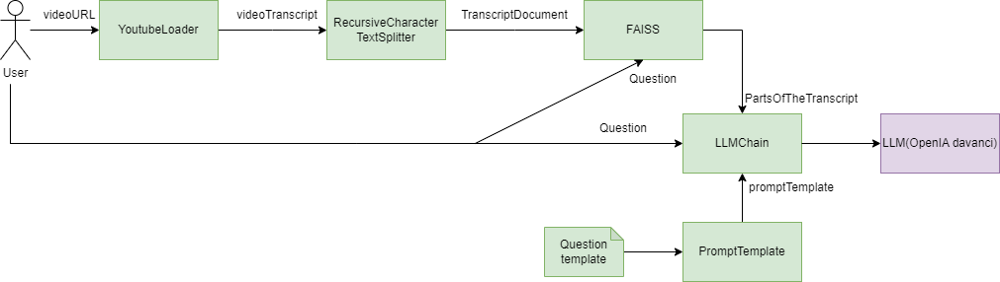
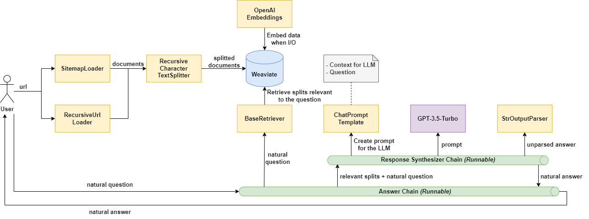
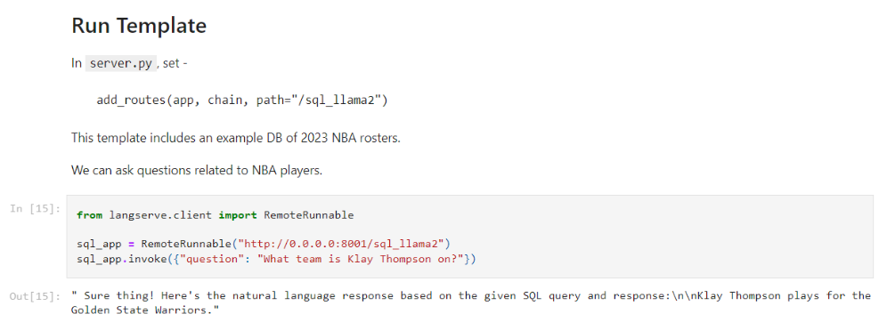
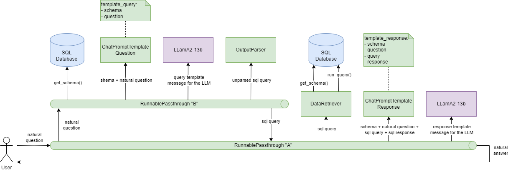
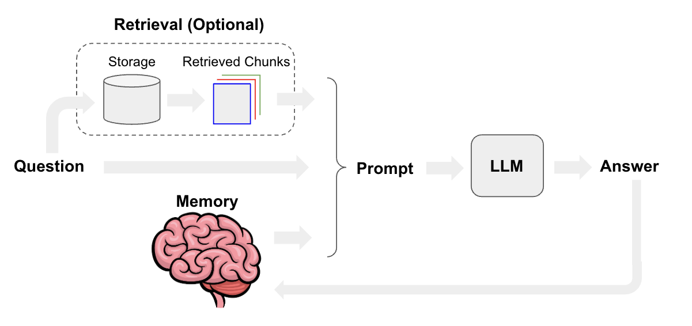
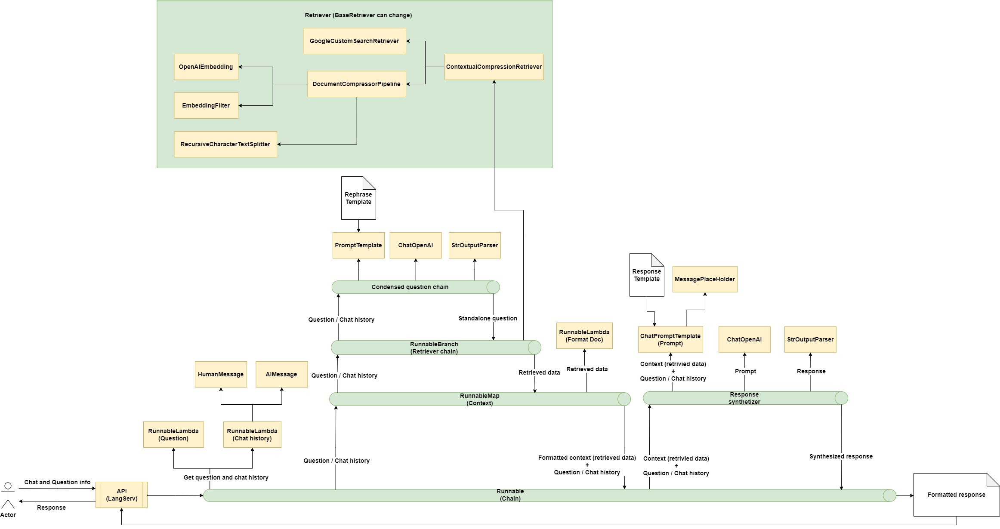

**_février 2024_**

## Auteurs

Nous sommes quatre étudiants ingénieurs en dernière année à Polytech Nice Sophia, spécialisés en Architecture Logiciel :

* Antoine Buquet &lt;antoine.buquet@etu.unice.fr&gt;
* Ayoub Imami &lt;ayoub.imami@etu.unice.fr&gt;
* Benoit Gaudet &lt;benoit.gaudet@etu.unice.fr&gt;
* Mourad Karrakchou &lt;mourad.karrakchou@etu.unice.fr&gt;

---

# I. Introduction

---

## 1. Contexte

LangChain est un framework permettant de développer des applications alimentées par de grands modèles de langage - Large
Language Models - LLM.

L'étude de la flexibilité de LangChain dans le contexte des LLM représente une exploration cruciale des possibilités
offertes par ce framework dans le développement d'applications sur mesure. Avec l'avènement de LLM tels que GPT-3 (
ChatGPT), l'intelligence artificielle a connu une expansion significative, mais le défi réside désormais dans la
création d'applications adaptées à des cas d'utilisation spécifiques, intégrant de manière harmonieuse ces modèles
complexes.

LangChain se positionne comme une solution à ce défi en proposant un framework dédié au développement d'applications
utilisant des LLM. Son objectif principal est d'offrir aux développeurs la flexibilité nécessaire pour créer des
applications sur mesure tout en facilitant l'interaction avec d'autres sources de données et applications. Cette
flexibilité réside dans la conception de chaînes personnalisées. Cela passe notamment par la mise en place dans
LangChain d’un large panel de composants réutilisables couvrant un grand nombre de fonctionnalités et permettant à
l’utilisateur d’utiliser ces composants comme des éléments de ses chaînes. De ce fait, la réutilisation de ces
composants dans divers contextes est un enjeu clé de LangChain.

 

Figure I.1.1 : Diagramme de composants d’une application permettant la recherche d’information sur une vidéo YouTube

*Légende* :

- YoutubeLoader : Charger une vidéo YouTube en tant que document.
- RecursiveCharacterTextSplitter : Objet qui divise un document en morceaux plus petits.
- FAISS (Facebook AI Similarity Search) : Recherche efficace de similarité et regroupement de vecteurs denses.

 
Par exemple, dans la *Figure I.1.1*, on peut voir sur ce diagramme que cette application utilise plusieurs composants de
LangChain (en vert) qui viennent former une chaîne permettant à l’utilisateur de pouvoir poser des questions sur la
vidéo YouTube. On remarque qu'individuellement, les composants ont l’air réutilisables grâce à la manière dont ils sont
intégrés dans la chaîne. Il serait ici par exemple totalement possible de remplacer le “YoutubeLoader” par un
“DocumentLoader” et lire un fichier PDF à la place d’une video YouTube et d’utiliser le “YoutubeLoader” dans un contexte
totalement différent.

## 2. Motivations

Notre étude est motivée par plusieurs raisons. Tout d'abord, elle permet d'explorer en profondeur la manière dont
LangChain répond aux besoins spécifiques des développeurs en matière d'intégration des LLM. En mettant l'accent sur la
flexibilité des chaînes personnalisées, notre étude offre une compréhension approfondie de la capacité de LangChain à
s'adapter à divers cas d'utilisation, allant au-delà de simples interactions avec les modèles via des interfaces web.
De plus, en comparant les cas d’utilisation, notre analyse vise à mettre en évidence les éléments communs ou
différenciants. Cette comparaison offre des aperçus précieux, identifiant des tendances émergentes, des bonnes pratiques
et des aspects clés de la mise en œuvre de LangChain. Elle fournit ainsi une base solide pour guider les développeurs
dans l'utilisation optimale de ce framework.

# II. Questionnements

---

Nous avons deux hypothèses quant à l’utilisation de LangChain. La première est que les applications qui utilisent
LangChain peuvent utiliser plusieurs éléments du framework qui vont chacun jouer un rôle dans le bon déroulement de
l’application. La deuxième est que ces éléments peuvent être réutilisés dans différents scénarios et donc que la palette
d’éléments proposée par LangChain offre une flexibilité dans la réutilisation de ses éléments.

La question générale de cette étude est donc la suivante : En partant de trois cas d’usage étant la génération augmentée
de recherche, l’analyse des données structurées et les chatbots, quels sont les éléments réutilisés par LangChain entre
les différentes solutions ?

Cette question représente une plongée significative dans l'essence même de LangChain, explorant comment ce framework
répond aux exigences croissantes du développement d'applications basées sur des LLM.

Nous allons donc nous intéresser aux points suivants pour notre étude :

**1. Quels sont les différents éléments utilisés dans le cas d’usage de la génération augmentée de recherche ?**

**2. Quels sont les différents éléments utilisés dans le cas d’usage de l’analyse de données structurées ?**

**3. Quels sont les différents éléments utilisés dans le cas d’usage de la création de chatbots ?**

**4. Quels sont les éléments similaires utilisés par LangChain entre les différentes solutions ?**

Les trois premières sous questions nous permettent d’explorer l’architecture des projets et la façon dont elles sont
agencées et utilisent les différents composants de LangChain pour les trois cas d’usage étudiés dans la question
principale. Nous avons décidé d’utiliser, pour chaque cas d’usage, un projet proposé par LangChain. En effet, cela nous
permettait de comprendre la manière dont les créateurs du framework ont pensé l’agencement des différents composants
dans ces cas d’usages. De plus, nous avons décidé d’ajouter un projet qui n’a pas été réalisé par LangChain pour pouvoir
étudier comment celui-ci se différencie dans l’utilisation des composants et s'il était possible de retrouver des
résultats semblables quant à la réutilisation de composants. Nous avons donc sélectionné ces 4 projets :

**Génération augmentée de recherche** :

- Application permettant de poser des questions sur le contenu d'une page
  HTML - [Lien du répertoire](https://github.com/LangChain-ai/chat-LangChain) 
- Application permettant de poser des questions sur le contenu d'une vidéo
  Youtube - [Lien du répertoire](https://github.com/rishabkumar7/youtube-assistant-LangChain)

**Analyse de données structurées - Communication SQL** :

- Application permettant de poser une question et d’obtenir une réponse de façon naturelle, en interrogeant une base de
  donnée SQL et à l’aide
  LLamA2-13b - [Lien du répertoire](https://github.com/LangChain-ai/LangChain/tree/master/templates/sql-llama2)

**Création de chatbots** :

- Ce répertoire se concentre sur la création d’un chatbot en utilisant
  LangChain - [Lien du répertoire](https://github.com/LangChain-ai/webLangChain)

 
Notre étude nous permet alors de faire une analyse comparative pour pouvoir répondre à la 4ᵉ sous question et de
vérifier notre hypothèse que les composants LangChain sont réutilisables entre différents cas d’usages.

Pour que cette approche puisse être efficace, il fallait limiter les erreurs humaines potentielles lors de
l’identification des différents composants de chaque répertoire. Nous avons alors mis en place une méthodologie pour
mitiger le risque avec plusieurs personnes qui étudiaient le répertoire et qui s'accordent sur les composants trouvés
dans cette partie.

# III. Abstraction d’applications utilisant LangChain

---

## 1. Différents éléments utilisés dans le cas d’usage de la génération augmentée de recherche

### a. Cas d’étude : HTML

Dans ce premier répertoire GitHub, fourni directement par LangChain pour apprendre son fonctionnement, une technique de
génération augmentée de recherche ー GAR est implémentée. Cette technique permet d’augmenter les connaissances d’un LLM
en lui donnant des données supplémentaires. Cela est pratique étant donné que les LLM peuvent raisonner sur des sujets
très variés, mais leurs connaissances sont limitées aux données publiques jusqu'à un moment précis sur lesquelles ils
ont été formés. Pour créer des applications d'IA capables de raisonner sur des données privées ou des données
introduites après la date limite d'un modèle, il faut enrichir les connaissances du modèle avec les informations
spécifiques dont il a besoin.

Dans ce répertoire GitHub, le type de source de données additionnels que l’utilisateur peut apporter est le contenu de
sites internet. L’application va donc ingérer des fichiers HTML pour augmenter sa base de connaissance. Avant de
l’étudier en détail, observons préalablement le fonctionnement théorique de celui-ci.

L’architecture d’une application GAR se décompose en deux parties : l’indexage et la récupération/génération. Comme
décrit sur la *Figure III.1.a.1*, la phase d’indexage représente une chaîne permettant d'ingérer des données à partir d'
une source et de les indexer. La partie récupération et génération, quant à elle visible sur la *Figure III.1.a.2*, peut
être considérée comme la chaîne GAR à proprement parler. Elle prend la requête de l'utilisateur et récupère les données
pertinentes dans les données indexées auparavant, puis les transmet au LMM pour obtenir une réponse. Chaque partie est
composée de multiples phases qui vont être expliquées plus précisément lors de l’étude du répertoire GitHub.

Figure III.1.a.1 : Représentation visuelle de la partie indexage d’une application GAR.

 

Figure III.1.a.2 : Représentation visuelle de la partie récupération et génération d’une application GAR.

 

L’étude en profondeur du code présent dans le répertoire GitHub utilisé pour analyser ce cas d’utilisation a permis de
créer le diagramme de composants disponible en *Figure III.1.a.3*.

Figure III.1.a.3 : Diagramme de composants pour la génération augmentée de recherche avec des fichiers HTML.

 

Tout d’abord, pour commencer avec la partie indexage, l’utilisateur doit charger ses données supplémentaires. Pour cela,
il faut utiliser des composants de type “Document Loaders” qui vont transformer les données de la source en objets
“Documents”. Ici, vu qu’on se trouve dans le cas d’une application GAR pour fichier HTML, on utilise les composants
“SitemapLoader” et “RecursiveUrlLoader”. Les deux permettent de charger le contenu d’une page à partir de son URL, il
est possible d’ajouter des règles de filtrage par exemple pour récupérer seulement les balises HTML “article, “title”,
“content” ou bien les éléments ayant une classe spécifique. Le composant “RecursiveUrlLoader” dispose cependant de la
capacité, comme son nom l’indique, de charger également les URL présents sur la page, et ce, de manière récursive. Il
lui faut donc préciser une profondeur maximale.

Une fois les documents chargés, il est nécessaire de les découper en plus petites parties. Notamment pour indexer les
données et les transmettre à un modèle plus facilement, car les documents volumineux sont plus difficiles à rechercher
et ne peuvent pas toujours être acceptés par le LLM qui dispose d’une limite maximale de caractère. Pour cette étape, il
faut utiliser le composant “RecursiveCharacterTextSplitter”. Il va découper les documents chargés en fonction d’une
taille prédéfinie (4000 caractères dans le projet) et d’une taille de chevauchement entre chaque sous documents (200
caractères dans notre cas).

Il faut désormais stocker et indexer nos différents sous documents pour qu’ils puissent par la suite être parcourus et
cherchés efficacement. Une des façons les plus communes de faire cela est en premier temps de créer des objets
“Embedding” puis de les stocker dans un “Vector Store”, une base de données sous forme de vecteurs. LangChain a décidé
d’utiliser les composants “OpenAiEmbeddings” et “Weaviate” pour effectuer ces tâches dans cet exemple de cas
d’utilisation.

La partie d’indexage prend fin à ce niveau et nous permet dorénavant de nous intéresser à la récupération et à la
génération. L’utilisateur pose ainsi une question et la première étape est de récupérer, depuis la base de stockage, les
sous documents qui sont intéressants pour répondre à sa question. Il faut utiliser un composant de type “Retriever” qui
va s’occuper de cette tâche. Dans ce répertoire, c'est le composant de LangChain “BaseRetriever” qui a été choisi.

Maintenant que les documents relatifs à la question ont correctement été récupérés, il faut créer le prompt qui va être
transmis au LLM. Dans ce but, le composant “ChatPromptTemplate” est utilisé et provisionné avec la question de
l’utilisateur et le contexte obtenus à l’étape précédente. Ce prompt est ensuite transmis au LLM, c’est le LLM
“GPT-3.5-Turbo” qui a été sélectionné ici et qui est accédé à travers son composant LangChain dédié. Une fois que le LLM
a répondu, il est nécessaire d’utiliser un dernier composant de LangChain, le composant “StrOutputParser” afin de parser
correctement la réponse et la fournir en retour à l’utilisateur.

Cette étude approfondie de ce dépôt proposé par LangChain nous a permis d’identifier les multiples composants qui sont
utilisés dans le cadre d’une application effectuant de la recherche augmentée de recherche avec des fichiers HTML. Il
est cependant important de noter qu'aucun de ces composants n’a été développé spécifiquement pour ce cas d’usage. Ils
ont tous une fonction très générale et peuvent être utilisés dans d’autres contextes que celui étudié auparavant.

### b. Cas d’étude : YouTube

Nous avons choisi d’étudier le répertoire ci-dessous pour deux raisons. Tout d’abord, d’un point de vue fonctionnel,
nous avons quelque chose d’utile et d’intéressant que des développeurs utilisant LangChain pourraient être amenés à
réaliser. En effet, ce répertoire permet de pouvoir poser une question sur une vidéo YouTube et d’avoir la réponse qui
correspond à la question posée en fonction des informations présentées dans la vidéo.

La deuxième raison était que contrairement aux trois autres projets que nous avons étudiés, celui-ci est celui d’un
développeur indépendant et non pas un des projets mit à disposition par LangChain. Cela a un réel intérêt, car l’étude
des différents projets nous permet d’étudier la réutilisabilité des composants de LangChain, or les développeurs
n'utilisent pas forcément les mêmes composants ou la même approche et prendre un projet indépendant permet d’étudier cet
aspect.

L’étude du répertoire nous a permis de dégager l’architecture mise en place pour ce projet.

 

Figure III.2.b.1 : Diagramme de composants d’une application de permettant la recherche d’information sur une vidéo YouTube

*Légende* :

- YoutubeLoader : Charger une vidéo YouTube en tant que document.
- RecursiveCharacterSplitter : Objet qui divise un document en morceaux plus petits.
- FAISS (Facebook AI Similarity Search) : Recherche efficace de similarité et regroupement de vecteurs denses.

 

En vert sur le schéma ci-dessus, nous avons identifié les différents éléments utilisés pour l’intégration dans le cadre
de cette application et nous avons dégagé un diagramme d’architecture de la manière dont ces composants s’articulent
ensemble. On remarque alors que l’application passe par plusieurs étapes :

#### 1. Indexage :

- Chargement : Tout d'abord, nous devons récupérer la transcription d'une vidéo. Nous utiliserons “YoutubeLoader” pour
  cela.

- Découpage : Comme présenté précédemment, le “RecursiveCharacterSplitter” divise de grands documents en petites
  parties. Cela est
  utile à la fois pour indexer des données et pour les transmettre à un modèle, car les gros parties sont plus
  difficiles
  à rechercher et ne rentrent pas dans la fenêtre contextuelle finie d'un modèle.

#### 2. Récupération et génération

- Récupération : Nous utilisons le “FAISS” (Facebook AI Similarity Search). Il transforme les petites parties en
  vecteurs et, en fonction
  d'une question utilisateur, les quatre fragments les plus pertinents sont récupérés et placés dans le modèle OpenAI
  Davanci en respectant la limite de la taille d'entrée.

- Génération : Un LLM produit une réponse en utilisant un prompt qui inclut la question et les données récupérées.

Nous pouvons observer que ce projet utilise bel et bien divers composants de LangChain. Ces composants sont
potentiellement réutilisable. En effet, individuellement, les composants pourraient totalement être utilisés dans des
contextes totalement différents du contexte particulier de cette application. Les composants ne sont pas attachés au
métier propre de notre application, mais c’est plutôt leur utilisation ensemble qui les fait former une chaîne qui
répond à notre besoin. On peut par exemple complètement imaginer remplacer le “YoutubeLoader” par un “DocumentLoader” et
notre application pourrait alors lire un PDF. C’est très intéressant, car cela nous offre beaucoup de flexibilité et des
composants très facilement utilisables dans différents contextes de manière efficace.

## 2. Différents éléments utilisés dans le cas d’usage de l’analyse de données structurées

Dans ce répertoire, LangChain nous permet de poser une question, puis d’obtenir une réponse de façon naturelle, en
interrogeant une base de données SQL et à l’aide de LLamA2-13b, un grand modèle de langage appartenant à Meta. Par
“naturelle”, il faut comprendre que les questions et réponses sont des phrases que l’on pourrait utiliser lors d’une
conversation.

Ce répertoire propose également d’utiliser LangSmith pour suivre, surveiller et debugger LangChain, mais nous ne nous
intéresserons pas à LangSmith ici, de plus, il est actuellement en version bêta fermée.

Sur l’image ci-dessous, vous pourrez trouver un exemple de question liée aux joueurs NBA, plus précisément au roster NBA
de l’année 2023.

Figure III.3.1 : On demande dans quelle équipe joue Klay Thompson et la réponse est les Golden State Warriors. La question et la réponse sont naturelles.

 

Le schéma suivant illustre le fonctionnement de LangChain dans le cas d’utilisation décrit précédemment. En vert, nous
retrouvons les composants de LangChain, en bleu la base de données depuis laquelle nous retrouvons des informations et
en violet, le grand modèle de langage de Meta.

Figure III.3.2 : Fonctionnement de l’application prenant en entrée une question naturelle et retournant en sortie une réponse naturelle.

 

Pour répondre à ce cas d’utilisation, l’application utilise deux chaînes, une première chaîne “A” qui lance une seconde
chaîne “B”, permettant d’obtenir une requête SQL à partir d’une phrase interrogative, avant de finalement obtenir une
réponse sous la forme d’une phrase affirmative à partir d’une réponse SQL.

L’utilisateur commence par poser une question de façon naturelle dans la chaîne “A” : “What team is Klay Thompson on?”.
Ensuite, l’application utilise le composant “BaseModel” qui permet de vérifier si l’input est bien une chaîne de
caractère, avant de rentrer dans la chaîne “B” et de récupérer le schéma de la base de données, c’est-à-dire les
informations des tables, à l’aide du composant “SQLDatabase”. Puis, la question et le schéma sont utilisés par le
“ChatPromptTemplate” afin de former un message qui sera envoyé, grâce au composant “Replicate”, à LLamA2. Ce dernier
renvoie une requête SQL qu’il est nécessaire de parser avec le “StrOutParser”. l’application sort de la chaîne “B”.

L'application récupère une nouvelle fois le schéma de la base de données et lance également la requête SQL fourni par
LLamA2. Puis, la question, le schéma, la requête SQL et la réponse SQL sont utilisés pour former un nouveau message
destiné à LLamA2, afin que ce dernier renvoie une réponse naturelle de la question initiale : “Klay Thompson plays for
the Golden State Warriors.”

Ce cas particulier de LangChain permet à un utilisateur d’effectuer des recherches dans une base de données SQL en
posant des questions simples, de façon naturelle et sans avoir à rédiger lui-même la requête SQL.

Bien entendu, nous pourrions penser qu’une limite de cette utilisation de LangChain serait sa dépendance aux résultats
de LLamA2, et c’est le cas, mais LangChain est un framework conçu pour simplifier la création d'applications utilisant
de grands modèles de langage, sa dépendance est donc normale et son rôle est bien remplie.

En revanche, il est nécessaire de sécuriser l’application, afin d’éviter des attaques par injection SQL par exemple. De
plus, il faut maintenir les modèles de prompt qui sont spécifiques à cette application et qui peuvent nécessiter des
ajustements en fonction des changements dans les exigences ou des évolutions des schémas de base de données.

## 3. Différents éléments utilisés dans le cas d’usage de la création de chatbot

Ce répertoire se concentre sur la création d’un chatbot en utilisant LangChain. Avant de nous pencher sur ce dernier,
nous allons nous concentrer sur la théorie de la création de ces chatbots par la documentation officielle.

Figure III.4.1 : Fonctionnement d’un chatbot

 

Afin de créer un chatbot, il faut tout d’abord récupérer la question de l’utilisateur et la mémoire correspondant à
l’historique des questions et réponses de la conversation. Ensuite, en utilisant ces informations et avec un template de
prompt, on génère un prompt en rapport avec le contexte de la question. On transfère finalement ce prompt au LLM qui
générera à son tour une réponse. Cette réponse sera alors rendue à l’utilisateur, mais aussi stockée dans la mémoire
afin de préparer les prochaines questions avec une mémoire à jour. De manière optionnelle, il est possible d’utiliser la
question pour récupérer les informations d’un domaine spécifique comme des documents ou encore des recherches Google.
Ces informations peuvent ensuite être associées au prompt, permettant au LLM de générer une réponse pouvant utiliser les
informations de ce domaine spécifique.

 

Figure III.4.2 : Diagramme de l’implémentation d’un chatbot réalisé par LangChain et utilisant Internet comme source de données (disponible <a href="[http://localhost:8080](https://github.com/RIMEL-UCA/RIMEL-UCA.github.io/blob/master/chapters/2024/Abstraction%20de%20l'utilisation%20de%20LangChain/assets/images/Chatbot-Diagramme.png)">ici</a> en HD)

 

Le répertoire GitHub étudié ici est un exemple produit par LangChain dans le but de démontrer la capacité de LangChain à
créer un chatbot. Le chat bot de cet exemple est connecté à une page web via une API accessible grâce à LangServ,
permettant de déployer des chaînes comme des API REST. En supplément de la fonctionnalité de chat bot, ce répertoire
implémente la recherche d’information en utilisant Internet comme un stockage de documents.
À chaque appel vers l’API menant vers la chaîne créée, la chaîne commence par récupérer les valeurs relatives à la
question de l’utilisateur et à l’historique de la conversation afin de construire un historique structuré. La question
est ensuite reformulée à l’aide des données de la conversation et d’un appel au LLM dans le but de construire une
question pouvant être comprise de manière indépendante. Cette dernière peut ensuite être utilisée dans un composant de
type “Retriever” permettant de récupérer des données extraites d’Internet grâce au “BaseRetriever” permettant ici
d’effectuer des recherches sur Google.

La taille des données récupérées en utilisant ce mécanisme est souvent élevée, et elles ne peuvent donc pas forcément
être utilisées par le LLM, car la taille maximum de données autorisées pour indiquer le contexte serait excédé. Afin
d’éviter cette problématique, les documents récupérés par le retriever sont séparés en utilisant un “TextSplitter”, puis
un “EmbeddingFilter” est appliqué pour éliminer les parties de données ne respectant pas un certain degré de similarité
avec la question. Finalement, les données récupérées sont formatées dans le but d'être plus facilement exploitables par
la suite.

En utilisant les données de contexte, la question, l’historique de la conversation et d’un template de prompt, la chaîne
construit un prompt qui sera utilisé dans un LLM. La réponse obtenue sera ensuite synthétisée par un “StrOutputParser”,
ce qui est utile pour standardiser les données de sorties, qui ne sont pas toujours correctement formatées. Elle sera
ensuite renvoyée à l’utilisateur par le biais de l’API.

Plusieurs mécanismes intéressants interviennent dans la construction de chaînes avec LangChain. Pour commencer,
l’intégration des LLM est un élément au cœur de LangChain. Il permet de réaliser des appels vers des LLM existants,
comme OpenAI ou encore Llama pour les plus connus. Dans le cas particulier des chatbot, les éléments de type
“HumanMessage” ou “AIMessage” sont utilisés pour être intégrés avec un type de LLM spécifique à LangChain, les “Chat”,
comme “ChatOpenAI”. Ces “Message” permettent de construire l’historique d’une conversation pouvant être utilisée de pair
avec ces éléments. Finalement, les parseurs sont des éléments aidant à formater les données en sortie des LLM afin de
produire un résultat plus facilement compréhensible par un utilisateur humain. Le “StrOuputParser” présent dans cet
exemple sert notamment à transformer le résultat du LLM en chaîne de caractères.

Dans le cas de l’utilisation de LangChain pour la création de chatbots, les éléments propres à ce cas précis tel que les
composants de type “Message” sont limités au cas d’utilisation des chatbots. Cependant, la plupart des éléments
retrouvés dans cette implémentation sont réutilisables de manière plus générale, particulièrement ceux appartenant à la
récupération des données, au formatage des données ou à la création de prompts.

# IV. Les éléments similaires utilisés par LangChain entre les différentes solutions

---

Maintenant que les analyses de chacun des cas d’utilisation énoncés dans nos sous questions ont été menées à bien et que
les différents résultats ont été listés, il devient possible de répertorier l’ensemble dans de nouveaux tableaux
comparatifs. Cela permet, entre autres, de répondre à notre quatrième sous-question et de visualiser les ressemblances
et divergences dans les résultats des composants utilisés de chaque cas d’utilisation. Cette première agrégation de
données est décrite dans la Table IV.1. Pour une meilleure clarté, les cas d’utilisations de la génération augmentée de
recherche et de l’analyse de données structurées ont été respectivement abrégés en GAR et ADS.

Nous pouvons tout de suite distinguer que certains composants sont cités à de multiples reprises et semblent ne pas être
spécifiques à un unique cas d’utilisation. C’est par exemple le cas avec le composant “ChatPromptTemplate” que l'on
retrouve dans les résultats des quatre analyses, cela s’explique par le fait qu’il est préférable d’avoir un prompt pour
communiquer avec les LLM. On peut également noter la présence du composant “StrOutputParser” dans tous les cas
d’utilisations, excepté la génération augmentée de recherche pour YouTube, car dans ce répertoire, l’agencement des
composants ne nécessite pas de parseur. On observe aussi le nombre important de composants utilisés pour les chatbots
comparés aux autres cas d’utilisations. En continuant d’analyser plus profondément ce tableau, on remarque que certains
composants, bien que portant des noms différents, proposent un type de service similaire. C’est le cas par exemple avec
les composants “SitemapLoader”, “RecursiveUrlLoader” et “YoutubeLoader” qui ont tous la même finalité, à savoir charger
des données, mais en traitant de différents types de données. De même pour les composants “GPT-3.5-Turbo”,
“OpenAI-Davinci” et “ChatOpenAI” qui correspondent tous à un connecteur vers un LLM. Afin de pouvoir savoir quels sont
véritablement les éléments semblables réutilisés par LangChain entre les différents cas d’usage, il était nécessaire de
créer des catégories regroupant les composants ayant le même principe.

Pour créer les catégories et y ranger au mieux les composants identifiés, nous nous sommes basés sur plusieurs critères.
Tout d’abord le nom du composant, il indique parfois une appartenance à une famille d’objets, c’est le cas avec les
composants finissant par “Loader”, “Runnable” ou “Template” par exemple. Le second critère utilisé pour créer des
catégories logiques et pertinentes lorsque le nom du composant n’est pas assez explicite est la fonction du composant.
Il faut pour cela se référer aux textes explicatifs présents dans les analyses. Les *Tables IV.2* montrent les
différentes catégories que nous avons créées et les composants que nous y avons associés. Les catégories ont été triées
en fonction du nombre de composants qu’elles contiennent dans le but d’observer lesquelles regroupent le plus de
composants, cependant cela ne reflète pas forcément leur taux d’utilisation. C’est le cas avec les composants
“RecursiveCharacterTextSplitter” et “StrOutputParser” qui sont chacun seuls dans leur catégorie respective, mais
pourtant présents dans trois des quatre cas d’utilisation.

Cette catégorisation des composants nous permet désormais de dresser une nouvelle matrice, la Table IV.3, déterminant
quelles sont les catégories de composants présents dans chaque cas d’utilisation. Cela va permettre de mettre en lumière
les types d’éléments communs ou non entre les différents cas.

Ce qu’on peut remarquer au premier coup d’œil, c'est la forte similitude entre les deux projets analysés pour le cas
d’utilisation de la génération augmentée de recherche. Ils utilisent tous deux, en effet, des composants appartenant aux
mêmes catégories, ce résultat était évidemment attendu. On peut par ailleurs remarquer que le cas d’utilisation des
chatbot partage une partie non négligeable des types de composants utilisés par la génération augmentée de recherche.
Cela peut s’expliquer par le fait que l’implémentation du chatbot que nous avons étudié permet de faire de la génération
augmentée de recherche. La source des informations n’est simplement pas la même et la forme diverge aussi étant donné
qu’il s’agit d’une conversation. Un autre résultat exprimé par la Table IV.3 est la présence, dans chacun des projets
analysés, de composants appartenant aux catégories “LLM”, “Retriever” et “Template”. Cela est tout à fait logique étant
donné le contexte dans lequel nous nous trouvons, l’intégration des LLM est au cœur de LangChain et cela nécessite
forcément la présence de composants pour interagir avec les LLM et récupérer des données. Enfin, certains types de
composants n’ont été utilisés qu'à travers un seul cas d’usage. Par exemple, seul le projet sur l’analyse de données
structurées a utilisé le composant “BaseModel”, cependant, cela ne signifie pas forcément qu’il soit spécifique à
l’analyse de données structurées. Ce n’est d’ailleurs pas le cas pour ce composant qui peut tout à fait être utilisé à
d’autres fins. Enfin, le cas d’utilisation du chatbot quant à lui est le seul à utiliser les composants appartenant à la
catégorie “Message”. Ces composants sont cette fois-ci bien spécifiques au cas d’usage des chatbots.

 

| GAR (HTML)                        | GAR (YouTube)                     | ADS (SQL)            | Chatbot                           |
|-----------------------------------|-----------------------------------|----------------------|-----------------------------------|
| Sitemap Loader                    | Youtube Loader                    | Replicate            | Str Output Parser                 |
| Recursive Character Text Splitter | Recursive Character Text Splitter | Chat Prompt Template | Recursive Character Text Splitter |
| Recursive Url Loader              | FAISS                             | SQL Database         | Chat Prompt Template              |
| Weaviate                          | OpenAI-Davinci                    | Str Output Parser    | Message Place Holder              |
| Base Retriever                    | Chat Prompt Template              | Base Model           | Human Message                     |
| Chat Prompt Template              |                                   | Runnable Through     | AI Message                        |
| GPT-3.5-Turbo                     |                                   |                      | Runnable Map                      |
| Str Output Parser                 |                                   |                      | Runnable Lambda                   |
| Runnable                          |                                   |                      | Runnable Branch                   |
| Open AI Embedding                 |                                   |                      | Base Retriever                    |
|                                   |                                   |                      | Prompt Template                   |
|                                   |                                   |                      | Contextual Compression Retriever  |
|                                   |                                   |                      | Document Compressor Pipeline      |
|                                   |                                   |                      | Open AI Embedding                 |
|                                   |                                   |                      | Embedding Filter                  |
|                                   |                                   |                      | Chat Open AI                      |

Table IV.1 : Liste des composants LangChain identifiés en fonction du cas d’utilisation.

 

| Pipe                         | Connector      | Retriever                        | Loader               | Message              | Embedding         | Vector Store | Template             | Splitter                          | Parser            | Input Validator |
|------------------------------|----------------|----------------------------------|----------------------|----------------------|-------------------|--------------|----------------------|-----------------------------------|-------------------|-----------------|
| Runnable                     | GPT-3.5-Turbo  | Base Retriever                   | Sitemap Loader       | Message Place Holder | Open AI Embedding | Weaviate     | Chat Prompt Template | Recursive Character Text Splitter | Str Output Parser | Base Model      |
| Runnable Through             | OpenAI-Davinci | SQL Database                     | Youtube Loader       | Human Message        | Embedding Filter  | FAISS        | Prompt Template      |                                   |                   |                 |
| Runnable Map                 | Replicate      | Contextual Compression Retriever | Recursive Url Loader | AI Message           |                   |              |                      |                                   |                   |                 |
| Runnable Lambda              | Chat Open AI   | FAISS                            |                      |                      |                   |              |                      |                                   |                   |                 |
| Runnable Branch              |                |                                  |                      |                      |                   |              |                      |                                   |                   |                 |
| Document Compressor Pipeline |                |                                  |                      |                      |                   |              |                      |                                   |                   |                 |

Tables IV.2 : Composants LangChain identifiés regroupés en catégories.

 

|                 | GAR (HTML) | GAR (YouTube) | ADS (SQL) | Chatbot |
|-----------------|------------|---------------|-----------|---------|
| LLM             | ✔          | ✔             | ✔         | ✔       |
| Retriever       | ✔          | ✔             | ✔         | ✔       |
| Template        | ✔          | ✔             | ✔         | ✔       |
| Parser          | ✔          |               | ✔         | ✔       |
| Pipe            | ✔          |               | ✔         | ✔       |
| Splitter        | ✔          | ✔             |           | ✔       |
| Loader          | ✔          | ✔             |           |         |
| Vector Store    | ✔          | ✔             |           |         |
| Embedding       | ✔          |               |           | ✔       |
| Message         |            |               |           | ✔       |
| Input Validator |            |               | ✔         |         |
| Connector       |            |               | ✔         |         |

Tables IV.3 : Matrice des cas d’utilisations et des catégories de composants qu’elles contiennent.

 

# V. Bilan

---

## 1. Conclusion de notre étude

LangChain a émergé comme un outil important dans l’intégration des LLM, et ce, notamment grâce à l'aspect réutilisable
de ses composants qui lui offrent une grande flexibilité. Nous nous sommes intéressés aux cas de figures de la
génération augmentée de recherche, l’analyse des données structurées et les chatbots et avons vu que dans tous les
répertoires étudiés plusieurs composants LangChain étaient utilisés et étaient agencés ensemble pour pouvoir répondre à
une problématique donnée.

Les éléments les plus utilisés dans les codes étudiés sont ceux en rapport avec les LLM, la création de template pour
ces derniers et les éléments permettant de récupérer les informations depuis une source précise. Mais chaque élément
proposé par LangChain a été aussi développé dans le but de simplifier la création et l’utilisation de chaînes
personnalisées. C’est notamment observable, car les éléments sont souvent utilisés dans plusieurs dépôts étudiés, mais
pas forcément utilisés avec les mêmes patterns. Cela démontre d’une certaine flexibilité de LangChain quant à sa
possibilité d’assembler différents types d’éléments ensemble afin de produire un résultat spécifique.

## 2. Limites de notre étude

Les résultats de cette étude présentent certaines limites qu'il convient de prendre en considération. Tout d'abord, il
est important de noter que seuls quatre répertoires GitHub différents ont été inclus dans l'analyse. Cette sélection
restreinte peut ne pas être entièrement représentative de l'ensemble des projets utilisant LangChain pour ces mêmes cas
d'utilisation. De plus, une particularité à noter est que trois des quatre répertoires examinés ont été créés par
LangChain eux-mêmes. Cette circonstance soulève la possibilité d'un biais potentiel, car l'utilisation des composants
peut varier entre les développeurs, et tous pourraient ne pas adopter les mêmes approches que celles préconisées par
LangChain. En conséquence, la généralisation des résultats doit être faite avec prudence, compte tenu de ces limitations
inhérentes à la portée restreinte de la sélection des données.

## 3. Prise de recul

Les codes étudiés nous montrent que les Retrievers sont des éléments très utilisés. Il convient de noter que cela
reflète seulement le résultat obtenu pour ces applications qui implémentent toutes une façon de récupérer de
l’information depuis un domaine spécifique.

L’utilisation des chaînes à un fort intérêt, car elles ajoutent de nombreuses fonctionnalités. Sans ces dernières, il
serait alors plus pertinent d'utiliser les solutions proposées par les différents services d’intelligence artificielle
comme ChatGPT ou Bard.

## 4. Perspectives

Il est important de rappeler que notre analyse s'est focalisée exclusivement sur quatre projets : trois appartenant à
LangChain et un ne venant pas du framework. Notre échantillon d'étude était ainsi restreint, et pour réaliser une
comparaison plus approfondie, il serait nécessaire d'inclure un plus grand nombre de projets.

Malgré cette limitation, nous avons observé que LangChain préconise une certaine structure pour son projet, adoptant des
pratiques qui, bien qu'elles ne soient pas des conventions officielles, semblent prometteuses. En revanche, dans le
projet externe, bien que la même architecture soit présente, les pratiques diffèrent. Ainsi, notre étude pose les bases
pour l'éventuelle définition de bonnes pratiques dans ce domaine.

# VI. Bibliographie

---

## Répertoires GitHub

- [Répertoire GitHub de la génération augmentée de recherche avec des fichiers HTML](https://github.com/LangChain-ai/chat-LangChain)
- [Répertoire GitHub de la génération augmentée de recherche avec des vidéos YouTube](https://github.com/rishabkumar7/youtube-assistant-LangChain)
- [Répertoire GitHub de l’analyse de données structurées - SQL](https://github.com/LangChain-ai/LangChain/tree/master/templates/sql-llama2)
- [Répertoire GitHub sur la création de chatbots](https://github.com/LangChain-ai/webLangChain)

## Documentation

- [LLMs](https://python.langchain.com/docs/modules/model_io/llms/)
- [LangServ](https://www.langchain.com/langserve)
- [Recherche HTML](https://github.com/LangChain-ai/chat-LangChain)
- [Youtube Loader](https://python.langchain.com/docs/integrations/document_loaders/youtube_transcript)
- [Recherche YouTube](https://github.com/rishabkumar7/youtube-assistant-LangChain)
- [Documentation officielle sur les chatbot](https://python.LangChain.com/docs/use_cases/chatbots)
- [Recursive character text splitter](https://python.langchain.com/docs/modules/data_connection/document_transformers/text_splitters/recursive_text_splitter)
- [FAISS](https://python.langchain.com/docs/integrations/vectorstores/faiss)
