**_02 février 2024_**

## Authors

We are four students in M2 or in last year of Polytech’ Nice-Sophia specialized in Software Architecture :

* Hadil AYARI <hadil.ayari@etu.univ-cotedazur.fr>
* Nicolas GUIBLIN <nicolas.guiblin@etu.univ-cotedazur.fr>
* Chahan MOVSESSIAN <chahan.movsessian@etu.univ-cotedazur.fr>
* Floriane PARIS <floriane.paris@etu.univ-cotedazur.fr>

## I. Research context 

The main question we chose to address is : How and to what extent are structured commits used in open-source projects ?
At first, we wanted to understand the impact of commit standards on the management of software projects (clarity, traceability, maintenance). but we soon realized it is a really vast subject, and most of our interrogations couldn't be answered with the tools we had. How can we attest how useful a structured commit was for a project ? Or how much time was saved thanks to a clear commit message ?
So we changed some questions, and these are the under questions we kept :
   * How common are conventional commits and gitmojis used in open-source projects ?
   * Do employees structure themselves naturally ? Or are there commit conventions on each git-hub repos ?
   * Do regular contributors make more structured commits ?
   * Is there a correlation between the number of contributors and commit conventions ?

## II. General question

Prior to embarking on this project, none of us were familiar with conventional commits, sparking our curiosity about its prevalence and significance in the open-source community. As we delved into the investigation, we quickly observed that a majority of prominent open-source projects adopted conventional commits as a standard practice. This led us to ponder the reasons behind its widespread adoption.
Conventional commits emerged as a straightforward and transparent means of communicating code changes and fixes. The simplicity and clarity of this convention became evident, allowing developers to articulate alterations and provide context with concise messages. By encapsulating both the "what" and "why" of code modifications in a brief message, conventional commits offer a qualitative and beneficial communication channel for developers collaborating on the same codebase.
Interestingly, despite our initial lack of exposure to conventional commits, we recognized that structured commit messages were not entirely foreign to us, particularly in our experiences working within companies. This realization prompted us to question the necessity of adhering strictly to the conventional commit standard.
This raises an intriguing inquiry: Is the stringent adherence to conventional commits truly imperative, considering that structured commit messages are already employed in professional settings? Our exploration into this aspect seeks to uncover the nuanced perspectives and practical implications of adopting and adhering to the conventional commit standard in the broader context of software development.

## III. Information gathering
We gathered information from several sources. We started with the documentation on commit convention that we didn’t know about to be able to recognize it in projects : conventional commits and gitmojis.
We also read the suggested article,  “What makes a good commit message?”. This article defines a good commit message by a message explaining “what” changes were made and “why”. The conventional commit definitely helps to express these two elements in a commit message, so it is a good start for the question : "why is the conventional commit so popular ?".
We collected data from open source Github repositories ; we analyzed them by using "pydriller", a python's module, to create an algorithm able to determine the percentage of structured commits in a project. We used Jupyter notebooks to share codes and graph the commit patterns among different projects. We also studied some smaller projects by hand to test and ensure the accuracy of the tool.
To choose the best data to analyze, we picked big open-source projects that are relatively well-known (filtered by number of stars, watchers, ect…), projects that were able to be easily analyzed and well known companies that have multiple open-source projects.
We decided not to study some projects like Linux or Rust, because it was too consuming for our tool which is meant to be lightweight. Huge Commit number, won’t be able to test and debug our tools for them easily and it would cause some testing issues.
For the initial phase, we’ve not studied projects with unclear structures like React, although we’ve decided to study them for a later question.
 
## IV. Hypothesis & Experiences

Here are our hypothesis on the influence of structured commits on the maintenance and understanding of projects : 

   * Hypothesis 1 : Projects would use the already community-driven norm of conventional commits
Open-source projects often thrive on collaboration and interoperability. We assume that software development projects, especially those in the open-source community, are likely to adopt the established norm of conventional commits. This is because adhering to a shared standard in commit messages fosters consistency and facilitates cooperation among developers. Projects benefit from using a convention that is widely recognized and accepted by the community, making it easier for contributors to understand and integrate changes.
   * Hypothesis 2 : Top project contributors usually stick to the commits
Key contributors in a project, often possessing a deep understanding of the project's goals and conventions, are expected to lead by example. If these influential contributors consistently follow commit conventions, it sets a precedent for other contributors to do the same. Their commitment to adhering to established commit practices not only maintains the project's overall code quality and readability but also encourages a culture of discipline and standardization within the development team.
   * Hypothesis 3 :  The bigger a project is, the more there is the need for commit conventions within that project.
As projects increase in size and complexity, the likelihood of multiple developers working simultaneously on different aspects of the codebase also increases. In such scenarios, having a standardized commit convention becomes crucial for effective collaboration. It helps in easily tracking changes, understanding the purpose behind each commit, and streamlining the overall development process. Without clear commit conventions, larger projects may face challenges in maintaining a coherent and comprehensible code history.
   * Hypothesis 4 : Companies would use the same commit structure among their top projects to facilitate integration between group members
Companies often manage multiple projects simultaneously, and developers may contribute to various projects within the organization. For seamless collaboration and integration, it is advantageous for companies to enforce a consistent commit structure across their major projects. This ensures that developers can transition between projects with minimal confusion, as they are already familiar with the commit conventions. Standardizing commit structures across projects within a company promotes a unified approach to version control and aids in knowledge transfer among team members.

In our experimentation, we conducted both quantitative and qualitative analyses of commit practices across diverse projects. While identifying large projects proved relatively straightforward, the challenge lay in locating projects with specific commit structures, particularly those exclusively using Gitmojis.
Meta projects posed a distinct difficulty, given the non-public and ambiguous nature of their conventions. Initially opting to avoid them, we later reconsidered and embarked on a manual examination of their commits. This approach, relying on our own interpretations, undoubtedly introduced a lower level of accuracy.
In the context of Hypothesis 4, our initial plan involved testing all projects of a single company with a unified commit structure to assess the consistency across projects. However, this approach was deemed impractical for Apache, as they explicitly detailed unique structures for each project. Consequently, we opted to examine the extent to which Apache projects adhere to their prescribed conventions.

## V. Result Analysis and Conclusion

### 1. Commit Analysis Overview

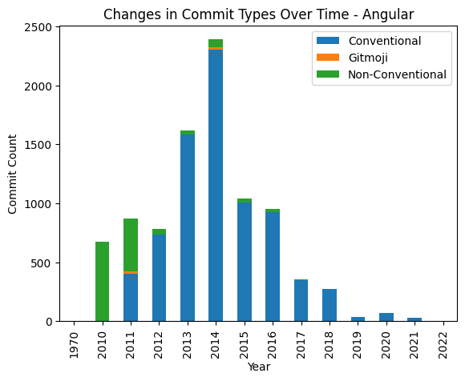

Angular demonstrates a strong adherence to conventional commits, which is expected given that Angular has been instrumental in establishing these standards.

It's evident that not all repositories align with conventional commit guidelines. As previously mentioned, many opt for custom conventions. This necessitated adaptations in our analysis tool to accommodate the unique conventions of Node.js.

A significant number of repositories prefer a "verb-start" approach for commit messages, initiating each entry with an action verb. This approach posed analytical challenges, which were overcome by employing Natural Language Processing techniques. Django serves as a notable case, eschewing conventional commits in favor of exclusively using "verb-start" commits:

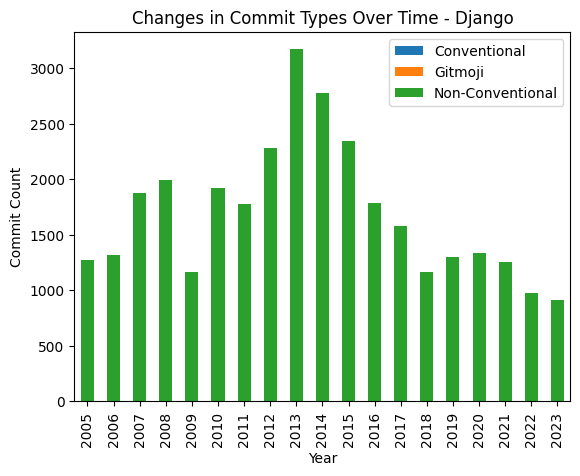

Regarding the use of gitmojis, few open-source projects consistently incorporate them. The notable exceptions were Gitmoji itself and FastAPI.

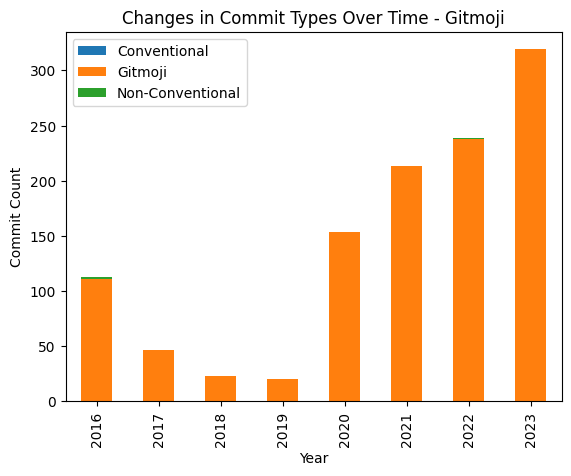

An interesting observation is the sporadic adoption and subsequent abandonment of gitmojis in projects, with CPython being a prime example of this trend.

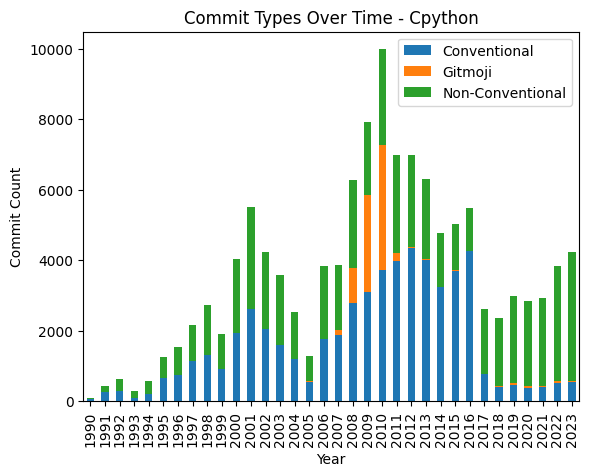

#### Conclusion

Our comprehensive analysis across various repositories indicates a predominant preference for bespoke commit conventions over standardized ones. These custom conventions often diverge significantly from established norms, underscoring the diversity in commit practices across the software development landscape.
In short: 
    * Companies would rather use their own commit structure rather than conventional commits
    * Even when adapted, Companies usually don’t stick to using community driven commits like conventional-commits or gitmoji and usually end up swapping them.
    * Gitmoji never used (except gitmoji repository or on a short period then canceled)
    * Use of automatic commits depending on the project (merge, pull requests, squash, etc.) which makes structuring of commits less necessary because they keep the discussion in the PR of the repo leaders

### 2. Top Contributors overview 

   * The top contributors are usually more diligent with their commit structure, making sure to adhere to the conventions. Analysis of the provided graphs shows:
        * For the TensorFlow project, the conventional commit rate among the top contributors varies, with some showing moderate adherence and others demonstrating a higher commitment to conventional commit guidelines. This variation suggests a balance between structured commit practices and individual discretion within the project's contribution process. 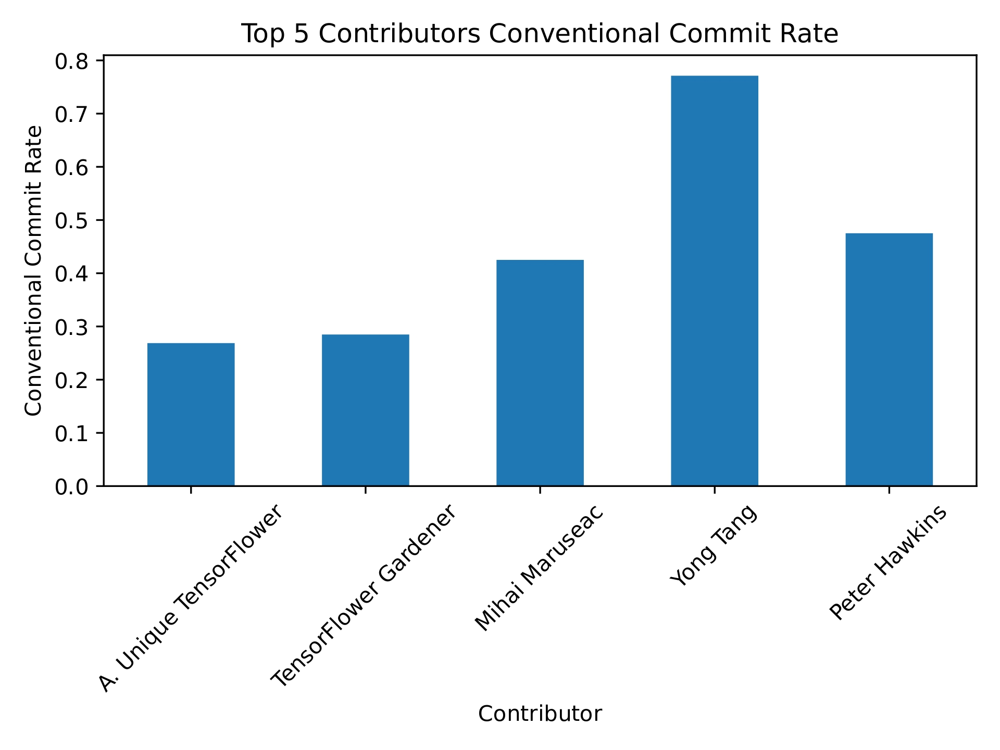
        * In the Pygwalker project, while top contributors generally maintain a good level of adherence to conventional commit guidelines, there is one contributor with a notably lower adherence rate. This suggests that while there is an inclination towards structured commit practices, the project allows for some flexibility or individual approaches to commit messaging. 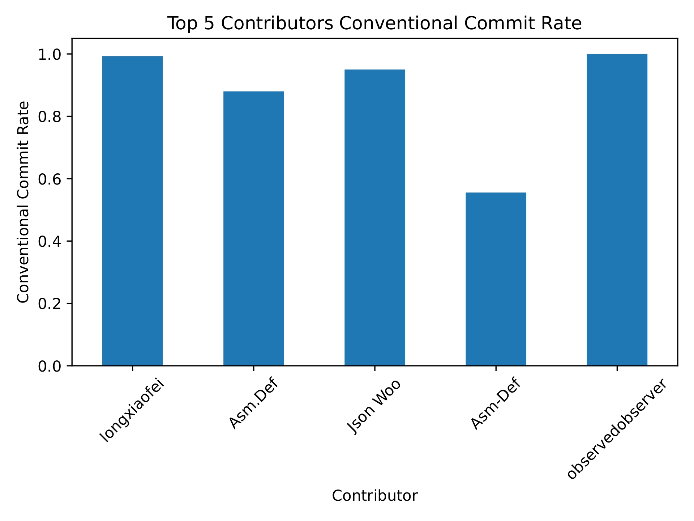
        * The Node.js project exhibits a significant diversity in adherence to conventional commit guidelines among its top contributors. While one contributor shows an exceptionally high commitment to structured commits, others have moderate to lower rates. This variation may reflect individual contributor preferences or differing sub-project requirements within the Node.js ecosystem. 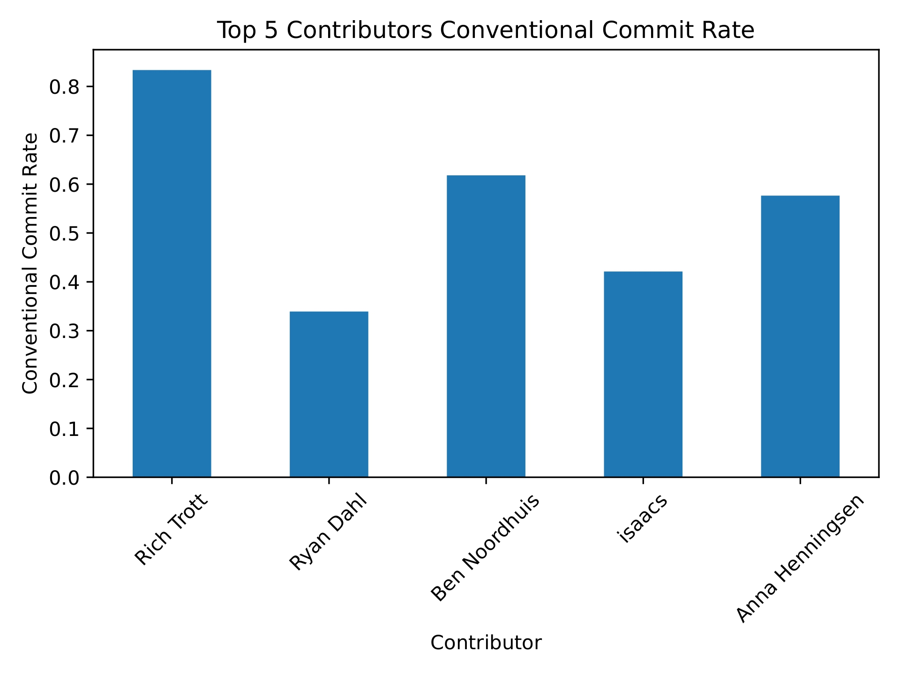
        * For the Hystrix project, the conventional commit rate among the top contributors is uniformly moderate, with none demonstrating a full adherence (a rate of 1.0) to conventional commits. This indicates a consistent but not rigorous approach to commit messaging that allows for some flexibility within the structured commit guidelines. 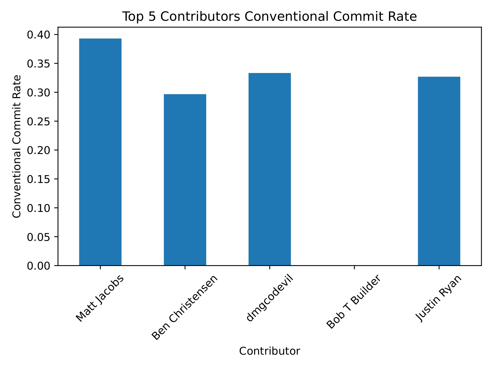
        * The Angular project demonstrates a strong commitment to conventional commit guidelines, as evidenced by the high conventional commit rates of the top contributors. This consistency suggests that the project likely enforces a strict policy regarding commit standards, which may contribute to the maintainability and clarity of the project's codebase. 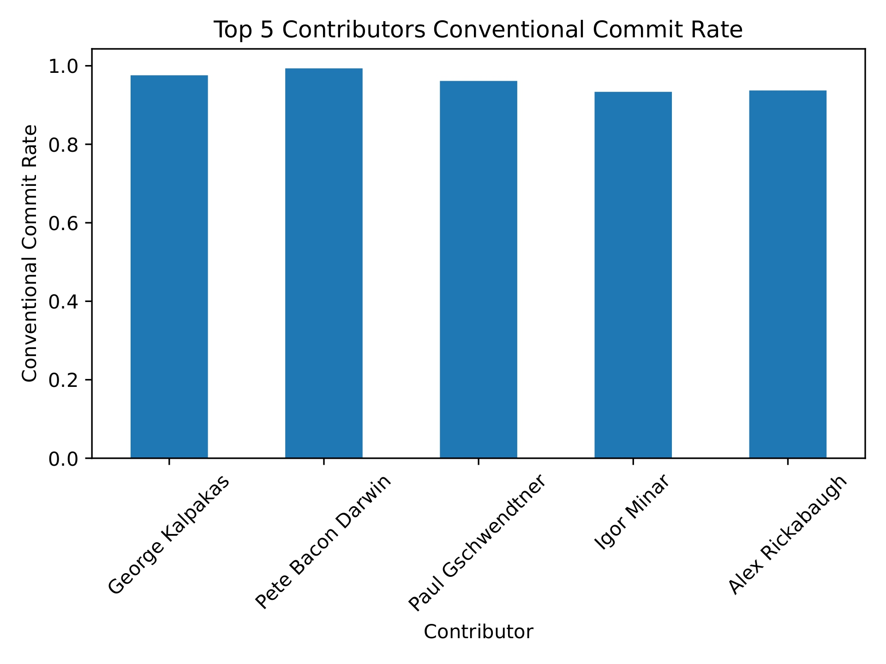

### 3. Comparing Apache and Meta

To answer our 4th hypothesis, we've decided to take the companies Apacha and Meta. Right off the bat, we can see that our hypothesis was incorrect, as we found that apache defined different conventions for each of its projects in the contributing.md file. So our outlook on this changed, We've decided to compare the attitudes and approach that each company had with their commits.

   * Our Apache graphs :

      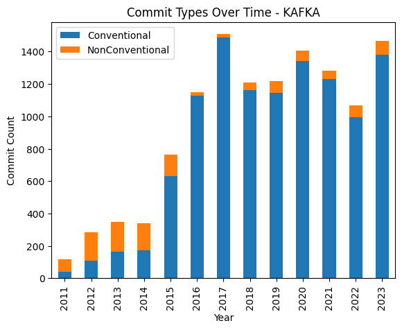
      

   * Our Meta graphs :

   
   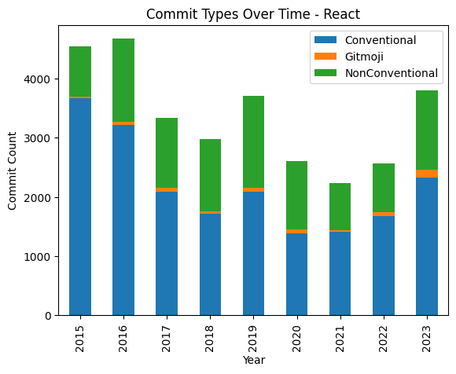

#### Conclusion
Apache is comparatively much stricter and much more explicit about their conventions. Apache has no “ultimate” convention, it defines a convention for each project and they’re strict for each convention per project. 
This doesn’t seem to be the case with Meta. Not only was meta's conventions unknown. Meta claimed to squash commits so users don't have to worry about commit structure, this implies that meta's commits are all automated and not human. However this does not seem to be the case from our studies. much more unconventional or “unprofessional” commits found in Meta’s commits which make it clear that it was human made. A prominent example is the following : 

Meta has been very difficult to study from the contradicting results, to the very secretive conventions in comparison to Apache's very straightforward approach to commits.
    * Companies with multiple projects (Meta & Apache) don’t use the same conventions for all their projects. It seems like each team personalizes their commits to each team’s requirements

### 4. Limitations

- **Sampling and Bias**: We acknowledge that our analysis might have limitations due to the samples we chose and potential biases in our selection process.

- **Tool Limitations**: Our tool wasn't perfect and required significant adjustments for each project. This is because each project follows its unique set of conventions, making a one-size-fits-all approach challenging.

- **Automated vs. Human-Made Commits**: Differentiating between automated and human-made commits posed a challenge, especially when project documentation was unclear or lacking. For example, Meta's documentation suggests that commits are squashed (implying automation), yet we noticed several commits that appeared to be made by humans.

### 5. Concluding Thoughts

- **Findings**: Our findings do not present a clear-cut conclusion; they vary significantly from one project to another and should be considered as anecdotal evidence rather than definitive statements.

- **Nuance in Development Practices**: The subject of commit conventions is complex, influenced by various factors such as project structure, team dynamics, developer priorities, and communication practices outside the team. These nuances are difficult to capture solely through commit analysis.

This study aimed to shed light on different commit practices but also highlights the intricate nature of software development workflows, underscoring the need for further, more nuanced research in this area.

## VI. Tools 

Our tool detects conventions by using regex for each convention message. This is simply because most commit conventions require having specific terms at the beginning of a commit.
Our tool also uses Natural Language Processing to detect some other convention patterns. In fact, many projects have explicitly stated that their convention is simply “have a verb at the beginning of the commit”, some have specified the verb to be in Present form, some have specified in past tense, but most have just specified that it just needs to be a verb. 
The way most conventions are tweaked is by modifying the subsystems within the regex as most projects use a variation of that same format.
While we have done our studies on multiple projects, we have kept only the most pertinent results in the notebook provided.

In summary, our tool employs a combination of regex and NLP techniques to detect commit message conventions. The regex is adept at capturing structured patterns, while NLP allows for the interpretation of conventions expressed in natural language. The tool's adaptability is further enhanced through the ability to modify subsystems within the regex, ensuring its applicability across a range of convention variations. The results presented in the notebook have been curated to emphasize the most pertinent insights derived from the broader study.

## VI. References

* Relevant studies on communication and quality of commit messages. :
    * Tian, Y., Zhang, Y., Stol, K. J., Jiang, L., & Liu, H. (2022, May). What makes a good commit message?. In Proceedings of the 44th International Conference on Software Engineering (pp. 2389-2401). (https://arxiv.org/pdf/2202.02974.pdf)
* Information about structured commits
    * Conventional commits : https:/www.conventionalcommits.org/en/v1.0.0/
    * Gitmoji : https://gitmoji.dev/
* List of open source github projects chosen for statistics (among those with the most commits/contributors)
    * Angular (https://github.com/angular/angular.js) 
    * Nodejs (https://github.com/nodejs/node)
    * fastapi (https://github.com/tiangolo/fastapi)
    * gitmoji (https://github.com/carloscuesta/gitmoji) 
    * React (https://github.com/facebook/react) 
    * flutter (https://github.com/flutter/flutter)
    * Linux (https://github.com/torvalds/linux) 
    * Rust (https://github.com/rust-lang/rust) 
    * Typescript (https://github.com/microsoft/TypeScript)
    * Django (https://github.com/django/django)
    * Nextjs (https://github.com/vercel/next.js) 
    * Cpython (https://github.com/python/cpython)
    * Prometheus (https://github.com/prometheus/prometheus) 
    * Pytorch (https://github.com/pytorch/pytorch) 
    * Git (https://github.com/git/git)

* List of small projects tested by hand to train the tool:
    * Request-promised (https://github.com/request/request-promise) -> 300 commits
    * Deployd (https://github.com/deployd/deployd) -> 1300 commits

{:height="12px"}
