**_Février 2024_**

## Authors

Ce chapitre a été écrit par 5 étudiants spécialisés en informatique en cinquième année à Polytech Nice-Sophia, spécialisés en Architecture Logicielle :

* Vincent BOILLOT DEVALLIERE &lt;vincent.boillot-devalliere@etu.unice.fr&gt;
* Emma DEAL &lt;emma.deal@etu.unice.fr&gt;
* Jules JEHANNO &lt;jules.jehanno@etu.unice.fr&gt;
* Claire MARINI &lt;claire.marini@etu.unice.fr&gt;
* Michael MC CARTHY &lt;michael.mc-carthy@etu.unice.fr&gt;

## I. Research context /Project

Les projets Open Source sont majoritairement organisés en utilisant Git. Ainsi, l’utilisation de « bons » messages de commit est un enjeu majeur pour maintenir un projet de manière efficace.
Notre étude se concentrera donc sur l’instauration et le maintien des commits structurés dans des répertoires Open Source. Le 
choix de ce sujet a été motivé par notre intérêt commun pour les commits structurés et leur utilité dans le 
monde de l’open source. En effet, même si leur rôle principal est d’offrir une meilleure compréhension des 
différentes modifications apportées à un projet Git, de nombreuses techniques d’automatisation sont 
construites autour de ces commits. Prenons l'exemple de Changelog, un outil permettant de générer un fichier 
changelog qui regroupe les détails des changements dans un ordre chronologique d’un répertoire Git en 
analysant ses commits structurés.

Pour mener à bien notre étude, nous devons dans un premier temps définir ce qu’est un « conventional commit » ou « commit structuré ». Pour nous, il se structure sous cette forme :

    action: description

Ainsi, un commit structuré est composé de trois parties : les actions (comme feat, fix, debug, refactor, etc.), qui 
appartiennent à une banque de mots-clés, chacun étant bien défini. Les « : » délimitent les actions de la 
description. Finalement, une description explique le but de ce commit.
Notre étude vise à étudier l'intention de réaliser des commits conventionnels plus que la syntaxe stricte en elle-même. Ainsi, nous allons tolérer les fautes de syntaxe, telles que des espaces avant les deux points ou l'usage 
de majuscules. De plus, nous avons essayé d'avoir une banque de mots d'action assez large, composée de :

    feat, fixdocs, style, refactor, perf, test, choreFix, Feat, Test, revert, Revert, Chore, add, docs/fix, bump, ci, build, wip, release, tests

## II. Scope du projet

### II.1. Sous-questions

La question principale à laquelle nous cherchons à répondre est la suivante :
"Les commits structurés (conventional commit, gitmojis, …) sont-ils utilisés dans les projets open-source (et comment sont-ils utilisés) ?"
Cette question est assez large et pour pouvoir mieux définir notre contexte de recherche, nous avons étudié quelques repositories de projets open-source.
Ce que nous avons pu constater en analysant des répertoires Open Source est que les commits structures ne sont pas respectés dans tous les projets et,
même lorsqu’ils le sont, ce n’est pas par tous les contributeurs.
Nous avons donc choisi de traiter ce sujet à travers 4 sous-questions qui sont les suivantes :
- Est-ce que les commits structures sont instaurés dans un projet de manière progressive ou instantanée ?
- Avec l’aide de quels acteurs, pratiques ?
- Est-ce qu’ils sont maintenus ?
- L’utilisation d’outils est-elle nécessaire à cette maintenance ?
Toutes ces questions permettent de mettre en relief l’utilisation des commits structurés lors de l’entièreté du cycle de vie d’un projet.
En y répondant, nous obtenons une compréhension profonde de la volonté de la communauté open-source sur les projets que nous avons sélectionnés.

### II.2 Ressources utilisées

Notre démarche a commencé par une lecture d'articles afin de nous renseigner sur le projet et de motiver nos sous-questions.
Nous avons utilisé les articles fournis, mais aussi d'autres articles trouvés grâce à nos recherches. La liste de ceux-ci est répertoriée dans la partie IV. Reference.
Nous avons également parcouru les sites et les documentations concernant les Conventional Commits ainsi que celles des outils associés.
Avant de commencer notre recherche, il nous a fallu définir un ensemble de projet à étudier. Dans un premier temps,
nous nous sommes concentré sur le projet FreeCodeCamp car il contenait beaucoup de données et nous permettait de bien suivre l'évolution des messages de commits au fil du temps.
Nous nous sommes donc basés sur l'étude de ce premier projet pour déterminer nos premières hypothèses de travail.
Nous avons ensuite parcouru un certain nombre de projets open-source afin d'en retenir 14, disponibles sur GitHub :

| Repository          | Nb commits | Nb contributeurs | Date départ               | Langage      | Type applicatif |
|---------------------|------------|------------------|---------------------------|--------------|-----------------|
| tinacms/tinacms     | 11.000     | 101              | Jul-19                    | TypeScript   | Outil           |
| puppeteer/puppeteer | 4.000      | 480              | Mar-17                    | TypeScript   | Bibliothèque    |
| freeCodeCamp        | 34.000     | 4800             | Dec-14                    | TypeScript   | Outil           |
| apache/echarts      | 9.000      | 200              | Apr-13                    | TypeScript   | Bibliothèque    |
| yargs/yargs         | 1.000      | 277              | Nov-13                    | JavaScript   | Bibliothèque    |
| facebook/docusaurus | 5.000      | 1.000            | Jun-17                    | TypeScript   | Outil           |
| nocodb/nocodb       | 20.000     | 175              | Oct-17                    | TypeScript   | Outil           |
| makeplane/plane     | 2.000      | 67               | Dec-22                    | TypeScript   | Outil           |
| apache/superset     | 14.000     | 1.000            | Jul-15                    | TypeScript   | Outil           |
| ApolloAuto/apollo   | 19.000     | 309              | Jul-17                    | TypeScript   | Outil           |
| ecomfe/zrender      | 2.000      | 48               | Apr-14                    | TypeScript   | Bibliothèque    |
| nrwl/nx             | 11.000     | 816              | Aug-17                    | TypeScript   | Outil           |
| electron/electron   | 27.000     | 1.200            | Apr-13                    | C++          | Framework       |
| denoland/deno       | 10.000     | 800              | May-18                    | Rust         | App             |

La sélection de ces 14 repository a été effectuée avec l'intention de capturer une grande diversité dans les projets étudiés, ce qui est crucial pour notre recherche.
Les repositories choisis présentent un éventail varié en termes de volume de contributions, avec un nombre de commits allant de 1 000 à 34 000.
Cette gamme nous permet d'explorer des dynamiques de développement différentes et de comprendre comment le volume de travail peut influencer la qualité et la nature des messages de commit.
De plus, le nombre de contributeurs varie considérablement d'un projet à l'autre, allant de 48 à 4 800.
Cette diversité de contributeurs est un élément clé de notre étude, car elle nous permet d'évaluer si et comment la taille de l'équipe impacte les pratiques de commit.

Les projets sélectionnés couvrent également une variété de types applicatifs, incluant des applications, des bibliothèques et des logiciels, et s'étendent sur plusieurs domaines, du dessin 2D à l'éducation.
Cette diversité garantit que notre étude embrasse un large spectre de contextes de développement, nous permettant ainsi de tester nos hypothèses dans des conditions aussi réalistes et variées que possible.

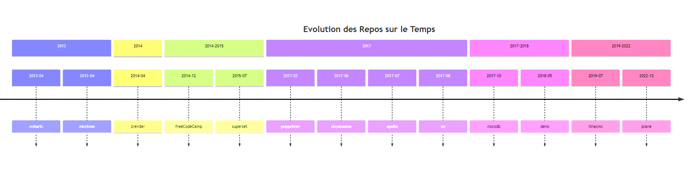

Notre sélection couvre également une large plage temporelle, ce qui est essentiel pour analyser l'évolution des pratiques de commit au fil du temps. Les dates de création de ces repositories s'étendent de 2013 à 2022.

Cette dispersion dans le temps est particulièrement pertinente étant donné que les avancées et les recommandations concernant les messages de commit structurés ont évolué au cours du temps.
En commençant à 2013, nous capturons les tendances et les pratiques qui se sont développées peu après que GitHub soit devenu un outil largement adopté dans la communauté des développeurs, particulièrement depuis 2011-2012.
Cette date de début est donc représentative de l'ère où GitHub a commencé à jouer un rôle majeur dans le développement de logiciels.

Cette diversité temporelle assure que notre échantillon est non seulement diversifié en termes de type de projet et de taille de communauté, mais aussi en termes d'évolution historique des pratiques de développement logiciel.
Cela nous aide à établir une perspective plus complète et nuancée sur les pratiques actuelles et passées de gestion de versions et de collaboration dans le développement de logiciels.

Cependant, malgré cet échantillon fourni, nos résultats se limiterons à ces derniers et ce que nous affirmerons ne 
pourra en aucun cas être étendu à l’ensemble des projets open-source.

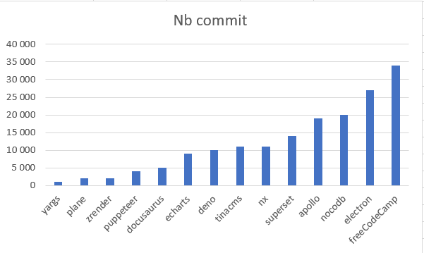  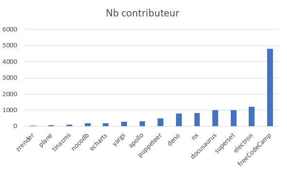
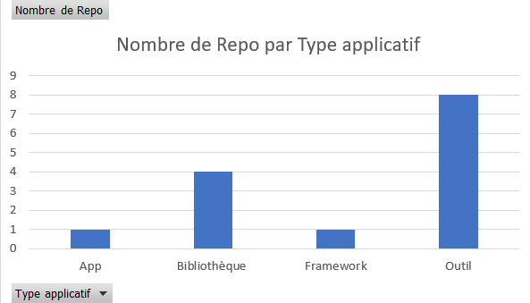

### II.3. Outils utilisés

Pour pouvoir analyser tous les projets sélectionnés de manière efficace, nous avons utilisé des outils pour automatiser nos recherches lorsque c'était possible.
Nous avons donc implémenté des scripts python ayant pour fonctionnalités de récupérer l’ensemble des commits d’un répertoire GitHub afin de les analyser.
Nous avons pu obtenir des statistiques à partir de ces informations. Un script permettant de les visualiser a également été implémenté,
dans le but de pouvoir lire plus facilement les résultats obtenus et de pouvoir mieux les transmettre.
Ces scripts sont disponibles dans le dossier assets de ce chapitre.

## III. Hypothèses & Expériences

Afin de répondre à l'ensemble des questions que nous nous sommes posées, nous avons réalisé des hypothèses pour chacune d'entre elles, que nous allons chercher à vérifier.
Premièrement, pour répondre à la question concernant l'instauration des Conventional Commits, nous avons fait l'hypothèse que ceux-ci étaient mis en place de manière progressive dans la majorité des répertoires Git les utilisant.
Cette hypothèse vient du fait qu'une grande partie des projets open-source possède un nombre de contributeurs assez important et qu'il est difficile d'imposer un processus à un tel nombre de personnes.
Pour tester cette affirmation, nous avons réalisé un graphique grâce aux scripts python, mettant en évidence le nombre de commits structurés par rapport au nombre total de commits sur toute la 
durée de vie du projet. Ce graphique a permis de mettre en évidence l'évolution de l'utilisation des Conventional Commits et d'identifier si leur instauration est généralement instantanée ou progressive.
Cette analyse est évidemment limitée par notre interprétation de « progressif » et « instantané », nous avons donc déterminé un seuil sur lequel baser nos résultats.

En ce qui concerne la question des acteurs de cette mise en place, nous supposons que celle-ci vient généralement de la demande d’une personne en particulier.
C'est-à-dire, nous avons fait l'hypothèse que les Conventionnal Commits ne sont utilisés dans un projet open-source qu'à partir du moment où l'une des contributeurs principaux du projet en fait la demande.
Afin de vérifier cette hypothèse, pour l'ensemble de notre dataset, nous allons tenter de déterminer l'origine de la transition vers des commits structurés.
Si, dans une majorité des répertoires, l’un des fondateurs du projet donne des instructions précises sur le format des messages de commit, nous pourrons la valider.
Cette étude a été faite à partir d'une analyse manuelle des repositories GitHub, à travers les discussions, les Pull Requests, etc.
Elle est cependant limitée par le fait que plusieurs facteurs peuvent être à l'origine de l'instauration des Conventionnal Commits. Nous cherchons donc principalement à savoir s'il y a souvent un acteur en particulier qui intervient dans cette mise en place.

En ce qui concerner le maintient des commits structurés au sein d'un projet, nous avons d'abord posé l’hypothèse qu'une fois ceux-ci mis en place dans un projet open-source, ils sont maintenus tout au long de ce dernier.
Cette hypothèse nous vient du fait que l'instauration des commits structurés dans un projet est souvent une décision motivée par les avantages qu'ils peuvent apporter. Ainsi, il est plutôt bénéfique de les maintenir une fois l'instauration réussie.
Pour pouvoir vérifier cela, nous avons utilisé le même graphique que celui de la première hypothèse, avec une analyse différente.
De la même manière que pour la première hypothèse, nous nous sommes basés sur un seuil pour définir si l'utilisation des Conventional Commits est conservée ou non.
Suite à cette hypothèse, nous avons supposé que pour que le maintien se fasse, la plupart des projets utilisent des outils externes, qui forcent la main aux développeurs pour qu'ils les respectent.
Pour vérifier cette hypothèse, nous avons parcouru les répertoires des projets étudiés afin de repérer la présence d'un ou plusieurs outils, et de leur date d'intégration a un impact dans l'evolution du maintien des commits structurés.

Nous avons conscience que l'ensemble de notre recherche est limitée aux données auxquels nous avons accès, et que le comportement humain est aussi à prendre en compte.
En effet, la discipline et la manière de se comporter dans un projet conséquent ont un impact sur la manière de contribuer et de collaborer au sein d'un projet open-source. Ici, nous ne pouvons pas prendre en compte ces aspects dans le cadre de notre recherche.
Ainsi, les résultats ici représentent ce qu'il est possible d'observer en tant que développeur.

## IV. Result Analysis and Conclusion
### IV.1. Première hypothèse

Nous avons choisi de montrer ci-dessous les résultats pour 5 des 15 répertoires Git de départ, car ils montrent chacun une mise en place des Conventional Commits différente au sein du projet, et que les autres répertoires sont semblables à au moins un des 5 choisis. 
Chaque graphique offre un aperçu unique des pratiques de chaque projet et leur progression vers une utilisation accrue des commits structurés. Plus précisément, ceux-ci montrent la répartition des Conventional Commits et des Non-Conventionals commits depuis la création du projet jusqu’à aujourd'hui.

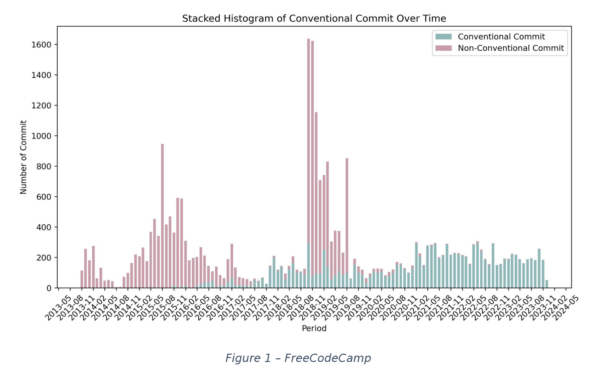 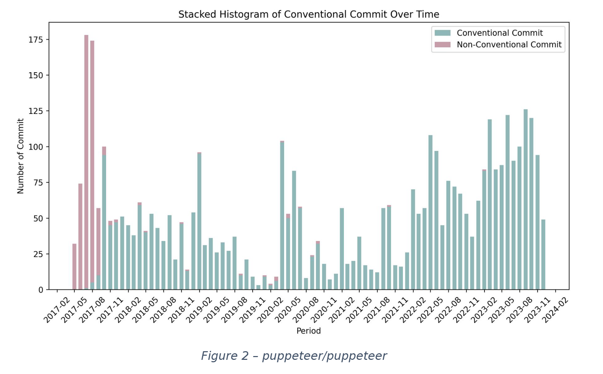
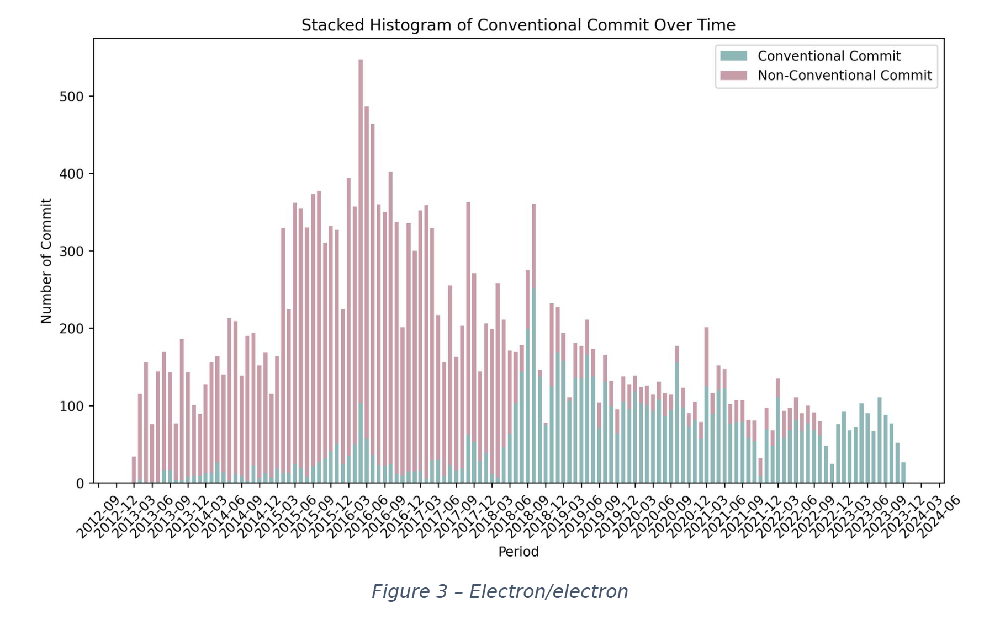 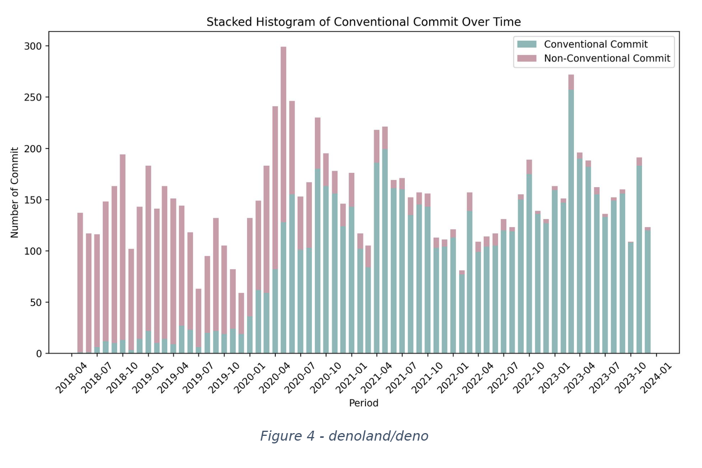 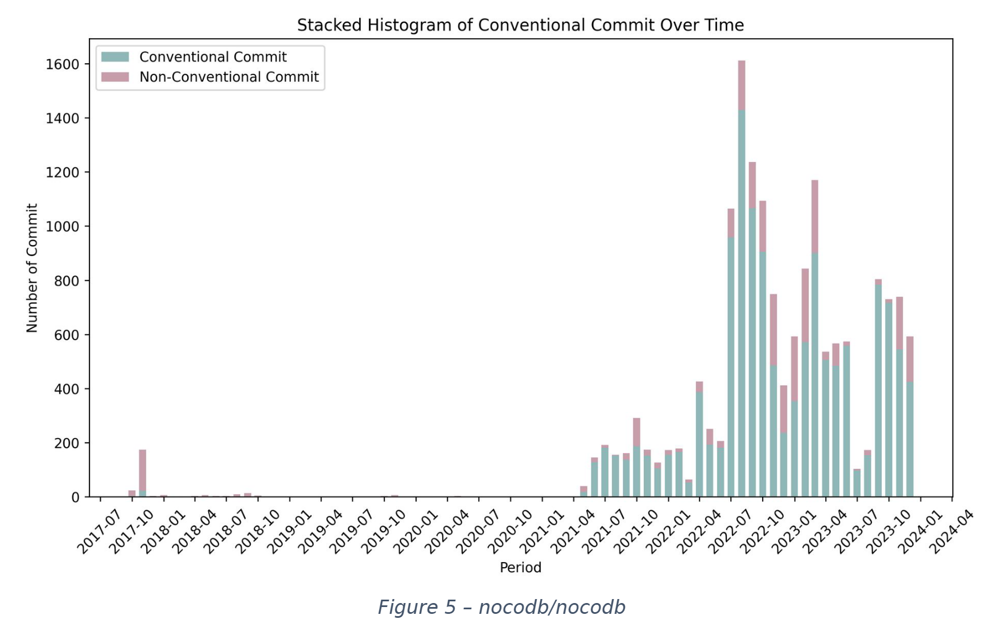

Notre analyse est limitée par notre interprétation de « progressif » et « instantané », mais nous partons du principe que si la courbe ne montre pas un pic remarquable, de plus de 50% d’utilisation de Conventional Commits dans une période de 3 mois et qu’elle est plutôt stable, alors l’instauration sera considérée comme progressive.

| Repository          | Instauration | Observation                                                                                                                                                |
|---------------------|--------------|------------------------------------------------------------------------------------------------------------------------------------------------------------|
| tinacms/tinacms     | soudaine     | Montre des signes d'adoption progressive, mais avec des périodes d'irrégularité, reflétant une intégration hétérogène des bonnes pratiques.                |
| puppeteer/puppeteer | soudaine     | Adoption soudaine et croissante des commits structurés, indiquant une amélioration effective dans la gestion des commits.                                  |
| freeCodeCamp        | progressive  | Exemple de progression constante et disciplinée vers des commits structurés, soulignant une politique de contribution efficace.                            |
| apache/echarts      | progressive  | Une adoption soutenue des commits structurés, reflétant un fort engagement envers les normes de qualité.                                                   |
| yargs/yargs         | soudaine     | Progression positive globalement rapidement, montrant des efforts d'adoption qui pourraient être influencés par des changements internes.                  |
| facebook/docusaurus | soudaine     | Tendance positive très rapidement, possiblement liées à l'évolution des pratiques au sein du projet.                                                       |
| nocodb/nocodb       | soudaine     | Utilisation des commits structurés de manière forte et stable dès la grosse période d’activité du projet.                                                  |
| makeplane/plane     | soudaine     | Adoption des commits structurés dès le début avec des variations, indiquant une évolution non linéaire.                                                    |
| apache/superset     | progressive  | Montre une adoption croissante et régulière, soulignant une culture de développement mature.                                                               |
| apolloAuto/apollo   | progressive  | Progression notable vers l'adoption des commits structurés, mais avec une certaine irrégularité.                                                           |
| ecomfe/zrender      | progressive  | Adoption progressive avec des périodes de stagnation, suggérant des défis dans l'implémentation constante des bonnes pratiques.                            |
| nrwl/nx             | soudaine     | Adoption soudaine et assez stable des commits structurés, indiquant une politique de contribution cohérente                                                |
| electron/electron   | progressive  | Tendance à l'amélioration mais avec des périodes de fluctuation, reflétant des adaptations aux besoins du projet.                                          |
| denoland/deno       | progressive  | Montre une progression constante et soutenue vers l'utilisation de commits structurés, reflétant un engagement envers des pratiques de codage disciplinées |

L’analyse globale confirme partiellement l'hypothèse que l'adoption des commits structurés se fait de manière progressive dans les projets. Effectivement, nous pouvons identifier que seulement la moitié des répertoires adoptent les Conventionals Commits de manière progressive.
Certains répertoires, tels que "freeCodeCamp" et "apache/echarts", montrent une adoption claire et constante de cette pratique. Cependant, d'autres projets comme « facebook/docusaurus » et « makeplane/plane » présentent une progression soudaine et stable.
En s'appuyant sur le tableau de données des différents projets donné dans la première partie, on remarque un lien étroit entre la date de début de projet et l'adoption des Conventionnal Commits.
En effet, les projets connaissant une instauration progressive sont principalement des projets ayant commencé tôt (2013-2015), c'est-à-dire avant le développement des Conventionnal Commits.
Les projets plus récents sont arrivés alors que les Conventionnal Commits existaient déjà et étaient déja utilisés et ont donc su s'adapter rapidement.
Il est également important de noter que l'adoption des commits structurés n'est pas seulement une question de politique ou de pratique, mais aussi de mentalité. La sensibilisation à l'importance de la clarté et de la traçabilité dans la gestion des modifications est cruciale.
Des projets comme "nocodb/nocodb" et "nrwl/nx" illustrent comment une adoption progressive peut être influencée par la sensibilisation et l'éducation autour des bonnes pratiques.
En conclusion, bien que l'hypothèse d'une instauration progressive des commits structurés soit ne soit que partiellement confirmée, nous retenons de cette analyse que la mise en place de ce processus peut être influencé par une multitude de facteurs.

### IV.2. Deuxième hypothèse

Avant de commencer à vérifier si les acteurs principaux sont à l’origine de la mise en place des Conventional Commits, il est important de savoir identifier ce qui
constitue un acteur principal. Cette identification peut être compliquée du fait que plusieurs facteurs doivent être pris en compte, tel que :
- Le nombre de commits ;
- Le nombre de commentaires sur la totalité du repo ; 
- Sa constance d’activité tout au long de l’existence du projet.
 
De plus, nous devons aussi exclure les « bots », des acteurs non-humains. C’est sur ces facteurs que nous allons nous concentrer pour pouvoir identifier les acteurs principaux d’un repo.
Ainsi, les graphiques ci-dessous montre chacun des trois facteurs séparément sur un projet donné, avec chacune de ces données liées aux meilleurs acteurs dans cette catégorie.

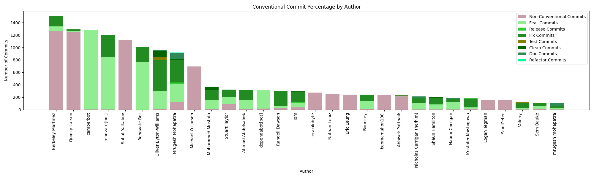
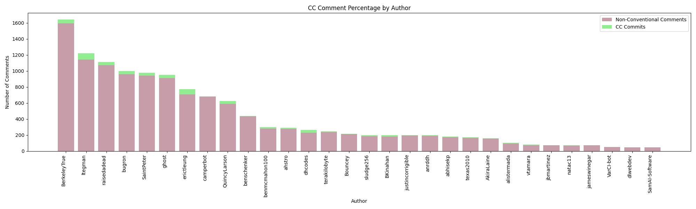
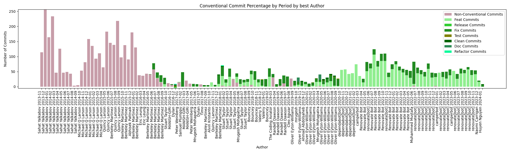

Ces graphes peuvent tous être obtenus via notre script, mais pour éviter de polluer le contenu par une quantité astronomique de graphes, voici un tableau résumant les analyses pour chaque repo :

| Repository          | Acteur principal (nb de commits)                        | Acteur principal (nb de commentaires) | Acteur principal (constante activité)                    |
|---------------------|---------------------------------------------------------|---------------------------------------|----------------------------------------------------------|
| tinacms/tinacms     | Nolan Phillips, Jeff See, Logan Anderson                | Nnphillips, Logan-anderson, Jeffsee55 | Nolan Phillips, Jeff See, Logan Anderson                 |
| puppeteer/puppeteer | Andrey Lushnikov, Alex Rudenko, jrandol                 | Aslushnikov, OrKoN, JoelEinbinder     | Andrey Lushnikov, Alex Rudenko, Jack Franklin            |
| freeCodeCamp        | Berkeley Martinez, Quincy Larson, Mrugesh Mohapatra     | BerkeleyTrue, Itegman, raisedadead    | Berkeley Martinez, Oliver Eyton-Williams, Sahat Yalkabov |
| apache/echarts      | Lang, Pissang, Kener                                    | Pissang, Ovilia, Kener                | Kener, Pissang, sushuang                                 |
| yargs/yargs         | Benjamin Coe, Benjamin E. Coe, James Hallidya           | Bcoe, Nexdrew, mieguen                | Benjamin E. Coe, James Halliday, Alex Ford               |
| facebook/docusaurus | Sébastien Lorber, Alexey Pyltsyn, Joshua Chen           | Slorber, Josh-Cena, Lex111            | Sébastien Lorber, Alexey Pyltsyn, Joshua Chen            |
| nocodb/nocodb       | Wing-Kam Wong, Pranav C, Raju Udava                     | Wingkwong, O1lab, dstala              | Wing-Kam Wong, Pranav C, Muhammed Mustafa                |
| makeplane/plane     | Aaryan Khandelwal, Pablohashescobar, Anmol Singh Bhatia | Pablohashesc, obar, Vihar, Aaryan610  | Aaryan Khandelwal, Pablohashescobar, Anmol Singh Bhatia  |
| apache/superset     | Maxime Beauchemin, Krist Wongsubhasawat, Ville Brofeld  | Mistercrunch, Codecov.io, coveralls   | Maxime Beauchemin, Ville Brofeld, Michael S.Molina       |
| ApolloAuto/apollo   | Storypku, Kechxu, Dong Li                               | Daohu527, Storypku, xiaoxq            | Zhang Liangliang, Storypku, lanyongshun                  |
| ecomfe/zrender      | Pissang, Lang, Ovilia                                   | Pissang, Ovilia, plainheart           | Lang, Ovilia, Pissang                                    |
| nrwl/nx             | Jason Jean, Victor Savkin, Jack Hsu                     | FrozenPandaz, Vsavkin, AgentEnder     | Jason Jean, Victor Savkin, Benjamin Cabanes              |
| electron/electron   | Cheng Zhao, Kevin Sawick, Shelley Vohr                  | Zcbenz, Kevinsawicki, anaisbetts      | Cheng Zhao, Kevin Sawick, Shelley Vohr                   |
| denoland/deno       | Bartek Iwanczuk, Ryan Dahl, David Scherre               | Bartiomieju, ry, kitsonk              | Ryan Dahi, Bartek Iwanczuk, David Scherret               |

Ainsi, grâce à cette analyse, nous avons pu confirmer que ces 3 facteurs permettent d’identifier les acteurs principaux d’un repository GitHub, notamment entre l’activité constante de l’utilisateur et son nombre de commits au total depuis le début.
Le dernier facteur, bien que moins évident, paraît aussi valable, avec quelques repositories dont les acteurs principaux concernés ressemblent fortement aux autres facteurs (par exemple pour Tinacms/tinacms, Logan Anderson dans les commits,
Logan-anderson dans les commentaires).

Maintenant que nous avons identifié les acteurs principaux, il est temps de vérifier si l’instauration des Conventional Commits dans un repository est effectué par un acteur principal ou non.
De plus, nous pouvons aussi vérifier la part de Conventional Commits avant et après son instauration, afin de confirmer si c’est l’instauration imposée par cet auteur qui a provoqué l’utilisation des Conventional Commits.
En analysant l’auteur du fichier CONTRIBUTING.md, contenu dans tous les repository dans notre liste et dont nous admettons que ce fichier correspond à la mise en place des Conventional Commits, nous obtenons ce graphe :

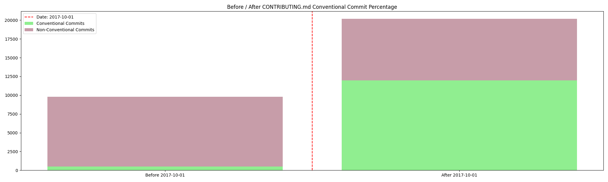

Voici un résumé de tous les repositories sous forme de tableau :

| Repository          | Date CONTRIBUTING.md + Acteur  | Avant CONTRIBUTING.md (non-CC % / CC %) | Avant CONTRIBUTING.md (non-CC % / CC %) |
|---------------------|--------------------------------|-----------------------------------------|-----------------------------------------|
| tinacms/tinacms     | 19/09/2019 - ncphillips        | 94.8% / 5.2%                            | 55.6% / 44.4%                           |
| puppeteer/puppeteer | 01/11/2017 - aslushnikov       | 82.1% / 17.9%                           | 0.7% / 99.3%                            |
| freeCodeCamp        | 08/10/2017 - prateekgoel       | 94.9% / 5.1%                            | 40.5% / 59.5%                           |
| apache/echarts      | 30/08/2019 - Ovilia            | 94.7% / 5.3%                            | 25.9% / 74.1%                           |
| yargs/yargs         | 11/01/2016 - Benjamin coe      | 99.6% / 0.4%                            | 19.8% / 80.2%                           |
| facebook/docusaurus | 22/09/2018 - endiliey          | 88.4% / 11.6%                           | 7.4% / 92.6%                            |
| nocodb/nocodb       | 23/01/2022 - wingkwong         | 29.9% / 70.1%                           | 17% / 83%                               |
| makeplane/plane     | 10/01/2023 - vamsi             | 20% / 80%                               | 10.7% / 89.3%                          |
| apache/superset     | 23/10/2023 - robdiciuccio      | 42.3% / 57.7%                           | 0% / 100%                               |
| ApolloAuto/apollo   | 04/07/2017 - startcode         | 0% / 0%                                 | 98.6% / 1.4%                            |
| ecomfe/zrender      | 15/02/2019 - Ovilia and 100pah | 95.5% / 4.5%                            | 34% / 66%                               |
| nrwl/nx             | 04/10/2017 - vsavkin           | 36.5% / 63.5%                           | 7.7% / 92.3%                            |
| electron/electron   | 19/05/2015 - JessicaLord       | 93.6% / 6.4%                            | 62.1% / 37.9%                           |
| denoland/deno       | 14/10/2018 - kitsonk and ry    | 95.6% / 5.4%                            | 30.6% / 69.4%                           |

Ainsi, avec ces résultats, on peut conclure que le CONTRIBUTING.md a effectivement un effet sur la convention des commits que les développeurs suivent. En effet, pour tous les projets, tous ont vu leur part de Conventional Commits nettement augmenté avec l’instauration du CONTRIBUTING.md.
De plus, en comparant l’acteur ayant instauré le CONTRIBUTING.md et les acteurs principaux identifiés dans la partie I, on remarque que pour environ 60% des projets choisis, le même acteur est présent dans les deux analyses
(certains d’entre eux ne sont pas exactement les mêmes, mais ont de très fortes ressemblances dans le nom, comme s’ils utilisaient un deuxième compte).

Une autre vérification que l’on pourrait faire serait de regarder l’évolution des Conventional Commits en tant que sujet de conversation, si ce dernier a été discuté dans le repository à propos de son instauration ou même si, après son instauration, ce sujet de conversation persiste pour aider les nouveaux venants ou pour préciser des règles non-suivis.
Par ailleurs, nous pouvons aussi identifier les acteurs principaux ayant parlé le plus souvent des Conventional Commits

Ainsi, en suivant cette base, nous pouvons obtenir deux graphes d’évolution ci-dessous :

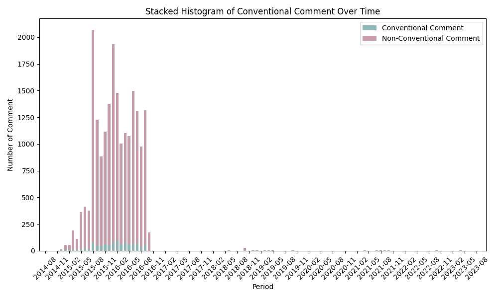
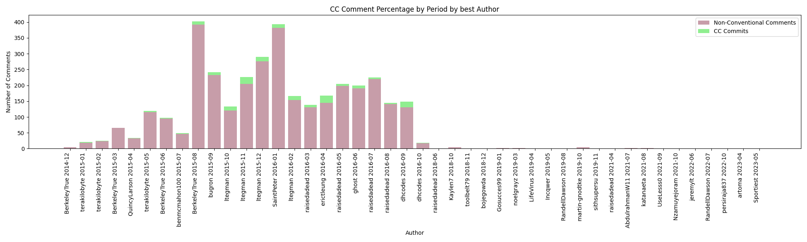

Un résumé de tous les repository sous forme de tableau :

| Repository          | Acteur princial (total CC commentaires) | Evolution part CC dans les commentaires        | 
|---------------------|-----------------------------------------|------------------------------------------------|
| tinacms/tinacms     | Logan-anderson, Ncphillips, dwalkr      | Croissance en 2019, stable depuis              | 
| puppeteer/puppeteer | OrKoN, Alushnikov, jschfflr             | Croissance en 2017, légère décroissance depuis |
| freeCodeCamp        | Raisedadead, Itegman, BerkeleyTrue      | Croissant, puis arrêt net en 2016-08           | 
| apache/echarts      | Pissang, Ovilia, kener                  | Croissant, puis arrêt net en 2020-05           |
| yargs/yargs         | Bcoe, Shadowspawn, nexdrew              | Croissance en 2014, stable depuis              |
| facebook/docusaurus | Slorber, Josh-Cena, JoelMarcey          | Croissant, puis arrêt net en 2022-06           | 
| nocodb/nocodb       | Wingkwong, Dstala, O1lab                | Croissance en 2021, stable depuis              | 
| makeplane/plane     | Que des bots                            | Croissance en 2023, légère décroissance depuis |
| apache/superset     | Mistercrunch, Codecov.io                | Croissant, puis arrêt net en 2020-02           |
| ApolloAuto/apollo   | Daohu257, Storypku, xiaoxq              | Croissant, puis décroissance en 2020-06        |
| ecomfe/zrender      | Pissang, ovilia, kener                  | Croissance en 2017, stable depuis              | 
| nrwl/nx             | Vsavkin, FrozenPandaz, jeffbcross       | Croissance depuis 2021                         | 
| electron/electron   | Zcbenz, Kevinsawicki, alexeykuzmin      | Croissant, puis arrêt net en 2016-11           | 
| denoland/deno       | Ry, Brtlomieju, dsherret                | Croissant, puis décroissance en 2021-06        | 

Ainsi, avec ces résultats, on peut observer et confirmer deux choses : 
- Dans la majorité des projets, l’acteur ayant instauré le CONTRIBUTING.md est bien actif dans les discussions du repository, et notamment sur les Conventional Commits
- La plupart des discussions dans les repositories s’intensifient juste avant l’instauration du CONTRIBUTING.md, puis se calme de façon brute ou non juste après

En conclusion, on peut confirmer que les acteurs principaux humains sont à l’origine de la mise en place des Conventional Commits dans les différents repositories choisi.
Ces acteurs sont souvent soit des développeurs actifs dans le développement de l’outil, avec une présence constante et importante dans les commits, soit des développeurs actifs dans la discussion sur l’instauration des Conventional Commits via un CONTRIBUTING.md, voire participe à son instauration.

### IV.3. Troisième hypothèse

Notre troisième hypothèse suppose que lorsque les Conventional Commits sont instaurés dans un projet open-source, ils sont généralement maintenus.
Cette hypothèse est basée sur le fait qu'ils sont instaurés pour répondre à certains besoins et améliorer la gestion du projet et qu'ils ont tout intérêt à les maintenir.
Pour vérifier celle-ci, nous pouvons utiliser les données que nous avons récupérées sur les repositories GitHub et qui nous ont permis de vérifier notre première hypothèse.
En observant les histogrammes, on constate que dans 13 projets sur 14 maintiennent l'utilisation des Conventional Commits. Pour arriver à cette conclusion, on a déterminé un seuil qui nous permet de définir le principe de maintenance.
On considère ici que si un repository arrive à garder un pourcentage supérieur à 80% par rapport à son nombre total de commits, les Conventional Commits sont maintenus.

Suite à ces résultats, nous avons cherché à comprendre ce qui peut être à l'origine de l'abandon de cet outil dans le cas du projet tinacms. En observant les graphiques, on remarque que l'utilisation des Conventionnal Commits au sein de ce projet a cessé vers le mois de juin 2021.
Il se trouve que ce mois-ci, l'équipe de TinaCms a annoncé le lancement de Tina Cloud en version alpha publique, Tina Cloud étant une extension du projet open-source TinaCMS.
Le lancement de Tina Cloud en version alpha pourrait avoir été un moment critique avec des délais serrés, ce qui pourrait avoir conduit l'équipe à se concentrer davantage sur le développement rapide de fonctionnalités plutôt que sur la conformité stricte aux conventions de commit.

<ins> Changements majeurs dans l'architecture : </ins>

- Les changements majeurs dans l'architecture du projet peuvent souvent conduire à des commits plus complexes, touchant à plusieurs aspects du système simultanément.
- Dans de tels cas, la rigidité des Conventional Commits peut sembler moins adaptée, car elle exige une granularité spécifique dans la description des changements.

<ins> Évolution du processus de développement : </ins>

- L'équipe peut avoir réévalué son processus de développement en fonction des retours d'expérience avec Tina Cloud, ce qui pourrait avoir conduit à des ajustements dans la façon dont les commits sont structurés et documentés.

Pour conclure, à l'exception d'un projet de notre étude, nous pouvons valider l'hypothèse selon laquelle lorsque l'utilisation des Conventional Commit est mise en place au sein d'un projet, elle le reste au fur et à mesure de celui-ci.

### IV.3. Quatrième hypothèse

Les résultats obtenus dans la partie précédente nous amènent à nous questionner sur la manière dont ces Conventional Commits sont maintenus au sein des différents projets.
Nous avons donc fait l'hypothèse que les projets utilisent des outils qui permettent d'imposer les Conventional Commits ou au moins de vérifier qu'un message de commit est valide avant de le valider sur GitHub.
Pour vérifier cette hypothèse, nous avons réalisé des recherches à la main sur les différents repositories, en étudiant à la fois les commits, les Pull Requests, mais aussi les discussions sur GitHub.
Nous en avons déduit plusieurs outils qui peuvent être utilisés dans ce but : la présence d'un fichier de contribution à destination des contributeurs du projet et qui impose l'utilisation des Conventional Commits, et des outils tels que commitizen ou CommitLint. Ces deux outils sont les principaux outils existants, qui permettent de contrôler les messages de commit d'un projet sur GitHub.
À partir de ce point, nous avons fait une étude sur l'utilisation de ces outils en particulier, dans les repositories étudiés. Nous avons reporté les résultats dans le tableau suivant.

| Repository          | Contributing file | CommitLint | Commitizen |
|---------------------|-------------------|------------|------------|
| puppeteer/puppeteer | Yes               | 2020       | No         |
| freeCodeCamp        | Yes               | No         | 2017       |
| apache/echarts      | Yes               | No         | No         |
| yargs/yargs         | Readme            | No         | No         |
| facebook/docusaurus | Yes               | No         | No         |
| nocodb/nocodb       | Yes               | No         | No         |
| makeplane/plane     | No                | No         | No         |
| apache/superset     | Yes               | 2019       | 2019       |
| apolloAuto/apollo   | No                | No         | No         |
| ecomfe/zrender      | No                | No         | No         |
| nrwl/nx             | Yes               | 2018       | 2018       |
| electron/electron   | Yes               | No         | No         |
| denoland/deno       | Yes               | No         | No         |

Nous observons une tendance commune à la majorité des projets à utiliser un fichier de contribution, généralement un fichier contributing.md, ou un ReadMe sinon.
L'utilisation de ce type de documentation est une méthode courante dans les projets avec de nombreux contributeurs comme les projets open-source. Ce fichier permet aux contributeurs d'avoir une idée des contributions nécessaires et du processus, et donne les directives de collaboration.
Ici, parmi les 13 repositories étudiés, 10 utilisent un fichier de contribution dans lequel il est spécifié que les commits doivent suivre la convention.
On observe un point commun entre les trois projets ne précisant pas le format des messages de commit dans leur fichier de contribution, qui est leur nombre de contributeurs.
En effet, ces projets ont un nombre de contributeurs peu élevé qui peut expliquer le fait qu'il soit plus facile de mettre en place un processus sans employer obligatoirement de moyens pour le faire.

En ce qui concerne les technologies utilisées, le résultat est beaucoup plus partagé. En effet, seulement 1/3 environ des projets étudiés utilisent des outils pour contrôler l'utilisation des Conventional Commit par les contributeurs.
Parmi ces quatre projets, la moitié utilisent plusieurs outils en parallèle, ici Commitizen et CommitLint.
Malgré nos recherches, nous n'avons pas trouvé d'élément permettant d'expliquer pourquoi certains projets utilisent ces outils contrairement à d'autres.
Nous n'avons pas trouvé de similitudes permettant d'associer cette méthode à une caractéristique des projets.
Nous posons donc l'hypothèse que cela est un choix des contributeurs principaux qui souhaitent ou non faire respecter l'utilisation des Conventional commits de manière plus stricts, mais aussi que ce choix peut dépendre de la communauté qu'il existe autour du projet.
En effet, nous prenons en compte le fait que l'utilisation d'un processus comme celui-ci dépend du bon vouloir des contributeurs et de leur discipline.
Cependant, il s'agit d'un aspect que nous ne sommes pas en mesure d'évaluer, car il ne s'agit pas d'un aspect technique et visible à travers les différents outils qui nous sont disponibles.

## VI. References

Li, J., & Ahmed, I. (2023, May). Commit message matters: Investigating impact and evolution of commit message quality. In 2023 IEEE/ACM 45th International Conference on Software Engineering (ICSE) (pp. 806-817). IEEE. (lien) 

Tian, Y., Zhang, Y., Stol, K. J., Jiang, L., & Liu, H. (2022, May). What makes a good commit message?. In Proceedings of the 44th International Conference on Software Engineering (pp. 2389-2401) (lien)

Lu, C. (2019). But do Commit Messages Matter? An Empirical Association Analysis with Technical Debt. In N. Saarimäki, V. Lenarduzzi, & D. Taibi (Eds.), Joint Proceedings of the Summer School on Software Maintenance and Evolution (pp. 45-53). (lien)
