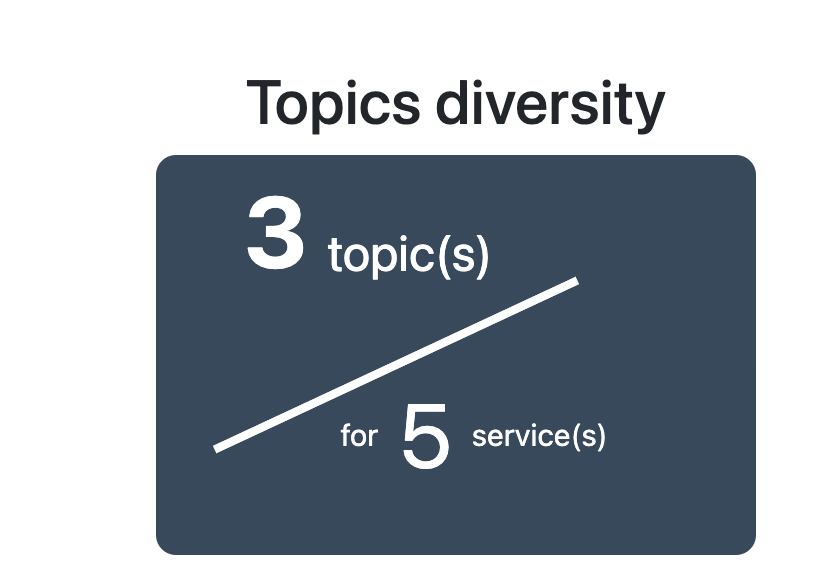
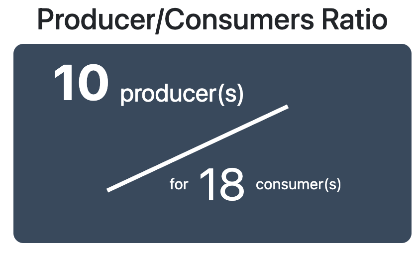
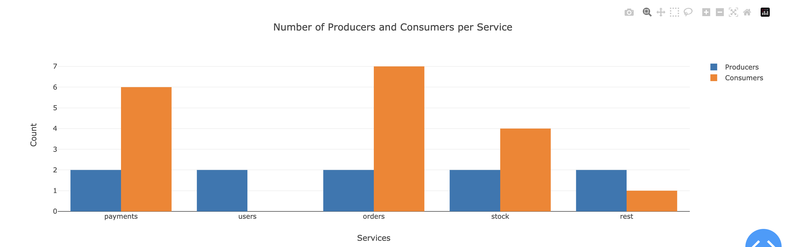
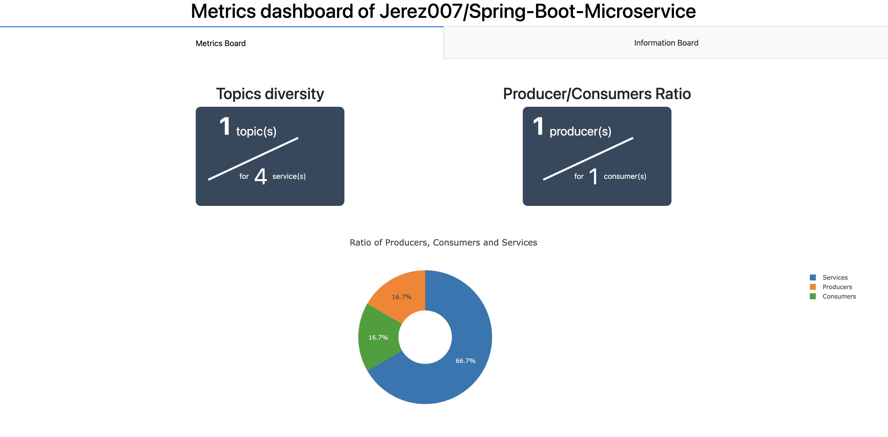
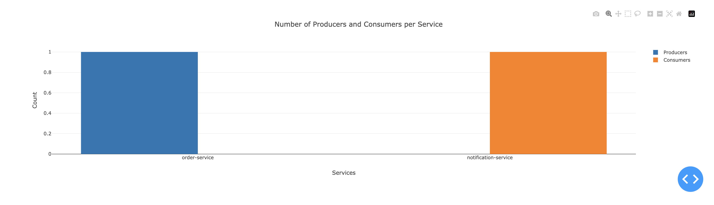
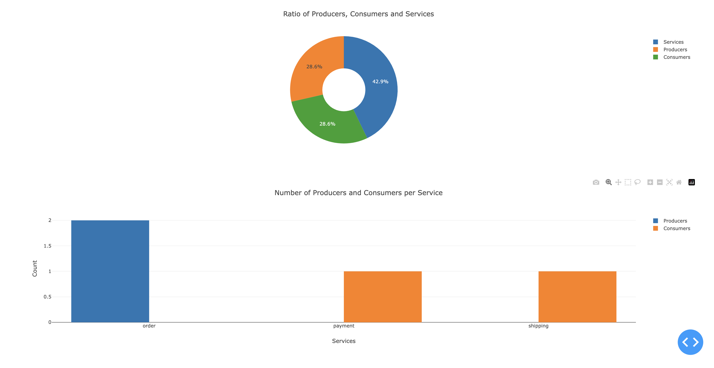
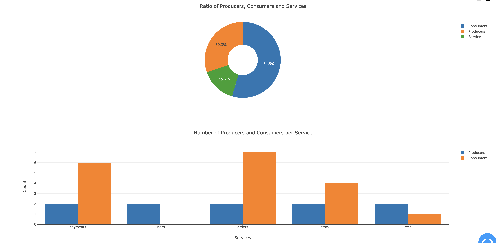

**_Février 2024_**

## Authors

Nous sommes quatre étudiants ingénieurs en dernière année à Polytech Nice Sophia, spécialisés en architecture logicielle.

* Thomas GUIOT &lt;thomas.guiot@etu.unice.fr&gt;
* Antony MARTIN &lt;antony.martin@etu.unice.fr&gt;
* Christophe RUIZ &lt;christophe.ruiz@etu.unice.fr&gt;
* Corentin RUIZ &lt;corentin.ruiz@etu.unice.fr&gt;
* Cyril VROUSOS &lt;cyril.vrousos@etu.unice.fr&gt;
## I. Contexte de recherche / Projet

Les architectures microservices ont récemment émergé comme une approche dans le domaine du développement logiciel, offrant une alternative décentralisée aux architectures monolithiques. Cette transition vers les microservices est motivée par le désir d'accroître la modularité, la flexibilité et la scalabilité des applications. Les projets open source embrassent de plus en plus ces architectures distribuées, reconnaissant leur potentiel à répondre aux exigences croissantes de systèmes logiciels complexes.

L'un des modèles de conception les plus populaires intégrés aux architectures microservices est l'event-sourcing. Cette pratique de conception propose un modèle où chaque modification de l'état d'une application est enregistrée sous forme d'événement immuable. L'event-sourcing permet une traçabilité des changements d'états, facilitant la reconstitution de l'état d'une application à n'importe quel moment. Dans le contexte des microservices, cette approche peut renforcer la cohérence des données dans des environnements distribués, améliorant ainsi la résilience et la gestion des transactions.

Pour pouvoir mettre en place de l'event sourcing dans un projet microservices, il est nécessaire d'avoir une bonne compréhension des échanges entre les services. En effet, l'event sourcing repose sur la communication entre les services pour pouvoir émettre et consommer des événements. C'est pourquoi il est important de comprendre comment les projets open source implémentent et utilisent un bus d'événements dans leurs systèmes. C'est particulièrement sur ce point que nous souhaitons nous concentrer dans ce chapitre.

En analysant les caractéristiques des projets open source, nous pourrions identifier des stratégies et des bonnes pratiques pour intégrer et utiliser de manière efficace un bus d'événements dans des systèmes distribués. Il deviendra alors possible de catégoriser les projets open source en fonction de la relation entre les microservices et le bus d'événements et du degré de complexité de leur intégration. Cette analyse pourrait également révéler des tendances et des modèles de conception qui pourraient être utiles pour les développeurs souhaitant implémenter des architectures microservices.

## II. Observations/Question générale

Notre sujet est motivé par la question suivante.

> Les projets open-source implémentés en microservices sont-ils de bons candidats pour apprendre les principes des architectures microservices ?

### Sous-question
Nous avons choisi de restreindre ce sujet à la question suivante.

> Quelles stratégies les projets open source utilisant une architecture microservices mettent-ils en place pour intégrer et utiliser de manière efficace un bus d'événements dans leurs systèmes ?

### Pourquoi se concentrer sur la gestion des événements ?

Se pencher sur la manière dont les projets open source intègrent un système de bus d'événements dans leurs logiciels est une question importante. Lorsqu'on parle d'architectures microservices, on parle de comment organiser un système pour qu'il soit plus flexible, évolutif et facile à entretenir. Le fait d'ajouter un bus d'événements dans cette configuration facilite la communication entre les différentes parties du logiciel de manière plus souple, ce qui permet de mieux coordonner les actions.

Cette question prend tout son sens quand il est question de maintenance logicielle. En effet, elle pousse à explorer la manière dont les projets open source s'attaquent aux problèmes liés à la gestion des événements dans des systèmes qui sont répartis sur plusieurs nœuds. Comprendre ces différentes façons de faire est essentiel pour s'assurer que ces systèmes restent stables, résilients et cohérents au fil du temps, tout en facilitant l'ajout de nouvelles fonctionnalités. En résumé, la question aborde des aspects très importants pour la manière dont ces projets fonctionnent au quotidien et pour leur pérennité.

### Comment allons-nous procéder ?

Pour pouvoir procéder à notre analyse, nous allons devoir tout d'abord couper notre sous-question en de plus petites questions pour permettre de cibler chaque élément de la question :

1. Comment reconnaître un projet micro-service ?
2. Comment détecter l'utilisation d'un bus ?
3. Comment identifier les microservices dans un projet ?
4. Par quels moyens les bus sont utilisés dans le projet ?
5. Est-il possible de catégoriser les projets pour donner un indicateur de niveaux d'apprentissage d'un projet ?

## III. Collecte d'information

### Articles

Pour nous aider dans cette étude, nous avons pu nous appuyer sur les articles suivants :

**Microservices Guide - Martin Fowler https://martinfowler.com/microservices/**

Les ouvrages de Martin Fowler nous ont suivis tout au long de ce semestre pour nous apprendre les rouages des systèmes distribués en microservice, nous devions nous appuyer sur ces travaux pour nous diriger sur la question que nous souhaitions traiter lors de ce chapitre

**Microservices analysis https://github.com/deib-polimi/microservices-analysis**

Nous nous sommes appuyés sur ce projet pour nous aider à comprendre comment créer notre premier jeu de données.

### Outils

Pour les outils, nous avons majoritairement créé nos propres outils/scripts en Python pour nous permettre de mener des analyses statiques du code notamment.

### Jeu de données

Pour cette partie, nous avons cherché à créer notre propre jeu de données à l'aide de l'API GitHub ainsi que des scripts Python. 

## IV. Hypothèses et expériences

## Création du jeu de données

   Pour la création du jeu de données, nous avons émis une petite hypothèse en supposant que nous pouvions trouver des projets microservices grâce à des recherches dans leurs noms ainsi que dans leurs descriptions. Nous avons aussi utilisé le fichier CSV donné dans le projet Microservices analysis. 

### Comment, dans ce jeu de données, pouvons-nous considérer que le projet est bien un projet microservices ?

> Hypothèse 1 : Un projet est considéré comme micro-service quand on trouve un docker-compose dans le projet qui n'est pas vide et qui contient au moins deux clés. 

> Description :
 Dans cette expérience, nous souhaitons réduire notre jeu de données initialement trouvé grâce à la recherche des mots-clés sur l'API GitHub. 
 
 #### Démarche :

 * Pour ce faire, nous devons créer un script permettant d'accéder à chaque repo de notre premier jeu de données, chercher dans ce dernier l'existence d'un docker-compose. 

* Une fois le docker-compose trouvé, nous devons analyser le docker-compose pour y trouver le nombre de services potentiels (les clés YAML) mais aussi l'utilisation ou non d'un bus.

### Limites & Décision :

Il y a plusieurs limites à cette approche :

1. Tout d'abord, il est assez facile de trouver docker-compose dans un repo avec le mot-clé microservices. 
2. Ensuite, rien ne garantit que l'utilisation du docker-compose n'est pas uniquement pour des bases de données ou autres technologies
3. Pour finir, l'étude peut vite devenir compliquée si l'on accepte les différentes technologies et langages possibles.

Pour remédier à certaines de ces limites, nous avons dû faire le choix de nous restreindre à un langage et une technologie de bus d'événements.

Pour ce faire, nous avons choisi de nous restreindre à Kafka pour le bus d'événements, car la technologie était présente dans la majorité des projets choisis et nous étions familiers avec la technologie.

Cependant, nous devions faire un choix sur quel langage cibler. Pour cela, nous avons créé un script permettant de présenter les statistiques des langages les plus utilisés de notre jeu de données.

Ce graphique nous a permis d'identifier que la majorité des projets de notre ensemble de données étaient développés en Java. Notre choix s'est donc porté vers ce langage.

## Détection d'un bus

> Hypothèse 2 : Un projet utilise un bus Kafka lorsqu'une trace d'un nom contenant le mot 'Kafka' est trouvée dans le fichier docker-compose, par exemple : kafka, broker-kafka, etc.

> Description : Dans le cadre de cette expérience, notre objectif est de garantir l'utilisation du broker Kafka pour chaque projet de notre ensemble de données.

#### Démarche :

* Création et exécution d'un script Python permettant de parcourir un repo GitHub donné en paramètre 
* Analyse du docker-compose pour retrouver les mots-clés contenant Kafka

## Comment identifier les microservices dans un projet ?

> Hypothèse 3 : Tous les microservices se retrouvent dans le docker-compose étant donné que le projet en microservices s'exécute dans un environnement Docker.

> Description : Dans le cadre de cette expérience, notre objectif est d'identifier chaque microservice d'un projet afin de faciliter ensuite la reconnaissance des communications entre les services.

#### Démarche : 

* Création et exécution d'un script Python permettant de parcourir un repo GitHub donné en paramètre 
* Analyse du docker-compose pour créer un tableau de chaque clé YAML.

### Limites & Décision

Les limites que nous avons pu rencontrer dans cette partie concernent la façon dont un docker-compose est utilisé. En effet, le docker-compose n'est pas uniquement dédié à l'exécution des microservices, mais également à celle d'une variété d'autres outils tels que les bases de données, le monitoring, les brokers, etc.

    zipkin:                     # un zipkin
    
    image: openzipkin/zipkin
    
    ports:
    
    - "9411:9411"
    
    mongo:                      # une base de données

    image: mongo
    
    ...
    
    order-service:              # potentiel service
    
    image: order-service
    
    api-gateway:                # une gateway
    
    image: api-gateway
    
    ...

Afin d'atteindre cet objectif, nous avons créé une liste de mots-clés fréquemment rencontrés dans tous nos projets, permettant ainsi d'exclure les technologies qui ne seraient pas des microservices.

## Par quels moyens les bus sont-ils utilisés dans le projet ?

> Hypothèse 4.1 : Les bus Kafka utilisent principalement des producteurs et des consommateurs. Après avoir analysé différents projets, nous faisons l'hypothèse qu'il n'y a qu'une seule manière de produire et de consommer en Java. La production d'un événement se fait à l'aide de la méthode `.send()`, tandis que la consommation de cet événement s'effectue via l'annotation `@KafkaListener`.

> Description : Dans le cadre de cette expérience, nous visons à identifier les producteurs et les consommateurs grâce à une analyse statique du code.

#### Démarche : 

* Création et exécution d'un script Python pour cloner un repo GitHub spécifié en paramètre.
* Analyse de tous les fichiers du repo se terminant par .java.
* Identification des mot-clés `.send()` et `@KafkaListener`.
* Une fois les mot-clés identifiés, recherche du service utilisé à l'aide du chemin absolu.
* Enregistrement des informations sur le fichier (producteur/consommateur) et le service dans un fichier au format JSON.

### Limites :

   - Nous nous limitons à un seul type de production et consommation ; si une autre méthode existe, elle ne sera pas détectée.
   
   - En cas d'évolution des méthodes au cours des mises à jour, la détection devient obsolète.

> Hypothèse 4.2 : Les bus Kafka établissent leurs communications entre producteurs et consommateurs grâce à des topics. Selon notre analyse et hypothèse, il existe uniquement trois moyens de déclarer ces topics (statiquement dans le code, dans le docker-compose, dans les propriétés).

> Description : Cette expérience vise à identifier tous les topics utilisés par le bus Kafka pour la communication entre les microservices.

#### Démarche : 

* Création et exécution d'un script Python permettant de cloner un repo GitHub spécifié en paramètre.
* Analyse de tous les fichiers du repo se terminant par .java pour l'identification statique des topics dans le code.
* Analyse du ou des fichiers docker-compose du repo.
* Analyse des différents fichiers .properties pour retrouver le mot-clé `kafka.topic`.
* Création d'un fichier JSON regroupant l'ensemble des analyses précédentes.

### Limites : 

  - Il est parfois difficile de retrouver statiquement les topics dans le code.
  - Il est également compliqué d'identifier les communications entre les producteurs et les consommateurs, car il est généralement facile de trouver le topic pour les consommateurs, mais souvent plus difficile pour les producteurs.

  `@KafkaListener("Topic-Name")` <== Le topic est souvent écrit en dur dans le code pour les consommateurs.

  `producer.send(topicVar)` <== Le nom du topic est souvent utilisé dans une variable pour les producteurs.

## V. Analyse des résultats et conclusion

### Présentation des résultats

Pour présenter nos résultats, nous avons décidé de créer un outil permettant d'éxécuter chaque script et de réunir les résultats pour en déduire des métriques.

Tout d'abord, nous présentons une métrique permettant de décrire la diversité des topics, c'est-à-dire le 
`nombre de topics / nombres de services`.

Cette métrique est un indicateur intéressant pour évaluer la distribution des topics au sein d'une architecture microservices et comprendre la complexité des communications entre les services.

Ensuite, nous avons une métrique permettant de décrire l'activité des topics, c'est-à-dire la proportion de producteurs d'évènements par rapports aux consommateurs. Celle-ci est calculée par `nombre de producteurs / nombres de consommateurs`.

Cette métrique peut fournir des informations intéressantes sur la diversité et l'équilibre au sein d'une architecture microservices.

Pour finir, nous avons deux métriques permettant de décrire visuellement le projet. En effet, nous présentons une métrique permettant de voir la répartition de services, de consumer et de producer d'un projet et une métrique permettant de voir la répartition des producer et consumer par services.

Ces métriques peuvent donner une vision globale de la distribution des responsabilités dans l'ensemble du projet. Ils permettent de comprendre les communications et de mettre en avant les services avec des responsabilités élevées en production et consommation d'événements.

Les diverses métriques que nous avons utilisées nous ont rendu capables d'évaluer un projet. Afin d'éviter toute interprétation subjective des projets, notre approche a consisté à les évaluer en fonction du niveau d'apprentissage requis. Nous avons attribué des indications de niveau, telles que débutant, intermédiaire ou avancé, pour refléter le degré de complexité et de compréhension nécessaire à la mise en œuvre réussie de ces projets.

### Résultats de l'analyse

Nous avons étudié une quinzaine de projets grâce à notre outil (le jeu de données final se trouve à la racine du dossier assets : [dataset](./assets/data-set-final.txt))

L'ensemble des projets que nous avons testés a permis d'affiner nos métriques, mais aussi de montrer la capacité de ces projets à enseigner l'utilisation d'un bus d'événements Kafka.

#### Projet Beginner :

Tout d'abord, nous décrivons les projets de type débutant d'assez simples. En effet, selon nos critères, ils ne comportent uniquement un producer, un consumer et un topic.

Ils permettent de comprendre assez facilement la configuration d'un bus et comment les communications sont établies d'un point de vue technique. 

Comme nous pouvons le voir sur le projet `Jerez007/Spring-Boot-Microservice` les services sont assez majoritaires et une seule communication est établie entre deux services.

Grâce à ce projet, il serait assez facile de comprendre comment implémenter un bus kafka avec simple communication. D'autant plus que grâce aux métriques, nous pouvons cibler quels microservices utilisent le bus afin de cibler l'apprentissage.

#### Projet intermediate

Ensuite les projets de type intermédiaire comportent, selon nos critères, moins de 5 producers, moins de 5 consumers et moins de 5 topics.

Nous avons pu constater que les projets intermediate sont souvent de bons éléments pour démontrer une application microservices avec des communications variées entre plusieurs services. Nous avons pu constater aussi que les projets intermediaires permettaient de voir des projets avec un ratio producer, consumer et services assez équilibré. Comme nous pouvons le voir sur la figure ci-dessous. (Projet Github de `emeraldhieu/vinci`)

#### Projet Advanced

Pour finir les projets dits avancés comportent, selon nos critères, plus de 5 producer, plus de 5 consumer et plus de 5 topics.

Nous avons pu analyser que ces projets sont souvent des bons contre-exemples c'est-à dire qu'ils ont soit trop de topics, soit trop peu par rapport au nombre de producteurs et consommateurs. Nous pouvons le constater grâce aux métriques de diversité des topics.

Ils sont de bons contre-exemples, car ils ont souvent une communication entre les services peu ou mal définie. Nous pouvons remarquer notament avec l'exemple suivant (Projet de `casperboone/wdm-kafka-microservices`)

Comme nous pouvons le constater sur ces images les services sont souvent producteur et consommateur. Nous pouvons aussi imaginer que l'order service peut très vite être soumis à la charge grâce à son taux élevé de consommateurs.

### Critique & Limite

- Comme nous pouvons le remarquer les métriques de ratio consumer/producer et Topics diversity peuvent être assez utile pour des projets avancés, mais peu utiles sur des projets débutants et intermédiares. 

- Nous aurions aimé aussi pouvoir analyser plus de langages de programmation pour pouvoir faire des comparaisons, mais les différences entre les langages étaient souvent trop importantes pour nous permettre dans le temps imparti d'avoir une bonne analyse

- Il était assez difficile de detérminer pour les producteurs dans quelle topic ils envoyaient les évènements, ce qui nous a freiné pour l'une de nos métriques qui aurait été un graphe permettant la visualisation des communications entre les micro-services. Cependant, la dificulté de déterminer les communications en analysant le code statiquement nous a fait abandonner cette idée.

## VI. Conclusion

En conclusion, notre analyse approfondie des projets open source en microservices utilisant un bus Kafka a fourni des résultats significatifs pour évaluer la complexité, la diversité des communications et les niveaux d'apprentissage associés. Les métriques que nous avons développées, telles que la diversité des topics, le ratio producteurs/consommateurs, la répartition des services, et d'autres, ont permis une évaluation objective des projets.

Malgré les résultats enrichissants, notre analyse a également révélé des limitations. Les métriques développées peuvent être plus pertinentes pour des projets avancés que pour des projets débutants et intermédiaires. La diversité des langages a aussi limité nos comparaisons, et la complexité de déterminer dynamiquement les communications entre les services a été un défi non résolu.

En dépit de ces limitations, notre approche a fourni des informations précieuses pour évaluer la pertinence et le niveau d'apprentissage associés à chaque projet. Finalement, cette analyse fournit une base solide pour orienter les choix d'apprentissage et de mise en œuvre dans le domaine des microservices utilisant Kafka.

## VII. Outils

1. **analyze-data-set-statistic:**
   - Ce dossier contient des scripts statistiques spécifiques pour les jeux de données, tels que des statistiques sur les langages. 

2. **analyzer-data-set:**
   - Ce dossier héberge le script principal permettant d'analyser un projet. Il génère et affiche les métriques importantes associées au projet, offrant une vue d'ensemble des performances.

3. **search-consumers:**
   - Ce dossier contient un script permettant de rechercher les consommateurs dans un environnement Kafka. Il facilite l'identification des composants qui consomment des données à partir d'un sujet particulier.

4. **search-producers:**
   - Ce dossier abrite un script destiné à la recherche des producteurs dans un système Kafka. Il simplifie la localisation des composants responsables de la production de données vers un sujet spécifique.

5. **search-data-set-script:**
   - Ce dossier héberge un script permettant de créer le premier ensemble de données en utilisant l'API GitHub. Il facilite la collecte initiale de données à partir du référentiel pour l'analyse ultérieure.

6. **search-microservices:**
   - Ce dossier contient un script qui aide à identifier les microservices d'un projet. Il offre une vue détaillée de l'architecture en identifiant les composants qui fonctionnent de manière indépendante.

7. **search-topic:**
   - Ce dossier abrite un script facilitant la recherche de sujets dans un environnement Kafka. Il permet d'explorer et d'analyser les différents sujets utilisés dans le système.

### Mode d'emploi pour l'utilisation de notre outil

#### Pré-requis:
⚠️ l'outil est utilisable uniquement dans un environnement Unix

⚠️ Il faut avoir une installation de Python 3.9

#### Démarche: 

1. Pour lancer notre outil d'analyse sur un projet, tout d'abord vous devez vous munir du nom d'un repo Github (par exemple sur le [dataset final](./assets/data-set-final.txt)).

2. `cd assets/code/analyzer-data-set`

3. `pip install -r requirements.txt`

4. `./analyze-data-one-project.sh <username/votre_projet_github>`

5. Ouvrer votre navigateur sur l'adresse [http://127.0.0.1:8050/](http://127.0.0.1:8050/)

## VIII. Références

[Debret 2020] Debret, J. (2020) La démarche scientifique : tout ce que vous devez savoir ! \
Available at: https://www.scribbr.fr/article-scientifique/demarche-scientifique/.

[Fowler 2019] Microservices guide. \
Available at: https://martinfowler.com/microservices/.

[Rasi 2021] Microservices analysis. \
Available at: https://github.com/deib-polimi/microservices-analysis