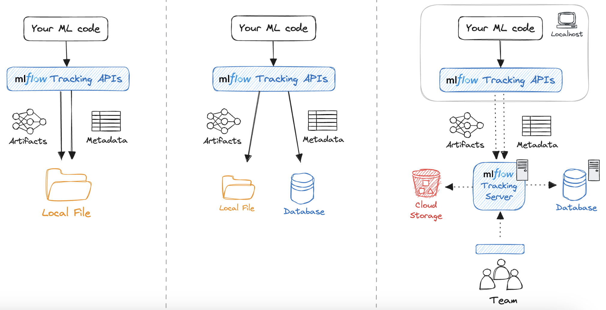
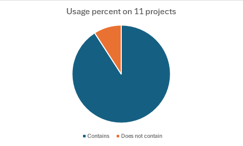
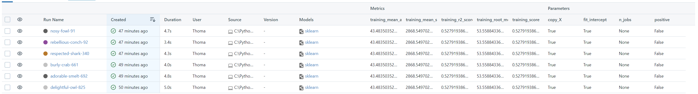
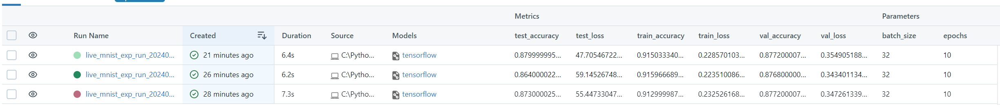

# De DevOps à MLops : Quelle place pour MLFlow ?
# Etude de la traçabilité des expériences
## Auteurs
Nous sommes quatre étudiants en M2 ou en dernière année de Polytech' Nice-Sophia spécialisé en architecture logicielle :

* Thomas FARINEAU &lt;thomas.farineau@icloud.com&gt;
* Léo KITABDJIAN &lt;leo.kitabdjian@etu.univ-cotedazur.fr&gt;
* Ludovic BAILET &lt;ludovic.bailet@etu.univ-cotedazur.fr&gt;
* Mohamed MAHJOUB &lt;mohamed.mahjoub@etu.univ-cotedazur.fr&gt;

## I. Contexte de recherche
La question de la gestion des expériences dans MLflow touche le cœur du MLOps, mettant en lumière son rôle dans l'amélioration de la qualité, rapidité et fiabilité du développement des modèles de machine learning. Cette approche permet d'identifier des pratiques optimales pour mener des expériences en Machine Learning (ML), cruciales pour le progrès dans ce secteur. Le MLOps, équivalent du DevOps dans le domaine du ML, est indispensable pour les organisations désireuses d'accélérer et de sécuriser leurs initiatives d'apprentissage automatique.  
Avec l'adoption croissante d'outils de MLOps par des plateformes comme Azure, il est évident que l'intégration et la gestion des expériences deviennent une priorité pour assurer le succès des projets en intelligence artificielle.

## II. Observations et questions générales
Nous avons effectué une étude sur MLFlow suite à l'émergence récente de MLOps. Dans ce contexte tourné autour de MLOps, nous avons donc observé un besoin important de garantir la traçabilité de MLFlow pour assurer la capacité à retracer et à centraliser des expériences qui peuvent être nombreuses et issues de plusieurs collaborateurs.

Nous avons retrouvé des principes communs entre le DevOps et le MLOps, MLFlow ayant pour but de fonctionner en MLOps, on retrouve donc des principes implémentés tel que le versioning, le logging et de l'intégration continue. Cependant, ces principes impliquent une forte demande de traçabilité et une éventuelle continuité vers de la reproductibilité.

Nous allons nous pencher sur la problématique suivante :
**Quels sont les besoins liés à la traçabilité des expériences dans un contexte de ML, vus à travers MLFlow ?**

Dans cette question, nous prenons en compte la définition suivante pour la traçabilité qui est adaptée dans le cadre d’un projet MLOps (il s’agit d’une définition fiable provenant du livre "Continuous Delivery: Reliable Software Releases through Build, Test, and Deployment Automation") :  
- **Capacité à suivre et à documenter de manière systématique et transparente toutes les expériences d'un modèle machine learning.**

Pour nous aider à répondre à la problématique, nous avons défini les sous questions suivantes :
- **Quelles sont les données tracées et stockées par MLFlow ?**
- **Où sont stockées les différentes données tracées par MLFlow et comment permet-il le stockage de ces dernières ?**
- **Les outils de traçabilité proposés par MLFlow sont-ils utilisés dans des contextes professionnels réels ?**
- **MLFlow permet-il ainsi d’assurer une exécutabilité des anciennes expériences, et pouvons-nous lier cela à de la reproductibilité ?**

## III. Collecte d'informations
### Articles
La documentation MLflow offre des informations sur la configuration et l'utilisation de MLflow pour la collecte de données d'expérimentation en machine learning.

- **[Documentation MLFlow](https://mlflow.org/docs/latest/)**  
  **Type de document :** Documentation  
  **Résumé :**  
  La documentation de MLflow décrit les fonctionnalités et les composants clés pour gérer le cycle de vie des projets de Machine Learning, y compris le suivi des expériences, la gestion des modèles, la préparation et le déploiement. Elle offre des guides pour démarrer, pour intégrer MLflow avec d'autres outils et plateformes, ainsi que des conseils pour la meilleure utilisation dans différents scénarios d'application.

### Jeux de données
- **scikit-learn**  
  Afin d’effectuer des tests, on utilise les jeux de données offerts par scikit-learn.
- **[Topic GitHub mlflow-projects](https://github.com/topics/mlflow-project)**   
  L'objectif principal est de vérifier si les projets Git utilisant MLFlow documentent l'implémentation de la traçabilité en mentionnant spécifiquement `log_params` ou `autolog`. Cela détermine leur conformité aux bonnes pratiques de documentation des expérimentations en machine learning, essentielles pour la traçabilité.

### Outils
- Un script permettant d'analyser un grand nombre de projets utilisant MLflow et de vérifier la présence de logging.
- MLFlow
- Jupyter Notebook

## IV. Hypothèse et expériences
### Hypothèses
- **Hypothèse 1 :** Les données enregistrées par MLFlow doivent permettre d’assurer une traçabilité totale des expériences.  
  
En prenant en compte la nature imprévisible du machine learning comparé à du code plus “classique”, nous émettons l’hypothèse qu’il faut donc tracer le plus de données liées à l'exécution de l’expérience possibles.  
Cela inclut :
  * Les versions de code utilisées 
  * Les paramètres d’exécution de l’expérience 
  * L’environnement mis en place pour l’exécution 
  * Les dépendances utilisées lors de l’expérience

- **Hypothèse 2 :** MFLow permet la centralisation des données de traçabilité.  

Étant donné l’aspect collaboratif qui peut s’appliquer aux projets impliquant du machine learning, nous estimons que MLFlow doit à priori proposer un moyen de centraliser les données liées à la traçabilité des expériences, afin de permettre aux différents collaborateurs d’accéder à ces données et de satisfaire le besoin de collaboration en termes de traçabilité. MLFow devrait donc proposer un espace de stockage pour ces informations.

- **Hypothèse 3 :** L’enregistrement des données proposé par MLFlow est crucial pour la traçabilité et vastement utilisé.  
  
Les besoins en termes de traçabilité établis par MLFlow sont-ils partagés (et donc utilisés) par les utilisateurs ?  
La traçabilité étant au cœur à la fois des concepts de MLOps et des fonctionnalités de MLFlow, notre hypothèse ici est que dans le cadre de projets mettant en place MLFlow, les fonctionnalités liées au traçage sont importantes et donc mises en valeur et utilisées dans ces projets.

- **Hypothèse 4 :** La sauvegarde des données de MLFlow permet d'assurer l'exécutabilité des expériences de ML.

En théorie, l'intégration de MLFlow dans les workflows de machine learning améliore l'exécutabilité et offre une perspective nuancée sur la reproductibilité des projets. Notre hypothèse est que les données sauvegardées par MLFlow permettent aux chercheurs de re-exécuter une expérience passée dans un contexte identique.  
  Cependant, la reproductibilité reste un objectif complexe, influencé par des facteurs variables externes. À notre échelle, nous pourrons aborder la notion de reproductibilité, mais il sera difficile d’émettre une réelle conclusion sans tests statistiques plus poussés.

### Expériences

- **Expérience 1 :** Quelles sont les données sauvegardées par MLFlow vis-à-vis des expériences ?

Nous avons défini une hypothèse formulant une liste de données que nous considérons comme nécessaires à sauvegarder pour garantir une traçabilité des expériences. Pour pouvoir valider (ou invalider) notre hypothèse, nous allons étudier la documentation afin de connaître précisément ce que MLFlow va permettre de sauvegarder pour assurer la traçabilité des expériences.

- **Expérience 2 :** Où et comment sont stockées les données tracées par MLFlow ?  

Notre hypothèse stipule que MLFlow propose une solution permettant de stocker les données pour la traçabilité de nos expériences. Afin de la valider (ou de l’invalider), nous allons utiliser la documentation que MLFlow nous met à disposition. Nous aurons pour objectif de trouver le moyen de stockage utilisé par MLFlow ainsi que la façon dont il le met en place.

- **Expérience 3 :** Les fonctionnalités de traçabilité de MLFlow sont-elles souvent utilisées ?

Nous avons émis l’hypothèse que ces fonctionnalités allaient être largement utilisées dans les projets mettant en place MLFlow. Pour pouvoir vérifier cette hypothèse, nous allons mettre en place un outil qui permet de scanner des projets afin d’y trouver des occurrences d’utilisations de ces fonctionnalités et ainsi émettre des statistiques. Ici, nous avons fait le choix d’utiliser comme base pour notre dataset de projets, ceux qui sont présents sur le topic GitHub [mlflow-projects](https://github.com/topics/mlflow-projects). Pour autant, cette expérience comporte des limites, dans un premier temps sur le nombre de projets utilisés pour établir nos statistiques, qui est une bonne base pour démarrer, mais pas suffisant pour faire des statistiques de haut niveau. Dans un second temps, ces projets sont majoritairement scolaires ou bien des projets d’exemple, donc ils ne représentent pas exactement un contexte professionnel réel. Malheureusement, nous ne pouvons pas faire autrement, car il nous faut des projets publics et accessibles.

- **Expérience 4 :** Exécutabilité

Pour prouver que la traçabilité offerte par MLflow facilite la reproductibilité des expériences de machine learning. On a conçu une expérience qui compare la facilité de reproduction des résultats d'un projet de machine learning avec et sans l'utilisation de MLflow. Ici, nous avons concentré nos efforts sur l'exécutabilité, avec comme objectif de permettre le redémarrage d'une expérience via MLFlow, tout en préservant les paramètres initiaux. Pour aborder et tester notre première hypothèse liée à la reproductibilité découlant de la traçabilité imposée dans le déroulement de l'expérience, nous allons exécuter des notebooks Jupyter spécifiques.

Conception de l'expérience :

Sans MLflow:
 - Exécuter une expérience de ML enregistrant manuellement les détails tels que les paramètres du modèle, les métriques de performance et les versions des datasets utilisés.
 - Tenter de reproduire les résultats d'une sélection d'expériences basées uniquement sur la configuration manuelle.

Avec MLflow:
- Répéter la même expérience en utilisant MLflow pour enregistrer automatiquement tous les détails pertinents (paramètres, métriques, artefacts).
- Utiliser les informations enregistrées dans MLflow pour reproduire l'expérience.
- Utiliser un projet de ML disponible sur GitHub pour tester la reproductibilité d'une expérience.

## V. Résultat d'analyse et conclusion

### Experience 1
#### Présentation des résultats

Lors de l’analyse de la documentation, nous avons pu trouver que MLFlow est capable de tracer de manière efficace et possiblement automatique les paramètres d’exécution ainsi que les métriques des expériences de machine learning. Ces derniers sont stockés de manière individuelle à chaque expérience. On retrouve aussi les dépendances et librairies utilisées pour générer le modèle. Cependant ces dernières ne sont pas stockées à l’échelle des expériences mais du modèle.
Cependant, On ne retrouve pas les versions de codes que MLFlow utilisé pour générer les expériences et on retrouve aussi un manque de traçabilité au niveau de l'environnement de la machine utilisateur. 

#### Interprétation des résultats
Ces résultats nous montrent que MLFlow considère initialement que la traçabilité des paramètres des différentes expériences, leurs métriques et les dépendances et librairies utilisées par les modèles de machine learning est suffisante pour une traçabilité convenable dans le cadre d’un suivi en MLOps.
Cependant on ne retrouve pas le versionning de code et les informations sur l’environnement de la machine qui sont des informations, selon nous, importantes dans le cadre d’un projet MLOps. Ce manque d’information représente un problème au niveau du traçage des projets fonctionnant à l’aide de MLFlow puisqu’ils peuvent avoir un impact sur le rendu final, le modèle créé. De plus, on remarque que les données que l’on retrouve sur les dépendances ne sont pas orientées de manière individuelle pour chaque expérience mais elles sont indiquées au niveau du modèle, ceci représente un autre danger pour tracer nos expériences de manière individuelle. Nous aurions imaginé que ces informations figurent de bout en bout de la chaîne, et donc, également à l’échelle des expériences.

#### Conclusion de l’expérience
Comparément à notre hypothèse de départ, on retrouve dans les résultats de notre expérience des données stockées par MLFlow que nous avions prédites telles que les paramètres. En revanche, il y a également des données auxquelles nous n’avions pas pensé telles que les métriques mais aussi des données que nous imaginions être tracées comme les versions de code source utilisées ou bien encore l’environnement de la machine qui ne le sont finalement pas. Enfin, certaines données que nous avions imaginées être tracées le sont effectivement, mais pas à l’échelle des expériences individuelles. Ainsi, on se rend compte que les besoins en termes d’informations stockées diffèrent entre ce que nous imaginions et ce que MLFlow propose, ce qui nous paraît surprenant compte tenu du facteur aléatoire omniprésent dans le domaine du Machine Learning dont nous pensions qu’il forcerait un traçage d’autant plus rigoureux.

### Experience 2
#### Présentation des résultats
Selon la documentation, il existe deux types de stockage :
- L’artéfact-store : Ce dernier va contenir les différents artéfacts produits par l’exécution de nos modèles. Les artéfacts vont permettre d’évaluer et de comparer les modèles produits et tracés par MLFlow. Ce stockage peut être en local ou dans le cloud.
- Le backend-store : Ce dernier va contenir les méta données de l’expérience. Ce sont les informations qui vont permettre la traçabilité complète de l’historique des expériences réalisées. Ce stockage peut être local, dans une base de données ou dans une BD sur un serveur distant. La documentation nous propose d’utiliser des bases de données postgres.

Comme nous nous intéressons à la traçabilité des expériences, nous allons nous focaliser sur le backend-store. La documentation de MLFlow nous propose une approche avec une utilisation de docker et de conteneur pour la création de notre base de données.

La question d'où sont stockées les données à maintenant une réponse. Voyons à présent comment elles sont stockées.

Avant d’exécuter expérience avec MLFlow, on va venir lancer un serveur MLFlow auquel on va venir spécifier l’emplacement du backend-store. Ensuite, on va venir renseigner dans le notebook l’Uri du serveur mlflow qui est en train de tourner. Pour ce faire, on utilise la commande `mlflow.set_tracking_uri()`. Après cela, il reste tout simplement à tracer les informations dont on a besoin et MLFlow va les envoyer au serveur qui va les stocker dans la base de donnée.

#### Interprétation des résultats
Comme nous avons pu le constater, MLFlow ne propose pas directement de solution pour sauvegarder les informations récoltées. Ces moyens de stockage sont mis en place directement par l’utilisateur.
Cependant, MLFlow met en place un moyen facile pour enregistrer les informations à travers un serveur. L’exécution de notre expérience MLFlow va venir envoyer les métriques récoltées au serveur et ce dernier va venir sauvegarder ces données dans la BD qu’on lui a indiquée.

#### Conclusion de l'expérience
Les métadonnées utilisées pour la traçabilité des expériences peuvent être stockées en local ou dans une base de données, potentiellement distante. MLFlow ne propose donc pas d’espace de stockage à proprement parler. Cependant, il va venir proposer une interface entre la BD distante et la récolte d’informations de l’expérience, permettant ainsi de répondre à un besoin de collaboration en matière de traçabilité d’expériences de Machine Learning.

### Experience 3
#### Présentation des résultats
Après avoir fait tourner notre script sur les projets du topic GitHub `mlflow-projects`, nous avons pu établir des statistiques sur la fréquence d’utilisation des fonctionnalités de traçabilité sur ces dit-projets. Pour cela, nous avons scanné les projets à la recherche de fonctions MLFlow permettant le logging. Il en existe plusieurs, `log_params`, qui va permettre d’enregistrer les paramètres de l’expérience, `log_metrics` pour enregistrer les métriques et `autolog` qui va gérer automatiquement tout le logging. Si l’on trouve l’une de ces fonctions, cela signifie que ce projet utilise les fonctionnalités de traçage de MLFlow. Ci-dessous se trouve un graphique représentant la part de projets comportant ces fonctionnalités.

#### Interprétation des résultats
On se rend compte qu’une majorité écrasante des projets comporte donc les fonctionnalités de traçabilité proposées par MLFlow. Bien que ces projets soient, comme précisé auparavant, des projets pour la plupart scolaires ou d’exemple, cela montre bien que la traçabilité est un aspect considéré comme fondamental par les utilisateurs de MLFlow, ce qui valide notre hypothèse. Ces résultats ne sont pas surprenants, compte tenu du fait que MLFlow est un outil visant à assister le cycle de vie des applications comportant du machine learning à travers des composantes de DevOps (plus particulièrement ici MLOps). On sait que les concepts de versioning, logging et intégration continue sont cruciaux dans les pratiques DevOps et dans notre cas, la traçabilité des expériences est assimilable à un mix de ces trois concepts. C’est pourquoi il n’est pas étonnant qu’elle soit au cœur de l’utilisation que les gens ont de MLFlow.

#### Conclusion de l'expérience
On voit donc bien que les fonctionnalités liées à la gestion de la traçabilité proposées par MLFlow sont, en pratique, utilisées par ses utilisateurs. On peut en conclure que cela répond donc à de vrais besoins qui contribuent réellement à l'amélioration des processus de développement et cycle de vie des applications de Machine Learning.

### Experience 4
#### Présentation des résultats
Exécution de la partie MLFlow du notebook basic experiment

Ainsi, l'observation des métriques, qui se révèlent identiques à chaque test, pourrait nous amener à présumer que la reproductibilité est garantie. Cependant, une attention particulière doit être accordée au jeu de données utilisé. Prenons, par exemple, un [projet de ML utilisant 
TensorFlow](https://github.com/at0m-b0mb/Mlflow-TensorFlow-Image-Classification-Guide).  

Exécution du notebook complexe experiment

Une analyse approfondie, après trois lancements, révèle que les métriques subissent de légères variations.
Ces facteurs incluent l'initialisation aléatoire des poids dans les modèles de machine learning, la sélection des échantillons lors de la division en ensembles d'entraînement et de test si elle n'est pas contrôlée à 100 %, ainsi que les spécificités de l'environnement d'exécution telles que la version des bibliothèques utilisées, la configuration matérielle, et même l'ordonnancement des opérations par le processeur, qui peut affecter les calculs en virgule flottante.

#### Interprétation des résultats
MLflow, en tant qu'outil, n'est pas conçu pour garantir que les résultats d’exécution de modèle seront identiques à chaque fois, mais plutôt pour fournir un cadre permettant la traçabilité et la gestion du cycle de vie des modèles de machine learning. Il permet aux développeurs de suivre les paramètres, les métriques et les artefacts associés à chaque exécution, facilitant ainsi la comparaison des expériences et la compréhension des conditions sous lesquelles les résultats ont été obtenus.  

#### Conclusion de l'expérience
On en conclut que MLFlow n’assure aucune reproductibilité dans cette expérience. Ce qui, en fait, est logique puisque quand on exécute un programme de Machine Learning sur une machine, même si on lui met les mêmes paramètres, il arrive très souvent que les résultats diffèrent, car l'exécution dépend de nombreux facteurs qui peuvent varier. En soulignant l'importance de l'exécutabilité, MLFlow encourage une recherche plus structurée et une innovation plus rapide, posant les bases pour une avancée significative dans la fiabilité et l'efficacité des processus de machine learning.

### Conclusion globale

Pour conclure, on a donc vu que les besoins en termes de traçabilité des expériences pour le Machine Learning consistaient, selon MLFlow, à enregistrer seulement les paramètres ainsi que les métriques liées à ces dernières sur un serveur distant afin de permettre un travail de collaboration. Ces besoins identifiés sont partagés par les utilisateurs qui, en grande partie, utilisent ces outils mis en place par MLFlow. Enfin, le but de la traçabilité étant ultimement de pouvoir reproduire les expériences, nous avons vérifié et confirmé l’exécutabilité de ces dernières à partir des infos tracées par MLFlow. En revanche, il est trop compliqué d’émettre une conclusion sur une quelconque reproductibilité à notre niveau.

Il est important de noter que cette analyse sur les besoins en matière de traçabilité s’est basée sur l’outil MLFlow. Toutefois, il est possible que d’autres outils similaires à MLFlow aient imaginé et mis en place des fonctionnalités répondant à d’autres besoins auxquels MLFlow ne répond pas. Ainsi, il pourrait être intéressant de mettre en confrontation et de croiser cette analyse avec d’autres analyses impliquant des outils similaires.

## VI. Outils

- Script d’analyse de projet pour vérifier si les projets MLFlow utilise la traçabilité
  - [Script](./assets/script/)

- Outils utilisés pour l'expérience 1
  - [Notebook Jupyter Experiment 1](./assets/basic_experiment.ipynb)
  - [Notebook Jupyter Experiment 2](./assets/complexe_experiment.ipynb)  
  Les buts de ces notebooks sont de reproduire facilement les résultats obtenus lors de l'expérience 1.

## VII. Réferences

[Continuous Delivery: Reliable Software Releases through Build, Test, and Deployment Automation]  
Disponible sur : https://proweb.md/ftp/carti/Continuous-Delivery-Jez%20Humble-David-Farley.pdf (Janvier 2024)

[Documentation MLFlow 2.10.0] (2024) MLflow: A Tool for Managing the Machine Learning Lifecycle  
Disponible sur : https://mlflow.org/docs/latest/ (Janvier 2024)

[MLOps] (2024) MLOps References  
Disponible sur : https://ml-ops.org/content/references.html (Janvier 2024)

