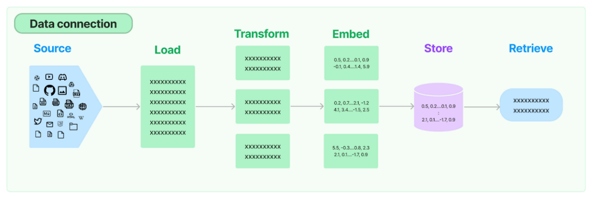

**_février 2024_**
## Authors

Nous sommes quatre étudiants ingénieurs en dernière année à Polytech Nice Sophia, spécialisés en Architecture Logiciel :

* Tobias Bonifay (tobias.bonifay@etu.unice.fr)
* Ihor Melnyk (ihor.melnyk@etu.unice.fr)
* Ayman Bassy (ayman.bassy@etu.unice.fr)
* Mathieu Schalkwijk (mathieu.schalkwijk@etu.unice.fr)

## I. Contexte et périmètre du Projet
Le contexte de ce projet se situe dans l'analyse de diverses implémentations de chatbot utilisant Langchain. L'intérêt réside dans l'identification des caractéristiques communes, des meilleures pratiques, et des innovations clés dans ces implémentations. Cette analyse vise à créer un modèle de fonctionnalités (Feature Model) exhaustif pour guider le développement de chatbots efficaces et avancés en Langchain.
### LangChain
Langchain est une bibliothèque Python conçue pour faciliter le développement d'applications utilisant des modèles de langage, tels que GPT-3 d'OpenAI. Parfois des implémentations sont disponibles dans d'autres langages tels que Java avec LangChain4J (https://github.com/langchain4j/langchain4j).  Elle fournit des outils et des structures pour intégrer ces modèles dans des workflows plus larges, en particulier pour la création de chatbots et d'autres systèmes interactifs basés sur le traitement du langage naturel.
### Motivation de réalisation du projet
LangChain étant pour nous la technologie de demain, nous avons trouvé très pertinent de nous pencher sur des cas d’utilisation de celui-ci. Les chatBots étant représenter le plus parmi les projets GitHub, il a donc couler de source que nous allions nous porter sur ce cas d’utilisation.
Nous voulions, par notre compréhension de l'implémentation de chatbot via langchain, permettre à d'autres de rapidement pouvoir réaliser un chatbot grâce a langchain, et ce grâce au feature model.
### Utilisation du Projet
A terme, le feature modèle réalisé devrait permettre à de nouveaux utilisateurs de LangChain, dans le contexte d’un chatbot, de connaître directement les différentes implémentations et d’en déduire les fonctionnalités/features réalisables. Nous soulignerons les points communs et les différences. Obligatoire dans le contexte de réalisation d’un scénario des plus basique, jusqu'à la réalisation d’un scénario impliquant un chatbot plus complet.

## II. Observations et Général question

Nous avons commencé nos recherches sur la documentation de LangChain directement, afin de voir les différentes explications sur les moyens mis à disposition par langChain afin de permettre de communiquer un LLM. En effet, le concept était plutôt simple.

Il nous est mis à disposition un ensemble de librairies qui permettent de préparer les données à envoyer, de les envoyées vers un LLM via une connexion par clé d’api avec un API. Et de les récupérer. Mais ces ensembles de fonction doivent être accompagnés d’autre élément plus natif au langage utilisé, ici python, mais aussi d’autre bibliothèque et framework dans le contexte de mise en place du chatBot dans l’optique de projet ou le chatBot n’est au final qu’une partie de celui-ci.

Ainsi, nous avons relevé différentes manières de procéder à la mise en place d’un pipeline de chatbot avec LangChain. En effet, cela va dépendre de plusieurs facteurs liés à la conception, est-ce un chatbot à ajouter à un existant, ou est-ce un nouveau projet. Et cela influe sur les choix technologiques qui seront mis en place, notamment au niveau du LLM vers lequel les requêtes iront, ou quelle solution de stockage qui serait utilisé pour stocker les données mémoire, et l'utilisateur. Cela influe aussi finalement sur la qualité du code écrit.

À la suite de l’ensemble de ces observations effectué, nous avons donc déduit une problématique qui serait au centre de nos recherches :

Vers la caractérisation de la variabilité de Langchain. Quelles approches et choix technologiques émergent des dépôts GitHub liés à LangChain pour la mise en œuvre de chatbots ?

Cette question nous semble vraiment intéressante, car elle nous permettra de mettre en avant de potentiel pattern qui existe dans la réalisation de ChatBot. Afin de réaliser une sorte de consensus sur les méthodes de réalisation de ChatBot, rendant le processus moins long techniquement pour une nouvelle équipe avec le framework, avec un besoin rapide d’intégration, dans le cadre de réalisation de Proof of Concept, ou autre projet.

## III. Collecte d’information
La documentation officielle de Langchain (disponible sur https://python.langchain.com/docs/ ou https://python.langchain.com/docs/use_cases/chatbots/ pour les chatbots) a été une source primordiale pour comprendre son fonctionnement. Pour approfondir nos recherches, nous avons également consulté des articles académiques et des études de cas sur l'utilisation des chatbots en IA. Nous avons étudié les implémentations courantes et les meilleures pratiques dans le domaine du traitement du langage naturel.

Notre étude s'est ensuite orientée vers une analyse segmentée des différents composants d'un chatbot Langchain. Nous avons initialement examiné le fonctionnement global à travers la documentation, enrichissant notre compréhension par des illustrations et des schémas explicatifs. Suite à cela, nous avons divisé notre recherche en quatre domaines spécifiques :
* Retrieval of specific data (not in the llm, for example documents on the computer of the user)
* Storage of this specific data
* Memory to remind of previous chat messages
* How does the prompt works (how do we interact with the llm)

Pour une efficacité optimale, ces domaines ont été répartis et étudiés en parallèle par notre équipe, en utilisant plusieurs dépôts sur GitHub comme plateformes de recherche et d'expérimentation. L'ensemble des données et des observations recueillies au cours de notre étude a été systématiquement compilé et organisé dans un [tableur](assets/results/repositories-study.xlsx).

Source: https://python.langchain.com/docs/use_cases/chatbots

Retrieval :

La collecte de ces données est un processus long car il demande de comprendre les mécanismes de LangChain pour analyser “à la main” le code des repositories. Ce n’est pas automatisable car chaque code est différent des autres même quand ils utilisent les mêmes concepts. Nous n'avons donc pas pu analyser un nombre d’échantillons parfaitement représentatifs par manque temps.

Durant ce processus d’analyse, nous avons fait face à des difficultés liées à la véracité des conclusions que nous pouvions tirer de ces multiples repositories. En effet, l’on peut avoir un grand nombre de repositories comme sources à nos recherches, le tout reste de savoir si ce sont de bonne ou mauvaise source. En effet, qu'est ce qui empêcherait quelqu’un de faire des tests sur un projet qui lui est propre, mis en publique, que nous prendrons pour exemple dans l'étude des pratiques élaborée avec Langchain en python pour réaliser un chatbot.

Il nous a donc fallu nous imposer des limites. En effet, le plus simple a été de dire que les projets ayant moins de 1000 étoiles, de 10 contributeurs ou n’ayant pas reçu de commit depuis plus d’une semaine seraient considérés comme des projets peu fiables. En effet, il pourrait être des projets ayant été développés dans le contexte de test ou de tutoriel.

Mais justement, cela n’enlève en rien la légitimité du repository à être représentatif des patterns de conception de pipeline Langchain dans divers contextes de réalisation d’un chatbot. En effet, Langchain étant encore un projet nouveau, il est normal pour les gens de commencer à expérimenter la chose. Ainsi, cela nous a poussé davantage à juste étudier les repositories a la main, afin d'émettre un jugement (subjectif) sur la conception de la pipeline dans la réalisation dudit “chatbot”. Et ainsi décider de si le repository était pertinent ou non.

## IV. Hypothèses & Premiers résultats

Hypothèses de départ :

Il existe divers moyen de faire une pipeline de chatBot
Il n’est pas forcément necessaire de passer par OpenAl pour avoir un chatBot efficace (et pas le payer) - “parler des nouveauté la”
Le stockage dans une base de donnée extérieure ne doit pas être si courant
Il existe des patterns dans la réalisation de “bonne” pipeline, et des anti-pattern dans la réalisation de “mauvaise” pipeline.

**Hypothese 1 :**

Étude : Afin de réaliser l'étude de cette hypothèse, nous avons relevé, chacun des 4 membres de notre équipe, sur 4 étapes de la pipeline, fait l'étude purement technique de ce qui a été mis en place afin de réaliser cette étape précisément. Cela nous a permis de centraliser sur un tableau excel les différents moyen employé dans le divers repositories GitHub pour realisé une pipeline.

Résultat : On voit que le tableau Excel présente un grand nombre de différences quant à l’approche qui a été mise en place. Or, on sait que l’objectif et le contexte lié à la réalisation du projet de chatbot influe grandement sur les éléments du pipeline (notamment la solution de stockage). On peut donc en déduire qu’un large éventail de possibilités est possible dans la réalisation de pipeline. C’est une bonne nouvelle car cela démontre de la variabilité de langchain, et une mauvaise, car cela nous entrave dans la recherche de récurrence et donc de consensus sur de bonnes pratiques.

**Hypothèse 2 :**  
Mise en place d’un chatbot très simple qui se base sur un model open source Mistral 7B avec 7 milliard de paramètres mais avec les performances d’un model à 23 milliard de paramètres. ça veut dire que les modèles deviennent plus compacts avec les performances des gros modèles actuelles, donc il est possible de run son propre modèle fine-tuné sur son infra qui n’a pas à être surperformant et de ce fait être indépendant des gros acteurs comme OpenIA qui facturent ses clients par token. Actuellement GPT 4 reste le plus performant mais cela nécessite de mettre sa carte bancaire et nous avons aucun contrôle dessus tandis qu’un modèle peut être personnalisé (fine-tuning) et on a le contrôle total des données qui y circulent, l'inconvénient est que c’est pas encore aussi performant mais ce n’est qu’une question de temps. Notre expérience avec Mistral 7B montre que tout de même les performances de celui-ci sont très correctes et peuvent déjà satisfaire un grand nombre de besoins.

**Hypothèse 3 :**  
L’on peut en effet supposé que l’utilisation de base de donnée externe est peu courante, en effet cela nécessite de la configuration du projet supplémentaire, surtout dans un contexte démonstratif, nous avions peut espoir de tomber sur un projet mettant en oeuvre ce genre de chose, même si pour nous, un service stateless répond au mieux au caractéristique de scalabilité, obligatoire dans un contexte moderne.

L’étude nous a révélé pourtant que dans certains projets, des bases de données comme MongoDB ou Redis étaient utilisées. En effet, les base de données noSQL, sur base du modèle BASE, permettent de mettre en œuvre des flux d’écriture/lecture très rapide, apportant donc de la valeur.

**Hypothèse 4 :**  
L’essence de notre travail était au final d’essayer de conclure quant à cette hypothèse, est la seule réponse que l’on a trouvée valide était : “cela dépend”. En effet, il y a un grand nombre de possibilités, ajouter à cela que nous ne somme pas expert en code python appliqué a langchain, cela rend d’autant plus compliqué le tirage de conclusion à cet égard. C’est donc pour cela que nous avons très rapidement décidé de réaliser un feature modèle.
## V. Feature Modèle
Le feature modèle a pour objectif de rapidement donnée les éléments indispensable à la construction d’un chatbot, mais aussi les différents éléments disponibles à la réalisation de celui-ci.

Le feature model est situé dans [assets/results/feature-model.svg](assets/results/feature-model.svg)

Au niveau du prompt, il est nécessaire d’appeler le LLM avec une API key en lui passant un prompt textuel, de taille limitée par rapport au LLM utilisé. L’utilisation d’un prompt-template est nécessaire afin de permettre une utilisation contrôlée de celle-ci. Ce prompt veille à demander à l’IA ne peut pas inventer, de répondre “Je ne sais pas” s’il manque de données pour répondre.. Mais aussi à formater la réponse de sortir pour l’utilisateur.

La manière d’afficher les données peut varier, utilisation de stream asynchrone par exemple. Format markdown ou texte brut…

Pour ce qui est de l’entrée, soit le texte est entré directement, et un traitement peut lui être appliqué.. Soit un média doit être transcrit. Parmi les traitements possibles, on retrouve la recherche optimisée de texte afin de cibler les données à envoyer au LLM pour satisfaire une requête. (Vector sharding comme Pinecone)

Concernant la mémoire conversationnelle, il en existe des types bien définis :
* Conversation buffer
  * previous messages as text or as list
* Conversation buffer window
  * previous messages as text or as list
* Entity
* Knowledge graph
  * previous messages as text or as list
  * knowledge triplets
* Conversation summary
  * generating summary with the history of all messages every time or keeping the summary up to date
* Conversation Summary Buffer
* Vector store
  * see differents implementations of vector store

## VI. Conclusion & Perspectives

La réalisation du feature model venait avec un autre projet plus ambitieux, en effet au lieu d’essayer de se rendre utile à la communauté langchain par l'établissement d’un consensus absurde car subjectif, d’autant plus que ce processus prendrait trop de temps. Nous avons opté pour une autre solution.

En effet, en partant de notre feature modèle, l’on pourrait générer un template par type de pipeline créé, afin de simplifier la vie au développeur qui découvre. En effet, l’on leur génère un template “Hello LLM qui part de la base avec instanciation des éléments fondamentale et simple. Ainsi, il pourrait partir de cette base pour ajouter des couches de configuration et approfondir leur pipeline.

Ainsi l’outil aurait une UI qui permet de placer les boxes suivant un ensemble de règle établie par le feature modèle, qui permettrait de faire de la génération de code. Ce projet serait alors open source afin de permettre à une pluie large communauté de contribuer dans le but de venir ajouter sa pierre à l'édifice.

Ce genre de projet répond aussi en somme à notre hypothèse, car nous imposerons un template qui respecterait donc une base de bonne pratique, qu’il restera au développeur a comblé. Et autour de ce projet grandissant pourrait naître un potentiel consensus autour de la génération de chatBot.

## VI. References

[Debret 2020] Debret, J. (2020) La démarche scientifique : tout ce que vous devez savoir ! Available at: https://www.scribbr.fr/article-scientifique/demarche-scientifique/ (Accessed: 18 November 2022).

Documentation LangChain https://python.langchain.com/docs/get_started/introduction

Les différents repositories GitHub [assets/results/repositories-study.xlsx](assets/results/repositories-study.xlsx)

Sara A. Metwalli (2020). The Most Efficient Way to Read Code Written by Someone Else https://towardsdatascience.com/the-most-efficient-way-to-read-code-written-by-someone-else-cb1a05102b76

Oguzhan Topsakal(2023). Creating LLM Applications Utilizing LangChain: A Primer on Developing LLM Apps Fast
https://www.researchgate.net/profile/Oguzhan-Topsakal/publication/372669736_Creating_Large_Language_Model_Applications_Utilizing_LangChain_A_Primer_on_Developing_LLM_Apps_Fast/links/64d114a840a524707ba4a419/Creating-Large-Language-Model-Applications-Utilizing-LangChain-A-Primer-on-Developing-LLM-Apps-Fast.pdf
