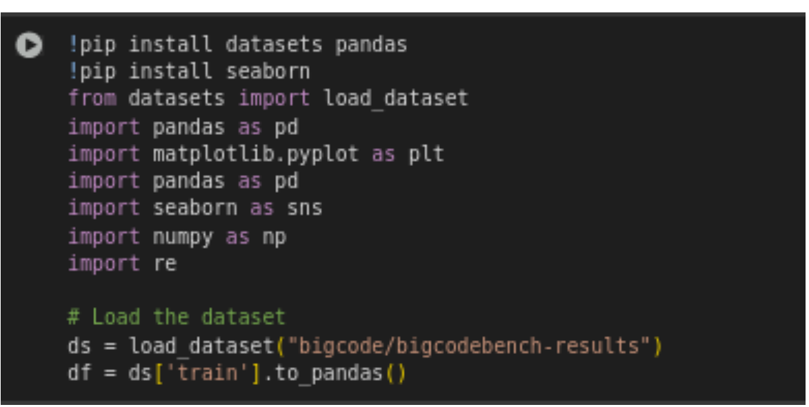
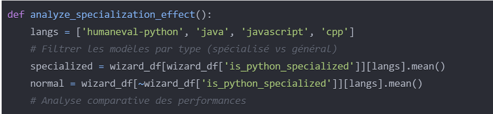
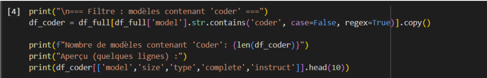
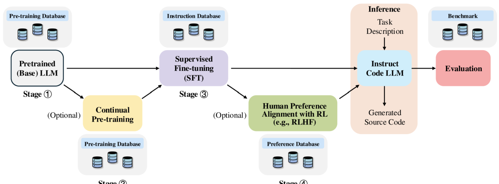
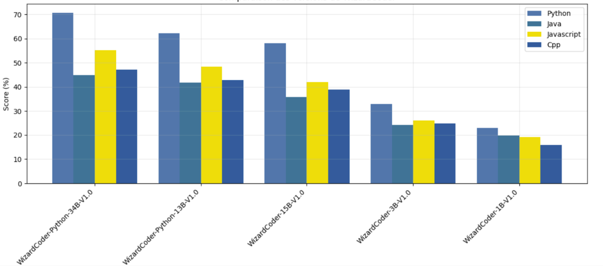
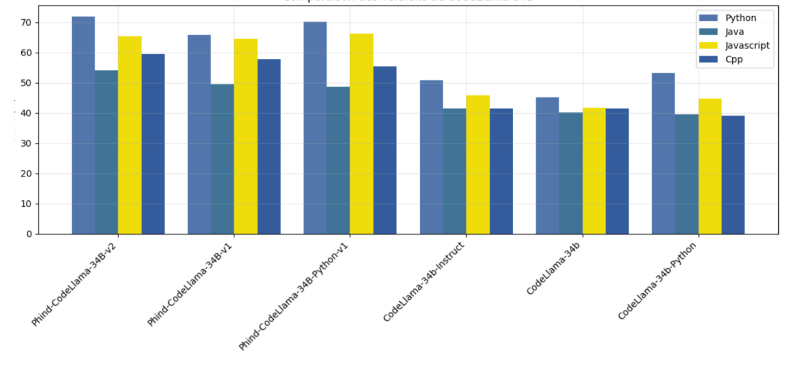
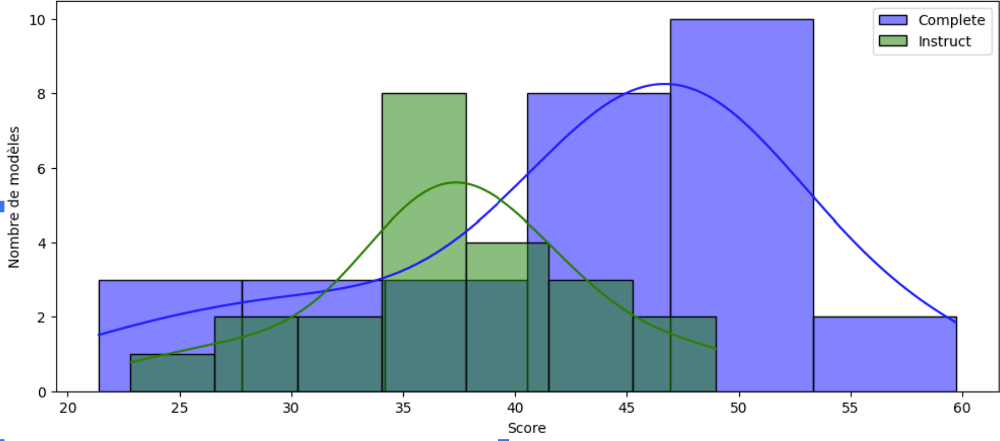
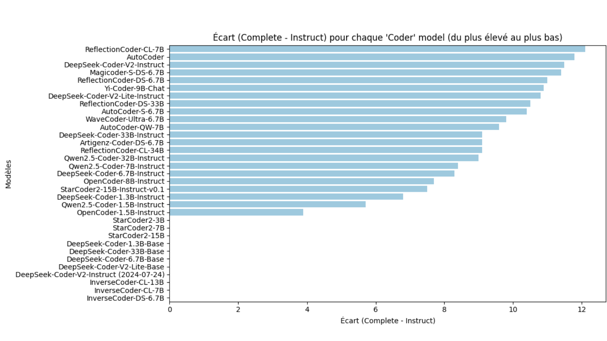
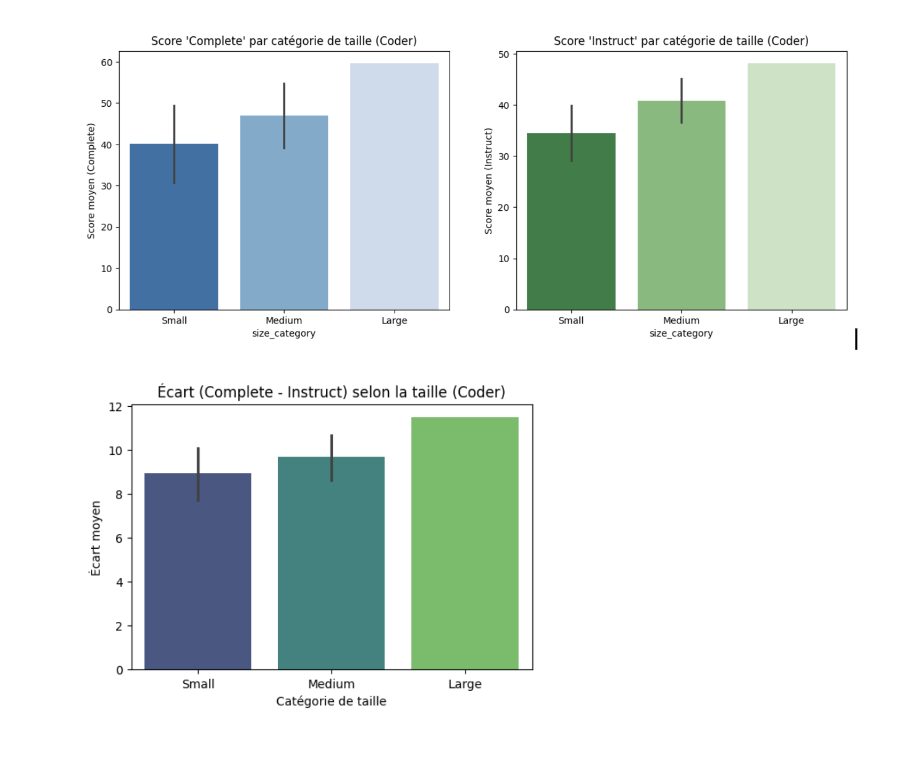
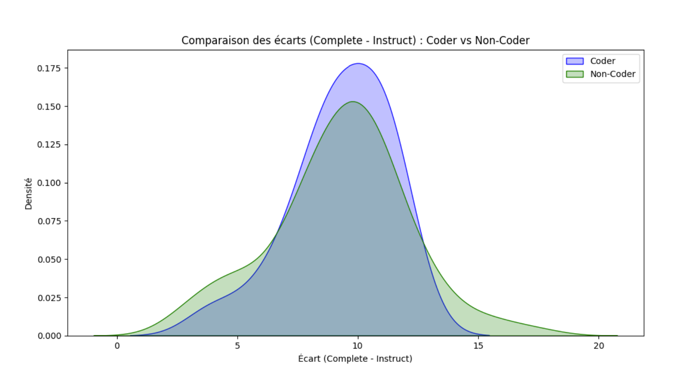

layout: default
title: Facteurs impactant les résultats de benchmark de géneration de code 
date: 2025-02
---

**_février 2025_**

## Auteurs

Nous sommes quatre étudiants ingénieurs en dernière année à Polytech Nice Sophia, spécialisés en Architecture Logiciel :

* Lamya Baidouri &lt;lamya.baidouri@etu.unice.fr&gt;
* Bilal Mesaouri Deboun &lt;bilal.mesaouri-deboun@etu.unice.fr&gt;
*  Dassou Ablam Kaleb Sika &lt;dassou-ablam-kaleb.sika@etu.unice.fr&gt;

---

# I. Contexte

---

Dans l'ère moderne du développement logiciel, les modèles de langage (LLMs) pour la génération de code sont soumis à des évaluations standardisées appelées benchmarks. Ces derniers suivent généralement le même principe : soumettre au modèle un ensemble de problèmes ou de prompts prédéfinis et évaluer ses réponses selon des critères spécifiques. La complexité et la diversité des cas de test augmentent parallèlement à l'évolution des capacités des modèles, rendant ces évaluations de plus en plus sophistiquées. Les entreprises et les chercheurs enrichissent continuellement leurs datasets pour couvrir un spectre plus large de scénarios.
Ces benchmarks, bien que essentiels, peuvent être influencés par divers facteurs qui impactent significativement leurs résultats. Notre recherche explore comment les techniques d'optimisation des modèles et leur spécialisation affectent la fiabilité et les résultats de ces benchmarks

---

# II. Problématique:

---

Notre recherche vise à répondre à la question suivante : "Quels sont les facteurs qui peuvent influencer les résultats des benchmarks de génération de code ?"

Cette question mérite une attention particulière, car les benchmarks, bien qu'ils soient variés, partagent certaines métriques communes qui servent d'outils principaux pour évaluer les modèles de code. L'interprétation de ces métriques peut être influencée par divers facteurs qu'il est important de prendre en compte

Cette problématique s'articule autour de trois axes principaux :

### 1. Comment le fine-tuning par instruction impacte-t-il les performances des modèles ?

Les modèles fine-tunés sur des instructions visent à améliorer la réaction des modèles face à des instructions, par opposition aux modèles de base centrés sur la complétion. Cela soulève des questions pertinentes sur l'amélioration réelle des performances des modèles apres le fine-tuning.

### 2. Comment la spécialisation dans un langage spécifique impacte-t-elle les performances dans un benchmark ?

La spécialisation des modèles dans une langue spécifique soulève des questions sur leurs performances dans la langue cible, leur capacité à transférer ces compétences vers d'autres langues, et les biais potentiels dans l'évaluation des benchmarks multilingues. Cette approche implique un compromis entre l'expertise dans une langue et la polyvalence linguistique globale.

### 3. Comment les « Coder » models, spécifiquement conçus pour la génération de code, réagissent-ils aux différences de format entre Complete et Instruct ?

Sont-ils plus ou moins sensibles que d’autres LLM au style du prompt, et observe-t-on un écart de performance (Complete vs. Instruct) particulier dans cette famille ?

---

## II. Hypothèses et expériences

---

### Hypothèse 1 : Impact du fine-tuning par instruction

L'objectif de cette expérience est d'évaluer l'impact de l'optimisation fine basée sur des instructions sur les scores des LLM sur un benchmark bien connu comme BigCodeBench. Plus précisément, l'accent est mis sur les benchmarks qui s'appuient sur des ensembles de données composés de prompts en langage naturel, qui constituent la majorité des benchmarks.

Le dataset de ce benchmark contient pour les mêmes tâches deux versions : une version complète et une autre au format d'instructions.

L'approche consiste à comparer deux versions du même modèle : un modèle de base et un modèle optimisé sur des instructions. En analysant les différences de performances entre ces versions et en examinant comment l'optimisation fine sur instructions est mise en œuvre, l'expérience vise à fournir des perspectives et des explications pour les résultats observés.

#### Expérimentation 1
Dans ce notebook, j'ai comparé les performances des modèles de génération de code fine-tunés pour les instructions en utilisant deux formats différents : tâches complètes et tâches sous format d'instruction. L'intérêt principal de cette expérience est de comprendre comment la formulation des instructions influence les capacités de génération de code des modèles d'IA.

#### Méthodologie
Comparaison des modèles d'instructions et de base sur des tâches complètes. L'hypothèse initiale suggère une performance équivalente, voire supérieure pour les modèles de base, qui sont à la base optimisés pour la complétion de tâches.

#### Outils
Comme mentionné précédemment, nous avons utilisé le leaderboard BigCodeBench qui présente les scores de plusieurs modèles de génération de code, et d'autres outils comme Pandas et Matplotlib pour traiter et visualiser les données.

### Hypothèse 2 : Impact de la spécialisation

Les modèles spécialisés dans un langage spécifique devraient montrer une performance supérieure dans leur langage cible, tout en maintenant potentiellement un effet de transfert positif vers des langages syntaxiquement proches, notamment en raison des structures et concepts de programmation partagés.

#### Expérimentation
L'analyse utilise des scripts Python développés avec pandas et matplotlib pour traiter les données des benchmarks HumanEval multi-langage, permettant une comparaison systématique entre les versions spécialisées et générales des modèles de langage. Cette approche permet d'isoler spécifiquement l'impact de la spécialisation sur les performances.

#### Justification
Le choix de notre approche expérimentale est motivé par la nature standardisée des métriques fournies par HumanEval, permettant une comparaison objective des performances des modèles. L'analyse par langage nous permet d'identifier précisément les effets de transfert de compétences entre les différents langages de programmation, et la comparaison directe entre versions spécialisées et générales nous aide à isoler spécifiquement l'impact de la spécialisation sur les performances des modèles.

#### Outils utilisés
Notre infrastructure d'analyse combine des bibliothèques Python essentielles (pandas, matplotlib) avec les données standardisées de HumanEval, offrant un cadre robuste pour évaluer les performances comparatives des modèles à travers différents langages de programmation.

### Hypothèse 3 : Sensibilité des modèles « Coder » au format des tâches

Les modèles labellisés “Coder” (StarCoder, DeepSeek-Coder, Qwen2.5-Coder, etc.) se distinguent par leur orientation explicite vers la génération de code. L’hypothèse est qu’ils pourraient présenter une sensibilité différente au changement de format de prompts — autrement dit, l’écart entre “Complete” et “Instruct” pourrait être plus (ou moins) prononcé que pour les modèles non spécialisés. Nous souhaitons donc analyser :

1. La distribution des scores en "Complete" vs. "Instruct"
2. L'écart Δ = score_complete − score_instruct
3. Le rôle de la taille (Small, Medium, Large)
4. Une comparaison avec les modèles "Non-Coder" pour évaluer l'impact de la spécialisation sur la dynamique du fine-tuning instructionnel

#### Expérimentation

Elle s'appuie sur le dataset BigCodeBench, déjà introduit dans l'Hypothèse 1, mais cette fois spécifiquement filtré pour inclure uniquement les modèles dont le nom contient la chaîne "coder". Cela a permis d'identifier un sous-ensemble de 33 modèles, parmi lesquels 22 disposent de scores pour le mode "instruct". L'approche méthodologique consiste d'abord à calculer l'écart entre les scores "complete" et "instruct", et à en analyser la distribution. Ensuite, les modèles sont segmentés par taille (<10 B, 10–50 B, >50 B) afin d'explorer l'influence de la dimension du modèle sur les écarts de performances. Enfin, une comparaison optionnelle est réalisée entre l'écart moyen des modèles "Coder" et celui des modèles "Non-Coder", pour situer les spécificités des modèles spécialisés dans le code.

### Justification
Cette expérimentation s’inscrit dans la continuité des travaux précédents en mettant l’accent sur des modèles spécifiquement pré-entraînés pour la génération de code. L’objectif est d’évaluer si leur forte spécialisation en code brut améliore significativement leurs performances en mode "complete" (tâches classiques), tout en entraînant une éventuelle pénalisation des scores en mode "instruct". À l’inverse, il est également pertinent d’examiner si l’écart de scores entre les deux modes reste comparable à celui observé avec des modèles de langage plus généralistes. Cette investigation est essentielle pour mieux comprendre comment optimiser les prompts et ajuster le fine-tuning instructionnel pour des modèles hautement spécialisés dans la génération de code.

### Outils utilisés :

Outils utilisés : Les outils utilisés pour cette expérimentation incluent les bibliothèques Pandas et Matplotlib/Seaborn, qui ont permis de nettoyer les données et de produire des visualisations telles que des histogrammes et des barplots. L'analyse a été réalisée dans un Notebook Colab, qui contient le code détaillé pour le filtrage des modèles, les calculs des écarts, et les visualisations.

---

# III. Résultats:

---

### Hypothèse 1 : Impact du fine-tuning par instruction

### Résultats expérience 1 :

Au début, on a pu confirmer que les modèles fine-tunés performaient mieux sur les tâches complètes que sur les tâches d'instructions. Les versions fine-tunées obtiennent systématiquement des scores inférieurs sur les tâches d'instructions par rapport à leurs performances sur les tâches complètes. Par exemple :

* DeepSeek-Coder-33B-Instruct : 51,10 (complet) contre 42,00 (instructions)
* Mixtral-8x22B-Instruct : 50,20 (complet) contre 40,60 (instructions)
* CodeLlama-70B-Instruct : 49,60 (complet) contre 40,70 (instructions)

Pour expliquer cela, nous avons analysé le format des tâches pour approfondir notre compréhension, et la différence était évidente : les tâches complètes contenaient des exemples, contrairement aux tâches d'instructions.

### Limitations 

Le manque d'exemples sur la version instructive des tâches justifie la performance faible des modèles par rapport aux tâches complètes. Cependant, cette observation ne permet pas de conclure que les modèles fine-tuned performeront systématiquement moins sur les tâches au format d'instruction par rapport aux tâches de complétion.

### Résultats expérience 2 :

La plupart des modèles fine-tunés sur instructions performent mieux sur des tâches complètes que leurs homologues de base. Exemples notables :

* DeepSeek-Coder-V2-Lite : Amélioration de 45,30 à 59,70 sur des tâches complètes
* Llama-3-70B : Progression de 43,30 à 54,50 sur des tâches complètes
* Granite-Code-20B : Augmentation de 25,60 à 42,00 sur des tâches complètes

Pour expliquer cela, nous devons d'abord comprendre ce que signifie exactement le fine-tuning sur instructions.

L'entraînement d'un modèle de base est souvent réalisé avec un apprentissage non supervisé sur de nombreux datasets, utilisant généralement des techniques telles que :

* Masked Language Modeling (MLM) : Prédire des tokens masqués dans une séquence donnée
* Next Sentence Prediction (NSP) : Déterminer si deux phrases sont consécutives dans le texte original
* Causal Language Modeling : Prédire le prochain token à partir des tokens précédents

En plus de tout cela, un LLM fine-tuné sur instructions passe par deux étapes supplémentaires :

En plus de tout cela, un LLM fine-tuné sur instructions passe par deux étapes supplémentaires :

* Fine-tuning supervisé (SFT) : Entraînement sur des datasets de paires instruction-réponse

**Une instruction** : Un texte en langage naturel *d'entrée* qui spécifie une tâche donnée. Par exemple, « *écrire une fonction pour calculer le carré d'un nombre donné.* »

**Informations complémentaires** : Optionnelles, informations supplémentaires fournissant un contexte pertinent pour la tâche. Par exemple, une entrée pour une tâche de compréhension de lecture pourrait inclure un bref passage (puis demander au modèle de répondre à une question spécifique).

**Sortie désirée** : La *réponse* cible pour l'invite donnée, selon les instructions et le contexte fournis. Cela servira de vérité terrain pour évaluer et optimiser les prédictions du modèle.

* Apprentissage par renforcement à partir des retours humains (RLHF) : Optimisation des sorties du modèle basée sur les préférences humaines.

  
   
  <em>Figure 1 : instruction fine tuning process </em>

Cela démontre qu'en profondeur, le fine-tuning sur instructions améliore la capacité des LLM à répondre à des tâches rédigées en langage naturel.

Dans notre cas, même si les tâches complètes ne sont peut-être pas écrites au format d'instructions, elles contiennent une description de la tâche en langage naturel, ce qui explique pourquoi le tuning instructionnel donne de meilleurs résultats même sur les tâches complètes.

Maintenant que nous savons qu'un modèle fine-tuné sur instructions surpassera probablement la version de base sur un benchmark, posons-nous quelques questions :

Peut-on généraliser ces résultats à tous les benchmarks ? Comme dit précédemment, la majorité des benchmarks utilisent des invites en langage naturel, reflétant le cas d'usage le plus courant par les développeurs.

Si le fine-tuning instructionnel est si bénéfique, pourquoi ne pas l'appliquer dès le début (pendant l'entraînement de la version de base) ? Le processus en deux étapes (pré-entraînement suivi du tuning instructionnel) permet au modèle d'acquérir d'abord des connaissances linguistiques générales, puis d'apprendre à suivre des instructions spécifiques.

Cette connaissance générale est cruciale pour permettre au modèle de généraliser efficacement à différentes tâches lors du tuning instructionnel.

### Hypothèse 2 : Impact de la spécialisation en langage

  
   
  <em>Figure 2 : Comparaison des versions de WizardCoder </em>

  
   
  <em>Figure 3 : Comparaison des versions de codeLlama-34B </em>

Nos résultats démontrent un phénomène de transfert positif significatif dans la spécialisation des modèles de langage. En analysant les figures 1 et 2, qui présentent respectivement les performances de CodeLlama-34B et WizardCoder à travers différents langages, nous observons des patterns cohérents avec la théorie du transfert cross-langage présentée dans [1]. Cette étude suggère que les représentations partagées entre langages permettent un transfert efficace des connaissances.

La hiérarchie du transfert observée, particulièrement visible dans les performances de WizardCoder-Python (Python: 70.73%, JavaScript: 55.28%, Java: 44.94%, C++: 47.20%), s'aligne avec les conclusions de [3] sur l'importance de la proximité syntaxique dans le transfert d'apprentissage. Comme expliqué dans leur étude, plus les langages partagent des constructions syntaxiques similaires, plus le transfert est efficace.

Les variations de performance selon le type de tâche suivent le modèle théorique proposé par [2], qui décrit comment les capacités de few-shot learning des grands modèles de langage contribuent à la généralisation cross-langage. De plus, le concept de fine-tuning universel pour les langages de programmation, développé dans [4], explique la cohérence des améliorations observées à travers différentes architectures.

### Impact sur les Benchmarks
Cette analyse révèle que la spécialisation des modèles influence significativement les résultats des benchmarks de génération de code. Les benchmarks doivent donc être conçus pour prendre en compte ces effets de transfert, en incluant une diversité de tâches et de langages. De plus, l'interprétation des résultats doit considérer non seulement les performances dans le langage cible, mais aussi les effets de transfert vers d'autres langages.

### Limites
Notre étude présente plusieurs limitations importantes. Premièrement, les benchmarks actuels peuvent avoir un biais vers certains types de problèmes algorithmiques, ne reflétant pas complètement la diversité des tâches de programmation réelles. Deuxièmement, la variation des performances selon le type de tâche (complétion vs résolution de problèmes) suggère que nos résultats pourraient ne pas être généralisables à tous les contextes de programmation. Enfin, notre focus sur les tâches algorithmiques standard pourrait sous-estimer l'importance d'autres aspects de la programmation comme la maintenance du code ou la compréhension de grandes bases de code.

### Hypothèse 3 : Sensibilité des modèles « Coder » au format des tâches

### Résultat d'expérience 1 : Distribution des scores

L’analyse effectuée sur l’ensemble des modèles “Coder” répertoriés dans BigCodeBench met en évidence plusieurs éléments clés. Tout d’abord, parmi les 33 modèles détectés, 22 disposent de scores explicitement renseignés pour les tâches dites instruct, tandis que les 11 restants n’ont été évalués que sur des tâches complete. Cette répartition indique d’emblée que bon nombre de modèles “Coder” sont essentiellement testés dans un scénario de complétion classique, sans nécessairement être soumis à des consignes plus concises ou formulées en langage naturel.

Sur le plan statistique, les scores moyens témoignent d’un écart notable entre les deux formats d’évaluation. Le score moyen obtenu sur les tâches complete avoisine 43,14 (avec un écart type d’environ 9,71), alors que pour les tâches instruct, le score moyen chute à 37,18 (écart type ~6,20). En prenant la différence entre ces deux indicateurs, on obtient un écart moyen d’environ 9,3 points en faveur du format complete.

Cette disparité est clairement visible lorsqu’on examine les distributions de scores. Comme l’illustre la figure ci-après, le décalage manifeste entre les performances en mode complete et instruct se traduit par un regroupement des modèles “Coder” dans la zone supérieure de l’échelle lorsqu’ils sont évalués sur des tâches complètes. Inversement, leurs résultats en mode instruct demeurent systématiquement plus bas. L’hypothèse la plus plausible pour expliquer ce phénomène est que ces modèles sont largement pré-entraînés sur du code brut, souvent accompagné d’un contexte exhaustif (commentaires, fonctions, etc.), et sont ainsi davantage optimisés pour la complétion classique, où le prompt contient déjà un environnement de code plus détaillé.

En résumé, ces observations suggèrent que, malgré leur spécialisation dans la génération de code, les modèles “Coder” ne sont pas nécessairement « instruits » de manière approfondie à répondre à des formats plus directs ou concis. Le passage d’une tâche complete (plus proche du code pur) à une tâche instruct (souvent plus proche du langage naturel et moins contextualisé) entraîne donc une baisse de performance assez marquée, en moyenne d’environ 9 points. Cette conclusion appelle à un examen plus précis du volume de données instructionnelles présentes dans leur corpus d’entraînement et à une éventuelle adaptation des prompts pour pleinement tirer parti de leurs capacités.

  
   
  <em>Figure 4 : Distribution des scores 'Complete' vs 'Instruct' </em>

### Résultat d'expérience 2 : Écart et identification des extrêmes

Pour évaluer plus finement la différence de performance entre les formats complete et instruct, nous avons introduit un indicateur Δ= score_complete − score_instruct pour chacun des modèles étudiés. Cet écart permet de quantifier dans quelle mesure un modèle donné se trouve avantagé ou pénalisé par le passage à un prompt de type instruct. Comme l’illustre la figure suivante, la distribution de Δ présente une concentration notable autour de 8 à 10 points, traduisant un décrochage moyen assez marqué entre les deux formats.

Dans le détail, certains modèles se démarquent particulièrement :

* ReflectionCoder-CL-7B affiche le plus grand écart, avec Δ ≈ 12.1, soit un score complete avoisinant 40,5 contre seulement 28,4 en mode instruct.
* OpenCoder-1.5B-Instruct, à l’inverse, présente l’écart le plus faible Δ≈3,9 , révélant une meilleure constance de performance lorsqu’on bascule d’un format à l’autre.

Ces résultats soulignent une hétérogénéité au sein même de la famille de modèles “Coder” : alors que certains accusent un repli marqué lors de l’évaluation instruct, d’autres conservent une relative stabilité de leurs scores. Cette diversité suggère que le fine-tuning et la proportion de données “instructionnelles” varient sensiblement d’un modèle “Coder” à l’autre, influençant leur capacité à s’adapter à des consignes en langage plus naturel.

  
   
  <em>Figure 5 : Distribution de l'écart Δ entre scores 'Complete' et 'Instruct' </em>

### Résultat d'expérience 3 : Influence de la taille
En segmentant les modèles selon leur taille en trois catégories — Small (< 10 B), Medium (10–50 B) et Large (≥ 50 B) — des tendances intéressantes apparaissent quant à l’écart entre les formats complete et instruct. Les grands modèles (Large) se distinguent par des scores complete nettement plus élevés, avoisinant 59.7, mais paient cela d’un écart particulièrement marqué (environ 11.5 points). À l’inverse, les modèles de taille moyenne (Medium) affichent un écart plus modéré, généralement compris entre 6 et 9 points, reflétant un compromis entre puissance et polyvalence. Quant aux petits modèles (Small), leurs scores complete plafonnent autour de 40.09, avec un différentiel relativement réduit (de l’ordre de 5.5 à 8 points).

Les figures ci-après illustrent clairement cette dynamique, montrant que plus la taille du modèle augmente, plus l’écart entre complete et instruct tend à se creuser. Autrement dit, la capacité brute d’un modèle — en termes de nombre de paramètres — joue un rôle notable dans la manière dont il gère (ou non) un changement de format de prompt. Cette observation soulève la question de l’équilibre entre la taille du modèle, la quantité de données d’entraînement et les scénarios de fine-tuning nécessaires pour maintenir une performance homogène quel que soit le type de tâche.

  
   
  <em>Figure 6 : Influence de la taille du modèle sur l'écart Δ </em>

### Résultat d'expérience 4 : Comparaison “Coder” vs. “Non-Coder”

Pour déterminer si cette tendance caractérise spécifiquement les modèles « Coder » ou s’étend à l’ensemble des LLM, une comparaison avec les modèles « Non-Coder » a été réalisée. Les écarts moyens apparaissent quasi identiques (environ 9.29 pour les Coder contre 9.28 pour les Non-Coder), ce qui suggère a priori une similarité globale. Toutefois, comme l’illustre la Figure suivante, les Coder présentent une distribution plus concentrée, généralement comprise entre 8 et 12 points, révélant ainsi une cohérence interne plus marquée dans leurs performances. Autrement dit, s’ils ne diffèrent pas nécessairement sur la moyenne, la dispersion de leurs écarts indique un comportement plus homogène face au changement de format entre complete et instruct.

  
   
  <em>Figure 7 : Comparaison des écarts Δ entre modèles “Coder” et “Non-Coder” </em>

### Discussion et limites :

Les modèles “Coder” démontrent un avantage marqué sur les tâches complete, reflétant leur pré-entraînement sur des corpus de code brut. Ce type d’entraînement semble favoriser une meilleure compréhension et génération dans un contexte où les tâches sont présentées sous forme complète, contrairement aux prompts d’instructions plus succincts. Cependant, une hétérogénéité interne importante est observée au sein des modèles “Coder”. Par exemple, certains comme ReflectionCoder-CL-7B présentent des écarts particulièrement élevés entre leurs scores complete et instruct, tandis que d’autres, à l’image d’OpenCoder, parviennent à maintenir une stabilité relative dans leurs performances, réduisant l’écart.

Le rôle de la taille apparaît comme un facteur clé : les grands modèles (catégorie Large) tendent à amplifier l’écart entre les deux formats de tâches. Cela pourrait s’expliquer par leur pré-entraînement sur des volumes massifs de code brut, souvent moins exposés à des données orientées instruction, limitant ainsi leur adaptabilité aux prompts instruct.

Enfin, une comparaison entre les “Coder” et les “Non-Coder” révèle que, bien que leurs écarts moyens soient similaires, les modèles “Coder” présentent une distribution plus homogène des écarts. Cela suggère une certaine cohérence interne dans la manière dont ces modèles spécialisés traitent les différences de formats, comparé à leurs homologues plus généralistes.

### Limitations :
L’analyse présente plusieurs limitations importantes qui méritent d’être soulignées. Tout d’abord, l’échantillon étudié est partiel, car 11 des 33 modèles “Coder” n’ont pas de scores pour les tâches instruct. Cette absence réduit la portée des conclusions, notamment en ce qui concerne les comparaisons entre les deux formats de tâches. De plus, la variabilité des prompts constitue un autre facteur limitant : selon leur style, qu’ils soient riches en exemples ou plus minimalistes, les écarts observés entre complete et instruct peuvent fluctuer, rendant difficile une généralisation uniforme des résultats. Enfin, l’étude gagnerait en robustesse si elle était étendue à des benchmarks multiples, tels que HumanEval ou MBPP, qui pourraient offrir une perspective complémentaire et confirmer ou nuancer les tendances identifiées.

# Conclusion et perspectives

Notre étude sur les facteurs influençant les résultats des benchmarks de génération de code a permis de mettre en lumière plusieurs découvertes significatives. Tout d'abord, concernant l'impact du fine-tuning par instruction, nous avons démontré que les modèles fine-tunés surpassent généralement leurs versions de base, même sur des tâches complètes. Cette amélioration s'explique par leur capacité accrue à comprendre et à répondre aux descriptions en langage naturel, bien que leurs performances restent sensibles à la présence d'exemples dans les prompts.

L'analyse de la spécialisation des modèles par langage a révélé un phénomène de transfert positif notable, où les compétences acquises dans un langage cible se transfèrent efficacement vers des langages syntaxiquement proches. Ce résultat suggère que la spécialisation n'entraîne pas nécessairement une perte de polyvalence, mais plutôt une hiérarchie d'efficacité basée sur la proximité syntaxique entre les langages.

Quant aux modèles "Coder", notre étude a mis en évidence leur sensibilité particulière au format des tâches, avec un écart significatif entre les performances sur les tâches complètes et les tâches d'instruction. Cette différence s'accentue avec la taille du modèle, suggérant que le pré-entraînement massif sur du code brut peut paradoxalement créer un biais en faveur des formats de tâches plus détaillés.

Ces résultats ouvrent plusieurs perspectives prometteuses pour l'avenir. Premièrement, il serait pertinent d'explorer des stratégies de fine-tuning hybrides qui permettraient de maintenir l'équilibre entre les performances sur les tâches complètes et les tâches d'instruction. Deuxièmement, le développement de benchmarks plus diversifiés, prenant en compte les effets de transfert entre langages, pourrait offrir une évaluation plus complète des capacités réelles des modèles. Enfin, nos observations sur les modèles "Coder" suggèrent l'importance de repenser les stratégies d'entraînement pour mieux équilibrer l'exposition aux différents formats de prompts.

Pour les travaux futurs, nous recommandons d'approfondir l'étude des mécanismes de transfert entre langages, notamment en explorant comment optimiser ce transfert pour les langages moins courants. Il serait également intéressant d'étudier l'impact de différentes stratégies de fine-tuning sur la robustesse des modèles face à des variations de format de prompt. Enfin, le développement de métriques d'évaluation plus sophistiquées, capables de capturer la qualité du code généré au-delà de la simple exactitude fonctionnelle, pourrait enrichir significativement notre compréhension des performances des modèles de génération de code.

## Références

### Ressources en ligne

* [Big code bench leaderboard](https://huggingface.co/spaces/bigcode/bigcodebench-leaderboard)
* [What is instruction tuning?](https://www.ibm.com/think/topics/instruction-tuning)
* [Base Models Are More Based: Base Models vs Instruct Models Explained](https://sebastian-petrus.medium.com/base-models-are-more-based-base-models-vs-instruct-models-53609730f3e6)
* [A Survey on Large Language Models for Code Generation](https://arxiv.org/html/2406.00515v2)

### Articles académiques

[1] "Cross-lingual Transfer Learning for Programming Language Processing" (2020)
* Fournit le cadre théorique pour comprendre le transfert entre langages

[2] "Language Models are Few-Shot Learners"
* Explique les mécanismes de généralisation observés

[3] "On the Relationship between Programming Languages and Language Models" (ICLR 2023)
* Support théorique pour la hiérarchie du transfert

[4] "Universal Language Model Fine-tuning for Programming Languages"
* Base théorique pour l'amélioration cohérente des performances