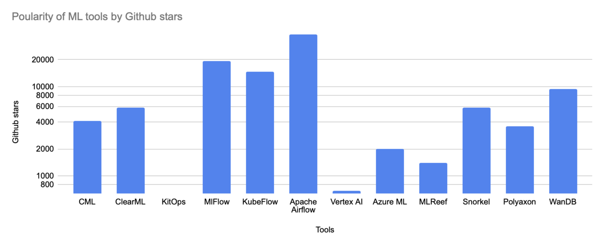
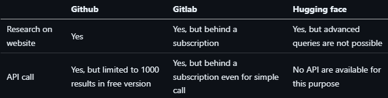
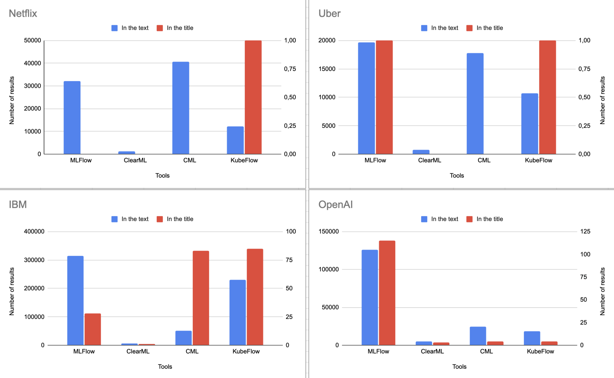
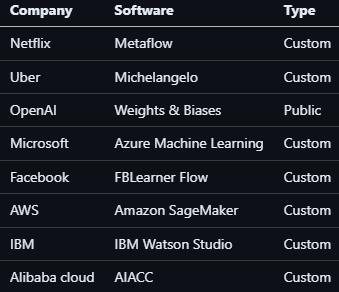
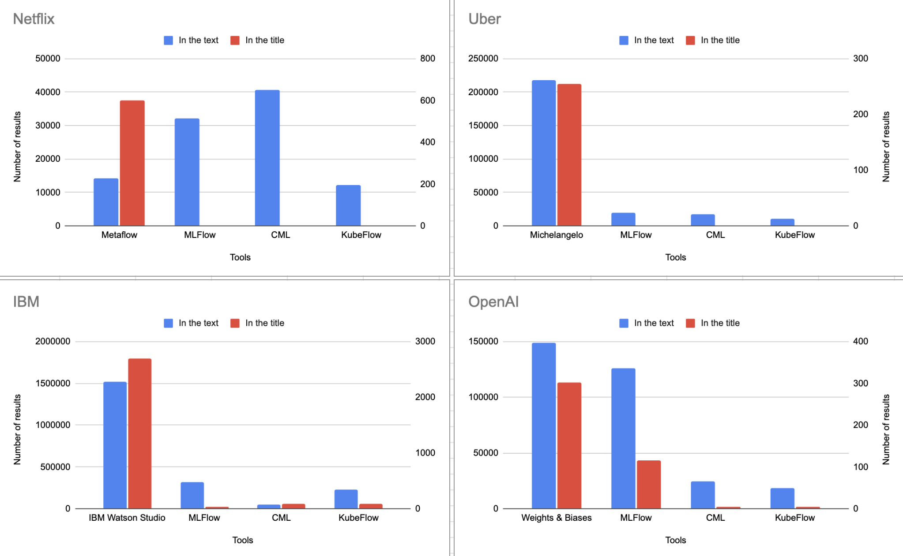
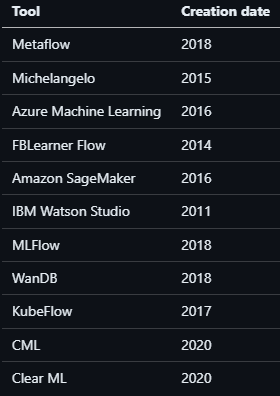

### Authors

- Axel Delille : Axel.delille31+rimel@gmail.com
- Apoorva Srinivas Appadoo : apoorva.appadoo+rimel@gmail.com
- Fabien Airaud : airaudfabien+rimel@gmail.com
- Yvann Ponce : yvann@ponce-group.com

## Research context

In machine learning, monitoring the progress and performance of models is a critical aspect of development. This is achieved through the process of running experiments and implementing experiment tracking.

Experiment tracking focuses on collecting essential data such as metrics, model checkpoints, and other information to objectively evaluate and quantify a model’s quality. 

While experiments can be performed on local machines, the substantial computational demands frequently require their execution on distributed systems composed of multiple dedicated servers. To streamline the tracking of experiments on these distributed environments, specialized tools have become indispensable.

## General question

The core question we seek to address is whether these tools effectively fulfill the needs of developers in machine learning.

### Sub-questions

- Are experience tracking tools genuinely being adopted by the industry? 
- Do companies use different tools compared to open-source organizations?
- What influences the adoption or rejection of these tools?

## Key words

Machine Learning, MLOps, continuous deployment, experiment management, hyperparameters, open-source tools, software adoption, AI development, machine learning pipelines.

## Methodology

For the following sections, we will analyze both open-source and private utilization of solutions separately.

This distinction is necessary because our approach differs depending on whether we have access to the source code (open source) or not (private solutions).

For the open source solution, we talk about usage for tools that are documented and used in open source projects.

## Open source study

### Methodology

- **What tools exist to respond to this?**

For this part of our study, we will choose the analyzed solutions based on their popularity as well as their existing features. To do this, a simple metric that we could exploit is the number of stars and forks on GitHub. 

Our research has allowed us to find 11 MLFlow tools. The following figure represents the tools found based on their number of stars on GitHub.

- **Are these tools actually used? If not, what is the justification for it?**

For open-source solutions, we started by identifying the tools of interest and selected the following : 
- CML
- ClearML
- MLFlow
- KubeFlow
- Weight & Biases (WanDB)

We thoroughly reviewed their extensive documentation to understand their existing functionalities and identify those related to experiment tracking.

Next, we gathered metrics for each of these tools. Since they are open source, we decided to perform repository mining to collect the data ourselves.

To analyze the repositories of the consumers using these tools, we needed to query developer platforms such as GitHub, GitLab, and Hugging Face, either through API calls or alternative methods.

Our initial experiment involved conducting a study of these three platforms to explore the capabilities each one offers.

We arrived to this conclusion :

Our conclusion for this part is that we'll need to use advanced query directly from Github search page due to API restrictions, and the other don't provide any solution on free tier.

But we need to make it automatic in order to conduct multiple experiments or tweak on our researches. In order to achieve that, we'll do webscraping (Using code to programatically do actions on a virtual browser in order to fetch data).

In the assets folder, you'll find a file named `github-mining.ipynb`, it's a Jupyter notebook containing all the code to replicate our experiment. To use it, create a `.env` file containing your Github credentials (or one of a dummy account). And provide a `conf.json` file in the same folder also similar to the one in the asset folder, it contains all the queries to run for each tools.

Our miner processes a configuration file named `conf.json` as input. This file contains a list of objects, each describing:

- The name of the required tool.
- A query to search on GitHub (either plain text or regex).
- The file extensions to analyze.
- The purpose of a specific part of the tool being searched for.

The purposes are classified into four categories:

- Global: Tracks overall usage statistics of a tool.
- Logging: Refers to checkpointing a model to save its state at a specific point during training.
- Metric: Gathers metrics from a run, such as loss, accuracy, or F1-score.
- Tuning: Involves experimenting with a model to adjust parameters for optimal performance in an experiment.

To ensure the correct purpose is assigned to each query and to refine the searches, we manually reviewed the documentation to determine which functions align with each functionality.

### Results

#### Tool by tool comparison

From the results extracted from the output file generated by the github-parser we were able to build some diagrams in order to guide our analysis.

Here, we can observe the tool usage data represented by the number of usages per tool. A significant majority of the usage comes from Weight and Biases (WanDB). To better understand this distribution, a pie chart can illustrate the percentage breakdown more effectively, as shown below:

Before delving into the feature-level breakdown for each tool, it’s important to address why such a noticeable gap exists between them.

A quick manual analysis of WanDB’s pricing model and its usage across several open-source repositories reveals that it is predominantly used for sending metrics and run logs to a managed WanDB instance for data visualization.

WanDB’s pricing structure is restrictive for large-scale usage, but it remains accessible for personal projects involving a low number of runs and a small amount of metric storage. This accessibility, combined with its simplicity, requiring no deployment of services even on the free tier, makes WanDB a popular choice.

#### Feature analysis per tool

Let's dive into the details for each tools of what they're used for.

We presented the data using a logarithmic scale to account for the significant differences in usage between the tools, as their utilization varies widely.

From the chart, it is evident that the tools are used for their metrics when focusing solely on experiment tracking.

However, it's also clear that a substantial portion of their usage is unrelated to experiment tracking. This observation lies outside the scope of our study, so we did not explore it further.

## Private companies study

### Methodology

The analysis of tools used in companies is carried out differently than for open-source projects. Indeed, companies do not share their source code. Therefore, we cannot use codebase mining to gather information.

Through extensive research, we identified three communication channels where companies share such information:
- Documentation pages
- Articles in specialized media
- Online forums

All these information sources are accessible online. We have thus used Google Dorking to conduct this study.

##### Data collection: Google Dorking

Google Dorking is an advanced search engine exploration technique, utilizing specific search operators to find precise information available online. By combining keywords with operators like `filetype:`, `inurl:`, or `site:`, this method allows identifying web pages, files, or data indexed by Google that match defined criteria.

We used Google's "advanced search" tool, where we applied the search criteria `allintitle:` and `allintext:`. Google provides a Python SDK that allows interacting with their search engine and executing searches across the web.

We operate on the assumption that the use of software is directly correlated with the amount of information available about it. Indeed, widely used software will have a more developed community that produces online content.

The script used to perform these searches is provided in the appendix of this paper.

### Results

With our experiments, we will first determine whether the public tools mentioned in the previous section are used in private companies, and identify which features of these tools are most crucial when developing with Machine Learning.

#### Do companies use different tools compared to open-source organizations?

Usage of MLOps tools in private companies

The analysis of the usage of major open-source MLOps tools did not yield conclusive results regarding their adoption in the studied companies.
We observe a low presence rate in title searches, which seem to filter the results better. For instance, for the tool CML, many acronyms unrelated to this specific tool were detected. Title search proved much more effective in discriminating these cases.

A notable convergence appears with OpenAI, where the use of MLFlow is confirmed by over 100 web pages containing both terms in their titles.

In contrast, for the other three studied companies, the number of web pages including the searched keywords in their titles is insufficient to draw solid conclusions.

Moreover, the results concerning IBM are biased due to the presence of numerous educational resources covering various subjects, like MLFlow. IBM offers educational services covering many technologies, without necessarily indicating they are used internally.

Initial research also included companies like Facebook, AWS, Microsoft, and Google. However, the study was limited by their role as cloud service providers. These platforms publish extensive documentation to help their users leverage their tools with cloud services, without necessarily reflecting the use of these tools within their own organizations.

#### Further research

Following these unexpected results, further research was conducted. The goal was to define the use of MLOps in these companies and the technologies used.

It turned out that these large companies all use dedicated software to manage their machine learning experiments. We found the following software:

We have thus added the proprietary tool to our research set in order to verify this hypothesis. Large companies use proprietary tools.

Use of MLOps tools in private companies

In this graph the proprietary tool is located on the left except for OpenAI, which uses the tool WanDB (Weights & Biases)

This new research clearly shows the dominance of the proprietary tool for these platforms and the correlation between keyword searches in the text and in the title of the page. We also notice that title-based search is more relevant for discriminating tools. Indeed, searching in the page text also includes links between content and references the site may make. It is then possible to find the keywords on the page simultaneously but concerning different subjects.

The trend of large companies using custom tools shows the importance they place on experience tracking in MLOps.

We also found that some large companies began designing these tools when the open-source sector was not yet developed on the subject.

### What factors influence their adoption

#### Major needs met by these softwares

Through our research, we found on these companies' blogs that all of these tools share common features that are crucial when developing with Machine Learning:

- **Organization and versioning of training sessions**

A key aspect of these software tools is the organization of training sessions, which allows for comparisons. This is precisely what MLFlow brought when it arrived. Before that, developers used Excel spreadsheets to organize and track their training sessions. This major functionality is also at the heart of proprietary platforms, fulfilling this role in a more integrated and efficient way.

- **Viewing metrics during training**

Machine learning training is expensive, so it is crucial to detect the performance of a dataset early to avoid unnecessary expenses. By analyzing the dynamics of intermediate training results, it is possible to anticipate whether the training will be successful. If not, the team can stop the training early, reducing costs and optimizing resources.

### Tools adoption

Big companies started their AI programs before the emergence of MLFlow and similar tools. At the time, no tools on the market met their needs, so they had to create their own.
 

Source: Github repositories | Official Websites

This representation clearly shows that private companies started developing tools like MLFlow and orchestration solutions before the open-source community got on board. Back then, the existing tools just didn't meet the needs of data scientists, so these companies had to create their own solutions. Some of these companies decided to release their tools as open-source, while others turned them into paid products. For example, AWS offers its tools as part of its cloud computing services.

However we can see that more recent companies like OpenAI are using publicly available tools like WanDB. This shows that there is a trend towards using open-source solutions when they get the job done, probably because these tools are getting better and have strong community support.

## Conclusion

In this report, we examined the array of experiment tracking tools used in machine learning, focusing on both open-source and private solutions. Our findings highlighted several important aspects:

1. **Needs of developers in Machine Learning**: ML developers require tools that facilitate the organization, versioning, and monitoring of training sessions to ensure efficient and effective model development.
2. **Existing tools**: We identified several popular tools used in the industry, including WandB, MLFlow, and KubeFlow. These tools have gained popularity due to their features and ease of use.
3. **Tool usage and adoption**:
    - **Open Source**: Open-source tools have seen varying levels of adoption. WanDB stands out as a widely used tool, likely due to its accessibility and comprehensive feature set. Other tools like MLFlow and KubeFlow are also popular but serve slightly different purposes within the machine learning pipeline.
    - **Private sector**: Many large companies developed their own proprietary tools before the advent of robust open-source solutions. Companies like Netflix, Uber and Facebook created custom tools designed to meet their specific needs. This trend highlights the importance of having dedicated solutions that address the unique demands of large-scale machine learning operations.
4. **Factors influencing adoption**: The choice between proprietary and open-source tools is influenced by several factors:
    - **Specific needs**: Proprietary tools often address highly specific requirements that off-the-shelf solutions cannot meet.
    - **Integration and scalability**: Custom tools can be better integrated into a company's existing ecosystem and can handle the extensive scale of their operations.
    - **Innovation and Control**: Building custom tools allows companies to innovate quickly and maintain control over features and updates.
5. **Shift to open-source solutions**: Recent companies, such as OpenAI, have shown a trend towards using open-source tools like WanDB. This shift is likely due to the increasing robustness and community support of open-source solutions, making them viable alternatives to proprietary software.

In summary, both proprietary and open-source tools are important for machine learning. Proprietary tools are custom-made for specific needs, while open-source tools are flexible and get better with community support. Choosing between them depends on what the organization needs and what resources they have.

## Related work

- [RIMEL 2024 - De DevOps à MLOps : Quelle place pour MLFlow ?](https://rimel-uca.github.io/chapters/2024/Traçabilité%20des%20expériences%20par%20MLFlow/content)
- [RIMEL 2024 - Are Data scientists embracing DevOps principles for Model versioning ?](https://github.com/RIMEL-UCA/RIMEL-UCA.github.io/blob/master/chapters/2024/Are%20Data%20scientists%20embracing%20DevOps%20principles%20for%20Model%20versioning%20%EF%80%BF/content.md)

## Tools

Used for public projects experiments
- [Jupyter Notebook - Github miner](./assets/open-source-study/github-miner.ipynb)
- [Jupyter Notebook - Data Visualization](./assets/open-source-study/data-visualization.ipynb)
- [JSON - Raw results](./assets/open-source-study/output.json)

Used for private companies experiments
- [Python - google dorcking script](./assets/google-dorking/search.py)
- [Excel - Data processing](./assets/google-dorking/Private%20companies.xlsx)

## Main sources
- Amou Najafabadi, Faezeh, Justus Bogner, Ilias Gerostathopoulos, and Patricia Lago. “An Analysis of MLops Architectures: A Systematic Mapping Study.” Zenodo, June 25, 2024. https://arxiv.org/html/2406.19847v1.
- Hodgson, Joel. “The 5 Stages of Machine Learning Validation.” Medium, December 9, 2022. https://towardsdatascience.com/the-5-stages-of-machine-learning-validation-162193f8e5db.
- Singla, Amandeep, and Tarun Malhotra. “Challenges And Opportunities in Scaling AI/ML Pipelines.” Journal of Science & Technology 5, no. 1 (January 29, 2024): 1–21. https://thesciencebrigade.com/jst/article/view/46.
