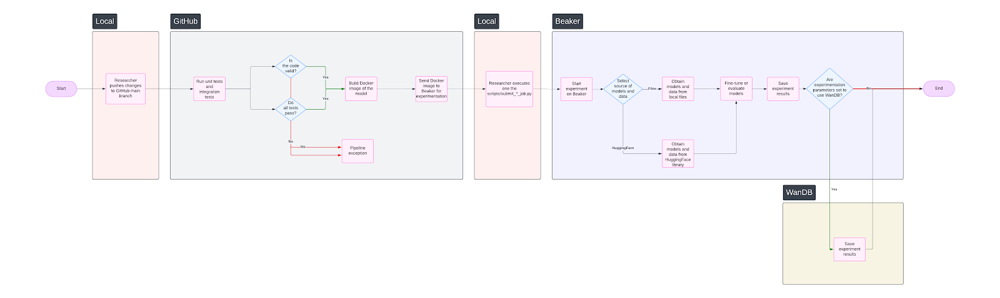
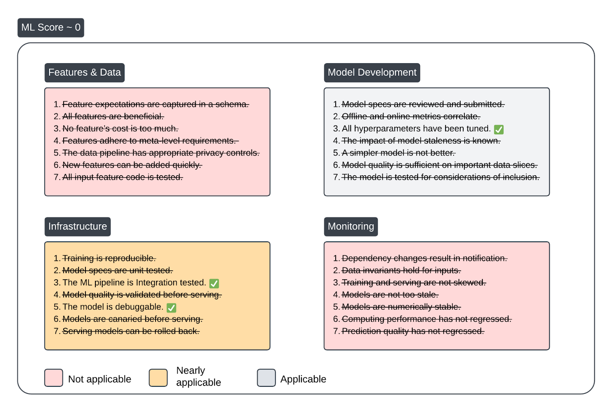
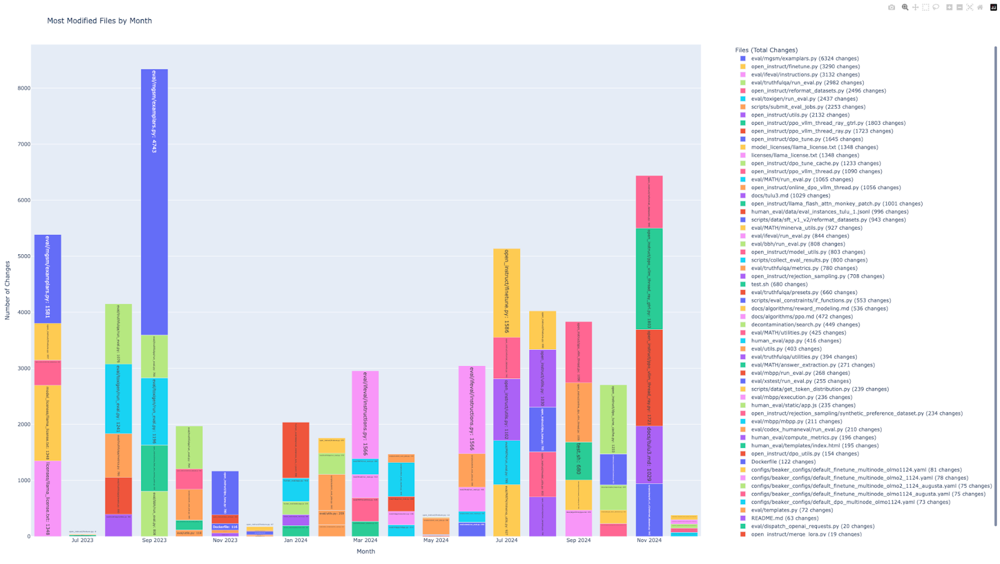
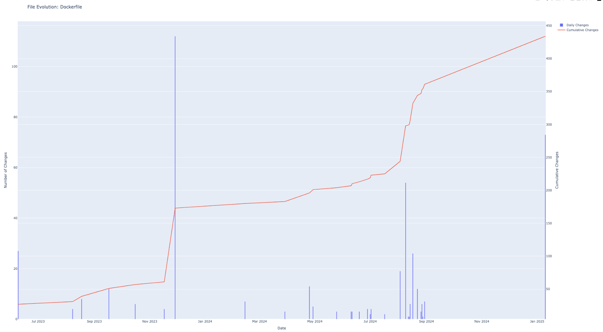
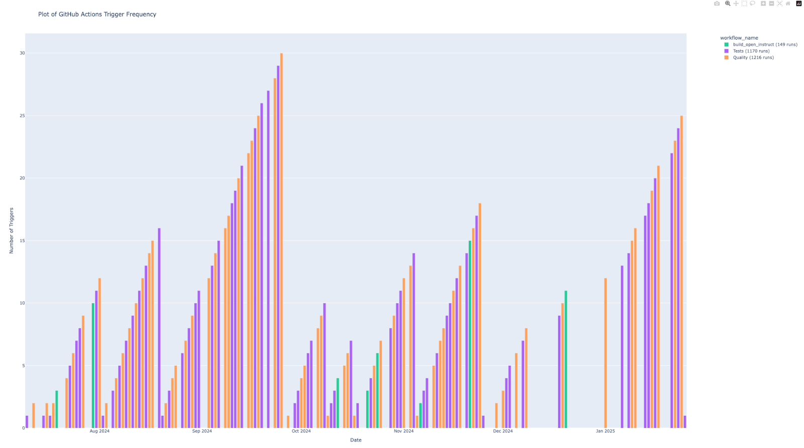
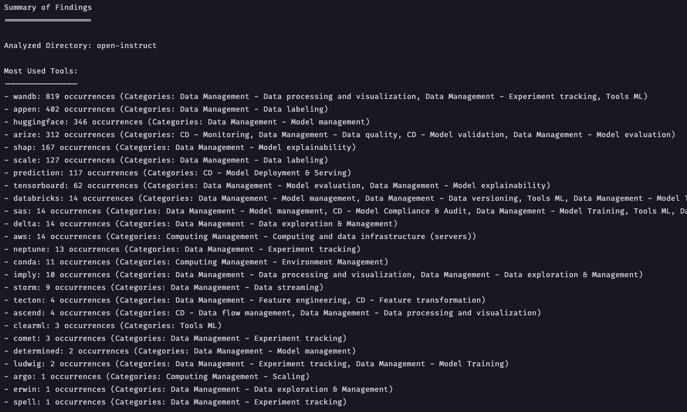
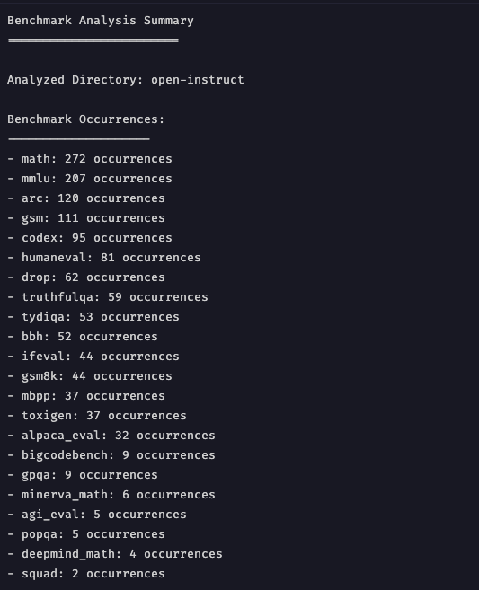

**_Janvier 2025_**

## Auteurs

Nous sommes quatre étudiants M2 à Polytech Nice Sophia, spécialisés en Sustainable Software Engineering :

* Adrian Negruta (adrian.negruta@etu.unice.fr)
* Dorian Fornali (dorian.fornali@etu.unice.fr)
* Dorian Girard (dorian.girard@etu.unice.fr)
* Pierre-Adrien Vasseur (pierre-adrien.vasseur@etu.unice.fr)

## I. Contexte de recherche

Dans cet article, nous nous intéressons à l'analyse des Outils CI/CD pour le Machine Learning et plus précisément à l’intégration du développement ML dans un pipeline CI/CD. Aujourd’hui, de plus en plus de modèles sont développés et sont au cœur de projets. Ces projets peuvent se concentrer sur le développement de ce modèle en particulier ou bien le modèle peut être seulement une partie du projet. Dans un contexte de travail d’équipe au sein d’un projet, donc avec plusieurs personnes qui collaborent, il est nécessaire d’avoir un traitement automatisé qui permettent d’entraîner, valider, tester et déployer le modèle en production. Malheureusement aujourd’hui, dans beaucoup de cas, il y a encore des étapes de gestion d’un modèle qui sont effectués à la main (préparation des données, entraînement, validation…), il est nécessaire pour la qualité, fiabilité et rapidité d’avoir un traitement complet et automatisé. 

## II. Observations et question générale 

Nous avons beaucoup hésité sur la question principale de notre article. Initialement, nous voulions nous concentrer sur l’évaluation des modèles dans un pipeline CI/CD. Rapidement, nous nous sommes sentis limités dans notre recherche et nos expérimentations. Nous avons donc décidé d’élargir un peu la question pour partir sur la suivante : 

**Comment intégrer le développement ML dans un pipeline CI / CD ?** 

Cette question est assez générale mais au fur et à mesure de nos recherches, nous nous sommes rendus compte que ce n’était pas une question si évidente que ça et qu’elle nous ouvrait la porte de beaucoup d'interrogations. En effet, très peu de projets open-source sur GitHub semble avoir un processus bien définie pour essayer d’automatiser le développement ML. Cette question ne se concentre pas sur l’ensemble des étapes du MLOps, nous souhaitons vraiment nous intéresser à la partie développement, la coopération, les outils utilisés… Selon nous, cette question est primordiale car elle s'interroge sur l’avancée actuelle de l’industrie qui doit faire face à de nombreux défis et problématiques dans un ensemble de domaines liés au Machine Learning (gestion des données, entraînement, évaluation, validation, déploiement, rollback…).

Pour répondre à cette question, nous avons définis un ensemble de sous-questions : 

- À quel point peut-on automatiser le processus de développement ML dans un pipeline CI/CD ? 

- L’intégration d’un processus automatisé est-elle immédiate ou progressive ? 

- Comment font les acteurs du domaine ? Retrouve-t-on des outils maison ou des outils SaaS ? 

- Quels sont les types de test que l’on peut effectuer pour évaluer la performance ? Est-ce que l’on retrouve des tests “maisons” ou plutôt des benchmarks connus ?

## III. Collecte d’informations

Afin de répondre à nos questions, nous avons tout d’abord décidé de rechercher des informations dans la littérature. Pour cela, nous nous sommes d’abord concentrés sur les articles de recherche fournis mais nous n’étions pas satisfait et nous avons donc décidé de poursuivre nos recherches dans le reste de la littérature avec des outils comme Google Scholar. Nous sommes finalement tombés sur l’article suivant : [“The ML Test Score: A Rubric for ML Production Readiness and Technical Debt Reduction“](https://ieeexplore.ieee.org/abstract/document/8258038/?casa_token=DO-zr_cW6IcAAAAA:OASb2cj8fbLKEiLWVI-8tN2kRKnxj7MYTxVBLhGtGh0omwJy_J847yB9l0JLZpUFobjyK_QmTcXstjM) \[1] de Google Research. C’est un article intéressant qui s'intéresse au calcul d’un score permettant de mesurer la qualité et la robustesse d’un pipeline MLOps en se basant sur un ensemble de tests et de règles. 

Par la suite, nous avons cherché à connaître les outils MLOps les plus populaires, cela nous a permis d’avoir une base d’outils que l’on pourrait retrouver ensuite dans des projets de développement ML open-source sur GitHub.

Pour trouver ces projets, nous avons listé les modèles LLM open-source les plus connus et nous avons cherché dans les projets s’il y avait des traces d’une quelconque automatisation (présence d’actions GitHub, présence de Dockerfile, présence de fichier de pipeline type CircleCI, présence des outils MLOps découverts précédemment…). Nous avons eu beaucoup de mal à trouver des projets qui soient un minimum automatisés. Nous avons finalement trouvé le projet [“open-instruct”](https://github.com/allenai/open-instruct) de l’institut [AllenAI](https://allenai.org/) qui est un repository contenant l’ensemble des scripts et des outils permettant d’entraîner les modèles LLM open-source Tülu 1, 2 & 3. Ces modèles se basent sur Llama 3 et sont des modèles “Fine-Tune”, il n’y a donc pas de grosses étapes d'entraînement mais on y retrouve des étapes de post-entraînement, de test, de validation etc. Ce projet contenait un ensemble de fichiers d’automatisation (Actions GH, Dockerfile…) il remplissait donc nos critères. En plus de cela, l’institut AllenAI est très ouvert, il y a donc un ensemble d’articles intéressant par rapport à leurs modèles et projets sur leur [blog](https://allenai.org/blog), ces articles nous ont parfois permis de comprendre certains outils utilisés ou choix techniques. 

## IV. Hypothèses et expériences

Afin de répondre à nos sous-questions, nous allons mettre en place un ensemble d’hypothèses et d’expérimentation pour y répondre : 

### Hypothèses 1

_On est capable d’automatiser l’ensemble du processus de développement ML dans un pipeline CI/CD._

Pour répondre à cette hypothèse, nous allons identifier l’ensemble des étapes automatisées liées au projet “open-instruct” et essayer de calculer un ML Score pour ce projet en se basant sur les règles de l’article \[1]. 

### Hypothèses 2

_L’intégration du développement ML dans un pipeline CI/CD est progressive._ 

Pour répondre à cette hypothèse, nous allons développer des scripts permettant de suivre les fichiers les plus modifiés dans un projet par mois. Cela va nous permettre d’identifier des périodes où l’équipe s’est concentrée sur l’automatisation des tâches ML dans un pipeline. Ensuite, nous allons développer un script qui nous permettra de suivre l’évolution des modifications d’un fichier au cours de la vie du projet. Enfin, nous allons développer un troisième script qui permettra de connaître la fréquence de lancement des GitHub actions dans ce projet par mois. Cela nous permettra de potentiellement corréler une augmentation des exécutions des GitHub Actions avec des modifications précises du code. 

### Hypothèses 3

_Les acteurs du domaine utilisent principalement des outils SaaS populaires._ 

Pour répondre à cette hypothèse nous allons reprendre la liste des outils MLOps identifiés lors de notre collecte d’informations afin de développer un script qui se basera dessus en recherchant dans le projet la présence de ces outils. Les outils seront séparés en différentes catégories et cela nous permettra d’identifier potentiellement des catégories où le projet est plus enclin à dépendre d'outils externes. 

### Hypothèses 4

_Pour évaluer la performance, les acteurs du domaines utilisent des benchmarks reconnus._ 

Pour répondre à cette hypothèse, nous allons identifier les benchmarks les plus utilisés pour le développement de LLM et nous allons développer un script permettant de déterminer la présence de ces benchmarks ou non dans le projet. 

## V. Résultats d’analyse

### Expérience 1

#### Présentation des résultats

En utilisant les principes de la Rétro-Ingénierie, nous avons identifié le flow de déploiement suivant : 

Ce diagramme est le résultat de notre analyse et de notre compréhension de leur méthode de travail. Nous avons identifié les sections du projet les plus importantes, nous nous sommes séparés chaque section pour en identifier le fonctionnement et nous avons regroupé les informations obtenus pour en déduire le flow ci-dessus. 

Comme vous pouvez le voir, le flow démarre lorsque des chercheurs envoient du code sur la branche “main” du projet. Cela déclenche un ensemble d’actions sur GitHub. On y retrouve des actions qui permettent de valider syntaxiquement le code ainsi que de tester les méthodes utilitaires du projet (est-on capable d’aller chercher des données et modèles chez HuggingFace…). Si l’ensemble des tests passent, alors on construit une image Docker qui va contenir l’ensemble des scripts de fine-tuning, de validation, de testing, de benchmarks. Cette image Docker va être envoyée sur Beaker. Avant de continuer le flow, il faut expliquer ce qu’est Beaker. Beaker est une plateforme privée qui permet aux chercheurs d’AllenAI de lancer des centaines d’expérimentations par jour. Afin de centraliser et normaliser les environnements, l’institut a mis en place un cluster de machine pré-configuré et accessible via une certaine API. La plateforme propose ensuite les résultats sur un environnement centralisé. Cela simplifie donc le travail de communication entre les chercheurs, chacun n’a plus un environnement spécifique et une manière de travailler différente. Ces informations ont été trouvées sur le blog d’AllenAI [ici](https://allenai.org/blog/beaker-ed617d5f4593). 

Reprenons l’explication du flow. Une fois que l’image Docker est à jour sur Beaker, les chercheurs peuvent lancer des scripts python en local qui vont lancer différentes expérimentations sur Beaker (fine-tune, évaluation…). Selon l’expérimentation, le modèle et les données peuvent être récupérés depuis un volume local ou alors depuis HuggingFace. Une fois l’expérimentation exécutée, les résultats sont disponibles sur Beaker mais ils peuvent aussi être envoyés sur WanDB qui est une plateforme SaaS permettant de faire du MLOps.

Ensuite nous avons essayé de calculer le ML Score de ce projet. Nous avons donc extrait les règles de l’article \[1] et nous avons essayé de les appliquer à ce projet. 

Comme le montre le résumé de notre calcul du ML Score, on voit que certaines catégories ne sont pas applicables à ce projet. En effet, la première catégorie “Features & Data” n’est pas applicable car ce projet ne traite pas du tout avec les données. Ces dernières sont soit récupérées sur HuggingFace soit déjà présente sur Beaker, on n’a donc aucune vue sur ce qu’ils utilisent vraiment. La deuxième catégorie “Model Development” est applicable mais nous n’avons trouvé qu’un élément dont nous pouvions être sûr. Pour le reste des tests, nous ne pouvions pas confirmer ou infirmer réellement leur résultat. La troisième catégorie “Infrastructure” n’était pas totalement applicable. En effet, nous n’avons pas la vue sur ce qu’il se déroule sur Beaker et le reste de l’infrastructure. Il est donc difficile de déterminer l’ensemble des points. Cependant nous avons pu mettre en évidence 2 points parmi ces tests. Tout d’abord, nous avons vu avec les différents GitHub actions qu’ils avaient un ensemble de tests. Ensuite, en observant [les fichiers de configuration](https://github.com/allenai/open-instruct/tree/main/configs/beaker_configs) des expérimentations Beaker disponible sur le projet, nous avons trouvé des variables de configurations permettant d’activer ou de désactiver des logs et du debug, cela confirme le second test “The model is debuggable”. Enfin, pour la dernière catégorie “Monitoring”, étant donné que nous n’avons aucun accès à Beaker, nous ne savons pas s’il y a des quelconque actions liées au monitoring. En suivant la méthode de calcul du ML Score de l’article \[1], nous en avons déduit un ML Score de 0. En effet, la méthodologie veut que l’on prenne le plus petit score par catégorie et qu’on les sommes, cela donne donc 0.

#### Interprétation des résultats

À partir du flow que l’on a créé suite à notre analyse du projet, on peut en déduire que le processus n’est pas tout à fait automatisé. En effet, tout d’abord on remarque qu’il y a une étape de lancement des expérimentations exécutées à la main par les chercheurs. Ensuite, on peut supposer que la pipeline déduite n’est pas complète. Il est possible que d’autres actions soient réalisées du côté de Beaker et même après l’extraction des résultats. On pourrait imaginer une suite pour mettre en ligne le modèle sur HuggingFace ou autre. Cependant n’ayant la vision sur Beaker, nous ne pouvons qu’émettre des hypothèses. 

Il y a encore des interrogations sur cette pipeline identifiée. En effet, pourquoi avoir besoin WanDB si Beaker existe et inversement. D’après les informations que l’on a trouvées, ils ont un peu la même utilité. WanDB semble proposer des résultats d’expérimentation plus complets (information à prendre avec précaution, elle provient d’un ensemble de commentaire extrait du projet GitHub). On peut faire l’hypothèse que Beaker permet de faire tourner leur cluster de machine et s’ils migrent l’ensemble de leurs expérimentations sur WanDB ils ne pourront peut-être pas profiter de leur cluster existant. Nous avons essayé de déterminer une raison à l’apparition de WanDB mais WanDB est présent depuis le début du projet GitHub. 

En ce qui concerne le ML Score, nous avons été énormément limités par la typologie de projet (Fine-tune et évaluation d’un modèle existant) et le fait qu’une bonne partie de la pipeline est privée.

#### Conclusion de l’expérience

A partir des résultats obtenus, on ne peut pas confirmer notre hypothèse de base : “_On est capable d’automatiser l’ensemble du processus de développement ML dans un pipeline CI/CD.”._ En effet, une partie du processus est automatisé mais il reste des étapes critiques (déclenchement de l’expérimentation) qui ne le sont pas. De plus, si l’on se base sur le ML Score, il y a encore beaucoup d’améliorations à apporter pour avoir une pipeline CI/CD automatisée. 

Bien sûr, notre analyse est très limitée, tout d’abord, nous n’avons qu’une vue limitée du projet. Ensuite, nous ne nous intéressons qu’à un projet, il faudrait reproduire cette analyse sur plusieurs projets pour essayer de déduire une tendance. Nous aurions voulu essayer d’automatiser le calcul du ML Score mais cela demande d’avoir un accès complet à l’ensemble de la pipeline pour l’ensemble des projets identifiés, ce qui n’est vraiment pas évident.

### Expérience 2

#### Présentation des résultats

Pour répondre à cette hypothèse : “_L’intégration du développement ML dans un pipeline CI/CD est progressive.”,_ nous avons développé plusieurs scripts. Tout d’abord, nous avons développé [un script python](./assets/codes/most_modified_files_by_month_in_repo.py) qui permet d’avoir les X fichiers les plus modifiés par mois depuis la création du projet GitHub. Pour une visualisation plus claire du graphique, vous pouvez ouvrir le fichier [“monthly_file_changes.html”](./assets/results/monthly_file_changes.html) dans votre navigateur, vous aurez accès à un graphique interactif. En l'occurrence pour ce graphique, nous affichons les 5 fichiers les plus modifiés par mois. Ce script est intéressant car il met en évidence certains fichiers. Pour notre cas d’étude, nous avons essayé de nous concentrer sur des fichiers précis, par exemple des fichiers de scripting bash, des fichiers de configuration Docker ou des fichiers de configurations de job. 

Malheureusement, les fichiers modifiés sont majoritairement du code python lié à de l’évaluation, du finetune etc. Il y a très peu de fichiers qui nous intéressent qui sont référencés. On peut tout de même noter la présence d’un fichier “Dockerfile” qui est relativement beaucoup modifié ainsi qu’un fichier “test.sh” (supprimé depuis, il semblerait qu’il était utilisé simplement pour lancer des tests sur les environnements Beaker). 

Pour essayer de suivre les tendances de modification des fichiers, nous avons aussi développé [un script](./assets/codes/file_evolution_in_repo.py) qui nous permet de suivre ces tendances, nous l’avons par exemple appliqué au fichier “Dockerfile”, nous remarquons que le fichier est introduit dès le début du projet et qu’ensuite les modifications sont très rares mise à part un ensemble de modifications en septembre 2024. 

Puis nous avons développé un [troisième script](./assets/codes/github_actions_frequency.py) qui nous permet de suivre la fréquence de lancement des actions GitHub. Pour une visualisation plus claire du graphique, vous pouvez ouvrir le fichier [“github_actions_frequency.html”](./assets/results/github_actions_frequency.html) dans votre navigateur, vous aurez accès à un graphique interactif. Ce script nous apporte des résultats plus intéressants. Tout d’abord, on remarque qu’il y a très peu d’utilisation du flow “build_open_instruct” qui est pourtant le flow permettant de construire l’image Docker et de l’envoyer sur Beaker pour la suite des expérimentations. Par exemple, on remarque qu’entre Juillet 2024 et Octobre 2024, il n’y a eu aucune utilisation de flow. Pareillement, depuis début Décembre 2024, ce script n’est pas utilisé. Après inspection du script “push-image.yml” qui correspond à ce flow, nous avons découvert qu’il était restreint au niveau des fichiers et des branches qui déclenchent son lancement, ce qui explique sa fréquence de lancement beaucoup plus faible comparé aux autres scripts.  

#### Interprétation des résultats

À partir des résultats obtenus, on voit que dès le début du projet, ils ont directement mis en place des Dockerfile, des GitHub actions etc. Ces fichiers ont ensuite été très peu modifiés, seulement pour les mettre à jour afin d’intégrer de nouveaux dossiers (dans le cas du Dockerfile par exemple). 

En réalité, on se demande s’ils utilisaient réellement la partie MLOps de leur projet. En effet, avec le premier graphique sur le taux de modifications des fichiers du projet, on voit bien qu’il y avait des collaborateurs actifs et qui modifiaient des fichiers d’évaluation, de fine-tune donc vraisemblablement pour lancer de nouvelles expérimentations. Cependant, on voit sur le dernier graphique que très peu de job permettant de construire l’image Docker pour Beaker étaient lancés. 

#### Conclusion de l’expérience

A partir des résultats obtenus, il semblerait que l’intégration du développement ML se soit faite directement avec le pipeline CI/CD. En effet, dès le début du projet, ils ont mis en place un certain flow et ce dernier n’a pas vraiment évolué depuis. 

Cependant, étant donné que le commit initial du projet contenant énormément de fichier de base, on se demande si ce projet avait déjà été développé dans une certaine mesure sur un autre repository et à cette époque, peut-être avait-il développé le workflow de manière plus progressive.

### Expérience 3

#### Présentation des résultats

Pour répondre à cette hypothèse : ”_Les acteurs du domaine utilisent principalement des outils SaaS populaires._”, nous avons développé deux scripts, tout d’abord un script [“keywords_occurences_in_repo.py”](./assets/codes/keywords_occurences_in_repo.py) nous permettant de trouver les occurrences d’un mot-clé dans un repository avec les fichiers où il intervient. Ensuite par dessus, nous avons développé un [“wrapper”](./assets/codes/mlops_tools_occurences_in_repo.py) à ce script qui nous permet de le lancer sur une liste prédéfinie de mot-clé qui ont été judicieusement choisie et triée en plusieurs catégories. Ce wrapper nous permet ensuite de créer un dossier “results_open-instruct/” ([ici](./assets/results/results_open-instruct/)) qui contient l’ensemble des résultats rangés par catégorie. Pour chaque catégorie, on obtient un fichier “heatmap.png” ainsi qu’un fichier texte de résultat brut. Ce fichier “heatmap.png” ne contient que les outils qui ont au moins 1 occurrence dans le projet. À la racine de ce dossier de résultat, on retrouve un fichier [“summary.txt”](./assets/results/results_open-instruct/summary_report.txt) qui résume l’ensemble des résultats : 

#### Interprétation des résultats

Ce fichier de résumé nous confirme ce que nous avons précédemment découvert en analysant le projet à la main. Ils utilisent principalement WanDB et HuggingFace ainsi que des outils comme Tensorboard, conda etc. Malheureusement, il y a aussi beaucoup de faux positifs (appen, arize…) qui sont dû à la qualité du script. 

#### Conclusion de l’expérience

À partir de ces résultats, nous pouvons confirmer l’hypothèse suivante : “_Les acteurs du domaine utilisent principalement des outils SaaS populaires._”. En effet, dans les résultats on retrouve un certain nombre d’acteurs connus du domaine MLOps. 

Cependant, cette analyse a des limites, en effet si l’on prend l’outil Beaker comme exemple, ce script est incapable de le détecter. C’est un outil privé qui n’est référencé nulle part mise à part dans ce projet et sur leur blog. Nous pouvons donc conclure que ce projet utilise des outils SaaS populaires mais pas seulement (Beaker par exemple). La recherche n’est donc pas exhaustive. 

### Expérience 4

#### Présentation des résultats

Pour répondre à cette hypothèse : ”_Pour évaluer la performance, les acteurs du domaines utilisent des benchmarks reconnus._”, nous avons repris le script [“keywords_occurences_in_repo.py”](./assets/codes/keywords_occurences_in_repo.py) et nous avons développé un nouveau wrapper par dessus [“benchmark_keywords_analysis.py”](./assets/codes/benchmark_keywords_analysis.py). À l’image de ce qui a été fait pour l’expérience n°3, nous avons fait en sorte d’extraire une liste des benchmarks les plus connus de l’industrie, nous les avons regroupés et nous avons fait un script qui permet d’avoir un résumé des occurrences de ces benchmarks dans un projet. Ces résultats sont disponibles dans le dossier å[“results_open-instruct/Benchmark”](./assets/results/results_open-instruct/Benchmark/). Il y a un fichier [“benchmark_heatmap.png”](./assets/results/results_open-instruct/Benchmark/benchmark_heatmap.png), un fichier [“benchmark_results.txt”](./assets/results/results_open-instruct/Benchmark/benchmark_results.txt) contenant l’ensemble des résultats ainsi qu’un fichier [“benchmark_summary.txt”](./assets/results/results_open-instruct/Benchmark/benchmark_summary.txt) contenant le résumé suivant des résultats : 

#### Interprétation des résultats

Ce fichier de résumé nous confirme ce que nous avons précédemment découvert en analysant le projet à la main. Ils utilisent énormément de Benchmark connus dans l’industrie. 

#### Conclusion de l’expérience

À partir de ces résultats, nous pouvons confirmer l’hypothèse suivante : “_Pour évaluer la performance, les acteurs du domaines utilisent des benchmarks reconnus._”. Cela ne nous étonne pas, en effet, il aurait été très étonnant de ne pas retrouver des benchmarks connus. Cela aurait empêché la comparaison avec d’autres modèles de l’industrie.

Cependant, cette analyse a des limites, en effet elle nous permet d’identifier la présence de benchmark connus mais, similairement à l’expérience n°3, elle ne nous permet pas d’identifier des benchmarks inconnus de l’industrie. 

## VI. Conclusion générale

### Conclusion

Cette étude nous a permis de découvrir une façon d’intégrer le développement ML dans un pipeline CI/CD. Ce n’était pas forcément ceux à quoi nous nous attendions, en effet, nous pensions trouver une utilisation majoritaire d’outils SaaS avec des workflows bien définie, à l’image de ce que l’on peut retrouver dans le Web aujourd’hui par exemple, les workflows sont globalement toujours les mêmes ou suivent la même structure.

Finalement, nous avons découvert un projet avec des solutions privées et des workflows difficile à identifier directement. Étant donné la quantité d’étapes à mettre en place (entraînement, fine-tune, validation, évaluation, déploiement…) ainsi que l’environnement requis (cluster de machines), on peut se douter que ce n’est pas évident d’essayer de se baser sur des solutions externes, surtout si le développement a commencé il y a quelques années.  

### Limites

En ce qui concerne les limites de notre étude, tout d’abord, nous pouvons noter que nous nous sommes intéressés seulement à un projet. Nous aurions voulu étendre notre analyse à plusieurs projets mais comme nous analysons les projets en profondeur, cela aurait demandé beaucoup plus de temps. 

De plus, les scripts que nous avons développés ne sont pas toujours pertinents ou efficaces. En effet, le script qui compte les occurrences des mots-clés devrait être un peu plus intelligent pour prendre en compte un contexte et éviter de remonter des faux positifs. 

### Perspectives

Par la suite, il serait intéressant d’étendre cette analyse à d’autres projets pour essayer d’identifier un pattern dans les façons d’intégrer le développement ML dans un pipeline CI/CD. De plus, il pourrait être vraiment utile d’automatiser l’utilisation des différents scripts pour avoir une analyse d’un projet assez globale dans un premier temps afin de déterminer si oui ou non ce projet vaut la peine d’être analysé plus en profondeur. Enfin, il serait vraiment intéressant d’avoir une méthode pour calculer automatiquement le ML Score d’un projet. 

## VII. Outils

### Pré-requis

- Python 3.10
- Un Personnal Access Token GitHub avec le scope "Repo"

### Installation

- Cloner le repository actuel ainsi que celui qui vous intéresse (en l'occurrence celui d'[open-instruct](https://github.com/allenai/open-instruct) dans notre cas)
- Installer les dépendances (`pip install -r ./assets/codes/requirements.txt`)

### Utilisation

Être dans le répertoire `./assets/codes`

Fichier les plus modifiés d'un projet : 
- `python3 most_modified_files_by_month_in_repo.py`

Évolution d'un fichier au sein d'un projet : 
- `python3 file_evolution_in_repo.py`

Fréquence des GitHub Actions d'un projet : 
- `python3 github_actions_frequency.py`

Utilisation des outils MLOps d'un projet :
- `python3 mlops_tools_occurences_in_repo.py open-instruct`

Utilisation des benchmarks dans un projet : 
- `python3 benchmark_keywords_analysis.py open-instruct`

Mots-clés :
- `python3 keywords_occurences_in_repo.py <liste de mots clés>`

## VIII. Références

Articles scientifiques :

- \[1]. Breck, E., Cai, S., Nielsen, E., Salib, M., & Sculley, D. (2017, December). The ML test score: A rubric for ML production readiness and technical debt reduction. In _2017 IEEE international conference on big data (big data)_ (pp. 1123-1132). IEEE.

Institut AllenAI : 

- AllenAI (<https://allenai.org/>)

- Blog de l’institut (<https://allenai.org/blog>)

- Article sur Beaker (<https://allenai.org/blog/beaker-ed617d5f4593>)

Projet GitHub :

- <https://github.com/allenai/open-instruct>

Liste des outils MLOps : 

- <https://campac.medium.com/mlops-and-ml-tools-landscape-v-1-0-january-2021-97339c9bdd8b>

 
