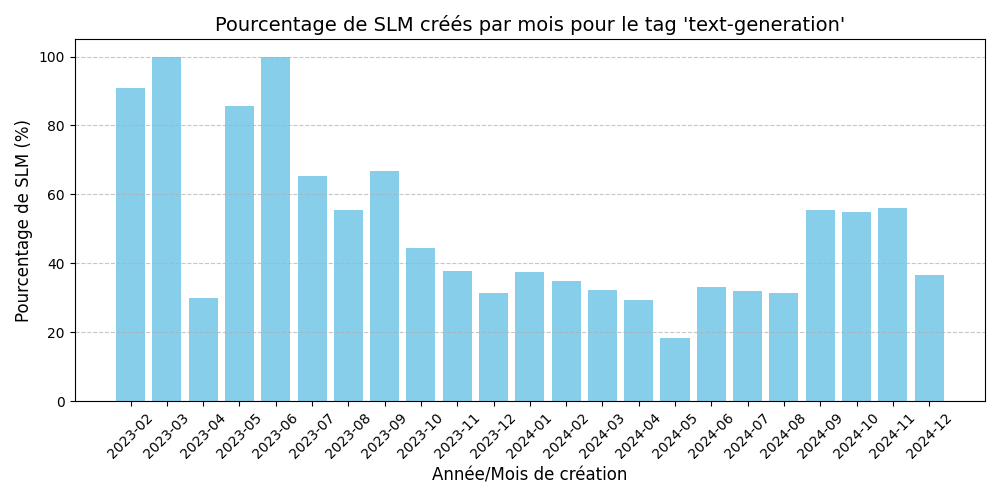

# LLM vs SLM (NL)

**_février 2025_**

## Auteurs

Nous sommes quatres étudiants de Polytech Nice-Sophia en spécialité Sustainable Software Engineering :
* [Dorian Bouchard](https://github.com/dirianDB) dorian.bouchard@etu.unice.fr
* [Julien Didier](https://github.com/JulienDidier-PNS) julien.didier@etu.unice.fr
* [Yasmine Moussaoui](https://github.com/yas-mous) yasmine.moussaoui@etu.unice.fr
* [Ivan van der Tuijn](https://github.com/Ivan-vanderTuijn) ivan.van-der-tuijn@etu.unice.fr

## I. Projet et context de recherche

Les Large Language Models (LLMs) sont de plus en plus présents dans notre société, où ils se distinguent notamment par leur capacité à générer et synthétiser des textes. Ces modèles présentent toutefois certaines limites, à la fois en termes de résultats et d’accessibilité. En effet, la croissance exponentielle du nombre de paramètres qui composent ces modèles a entraîné une augmentation significative de leur taille et des ressources nécessaires pour leur entraînement et leur utilisation. Par ailleurs, leur tendance à “halluciner” des informations erronées rend leur usage problématique pour des utilisateurs non avertis.

Récemment, une nouvelle approche émerge avec le développement de Small Language Models (SLMs), des modèles plus petits et spécialisés, qui visent à surpasser les LLMs dans des cas d’usage spécifiques. Grâce à leur taille réduite, les SLMs peuvent fonctionner localement, offrant une alternative plus légère et accessible tout en répondant à des problématiques ciblées.

Ce chapitre explore donc le sujet des SLMs vs LLMs. Plus précisément, cette étude a pour objectif d'analyser les tendances d'utilisation des SLMs et d’identifier l’intérêt et les limitations des SLMs par rapport aux LLMs actuellement utilisés.

Nous avons trouvé ce sujet particulièrement captivant, car il est au cœur de nombreuses discussions actuelles. Les avis divergent largement, avec des retours tant positifs que négatifs sur ces systèmes. Ce qui nous a semblé justifier une exploration approfondie pour mieux comprendre cette évolution des modèles de langage et leurs implications.

Une des finalités qui nous motive est de determiner dans quels cas d'utilisation un SLM pourrait se révéler plus pertinent qu'un LLM, et inversement. Étant donné que cette technologie est encore relativement récente, notre approche reste exploratoire et ouverte à de nouvelles découvertes.

## II. Observations et question générale

À partir de nos premières observations et de nos connaissances initiales sur les modèles de langages, nous avons remarqué que la distinction entre l’usage d’un SLM et d’un LLM n’est pas clairement définie ni implicite.
Cette absence de clarté peut poser des défis pour comprendre leurs avantages respectifs, leurs limites, et leur pertinence dans divers contextes d’utilisation.

Pour mieux cerner ces aspects, nous avons formulé la question générale suivante : **Quels sont les enjeux et les cas d’usage des SLM et des LLM ?**

Cette question nous a semblé intéressante, car elle englobe different aspects :
* Analyse des bénéfices et contraintes des deux types de modèles.
* Identification de scénarios où un modèle est préférable à l’autre.
* Guide sur les critères à prendre en compte dans des projets nécessitant l’utilisation de modèles de langages.

Pour préciser et structurer notre réflexion, nous avons décliné la question générale en plusieurs sous-questions clés, permettant une exploration approfondie.

1. **Existe-t-il un seuil de paramètres permettant de différencier SLM et LLM ?**  
   Bien que les SLM et LLM partagent de nombreuses caractéristiques, leur principale différence réside dans leur taille. Déterminer un seuil clair à partir duquel un modèle est considéré comme un SLM ou un LLM est la premiere étape pour les différencier et mieux comprendre leurs spécificités.

2. **Un SLM peut-il être aussi performant, voire plus performant, qu’un LLM lorsqu’il est appliqué à une tâche spécifique ?**  
   Cette question vise à explorer si, dans des contextes spécialisés, un SLM peut surpasser un LLM en efficacité et en précision, grâce à sa spécialisation et à ses besoins en ressources moindres.

3. **Quels sont les cas d’usage spécifiques aux SLM ?**  
   Identifier les domaines d’application où les SLM apportent une réelle valeur ajoutée par rapport aux LLM permet de formuler des scénarios types et de comprendre leur pertinence dans des contextes spécifiques.

4. **Quelles sont les tendances d’utilisation SLM/LLM ?**  
   Étudier les tendances actuelles et passés permet de mieux comprendre l’émergence des SLM et leur adoption progressive, tout en émettant des hypothèses sur leur évolution future.

Répondre à ces questions implique de surmonter certaines limitations, notamment :
* L’évolution rapide du domaine de l’intelligence artificielle, qui peut rendre certaines observations rapidement obsolètes.

## III. Collecte d'informations

### Articles
Pour la recherche d'information concernant les SLM, ainsi que les résultats de l'évaluation de leur performance faite par des benchmarks.  Nous avons consulté plusieurs articles scientifiques.  
* [A Comprehensive Survey of Small Language Models in the Era of Large Language Models: Techniques, Enhancements, Applications, Collaboration with LLMs, and Trustworthiness](https://arxiv.org/abs/2411.03350)  
* [Qwen2.5-Coder Technical Report](https://arxiv.org/abs/2409.12186)  
* [Gemma 2: Improving Open Language Models at a Practical Size](https://arxiv.org/abs/2408.00118)  
* [MedMobile: A mobile-sized language model with expert-level clinical capabilities](https://arxiv.org/pdf/2410.09019v1)  
* [BigCodeBench: Benchmarking Code Generation with Diverse Function Calls and Complex Instructions](https://arxiv.org/abs/2406.15877)  

Pour les recherches concernant les cas d'utilisations. Voici les sources que nous avons utilisés :
* [LM History](https://en.wikipedia.org/wiki/Language_model)  
* [Word2vec](https://fr.wikipedia.org/wiki/Word2vec)  
* [GloVe](https://en.wikipedia.org/wiki/GloVe)  
* [Transformeur](https://fr.wikipedia.org/wiki/Transformeur)  
* [Analyse des cas pratiques](https://www.autolex.ai/post/guide-pratique-des-cas-dutilisation-des-grands-modeles-de-langage-llm)  
* [SLM / LLM Comparaison guide](https://www.analyticsvidhya.com/blog/2024/11/slms-vs-llms/)  
* [Papier Microsoft - SLM/LLM](https://www.microsoft.com/en-us/microsoft-cloud/blog/2024/11/11/explore-ai-models-key-differences-between-small-language-models-and-large-language-models/)
* [Proposition d'evaluation des performances](https://ieeexplore.ieee.org/stamp/stamp.jsp?tp=&arnumber=10590016)  
* [SLM/LLM Diffrences in Langage Modeling](https://www.200ok.ai/blog/slm-vs-llm-understanding-the-differences-in-language-modeling/)

### Ressources
Nous avons utilisé les ressources suivantes pour nos expériences :
* [Hugging Face](https://huggingface.co/)  
* [Repository GitHub référençant les SLM et leur Technical Report](https://github.com/FairyFali/SLMs-Survey)  
* [BigCodeBench Leaderboard](https://bigcode-bench.github.io/)  

### Codes
Nous avons développé des codes permettant de récupérer, traiter et afficher les données provenant de l'API Hugging Face. 
Cela afin de mener à bien nos expériences.
Les codes utilisés se trouvent dans le répertoire `chapters/2025/SLM_vs_LLM-Team_C/assets/codes` du répository github.

### Datasets
Les données utilisées pour nos expériences proviennent de l'API Hugging Face.

## IV. Hypothèses et expériences

### Hypothèse 1 :  
Pour répondre à la sous-question "Existe-t-il un seuil de paramètres permettant de différencier SLM et LLM ?", nous avons initialement formulé l'hypothèse qu’il existe un seuil universel, reconnu et plus ou moins standardisé, pour différencier les SLM et les LLM. Cependant, nos recherches préliminaires ont montré que ce seuil n’est pas clairement défini. Nous postulons donc que ce seuil pourrait varier selon l’éditeur et son référentiel de modèles.

**Expérience** :  
Pour tester cette hypothèse, nous avons mené une série d’analyses visant à explorer les différences en terme de nombre de parametre entre SLM et LLM. Une analyse comparative des modèles publiés par les principaux acteurs de l’IA a été réalisée. Nous avons étudié les modèles développés par des entreprises telles qu’OpenAI, Microsoft, Google, QwenML, Mistral et d'autres, afin d’identifier leur taille (en nombre de paramètres) et la classification officielle qui leur est attribuée (SLM ou LLM), ainsi que la nature de la série à la quelle appartient le modèle.

Enfin, nous avons procédé à une synthèse des données récoltés. Cette démarche consistait à croiser les résultats obtenus pour dégager des tendances ou des seuils récurrents tout en identifiant les disparités potentielles liées au contexte d’application ou aux choix des éditeurs.

**Démarche :**
Notre démarche s’est appuyée sur la compilation des informations publiques disponibles concernant les modèles existants. Ces informations ont été collectées à partir d’articles, de publications scientifiques et de documentations officielles, mais aussi de l'API Hugging Face. Nous avons effectué une analyse quantitative des seuils identifiés, en mettant l’accent sur le nombre de paramètres et sur la classification adoptée par les éditeurs, qu’elle soit catégorisée comme "small", "large", ou autre. Une interprétation des résultats a suivi pour évaluer si un seuil commun pouvait émerger ou si ces seuils demeuraient spécifiques à chaque acteur.

**Points à expliciter :**
Les limites potentielles de cette analyse incluent l’incomplétude ou l’absence d’informations concernant certains modèles propriétaires, ce qui pourrait biaiser les conclusions. En termes de choix méthodologiques, nous avons décidé de concentrer initialement nos efforts sur les acteurs majeurs de l’IA, car ils façonnent largement les tendances actuelles du domaine. Nous avons également inclus des études académiques afin d’obtenir une perspective plus neutre et complète.

**Limites** :  
La cohérence des résultats de ces expériences est dépendante de l’évolutivité des seuils des paramètres de LLM dans le temps (ex : 2019 LLM : GPT-2 1.5B).

### Hypothèse 2 :  

Afin de répondre à la sous question "Un SLM peut-il être aussi performant, voire plus performant, qu’un LLM lorsqu’il est appliqué à une tâche spécifique ?", nous éméttons l'hypothese qu’un SLM peut atteindre des performances comparables, voire supérieures, à celles d’un LLM lorsqu’il est appliqué à des tâches spécifiques et bien définies. Cette hypothèse repose sur l’idée qu’un modèle plus petit, mais optimisé et spécifiquement entrainé pour une tâche particulière, peut surpasser un modèle généraliste plus grand, en termes de précision dans les résultats, tout en utilisant moins de ressources. 

**Expériences** :  
Pour tester cette hypothèse, nous avons conçu une série d’expériences visant à comparer les performances entre SLM (comme nous l'avons définit lors de la sous question précédente) et LLM sur plusieurs benchmarks spécialisés. Par exemple, nous avons étudié leurs capacités en génération de code en utilisant des benchmarks comme BigCodeBench, en mesurant la précision des solutions générées. De même, une comparaison a été réalisée dans le domaine médical avec des modèles spécialisés ou généralistes sur la qualité des réponse aux questions, en se basant sur des benchmarks comme MedQA. Nous avons également évalué les modèles sur l'inference du langage naturel via des benchmarks comme RTE. 

**Démarche** :  
Notre démarche a consisté à sélectionner des modèles SLM et LLM représentatifs, disponibles publiquement et bien documentés, ayant des tailles connue et variables. Les benchmarks ont été choisis pour couvrir un éventail de tâches représentatives, et les métriques spécifiques à chaque domaine ont été utilisées pour analyser les performances. Une synthèse des résultats a ensuite été réalisée pour identifier les cas où un SLM surpasse ou égale un LLM.

**Points à expliciter** :  
Les limites de cette analyse incluent la difficulté de généraliser les résultats obtenus au-delà des tâches et des benchmarks spécifiques étudiés, ainsi que les biais potentiels des benchmarks eux-mêmes, qui pourraient avantager un type de modèle par rapport à un autre. Nous notons également que des facteurs tels que les méthodologies de fine-tuning et les données d’entraînement jouent un rôle clé dans les performances observées, au-delà de la taille des modèles.

**Limites** :  
Les résultats de cette analyse dépendent fortement de la diversité des tâches sélectionnées. Par ailleurs, bien que la taille des modèles soit un facteur important, elle n’est pas le seul élément déterminant : les choix d’architecture ainsi que les données d’entraînement peuvent également influencer de manière significative les performances observées.

### Hypothèse 3 :

Afin de répondre à la sous question "Quels sont les cas d’usages spécifiques aux SLM ?", nous partons du même principe que l'hypothèse précédente. En effet, les SLM étant des modèles plus petits et entrainés de manière plus spécifiques, nous pouvons en déduire que ceux-ci seraient utilisés dans des cas assez précis et de manière répétées. Par exemple, un SLM spécialisé dans le code qui serait disponible pour les développeurs par exemple. Contrairement à un LLM, qui lui, serait utiliser dans un context plus global. Comme l'utilisation de GPT-4 de nos jours, ou les gens le sorte pour générer des exercices pour le sport, tester de nouvelles recettes de cuisines, etc...

Voici les sous-questions auquels nous allons tenter de répondre :
- A quel moment utiliser un LM, pour quel type de tâches ?
- Analyse de données sur HuggingFace

**Expériences** :  
Pour tester cette hypothèse, nous avons utiliser un outil HuggingFace qui nous a permis de récolter certaines métriques. Comme par exemple : Le type d'utilisation pour les modèles (via la notion de tags), mais aussi leur nombres de paramètres par exemple.
Cela nous permettra d’identifier les domaines pour lesquels les LM sont conçus. Sur la base de la façon dont ils sont présentés par leur éditeur.

**Démarche** :  
Notre démarche a consisté à nous baser, dans un premier temps, sur certaines analyses sur les cas d'usages des SLM/LLM. Par la suite, nous avons générer nos propres statistiques afin de confirmer notre hypothèse ou non ainsi que ces propos. Ces analyses proviennent de revues

**Points à expliciter** :  
Nous aurions apprécier trouver quelques informations supplémentaires comme les langages utilés pour développer le LM ou encore le type de dataset qui a été utilisé pour entrainer le modèle. Cela aurait pu permettre de savoir si un langage à permis de développer le dévoppement des LM par exemple, ou encore si un certain type de dataset est plus utilsé sur les SLM. Ce qui peut indiquer quels types de besoins les modèles doivent cerner le plus. Et voir, si en fonction des types de modèles, les SLM ou les LLM s’appuient sur des dataset communs ou pas dutout.

**Limites** :  
Les limites de cette analyse incluent reposent notamment sur un manque de données dans le temps via l'API HuggingFace. En effet, pour répondre à ce genre de question, il aurait été intéréssant de savoir si, par exemple, ces cas d'utilisations ont changés au cours du temps. Cependant, l'API ne nous permet que de tirer les dernières données sur les 30 derniers jours. La limitation dans le temps pour la rédaction de cet article ne nous a pas permis de pousser les recherches plus loin et de manière plus larges.

### Hypothèse 4 :  
Afin de répondre à la sous question **"Quelles sont les tendances d’utilisation des SLM/LLM ?"**  nous avons formulé l'hypothèse qu'avec la démocratisation du concept de SLM, les SLM gagneraient des parts de marché sur les LLM.

**Expériences** :  
Nous avons donc mené une série d'analyses afin de vérifier l'hypothèse suivante **"Les SLM gagnent des parts de marchés sur les LLM"**. Ces analyses ont été réalisées à l'aide des données fournies par l'API de Huggin Face.

**Démarche** :  
Nous souhaitions obtenir le nombre de téléchargements par modèle et par mois, ce qui nous aurait permis d'en déduire les tendances d'utilisations en compilant un grand nombre de données.
Cependant, l'API de Hugging Face ne fournit que le nombre de téléchargements par modèle sur les 30 derniers jours. Nous avons donc contourné ce problème en utilisant un autre paramètre donné par Huggin Face : la date de création des modèles.
En effet, s'il ne nous est pas possible d'obtenir des données sur les tendances des téléchargements nous pouvons en revanche en obtenir sur les tendances de créations des modèles.

Nous avons donc pour cela :  
**1.** Réuni un dataset des 10000 modèles les plus téléchargés sur les 30 derniers jours (à défaut de pouvoir les récupérer   directement par date de création).  
**2.** Défini s'ils étaient des SLM/LLM.  
**3.** Calculé l'évolution du ratio de création de LLM/LLM dans le temps.

Nous nous sommes ensuite demandés si l'évolution de ce ratio serait la même pour tous les types de modèles. En effet, comme expliqué précédemment, Huggin Face fournit des tags associés au modèle, qui permettent de définir les cas d'utilisation (classification, text-to-text, etc).
Nous avons donc réalisé l'expérience mentionnée ci-dessus pour chaque tag spécifique afin de déterminer si les résultats seraient homogènes entre les différents tags.

Nous avons donc :   
**1.** Défini les 20 types de modèles les plus téléchargés.  
**2.** Réuni un dataset de 2000 modèles pour chaque type.  
**3.** Calculé l'évolution du ratio de création de LLM/LLM dans le temps.

**Limites** :   
Impossibilité de récupérer des modèles créés à une date précise.
Certains LLM ne renseignent pas les sous tags qui sont englobés par leur tag principal ce qui fausse le calcul de la répartition SLM/LLM pour un tag précis.

### Hypothèse 5 :
Afin de répondre à la sous question **"Quelles sont les tendances d’utilisation des SLM/LLM ?"**  formulé une deuxième hypothèse qui est que les SLM étant bien plus faciles à entrainer que les LLM, les SLM populaires seraient rapidements remplacés par de nouveaux SLM plus performants. L'utilisation d'un SLM perdurerait donc moins dans le temps que celle d'un LLM.

**Expériences** :  
Nous avons donc mené une série d'analyses afin de vérifier l'hypothèse suivante **"L'utilisation d'un SLM perdure moins dans le temps que celle d'un LLM"**. Ces analyses ont été réalisées à l'aide des donnes fournies par l'API de Huggin Face.

**Démarche** :  
Pour chaque modèle, Huggin Face fournit des informations sur le nombre de téléchargements générés sur les 30 derniers jours ainsi que sa date de création. Ces deux informations nous permettent donc de déterminer quand ont été créés les modèles qui sont populaire aujourd'hui et ainsi en déduire la durée de vie des SLM/LLM.

Nous avons donc :   
**1.** Réuni un dataset des 10000 modèles les plus téléchargés sur les 30 derniers jours.  
**2.** Défini si ils étaient des SLM/LLM.  
**3**. Analysé pour chaque mois de création , quelle portion des téléchargements totaux des 30 derniers jours représentaient les modèles créés ce mois ci.
## V. Resultats de l'étude et conclusion

### Résultats de la première sous question :

Afin de répondre à la première sous-question, "Existe-t-il un seuil de paramètres permettant de différencier SLM et LLM ?", nous avons compilé des données représentées dans ce graphique. Celui-ci repose sur des informations issues de plusieurs sources fiables, notamment la plateforme Hugging Face, des recherches académiques, en particulier l’article intitulé "A Comprehensive Survey of Small Language Models in the Era of Large Language Models: Techniques, Enhancements, Applications, Collaboration with LLMs, and Trustworthiness" et les communications officielles faites par les editeurs.

Le graphique offre une synthèse des tailles des modèles de langage, exprimées en milliards de paramètres, ainsi que de leurs classifications respectives en tant que Small Language Models (SLM) ou Large Language Models (LLM). Ces données permettent de mettre en évidence des tendances et des marges définies par les éditeurs et chercheurs.

L’analyse des données issues de la compilation des données collectés, représentées sous forme de graphique, révèle qu’il n’existe pas de seuil universel pour distinguer les Small Language Models (SLM) des Large Language Models (LLM). Toutefois, des tendances émergent des classifications proposées par les éditeurs, permettant d’identifier des critères communs.

Tout d’abord, les marges de taille entre SLM et LLM semblent s’organiser autour de certains seuils. Les modèles ayant une taille inférieure à 7B sont principalement considérés comme SLM. Par exemple, des modèles comme Gemma 2B, Mistral 7B, et Phi3-small (7B) sont qualifiés de "small" ou "lightweight" par leurs éditeurs respectifs. En revanche, au-delà de 15B, les modèles tendent à être classés comme LLM. Cela est illustré par des exemples tels que Qwen2.5-14B ou Gemma2 27B classifié par Google comme medium, qui appartiennent clairement à la catégorie des LLM selon leurs concepteurs.

Sur la base de ces observations, et en accord avec les seuils définis par différents éditeurs, une limite claire se dessine : les modèles inférieurs à 7B sont considérés comme SLM, tandis qu’une marge d’interprétation persiste jusqu’à 14B voir 20B pour certains usages spécifiques. Cela reflète une certaine flexibilité dans la manière de qualifier un modèle comme SLM.

Un autre aspect mis en évidence par le graphique concerne l’adaptation des tailles aux domaines spécifiques. Certains éditeurs définissent des seuils différents en fonction de l’application ciblée. Par exemple, dans le domaine de l’audio, le modèle Qwen-Audio (8.4B) est classé comme "large", tandis qu’un modèle généraliste de taille similaire, tel que Gemma 7B, reste dans la catégorie des SLM. D'autre par des modèles comme Prompt-Guard-86M (Meta), avec une taille bien inférieure à 1B, est destiné à un usage trés spécifique, comme la lutte contre les attaques de prompt. Par ailleurs ce modèle illustre bien la flexibilité qu'offrent les modèles légers.

Les ressources matérielles jouent également un rôle important dans cette distinction. Les SLM, souvent open source, sont conçus pour fonctionner sur des infrastructures limitées, comme un ou plusieurs GPU grand public. 

Le graphique montre également une forte concentration autour de tailles spécifiques, telles que 2B, 7B, 14B et 32B, qui apparaissent fréquemment parmi les modèles développés par Google, Meta, Microsoft, et Qwen. Cette convergence suggère que ces tailles servent de points de référence pour établir la distinction entre SLM et LLM. Cependant, une zone d’interprétation flexible subsiste entre 7B et 15B, où certains éditeurs qualifient leurs modèles de "small", tandis que d’autres les considèrent déjà comme "medium" ou "large". Par exemple, Phi3-medium (14B), selon Microsoft, est toujours considéré comme "lightweight", alors que Qwen2.5-14B est classé comme LLM par Qwen.

Enfin, ce que ne montre pas les résultats de l'étude, est l’évolutivité des critères. Les tailles de modèles qui auraient été qualifiées de LLM dans le passé, comme GPT-2 (1.5B) en 2019, sont désormais considérées comme des SLM. Cela reflète une dynamique où la croissance des modèles, tant en complexité qu’en taille, redéfinit constamment les catégories. Des modèles comme Phi1-5 (1.5B) ou Qwen2.5-1.5B (2024) en sont des exemples modernes.

En conclusion, les données du collectés et leur représentation graphique soulignent qu’il n’existe pas de seuil universel pour distinguer les SLM des LLM. Cette distinction repose sur une combinaison de facteurs, notamment la taille des modèles, leur domaine d’application, et les choix des éditeurs. Cette tendance montre une frontière en constante évolution, rendant assez difficile l’établissement d’un seuil fixe.

### Résultats de la seconde sous question :

Les résultats obtenus dans le cadre de la sous question "Un SLM peut-il être aussi performant, voire plus performant, qu’un LLM lorsqu’il est appliqué à une tâche spécifique ?" et visent à valider l’hypothèse selon laquelle un modèle de langage spécialisé (SLM) peut atteindre des performances comparables, voire supérieures, à celles d’un modèle de langage généraliste lorsqu’il est appliqué à des tâches spécifiques. Pour cela, une série d’expériences a été menée, centrée sur differents domaine

#### Domaine question / réponses médicales
La première étude a porté sur le domaine médical, en utilisant des benchmarks comme MedQA (benchmark évaluant des questions réponses médicales.

Les résultats montrent que plusieurs SLM surpassent les LLM dans des scénarios précis, tout en utilisant un nombre de paramètres considérablement réduit. Par exemple, UltraMedical (8B) et MedMobile (3.8B) se sont distingués en dépassant des LLM tels que Clinical Camel (70B), GPT-3.5 (175B) et même Flan-PaLM (540B) sur le benchmark MedQA. En particulier, MedMobile (3.8B) a montré des performances impressionnantes en surpassant de nombreux plus larges modèles. Cela démontre qu’un modèle spécialisé peut effectivement surpasser des LLM généralistes, même ceux dotés de centaines de milliards de paramètres. Un autre exemple marquant est celui de VOD (220M), un modèle compact qui a surpassé Med-PaLM en utilisant 2 500 fois moins de paramètres, illustrant ainsi l'efficacité des SLM optimisés pour des tâches précises.

Cependant, certains LLM spécialisés comme Flan-PaLM (540B) et GPT-4 maintiennent des performances supérieures dans des tâches plus complexes nécessitant une compréhension générale approfondie. Leur avantage est particulièrement notable pour des tâches générales ou multi-domaines, où la capacité de généralisation est essentielle. Clinical Camel (70B), bien que conçu spécifiquement pour le domaine médical, se situe entre les SLM et les LLM de très grande échelle, mais il est parfois dépassé par des modèles plus petits comme UltraMedical dans des benchmarks spécifiques.

Il est à noté que le ratio taille/performance est également un avantage notable des SLM. Des modèles comme VOD (220M) et MedMobile (3.8B) montrent qu’une réduction drastique du nombre de paramètres n’entraîne pas nécessairement une baisse des performances, et bénéficient en rapidité d'inférence et reduction de ressoucess.

Cependant, ces résultats doivent être nuancés par certaines limites. D’une part, les benchmarks utilisés, comme MedQA-USMLE, étant spécifiquement orientés vers le domaine médical, il est difficile de généraliser les performances observées à d’autres domaines ou tâches. D’autre part, les performances des SLM sont étroitement liées à la qualité des données d’entraînement et des méthodologies de fine-tuning, des facteurs qui peuvent introduire des biais dans les résultats.

Les résulats trouvé dans le domaine de la médecine, confirment l'hypothèse initiale pour le domaine de la medecine.

#### Domaine de la génération de code

Les résultats du benchmark BigCodeBench montrent que les Small Language Models (SLM), bien que nettement plus petits en taille, peuvent rivaliser avec ou surpasser les Large Language Models (LLM) dans la tâche spécifique de la génération de code. Par exemple, Phi-3.1-Mini-128k-Instruct (4B) surpasse des modèles bien plus grands comme Qwen-1.5-110B-Chat (110B) ou DeepSeek-Coder-33B-Instruct (33B), malgré un écart important en nombre de paramètres. 

De même, Phi-4 (14B) montre des performances similaires à celles de Llama-3.1-405B-Instruct (405B), qui dispose de 29 fois plus de paramètres. Ces résultats soulignent que l’optimisation et la spécialisation permettent aux SLM d’atteindre des performances exceptionnelles, même face à des LLM généralistes de grande envergure.

Ces observations mettent en lumière l’importance de la spécialisation dans l’efficacité des modèles. Les SLM conçus pour des tâches précises, comme la génération de code, peuvent exploiter au mieux leurs ressources, rendant la taille moins critique. Bien que certains LLM dominent encore certains benchmarks, l’écart de performance avec les SLM n’est souvent pas proportionnel à la différence de taille. Ainsi, un SLM bien ajusté peut non seulement offrir des performances comparables, mais aussi être plus économique et efficace pour le besoin auquel il est spécialisé. 

En conclusion, oui, dans le domaine de la génération de code, un SLM peut être aussi performant, voire plus performant. L'hypothèse initiale se valide donc pour le domaine de ma génération de code.

#### Domaine de l'inférence en langage naturel

Dans cette section, nous avons comparé les SLM et LLM sur une tâche spécifique : l'inférence en langage naturel, en utilisant le benchmark RTE. Nous avons classé les modèles en quatre catégories principales :

**Very-small**: pour les modèles d'une centaine de millions de paramètres

**Sub-5B** : pour les modèles avec moins de 5 milliards de paramètres

**Sub-10B** : pour les modèles avec moins de 10 milliards de paramètres

**Very-large** : pour les modèles d'une dizaine à une centaine de milliards de paramètres

La première information pertinente tirée de ces résultats est que le modèle avec la meilleure précision appartient à la catégorie Sub-10B, avec 6 milliards de paramètres. Ce modèle est donc considéré comme un SLM et atteint une précision de 96%.

Les LLM , avec une centaine de milliards de paramètres, donnent généralement de bons résultats en termes de précision par rapport aux SLM. Cependant, il existe certains cas où la différence de précision n'est pas proportionnelle à la différence du nombre de paramètres. Par exemple, le GPT-3 avec 175 milliards de paramètres atteint une précision de 69%, tandis que le modèle senseBERT-base, avec seulement 110 millions de paramètres, donne une précision presque similaire de 67,5%.

D'autres exemples montrent que certains SLM, bien spécialisés, peuvent dépasser la performance de certains LLM. C'est le cas du modèle DeBERTa avec 1,5 milliard de paramètres, qui s'avère plus performant que le GPT-3.

En conclusion, ces résultats soutiennent l’idée qu’un SLM bien conçu et optimisé peut surpasser un LLM dans des tâches spécifiques, tant en termes de précision que d’efficience. Cela ouvre de nouvelles perspectives pour des applications nécessitant des modèles performants mais économes en ressources, notamment dans des domaines très spécialisés. Toutefois, l’avantage des LLM reste certain pour les tâches plus généralistes ou nécessitant une large capacité de généralisation.

### Résultats de la troisième sous question :
#### Hypothèse 3 "Quels sont les cas d’usages spécifiques aux SLM ?"
#### 1. A quel moment utiliser un LM, pour quel type de tâche ?

Il faut savoir que l'on connait les LM depuis plus longtemps que l'on ne le croit. Un LM n'est pas forcement obliger d'avoir une forme d'intelligence poussée. Les premiers LM qui ont vus le jour on commencer par des tâches très ciblées :
- Correction orthographique et suggestion de mots
- Reconnaissance vocale
- Traduction Automatique

Pour chaques langues, il fallait faire un nouveau LM. Pour chaque nouveau cas d'usage, il fallait en faire un nouveau.

Désormais, les LM sont pratiquement tous basés sur l'architecture Transformer que nous avons précédemment. Cette architecture à permis aux LM à monter en "intelligence".

Il est désormais possible d'avoir un LM qui puisse répondre à plus de choses en même temps. Cela est possible par, notamment :
- l'Augmentation des capacités des modèles. Au cours du temps, le nombre de paramètre n'a cesser d'augmenter, rendant la capacité des LM à comprendre mieux les informations qui lui sont données.

- l'Augmentation de la durée / du nombre de données lors de l'entrainement.
Avec le temps, les puissances de calculs ont permis d'entrainer plus vite les LM. Tout comme avec le temps, le nombre de data n'a cessé d'augmenter, ce qui permet aux LM de pouvoir s'entrainer sur des sources de données de plus en plus grandes.

Les cas d'utilisations de nos jours deviennent de plus en plus variés. Pour trouver un équilibre dans les utilisations, les LM ont été divisés en deux catégories (SLM et LLM).

Au final, on peut dire d'après les résultats précédents que les LM sont généralement utilisés pour de la génération de texte. Entre la traduction, la correction orthographique,... il semble que l'interface première entre les humains et ces LM soit le texte.
Nous pouvons donc supposer que, de nos jours, l'utilisation des LM ne se restreint pas à un seul cas d'usage mais à une multitudes de cas. Le choix entre un SLM ou un LLM dépend du contexte dans lequel nous souhaitons utiliser un LM. Comme vu par l'hypothèse précédente, nous pouvons partir du principe que les SLM soient utilisés pour des tâches bien précises ou la qualité des réponses est bien plus importante que le spectre d'action posssible du LM.

#### 2. Analyse de données sur HuggingFace

Pour vérifier tout ce que nous avons dit dans la partie précédente, nous allons utiliser l'outil HuggingFace qui permet à n'importe qui de déposer des LM mais aussi des données d'entrainement.

Nous avons choisit celui-ci car c'est le leader sur ce marché, c'est donc sur cette plateforme que nous serons les plus aptes à extraire des informations en grande quantitié pour essayer de confirmer ou non, si les LLM / SLM ont bien des cas d'usages différents et si oui, quels sont-ils.

Pour commencer, il faut savoir que sur HuggingFace, il n'y a pas de définition SLM/LLM. Tous les modèles sont des LM. Pour pouvoir donc différencier ces LM, nous avons appliquer la limite vu dans l'hypothèse précédente, qui est la limite des 7 Milliards de paramètres.

Avant d'analyser les résultats, nous tenons quand même ç mentionner que ces résultats ne représentent pas la réalité, nous avons essayer de faire au mieux mais plusieurs freins nous ont limités dans ces analyses :
- La période dans le temps est très courte. En effet, l'API de HuggingFace nous permet de récolter uniquement des données à l'instant ou nous les prenons. Par exemple, les statistiques sur les téléchargements sont valables uniquement sur les 30 derniers jours. Nous ne pouvons accéder a ces informations antérieures.

- Le manque d'informations dans les modèles. Bien que HuggingFace soit la plateforme de référence dans ce domaine, certains modèles manquent de données. Lors de l'execution de nos scripts, nous filtrons les modèles qui ont l'information sur leurs nombre de parmaètres ou non. Une grande partie des modèles présents sur la plateforme n'ont pas ce paramètre, ce qui entraine une inutilité du modèle pour nous.

Pour commencer notre analyse, nous nous baserons sur un jeu de donnée de 5000 modèles. Ces modèles ont été téléchargés par ordre décroissant de téléchargement.
Pour commencer, commencons par regarder quel est le ratio de SLM/LLM présent dans nos données.

On voit que les SLM sont plus présents de manière générale. Ce qui peut sembler logique car si les SLM sont aussi, voir plus puissant que les LLM mais pour des domaines bien spécifiques, pour un LLM bon sur tous les sujets, il faut créer un SLM pour chaques sujets.

Cherchons maintenant à voir quels types d’usages ont les utilisateurs avec les LM. Pour cela, les contributeurs aux LM peuvent attribuer à leur modèle un ou plusieurs “tag” qui permettent de mieux cibler le type de tâche du modèle. Nous pouvons nous baser là-dessus pour avoir une idée en fonction du type de modèle.

On remarque que les SLM ont des tags bien plus précis que les LLM. Les LLM sont clairement axés sur la génération de texte, avec une application dominante dans le traitement de texte complexe ou créatif. Les SLM sont beaucoup plus polyvalents, couvrant des domaines tels que la vision par ordinateur, la reconnaissance audio, et les analyses spécialisées. Ils répondent à des besoins variés, avec une utilisation répartie sur des tâches plus techniques ou spécifiques. Ce qui confirme notre hyptothèse précédente via les benchmarkings.

### Résultats de la quatrième sous question :  
#### Hypothèse 4 :   "Les SLM gagnent des parts de marchés sur les LLM"

Notre première expérience nous a permis de définir le pourcentage de SLM créés chaque mois par rapport au nombre total de modèles créés ce mois ci (SLM + LLM).
Une augmentation de ce pourcentage au cours du temps signifierait donc que les SLM gagnent des parts de marchés sur les LLM.

**Nota bene :** Nous n'utilisons que des modèles datant d'après 2023 car notre jeu de données n'est pas assez conséquent pour les modèles créés avant 2023.

Nous pouvons voir que le pourcentage de SLM créés par mois ((SLM/ (SLM + LLM)) * 100) décroit, ce qui pourrait signifier que l'hypothèse est fausse.
En revanche, cette décroissance peut être expliquée par le fait que nous ne pouvons pas récupérer les modèles par date de création. Nous les récupérons donc en fonction du nombre de téléchargements des 30 derniers jours (les modèles les plus populaires en premier).  

Notre seconde expérience visait à réaliser l'expérience précédente pour chaque tag spécifique afin de définir si les tendances de créations des SLM/LLM étaient homogènes en fonction des tags.

Voici les résultats pour les tages les plus populaires chez les LLM :

Le pourcentage de création de SLM augmente sur les 4  derniers mois. En revanche les résultats ne sont pas significatifs pour valider l'hypothèse, en effet nous observons une forte décroissance de début 2023 à début 2024.

Nous observons des résultats similaires à l'expérience précédente pour les tags qui sont les plus populaires chez les LLM. En revanche, comme mentionné dans les limites de l'expérience, les LLM ne renseignent généralement pas les tags qui découlent de leur tag principal ce qui donne les résultats suivants pour certains tags sous représentés chez les LLM : 

Les LLM ne renseignent généralement pas que leur modèle est capable de text-classification car ils se contentent de mettre un tag de plus haut niveau  d'abstraction (très souvent text-generation) ce qui biaise nos graphiques.

Les résultats pour tous les tags sont disponibles dans le dossier results/slm-percentage-by-tags.

Les résultats obtenus ne permettent donc pas de fermement valider l'hypothèse. En revanche nous observons une croissance du pourcentage de SLM créés ces 4 derniers mois.

#### Hypothèse 5 :  **"L'utilisation d'un SLM perdure moins dans le temps que celle d'un LLM"**

Notre expérience nous a permis de définir pour chaque mois de création , quelle portion des téléchargements totaux des 30 derniers jours représentaient les modèles créés ce mois ci.
Ce qui nous a donc permis d'obtenir les graphiques suivants respectivement pour les SLM et LLM.

**Exemple :** Les SLM créés en  04/2023 représentent 11% des téléchargements de SLM des 30 derniers jours.

**Exemple :** Les LLM créés en  05/2024 représentent 11% des téléchargements de LLM des 30 derniers jours.

Ces graphiques montrent donc que les SLM créés il y a plus d'un an représent 40% des téléchargements actuels de SLM, tandis que les LLM créés il y a plus d'un an représentent seulement 20% des téléchargements actuels de LLM.

Nous pouvons donc en conclure que les SLM perdurent bien mieux dans le temps que les LLM. Ce qui est contraire à l'hypothèse de départ qui était que les SLM seraient plus volatiles que les LLM car bien plus simples à entrainer.

### Conclusion (réponse à la question principale)

Les Small Language Models (SLM) et les Large Language Models (LLM) répondent à des enjeux et cas d’usage distincts, reflétant leurs spécificités respectives et leurs avantages. L’un des principaux enjeux réside dans la différenciation entre ces deux types de modèles. Aucun seuil universel ne permet de les distinguer de manière définitive, cette frontière dépendant de la taille, des applications visées, et des choix fait par les éditeurs. Cette flexibilité d’interprétation met également en évidence la rapidité avec laquelle le domaine du NLP évolue.

Un autre enjeu majeur est l’optimisation des performances en fonction des besoins spécifiques. Les SLM, grâce à leur conception ciblée, peuvent surpasser les LLM dans des tâches spécialisées, comme la médecine, la génération de code ou même l'inférence de langage naturel d'aprés nos résultats, tout en consommant moins de ressources. Cela leur confère un avantage stratégique dans des contextes où la précision et l’efficacité priment sur la généralisation. En revanche, les LLM restent incontournables pour des applications nécessitant une compréhension large et polyvalente, comme la génération de texte complexe ou créatif.

Les cas d’usage reflètent cette complémentarité. Les SLM sont particulièrement adaptés à des domaines techniques et spécialisés, tels que la vision par ordinateur, la reconnaissance audio ou des analyses ciblées. Les LLM, de leur côté, brillent dans des contextes généralistes, notamment dans le traitement de données textuelles riches et variées. Cette répartition des rôles montre que le choix d’un modèle dépend avant tout des besoins spécifiques de chaque projet.

Enfin, les dynamiques d’adoption et de pérennité des SLM et LLM révèlent des tendances intéressantes. Bien que les SLM gagnent en popularité, les LLM dominent encore les parts de marchés. Cependant, les SLM présentent une stabilité d’usage surprenante dans le temps, ce qui en fait des solutions fiables pour des applications spécialisées.

En conclusion, les enjeux des SLM et des LLM se situent dans l’optimisation de leur utilisation selon les besoins, avec une réflexion stratégique sur leur adaptation aux évolutions technologiques et aux cas d’usage variés. Ces modèles ne s’opposent pas, mais se complètent, permettant d’adresser des problématiques allant de l’hyper-spécialisation à la généralisation.

## VI. Outils 

L'intégralité du code utilisé pour réaliser cette étude est disponible dans le dossier codes. Pour récupérer les données de l'api de huggin face il vous sera nécessaire de créer un fichier .env à la racine du dossier codes contenant votre token d'api huggingface.
ex : `HUGGINFACE_KEY= <votre_token>`

Les scripts sont localisés dans le dossier src.
Le fichier main.py contient un script python qui permet de récupérer les données de HuggingFace et de les traiter pour obtenir les graphiques présentés dans ce rapport.
Les fonctions permettant de tracer les graphiques sont commentées pour éviter de tous les tracer d'un coup.

Pour plus de détails vous pouvez trouver les définitions des fonctions de tracés de graphiques dans le fichier trends.py et les fonctions de récupération des infos des modèles dans le fichier fetch_models.py.

## VI. References

[Debret 2020] Debret, J. (2020) La démarche scientifique : tout ce que vous devez savoir ! Available at: https://www.scribbr.fr/article-scientifique/demarche-scientifique/ (Accessed: 18 November 2022).
