## Authors

Nous sommes trois étudiants en M2 Informatique ou en dernière année à Polytech Nice-Sophia spécialisés en SSE (Substainable Software Engineering):
* [Melek Farhat](https://github.com/farhatmelek) &lt;melek.farhat@etu.unice.fr&gt;
* [Adjo Emmanuelle Adote](https://github.com/EmmanuelleAD) &lt;adjo-emmanuelle.adote@etu.unice.fr&gt;
* [Anna Di Placido](https://github.com/Annadip5) &lt;anna.di-placido@etu.unice.fr&gt;

.

## I. Contexte de la recherche

.

L’émergence croissante du MLOps et de ses outils, tels que KitOps, MLFlow et ClearML, répond à un besoin grandissant d’automatisation et de fiabilité dans la gestion des modèles de Machine Learning. Dans nos contextes professionnels actuels, où l’IA joue un rôle de plus en plus central dans les applications quotidiennes, il devient crucial de garantir que les modèles sont non seulement performants, mais aussi déployés dans les meilleures conditions possibles. En effet, l’intégration de l’IA dans les systèmes et services touche de plus en plus d’aspects de notre vie quotidienne, ce qui en fait une tendance incontournable. Pour cette raison, assurer la qualité, la fiabilité et la performance des modèles à travers des pipelines robustes et bien structurés devient essentiel.

Cependant, le développement et l’intégration des modèles de Machine Learning comportent des défis uniques, notamment en termes de tests. Tester un modèle de Machine Learning est déjà une tâche complexe, voire parfois impossible, en raison de la variabilité des données, des biais possibles et de la non-linéarité des comportements du modèle. Dès lors, une question se pose : comment tester efficacement un outil de MLOps qui facilite le déploiement, la gestion et la surveillance de ces modèles ? Les tests d’un outil MLOps sont eux-mêmes complexes car ils nécessitent de garantir que les pipelines qu’ils orchestrent fonctionnent comme prévu dans des environnements où l’incertitude des modèles de Machine Learning est omniprésente.

Ce sujet correspond parfaitement à nos objectifs d’apprentissage, notamment grâce à sa focalisation sur les aspects CI/CD des pipelines d’intégration et de déploiement. En nous familiarisant avec des outils et processus d’automatisation du cycle de vie des modèles, nous serons mieux préparés à gérer les défis techniques liés au déploiement d’applications intelligentes et fiables. De plus, cette thématique nous permet d'approfondir nos compétences opérationnelles, un domaine clé dans la gestion des applications en production. La maîtrise de l'automatisation des tests, des déploiements et de la gestion des flux de travail dans un environnement ML est de plus en plus demandée dans l’industrie, car elle garantit une meilleure qualité et une plus grande efficacité dans la mise en production des solutions d’IA. Ainsi, ce sujet nous offre une opportunité unique de nous préparer à un rôle clé dans la transformation numérique des entreprises, en nous équipant des compétences nécessaires pour déployer des modèles de Machine Learning dans des conditions optimales.

.

## II. Questions

### 🔍 Question principale 
***
#### *Comment l’efficacité et la fiabilité des outils MLOps sont-elles assurées à travers les pipelines ?*
(Cas de **KitOps**, **MLFlow**, **ClearML**, **MetaFlow**)

.

Cette question est intéressante car elle soulève des **enjeux cruciaux** liés à l'**automatisation** et à la **gestion des modèles de Machine Learning**, qui sont des domaines en pleine **évolution**. En particulier, comprendre comment **assurer une mise en production fiable et efficace** des **modèles ML** est essentiel pour les **entreprises** qui cherchent à tirer parti des **capacités de l'IA** tout en maintenant des **standards de qualité élevés**.

.

### ❓ Sous-questions 
***

1. *Qu’est ce qui differencie les workflows  mlops & devops  ?*

2. *Que font les outils choisis ?*

3. *Que font les WorkFlows CI/CD*

4. *En quoi consiste le testing de ces outils via github actions ?*

.

## III. Collecte d'informations

Pour répondre aux questions de recherche, nous avons défini des zones spécifiques pour orienter nos investigations et identifier les ressources pertinentes :

- **Articles scientifiques et publications en ligne** seront utilisées pour explorer et comprendre les distinctions fondamentales entre MLOps et DevOps. Les articles offriront un cadre théorique solide et des exemples concrets d'applications et de retours d'expérience.
- **Documentation** des outils sélectionnés sera au cœur de notre analyse pour détailler les fonctionnalités, les cas d'utilisation et les limitations spécifiques de ces outils. Elle constitue une source fiable pour comprendre leur rôle dans le cycle de vie des modèles de Machine Learning.
- **Workflows CI/CD GitHub et pipelines** existants pour des outils de MLOps seront analysés. Ces workflows offriront un aperçu pratique des stratégies de test et d'intégration continues mises en œuvre pour garantir la fiabilité des pipelines orchestrés par les outils MLOps.

.

### Outils et méthodologie
Outils MLOps ciblés : [KitOps](https://github.com/jozu-ai/kitops), [MLFlow](https://github.com/mlflow/mlflow), [ClearML](https://github.com/clearml/clearml), [Metaflow](https://github.com/Netflix/metaflow). 

Ces outils ont été sélectionnés en raison de leur popularité et de leurs fonctionnalités avancées dans la gestion des pipelines de Machine Learning.

.

## IV. Hypothèses et Expériences

.

## 🔍 Hypothèses
Voici les hypothèses formulées en lien avec nos questions :

#### 🟢 Hypothèse 1 : 
   L'efficacité des outils MLOps est liée à leur capacité à automatiser les étapes des pipelines. Cela inclut l'intégration, le déploiement, la surveillance et la gestion des modèles.

#### 🟣 Hypothèse 2 : 
   La fiabilité des outils MLOps dépend de leur robustesse face aux erreurs, de leur gestion des dépendances et de leur testabilité.

#### 🟠 Hypothèse 3 :
   Les workflows DevOps sont un sous-ensemble des workflows MLOps. En d'autres termes, les workflows MLOps viennent rajouter des étapes aux workflows DevOps tout en conservant intactes les étapes existantes déjà présentes dans un workflow DevOps.

#### 🔵 Hypothèse 4 :
   Les outils offrent des interfaces unifiées pour gérer la complexité des workflows ML, tout en facilitant leur intégration dans des pipelines CI/CD.

#### 🔴 Hypothèse 5 : 
   Les pipelines bien conçus permettent réduire les risques d'erreurs manuelles.

#### 🟣 Hypothèse 6 
   Les workflows CI/CD via GitHub Actions incluent des tests spécifiques au machine learning, tels que des simulations d’entraînement de modèles, la validation des logs générés et des tests de montée en charge pour garantir la robustesse des modèles avant leur déploiement.
   
   

.

## 🔬 Expériences
Pour valider nos hypothèses, nous mènerons les expérimentations suivantes :

#### 🟢 MLOps vs DevOps
Analyse des similarités et des différences entre les deux workflows en menant une étude distincte à partir des articles scientifiques et de la documentation disponible.

#### 🟣 Analyse des fonctionnalités des outils MLOps  
Analyse des principales fonctionnalités fournies par les outils sélectionnés (KitOps, MLFlow, ClearML, MetaFlow) pour évaluer leur adéquation avec les besoins du projet et déterminer dans quelle mesure les tests réalisés couvrent ces fonctionnalités.

#### 🔴 Tests GitHub Actions  
Analyses des types de tests utilisés dans les workflows CI/CD, leur utilité, leur fréquence, et leur répartition par phase.  
Identification des méthodes de gestion des modèles et des données dans ces tests.

.

## ⚠️ Limites
Cependant, il est important de prendre en compte certaines limitations qui peuvent influencer les résultats et les conclusions de nos expérimentations, telles que :

#### 🟠 Limitation liée à la sélection des outils 
Cette étude est basée sur une sélection spécifique d'outils (KitOps, MLFlow, ClearML, MetaFlow). Par conséquent, les conclusions tirées ne peuvent pas être généralisées à l'ensemble des solutions MLOps disponibles, car chaque outil peut présenter des caractéristiques uniques.

#### 🟡 Disponibilité des informations
Certaines documentations ou fonctionnalités des outils pourraient être incomplètes ou difficiles à évaluer sans accès direct à des cas réels d’utilisation.

#### 🟣 Évolutivité des outils MLOps  
Les outils évoluent rapidement, ce qui pourrait rendre certaines conclusions obsolètes à court terme.

#### 🔴 Expertise limitée en Machine Learning  
L’analyse des pipelines MLOps pourrait être influencée par une connaissance limitée dans certains aspects avancés du Machine Learning.

.

## V. Résultats et Analyses

.

### Qu'est-ce qui différencie les workflows MLOps des workflows DevOps ?

.

### DevOps : Un ensemble de pratiques

.

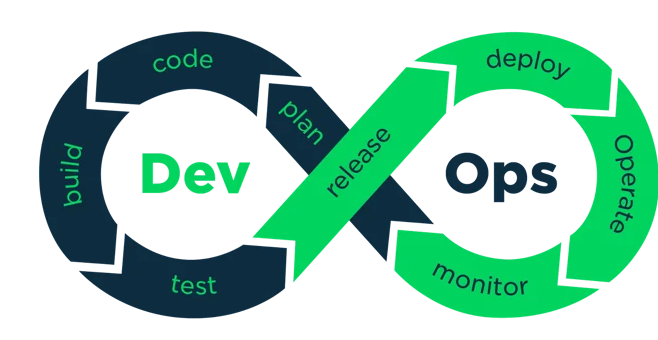

  
<em>Figure  : Workflow d'une application DevOps [2] </em>

.

Le DevOps est un ensemble de pratiques visant à réduire le temps de mise en production d'un logiciel en réduisant l'écart entre le développement logiciel et les opérations [1]. Le DevOps repose sur un workflow bien défini qui inclut les étapes suivantes [3] :
- Phase de planification : Les équipes identifient les nouvelles fonctionnalités à inclure dans la prochaine version d'une application.
- Phase de code : Les développeurs écrivent et vérifient les nouvelles fonctionnalités à l’aide de pratiques comme le développement piloté par les tests (TDD).
- Phase de construction : Le code nouvellement ajouté est fusionné, testé et préparé pour sa publication et son déploiement.
- Phase de test : L'application est soumise à un ensemble de vérifications pour s'assurer qu'elle respecte les standards et répond aux attentes.
- Publication : L’application est mise en place dans un environnement d’exécution pour valider sa conformité, sa qualité et sa sécurité. Les défauts sont corrigés avant la mise en production finale.
- Déploiement : Le projet est transféré dans un environnement de production, permettant aux utilisateurs finaux d’accéder aux nouvelles fonctionnalités.
- Opération : Les fonctionnalités mises en production sont suivies afin de garantir leur fiabilité, leurs performances et leur disponibilité.
- Surveillance : L'application est surveillée pour s'assurer qu'elle est suffisamment stable pour garantir le temps de disponibilité promis.

.

### MLOps : Un ensemble de pratiques pour le Machine Learning

.

Le MLOps est un ensemble de pratiques visant à maintenir et déployer le code et les modèles d'apprentissage automatique avec une grande fiabilité et efficacité. Le MLOps est né du désir d'appliquer les principes du DevOps au Machine Learning afin de bénéficier de caractéristiques telles qu'un développement et un déploiement plus rapides.

.

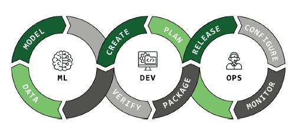

  
<em>Figure  : Workflow d'une application MLOPS </em>

.

Le workflow d'une application ML vise à automatiser le cycle de vie du Machine Learning. Ce cycle inclut plusieurs étapes importantes :
- Définition du problème : Le problème à résoudre est clairement défini.
- Collecte des données d'entraînement : Les données nécessaires à l'entraînement du modèle sont collectées.
- Préparation des données : Les données collectées sont nettoyées et préparées (normalisation, gestion des valeurs manquantes, etc.).
- Exploration des données : Une phase d'exploration permet de révéler des tendances et informations cachées dans les données.
- Sélection des fonctionnalités : Après l'exploration, les fonctionnalités pertinentes sont sélectionnées.
- Sélection du modèle : Un ou plusieurs modèles sont choisis en fonction du problème à résoudre.
- Entraînement du modèle : Le modèle est entraîné de manière itérative sur des données historiques.
- Évaluation du modèle : Le modèle est évalué et si l'évaluation est concluante, il est déployé.
Le MLOps introduit ainsi deux composants majeurs : les données et les modèles.

.

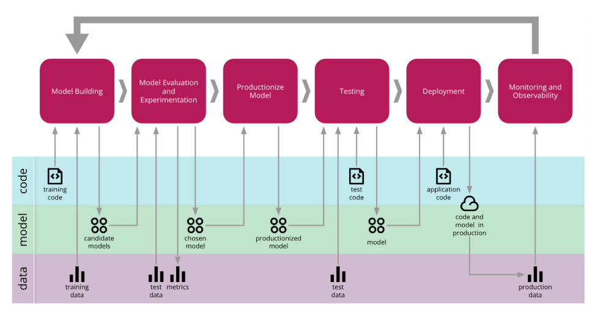

  
<em>Figure  :  Application d'intégration continue dans le Machine Learning  [4]</em>

.

### Analyses
Différences majeures entre MLOps et DevOps

.
 
1. Gestion des données et des modèles
   
Contrairement au DevOps, où l'on se concentre uniquement sur le code, le MLOps intègre les étapes liées aux données et aux modèles dans son workflow. Ces étapes supplémentaires permettent de gérer l'ensemble du cycle de vie d'un modèle d'apprentissage automatique.
Données : Les étapes de collecte à l'exploration des données sont réalisées pour préparer le modèle.
Modèle : Un ou plusieurs modèles sont sélectionnés, entraînés, évalués et validés.
2. Testing
Les tests en MLOps se concentrent principalement sur des vérifications spécifiques au modèle, telles que la convergence du modèle (s'assurer que le modèle atteint un état de perte acceptable) et la forme des tenseurs. En plus des tests unitaires et d'intégration classiques utilisés pour les modifications de code (notamment celles liées à l'ingénierie des caractéristiques et aux métadonnées des modèles), le MLOps met l'accent sur la validation des formats d'entrée et de sortie du modèle.
3. Deployment
   
Le déploiement des modèles ML est plus complexe que celui des applications DevOps traditionnelles en raison de la nature dynamique des modèles ML. De nouvelles données peuvent déclencher un réentraînement et un redéploiement du modèle. Ainsi, un pipeline automatisé et continu est essentiel pour réentraîner les modèles dès que de nouvelles données arrivent.
5. Monitoring
   
Le monitoring en MLOps va au-delà du suivi classique des applications. Il inclut également le suivi des paramètres spécifiques au modèle tels que la dérive des données (data drift) et la performance du modèle. La dérive des données indique que les nouvelles données ne correspondent plus à la distribution de données sur laquelle le modèle a été formé, ce qui peut nécessiter un réentraînement du modèle.
Conclusion
Le MLOps vient compléter et enrichir le workflow DevOps classique en y ajoutant des étapes spécifiques liées aux données et aux modèles. Ainsi, le MLOps peut être vu comme une extension du DevOps, où l'objectif est de gérer non seulement le code, mais aussi les données et les modèles dans un cycle de vie automatisé, continu et efficace. Les différences notables résident dans la gestion des données, des modèles, ainsi que dans des aspects spécifiques tels que les tests, le déploiement et la surveillance des modèles ML.

.

## 📊 ClearML

.

### Fonctionnement 
***
ClearML est une plateforme open source conçue pour gérer les workflows de machine learning (ML) de bout en bout. Elle permet de suivre les expériences, d’orchestrer les pipelines, de gérer les données et de faciliter la collaboration entre les équipes. Voici une description détaillée de son fonctionnement :

1. Suivi des Expériences (Experiment Tracking)

ClearML simplifie la gestion des workflows de machine learning grâce à une orchestration automatisée et une traçabilité complète. Une fois les pipelines définis par les utilisateurs, ses agents répartissent les tâches sur des ressources locales ou cloud, tout en assurant un suivi exhaustif des paramètres, métriques et dépendances. Compatible avec des frameworks comme TensorFlow, PyTorch ou Scikit-learn, ClearML garantit une intégration fluide dans les environnements existants, y compris avec Docker, Kubernetes ou des outils CI/CD. Son tableau de bord centralisé permet de visualiser et de surveiller en temps réel l’état des tâches, offrant ainsi une meilleure compréhension et optimisation des workflows, tout en garantissant leur reproductibilité.

2. Gestion des Pipelines (Pipeline Orchestration)

Pour gérer les pipelines de machine learning, ClearML offre un module de gestion des tâches. Cependant, il est important de noter que ClearML ne propose pas de pipelines préconfigurés, les utilisateurs doivent les définir eux-mêmes. Chaque étape, qu’il s’agisse du prétraitement des données, de l’entraînement ou de l’évaluation, est représentée par une tâche distincte. Les dépendances entre les tâches doivent être configurées manuellement pour assurer leur exécution dans le bon ordre. En outre, l’enregistrement des versions des scripts et des dépendances assure une reproductibilité totale des workflows.

3. Gestion des Données (Data Management)

La gestion des données est une fonctionnalité clé de ClearML. L’outil suit les données d’entraînement, de validation et de test tout au long du pipeline. Il offre une traçabilité complète en versionnant les datasets et en enregistrant les modifications apportées, comme l’ajout ou le filtrage de données. En cas de mise à jour des données, les pipelines associés sont également modifiés pour refléter ces changements.

4. Collaboration et Déploiement

ClearML facilite également la collaboration et le déploiement des modèles. Les équipes peuvent partager facilement leurs expériences, configurations de pipelines et datasets grâce à un tableau de bord collaboratif. Les projets peuvent être suivis en temps réel, avec des notifications en cas de succès ou d’échec des tâches. Pour le déploiement, ClearML propose des outils pour exporter les modèles et les intégrer dans des environnements de production. Il permet également de surveiller les modèles déployés et de les réentraîner en fonction des besoins opérationnels.

.

### Analyses
***

Dans le cadre de notre étude, nous avons examiné les workflows associés à l'outil ClearML, qui permet de gérer les expérimentations et de faciliter l'exécution de workflows dans des projets de machine learning. Cependant, lors de notre analyse, nous avons constaté que le workflow configuré dans le dépôt GitHub était spécifiquement destiné à l'exécution de CodeQL. CodeQL est un outil de détection de vulnérabilités et d'erreurs dans le code source. Son objectif principal est d'améliorer la sécurité et la qualité des projets en identifiant des failles de sécurité potentielles dans le code hébergé sur GitHub.

Le workflow de ClearML, tel qu'il est configuré, est planifié pour s'exécuter de manière périodique. En effet, le processus est déclenché automatiquement chaque semaine à 03h45. Toutefois, il est important de noter que ce workflow est limité dans sa portée. En effet, il se concentre uniquement sur l'exécution de l'analyse statique du code via CodeQL, sans intégrer des étapes fondamentales pour un workflow CI/CD complet.

Un autre point préoccupant concerne le manque de progression du workflow après son premier lancement. En effet, aucune évolution n’a été observée depuis le premier push, comme illustré sur la figure 1 On observe seulement deux commits liés au workflow : le premier concerne la configuration initiale des pipelines GitHub Actions, et le second met à jour la version de CodeQL. Ce comportement soulève des questions sur l'efficacité opérationnelle du workflow et sur sa capacité à s'adapter à un processus de développement dynamique. Malgré la maturité du projet, comme le montre la figure 2 avec la date du premier push, La fréquence d'exécution du workflow est également un point faible. En étant défini de manière périodique, à un horaire fixe chaque semaine, comme le montre la figure 3, il ne permet pas de réagir en temps réel aux modifications du code. 

.

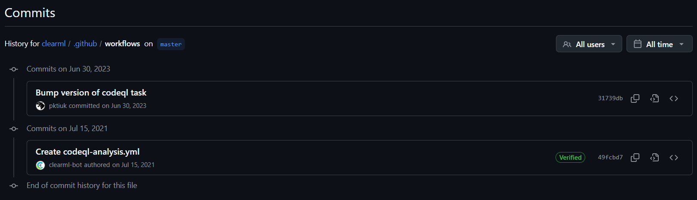

  
  
<em>Figure 1 : Commits liés au workflow depuis le premier push</em>

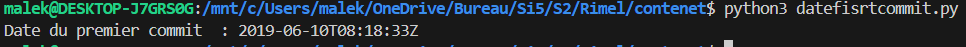

  
  
<em>Figure 2 : Date du premier push du projet et indicateurs de maturité</em>

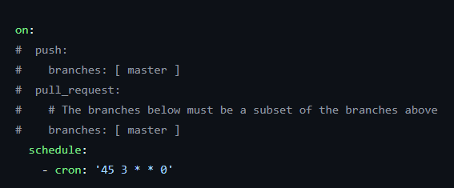

  
<em>Figure 3 : Planification périodique du workflow GitHub Actions</em>

.

### Conclusion
***
Le workflow actuellement configuré présente des limitations significatives, non seulement dans le cadre d’un environnement de développement ML (machine leaning), mais également par rapport à des workflows classiques. En se limitant uniquement à l’analyse statique du code avec CodeQL, il ignore des étapes fondamentales d’un pipeline CI/CD complet, telles que l’exécution de tests unitaires, de tests d’intégration ou le déploiement automatisé. Ces omissions compromettent sa capacité à garantir la qualité, la sécurité et la fiabilité du code.

En outre, la planification périodique du workflow, bien qu’automatisée, est peu flexible et inadaptée à des processus dynamiques. Contrairement aux workflows modernes qui s’appuient sur des déclencheurs en temps réel (comme un push ou une pull request), ce workflow limite la détection et la résolution rapide des erreurs ou vulnérabilités introduites dans le code.

Le manque d'évolution du workflow depuis son premier lancement souligne également une incapacité à s’adapter aux besoins changeants du projet, reflétant un déficit par rapport aux standards actuels. Ces limitations le placent non seulement en retrait par rapport aux bonnes pratiques modernes, mais aussi derrière les workflows classiques qui incluent généralement une couverture plus large des tâches critiques.

.

## ⚙️ KitOps

.

### Fonctionnement 
***
KitOps est une solution de packaging, versioning et partage spécifiquement conçue pour les projets d'intelligence artificielle (IA) et de machine learning (ML). Il s'intègre facilement avec les outils déjà utilisés dans les environnements de développement et DevOps. En tant qu'outil de gestion d'actifs, KitOps permet aux équipes d'IA/ML d'optimiser le stockage, la gestion des versions, et la distribution de leurs projets tout au long de leur cycle de vie.

1. Versioning et Gestion des Dépendances

Chaque ModelKit créé avec KitOps est tagué avec une version spécifique, ce qui permet aux équipes de savoir exactement quelle version des modèles et des datasets est utilisée ensemble. Cela réduit les risques liés à l'incompatibilité des versions dans les projets d'IA/ML complexes, où plusieurs composants doivent être étroitement couplés.

Au cœur de KitOps se trouve le concept de ModelKit, une unité de packaging qui inclut tous les éléments nécessaires pour reproduire un projet IA/ML localement ou pour le déployer en production. Un ModelKit peut contenir des modèles, des ensembles de données, des configurations et du code source. Chaque ModelKit est immuable, c'est-à-dire que son contenu ne peut pas être modifié après sa création. Cela permet aux entreprises de suivre et auditer les actifs à chaque étape du cycle de vie du projet.

2. Fonctionnalité de Déploiement

KitOps facilite également le déploiement de projets IA/ML. En utilisant une commande simple, il est possible de créer un conteneur exécutable à partir d'un ModelKit. Ce conteneur peut être déployé sur des environnements Kubernetes ou être exécuté localement à l'aide de Docker. KitOps génère des configurations de déploiement prêtes pour Kubernetes, ce qui simplifie le processus d'intégration dans un environnement de production à grande échelle. Cela permet une gestion fluide des déploiements, que ce soit en mode développement ou en production.

3. Unpacking Sélectif et Flexibilité

Une autre fonctionnalité importante de KitOps est le unpacking sélectif des ModelKits. Cette fonctionnalité permet aux utilisateurs de décompresser uniquement les composants nécessaires pour une tâche spécifique, économisant ainsi du temps et de l'espace de stockage. Par exemple, un membre de l’équipe peut choisir de ne récupérer que le modèle, tandis qu'un autre peut se concentrer uniquement sur les ensembles de données ou le code, selon ses besoins.

4. Automatisation et Intégration dans les Pipelines CI/CD

KitOps est conçu pour s'intégrer facilement dans des workflows CI/CD, permettant aux équipes d'automatiser la gestion des ModelKits dans des environnements de développement et de production. Des outils comme GitHub Actions peuvent être utilisés pour automatiser le packaging ou le déploiement des ModelKits. Cela permet de réduire les erreurs humaines, d’accélérer les cycles de développement et de tester les modèles de manière plus efficace.

.

### Analyses
***

Lors de notre étude de l'outil KtiOps, nous avons observé que ses pipelines sont structurés en plusieurs fichiers YAML, chacun dédié à des tâches spécifiques. Ces pipelines, conçus avec GitHub Actions. Voici une description détaillée des principaux fichiers de pipeline identifiés :

1. Pipeline build-deploy-docs.yaml

Ce pipeline a pour objectif principal de gérer automatiquement la construction et le déploiement de documents statiques sur GitHub Pages. Il est spécifiquement conçu pour la documentation du projet.

- Déclencheurs : mises à jour du dossier docs sur la branche main ou exécutions manuelles.

- Étapes principales :
  - Configuration de l'environnement pour la documentation.
  - Installation des dépendances.
  - Construction des fichiers statiques.
  - Déploiement fiable sur GitHub Pages.

Ce pipeline offre un flux automatisé pour maintenir à jour la documentation, garantissant une disponibilité rapide et efficace pour les utilisateurs.

2.  Pipeline build-devmode.yaml

Ce pipeline cible l'interface utilisateur du mode développement d'un projet frontend, en automatisant son processus de construction.
- Objectifs :
Vérifier que les modifications dans le dossier frontend/dev-mode ne causent pas d'erreurs de compilation.
S'assurer que le projet peut être construit avec succès.

- Déclencheurs : pull requests ou exécutions manuelles.

- Étapes principales :
  - Compilation du code.
  - Retour rapide sur les éventuelles erreurs de configuration ou de dépendances.

Bien qu'il ne génère pas encore d'artifacts ni n'exécute de tests, ce pipeline joue un rôle essentiel dans le workflow CI/CD. Il prépare le projet pour les étapes ultérieures, comme les tests ou le déploiement.

3. Pipeline next-container-build.yaml

Ce pipeline est dédié à la construction et à la publication d'images Docker pour le projet.

- Objectifs :
  - Garantir un processus automatisé et reproductible pour la création des images.
  - Publier directement sur GitHub Container Registry.

4. Pipeline pr.yaml:

Ce workflow GitHub Actions est conçu pour assurer sur la qualité et la conformité du code. Il commence par l'installation des dépendances nécessaires pour Go, Node.js et pnpm, suivie d'une vérification des dépendances avec go mod tidy pour garantir leur cohérence. Ensuite, des étapes de linting et de formatage sont effectuées pour s'assurer que le code respecte les normes de style et inclut les en-têtes de licence requis. Le workflow compile également le projet pour vérifier qu'il peut être construit avec succès, exécute les tests unitaires définis dans les fichiers *_test.go pour garantir la fiabilité du code, et effectuer des vérifications supplémentaires, telles que la validation des inclusions dans la documentation et la détection des espaces inutiles dans les fichiers. Ces étapes permettent d’assurer une intégration fluide et de maintenir un haut niveau de qualité avant la fusion des modifications dans la branche principale.

.

#### Les tests
***
Ces tests jouent un rôle central dans la validation et l’assurance qualité d’un outil MLOps, dédié à la gestion et au packaging d’artefacts de machine learning. Ces artefacts, appelés ModelKits, regroupent des modèles, fichiers, et configurations nécessaires pour exécuter ou déployer des workflows ML. L’objectif principal de ces tests est de garantir la portabilité, la reproductibilité et la robustesse de l’outil à travers des scénarios variés.

- Tests de KitOps pour la Gestion des Modelkits:

  Les tests vérifient plusieurs aspects du processus de gestion des modelkits. Un modelkit représente généralement un ensemble de fichiers nécessaires à l'exécution d'un modèle ou d'un pipeline de machine learning. Cela peut inclure des scripts, des fichiers de configuration, des datasets, etc. KitOps permet de gérer ces éléments en pack/unpack, garantissant ainsi une gestion efficace des dépendances et des configurations dans un environnement de machine learning.

  Les tests valident plusieurs opérations essentielles :

  - Création et organisation des fichiers : Les tests s'assurent que les fichiers nécessaires au bon fonctionnement du modelkit sont correctement générés et rangés dans les répertoires attendus.
  ou dans cahque models on peut trouver des fichiers qu'on veut igoner et des fichier qu'n veut inclure et donc ces tests valident que tous ces fichiers sont correctement pris en charge et manipulés.

  - Gestion des erreurs de packing : Si un modelkit contient des erreurs, le test vérifie que celles-ci sont bien capturées et que les messages d'erreur attendus sont générés.

  - Pack et unpack : Le test garantit que les outils KitOps sont capables de packager (Cette opération consiste à regrouper tous les fichiers définis dans un modelkit dans un format compressé, avec une gestion des erreurs en cas de problème) un modelkit, de lister son contenu, puis de le décompresser (unpack) dans un autre répertoire tout en respectant les règles de gestion des fichiers (inclus/exclus).

- Tests de Pack/Unpack 

  Ces tests se concentrent sur le processus de création, d'organisation, de packaging et de dépackaging des modelkits dans un environnement de gestion de fichiers. Contrairement aux tests des références des modelkits, cette série met l'accent sur la vérification de la reproductibilité et de l'intégrité des contenus tout au long du cycle pack -> unpack -> validation

  Principales validations effectuées :
    - Création et organisation des fichiers
      Ces tests simulent un environnement où différents fichiers sont créés dans un répertoire temporaire. Les fichiers à inclure ou exclure sont déterminés par deux fichiers de configuration Kitfile (spécifie les fichiers à inclure et Kitignore définit les fichiers à exclure.)
      Cela permet de vérifier que le système respecte correctement les règles définies pour inclure ou ignorer certains fichiers lors du regroupement.

    - Gestion du Cycle Pack-Unpack :
      Pack : Processus consistant à regrouper les fichiers sélectionnés (selon les règles de Kitfile et Kitignore) dans un format compressé.

      Unpack : Processus permettant de décompresser ces fichiers dans un nouveau répertoire, en respectant les mêmes règles d’inclusion/exclusion.

      Les tests vérifient que les fichiers extraits après Unpack sont identiques à ceux sélectionnés lors de l’étape Pack, garantissant ainsi une intégrité et une cohérence dans le cycle. 

    - Reproductibilité du Pack
      ces tests verifient que le processus de compression des fichiers (Pack) doit toujours donner exactement le même résultat si on utilise les mêmes fichiers d'entrée. Peu importe si des détails comme les dates de modification des fichiers changent, le fichier compressé final doit être identique à chaque fois qu'on refait l'opération.

      Cela est très important pour s'assurer que le système fonctionne de manière fiable et constante, surtout quand on a besoin que les fichiers compressés soient facilement transportables ou partagés sans surprises.

    Ces tests diffèrent des tests effectués dans modelkit-refs_test.go. Alors que ces derniers s'intéressaient à des scénarios plus complexes impliquant des interactions entre plusieurs "modelkits" et des chaînes d’opérations, les tests de pack-unpack_test.go se concentrent sur des cas isolés et directs, limités à un seul "modelkit". Cela simplifie l’analyse et permet de valider des fonctionnalités spécifiques de gestion des fichiers.

    - test de suppression de model kits :

      Les tests de suppression des "model kits" ont pour but de vérifier que le système fonctionne correctement lorsqu'un kit doit être supprimé. Ces tests s'assurent qu'un kit, lorsqu'il est lié à un tag spécifique, est bien supprimé après avoir été ajouté avec ce tag. Ils vérifient également que la suppression d'un kit fonctionne lorsque celui-ci est identifié par son digest unique, en s'assurant que le kit est retiré correctement de la liste. Si un kit n'a pas de tag, ces tests confirment que la suppression se fait correctement en utilisant seulement le digest, sans tenir compte des tags. Les tests évaluent aussi la situation où un kit est associé à plusieurs tags, en garantissant que seule l'association avec le tag spécifié est supprimée, tandis que le kit reste dans le système avec les autres tags. De plus, lorsqu'un kit est supprimé par son digest, cela entraîne la suppression de tous les tags associés à ce kit, assurant ainsi qu'il n'y a plus de références à ce kit dans le système. Un autre test vérifie que, lorsque plusieurs kits sont créés avec des fichiers distincts (et donc des digests uniques), la commande de suppression supprime bien tous les kits marqués pour retrait, sauf celui qui est spécifié. Enfin, ces tests garantissent que la suppression de tous les kits et de leurs tags associés fonctionne correctement, assurant que tout est bien retiré du système, sans exception. Ces tests couvrent donc une large gamme de situations pour s'assurer de la bonne gestion et suppression des "model kits" et de leurs tags.

L'analyse des contributions des développeurs met en évidence une forte activité au sein de l'équipe de développement. Cette observation est montrée par les résultats obtenus via un script automatisé, une méthode essentielle pour surmonter la complexité d'un comptage manuel des contributions. On note une implication significative de plusieurs développeurs, notamment dans le dossier des workflows (WF) illustrée par la Figure 4, et dans les tests comme le montre également le Figure 5 et 6. Ces dernières reflétent une évolution constante des efforts dédiés à l'assurance qualité. Ce constat est particulièrement rassurant pour une application ayant moins d'un an d'existence, comme en témoigne la Figure 7 indiquant la date du premier commit. Ces contributions actives et régulières peuvent garantir une qualité accrue de l'application livrée.

.

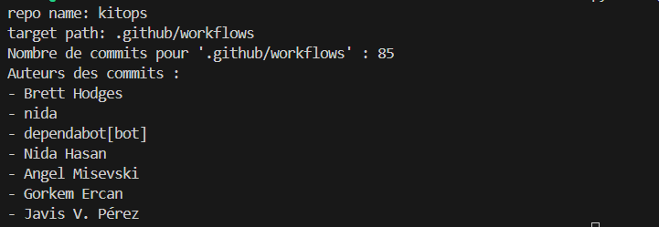

  
<em>Figure 4 : Contributions des développeurs dans le dossier des workflows.</em>

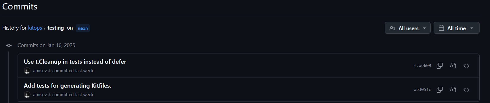

  
<em>Figure 5 : Date du dernier push dans le dossier des tests.</em>

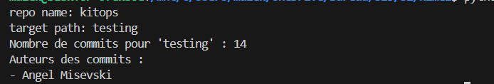

  
<em>Figure 6 : Contributions des développeurs dans le dossier des tests.</em>

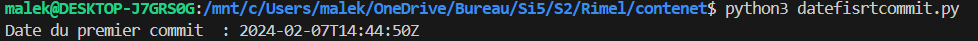

  
<em>Figure 7 : Date du premier push du projet.</em>

.

### Conclusion
***
KitOps se distingue comme un outil efficace pour la gestion, le packaging, et le déploiement des artefacts de machine learning, grâce à ses fonctionnalités adaptées aux besoins des projets IA/ML. Bien que ses tests ne couvrent pas l'intégralité des scénarios possibles, ils assurent une couverture suffisante pour garantir le bon fonctionnement des fonctionnalités principales de l'outil. Ces tests, bien que variés, reposent sur les principes classiques des applications, tels que les tests unitaires.

L'accent est mis sur des aspects essentiels comme la gestion des fichiers, le packaging/dépackaging des ModelKits, et la reproductibilité des processus. KitOps offre ainsi une base solide pour garantir la portabilité et la robustesse des artefacts dans divers environnements.

.

## 🧪 MLFlow

.

### Fonctionnement
***
MLFlow est une plateforme MLOps qui répond aux principaux besoins des workflows de machine learning. Ses fonctionnalités clés incluent:
- **Suivi des expériences :** permet d'enregistrer et de suivre les différentes expérimentations effectuées dans un projet de machine learning. Cela inclut les paramètres utilisés, les données d'entrée, les métriques obtenus, et les artefacts produits.  Ce suivi facilite la comparaison et la reproductibilité des modèles.
- **Déploiement des modèles :** facilite le packaging et le développement des modèles ML, permettant de les servir comme des API REST. Il prend en charge divers environnements de déploiement, notamment les services cloud et les clusters Kubernetes [(MLflow Overview)](https://mlflow.org/docs/latest/introduction/index.html).
- **Gestion de cycle de vie des modèles :** la plateforme propose des outils pour versionner, valider et gérer les modèles tout au long de leur cycle de vie, de la phase de test à celle de production.
- **Intégration avec des frameworks populaires :** MLFlow s'intègre avec TensorFlow, PyTorch, Keras et d'autres frameworks de deep learning, offrant des options de journalisation automatique et manuelle. Cette intégration facilite l'enregistrement des métriques, des artefacts, et des modèles produits par ces frameworks.

.

Ces fonctionnalités sont rendues possibles grâce à quatre composants principaux : 
- **MLFlow Tracking :** fournit une API et une interface utilisateur pour enregistrer les expérimentations. Les développeurs peuvent suivre les paramètres, les métriques et les artefacts générés, ainsi que comparer et rechercher ces expérimentations dans une base centralisée.
- **MLFlow Models :** offre un format standardisé pour empaqueter les modèles, en incluant leurs dépendances et les données nécessaires à leur exécution. Il permet d'évaluer les modèles sur différentes plateformes sans avoir à réécrire le code.
- **MLFlow Projects :** grâce à un format YAML, il permet de structurer les projets de manière reproductible. Chaque projet définit ses dépendances, les scripts à exécuter, et les paramètres nécessaires, facilitant ainsi le partage et l'exécution automatisée.
- **MLFlow Model Registry :** agit comme un hub collaboratif pour gérer les modèles. Il prend en charge leur versionnement, la gestion des états (testé, validé, déployé), et le suivi des transitions entre ces états.

.

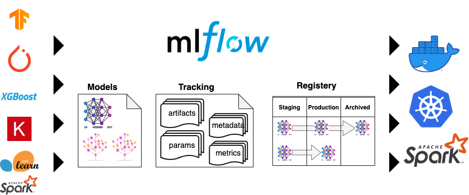

  
  
<em>Figure 8.</em> Utilisation de MLFlow

.

En complément, MLFlow propose des **recettes** pour accélérer les développements avec des **modèles préconfigurés** , des outils d'**évaluation** pour générer automatiquement des **métriques** et des **visualisations**, ainsi que des fonctionnalités de **déploiement** cohérentes et évolutives, avec prise en charge des **environnements Docker**.

.

### Analyses
***
L'approche CI/CD du repository github de MLFlow combine [CircleCI](https://github.com/mlflow/mlflow/blob/master/.circleci/config.yml), [DevContainer](https://github.com/mlflow/mlflow/tree/master/.devcontainer), [Github Actions](https://github.com/mlflow/mlflow/tree/master/.github), une configuration qui offre des avantages uniques pour l'automatisation des workflows et la gestion des environnements :

.

#### CircleCI
***
Utilisé pour sa puissance et sa flexibilité dans l'exécution des pipelines CI/CD, il permet de gérer des tests complexes et des déploiements scalables.

.

*Ci-dessous les jobs lancés dans circleCI :*
<table style="width: 100%;">
  <tr>
    <td style="width: 50%; text-align: center;">
      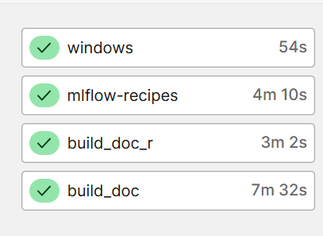
      
<em>Figure 9.</em> circleCI jobs

    </td>
    <td style="width: 50%; font-size: 0.85em;">
      

       

          <strong>windows</strong>: Ce job crée un environnement Windows pour exécuter des tests ou des étapes spécifiques à la plateforme Windows. Il effectue un simple checkout du code source et est utilisé principalement pour tester des fonctionnalités sur une machine virtuelle Windows.
        

        

          <strong>build_doc_r</strong>: Ce job utilise une machine virtuelle de base pour vérifier la Pull Request, puis génère la documentation API en utilisant un script dédié. Si des fichiers ont été modifiés, il échoue pour garantir l'intégrité de la documentation.
        

        

          <strong>build_doc</strong>: Ce job s'exécute dans un environnement Docker avec Python et Node.js. Il installe les dépendances nécessaires (Java, Pandoc, Python), puis génère la documentation à l'aide de yarn et de scripts Python, et enfin stocke les artefacts générés.
        
      
      

    </td>
  </tr>
</table>

.

**mlflow-recipes :** Ce job exécute des **recettes MLflow** pour tester une **régression réelle** en utilisant des **notebooks Jupyter**. Il met à jour les **sous-modules Git** et **installe les dépendances** nécessaires. Ensuite, il **exécute les recettes** et les notebooks, convertissant les résultats en différents formats. Ce processus permet de **tester et valider les performances du modèle** sur des **données concrètes**, en sauvegardant les **artefacts générés** pour assurer la reproductibilité et la traçabilité des résultats.

.

*Voici un diagramme qui décrit le fonctionnement du workflow circleCI :* 


  
  
<em>Figure 10.</em> Workflow CircleCI : Construction de Documentation et Exécution MLFlow

.

Le sous-module `examples/recipes` dans le dépôt GitHub de MLflow est principalement utilisé pour fournir des exemples pratiques de l'utilisation de MLflow Recipes. Selon la [pull request #13565](https://github.com/mlflow/mlflow/pull/13565), ces exemples aident à tester et valider les fonctionnalités MLOps en permettant aux utilisateurs d'automatiser des tâches courantes comme l'ingestion de données, l'entraînement de modèles et l'évaluation des performances.

.

Mis à jour pour garantir la compatibilité avec les dernières versions de Python (notamment Python 3.9), ce sous-module permet également de tester l'intégration des nouvelles fonctionnalités de MLflow et d'assurer leur bon fonctionnement avec les dépendances existantes. Ces recettes servent de base pour automatiser les workflows, tout en assurant une gestion cohérente des mises à jour et des tests des composants MLflow.

.

En analysant le circleCI du projet, plusieurs artefacts ont été analysés.
[Un lien vers les artefacts dans circleCI pour un build récent](https://app.circleci.com/pipelines/github/mlflow/mlflow/45551/workflows/e0615a39-6644-425a-8f3f-4a2c768776ad/jobs/141272/artifacts)

.

#### Exemple d'**artifact** généré par le job **mlflow-recipes** qui regroupe toute les étapes courantes du procédé de machine learning  : [Notebook MLflow - Régression sur Databricks](https://output.circle-artifacts.com/output/job/17301095-7996-4847-8f33-f075f56c2c95/artifacts/0/examples/recipes/regression/notebooks/dark-jupyter.html)

Dans le cadre de l'expérimentation avec des **modèles de régression**, ce notebook permet d'**automatiser l'exécution des étapes** du pipeline de **données et de modélisation** sur **Databricks** (plateforme cloud pour le **big data et l'IA**), tout en générant des **résultats pour évaluer la performance du modèle**. Voici les étapes principales du processus :

.

| **Étape**                       | **Description**                                                                                                                                           | **Résultats Clés**                                               |
|----------------------------------|-----------------------------------------------------------------------------------------------------------------------------------------------------------|------------------------------------------------------------------|
| **1. Chargement & Préparation**  | Préparation de l'environnement d'exécution et chargement des dépendances.                                                                                 | Environnement prêt, dépendances chargées.                        |
| **2. Création de la Recette**    | Initialisation de la recette MLflow, nettoyage et inspection des composants.                                                                               | Recette initialisée et validée.                                 |
| **3. Ingestion des Données**     | Chargement des données du fichier `sample.parquet`, création du profil et schémas.                                                                         | Données ingérées avec informations, aperçu des données généré et résumé avec le **nombre de lignes ingérés**, la **durée d'exécution** et la **date du dernier update**                                 |
| **4. Division des Données**      | Séparation des données en ensembles d'**entraînement**, **validation** et **test**.                                                                                   | Tableau comparatif des **statistiques descriptives** de plusieurs **variables numériques et temporelles** sur différents **groupes de données**. Une partie résume les **dimensions** des ensembles d'entrainement, validation et test. Le nombre de **ligne supprimé** , **durée d'exécution** |
| **5. Transformation des Données**| Application de transformations comme la normalisation et création de nouvelles features                                                                  | Données transformées, **avertissements gérés si nécessaires**. Vue sur le profile des données, les **inputs, outputs Schema**, la **prévisualisation** des données et un résumé.      |
| **6. Entraînement du Modèle**    | Entraînement du modèle de régression avec les données préparées.                                                                                          | Modèle entraîné, ajusté aux données d'entraînement. Accès aux **performances** du modèles avec **validations**, le profile de **prédiction**, l'**architecture** du modèle, les moins bonnes prédictions, une comparaison  **(Worst VS Train)**, un **classement**, les **meilleurs paramètres**, warning logs et résumé      |
| **7. Résultats & Validation**    | Évaluation du modèle à l'aide de métriques comme RMSE et \( R^2 \).                                                                                       | **Métriques** calculées : RMSE, \( R^2 \) pour la performance du modèle et validé avec des **seuils de métriques**|
| **8. Enregistrement des Artifacts** | **Enregistrement des artifacts du modèle** (modèle, données d'entraînement) pour analyse ultérieure.                                                          | Modèle et données sauvegardés sous forme d'artifacts récupérables. |

.

.

*Les points clés de ces résultats sont :*

- **Automatisation & Traçabilité :** Chaque étape du pipeline est automatisée et trace les résultats pour une gestion complète du cycle de vie du modèle.
- **MLOps :** L'intégration avec MLflow permet de gérer le modèle et les données tout au long de son cycle de vie.
- **Évaluation Continue :** Les métriques à chaque étape garantissent une évaluation précise de la performance du modèle.

.

#### DevContainer
***

.

Garantit un environnement de développement cohérent et portable, permettant à chaque membre de l'équipe de travailler dans des conditions identiques, quel que soit le système local.

*Voici un diagramme qui décrit le fonctionnement de DevContainer :*

  

<em>Figure 11.</em> DevContainer : Étapes et fonctionnement

.

Le diagramme présenté illustre les différentes étapes du fonctionnement d'un environnement DevContainer :

1. **VSCode** utilise l'extension Remote - Containers pour ouvrir le projet.
2. **Docker** construit une image DevContainer configurée avec les outils nécessaires comme Python, MLflow, et Node.js.
3. Un **environnement de développement** complet est créé, prêt pour l'exécution de tests (pytest) et le contrôle qualité via les **hooks de pre-commit**. Ces derniers peuvent empêcher des fichiers inutiles ou des erreurs d'être commis (par exemple, éviter les commits avec des fichiers temporaires ou binaires).
4. Les changements sont poussés vers le dépôt GitHub, déclenchant des workflows **CI/CD** automatisés.
5. Les artefacts sont générés et déployés, garantissant des résultats reproductibles.

.

Le **DevContainer** est un outil fondamental pour optimiser le développement logiciel en assurant un **environnement de travail uniforme** et facilement reproductible. En configurant à l'avance des outils clés comme **Python**, **MLflow**, et **Node.js**, il élimine les problèmes liés aux différences de configurations locales entre les développeurs. Cela permet non seulement d’économiser du temps en évitant les étapes de **configuration manuelle**, mais aussi de faciliter l’**intégration continue**, grâce à l’utilisation de **tests automatisés**, de **hooks de pre-commit**, et de **pipelines CI/CD** bien structurés. De plus, la gestion des versions de Python via **pyenv** assure une flexibilité qui garantit la compatibilité des environnements de développement. Globalement, le DevContainer améliore la **collaboration** au sein des équipes, réduit les erreurs dues à des **configurations incompatibles** et permet aux développeurs de se concentrer sur l’essentiel : le **développement du code**.

.

#### GitHub Actions
***

[JOB qui contient actions de tests unitaires concernant les ML](https://github.com/mlflow/mlflow/actions/runs/12313242985/job/34366868186)

.
Pour MLflow, les actions GitHub incluent généralement des tests unitaires, des tests d'intégration et des tests linting dans le cadre du pipeline CI. Ces tests garantissent que les modifications de code ne perturbent pas les fonctionnalités existantes et maintiennent la qualité du code. Les flux de travail CI/CD dans MLflow impliquent également des étapes de gestion des modèles, telles que le test de la sérialisation/désérialisation des modèles et la garantie de la compatibilité avec différentes versions de modèles MLflow.
.
Les tests sont déclenchés sur divers événements tels que les commits et les pull requests. Par exemple, les tests unitaires et d'intégration sont exécutés sur les pull requests pour garantir la qualité du code avant un merge, comme décrit dans [l'issue GitHub](https://github.com/mlflow/mlflow/issues/10011). De plus, il existe des tests planifiés, tels que des tâches cron hebdomadaires, pour exécuter des tests plus lents comme la création d'images Docker, garantissant ainsi des tests complets au fil du temps comme le montre la [GitHub pull request](https://github.com/mlflow/mlflow/pull/11004).
.

#### Environnements et configurations spécifiques
GitHub Actions offre aussi la possibilité de configurer des environnements spécifiques pour différentes technologies, comme Java, Node.js, Python, et Pyenv. Voici quelques exemples de configurations fréquemment utilisées :

- **Java (OpenJDK 17)** : L'action `setup-java` configure un environnement Java avec la version d'OpenJDK souhaitée.
- **Node.js** : Grâce à l'action `setup-node`, on peut facilement configurer Node.js avec une version spécifique pour les applications JavaScript.
- **Python avec Pyenv** : L'action `pyenv/pyenv-action` permet de gérer différentes versions de Python dans le cadre de tests ou de déploiements.
- **Python (installation avec `pip`)** : L'action `setup-python` permet d'installer une version spécifique de Python et d'exécuter les tests avec `pip`.

Ces actions facilitent l'automatisation des configurations de développement et permettent de garantir la cohérence des environnements de travail, tout en réduisant le temps de configuration et de déploiement.

.

*Voici quelque workflows et actions présents dans le projet MLFlow:*

| Workflow                         | Déclencheur(s)                      | Actions principales                                     | Environnement                  | Résultat attendu                        |
|-----------------------------------|-------------------------------------|---------------------------------------------------------|---------------------------------|------------------------------------------|
| **Tests lents (Slow Tests)**      | Quotidien à 13:00 UTC, PR modifiée  | Installation des dépendances, exécution des tests en parallèle | MLFLOW_RUN_SLOW_TESTS          | Rapport des tests et validation des fonctionnalités complexes |
| **Revue automatisée des PR**      | Requête de revue sur une PR         | Assignation dynamique des reviewers, retrait des reviewers inutiles | Liste dynamique des reviewers   | Revue de code optimisée sans redondances |
| **Tests d'intégration UnityCatalog** | Quotidien ou PR sur fichiers critiques | Clonage dépôt, construction serveur local, tests d'intégration | Java avec OpenJDK 17            | Validation de l'intégration MLflow / UnityCatalog |
| **Tests Docker**                  | PR ou tests quotidiens              | Installation des dépendances, tests segmentés           | Docker avec tf-keras et pyarrow | Validation des images Docker MLflow      |
| **Workflow général UC-OSS**       | Quotidien à 13:00 UTC, PR sur fichiers clés | Construction et exécution des tests dans un environnement Python/Java, intégration avec UnityCatalog | Python/Java                    | Validation des composants critiques (protos, store) |
| **Deployments**                   | PR (opened, synchronize, reopened, ready_for_review), Push (branches master et branch-[0-9]+.[0-9]+) | Vérification PR, installation des dépendances, tests avec pytest | Ubuntu-latest              | Validation des déploiements avec tests réussis         |
| **Devcontainer**                  | Push sur master, PR (opened, synchronize, reopened, ready_for_review) sur .devcontainer/** | Construction d'image Docker, tests de l'image, push vers ghcr.io | Ubuntu-latest, QEMU (si nécessaire), Docker | Construction et validation de l'image Docker, push vers le registre |
| **Maintainer approval**           | PR                                                   | Vérification de l'approbation par un mainteneur core      | Ubuntu-latest              | Validation de l'approbation mainteneur avant fusion    |
| **Tests sur nouvelles fonctionnalités** | PR ou push sur des branches spécifiques | Tests fonctionnels et de régression des nouvelles fonctionnalités | Python avec dependencies spécifiques | Validation du bon fonctionnement des nouvelles fonctionnalités |
| **Vérification de la conformité du code** | PR sur la branche principale  | Analyse statique du code, tests de conformité, mise à jour des dépendances | Ubuntu-latest, outils de linting | Validation de la qualité du code et conformité aux standards |

.

.

| Action                         | Déclencheur(s)                      | Actions principales                                     | Environnement                  | Résultat attendu                        |
|-----------------------------------|-------------------------------------|---------------------------------------------------------|---------------------------------|------------------------------------------|
| **Cache des dépendances Python** | Lors de l'exécution des tests | Mise en cache du répertoire `.venv` pour accélérer l'installation des dépendances | Python | Accélération des installations en réutilisant les fichiers téléchargés |
| **Libération d'espace disque**    | Après chaque exécution d'un test    | Suppression de répertoires spécifiques sur le serveur d'intégration | Environnement d'intégration | Optimisation de l'espace disque pendant l'intégration |
| **Validation de l'auteur des commits** | Lors d'une pull request | Vérification de la conformité de l'auteur des commits avec les conventions | - | Maintien du contrôle sur l'intégrité et la qualité des contributions |

.

En analysant ces workflows et actions, plusieurs aspects importants permettent de vérifier la fiabilité et la testabilité de l'outil. La **sécurité** est assurée grâce à des mécanismes comme l'**approbation par un mainteneur** avant la fusion des pull requests, garantissant ainsi un contrôle qualité strict sur les contributions. L'outil prend également en charge **plusieurs environnements** (Java, Python, Docker, etc.), ce qui permet d'automatiser et de garantir la cohérence des tests dans divers contextes de développement. La **simplification de l'utilisation** est un autre point fort, avec des actions comme le **cache des dépendances Python** pour accélérer les installations et la **libération d'espace disque** pour optimiser les ressources durant l'intégration. Enfin, la fiabilité et la testabilité sont renforcées par des **tests d'intégration** et des **tests de régression**, validant ainsi les nouvelles fonctionnalités et assurant la robustesse du système. Ensemble, ces éléments contribuent à une gestion efficace des workflows tout en garantissant une haute qualité et une traçabilité des changements.

.

[Lien vers le readme des workflows dans .github](https://github.com/mlflow/mlflow/blob/master/.github/workflows/README.md)

### Conclusion
***
MLFlow est un outil très utile et développé pour gérer tout le cycle de vie des modèles d'apprentissage automatique. Il permet de suivre les expériences, de gérer les versions des modèles, et de les déployer facilement en production. Il automatise les tests et le déploiement des modèles, offrant ainsi une solution efficace pour les équipes MLOps tout en assurant la traçabilité et la reproductibilité des modèles et la sécurité. Il permet également de tester la fiabilité des modèles avec des métriques et des seuils de validations avec des alertes de résultat anormales. Finalement MLFlow a plusieurs fonctionnalités pour le MLOps mais également le DevOps.

.

## 🌀 MetaFlow

.

### Fonctionnement

.

Metaflow est une bibliothèque conviviale conçue pour aider les scientifiques et ingénieurs à construire et gérer des projets de science des données dans des environnements réels. Initialement développée chez Netflix, elle visait à augmenter la productivité des data scientists travaillant sur des projets variés, allant des statistiques classiques à l'apprentissage profond.

.

Metaflow propose un **prototypage rapide local**, avec un support pour les notebooks et un suivi des expérimentations avec gestion des versions. Il offre également une **scalabilité horizontale et verticale** vers le cloud, en utilisant aussi bien les CPU que les GPU, et un **accès rapide aux données**. Un autre atout majeur est sa capacité à gérer les **dépendances et à déployer facilement en production** via des orchestrateurs hautement disponibles.

### Analyses
***

Lors de notre étude de l'outil Metaflow, nous avons observé que ses pipelines sont structurés en plusieurs fichiers YAML, chacun dédié à des tâches spécifiques. Ces pipelines, conçus avec GitHub Actions. Voici une description détaillée des principaux fichiers de pipeline identifiés :

.

| **Nom du Workflow**         | **Événement Déclencheur**                                             | **Job Principal**                                       | **Étapes**                                                                                                                                                                                                                                                                                                  | **Outils Utilisés**                                 |
|-----------------------------|-----------------------------------------------------------------------|--------------------------------------------------------|----------------------------------------------------------------------------------------------------------------------------------------------------------------------------------------------------------------------------------------------------------------------------------------------------------|-----------------------------------------------------|
| **CodeQL**                  | Push sur `master`, pull request, planification (cron)                 | `analyze`                                              | 1. Checkout du dépôt 2. Initialisation de CodeQL 3. Autobuild (compilation des langages) 4. Analyse de CodeQL                                                                                                                                                                                       | GitHub Actions, CodeQL, Autobuild                  |
| **metaflow.s3-tests**       | Push sur `master`, pull request (labeled avec `approved` ou `ok-to-test`) | `test_data`                                            | 1. Checkout du dépôt 2. Setup Python pour différentes versions 3. Installation des dépendances 4. Exécution des tests avec `pytest`                                                                                                                                                                 | GitHub Actions, Python, AWS, Pytest                |
| **Publish**                 | Publication d'une release                                            | `test`, `test-stubs`, `deploy`                          | 1. Tests 2. Publication des packages Python sur PyPI 3. Génération des stubs 4. Déploiement du package Metaflow                                                                                                                                                                                      | GitHub Actions, Python, Twine, PyPI, setuptools    |
| **Test Stubs**              | Push sur `master`, pull request sur `master`, appel de workflow        | `Python`, `R`, `pre-commit`                             | 1. Checkout du dépôt 2. Setup Python ou R 3. Installation des dépendances 4. Exécution des tests `mypy` ou `tox` 5. Tests avec `pytest`                                                                                                                                                             | GitHub Actions, Python, R, Pre-commit, Pytest      |
| **Test**                    | Push sur `master`, pull request sur `master`, appel de workflow        | `pre-commit`, `Python`, `R`                             | 1. Configuration des hooks de pre-commit 2. Exécution des tests pour différentes versions de Python et R                                                                                                                                                                                                   | GitHub Actions, Python, R, Pre-commit, Tox, Pytest |
| **R**                       | Push sur `master`, pull request sur `master`, appel de workflow        | `core / R`                                              | 1. Setup de R 2. Installation des dépendances système et Rlang 3. Exécution des tests avec `Rscript`                                                                                                                                                                                                  | GitHub Actions, R, Ubuntu, Rlang                   |

.

1. test.yml:

Ce workflow GitHub Actions est structuré pour tester et valider la qualité du code dans plusieurs environnements, incluant Python et R, tout en automatisant des processus comme l'installation de dépendances et l'exécution des tests. Voici une explication détaillée des étapes et des tâches réalisées dans cette pipeline :

- Déclenchement du Workflow : Le workflow est activé lors d'un push ou d'une pull_request sur la branche master.

- Job pre-commit :

Ce job inclut trois étapes principales :
- Checkout du code
- Installation de Python
- Préparation du Commit : L'action pre-commit/action est utilisée pour lancer des hooks de pré-commit, permettant de s'assurer que le code respecte les normes définies avant d'être commité.

- Job Python :
- Installation des dépendances
- Exécution des tests : La commande tox est utilisée pour exécuter les tests définis pour chaque version de Python, garantissant la compatibilité et la fiabilité du code sur plusieurs versions de Python.

.

#### Tests

.

  Les tests consistent en des :

  - Tests sur le stockage des données (S3)
  Pour tester la fiabilité de Metaflow dans la gestion des données, il est essentiel de vérifier sa capacité à interagir correctement avec les systèmes de stockage comme Amazon S3. Ces tests consistent à sauvegarder des données (par exemple, un fichier ou un tableau), puis à les récupérer pour vérifier leur intégrité. Il est également important de simuler des erreurs, comme un fichier manquant, afin de s’assurer que Metaflow affiche des messages d’erreur clairs et appropriés. Ces tests permettent de valider la capacité de l’outil à manipuler les données de manière sécurisée, même en cas de coupures réseau ou d’autres problèmes inattendus.

  - Tests d'intégration (fonctionnement global)
  Les tests d'intégration vérifient si toutes les parties principales de Metaflow, comme la gestion des étapes, le stockage des données et l’exécution du code, fonctionnent bien ensemble. Un exemple de test consiste à créer un petit workflow avec plusieurs étapes (par exemple : importer des données, les transformer et les sauvegarder) et à exécuter ce workflow pour s’assurer que chaque étape s’exécute correctement. Cela permet de vérifier si Metaflow peut gérer des projets du début à la fin sans erreurs. Ce type de test est crucial pour valider le bon fonctionnement global de l’outil dans des scénarios réels.

  - Tests des graphes (processus en étapes)
  Metaflow permet de gérer des workflows en étapes, qu’elles soient linéaires (une étape suit une autre) ou parallèles (plusieurs étapes s’exécutent simultanément). Les tests ici consistent à créer des workflows simples et complexes pour vérifier que chaque étape s’exécute dans le bon ordre et au bon moment. En simulant des échecs d’étapes, on peut également évaluer la capacité de Metaflow à gérer les erreurs proprement, soit en continuant le workflow, soit en l’arrêtant de manière contrôlée. Ces tests permettent de garantir que Metaflow est adapté à des workflows complexes et variés.

  - Tests des environnements d'exécution ("contexts")
  Metaflow peut être utilisé dans divers environnements, comme un ordinateur local, un service cloud ou avec différentes versions de Python. Les tests d’environnements d'exécution consistent à exécuter les mêmes workflows sur ces différentes plateformes et à comparer les résultats pour s’assurer qu’ils sont identiques. Il est également utile de tester des situations où les ressources (comme la mémoire ou le CPU) sont limitées pour voir comment Metaflow s’adapte. Ces tests valident la flexibilité et la compatibilité de Metaflow avec divers contextes techniques, ce qui est essentiel pour son adoption dans différents systèmes.

  - Tests des interfaces utilisateur (CLI et API)
  Metaflow propose une interface en ligne de commande (CLI) et une API Python pour interagir avec l’outil. Les tests dans ce domaine consistent à vérifier que les commandes et fonctions principales sont faciles à utiliser et donnent les résultats attendus. Par exemple, il s’agit de tester des commandes simples pour créer un workflow, lancer une exécution ou récupérer des données. Il est également important de s’assurer que les messages d’erreur sont clairs et informatifs. Ces tests permettent de s’assurer que l’expérience utilisateur est fluide et que les développeurs peuvent utiliser Metaflow sans difficulté.

  - Résumé des tests
  Ces tests se concentrent sur différents aspects fondamentaux de Metaflow : la gestion fiable des données, le fonctionnement global, la flexibilité dans différents environnements et la simplicité des interfaces utilisateur. En menant ces tests, on évalue Metaflow en tant qu’outil logiciel, indépendamment des workflows de Machine Learning qui l’utiliseront. Cela permet de vérifier que l’outil est robuste, fiable et pratique pour les développeurs, ce qui est essentiel pour garantir son adoption et son succès.

- Job R :
Installation des dépendances système.
Exécution des tests R : Les tests sont exécutés à l'aide de Rscript, garantissant que le code R fonctionne correctement. Metaflow, qui prend en charge à la fois Python et R, permet de tirer parti des outils spécifiques à chaque langage. Cette approche offre plus de flexibilité, permettant d'effectuer des tests et validations dans les deux environnements de manière cohérente. Les mêmes tests qui sont réalisés en Python sont également lancés en R, assurant une couverture complète des validations.

.

## Comparaison des outils
Pour cette comparaison généré à l'aide du script python `assets\codes\datefisrtcommit.py`, nous pouvons observer plusieurs points intéressants :

**MLflow :** Ce projet, qui est le plus récent parmi ceux analysés, dispose également du plus grand nombre de contributeurs. Cette forte implication de contributeurs pourrait expliquer pourquoi il est aussi développé, avec une progression rapide et continue.

**KitOps vs ClearML :** Bien que KitOps semble être davantage développé que ClearML, il est porté par un nombre plus restreint de contributeurs. Cependant, le fait que KitOps soit un projet plus récent pourrait indiquer que ClearML, bien qu'ayant mobilisé plus de contributeurs par le passé, est peut-être moins actif actuellement, laissant la place à un développement accru de KitOps.

**Metaflow :** Ce projet, plus ancien que les autres, présente un nombre de contributeurs similaire à celui de ClearML. Cela pourrait refléter une certaine stabilité dans sa communauté, même si son ancienneté pourrait également expliquer une diminution relative de l'activité récente comparée aux projets plus jeunes comme MLflow.
.
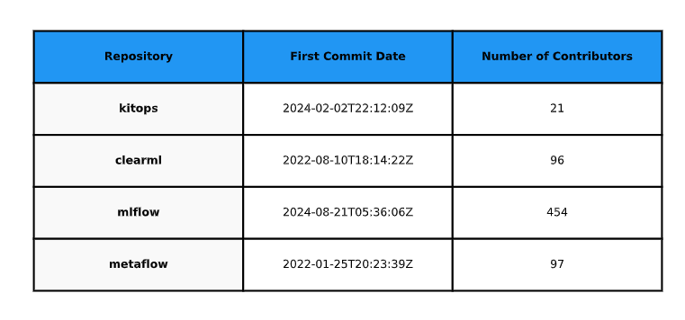

  
  
<em>Figure 12 : Date 1er commit et nombre de contributeur</em>

.

Cette étude se concentre sur l'**activité de développement** liée aux **tests** et aux **workflows** dans les quatre outils **MLOps : kitops, clearml, mlflow et metaflow**. En utilisant l'**API GitHub** et **Plotly** (`assets\codes\gitnbcommits.py`) pour la visualisation, nous avons spécifiquement analysé les **commits** dans les répertoires de tests et les workflows. Les données montrent que **MLflow** présente une activité particulièrement intensive dans ces domaines, notamment dans ses dossiers de tests, tandis que **Metaflow** et **kitops** affichent une activité plus modérée. **ClearML** n'a pas de tests mais a seulement **2 commit** pour son worflow. Cette analyse ciblée nous donne un aperçu de l'importance accordée aux **tests automatisés** et à l'**intégration continue** dans ces projets, bien qu'elle ne représente qu'une partie de leur activité de développement globale.

*L'image en html pour l'interactivité est disponible dans `assets/images/commit_graph.html`* 

.

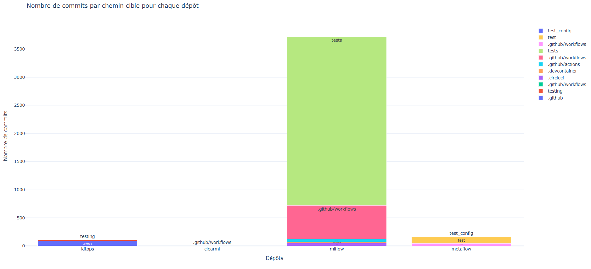

  
  
<em>Figure 13 : Nombre de commits par chemin cible pour chaque outil</em>

.

Parmi les analyses que nous avons réalisées pour comparer les outils, nous avons pris en compte leur popularité, en nous basant sur le nombre d'étoiles sur GitHub, comme illustré dans la Figure 14. Nous avons constaté que MetaFlow est l'outil le plus apprécié, en grande partie grâce à l'intégration avec l'outil de Netflix. Cependant, un point surprenant est que ClearML dispose de plus d'étoiles que KitOps, bien qu'il semble que KitOps soit plus testé que ClearML. Nous supposons que cette différence peut s'expliquer par le fait que ClearML est un outil plus ancien que KitOps.

  
  
<em>Figure 14 : Comparaison de la popularité des outils basée sur le nombre d'étoiles GitHub.</em>

Nous avons également analysé le pourcentage de bugs parmi les issues GitHub pour chaque outil, comme le montre la Figure 15. Là encore, un résultat inattendu ressort : bien que MLFlow teste plusieurs phases des tâches de machine learning, il semble avoir plus de bugs que ClearML, qui, paradoxalement, ne semble pas avoir de tests aussi poussés.

  
  
<em>Figure 15 : Pourcentage de bugs parmi les issues GitHub pour chaque outil.</em>

  

## Conclusion générale

En conclusion, cette étude montre que les outils MLOps ne suivent pas tous les mêmes pratiques en matière de tests. Certains outils ne disposent pas de tests du tout, tandis que d'autres, comme MLFlow et MetaFlow, proposent des tests plus approfondis. En revanche, des outils comme kitops semblent se concentrer davantage sur des tests de base (les tests sur les pack et unack des models et des fichiers). Globalement, les tests présents dans ces outils peuvent être assimilés à des tests classiques utilisés dans les applications traditionnelles, tels que les tests d'intégration et les tests unitaires, bien qu'ils présentent des spécificités liées au domaine du machine learning.

## VI. Outils
Les différents scripts développé pour générer certains résultats sont dans le répertoire `assets/codes`.

Un `readme.md` détaille l'exécution de ces scripts.

## VII. References

### Github Repository des outils
***
[25 janv. 2025] **MLflow, "mlflow"**, GitHub repository. Disponible : https://github.com/mlflow/mlflow.

[19 janv. 2025] **ClearML, "clearML"**, GitHub repository. Disponible : https://github.com/clearml/clearml/tree/master.

[23 janv. 2025] **Netflix, "metaflow"**, GitHub repository. Disponible : https://github.com/Netflix/metaflow.

[25 janv. 2025] **jozu-ai, "kitops"** GitHub repository. Disponible : https://github.com/jozu-ai/kitops/tree/main.

### Documentations
***

**DOCUMENTATION KitOps:** Simple, secure, and reproducible packaging for AI/ML projects : https://kitops.ml/

**DOCUMENTATION clearML:** An end-to-end AI Platform to streamline AI adoption and the entire development lifecycle : https://clear.ml/docs/latest/docs/

**DOCUMENTATION MLflow:** A Tool for Managing the Machine Learning Lifecycle : 
https://mlflow.org/docs/latest/index.html

### Articles
***
[1] Symeonidis et al., ‘MLOps -- Definitions, Tools and Challenges’.

[2] Subramanya, Sierla, and Vyatkin, ‘From DevOps to MLOps’.

[3] ‘Qu’est-ce que le DevOps ?’ https://www.ibm.com/fr-fr/topics/devops

[4] ‘Continuous Delivery for Machine Learning’. https://martinfowler.com/articles/cd4ml.html

[12 Jul 2020] by dzlab : **Machine Learning Continuous Integration with MLflow:** https://dzlab.github.io/ml/2020/07/12/ml-ci-mlflow/

[18 janv. 2022] by Maxime Jumelle : **MLflow : tout savoir sur l’outil indispensable du MLOps :** https://blent.ai/blog/a/mlflow-tout-savoir-sur-loutil-indispensable-du-mlops
