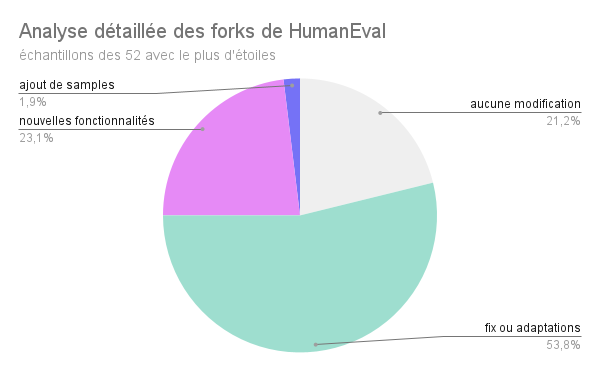
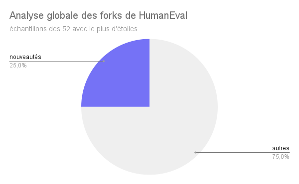
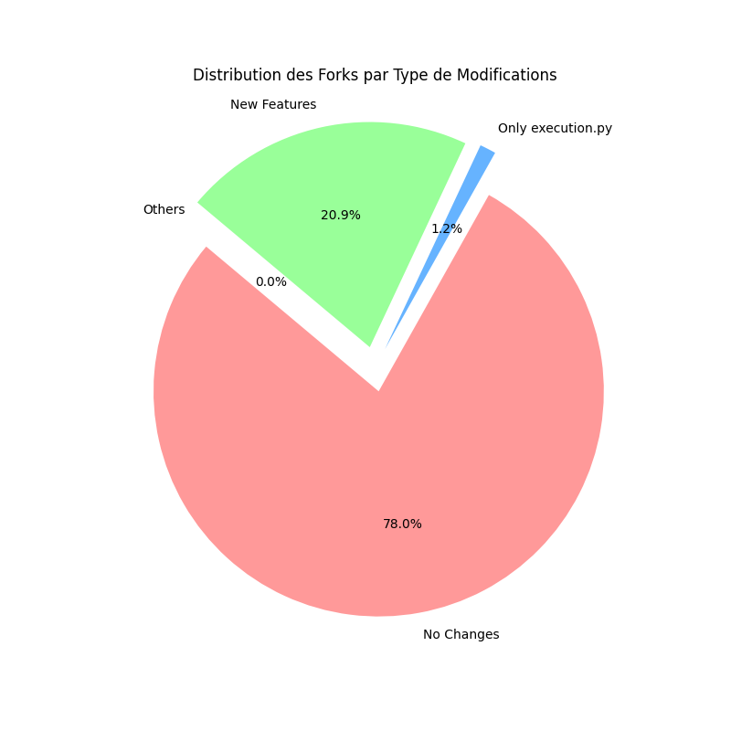
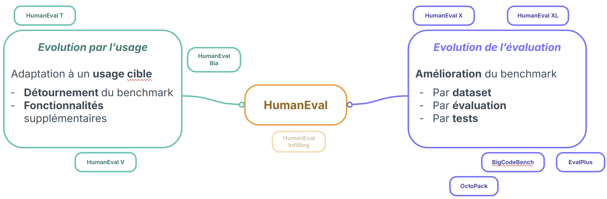
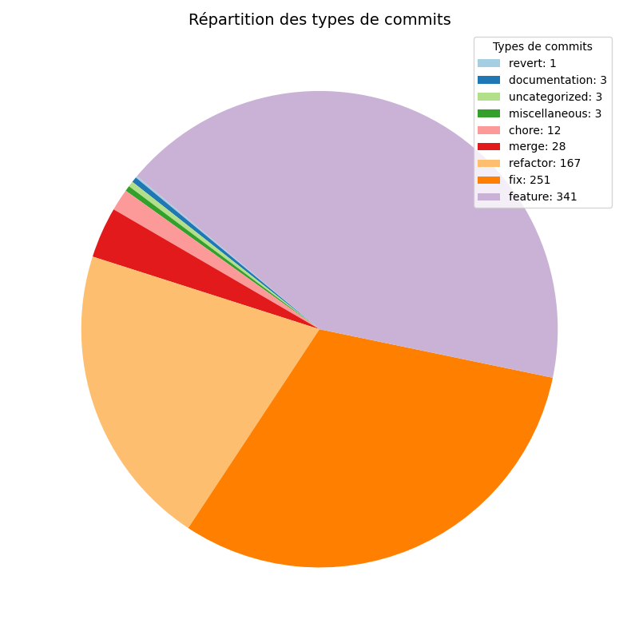

**_28 janvier 2025_**

## Auteurs

Nous sommes trois étudiants SI à Polytech Nice Sophia, spécialisés en Sustainable Software Engineering :

- Benjamin NEUVILLE BURGUIÈRE <benjamin.neuville-burguiere@etu.unice.fr>
- Clément REMY <clement.remy@etu.unice.fr>
- Carla WAGSCHAL <carla.wagschal@etu.unice.fr>

## I. Contexte de recherche / projet
Les “Large Language Model” (LLM) ont connu des avancées spectaculaires ces dernières années, devenant des outils polyvalents capables de traiter des tâches complexes dans divers domaines tels que la génération de texte, la traduction automatique, la compréhension du langage naturel et même la résolution de problèmes logiques et mathématiques. Parmi toutes ces prouesses, une se distingue particulièrement pour le monde de l’informatique : la génération de codes. C’est dans ce contexte d’évolution ultra rapide que les recherches sur l’évolution des benchmarks de LLM ont été réalisées, en se basant sur leurs capacités à générer du code.
### Importance des Benchmarks
Un benchmark constitue un ensemble de tests standardisés permettant de mesurer la performance et la capacité d'un modèle dans des tâches spécifiques. Ces outils d'évaluation jouent un rôle central dans la recherche et le développement des LLM en fournissant :
* Une base de comparaison objective entre différents modèles.
* Une évaluation de la robustesse, de la généralisation et des biais potentiels.
* Un guide pour identifier les domaines nécessitant des améliorations.

Cependant, l'évolution rapide des capacités des LLM pose un défi majeur pour les benchmarks existants, qui peuvent rapidement devenir obsolètes à mesure que les modèles s'améliorent. En effet, si les LLM évoluent rapidement, les benchmarks doivent évoluer tout aussi vite, afin de distinguer clairement les performances des nouveaux modèles, qui atteindraient quasiment un score parfait en se basant sur des benchmarks traditionnels.
### Intérêt du contexte de recherche
Cette recherche est essentielle pour accompagner l'évolution des LLM et garantir leur évaluation continue dans un cadre pertinent et rigoureux. Comprendre comment les benchmarks doivent s'adapter permettra :
* D'encourager l'innovation dans la conception des modèles.
* D'améliorer la confiance des utilisateurs et des développeurs dans les capacités réelles des LLM.
* D'assurer une comparaison juste et équitable entre différentes architectures.
* De guider la recherche vers des défis encore non résolus et des capacités émergentes.

Pour résumer, cette étude vise à comprendre comment les benchmarks de LLM les plus récents ont évolué de sorte à pouvoir suivre le rythme des avancées technologiques et d'orienter efficacement la recherche en intelligence artificielle.

## II. Observations et question générale

### Pourquoi analyser différents benchmarks de LLM ?
La notion de LLM est assez complexe à assimiler. De même, de plus en plus de nouveaux LLM émergent au fil du temps. Aujourd’hui par exemple, les plus populaires sont ChatGPT (OpenAI), Bard (Google), Llama (Meta), Bing Chat (Microsoft), Github Copilot). Parmi la multitude de modèles existants, il est donc difficile de déterminer lesquels sont les plus performants, et donc lesquels choisir.

C’est pourquoi avoir un regard sur les résultats de benchmarks permet de comprendre les performances de chacun d’entre eux. Ils permettent également de connaître les compétences d’un LLM au fil du temps, savoir si ses compétences se renforcent ou bien diminuent. Seulement, les manières d’évaluer les compétences du LLM diffèrent, et comprendre le fonctionnement des différents outils et les différents types, ou catégories d’évaluation, est très chronophage. C’est pourquoi il est important de réduire le champ de recherche de cette étude.

### HumanEval : le point de départ des recherches
Étant donné que le sujet de recherche est vaste et orienté “évolution”, il a fallu trouver un point de départ à ce dernier. Pour ce faire, il a été décidé de se tourner vers HumanEval, un benchmark de génération de code, fourni par OpenAI, comprenant un dataset éponyme de 164 entrées et basé essentiellement sur la génération de méthodes. Il est notamment utilisé pour évaluer de grands modèles de LLM et pour appuyer de nombreux articles de recherches portant sur les LLM. Son dataset est également une référence pour de nombreux benchmarks similaires. Le dernier commit sur la branche principale du répertoire date de 2021.

Comme il sera vu à travers ce chapitre, HumanEval est un point de départ pour de nombreux benchmarks modernes ayant vu le jour ces deux dernières années et n’ayant pas forcément le même objectif, ce qui en fait un benchmark initial très intéressant à analyser pour comprendre l’essor qui en émane.

### Problématique(s)
La question suivante a donc été posée : **comment les benchmarks ont-ils évolué au fil du temps, et quelles informations peut-on tirer de cette évolution en termes d’usages et de limitations ?**

De cette question, il est possible de décomposer le problème posé en plusieurs sous-questions : 

#### Dans quel sens évoluent les benchmarks?
Est-ce qu’ils évoluent plutôt au niveau du code fonctionnel des benchmarks ? Ou bien, sont-ce plutôt les datasets qui évoluent ? Finalement, qu’est-ce qui est amélioré par rapport à la version initiale ?
#### Qui sont les sources des évolutions des benchmarks?
Qui sont les auteurs des nouveaux benchmarks, notamment ceux inspirés de HumanEval ? Comment sont-ils organisés ? Travaillent-ils seuls, ou en groupe ? Au sein de groupes de travail spécialisés et qui se connaissent, comme c’est très souvent le cas dans la recherche ? Ou bien, de manière plus communautaire, en contribuant à un projet open source ?
#### Comment les usages pratiques des LLM ont influencé les benchmarks?
L’évolution des LLM étant très rapide et intense depuis 2 ans, il est très important de comprendre comment leur évolution a influencé l’orientation des benchmarks les plus récents. 

## III. Collecte d’informations

### Limitation de la zone de recherches
Tout d’abord, dans le cadre de cette étude, les recherches ont été limitées aux benchmarks de LLM axés sur l’évaluation de la génération de code. Aucune attention n’a été prêtée aux autres benchmarks de LLM. Comme précédemment évoqué, l’objectif était de baser les recherches sur l’évolution du benchmark HumanEval.

De même, l’étude s’est focalisée sur plusieurs benchmarks bien précis, qui évoquent d’une quelconque manière le benchmark d’origine de OpenAI. Il est forcément impossible d’analyser en détail chaque benchmark existant, il a donc fallu restreindre le champ de recherche à une liste réduite, mais pertinente, pour les recherches. L’étude s’est orientée dans les benchmarks qui sourcent comme origine HumanEval (explicitement - comme EvalPlus ou implicitement - comme BigCodeBench qui se source sur EvalPlus), dont la nomenclature du projet est similaire à HumanEval (HumanEval V, HumanEval X…), qui sont directement enfant de HumanEval (forks).

### Via des répertoires Github
La quasi-totalité des benchmarks de LLM basés sur la génération de code sont associés à un répertoire GitHub public. Il est donc très simple et intéressant de consulter ces derniers, pour comprendre comment chaque benchmark fonctionne, ainsi que pour comparer des benchmarks entre eux.
### Via les forks de ces répertoires Github.
De la même manière, tous ces répertoires ont été forkés un certain nombre de fois. Une des expériences présentée dans ce chapitre vise à analyser les forks de certains benchmarks, et de voir s’il est possible d’en tirer des informations pertinentes.
### Via des répertoires Hugging Face
Hugging Face est une plate-forme de partage de modèles d’IA et des ensembles de données nécessaires à l'apprentissage automatique, permettant notamment l'entraînement de nouveaux modèles, y compris de grands modèles. Comme pour Github, il existe un répertoire Hugging Face associé à presque tous les benchmarks de LLM basés sur la génération de code, qui contiennent notamment les datasets utilisés par chacun des benchmarks. Ce sont ces datasets qui sont les plus intéressants, car leur analyse comparative permet de mettre en avant l’évolutivité de certains types de benchmarks.
### Via d’autres articles de recherches
De nos jours, les articles de recherches s’appuyant sur des benchmarks de LLM sont monnaie courante. Bien entendu, ils ne s’appuient pas tous sur HumanEval, il en existe un grand nombre qui se basent sur un ou plusieurs autres benchmarks. Ces articles de recherches sont une source d’informations précieuses et importantes, car ils sont parfois les précurseurs d’idées ou concepts liés à l’évolution des benchmarks. Pour approcher les articles, il faut donc vérifier si l’article cite HumanEval, pour ensuite déterminer de quelle manière le benchmark découle de celui d’OpenAI, directement par les aspects décrits par l’article ou par une analyse des répertoires. 
### Via d’autres types de recherche
Enfin, il a également été possible de trouver des informations pour ce sujet de recherche en effectuant des recherches via d’autres méthodes (recherche google toute simple, lecture de blogs, …). La majorité de ces recherches était un pont d’accès direct aux précédents types de sources.
### Métriques
Finalement, avec toutes ces sources de données, il faut restreindre l’ensemble des benchmarks évolués de HumanEval. Le but est d’abord d’établir une liste des différents benchmarks qui se disent apporter une évolution à HumanEval, ainsi que ceux qui se basent sur ce benchmark source. Comme déjà explicité précédemment, les benchmarks étudiés ont un répertoire en ligne (principalement Github) sur lesquels des données sont extraites comme le code source, les commits (message, date, fichiers et contenus modifiés, nombre lignes, émetteur du commit), la documentation, les datasets (sur Hugging Face), nombre de ligne du projet…

 
## IV. Hypothèses et expériences

### Expérience 1 : Analyse des différents fork du répertoire Github de HumanEval

#### Hypothèses de travail : 
* Les messages de commits sont rédigés de manières conventionnelles en indiquant le type de commit.
* Toutes modifications sur des fichiers qui n’impactent les fonctionnalités de HumanEval ne sont pas considérées comme importantes.

Nous ne nous attendons pas à trouver de l’évolution ou de la maintenance du code de HumanEval au niveau des forks de ce dernier (du moins, pas assez pour que ce soit significatif).
#### L’expérience :
Puisque le répertoire Github de HumanEval n’a plus été mis à jour depuis 3 ans, et constitué d’uniquement 5 commits, tous réalisés par l’équipe de recherche du projet, il n’était pas pertinent d’analyser l’évolution des benchmarks de LLM de génération de code via le contenu principal du répertoire. Cependant, il restait une chose pour trouver des informations : les forks du répertoire. Il a donc été décidé d’analyser manuellement le contenu d’une bonne partie des forks de HumanEval (crées entre 2021 et fin 2024), et voici le résultat : 

Le premier diagramme circulaire peut se simplifier en le deuxième diagramme circulaire, et le constat est simple : environ un quart des forks de HumanEval améliorent vraiment le benchmark, et y apportent des nouveautés, ce qui est relativement peu. Cette analyse détaillée a également permis de mettre en évidence l’absence d’utilisation de ces forks améliorés au-delà de leur auteur : 
* Il n’y a jamais d’autres contributeurs sur le fork que son auteur, même pour les forks les plus poussés
* Ces répertoires individuels ne sont pas reconnus par le reste de la communauté (Bien que les 52 répertoires “les plus étoilés” aient été examinés, peu d’entre eux bénéficient ne serait-ce que d’une seule étoile).
* Les nouvelles fonctionnalités apportées par ces quelques forks sont très limitées, et peu poussées
* Comme cela pouvait être anticipé, de tels répertoires ne sont ni maintenus (la plupart de ces forks ont subi des changements sur une courte période précédant sa création, et seulement à ce moment-là), ni sujets à une quelconque évolutivité, notamment à cause du manque de maintenance, de partages et d’ambition desdits projets.

Les conclusions de cette expérience sont donc bien maigres, et n’aident pas vraiment à constater une quelconque évolution des benchmarks de LLM sur la génération de code.

Afin d’être certains que ces résultats soient bien représentatifs de l’ensemble des forks de HumanEval, la création d’un code python a permis d’analyser de façon plus rapide et automatique l’entièreté des forks. Les résultats  se trouvent ci-dessous : 

Sur ce diagramme, il est clair que les résultats de l’échantillon étaient très proche de la réalité. La partie no changes du diagramme représente la proportion de forks avec exactement 0 changements dans leur répertoire, elle représente 20.9% du diagramme. 1.2% des forks n’ont modifié que les fichiers `execution.py`, `README.md`, `requirements.txt`,`setup.py`, `LICENSE` et `__init__.py`, c’est-à-dire les fichiers d’informations ou d’initialisation. Ce ne sont pas des modifications qui touchent au benchmark lui-même. Enfin, la partie new features représente 20.9% des forks. Elle contient tous les forks contenant des nouveaux fichiers et des commits avec un message indiquant “new” ou “add”. Afin de savoir si des forks ne trouvaient leur place dans aucune catégorie, la partie other a été ajoutée. Elle n’a aucun fork dedans. 

De plus, sur l’ensemble des forks de HumanEval, d’autres statistiques ont été faites pour savoir si les changements ajoutés étaient conséquents ou non. Pour cela, le nombre de lignes ajoutées par fork a été analysé et affiché sur la figure suivante :

Sans surprise, la majorité des forks (270/345) n’a pas de lignes ajoutées puisqu’ils ne présentent aucun changement. Ce graphique montre que seule une petite partie a fait des changements conséquents (plus de 100 lignes). 

Cependant, comme deviné avec l’échantillon de 52, tous ces forks n’indiquent pas de réelles évolutions de HumanEval. C’est pour cette raison que des recherches ont été faites ailleurs, en particulier sur les articles scientifiques, qui ont mené à la découverte d’EvalPlus, l’objet de la deuxième expérience.
### Expérience 2 : EvalPlus, une version améliorée et communautaire de HumanEval

#### Hypothèses de travail : 
Pour cette expérience, nous n’analyserons pas les forks en détails, mais seulement le répertoire github principal.
Contrairement à l’expérience précédente, ici, nous pensons qu’EvalPlus constituera une vraie preuve d’évolutions des benchmarks de LLM, notamment via la partie dataset.

#### L’expérience :
Parmi les benchmarks inspirés de HumanEval existants, EvalPlus, un benchmark dont le développement a démarré en avril 2023, a suscité un intérêt particulier. Comme son nom le laisse entendre, c’est en quelque sorte une version améliorée de HumanEval. Là où HumanEval utilisait un seul dataset, EvalPlus en utilise 3 : 
* HumanEval+ : une version améliorée du dataset HumanEval, qui reprend le même principe, mais en ajoutant beaucoup de tests (80 fois plus que HumanEval)
* Mostly Basic Python Programming+ (MBPP+) : MBPP propose 1 000 problèmes simples à résoudre en Python. MBPP+ en propose 35 fois plus.
* EvalPerf : dataset qui vise à améliorer les performances du LLM, en proposant des tests de performances.

Il est à noter que les tests ajoutés sont plus complexes que ceux présents dans les datasets de base. L’une des raisons les plus citées à cette recherche de complexité, aussi bien qualitative que quantitative, est que les LLM ont évolué, au point où les résultats de tests de ces derniers via HumanEval sont très similaires entre eux, traduisant en quelque sorte une atteinte de la perfection de ces LLM sur HumanEval. Cependant, les chercheurs et la communauté savent que les LLM sont toujours améliorables, et loin d’être parfait. Ils ont donc été contraints d’améliorer les benchmarks, car les anciens sont devenus moins utiles, voire obsolètes selon les cas de figure.

De même, il est intéressant de constater qu’EvalPlus a une approche de contribution bien différente de HumanEval. Là où HumanEval était un projet de recherche trop peu maintenu, et simplement par des gens dans leur coin, EvalPlus est un projet plus communautaire. En effet, on constate sur le répertoire git : 
* Plus de 800 commits, le dernier étant extrêmement récent (à l’heure où l’on écrit ces lignes, le dernier commit date de la semaine du 8 janvier 2025).
* Effectués par une vingtaine de personnes différentes (bien que 95% d’entre eux aient été effectués par 3 personnes différentes)
Plus d’une centaine de fork.
* Plus d’une quarantaine d’issues ouvertes, et 150 issues fermées. Un bon nombre d’entre elles sont présentées sous la forme de “requêtes” effectuées aux développeurs, et sont donc ouvertes par beaucoup de personnes différentes. Elles peuvent être une simple question, ou bien une vraie requête de changement de code (par exemple, la prise en charge d’un nouveau modèle de LLM par EvalPlus).

Les conclusions de cette expérience sont donc bien plus intéressantes que celles de l’expérience précédente. En effet, d’une part, l’analyse d’un benchmark tel que EvalPlus, présenté comme “une amélioration de HumanEval” jusque dans son nom, a prouvé que, d’une certaine manière, HumanEval continuait à être maintenu. Simplement, il ne l’est pas sur le répertoire initial de HumanEval, mais sur un tout nouveau répertoire. D’une certaine manière, cette approche permet également de ne pas toucher à la version initiale de HumanEval, ce qui peut avoir comme avantage de permettre à d’autres benchmarks, souhaitant partir de HumanEval, mais dans une direction différente d’EvalPlus, d’avoir à disposition le point de départ qu’est HumanEval.

De même, cette expérience a mis en lumière le côté communautaire d’EvalPlus. En effet, il y a beaucoup plus de gens impliqués sur ce projet que sur HumanEval, que ce soit les 3 développeurs les plus importants du projet, les 17 autres contributeurs directs au répertoire où la multitude de personnes posant des questions ou demandant un ajout ou une modification au niveau du code. Cette évolution dans la manière de maintenir et faire évoluer les benchmarks de LLM a encouragé une maintenance plus intense du projet, contrairement à HumanEval qui a vite été délaissé après ses 5 commits de mise en place. Bien qu’il ne soit probablement pas le leader du marché des benchmarks de LLM, EvalPlus a encore de beaux mois, voire de belles années devant lui.

### Expérience 3 : Analyse comparative des répertoires de HumanEval et d’EvalPlus

#### Hypothèses de travail : 
Pour notre part, nous pensons qu’une partie du code de HumanEval sera réutilisé pour EvalPlus, et que le code de ce dernier pourra compter sur des ajouts de fonctionnalités (ou amélioration de certaines déjà existantes) pour dépasser HumanEval. On peut également s’attendre à des fonctionnalités plus spécifiques du côté d’EvalPlus, qui pourraient ne pas être pertinentes pour chaque benchmark d’évaluation de LLM.
#### L’expérience :
Sur le document de présentation d’EvalPlus, sur son répertoire Github, il est explicitement dit que les datasets ont été ajoutés et améliorés par rapport à HumanEval. Mais, qu’en est-il réellement du code ? Y a-t-il eu des changements importants entre le code fonctionnel de HumanEval et celui d’EvalPlus ? 
Pour répondre à cette question, une analyse statique des codes de HumanEval et d’EvalPlus a été réalisée, suivie d’une comparaison. Étant donné que le répertoire HumanEval ne contient que 4 fichiers de code Python différents pour sa partie fonctionnelle (à titre de comparaison, EvalPlus en possède une vingtaine),  l’analyse a commencé par ceux-ci afin de vérifier si leur contenu était présent, ou non, chez EvalPlus : 
* `data.py` : Ce fichier contient majoritairement des fonctions utilitaires chez HumanEval. On retrouve l’ensemble de ces fonctions utilitaires dans d’autres fichiers chez EvalPlus.
* `evaluate_functional_correctness.py` : Fichier utilitaire pour l’évaluation de l’exatitude fonctionnelle.  Ce code n’est pas retrouvé chez EvalPlus, les explications sont juste en dessous.
* `evaluation.py` : Fichier d’évaluation du LLM. La fonction estimate_pass_at_k est reprise chez EvalPlus, mais ce n’est pas le cas de la fonction evaluate_functional_correctness, ce qui explique l’absence du code du fichier précédent.
* `execution.py` : Fichier relatif à l’exécution. Aucun élément de ce fichier n’est retrouvé dans le répertoire d’EvalPlus.

Il est maintenant pertinent de se concentrer sur le processus d’évaluation de ces deux benchmarks (`evaluation.py` de HumanEval, et `evaluate.py` d’EvalPlus). Comme mentionné brièvement précédemment, les deux benchmarks évaluent les performances des solutions générées, mesurées en termes de pass@k, où k correspond au nombre de solutions testées pour chaque problème. De même, les deux codes utilisent le parallélisme afin d’accélérer l’exécution des tests, mais de deux manières différentes. Néanmoins, comme précisé, EvalPlus est plus complet, lui permettant de gérer des entrées plus complexes. Il est intéressant de constater qu’EvalPlus a également une meilleure gestion des résultats que HumanEval, puisqu’EvalPlus gère les détails des échecs, et propose un système de conservation des versions antérieures de ses évaluations, ce qui est très pratique pour comparer l’évolution d’un même modèle.

On constate donc que le code d’EvalPlus a évolué par rapport à HumanEval : des idées ont été gardées, d’autres ont été rejetées, et de nouveaux morceaux de codes, permettant de répondre aux besoins actuels, ont été incorporés. Avec ces résultats, ainsi que ceux de l’expérience précédente, on constate que c’est notamment la manière d’évaluer qui a évolué, que ce soit en ajoutant des tests pour des méthodes déjà existantes, ou par l’ajout de méthodes d’évaluation. On peut facilement imaginer qu’il existe d’autres manières de faire évoluer les benchmarks de LLM, ce qui amène l’expérience suivante…

### Expérience 4 : Les évolutions de benchmarks de LLM se séparent-elles en catégories distinctes ?
#### Hypothèses de travail : 
Nous pensons qu’il existe bel et bien diverses catégories de benchmarks en fonction de leur méthode d’évolution. Certains d’entre eux peuvent s’avérer plus complexe à catégoriser de par des évolutions multiples.
#### L’expérience :
Est-il possible de classifier les évolutions de benchmarks de LLM, en fonction de certains critères ? Pour répondre à cette question, une tentative a été faite pour identifier d’autres benchmarks, dans l’espoir de trouver des benchmarks ayant évolué pour d’autres raisons que pour l’évaluation de code. Ces recherches et analyses ont conduits aux résultats suivants : 

Il a été constaté que d’autres benchmarks axés sur l’évolution de l’évaluation existent, comme BigCodeBench, qui sera abordé ultérieurement dans l'expérience 6, ou encore EvalPlus (vu précédemment), Octopack (de la même équipe que pour BigCodeBench), ou encore MXEval et HumanEval XL (instructions multilinguales).
Pour exemple plus ciblé, HumanEval T aborde le problème des fuites de données dans les benchmarks pour évaluer les LLM. Il se présente comme une nouvelle méthode de construction de benchmarks, basé sur des “template tasks”. Elles permettent de générer automatiquement des nouvelles tâches concrètes en utilisant la conception de tests combinatoires. Ces tâches générées permettent de minimiser l’impact de la fuite de données tout en étant suffisamment similaires pour être interchangé, sans compromettre l’évaluation des performances. Bien qu’il ne s’agit pas des mêmes méthodes de génération (génération de variantes multiples), EvoEval cherche à répondre aux mêmes problématiques.
La globalité de ces benchmarks cherche à faire évoluer HumanEval ou en propose une alternative proposant une évolution de l’évaluation. Ils se regroupent sous un aspect commun : HumanEval n’est pas suffisant. Une partie d’entre eux cherche à améliorer l’évaluation (de part des tests plus poussés), d’autres augmentent la quantité de prompts quand d'autres cherchent à se concentrer sur les compétences contextuelles (comme la langue des instructions). Bien qu’il peut s’agir aussi d’évolution d’usage, comme avec les instructions multilinguales (langue naturelle et langage de programmation), il s’agit d’une évolution qui entre dans les deux catégories évoquées, mais qui ne cherche pas à restreindre l’évaluation à un cas d’usage particulier mais qui, au contraire, veulent diversifier l’évaluation des LLM.

Certains autres benchmarks dérivés de HumanEval ont été identifiés dans le but de cibler un usage bien particulier, et qui se servent de cette cible pour évoluer plutôt que l’évaluation. C’est le cas notamment de HumanEval V, issue de recherches, qui permet d’évaluer les compétences d’un LLM et LMM (Large Multimodal Models) à produire des codes Python de visualisation de données. Ici, l’utilisation généraliste et basique du benchmark source HumanEval est détournée pour étudier des compétences ciblées, et adapter à une évaluation d’usage cible. Pour cet exemple, l’exécution de HumanEval V ne subit pas de changement important sur les scores évalués, mais apporte un nouveau dataset fait main de 108 entrées dont les tests sont orientés génération de graphiques ou autres visualisations. Dans un contexte assez similaire mais plus restreint, HumanEval Bia propose un benchmark de génération de code orienté dans l’analyse de Bio-image. Dans ce domaine d’usage, il apporte un dataset fait main de 57 entrées de prompts avec des tests complets et une documentation fournie. Les auteurs soulignent que les tâches conçues peuvent être compromises si les modèles ont été entraînés sur des données similaires voire identiques, impliquant une évaluation biaisée. Dans une optique de ciblage de langage, HumanEval JL cherche à évaluer les performances des LLM dans la génération de code mais dont le code source est dans le langage de programmation Julia. Il n’y a aucune différenciation fonctionnelle (proclamé) par les auteurs du répertoire, la diférence se fait sur le langage utilisé.

Finalement, la catégorisation des benchmarks présentant une évolution de la source HumanEval s'établit entre 2 types d’évolutions : usuelle et évaluative. Bien que certains critiquent le benchmark d’OpenAI, une partie importante cherche à détourner l’usage basique de HumanEval pour un usage plus ciblé. La différence entre les deux catégories peut être fine, car certaines évolutions peuvent être étroitement liées à ces deux types. 
L'intérêt ici est aussi de comprendre la largeur du spectre d’évolution de HumanEval. N’étant pas spécialement pertinent d’analyser toutes les évolutions en détails de tous les benchmarks, l’objectif est de réaliser cette analyse poussée sur quelques répertoires populaires.

### Expérience 5 : Analyse du répertoire Github de EvalPlus

#### Hypothèses de travail : 
De la même manière que pour les commits de HumanEval, il est supposé que les messages de commits sont rédigés de manières conventionnelles en indiquant le type de commit.
Nous pensons qu’à l’inverse du répertoire de HumanEval, celui d’EvalPlus est toujours maintenu, et continue d’être amélioré.
#### L’expérience :
Le répertoire Github d’EvalPlus est mis à jour très régulièrement par de nombreux collaborateurs. Il contient 810 commits, 44 issues ouvertes actuellement et 150 fermés. Il a paru intéressant de se pencher sur les différentes modifications effectuées au sein même d’EvalPlus pour comprendre quelle était son évolution plutôt que sur ses forks qui sont peu nombreux à côté de ceux d’HumanEval (119).
Pour ce faire, analyser les commits à la main aurait été compliqué, un nouveau code python a été mis en place afin de savoir quelles en étaient les raisons. On a pu en tirer les résultats suivants : 
* Il y a eu 810 commits dans lesquels 59 issues ont été mentionnées
* En dehors du `README.md`, les fichiers qui sont le plus souvent modifiés sont les fichiers de génération de code
* L’analyse des messages de commits a permis de pouvoir les classer en plusieurs catégories : 

Ces résultats montrent deux choses, d’une part les modifications présentes sur le répertoire Github de EvalPlus sont majoritairement tournées vers les fichiers concernant la génération de code. D’autre part, l’ajout de nouvelles fonctionnalités d’après les messages des commits représentent 42% des commits, 30% sont pour les fix et 18% pour le refactoring. 
Cela laisse supposer qu’EvalPlus continue d’évoluer en ajoutant des fonctionnalités pour améliorer la précision de son benchmarking sur la génération de code.

### Expérience 6 : Comparaison des répertoires d’Eval+ et de BigCodeBench
#### Hypothèses de travail
Nous pensons que BigCodeBench a modifié la génération de code et les datasets d'EvalPlus.
#### L’expérience :
BigCodeBench est un benchmark résultant d’un travail de recherche communautaire livré en octobre 2024, s’intitulant “Benchmarking de génération de code de différents appels de fonction et d’instructions complexes”. L’objectif de ce projet est d’évaluer les compétences des LLM à travers la génération de code Python sur de nombreuses librairies et quelques domaines applicatifs. Il propose aussi une variante orientée langage naturel, BigCodeBench-Instruct.

BigCodeBench prend origine sur le code de EvalPlus, qui a subi quelques évolutions. Fonctionnellement, le principe reste très similaire (exécution, évaluation du LLM) et diffère surtout sur les éléments de code relatif aux datasets. Là où EvalPlus basé ses distinctions avec HumanEval sur les datasets (HumanEval+, MBPP+ et EvalPerf) et principalement sur les tests réalisés sur les résultats, BigCodeBench cherche à innover sur tout le dataset qui est fourni avec leur benchmark. En effet, additionné, le nombre de prompts appliqué par EvalPlus s’élève à 652 entrées (164 de HumanEval+, 378 de MBPP+ et 120 de EvalPerf), quand BigCodeBench propose un nouveau dataset de 1.14k entrées, avec des tests (performés sur les résultats procurés par les LLM) en quantité similaire aux autres datasets (comme HumanEval ou MBPP). BigCode, le groupe derrière la création de BigCodeBench, propose d’autres datasets (visible depuis Hugging Face), mais le dataset éponyme au projet reste le plus utilisé. 

Dans l’article référant, il est question de tâches de programmation variée reflétant des scénarios réels. Il est question d’une évaluation complète, collaborative entre LLM et humain (processus de construction en 3 étapes), avec une évaluation centrée sur l’appel de fonction dans de nombreuses librairies réputées, dans sept domaines applicatifs. Ce benchmark offre une évaluation très poussée de par la collaboration Humain-LLM, mais reste similaire pour obtenir le score (utilisation du Pass@K, dataset “standard”, code basé sur un benchmark existant).

Finalement, BigCodeBench ne montre pas d’importantes distinctions et d’évolutions fonctionnelles, mais présente un dataset complet et unique marquant une importante évolution vis-à-vis d’EvalPlus et, par conséquent, de HumanEval.

## V. Analyse des résultats et conclusion

L’étude de l'évolution des benchmarks de LLM pour la génération de code a révélé une transformation significative de ces outils d’évaluation que cela soit dans leur conception ou leur utilisation. Depuis HumanEval, de nouveaux benchmarks répondant à des nouveaux besoins et avec des nouvelles approches ont émergé.
Cette évolution s’est manifestée selon deux axes principaux : l’amélioration des capacités d’évaluation (avec EvalPlus) et la spécialisation pour de nouveaux usages (comme HumanEval V ou HumanEval Bia).

Une transformation notable est la façon dont ces benchmarks sont développés et maintenus. Initialement, HumanEval est développé en comité restreint par les créateurs du benchmarks, l’approche devient plus collaborative avec, par exemple, EvalPlus qui met en relation divers chercheurs et personnes impliquées dans le domaine. Cette évolution, plus collaborative, semble plus adaptée au rythme rapide des avancées des LLM sur différents cas d’usage pour avoir des benchmarks pertinents. 
Cela suggère quelques perspectives futures en continuité avec cette évolution : 
* Une diversité de benchmarks spécialisés
* Un renforcement d’approches communautaires
* Une adaptation continue des métriques d'évaluations face aux progrès des LLM
* Une constante évolution des benchmarks face à de nouvelles situations

L’étude permet de connaître la tendance de l’évolution des benchmarks issus de HumanEval, mais ne permet pas de généraliser les résultats. D’autres études pourraient être menées afin de trouver de nouvelles tendances grâce à d’autres benchmarks.

## VI. Outils
Cette étude a utilisé : 
* Des sites de référencements de papiers de recherches : https://scholar.google.com/, https://arxiv.org/,  https://ieeexplore.ieee.org/Xplore/home.jsp
* Des répertoires Github : https://github.com/
* Des datasets sur Hugging Face : https://huggingface.co/ 
* Des codes python : voir le dossier assets

{:height="12px"}

## VII. Références

#### Compréhension générale des Benchmarks : 
* Article de lemagit [https://www.lemagit.fr/conseil/IA-generative-comprendre-les-benchmarks-generiques](https://www.lemagit.fr/conseil/IA-generative-comprendre-les-benchmarks-generiques)
* Papier de recherche sur le sujet : [https://arxiv.org/pdf/2107.03374](https://arxiv.org/pdf/2107.03374)

#### HumanEval : 
* Papier de recherche : [https://arxiv.org/abs/2107.03374](https://arxiv.org/abs/2107.03374) 
* Github : [https://github.com/openai/human-eval](https://github.com/openai/human-eval) 
* Hugging Face : [https://huggingface.co/datasets/openai/openai_humaneval](https://huggingface.co/datasets/openai/openai_humaneval) 
* Leaderboard : [https://paperswithcode.com/sota/code-generation-on-humaneval](https://paperswithcode.com/sota/code-generation-on-humaneval) 
#### EvalPlus : 
* Site : [https://evalplus.github.io/](https://evalplus.github.io/) 
* Papier de recherche : [https://openreview.net/forum?id=1qvx610Cu7](https://openreview.net/forum?id=1qvx610Cu7)
* Github : [https://github.com/evalplus/evalplus?tab=readme-ov-file#-documents](https://github.com/evalplus/evalplus?tab=readme-ov-file#-documents)
* Hugging Face : [https://huggingface.co/evalplus](https://huggingface.co/evalplus) 
#### BigCodeBench : 
* Site : [https://www.bigcode-project.org/](https://www.bigcode-project.org/)
* Papier de recherche : [https://arxiv.org/pdf/2406.15877](https://arxiv.org/pdf/2406.15877)
* Github : [https://github.com/bigcode-project/bigcodebench](https://github.com/bigcode-project/bigcodebench)
* Hugging Face : [https://huggingface.co/bigcode](https://huggingface.co/bigcode)
#### HumanEval V : 
* Papier de recherche : [https://arxiv.org/pdf/2410.12381](https://arxiv.org/pdf/2410.12381)
* Github : [https://github.com/HumanEval-V/HumanEval-V-Benchmark](https://github.com/HumanEval-V/HumanEval-V-Benchmark)
* Hugging Face : [https://huggingface.co/papers/2410.12381](https://huggingface.co/papers/2410.12381)
#### HumanEval Bia : 
* Papier de recherche : [https://www.biorxiv.org/content/10.1101/2024.04.19.590278v3.full](https://www.biorxiv.org/content/10.1101/2024.04.19.590278v3.full)
* Github : [https://github.com/haesleinhuepf/human-eval-bia](https://github.com/haesleinhuepf/human-eval-bia)
#### HumanEval T : 
* Papier de recherche : [https://arxiv.org/pdf/2412.01526](https://arxiv.org/pdf/2412.01526)
#### HumanEval JL : 
* Github : [https://github.com/01-ai/HumanEval.jl?tab=readme-ov-file](https://github.com/01-ai/HumanEval.jl?tab=readme-ov-file)
#### EvoEval : 
* Site : [https://evo-eval.github.io/](https://evo-eval.github.io/)
* Papier de recherche : [https://arxiv.org/pdf/2403.19114](https://arxiv.org/pdf/2403.19114)
* Github : [https://github.com/evo-eval/evoeval(https://github.com/evo-eval/evoeval)]
#### Octopack : 
* Papier de recherche : [https://arxiv.org/abs/2308.07124](https://arxiv.org/abs/2308.07124)
* Github : [https://github.com/bigcode-project/octopack](https://github.com/bigcode-project/octopack)
#### HumanEval XL : 
* Papier de recherche : [https://arxiv.org/html/2402.16694v1](https://arxiv.org/html/2402.16694v1)
* Github : [https://github.com/FloatAI/humaneval-xl](https://github.com/FloatAI/humaneval-xl)
* Hugging Face : [https://huggingface.co/datasets/FloatAI/humaneval-xl](https://huggingface.co/datasets/FloatAI/humaneval-xl)
#### MXEval : 
* Papier de recherche : [https://arxiv.org/pdf/2210.14868](https://arxiv.org/pdf/2210.14868)
* Github : [https://github.com/amazon-science/mxeval](https://github.com/amazon-science/mxeval)
* Hugging Face : [https://huggingface.co/datasets/mxeval/mxeval](https://huggingface.co/datasets/mxeval/mxeval)
