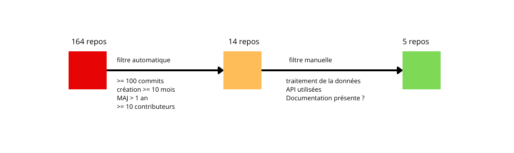

# DataForGood Repo Filter




# Filtrage Automatique

Ce dossier contient un script Python qui récupère tous les projets dataForGood et filtre ceux qui répondent aux critères suivants :

1. **Au moins 100 commits**
2. **Au moins 10 mois d'ancienneté**
3. **Mis à jour il y a moins d'un an**
4. **Au moins 10 contributeurs**

Le résultat est exporté dans un fichier CSV trié.

---

## 🔹 Prérequis

* Python ≥ 3.11
* Un **token GitHub** pour accèder au repos de dataForGood
* Modules Python listés dans `requirements.txt`

* Fichier `.env` contenant :

```
GITHUB_TOKEN=token_github
```

---

## 🔹 Utilisation

```bash
python dataForGood_projects_to_csv_filtered.py
```

* Un CSV `filtered_projects.csv` sera généré dans le dossier courant.
* Le CSV contient les colonnes :

  * `repo_name` : nom du repo
  * `nb_commits` : nombre total de commits
  * `nb_contributors` : nombre de contributeurs
  * `last_update` : date de dernière mise à jour
  * `created_at` : date de création**
  
# 🔹 Filtrage manuel

Après filtrage automatique, les projets ont été examinés manuellement pour identifier les 5 plus représentatifs. Cette sélection repose sur une lecture qualitative : la documentation présente, informations sur le traitement de la donnée et informations sur les API utilisées
