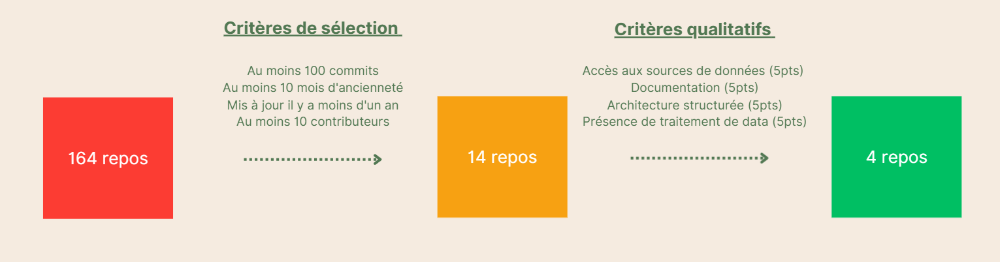

## Auteurs

Nous sommes 4 étudiants de Polytech Nice Sophia spécialisés en SSE (Sustainable Software Engineering) :

- ALLAIN Emma : [emma.allain@etu.unice.fr](mailto:emma.allain@etu.unice.fr)
- HESCHUNG Erwan : [mailme@heschungerwan.dev](mailto:mailme@heschungerwan.dev)
- KAHUNGU Jessica : [jessica.kahungu@etu.unice.fr](mailto:jessica.kahungu@etu.unice.fr)
- MAGNIN Mathis : [mathis.magnin1@etu.unice.fr](mailto:mathis.magnin1@etu.unice.fr)

## I. Contexte du projet

Data For Good est une communauté internationale de bénévoles qui mobilise leurs compétences en data science, développement et design pour répondre à des enjeux sociaux et environnementaux. Créée en 2014, cette organisation à but non lucratif réunit des professionnels et étudiants autour de projets concrets portés par des associations, ONG et acteurs de l'intérêt général.

Dans l'écosystème des projets open-source, Data For Good se distingue par sa nature collaborative et son engagement social. Les projets hébergés sur leur dépôt GitHub illustrent une diversité d'applications : de la visualisation de données pour l'insertion de migrants (projet ODIS) à l'analyse de la pollution de l'eau, en passant par la révélation des inégalités dans le cinéma français ou encore le portail de données sur la transition énergétique (ShiftDataPortal).

**Pourquoi ce contexte est-il intéressant ?**

L'étude des projets Data For Good présente plusieurs intérêts majeurs pour la recherche en génie logiciel :

**→ La centralité de la donnée** : Contrairement aux projets logiciels traditionnels centrés sur le code, les projets Data For Good placent la donnée au cœur de leur proposition de valeur. La qualité, la fiabilité et la mise à jour régulière des données conditionnent directement l'utilité sociale du projet.

**→ L'accès aux sources de données** : Ces projets combinent des sources de données hétérogènes (APIs publiques, fichiers Excel, bases de données gouvernementales, données d'associations), ce qui soulève des défis d'intégration, de pérennité et de gouvernance des données.

**→ L'importance sociétale des données** : À l'ère du RGPD et de la protection des données personnelles, ces projets open-source doivent naviguer entre transparence, réutilisabilité et respect de la vie privée. Ils incarnent une approche éthique de la gestion des données.

**→ Le modèle collaboratif bénévole** : Les contributeurs, souvent bénévoles et aux compétences variées (data scientists, développeurs, designers), façonnent l'évolution du projet de manière organique, ce qui influence directement les pratiques de gestion des données.

Cette recherche s'inscrit dans une démarche d'analyse empirique des pratiques réelles de gestion de données dans des projets open-source à impact social, un domaine encore peu exploré dans la littérature en génie logiciel.

## II. Problématique et motivations

### 1. Problématique principale

À partir d**'une analyse historique** des dépôts logiciels open-source de Data For Good, comment les **équipes** font-elles **évoluer leurs pratiques de collecte, de mise à jour et de structuration** des données afin de garantir **la qualité et la fiabilité** de leur projet ?

### 2. Motivations

Cette question de recherche est motivée par plusieurs faits :

- **La donnée comme actif central**

Dans un projet data-driven, la donnée est au centre du travail de l’ingénieur développeur. Sans données fiables et de qualité, un projet n’a tout simplement aucune valeur, peu importe la qualité du code ou des outils utilisés. La donnée conditionne les choix techniques, l’architecture et les résultats obtenus. En résumé, sans bonne donnée, un projet data ne peut pas réussir.

- **L'hétérogénéité des sources de données**

Les projets _Data For Good_ s’appuient sur des données très variées : APIs publiques, fichiers CSV mis à jour à la main, bases de données externes ou encore scraping web. Cette diversité est une richesse, mais elle complique aussi le travail : il faut gérer des formats différents, des mises à jour irrégulières et assurer une certaine cohérence entre toutes ces sources.

- **L'importance croissante de la gouvernance des données**

Depuis l’entrée en vigueur du RGPD, la gestion des données ne peut plus être pensée uniquement d’un point de vue technique. Les projets à vocation sociale doivent trouver un équilibre entre transparence, utilité des données et respect de la vie privée. Cela impose de nouvelles pratiques dès la collecte et tout au long du cycle de vie des données.

- **Le rôle des contributeurs dans l'évolution des données**

Dans les projets collaboratifs et bénévoles, les profils des contributeurs jouent un rôle clé. Selon qu’il s’agisse de data scientists, de développeurs ou de profils DevOps, les choix faits autour des données peuvent varier. Observer qui contribue, à quel moment et sur quelles parties du projet permet de mieux comprendre comment les données évoluent dans le temps.

- **Gestion du turnover dans les projets**

Les projets open-source doivent pouvoir continuer à fonctionner malgré le départ de contributeurs, les changements d’APIs externes ou l’évolution des besoins. Mettre en place des pipelines de données robustes et maintenables est donc essentiel. L’analyse de l’historique Git permet d’identifier les pratiques adoptées pour assurer cette continuité sur le long terme.

### 3. Sous-questions de recherche

De cette problématique générale découlent trois sous-questions :

**Sous-question 1 : Comment évolue l'accès aux données ?**

Cette question explore la dimension de **collecte des données** : quelles sources sont ajoutées au fil du temps ? Observe-t-on une stabilisation progressive ou une diversification continue ?

**Sous-question 2 : Comment les mécanismes de traitement des données évoluent-ils ?**

Cette question s'intéresse à la **mise à jour et structuration des données** : comment les pipelines de transformation (nettoyage, harmonisation, enrichissement) se structurent ils ? Assiste-t-on a des mise à jours régulières? Une fois la donnée implantée est-elle laissée pour compte ?

**Sous-question 3 : Comment évoluent les contributions au fil du temps ?**

Cette question porte sur la **dimension humaine** : quels profils de contributeurs interviennent, et à quel moment du cycle de vie du projet ? A quel moment les métiers liés à la data interviennent-ils?

### 4. Définitions des termes clés

Pour assurer la clarté de notre analyse, nous définissons les concepts centraux de notre problématique :

- **Pratiques de collecte** : ensemble des méthodes, outils et processus utilisés pour identifier, accéder et récupérer les données depuis leurs sources (APIs, fichiers, bases de données).
- **Mise à jour des données** : processus de rafraîchissement des données existantes pour refléter les changements dans les sources ou les besoins métier.
- **Structuration des données** : organisation, nettoyage, harmonisation et enrichissement des données brutes pour les rendre exploitables (architecture médaillon, schémas de bases de données, formats standardisés).
- **Qualité des données** : ensemble des propriétés garantissant l'adéquation des données à leur usage (exactitude, complétude, cohérence, fraîcheur, conformité).
- **Fiabilité du projet** : capacité du projet à maintenir un accès stable et continu aux données, à gérer les évolutions des sources externes et à assurer la reproductibilité des traitements.

## III. Protocole

### 1. Démarche générale

Afin de rendre notre analyse reproductible et systématique, nous avons établi un protocole d'étude en 5 phases distinctes. Chaque phase répond à un objectif spécifique et mobilise des outils adaptés. Les deux premières phases (0 et 1) servent à établir le contexte et le cadre de travail, tandis que les trois suivantes (2, 3, 4) répondent directement à nos sous-questions de recherche.

### 2. Récapitulatif des phases

| **Phase** | **Objectif**                                               | **Méthode**                                              |
| --------- | ---------------------------------------------------------- | -------------------------------------------------------- |
| **0**     | Mise en avant du contexte et critères de sélection         | Manuellement + script général                            |
| **1**     | Exploration du projet                                      | Script général                                           |
| **2**     | Évolution de l'accès aux données et aux sources de données | Script personnalisé (dépend de l'architecture des repos) |
| **3**     | Évolution du traitement des données                        | Script personnalisé (dépend de l'architecture des repos) |
| **4**     | Évolution des contributions                                | Script général                                           |

Nota bene : Bien que certains scripts soient personnalisés pour s'adapter aux spécificités architecturales de chaque projet, nous avons veillé à extraire le même type de résultats et les mêmes visualisations pour permettre une comparaison transversale.

### 3. Projets étudiés

Nous avons sélectionné **5 projets**, dont un projet test pour valider notre protocole. Dans la partie “Résultats et Analyse”, nous verrons comment ces projets ont été sélectionnés :

1. **Projet test - 13_ODIS** : Application d'aide à l'insertion de migrants [https://github.com/dataforgoodfr/13_odis](https://github.com/dataforgoodfr/13_odis)
2. **13_pollution_eau** : Analyse de la pollution de l'eau en France [https://github.com/dataforgoodfr/13_pollution_eau](https://github.com/dataforgoodfr/13_pollution_eau)
3. **13_reveler_inegalites_cinema** : Révéler les inégalités dans le cinéma français [https://github.com/dataforgoodfr/13_reveler_inegalites_cinema](https://github.com/dataforgoodfr/13_reveler_inegalites_cinema)
4. **ShiftDataPortal** : Portail de données sur la transition énergétique [https://github.com/dataforgoodfr/shiftdataport al](https://github.com/dataforgoodfr/shiftdataportal)
5. **13_eclaireur_public** : Outil d'analyse de la commande publique [https://github.com/dataforgoodfr/13_eclaireur_public](https://github.com/dataforgoodfr/13_eclaireur_public)

## IV. Hypothèses et expériences

### 1. Hypothèses de recherche

Afin de répondre à notre problématique, nous avons formulé **trois hypothèses principales**, chacune directement reliée à une sous-question de recherche.

- **Hypothèse 1 - Stabilisation de l’accès :** Les sources de données sont massivement introduites en début de projet, puis leur ajout décroît progressivement jusqu'à se stabiliser. Nous pensons qu’une fois les sources de donnée introduites, l'effort des contributeurs se déplace vers l'exploitation et le raffinement des données existantes plutôt que l'ajout de nouvelles sources.
  - Expérimentation : la phase 2 va nous permettre d’analyser l'évolution temporelle des fichiers de configuration de sources, un graphique de croissance du nombre de sources permettra d’illustrer cela.
- **Hypothèse 2 - Traitements de données** : le traitement des données est une activité dominée par la maintenance évolutive (amélioration, refactoring, adaptation) plutôt que l’ajout de nouveaux mécanismes de traitement dans le temps.
  - Expérimentation : la phase 3 va nous permettre d’analyser les types de modification des fichiers liées à la structuration, l’enrichissement et la mise à jour de données. Nous saurons si ce sont des créations, des suppressions ou des simples modifications et pourrons en tirer des conclusions.
- **Hypothèse 3 - Décalage des profils** : Les profils orientés données (data scientists, data analysts) interviennent principalement en début de projet, tandis que les profils infra/outillage (backend developpers, DevOps) apparaissent plus tard pour structurer et pérenniser les pipelines.
  - Expérimentation : la phase 4 nous permettra d’extraire, si disponible, les métiers de chaque contributeur et d’en faire une corrélation avec leurs commits associés et de pouvoir distinguer des phases de prédominance d’un métier plus qu’un autre tout au long du projet.

### 2. Démarche expérimentale

Dans un premier temps, nous avons appliqué un premier protocole au projet **13_ODIS**. Ce projet a été choisi comme test car :

- Il a démarré assez récemment (janvier 2025) mais avec une certaine ancienneté, offrant un historique complet et récent
- Il présente un nombre significatif de contributeurs (25)
- Il est fortement centré sur la donnée (application de visualisation de données d'insertion)
- Il dispose d'une documentation claire et complète, et d'une architecture bien structurée

**Contexte du projet ODIS** : Application permettant à l'association “J'Accueille” de visualiser des données utiles à l'insertion et l'implantation de personnes en situation de migration vers des territoires adaptés à leurs besoins (logement, santé, services publics, éducation). Le projet récupère et traite diverses sources de données de façon répétable.

**Objectifs de cette phase test** :

1. Tester nos scripts fonctionnent sur un projet réel
2. Valider que les résultats obtenus sont exploitables et interprétables
3. Identifier les limites méthodologiques et les ajustements nécessaires
4. Changer ou ajouter des étapes à notre protocole si nécessaires

**Résultats et enseignements de la phase test** :

L'application de notre premier protocole sur le projet pilote _13_ODIS_ a révélé plusieurs limites dans notre approche initiale, nous conduisant à affiner notre méthodologie avant de l'étendre aux autres projets :

- **Émergence de la Phase 1 (Exploration) :** Initialement, notre protocole ne prévoyait pas d'étape d'exploration automatisée. Nous avons tenté de comprendre l'architecture et le contexte du dépôt par une analyse purement manuelle, ce qui s'est révélé particulièrement fastidieux et peu scalable. Cette difficulté nous a poussés à développer la **Phase 1**, en créant un script de "dashboarding" automatique. Ce travail préliminaire est devenu indispensable pour obtenir une vue d'ensemble rapide (ratio code/data, arborescence) avant de lancer des analyses plus fines.
- **Validation des Phases 2 et 3 :** Concernant l'analyse de l'accès aux données (collecte) et de leur traitement, le projet test a conforté notre approche. Les résultats obtenus sur ODIS ont validé la pertinence de séparer distinctement l'analyse des sources (Phase 2) de celle des pipelines de transformation (Phase 3), confirmant ainsi la structure séquentielle de notre protocole.
- **Enrichissement de la Phase 4 (Contributions) :**
  L'analyse des contributeurs a évolué vers une méthodologie hybride. Nous avons développé un mécanisme d'inférence automatique qui agit en **complément** de l'analyse manuelle, sans s'y substituer. Ce script déduit un profil métier probable (Data Scientist, etc.) en fonction de la typologie des fichiers modifiés. Cette approche nous permet d'effectuer une **contre-analyse** systématique : les résultats inférés sont confrontés à notre catégorisation manuelle afin de confirmer nos hypothèses ou de lever des ambiguïtés sur certains profils complexes.

→ **Automatisation sur nos 4 projets sélectionnés**

Une fois le protocole ajusté et validé, nous l'avons appliqué à **4 autres projets** aux caractéristiques variées :

- **13_pollution_eau** : Projet d'analyse environnementale
- **13_reveler_inegalites_cinema** : Projet d'analyse sociologique
- **ShiftDataPortal** : Projet de visualisation de données énergétiques
- **13_eclaireur_public** : Projet d'analyse de marchés publics

### 3. Explication de chaque phase

Pour chaque phase, en plus de ce qui va être détaillé juste en dessous, une analyse manuelle va être effectuée étant donné l’analyse historique et qualitative que l’on souhaite mener.

Vous trouverez tous les scripts et résultats dans le dossier [assets/code](assets/code)

→ **Phase 0 - Sélection des objets d'étude :** Identifier et sélectionner les projets les plus pertinents pour notre analyse parmi les 164 dépôts Data For Good.

- **Script** : [assets/code/common/Phase0](assets/code/common/Phase0)
- **Critères quantitatifs** :
  - Au moins 10 mois d'ancienneté (permet d'observer des évolutions)
  - Au moins 100 commits (garantit une historique suffisant)
  - Mis à jour il y a moins d'un an (assure une activité récente)
  - Au moins 10 contributeurs (diversité des profils)

    → Ces critères vont permettre de réduire l'ensemble des dépôts à un sous-ensemble restreint.

- **Critères qualitatifs** (notation sur 5 points chacun). Nous n’avons volontairement pas défini en détail chaque critère, de sorte à ce que nos avis ne soit pas biaisés ou orientés vers une simple définition ou compréhension :
  - Accès aux sources de données
  - Documentation du projet
  - Architecture structurée
  - Présence de traitement de données
    → Une fois les notes renseignées par les membres de notre groupe pour chaque dépôt, nous en faisons une somme des quatre notes attribuées pour chacun, et nous conservons les 4 dépôts ayant la note totale la plus élevée. Nous validons ensuite les résultats par le coefficient de concordance de Kendall (W) pour assurer la robustesse de notre sélection. En effet, ce coefficient mesure l'accord entre évaluateurs (W ∈ [0,1], où 1 = accord parfait). Cette validation garantit que notre sélection finale n'est pas biaisée par les préférences individuelles.

→ **Phase 1 - Exploration des projets :** Caractériser finement chaque projet pour comprendre son contexte, son architecture et ses particularités.

- **Script :** [assets/code/common/Phase1](assets/code/common/Phase1)
- **Résultat du script** : Le script global génère 5 fichiers JSON/CSV dans le dossier `results/` de chaque repo : (1) l'arborescence complète du repository, (2) la distribution des fichiers par extension, (3) l'inventaire détaillé des fichiers de données avec leur taille, (4) un profil synthétique du repository (nombre total de fichiers, ratio de fichiers de données), et (5) un résumé statistique calculant les ratios data/code/notebooks pour caractériser la nature du projet. Ces résultats permettent de comprendre rapidement l'architecture, les technologies utilisées, et la répartition entre code et données de chaque projet étudié.

→ **Phase 2 - Évolution de l'accès aux données** : Analyser comment les sources de données sont ajoutées, modifiées ou abandonnées au fil du temps.

- **Script** : Personnalisé selon l'architecture de chaque projet ( voir phase 2 du dossier spécifique au projet)
- **Résultat du script** : Le script génère deux fichiers CSV dans le dossier de résultats : (1) `first_seen_sources.csv` listant chaque source de données avec son premier commit d'apparition (hash, date exacte, mois) pour tracer l'historique d'introduction des sources, et (2) `first_seen_modes.csv` listant chaque mode d'accès aux données (API, fichier local, scraping) avec sa première apparition. Ces résultats permettent de visualiser temporellement l'évolution de la diversification des sources et de valider l'hypothèse de stabilisation progressive de l'accès aux données.

→ **Phase 3 - Évolution du traitement des données :** Comprendre comment les mécanismes de transformation des données se structurent et évoluent.

- **Script:** Personnalisé selon l'architecture de chaque projet ( voir phase 3 du dossier spécifique au projet)
- **Résultat du script :** Le script génère un fichier CSV (`data_preparation_history.csv`) contenant l'historique complet de tous les commits affectant les fichiers de traitement de données (scripts Python, notebooks, scripts shell ou autres analyses de ces ficheirs manuellement) avec pour chaque modification : la date, l'auteur, le fichier concerné, le type de changement (ADD/MODIFY/DELETE), le nombre de lignes ajoutées/supprimées et le message de commit. Ce résultat permet d'analyser la répartition temporelle des types de modifications (création vs maintenance évolutive), d'identifier les phases de refactoring intensif, et de valider l'hypothèse selon laquelle le traitement des données est dominé par la maintenance plutôt que par la création initiale de pipelines figés.

→ **Phase 4 -** Évolution des contributions **:** Identifier les profils de contributeurs et leur intervention dans le cycle de vie du projet.(sampling ?)

- **Script:** [assets/code/common/Phase4](assets/code/common/Phase4)
- **Résultat du script :** Le script génère un fichier CSV (`contributors_jobs_inferred.csv`) contenant pour chaque contributeur unique (identifié par nom canonique) son nom, son email et son métier inféré automatiquement (Data Scientist, Backend Developer, DevOps, etc.) basé sur l'analyse de ses contributions par catégorie de fichiers (données, infrastructure, frontend, documentation). Ce résultat permet de tracer l'évolution temporelle de la présence des différents profils tout au long du cycle de vie du projet et de valider l'hypothèse selon laquelle les profils orientés données interviennent principalement en début de projet tandis que les profils infra/backend apparaissent plus tard pour pérenniser les pipelines.

### V. Analyse des résultats et conclusion

Cette partie va s’organiser de la manière suivante : une partie pour chaque phase avec les résultats obtenus pour chaque dépôt, et une phrase bilan à la fin qui confirme ou infirme nos hypothèses. Des limites peuvent également apparaître. Tous les résultats (csv, png) sont disponibles sur notre dépôt Github pour chaque dépôt étudié et chaque phase dans le dossier /results associé.

### **Phase 0 - Sélection des objets d’étude**

**Résultats**

Nous avons lancé notre script et nous avons obtenu 14 dépôts qui répondaient à nos critères de sélection ([assets/code/KENDALL](assets/code/KENDALL)) . Ensuite, nous avons attribué une note totale sur 20 sur l’ensemble des critères qualitatifs pour extraire 4 dépôts finaux d’étude. L’accord entre les évaluateurs a été mesuré à l’aide du coefficient de concordance de Kendall (W, compris entre 0 et 1) et nous avons obtenu :

| **Critère**                 | **Kendall’s W** |
| --------------------------- | --------------- |
| Documentation               | 0.62            |
| Traitement des données      | 0.69            |
| Accessibilité des données   | 0.62            |
| Diversité de l’architecture | 0.53            |

**Bilan**

Nous avons W global = 0,61, indiquant un bon niveau d’accord et nous avons donc ces 4 projets :

- **13_pollution_eau** : Projet d'analyse environnementale
- **13_reveler_inegalites_cinema** : Projet d'analyse sociologique
- **ShiftDataPortal** : Projet de visualisation de données énergétiques
- **13_eclaireur_public** : Projet d'analyse de marchés publics

**Limites à l’analyse**

Cette phase met en évidence une limite majeure liée au nombre restreint de dépôts analysés. L’analyse historique approfondie nécessaire pour chaque projet étant particulièrement chronophage, les contraintes de temps ont limité la grandeur de notre échantillonnage.

De plus, un critère de sélection pertinent aurait pu être la diversité des architectures et des contextes des projets, afin de les mettre en corrélation et de garantir des comparaisons plus significatives. En l’absence de ce critère, les dépôts sélectionnés peuvent présenter soit des similarités trop importantes, réduisant l’intérêt de l’analyse comparative, soit au contraire une diversité excessive, rendant les comparaisons moins efficaces.

### Phase 1 - Exploration des projets

**Résultats**

- **13_pollution_eau** : Projet d'analyse environnementale

→ Contexte et particularités :

Le projet est un outil cartographique interactif porté par Générations Futures et Data For Good, permettant de consulter la qualité de l’eau potable en France. Il s’appuie sur des données ouvertes chargées dynamiquement pour visualiser les concentrations de cinq familles de polluants chimiques : pesticides, PFAS, nitrates, CVM et perchlorate.

Sur le plan technique, l’architecture repose sur des pipelines Python pour l’ingestion et le nettoyage des données, ainsi que sur des modèles DBT pour les transformations SQL structurées en couches. Les données sont stockées dans DuckDB sous forme de PMTiles pour la cartographie. L’ensemble est mis à jour mensuellement, sans stockage de fichiers de données volumineux dans le dépôt et sans usage opérationnel de notebooks Jupyter, uniquement utilisés lors de la phase de développement du projet.

→ Dashboard récapitulatif :

- **13_reveler_inegalites_cinema** : Projet d'analyse sociologique

→ Contexte et particularités :

Le projet s’inscrit dans une démarche de sensibilisation et d’analyse des inégalités de genre et raciales dans le cinéma français. Son objectif est de rendre visibles ces inégalités, à la fois pour le grand public et pour les institutions, en s’appuyant sur des données factuelles et des indicateurs mesurables.

Pour cela, le projet vise à développer une application web permettant de collecter, analyser et visualiser des données issues de différentes sources liées au cinéma. Les données sont centralisées dans une base structurée, enrichies par des scripts de scraping et d’analyse, puis exploitées pour produire des graphiques et des KPI mettant en évidence les déséquilibres existants. L’ambition globale du projet est de fournir un outil pédagogique et analytique qui facilite la compréhension des mécanismes d’inégalités dans l’industrie cinématographique française.

→ Dashboard récapitulatif :

- **ShiftDataPortal** : Projet de visualisation de données énergétiques

→ Contexte et particularités :

C’est un projet dont l’objectif est la centralisation et la mise à disposition de données ouvertes relatives aux enjeux énergie-climat. La plateforme permet l’exploration et l’analyse d’indicateurs énergétiques et environnementaux.

L’architecture du projet repose sur une chaîne de traitement des données structurée, comprenant des étapes d’ingestion, de nettoyage et de normalisation réalisées via des scripts Python. Les données sont ensuite stockées dans une base SQLite et exposées par une API GraphQL, puis consommées par le frontend. Cette organisation vise à garantir la cohérence des données et à faciliter leur exploitation.

→ Dashboard récapitulatif :

- **13_eclaireur_public** : Projet d'analyse de marchés publics

→ Contexte et particularités :

Ce projet a pour mission de regrouper et de rendre intelligibles les données financières des collectivités territoriales, notamment les marchés publics et les subventions. La plateforme offre des outils de surveillance permettant de repérer d'éventuels écarts de gestion.

Sur le plan technique, le backend s'articule autour d'un pipeline d'ingénierie des données en Python, chargé de collecter, d'assainir et de standardiser des sources initialement disparates. Une fois structurées, ces informations sont mises à disposition via une API pour alimenter l'interface utilisateur.

→ Dashboard récapitulatif :

**Bilan :**

Dans le but de rendre l’analyse plus concrète, nous les avons regroupés :

Les repositories étudiés partagent une base technologique et méthodologique commune (manipulation de données structurée par exemple), ce qui justifie leur mise en comparaison et garantit la pertinence de nos outils d'analyse. Toutefois, les différences de volumétrie, de répartition données/code et de formats utilisés indiquent des contextes et des objectifs distincts. Il y a une diversité des profils de projets identifiés, on peut en distinguer 3 principaux :

- Projets exploratoires (ex: 13_reveler_inegalites_cinema) : forte proportion de notebooks, focus sur l'analyse et la visualisation, moins de code de production
- Projets applicatifs \*\*\*\*(ex: ShiftDataPortal) : architecture structurée avec backend/frontend, pipelines de données formalisés, base de données persistante
- Projets hybrides (ex: 13_pollution_eau, 13_eclaireur_public) : combinaison d'analyses exploratoires et de composants applicatifs

De plus la maturité des projets n’est pas la même, certains montrent une activité récente soutenue tandis que d’autres sont à l’arrêt ou fonctionne par cycle.

→ Nous pouvons donc nous attendre à voir des similarités mais également des divergences durant les prochaines phase dus à leurs objectifs fonctionnels différents.

**Limites à l’analyse**

Cette phase présente plusieurs limitations, d’un point de vue qualitatif, les dashboards ne montrent pas la qualité des projets (tests, séparation des responsabilités), alors que ces aspects influencent directement l'évolution des pratiques de gestion des données. Concernant la comparabilité, les projets présentent des ordres de grandeur différents et n'adoptent pas les mêmes conventions de commit, rendant les comparaisons directes délicates. Il faudra donc privilégier les ratios et tendances relatives dans les phases suivantes, et adapter nos scripts pour pallier l'hétérogénéité des pratiques de documentation des modifications.

### Phase 2 - **Évolution de l'accès aux données**

**Résultats**

- **13_pollution_eau** : Projet d'analyse environnementale

→ Résultat script :

→ Commentaire analyse manuelle :
Le projet de pollution de l’eau utilise des références HTTP définies dans différents clients (`/pipelines/tasks/client`), chacun étant associé à une source de données précise (data.gouv.fr, OpenDataSoft, INSEE, Atlasanté). Ces sources étant structurellement stables, les URLs qu’elles exposent ne changent pas ou très peu une fois les clients en place, ce qui explique que l’évolution des références se stabilise après environ trois mois.

En complément, certaines données ne proviennent pas d’appels HTTP mais de seeds DBT fournies par Générations Futures (`/dbt_/seeds`). Ces données de référence, intégrées directement au projet, servent notamment à définir les seuils de qualité utilisés pour l’analyse et ne sont pas appelées à évoluer fréquemment.

- **13_reveler_inegalites_cinema** : Projet d'analyse sociologique

→ Résultat script :

→ Commentaire analyse manuelle :

“reveler_inegalites_cinema” montre une évolution de l’accès aux données plus progressive que centralisée. Les nouvelles sources sont introduites de manière étalée dans le temps, sans phase de collecte massive initiale, ce qui suggère un accès aux données contraint par l’identification progressive des sources pertinentes plutôt que par une stratégie d’ingestion structurée dès le départ.

Cette distribution temporelle reflète un contexte où les données ne sont pas immédiatement accessibles ou standardisées : l’accès dépend de recherches manuelles, par scraping de certaines sources précises telles que AlloCiné, de la découverte de jeux de données hétérogènes (institutions, bases cinéma, sources médiatiques) et de leur exploitabilité effective. L’absence de pic marqué indique que l’accès aux données s’adapte au fil de l’avancement du projet et des besoins analytiques, traduisant une logique exploratoire plutôt qu’une phase d’ingestion intensive et planifiée.

- **ShiftDataPortal** : Projet de visualisation de données énergétiques

→ Résultat script :

→ Commentaire analyse manuelle :

ShiftDataPortal adopte une architecture centralisée pour la gestion des sources : toutes les références aux APIs et datasets sont regroupées dans le dossier `data-preparation/` avec des fichiers de configuration dédiés par organisme (IEA, World Bank, IPCC). Le pic massif de 30 sources en juin 2024 correspond à l'intégration structurée de multiples datasets thématiques (énergie, émissions, climat) provenant d'une migration depuis un système de collecte dispersé vers une approche standardisée, expliquant cette concentration inhabituelle sur un seul mois.

- **13_eclaireur_public** : Projet d'analyse de marchés publics

→ Résultat script :

→ Commentaire analyse manuelle :

Éclaireur Public adopte une architecture centralisée pour le pilotage de ses flux d'ingestion : l'intégralité des références aux endpoints HTTPS et fichiers statiques est regroupée dans le fichier de configuration `back/config.yaml`. Ce registre centralise les connexions vers les grands fournisseurs institutionnels tels que DataGouv, l'INSEE et l'Observatoire des Finances (ODF). Cette approche présente toutefois une limite structurelle liée à la granularité des sources : un endpoint unique agissant souvent comme un catalogue complet, une seule entrée dans la configuration référence en réalité une multiplicité de jeux de données sous-jacents, ce qui masque la complexité réelle des flux et complique la traçabilité unitaire des datasets au niveau du fichier de configuration.

**Bilan**

Notre Hypothèse 1 est partiellement validée : tous les projets montrent effectivement une décroissance de l'ajout de sources après une phase initiale intensive. Cependant, la temporalité varie fortement : certains projets se stabilisent en quelques mois (pollution_eau), tandis que d'autres connaissent des réactivations tardives (ShiftDataPortal avec son pic à 18 mois du début du projet).

→ Diversité des stratégies d'acquisition

On peut donc en conclure que les projets adoptent des stratégies différentes selon leur nature :

- Projets analytiques (pollution_eau, cinema) : sources limitées mais ciblées, collecte rapide et focalisée
- Projets de portail de données (ShiftDataPortal, éclaireur_public) : volume important de sources, acquisition plus étalée ou par lots massifs

—> Compléter avec les analyses manuelles faites

**Limites à l’analyse**
Ici, les graphiques montrent le nombre de sources ajoutées, mais ne distinguent pas leur importance relative. Une API fournissant 80% des données du projet est comptabilisée de la même manière qu'un fichier CSV marginal. Cette limitation empêche d'évaluer si la stabilisation observée correspond au fait que toutes les données nécessaires sont disponibles ou simplement à un ralentissement de l'activité. Enfin, l’analyse ne croise pas l'évolution des sources avec l'activité générale du projet (nombre de commits, contributeurs actifs). Une stabilisation des sources peut refléter soit une maturité du projet, soit un abandon progressif.

### Phase 3 - **Évolution du traitement des données**

**Résultats**

- **13_pollution_eau** : Projet d'analyse environnementale

→ Résultat script :

→ Commentaire analyse manuelle :
Le projet de pollution de l’eau repose sur un traitement structuré des données. Les données brutes sont d’abord insérées dans DuckDB via des clients spécifiques, puis transformées à travers plusieurs couches DBT : staging, pour le nettoyage, le typage et la validation des données brutes, intermediate, pour les jointures complexes, les agrégations et les calculs de conformité au niveau des UDI et des communes, et enfin website, où les modèles sont optimisés pour la consommation front-end.

L’activité de traitement, illustrée sur le graphique, montre que les modifications sont concentrées sur certaines périodes et concernent principalement des ajouts (ADD) et des modifications (MODIFY), avec peu de suppressions ou de renommages. Une fois les pipelines et les modèles DBT mis en place, l’essentiel du travail consiste à consolider et optimiser les transformations plutôt qu’à modifier ou supprimer fréquemment les sources ou la logique métier.

- **13_reveler_inegalites_cinema** : Projet d'analyse sociologique

→ Résultat script :

→ Commentaire analyse manuelle :

L’évolution du traitement des données dans “reveler_inegalites_cinema**”** montre une mise en place progressive du pipeline autour de scripts dédiés à l’extraction, au traitement et à l’enrichissement de données cinématographiques. Les premières phases correspondent à l’intégration de données institutionnelles issues du CNC (fichiers Excel) et à leur structuration via des scripts d’extraction dédiés. Ces données constituent un socle de référence sur la production et la diffusion des films.

Une seconde phase est marquée par l’introduction de traitements liés à AlloCiné, combinant scraping, appariement et enrichissement des films dans le but de relier différentes sources et d’augmenter la couverture des informations disponibles. Les modifications ultérieures des scripts de type “data processing” traduisent des ajustements des règles de normalisation et de matching nécessaires pour assurer la cohérence des jeux de données produits.

L’apparition tardive de fichiers de type Machine Learning correspond à une phase d’enrichissement avancée du pipeline. Les prédictions issues de modèles de Machine Learning, appliquées à des supports médiatiques comme les affiches et les bandes-annonces, permettent de produire des indicateurs supplémentaires exploitables dans l’analyse sociologique, en apportant des informations qui ne sont pas directement disponibles dans les sources structurées initiales. Ces traitements s’appuient sur les données préparées en amont et viennent compléter l’analyse sans modifier la chaîne de collecte principale.

- **ShiftDataPortal** : Projet de visualisation de données énergétiques

→ Résultat script :

→ Commentaire analyse manuelle :
L’analyse du dossier `data-preparation/` montre une pipeline ETL structurée en trois couches : scripts d'ingestion (fetch), scripts de nettoyage/normalisation (clean), et scripts de transformation finale (transform), avec une évolution marquée par des refactorings réguliers pour harmoniser les formats hétérogènes des sources internationales. La prédominance des modifications (MODIFY) s'explique par les adaptations constantes aux changements de schémas des APIs externes et l'enrichissement progressif des règles métier pour calculer de nouveaux indicateurs climatiques à partir des données brutes.

- **13_eclaireur_public** : Projet d'analyse de marchés publics

→ Résultat script :

→ Commentaire analyse manuelle :

L’analyse du dossier `/back/scripts/enrichment` met en évidence une étape cruciale du pipeline ETL dédiée à la valorisation des données pour l'affichage frontend. La prédominance des modifications (MODIFY) dans ce répertoire traduit une démarche d'amélioration continue du traitement : plutôt que d'ajouter constamment de nouvelles briques, les efforts se concentrent sur l'affinement des algorithmes existants pour augmenter la précision des indicateurs et garantir que la donnée restituée aux citoyens gagne en fiabilité et en pertinence.

**Bilan**

L’analyse de l'évolution des mécanismes de traitement des données révèle un pattern commun à tous les projets : la prédominance de la maintenance évolutive sur la création initiale de pipelines.
Les graphiques montrent une prédominance systématique des zones bleues (MODIFY) dans tous les projets analysés. Cette observation est particulièrement marquée pour 13_pollution_eau et cinema, où les modifications représentent la majeure partie de l'activité sur les scripts de traitement. Cela démontre que les équipes investissent l'essentiel de leur effort à adapter leur code plutôt qu'à créer de nouveaux scripts en continu. Les graphiques du bas (volume d'actions hebdomadaires) montrent des pics d'activité périodiques particulièrement visibles sur éclaireur_public et ShiftDataPortal. Ici, on suggère un développement par sprints.

Notre Hypothèse 2 est pleinement validée : le traitement des données n'est pas une activité de création puis d'oubli, mais bien un produit nécessitant une maintenance continue. Les pipelines reposent sur cette capacité d'ajustement permanent face aux évolutions des sources, des besoins métier et de la qualité des données.

**Limites à l’analyse**
L’analyse regroupe toutes les modifications sans distinguer leur nature : un simple ajustement de paramètre ou ajout de commentaire est comptabilisé de la même manière qu'une refonte complète d'un algorithme. Cette limitation empêche d'évaluer la véritable évolution du code et peut surestimer l'importance de certaines phases de maintenance.

L’analyse ne permet pas de savoir si les modifications améliorent effectivement la qualité des données produites. Un projet avec beaucoup de modifications peut soit être très réactif et améliorer continuellement ses sorties, soit être instable et corriger sans cesse des erreurs. Sans métriques de qualité des données en sortie (complétude, exactitude, fraîcheur), cette distinction reste impossible.

### Phase 4 - Évolution des contributions

**Résultats**

- **13_pollution_eau** : Projet d'analyse environnementale

→ Résultat script :

- **13_reveler_inegalites_cinema** : Projet d'analyse sociologique

→ Résultat script :

- **ShiftDataPortal** : Projet de visualisation de données énergétiques

→ Résultat script :

- **13_eclaireur_public** : Projet d'analyse de marchés publics

→ Résultat script :

**Bilan**

Nous avons développé un script permettant de visualiser l'évolution moyenne des métiers sur l'ensemble des projets analysés, avec une normalisation temporelle sur un an. Ce graphique agrégé confirme les observations issues de nos quatre graphiques individuels : on constate un pic d'activité des Data Engineers ( rose fluorescent) et des Data Scientists ( bleu ciel fluorescent) en phase initiale de projet. Bien que de nouvelles contributions apparaissent au cours du cycle de développement pour assurer le suivi du projet, nos résultats confirment cette tendance initiale de forte mobilisation des profils data en début de projet.

En conclusion de notre phase expérimentale, l’évolution des contributions met en évidence un cycle de vie en trois phases, marqué par une forte implication des profils orientés données en début de projet.

- Début de projet : les Data Scientists et Data Engineers sont très majoritaires, traduisant leur rôle clé dans la conception des pipelines et de l’infrastructure data.
- Phase intermédiaire : leur présence diminue progressivement, avec une coexistence entre profils data et profils engineering plus généralistes.
- “Projet mature” : l’intervention des profils data devient marginale, la maintenance et l’opérationnalisation étant principalement assurées par les équipes backend et infrastructure.

Globalement, les profils data interviennent surtout lors des phases de conception, puis se retirent progressivement au profit des équipes en charge de l’exploitation et de la maintenance. Notre hypothèse 3 est partiellement validée : les profils orientés données interviennent effectivement massivement en début de projet. La décroissance observée suggère bien que les profils infra/backend apparaissent plus tard, mais nous ne pouvons pas confirmer formellement leur arrivée faute de données précises sur leur identification.

**Limites à l’analyse**

L’analyse présente plusieurs biais qui limitent la solidité des conclusions. Elle se base sur les intitulés de poste sans mesurer la maturité réelle ni l’impact des profils, ce qui peut fausser l’interprétation des contributions. Les projets analysés ont des niveaux de maturité très différents, rendant le sampling mensuel peu représentatif, en particulier sur les phases tardives. De plus, l’échantillon de projets est trop réduit pour généraliser les résultats. Enfin, la disponibilité et la fiabilité limitées des informations sur les contributeurs (profils auto-déclarés, rôles peu précis) affaiblissent la classification des profils techniques.

### Conclusion générale

Notre étude de cas historique sur 4 projets Data For Good révèle des patterns communs dans l'évolution des pratiques de gestion des données, malgré des contextes métier différents :

| Phase d'analyse                                         | Observation principale                                                                                                                                   | Validation hypothèse               |
| ------------------------------------------------------- | -------------------------------------------------------------------------------------------------------------------------------------------------------- | ---------------------------------- |
| **Phase 1 - Exploration**                               | Diversité des projets analysés (stades de maturité variés, architectures hétérogènes)                                                                    | Phase de contexte                  |
| **Phase 2 - Accès aux données et sous question 1**      | Gros volume de sources au début, puis stabilisation progressive. Certaines sources atteignent rapidement leurs limites                                   | Hypothèse 1 : Validée              |
| **Phase 3 - Traitement des données et sous question 2** | Évolution par phases de sprints. Passage universel de notebooks ad-hoc à pipelines structurés. Maintenance évolutive domine (60% des commits)            | Hypothèse 2 : Validée              |
| **Phase 4 - Contributions et sous question 3**          | Les Data Scientists apparaissent surtout au début (exploration). Décalage temporel avec les Data Engineers (industrialisation) et DevOps (stabilisation) | Hypothèse 3 : Validée avec nuances |

### Réponse à la problématique principale

Cette étude de cas historique démontre que les projets data-driven open-source, malgré leur diversité, partagent des patterns d'évolution communs dans leurs pratiques de gestion des données. La stabilisation de l'accès aux sources, la dominance de la maintenance évolutive et le décalage temporel des profils contributeurs sont des phénomènes robustes observés sur tous nos cas d'étude. Ces résultats ont des implications pratiques immédiates pour les porteurs de projets Data For Good : anticiper les phases de transition, recruter les profils adaptés au bon moment, et structurer dès le début une architecture extensible. Ils ouvrent également des perspectives de recherche prometteuses sur la généralisation de ces patterns à d'autres écosystèmes et la formalisation de modèles théoriques.

### Limites générales à notre étude

D’un point de vue méthodologique, l’étude repose sur un échantillon très restreint, ce qui limite fortement la généralisation des résultats. La diversité des structures de projets impose des approximations méthodologiques, réduisant la précision de l’analyse. La classification incomplète des contributeurs, basée en partie sur des inférences, introduit un biais supplémentaire.

De plus, des limites liées à l’analyse des données peuvent être observées, l’analyse ne sait pas identifier les sources de données abandonnées ou obsolètes, ce qui peut biaiser les résultats. Elle privilégie une approche quantitative, sans pondérer l’importance réelle des sources utilisées. Enfin, l’absence de contexte métier explicite empêche d’interpréter correctement certaines décisions techniques observées dans les dépôts.

Enfin d’autres limites, liées spécifiquement au contexte Data For Good, doivent être prises en compte. Les projets reposent sur un engagement bénévole, susceptible d’influencer les pratiques par rapport à des contextes commerciaux ou académiques. Les critères de sélection favorisent les projets les plus structurés, introduisant un biais vers des cas “réussis”. Enfin, les pratiques observées peuvent être culturellement situées, notamment dans le cadre de Data For Good France, et ne pas être représentatives d’autres organisations ou chapitres internationaux.

### VI. Outils

Pour garantir la reproductibilité de nos résultats et la rigueur de notre analyse, nous avons défini une stack technique précise et nous nous sommes appuyés sur des standards méthodologiques reconnus.

**A. Environnement de développement**

L'ensemble des scripts d'analyse a été développé en **Python (≥ 3.11)**, en s'appuyant sur un fichier `requirements.txt` pour la gestion des dépendances. Les principales librairies utilisées sont :

- **pydriller (≥ 2.9)** : Pilier de notre extraction de données, utilisé pour miner l'historique Git et reconstruire l'évolution des fichiers.
- **pandas (≥ 1.5.0)** : Utilisé pour la manipulation des dataframes et l'agrégation des statistiques (commits, contributeurs).
- **matplotlib (≥ 3.7.0)** : Génération des graphiques et visualisation des tendances temporelles.

**B. Validation statistique**

Afin d'éviter les biais dans la sélection des projets (Phase 0), nous avons utilisé un outil statistique d'aide à la décision :

- **Coefficient de concordance de Kendall (W)** : Mesure l'accord entre les évaluateurs lors de la notation qualitative des dépôts, assurant que le choix des 4 projets finaux fait consensus au sein du groupe.

### VII. Références

Notre protocole d'analyse et nos choix de visualisation s'appuient sur les ressources suivantes :

- **ACM SIGSOFT Empirical Standards** : Standard académique utilisé pour structurer notre démarche d'étude de cas ("Case Study").
  - _Source : [https://www2.sigsoft.org/EmpiricalStandards/docs/standards?standard=CaseStudy](https://www2.sigsoft.org/EmpiricalStandards/docs/standards?standard=CaseStudy)_
- **From Data to Viz** : Guide de référence utilisé pour choisir les représentations graphiques les plus adaptées à nos types de données (temporelles et catégorielles).
  - _Source : [https://www.data-to-viz.com/](https://www.data-to-viz.com/)_
- **Information is Beautiful** : Inspiration pour les bonnes pratiques de design et de lisibilité des visualisations de données.
  - _Source : [https://informationisbeautiful.net/](https://informationisbeautiful.net/)_
- **IBM Data Lineage** : Référence conceptuelle pour définir la traçabilité et le cycle de vie de la donnée dans notre analyse.
  - _Source : [https://www.ibm.com/think/topics/data-lineage](https://www.ibm.com/think/topics/data-lineage)_
- **Linux Foundation Research** : Cadre de référence pour comprendre les enjeux de la "Software Bill of Materials" (SBOM) appliquée à l'IA et à la data.
  - _Source : [https://www.linuxfoundation.org/research/ai-bom](https://www.linuxfoundation.org/research/ai-bom)_
- **Kendall's W (Wikipedia)** : Base théorique pour l'interprétation de notre coefficient de concordance.
  - _Source : [https://en.wikipedia.org/wiki/Kendall's_W](https://en.wikipedia.org/wiki/Kendall's_W)_
