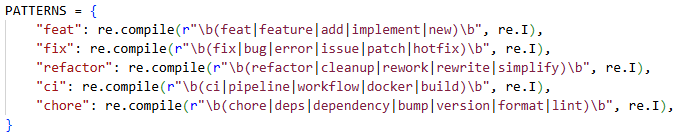
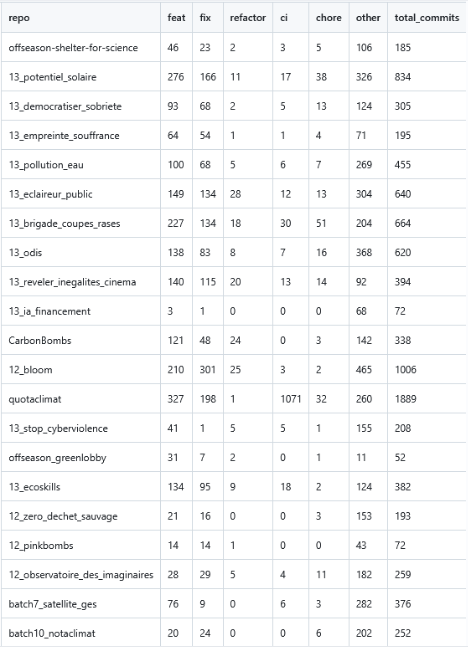
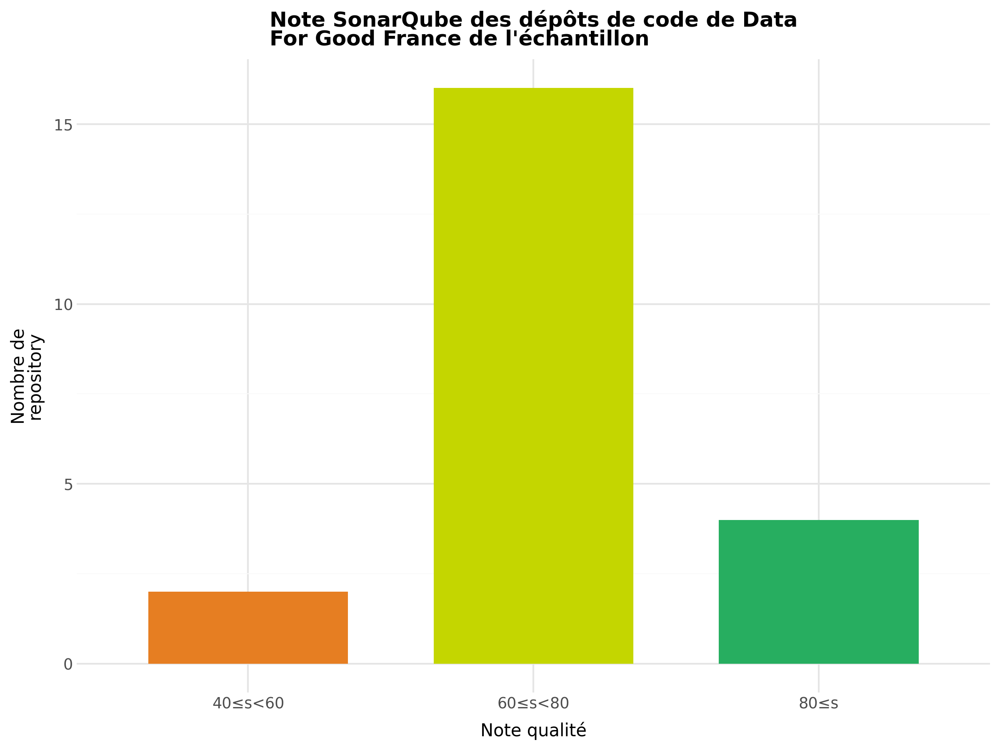
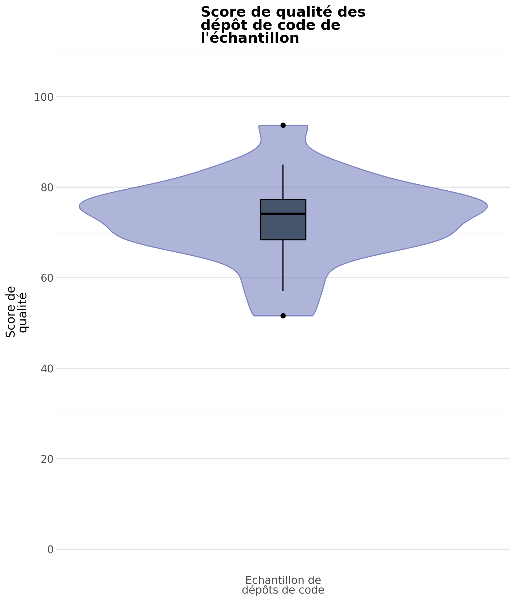
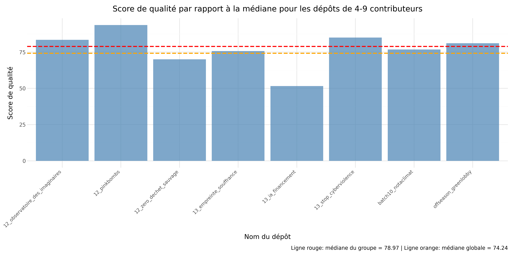
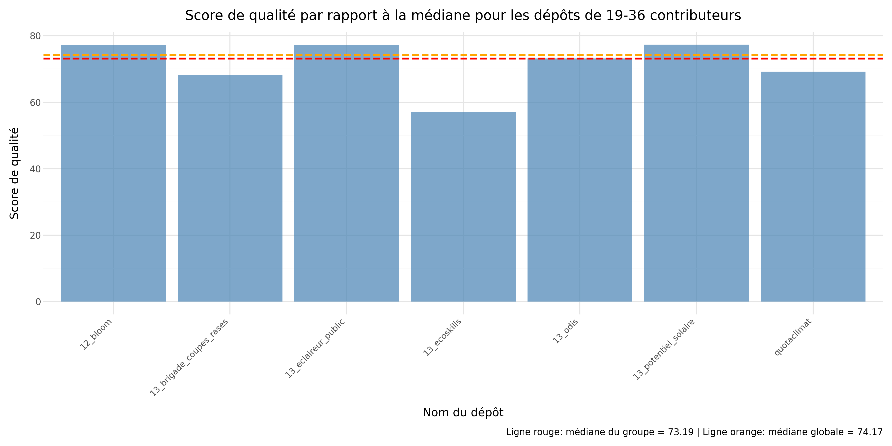
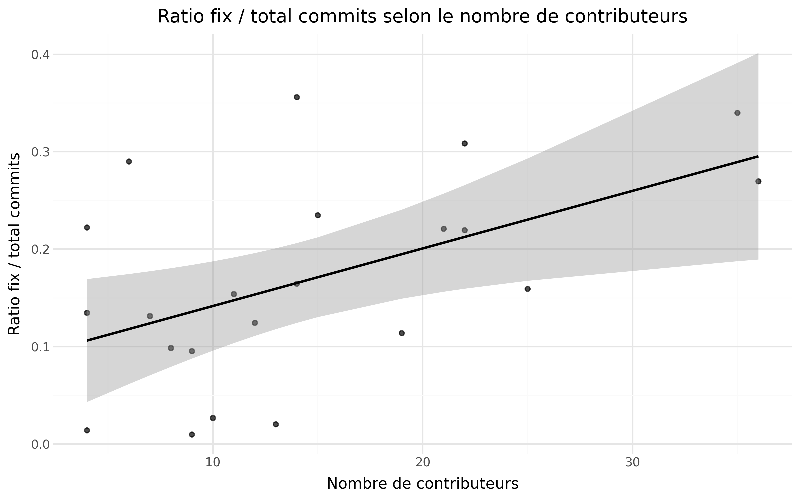
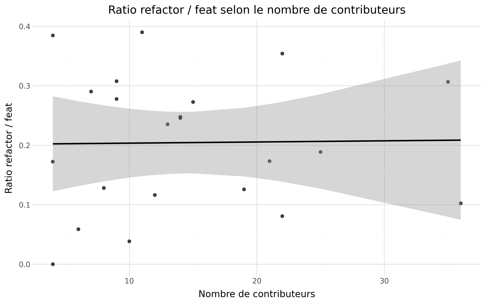

**_février 2026_**

## Authors

Nous sommes 4 étudiants en 5ème année à Polytech Nice Sophia de la mineure SSE en Informatique.

* Théo LASSAUNIERE &lt;theo.lassauniere@etu.unice.fr&gt;
* Mathis JULLIEN &lt;mathis.jullien@etu.unice.fr&gt;
* Thibault RIPOCHE &lt;thibault.ripoche@etu.unice.fr&gt;
* Julie SEYIER &lt;julie.seyier@etu.unice.fr&gt;

## I. Contexte de recherche

### Contexte de l'étude

Nous avons réalisé une étude de cas des projets de l'association [Data For Good France](https://github.com/dataforgoodfr/).
Data For Good France est une association existant depuis 2015 dont l'objectif est de créer des projets numériques pour l’écologie, la justice sociale et la démocratie.
L'association possède plus de 160 dépôts de code open source sur GitHub qui sont créés et maintenus par des bénévoles avec des profils divers.

### Pourquoi cette étude est intéressante

Nous trouvons cette étude intéressante car elle explore l’impact que peut avoir un processus de développement réalisé par des contributeurs avec différents niveaux d'expériences sur la qualité des projets d’une organisation open source.
On espère à travers cette étude mieux comprendre comment des développeurs se coordonnent pour maintenir des projets avec un code durable et facile à prendre en main par différents acteurs dans le cadre d’organisation associative.
Nous espérons qu'à travers cette étude nous identifierons des pratiques de code et d'organisation intéressante et utiles dans notre carrière professionelle.

## II. Question générale et sous-questions

### Question générale

**Depuis 2023, quels facteurs liés aux contributeurs influencent la qualité des dépôts de codes de Data For Good France ?**

Dans une étude de cas sur les dépôts de code de l’association Data For Good France, cette problématique nous paraît pertinente car elle permet de mettre en exergue les particularités de ces dépôts qui sont gérés par des bénévoles et basés sur des templates mais dont l'implémentation diffèrent grandement dû aux différents contributeurs impliqués.

### Sous-questions

1. Quel est le niveau de qualité des dépôts de code étudiés ?

Cette sous-question porte l'étude au niveau du code des dépôts en s'intéressant particuliérement à la définition d'une métrique permettant d'évaluer le niveau de qualité.

2. A partir de quel nombre de contributeurs la qualité d’un dépôt de code s’écarte de manière significative de la médiane de l’échantillon ?

Cette sous-question va s'intéresser plus en détails aux contributeurs en les corrélants avec les niveaux de qualité évalué précédement.

3. Comment l’activité des contributeurs (nombre des commits, nature des contributions) influence-t-elle la qualité des dépôts ?

Cette sous-question se pose au niveau des dépôts de code et va évaluer plusieurs facteurs liés aux contributeurs en les comparant avec la qualité des dépôts.

### Nos hypothèses

Notre hypothèse globale est qu'un grand nombre de contributeurs a un impact positif sur la qualité d’un dépôt de code.
Dans notre intuition, plus il y a de contributeurs, plus la nécessité d'une bonne organisation et d'un code de qualité se fait sentir pour permettre de travailler collaborativement.

Pour la _première_ sous-question, notre hypothèse est que la qualité moyenne des dépôts de code sera de moyenne à bonne. 

Pour la _deuxième_ sous-question, notre hypothèse est que plus un projet a de contributeurs, plus les valeurs de qualité seront centrées autour de la médiane, celle-ci évoluant positivement.

Pour la _troisième_ sous-question, notre hypothèse est que plus un projet a de contributeurs, plus on pourra retrouver des commits fix/refactor pour améliorer la qualité d’un dépôt de code.

### Limites éventuelles

Les limites éventuelles de notre étude que nous avons identifié sont : 
- Que le score SonarQube ne reflète pas tous les aspects de la qualité d’un code, juste s’il correspond à un set de règles statiques, il n'est donc pas une garantie totalement fiable d'évaluer la qualité de code de manière objective
- Que les messages des commits ne respectent pas toujours les conventions
- Que le regex pour classifier les messages de commits doit être très correctement défini pour bien capter les tendances
- Que le grand nombre de dépôts de code à l’abandon ou qui ne sont pas des projets parmi ceux de Data For Good France résulte en un petit échantillon de dépôts étudiable
- Nous ne prenons pas en compte les tests dans notre étude car ils sont évalués par l'équipe A.

## III. Collecte d'informations

Au vu du nombre de repositories présent sur l’organisation Data for good France, il n’est pas pertinent de tous les étudier car cela demanderait beaucoup de ressources et de temps et il n’est pas pertinent de mener notre étude sans un préfiltrage pour nous assurer d’avoir des données cohérentes. En effet, certains ne sont que des templates réutilisés pour d’autres projets, certains ne comportent qu’un commit initial, etc.
Nous avons donc d'abord commencé par déterminer l'échantillon de dépôts de code que nous allions étudier parmi ceux de Data For Good France. Les dépôts sont identifiés au niveau de l'association par des tags qui peuvent indiquer la saison (période) de développement, le thème ou le statut (terminé ou en cours) du projet. Les critères de sélection sont :
- Le dernier commit doit dater de 2023 ou plus récent
- Au minimum 20 commits de contribution
- Ils ont le tag saison 10 ou plus récent, batch 6 ou plus récent ou hors-saison
- Si classé “hors-saison”, ils doivent avoir un dernier commit datant de l’année en cours

Avec ces critères de sélection nous avons réuni une liste de **22 dépôts** pour notre étude :

- **[offseason-shelter-for-science](https://github.com/dataforgoodfr/offseason-shelter-for-science)** — 12 contributeurs
- **[13_potentiel_solaire](https://github.com/dataforgoodfr/13_potentiel_solaire)** — 22 contributeurs
- **[13_democratiser_sobriete](https://github.com/dataforgoodfr/13_democratiser_sobriete)** — 15 contributeurs
- **[13_empreinte_souffrance](https://github.com/dataforgoodfr/13_empreinte_souffrance)** — 6 contributeurs
- **[13_pollution_eau](https://github.com/dataforgoodfr/13_pollution_eau)** — 14 contribueurs
- **[13_eclaireur_public](https://github.com/dataforgoodfr/13_eclaireur_public)** — 22 contributeurs
- **[13_brigade_coupes_rases](https://github.com/dataforgoodfr/13_brigade_coupes_rases)** — 21 contributeurs
- **[13_odis](https://github.com/dataforgoodfr/13_odis)** — 25 contributeurs
- **[13_reveler_inegalites_cinema](https://github.com/dataforgoodfr/13_reveler_inegalites_cinema)** — 14 contributeurs
- **[13_ia_financement](https://github.com/dataforgoodfr/13_ia_financement)** — 4 contributeurs
- **[CarbonBombs](https://github.com/dataforgoodfr/CarbonBombs)** — 11 contributeurs
- **[12_bloom](https://github.com/dataforgoodfr/12_bloom)** — 35 contributeurs
- **[quotaclimat](https://github.com/dataforgoodfr/quotaclimat)** — 19 contributeurs
- **[13_stop_cyberviolence](https://github.com/dataforgoodfr/13_stop_cyberviolence)** — 9 contributeurs
- **[offseason_greenlobby](https://github.com/dataforgoodfr/offseason_greenlobby)** — 4 contributeurs
- **[13_ecoskills](https://github.com/dataforgoodfr/13_ecoskills)** — 36 contributeurs
- **[12_zero_dechet_sauvage](https://github.com/dataforgoodfr/12_zero_dechet_sauvage)** — 8 contributeurs
- **[12_pinkbombs](https://github.com/dataforgoodfr/12_pinkbombs)** — 4 contributeurs
- **[12_observatoire_des_imaginaires](https://github.com/dataforgoodfr/12_observatoire_des_imaginaires)** — 7 contributeurs
- **[batch7_satellite_ges](https://github.com/dataforgoodfr/batch7_satellite_ges)** — 10 contributeurs
- **[batch10_notaclimat](https://github.com/dataforgoodfr/batch10_notaclimat)** — 9 contributeurs
- **[batch8_worldbank](https://github.com/dataforgoodfr/batch8_worldbank)** — 13 contributeurs

Ces critères permettent de se concentrer sur des projets encore maintenus, suffisamment développés et représentatifs des pratiques actuelles de Data For Good France.
En filtrant sur la date du dernier commit, on s’assure d’étudier des projets encore maintenus ou récemment actifs. Le choix des catégories (Saison 10 ou plus récent, batch-6 ou hors-saison) garantit que les dépôts retenus appartiennent aux initiatives les plus récentes et donc aux méthodes de travail actuelles de Data For Good France. 
Enfin, imposer un minimum de 20 commits permet d’écarter les dépôts trop peu développés, tels que les templates ou les dépôts créés mais jamais réellement exploités, afin de ne conserver que des projets substantiels et suffisamment documentés pour une analyse cohérente. Nous excluons le dépôt du site web de notre sélection car nous souhaitons étudier les pratiques de l’association pour les projets qu’ils développent et leur site n’en fait pas partie

Pour un développeur, la qualité de code se mesure intuitivement selon à quel point le code est lisible, compréhensible et facile à maintenir. Un code de qualité est structuré, cohérent et clair, ce qui permet à un autre développeur (ou à soi-même plus tard) de comprendre rapidement son fonctionnement, de corriger les bugs, d’ajouter de nouvelles fonctionnalités et de collaborer efficacement. Elle reflète aussi la robustesse du code, sa sécurité, et l’absence de duplications inutiles ou de complexité excessive.
C'est en partant de cette intuition que nous avons cherché des outils pôur mesurer la qualité de code.

### Sous-question 1 & 2

Pour ces questions, l'enjeu principal portait sur la définition de la qualité de code. On a donc porté nos recherches du côté de la documentation [Sonarqube](https://docs.sonarsource.com/sonarqube-server/quality-standards-administration/managing-quality-gates/introduction-to-quality-gates) pour comprendre comment la qualité était évaluée par un standard de l'industrie.

### Sous-question 3

Plusieurs études [1] montrent que 30 à 60 % des messages de commit ne suivent aucun standard.

Le défi dans cette sous-question va donc de capter les catégories auxquelles appartiennent les messages de commits pour suffisament de commits par dépôt de code pour avoir des tendances claires qui sortent de leur analyse.
 
- en langage naturel, parfois multilingues

Le défi dans cette sous-question va donc de capter les catégories auxquelles appartiennent les messages de commits pour suffisament de commits par dépôt de code pour avoir des tendances claires qui sortent de leur analyse.
 
## IV. Expérimentation

Nous avons choisi d'utiliser Sonarqube pour évaluer certaines métriques de la qualité de code car il n'est pas présent par défaut sur les dépôts de code de Data For Good France ce qui réduit les biais potentiels et que c'est un standard de l'industrie pour évaluer la santé d'un dépôt.

### Sous question 1 : 

Pour répondre à notre première sous-question, nous devons disposer d’une mesure objective et comparable de la qualité d’un dépôt de code. Nous avons choisi d’utiliser SonarQube, car il s’agit d’un outil largement utilisé dans l’industrie pour l’analyse statique et l’évaluation de la santé d’un code.

Nous avons envisagé d’autres solutions, comme CodeClimate, mais celles-ci nous semblaient moins adaptées à notre besoin d’analyse détaillée et de contrôle fin des métriques. De même, l’utilisation de linters spécifiques à chaque langage aurait nécessité la mise en place de configurations différentes selon les dépôts, rendant l’approche moins homogène et plus difficile à automatiser à l’échelle de notre échantillon.

Afin d’automatiser l’évaluation, nous mettons en place une pipeline reproductible qui :
1. lance un serveur SonarQube via Docker,
2. clone chacun des dépôts sélectionnés,
3. exécute une analyse SonarQube,
4. récupère automatiquement les mesures via l’API

À partir de ces mesures, nous calculons ensuite un score de qualité normalisé, permettant de comparer les dépôts entre eux. Ce score repose sur cinq critères principaux :
- la fiabilité,
- la maintenabilité,
- la sécurité,
- la duplication de code

#### Automatisation de l’analyse

Afin d’automatiser le processus, nous avons décidé de mettre en place une **pipeline** qui :

1. Lance un serveur SonarQube via Docker  
2. Clone chacun des dépôts que nous avons prévu d’analyser  
3. Exécute une analyse SonarQube sur chaque dépôt  
4. Récupère les métriques produites grâce à l’API de SonarQube  

À partir de ces métriques, nous avons défini un **score normalisé**, commun à tous les dépôts, afin d’obtenir une valeur de mesure concrète et comparable.

#### Critères retenus

Le score global est basé sur **cinq critères** :

- la fiabilité  
- la maintenabilité  
- la sécurité  
- la duplication de code  
- la complexité cognitive moyenne  

Ces critères nous ont semblé constituer une base pertinente pour évaluer la qualité globale d’un code.

#### Calcul des scores individuels

##### Fiabilité, maintenabilité et sécurité

Pour ces trois critères, nous utilisons les **notes SonarQube allant de A à E**.  
Elles sont transformées en valeurs numériques de **5 à 1**, puis multipliées par 20 afin d’obtenir une note comprise entre **20 et 100**.


##### Duplication de code

SonarQube fournit directement un pourcentage de duplication de code.  
Nous avons choisi de calculer le score de la manière suivante :

```
max(0, 100 - 5 × valeur_de_duplication)
```

Le facteur multiplicatif `5` permet d’accentuer l’impact du code dupliqué.  
En effet, un taux de duplication de 20 % est déjà très élevé, mais son influence était trop faible dans la notation par défaut.

#### Complexité cognitive moyenne

La complexité cognitive mesure à quel point un fichier est difficile à comprendre pour un nouveau développeur.

Pour ce critère, nous :
1. Récupérons la complexité cognitive totale  
2. La divisons par le nombre total de fichiers afin d’obtenir une moyenne par fichier  

Le score est ensuite calculé comme suit :

```
0.25 × fiabilité

0.20 × maintenabilité

0.15 × sécurité

0.20 × duplication de code

0.20 × complexité cognitive moyenne
 ```

Ce calcul produit un **score final sur 100**, offrant une bonne représentativité de la qualité globale d’un dépôt.

### Exploitation et reproductibilité

Ce score nous permettra d’analyser la **répartition de la qualité de code** des dépôts *Data For Good* et ainsi de répondre à notre sous-question.

Afin de garantir la **reproductibilité des résultats**, nous stockons le **SHA du commit analysé** et ajoutons une option `-R` dans la pipeline permettant de rejouer les analyses à l’identique.

### Sous question 2 :

Pour cette sous-question, nous nous appuyons sur les données récoltées précédemment.

Pour cette analyse, nous avons également besoin du **nombre de contributeurs par dépôt**.  
Afin de récupérer cette information, nous nous greffons à la pipeline mise en place pour la première question et extrayons le nombre de contributeurs directement à partir du répertoire `.git`.

Une fois ces données collectées, nous classons automatiquement les **22 dépôts** en **trois groupes** présentant des tailles de contributeurs homogènes.

Lors de notre exécution, cette répartition a donné les groupes suivants :

- **Groupe 1 :** 4 à 9 contributeurs  
- **Groupe 2 :** 10 à 15 contributeurs  
- **Groupe 3 :** 19 à 36 contributeurs  

Une fois cette classification effectuée, nous pouvons produire les graphiques permettant d’analyser l’évolution de la qualité du code en fonction du nombre de contributeurs.  
Pour chaque groupe, nous calculons la **qualité médiane**, que nous comparons à la médiane de l’ensemble du jeu de données.

Afin de faciliter l’observation, nous utilisons **quatre diagrammes** avec  :
- **trois histogrammes**, un par groupe de contributeurs ;
- **un diagramme en boîte (boîte à moustaches)** regroupant les trois groupes, afin de visualiser et comparer l’évolution des médianes.

#### Limites spécifiques

- Effectifs par groupe modestes : interprétations exploratoires, sensibles aux valeurs isolées.
- Corrélation ≠ causalité : d'autres facteurs (maturité, langage, gouvernance) peuvent influer sur la qualité.

## Sous-question 3

Pour classifier les différents messages de commits, nous avons commencé par utiliser des patterns simples avec un script reproductible pour avoir une première idée de la répartition et des tendances :





On peut constater que les patterns regex simples plafonnent rapidement ce qui confirme l’état de l’art pour une approche rule-based naïve [2].

Pour renforcer nos patterns, nous avons choisi de nous tourner vers une méthode hybride avec des règles statiques pour les cas de base comme actuellement et du machine learning pour le reste.

Pour cela, on va garder les règles permettent de classer les commits explicites, tandis qu’un classifieur TF-IDF et de la régression logistique vont traiter les messages restants de la catégories others.

Voici donc la pipeline finale pour extraire des les schémas avec les ratios refactor/feat et fix/commits des dépôts de l'échantillon.

#### Pipeline de classification

1. Extraction des commits bruts
Les messages de commits sont collectés pour chaque dépôt depuis les historiques Git et stockés dans un fichier JSON. Chaque commit est associé à son dépôt pour permettre un suivi précis de la répartition des types de commits. Un fichier raw_commits_data.json est disponible dans le code fourni (version datant de janvier 2026) et est utilisé si présent par la pipeline pour éviter le processus de query à Github des commits des dépôts de code qui est assez long à cause du nombre de query possible (à peu près 1h de duré).

2. Classification par patterns
Un ensemble de regex simples détecte les catégories explicites : feat, fix, refactor, ci, chore. Tout commit qui ne correspond à aucun pattern est marqué comme other.
Cette étape fournit une première répartition fiable des commits et permet de réduire la charge sur le classifieur ML.

3. Préparation des données pour le ML
Les commits other sont extraits dans un fichier CSV intermédiaire (commits_unclassified.json) qui sera fournie au ML pour les reclasser plus tard. On prend un extrait de ce fichier qu'on va annoter manuellement dans un csv (commits_other_for_ml.csv). Ces données annotées servent ensuite à entraîner le modèle de machine learning.

4. Entraînement du classifieur TF-IDF et régression logistique
TF-IDF transforme le texte des messages en vecteurs numériques en pondérant les termes les plus significatifs. Cette représentation capture les mots et combinaisons de mots les plus discriminants pour chaque type de commit.

La régression logistique est choisie pour sa simplicité, son interprétabilité et sa robustesse sur des données textuelles peu volumineuses. Elle permet de prédire la probabilité que chaque commit appartienne à chaque catégorie.

5. Application du modèle et mise à jour des résultats
Le classifieur prédit les labels des commits non reconnus, qui sont ensuite fusionnés avec les résultats issus des patterns. Le CSV final (commits_types.csv) contient pour chaque dépôt le nombre de commits par catégorie (feat, fix, refactor, ci, chore, other, …), prêt pour l’analyse statistique et la génération de graphiques avec plotnine.

Lors du run de la pipeline, l'accuracy et le score F1 sont évalués et affichés dans la console. En janvier 2026, le classifieur TF-IDF avec régression logistique atteint une accuracy de 0.63 et un macro F1-score de 0.42.
Ces résultats sont satisfaisants compte tenu du faible volume de données annotées et du fort déséquilibre entre classes. Le macro F1, plus exigeant que l’accuracy, montre que le modèle commence à capturer des signaux discriminants y compris pour les catégories minoritaires.

#### Améliorations possibles

L’approche hybride actuelle apporte un gain de précision et de rappel d’environ 10 à 15 % par rapport aux seules règles statiques. Cependant, le jeu de données d’entraînement utilisé pour le classifieur ML est encore très limité (une centaine de commits annotés), ce qui restreint la capacité du modèle à généraliser à des messages plus variés.

Des pistes d’amélioration incluent :

- Augmenter la taille du jeu d’entraînement : annoter davantage de commits other permettra au modèle d’apprendre plus de variations linguistiques et d’identifier des patterns plus subtils.

- Optimisation des hyperparamètres : tester différents poids de classes, plages de n-grams ou paramètres de régularisation pour la régression logistique pourrait améliorer la précision sur les classes moins fréquentes.

- Exploration d’autres modèles : des modèles plus complexes comme les forêts aléatoires ou des embeddings textuels pourraient capter des relations sémantiques que TF-IDF ne détecte pas.

## V. Analyse & Réponse aux hypothèses

Les graphiques ci-dessous ont été réalisé par nos soins avec l'aide du package Python Plotnine qui est facile à utiliser et adapter à la génération de graphes à partir de csv.

### Présentation des résultats

#### Sous-question 1 : 



#### Sous-question 2 : 







#### Sous-question 3 : 




Nous avions pour projet de faire des statistiques sur les tailles de commits des dépôts de code en récupérant les lignes ajoutées et enlevées pour chaque commit. L'addition des lignes ajoutées et enlevées aurait donner le nombre de lignes modifiés par un commit et nous aurait permis de voir à l'aide d'un graphique si le nombre de contributeurs influent les tailles de commits (on peut supposer que plus il y a de contributeurs, plus les commits sont petits pour faciliter les revues et car le travail est mieux réparti). En allant plus loin, on aurait pû corréler taille des commits et nature des commits pour analyser les pratiques selon les types de commits et le nombre de contributeurs.
Cette piste a été abandonnée par manque de temps.

### Interprétation et analyse des résultats en fonction des hypothèses

#### Sous-question 1 :

Comme le montrent les diagrammes, la qualité du code se situe globalement entre moyenne et bonne.  
Une large majorité des dépôts obtient un score compris entre **60 et 80**, avec une **médiane autour de 75**.

Ces résultats indiquent que la qualité du code des dépôts analysés est globalement satisfaisante.  
Ils tendent ainsi à confirmer notre hypothèse, selon laquelle les projets étudiés présentent un niveau de qualité relativement élevé.

#### Sous-question 2 : 
Pour la sous-question 2, notre intuition initiale était que plus un dépôt possède de contributeurs, meilleure serait la qualité du code. Cependant, nos analyses semblent montrer une tendance inverse.

En effet, lorsque l’on compare les médianes, on observe que :
- la médiane globale (tous dépôts confondus) est de **74.17** ;
- la médiane du groupe 4–9 contributeurs est de **78.97** (soit +4.80 par rapport à la médiane globale) ;
- la médiane du groupe 10–15 contributeurs est de **69.36** (soit −4.81) ;
- la médiane du groupe 19–36 contributeurs est de **73.19** (soit −0.98).

Ces résultats montrent qu’il n’existe pas de progression monotone de la qualité avec le nombre de contributeurs : le groupe intermédiaire **10–15** présente la médiane la plus faible, tandis que le groupe **4–9** obtient la médiane la plus élevée. Une interprétation plausible est l’existence d’une **“zone de friction”** autour d’une dizaine de contributeurs : la coordination devient plus coûteuse (revues, cohérence de code, alignement sur des conventions), sans que des mécanismes de stabilisation (gouvernance, relectures systématiques, automatisation CI, règles de contribution) ne soient encore suffisamment consolidés. À l’inverse, les projets très contributifs **(19–36)** reviennent vers un niveau proche de la médiane globale, ce qui suggère **un effet de stabilisation** possible, sans pour autant garantir une qualité systématiquement supérieure.

Enfin, il convient d’interpréter ces résultats avec prudence : certains groupes présentent une dispersion notable, et l’effectif limité de l’échantillon réduit la robustesse statistique des conclusions.


#### Sous-question 3 :
Pour la sous-question 3, nous avions l'intuition qu'un dépôt de code avec beaucoup de contributeurs va naturellement avoir beaucoup de commit refactor et fix pour maintenir sa qualité.
On peut voir sur la classification qu'on a fait que pour les dépôts avec plus de 20 contributeurs, les commits refactor et fix représentent en moyenne un quart des commits totaux :
| repo                            | feat | fix | refactor | ci   | chore | other | total_commits | contributeurs |
| ------------------------------- | ---- | --- | -------- | ---- | ----- | ----- | ------------- | ------------- |
| offseason-shelter-for-science   | 43   | 23  | 5        | 5    | 7     | 102   | 185           | 12            |
| 13_potentiel_solaire            | 322  | 183 | 26       | 27   | 61    | 215   | 834           | 22            |
| 13_democratiser_sobriete        | 88   | 81  | 24       | 16   | 30    | 106   | 345           | 15            |
| 13_empreinte_souffrance         | 68   | 58  | 4        | 4    | 7     | 59    | 200           | 6             |
| 13_pollution_eau                | 113  | 75  | 28       | 15   | 24    | 201   | 456           | 14            |
| 13_eclaireur_public             | 144  | 199 | 51       | 15   | 25    | 211   | 645           | 22            |
| 13_brigade_coupes_rases         | 202  | 148 | 35       | 18   | 90    | 177   | 670           | 21            |
| 13_odis                         | 159  | 99  | 30       | 13   | 38    | 283   | 622           | 25            |
| 13_reveler_inegalites_cinema    | 114  | 141 | 28       | 15   | 18    | 80    | 396           | 14            |
| 13_ia_financement               | 4    | 1   | 0        | 1    | 1     | 65    | 72            | 4             |
| CarbonBombs                     | 100  | 52  | 39       | 3    | 15    | 129   | 338           | 11            |
| 12_bloom                        | 212  | 342 | 65       | 9    | 18    | 360   | 1006          | 35            |
| quotaclimat                     | 318  | 220 | 40       | 1086 | 49    | 221   | 1934          | 19            |
| 13_stop_cyberviolence           | 39   | 2   | 12       | 8    | 13    | 134   | 208           | 9             |
| offseason_greenlobby            | 29   | 7   | 5        | 0    | 2     | 9     | 52            | 4             |
| 13_ecoskills                    | 127  | 103 | 13       | 25   | 9     | 105   | 382           | 36            |
| 12_zero_dechet_sauvage          | 39   | 19  | 5        | 0    | 3     | 127   | 193           | 8             |
| 12_pinkbombs                    | 13   | 16  | 5        | 1    | 4     | 33    | 72            | 4             |
| 12_observatoire_des_imaginaires | 31   | 34  | 9        | 10   | 19    | 156   | 259           | 7             |
| batch7_satellite_ges            | 78   | 10  | 3        | 7    | 21    | 257   | 376           | 10            |
| batch10_notaclimat              | 36   | 24  | 10       | 3    | 26    | 153   | 252           | 9             |
| batch8_worldbank                | 51   | 8   | 12       | 14   | 14    | 299   | 398           | 13            |

Alors que pour les dépôts de code avec moins de 20 contributeurs, les commits refactor et fix représentent en moyenne 10 à 15% des commits totaux.
Ces données viennent confirmer notre intuition.

De plus nous avons analysé le ratio du nombre de commits de fix par rapport au nombre de contributeurs avec un nuage de points (visible dans la section "Résultats de la sous-question 3"). On observe une claire tendance que plus on a de contributeurs plus il y a de refactor par rapport aux feats. Cela peut être expliqué par le changement de nature des dépôts avec plus de contributeurs, ils investissent plus dans la qualité du code et le maintien d'une base de code compréhensible et durable ce qui traduit une certaine maturité des dépôts.

Nous avons aussi analysé le ratio du nombre de commits de refactor sur le nombre de commits de feat par rapport au nombre de contributeurs avec un nuage de point (visible dans la section "Résultats de la sous-question 3") mais les résultats ne montrant pas de variations selon le nombre de contributeurs, nous ne pouvons pas conclure.

### Conclusion 

Cette étude a permis d’explorer de manière systématique l’impact de l’activité des contributeurs sur la qualité des dépôts de code au sein de l’association Data For Good France.

Nous avons mis en place une méthodologie reproductible combinant des outils standardisés (Docker, SonarQube, Python, CSV/JSON, Plotnine) et une approche hybride pour la classification des commits (règles statiques + machine learning). Cette pipeline a permis de produire des mesures de qualité comparables entre projets, d’analyser la répartition des types de commits et d’étudier la corrélation avec le nombre et le comportement des contributeurs.

Les principaux enseignements de cette études sont que :

- La qualité des dépôts n’augmente pas de manière strictement monotone avec le nombre de contributeurs. Cependant, les projets très collaboratifs tendent à présenter une qualité centrée autour de la médiane globale, suggérant que la coordination et l’organisation ont un effet stabilisateur.

- La classification des commits montre que les contributions correctives (fix/refactor) et fonctionnelles (feat) sont bien représentées et que l’usage d’une approche hybride permet d’obtenir des résultats plus complets et fiables qu’avec des règles statiques seules.

- L’analyse met en évidence des pratiques de code variées et des différences dans la gestion des projets open source bénévoles, ce qui est précieux pour identifier des standards ou des bonnes pratiques à partager dans des contextes associatifs.

L'étude en l'état ne permet pas de conclure avec certitude sur le fait qu'un grand nombre de contributeurs a un effet positif ou non sur la qualité des dépôts de code collaboratifs mais des éléments nous laisse penser que peu de contributeurs permet un code plus qualitatif car moins volumineux et beaucoup de contributeurs incitent à porter attention à la qualité sans forcément l'améliorer significativement.

### Ouverture

Plusieurs axes d’évolution peuvent être envisagés pour approfondir cette étude et dépasser ses limites.
On pourrait commencer par augmenter la taille et la diversité des données : annoter davantage de commits et inclure plus de dépôts permettra de mieux capturer la diversité des pratiques de contribution et d’améliorer les performances du classifieur.
Il faudrait aussi affiner la classification des commits en testant d’autres techniques de machine learning ou de traitement du langage (embeddings, modèles de type BERT) pour mieux détecter les nuances entre types de contributions, en particulier pour les catégories minoritaires.
Un moyen d'agrandir notre échantillon d'étude serait d'étendre l’étude à d’autres organisations open source pour comparer les pratiques et la qualité des dépôts au-delà de Data For Good France et généraliser les enseignements en identifiant des facteurs communs de succès ou de risque dans la gestion de projets collaboratifs bénévoles.
Un objectif final pourrait être la production à partir des résultats observés d'un guide ou de recommandations pour structurer les dépôts, rédiger les commits et organiser les contributions afin de faciliter la collaboration et la maintenabilité dans des contextes associatifs ou open source.

En combinant ces perspectives, cette étude peut devenir un outil pour mieux comprendre la dynamique collaborative et contribuer à l’amélioration continue de la qualité des projets open source dans le cadre associatif.

## VI. Outils utilisés & Reproductibilitée

Afin d’analyser de manière systématique l’activité de développement sur plusieurs projets open source, nous avons mis en place une chaîne d’analyse entièrement automatisée et reproductible. Le choix des outils vise à garantir à la fois la portabilité, la traçabilité des résultats et la facilité de réexécution de l’ensemble des expérimentations, indépendamment de l’environnement de la personne qui les exécute.

### Docker : isolation et reproductibilité de l’environnement

L’ensemble du projet repose sur Docker, utilisé pour encapsuler l’environnement d’exécution (version de Python, dépendances système et bibliothèques). Ce choix permet d’éliminer les variations liées aux systèmes d’exploitation ou aux configurations locales, qui sont une source fréquente d’erreurs lors de la reproduction d’analyses de données.

Grâce à un Dockerfile unique et versionné, toute personne peut reconstruire exactement le même environnement logiciel que celui utilisé pour produire les résultats présentés. Docker garantit ainsi une reproductibilité forte, condition essentielle dans un contexte de démarche scientifique ou d’analyse empirique.

### Scripts shell (bash) : orchestration de la pipeline

Les différentes étapes de l’analyse (collecte des données, classification des commits, entraînement du modèle, génération des graphiques) sont orchestrées via un script shell (chapters\2026\Etude_Data_For_Good_Qualite_Team_B\assets\codes\run_pipeline.sh).
Ce script définit un ordre d’exécution clair et documenté.

Cette approche permet de rejouer l’intégralité de l’analyse avec une seule commande, de limiter les erreurs humaines liées à l’exécution manuelle et de rendre explicite la dépendance entre les différentes étapes.

Le processus d'exécution de la pipeline est décrit dans le Readme sous le dossier 'codes'.

### Python : langage central pour l’analyse et le machine learning

Python a été choisi comme langage principal pour sa large adoption dans l’analyse de données et le machine learning, ainsi que pour la richesse de son écosystème. Il permet de traiter à la fois :
- la collecte et le prétraitement des données,
- l’implémentation de règles de classification,
- l’entraînement et l’évaluation de modèles de machine learning,
- la visualisation des résultats.

Le code Python est structuré en scripts spécialisés, chacun ayant une responsabilité unique et classés par sous-questions, ce qui facilite la compréhension, la maintenance et la réutilisation par d’autres personnes.

### JSON et CSV : formats intermédiaires et traçabilité des données

Les données sont stockées dans des formats simples et standards :
- JSON pour les données brutes (commits collectés depuis GitHub), car il permet de conserver une structure hiérarchique fidèle aux données sources
- CSV pour les jeux de données intermédiaires et les résultats agrégés, car ils sont lisibles, interopérables et facilement exploitables par d’autres outils

Ce choix garantit une transparence complète du processus : chaque étape produit des fichiers intermédiaires inspectables, ce qui facilite le débogage, la validation des résultats et l’analyse a posteriori.

### Plotnine : visualisation reproductible des résultats

Pour la visualisation des données, nous utilisons Plotnine, une bibliothèque Python inspirée de la grammaire des graphiques de ggplot2. Ce choix permet de décrire les graphiques de manière déclarative, en séparant clairement les données, les transformations et les choix visuels.

Les graphiques sont générés automatiquement à partir des fichiers CSV, ce qui garantit que toute modification des données ou de la pipeline se répercute immédiatement et de manière cohérente sur les visualisations.

### Bibliothèques de machine learning : scikit-learn et TF-IDF

Pour la classification automatique des messages de commit non reconnus par les règles, nous utilisons scikit-learn, une bibliothèque de référence pour le machine learning en Python.
Le classifieur repose sur :
- une vectorisation TF-IDF, adaptée aux textes courts et bruités comme les messages de commit
- une régression logistique, modèle linéaire robuste, interprétable et efficace sur des volumes de données limités

Ce choix est pertinent dans notre contexte, car il permet d’obtenir des performances raisonnables sans nécessiter de grands volumes de données ni de ressources de calcul importantes, tout en restant facilement reproductible.

## VII. Codes et résultats brutes

Nos résultats bruts sont disponibles ici : [Team B - Results](https://github.com/RIMEL-UCA/RIMEL-UCA.github.io/tree/master/chapters/2026/Etude_Data_For_Good_Qualite_Team_B/results).

Nos codes sont disponibles ici : [Team B - Codes](https://github.com/RIMEL-UCA/RIMEL-UCA.github.io/tree/master/chapters/2026/Etude_Data_For_Good_Qualite_Team_B/codes).

## VIII. Références

[Debret 2020] Debret, J. (2020) La démarche scientifique : tout ce que vous devez savoir ! Available at: https://www.scribbr.fr/article-scientifique/demarche-scientifique/ (Accessed: 18 November 2022).

[1] Hattori, L. & Lanza, M. (2008). On the nature of commits. *Proceedings of the 2008 International Working Conference on Mining Software Repositories (MSR)*, 1–4. Available at: https://www.inf.usi.ch/lanza/Downloads/Hatt2008a.pdf (Accessed: 29 January 2026).

[2] Amit, R. & Feitelson, D. G. (2021). Commit classification revisited. *Empirical Software Engineering*, 26, 1–30. Available at: https://cris.huji.ac.il/en/publications/corrective-commit-probability-a-measure-of-the-effort-invested-in/ (Accessed: 29 January 2026).
