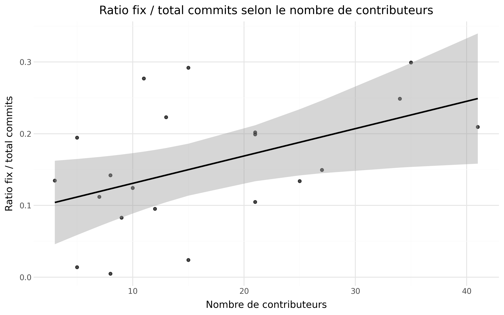
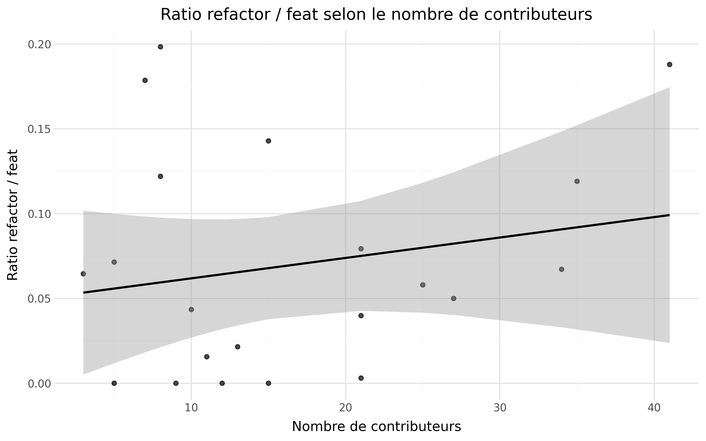

**_février 2026_**

## Authors

Nous sommes 4 étudiants en 5ème année à Polytech Nice Sophia de la mineure SSE en Informatique.

* Théo LASSAUNIERE &lt;theo.lassauniere@etu.unice.fr&gt;
* Mathis JULLIEN &lt;mathis.jullien@etu.unice.fr&gt;
* Thibault RIPOCHE &lt;thibault.ripoche@etu.unice.fr&gt;
* Julie SEYIER &lt;julie.seyier@etu.unice.fr&gt;

## I. Contexte de recherche

### Contexte de l'étude

Nous avons réalisé une étude de cas des projets de l'association [Data For Good France](https://github.com/dataforgoodfr/).
Data For Good France est une association existant depuis 2015 dont l'objectif est de créer des projets numériques pour l’écologie, la justice sociale et la démocratie.
L'association possède plus de 160 dépôts de code open source sur GitHub qui sont créés et maintenus par des bénévoles avec des profils divers.

### Pourquoi cette étude est intéressante

Nous trouvons cette étude intéressante car elle explore l’impact que peut avoir un processus de développement réalisé par des contributeurs avec différents niveaux d'expériences sur la qualité des projets d’une organisation open source.
On espère à travers cette étude mieux comprendre comment des développeurs se coordonnent pour maintenir des projets avec un code durable et facile à prendre en main par différents acteurs dans le cadre d’organisation associative.
Nous espérons qu'à travers cette étude nous identifierons des pratiques de code et d'organisation intéressante et utiles dans notre carrière professionelle.

## II. Question générale et sous-questions

### Question générale

**Depuis 2023, quels facteurs liés aux contributeurs influencent la qualité des dépôts de codes de Data For Good France ?**

Dans une étude de cas sur les dépôts de code de l’association Data For Good France, cette problématique nous paraît pertinente car elle permet de mettre en exergue les particularités de ces dépôts qui sont gérés par des bénévoles et basés sur des templates mais dont l'implémentation diffèrent grandement dû aux différents contributeurs impliqués.

### Sous-questions

1. Quel est le niveau de qualité des dépôts de code étudiés ?

Cette sous-question porte l'étude au niveau du code des dépôts en s'intéressant particuliérement à la définition d'une métrique permettant d'évaluer le niveau de qualité.

2. A partir de quel nombre de contributeurs la qualité d’un dépôt de code s’écarte de manière significative de la médiane de l’échantillon ?

Cette sous-question va s'intéresser plus en détails aux contributeurs en les corrélants avec les niveaux de qualité évalué précédement.

3. Comment l’activité des contributeurs (nombre des commits, nature des contributions) influence-t-elle la qualité des dépôts ?

Cette sous-question se pose au niveau des dépôts de code et va évaluer plusieurs facteurs liés aux contributeurs en les comparant avec la qualité des dépôts.

### Nos hypothèses

Notre hypothèse globale est qu'un grand nombre de contributeurs a un impact positif sur la qualité d’un dépôt de code.
Dans notre intuition, plus il y a de contributeurs, plus la nécessité d'une bonne organisation et d'un code de qualité se fait sentir pour permettre de travailler collaborativement.

Pour la _première_ sous-question, notre hypothèse est que la qualité moyenne des dépôts de code sera de moyenne à bonne. 

Pour la _deuxième_ sous-question, notre hypothèse est que plus un projet a de contributeurs, plus les valeurs de qualité seront centrées autour de la médiane, celle-ci évoluant positivement.

Pour la _troisième_ sous-question, notre hypothèse est que plus un projet a de contributeurs, plus on pourra retrouver des commits fix/refactor pour améliorer la qualité d’un dépôt de code.

Consigne : Il s'agit ici d'**énoncer sous forme d'hypothèses** ce que vous allez chercher à démontrer. Vous devez définir vos hypothèses de façon à pouvoir les _mesurer/vérifier facilement._ Bien sûr, votre hypothèse devrait être construite de manière à _vous aider à répondre à votre question initiale_. Explicitez ces différents points.

### Limites éventuelles

Les limites éventuelles de notre étude que nous avons identifié sont : 
- Que le score SonarQube ne reflète pas tous les aspects de la qualité d’un code, juste s’il correspond à un set de règles statiques, il n'est donc pas une garantie totalement fiable d'évaluer la qualité de code de manière objective
- Que les messages des commits ne respectent pas toujours les conventions
- Que le regex pour classifier les messages de commits doit être très correctement défini pour bien capter les tendances
- Que le grand nombre de dépôts de code à l’abandon ou qui ne sont pas des projets parmi ceux de Data For Good France résulte en un petit échantillon de dépôts étudiable
- Nous ne prenons pas en compte les tests dans notre étude car ils sont évalués par l'équipe A.

## III. Collecte d'informations

Préciser vos zones de recherches en fonction de votre projet, les informations dont vous disposez, ... 

Voici quelques pistes : 

1. les articles ou documents utiles à votre projet 
2. les outils que vous souhaitez utiliser
3. les jeux de données/codes que vous allez utiliser, pourquoi ceux-ci, ...

     :bulb: Cette étape est fortement liée à la suivante. Vous ne pouvez émettre d'hypothèses à vérifier que si vous avez les informations. inversement, vous cherchez à recueillir des informations en fonction de vos hypothèses. 

### Sous-question 3

Plusieurs études [1] montrent que 30 à 60 % des messages de commit ne suivent aucun standard
Les messages sont souvent :
- très courts (update, wip, fix)
- contextuels (typo, changes, final)
- en langage naturel, parfois multilingues
 
## IV. Expérimentation

Nous avons choisi d'utiliser Sonarqube pour évaluer certaines métriques de la qualité de code car il n'est pas présent par défaut sur les dépôts de code de Data For Good France ce qui réduit les biais potentiels et que c'est un standard de l'industrie pour évaluer la santé d'un dépôt.

### Sous question 1 : 
     Pour notre premiere sous question nous avons besoin de mesuré la qualité d'un dépot de code. pour cela nous avons eu l'idée d'utilisé Sonarqube car c'est le standard du marché en terme d'analyse statique de code. nous avions aussi réfléchi a des alternatives tel que CodeClimate pour une alternative du même style mais moins complexe ce qui nous satifesais pas  pareil pour un linter spécifique par langague qui été compliqué a mettre en place par rapport a juste un serveur SonarQube. pour automatisé ça on va crée une pipeline pour va lancé le serveur sonar sur un docker puis on va cloner chaqu'un des repos qu'on a prevu d'analysé, run une annalyse sonar puis grace a l'api on va récupéré les mesures de docker. on a ensuite décidé d'un score avec ces mesure pour normalisé pour tout les repos et avoir un valeur de mesure concrete. pour faire ce score nous avons chosi de nous basé sur 5 critères: 
     - la fiabilité 
     - la maintanbilité 
     - la sécurité 
     - la duplication de code 
     - la complexité cognitive moyenne

     nous avons choisi ces critères 
Vous **explicitez les expérimentations que vous allez mener** pour vérifier si vos hypothèses sont vraies ou fausses. Il y a forcément des choix, des limites, explicitez-les.

     :bulb: Structurez cette partie à votre convenance : 
     Par exemples : 
        Pour Hypothèse 1 => 
            Nous ferons les Expériences suivantes pour la démontrer
        Pour Hypothèse 2 => Expériences 
        
        ou Vous présentez l'ensemble des hypothèses puis vous expliquer comment les expériences prévues permettront de démontrer vos hypothèses.

### Sous question 2 :

#### Objectif et hypothèse

Déterminer si, et à partir de quel volume de contributeurs, la qualité d’un dépôt s’écarte notablement de la médiane de l’échantillon.

#### Protocole expérimental

1. Mesure du nombre de contributeurs

     - Pour chaque dépôt retenu, nous comptons les contributeurs distincts à partir de l'historique Git/GitHub (voir `2-nombre-contributeurs/data/contributors.csv`).
     - Choix méthodologique : comptage « brut » d’identités uniques (pas de pondération par nombre de commits).

2. Construction de groupes comparables

     - Regroupement des dépôts en intervalles de taille d'équipe pour comparer des ensembles homogènes :

       - **Groupe 1 :** 4–9 contributeurs
       - **Groupe 2 :** 10–15 contributeurs
       - **Groupe 3 :** 21–36 contributeurs

3. Mesure de la qualité et indicateurs d’écart

     - Utilisation du score de qualité normalisé (sous-question 1, basé sur SonarQube).
     - Indicateurs calculés :
       - médiane globale des scor  es (tous dépôts) — référence : **74.24**
       - médiane par groupe (comparée à la médiane globale)
       - dispersion par groupe (boxplot — IQR et outliers)

     - Interprétation attendue si l'hypothèse est vraie : augmentation de la médiane de groupe et boxplots plus resserrés quand l’effectif augmente.

#### Résultats (par groupe)

Les figures (qualite_groupe_1/2/3) montrent les scores dépôt par dépôt, avec la médiane globale en référence.

- **Groupe 1 (4–9 contributeurs)** : médiane = **78.97** (+4.73 vs médiane globale). Majorité des dépôts au-dessus de la médiane, mais présence d'un dépôt faible (~52) indiquant une dispersion.

- **Groupe 2 (10–15 contributeurs)** : médiane = **69.36** (−4.88 vs médiane globale). Scores regroupés autour de ~67–74, un dépôt isolé faible (~61).

- **Groupe 3 (21–36 contributeurs)** : médiane = **75.16** (+0.92 vs médiane globale). Scores proches de la médiane globale, dispersion modérée, un outlier faible (~57).

#### Distribution et validation de l'hypothèse

- Le boxplot (`qualite_boxplot_groupes`) montre qu'il n'y a pas de progression monotone de la médiane avec le nombre de contributeurs : le groupe 10–15 a une médiane plus basse que le groupe 4–9.
- On observe une légère tendance au recentrage pour les très grands projets (21–36), mais la présence d'outliers indique que le seul nombre de contributeurs n'explique pas entièrement la qualité.

#### Conclusion (sous-question 2)

Sur cet échantillon, il n'existe pas de seuil unique au-delà duquel la qualité augmente systématiquement avec le nombre de contributeurs. Les dépôts avec 10–15 contributeurs présentent l'écart négatif le plus marqué, tandis que les projets 21–36 tendent à se rapprocher de la médiane globale.

#### Limites spécifiques

- Effectifs par groupe modestes : interprétations exploratoires, sensibles aux outliers.
- Découpage en intervalles : bornes choisies pour l'équilibre des groupes (16–20 non exploité).
- Corrélation ≠ causalité : d'autres facteurs (maturité, langage, gouvernance) peuvent influer sur la qualité.

### Sous-question 3

Pour classifier les différents messages de commits, nous avons commencé par utiliser des patterns simples avec un script reproductible pour avoir une première idée de la répartition et des tendances :

On peut constater que les patterns regex simples plafonnent rapidement ce qui confirme l’état de l’art pour une approche rule-based naïve [2].

Pour renforcer nos patterns, nous avons choisi de nous tourner vers une méthode hybride avec des règles statiques pour les cas de base comme actuellement et du machine learning pour le reste.

Pour cela, on va garder les règles permettent de classer les commits explicites, tandis qu’un classifieur TF-IDF et de la régression logistique vont traiter les messages restants de la catégories others.

Voici donc la pipeline finale pour extraire des les schémas avec les ratios refactor/feat et fix/commits des dépôts de l'échantillon.

#### Pipeline de classification

1. Extraction des commits bruts
Les messages de commits sont collectés pour chaque dépôt depuis les historiques Git et stockés dans un fichier JSON. Chaque commit est associé à son dépôt pour permettre un suivi précis de la répartition des types de commits. Un fichier raw_commits_data.json est disponible dans le code fourni (version datant de janvier 2026) et est utilisé si présent par la pipeline pour éviter le processus de query à Github des commits des dépôts de code qui est assez long à cause du nombre de query possible (à peu près 1h de duré).

2. Classification par patterns
Un ensemble de regex simples détecte les catégories explicites : feat, fix, refactor, ci, chore. Tout commit qui ne correspond à aucun pattern est marqué comme other.
Cette étape fournit une première répartition fiable des commits et permet de réduire la charge sur le classifieur ML.

3. Préparation des données pour le ML
Les commits other sont extraits dans un fichier CSV intermédiaire (commits_unclassified.json) qui sera fournie au ML pour les reclasser plus tard. On prend un extrait de ce fichier qu'on va annoter manuellement dans un csv (commits_other_for_ml.csv). Ces données annotées servent ensuite à entraîner le modèle de machine learning.

4. Entraînement du classifieur TF-IDF et régression logistique
TF-IDF transforme le texte des messages en vecteurs numériques en pondérant les termes les plus significatifs. Cette représentation capture les mots et combinaisons de mots les plus discriminants pour chaque type de commit.

La régression logistique est choisie pour sa simplicité, son interprétabilité et sa robustesse sur des données textuelles peu volumineuses. Elle permet de prédire la probabilité que chaque commit appartienne à chaque catégorie.

5. Application du modèle et mise à jour des résultats
Le classifieur prédit les labels des commits non reconnus, qui sont ensuite fusionnés avec les résultats issus des patterns. Le CSV final (commits_types.csv) contient pour chaque dépôt le nombre de commits par catégorie (feat, fix, refactor, ci, chore, other, …), prêt pour l’analyse statistique et la génération de graphiques avec plotnine.

#### Améliorations possibles

L’approche hybride actuelle apporte un gain de précision et de rappel d’environ 10 à 15 % par rapport aux seules règles statiques. Cependant, le jeu de données d’entraînement utilisé pour le classifieur ML est encore très limité (une centaine de commits annotés), ce qui restreint la capacité du modèle à généraliser à des messages plus variés.

Des pistes d’amélioration incluent :

- Augmenter la taille du jeu d’entraînement : annoter davantage de commits other permettra au modèle d’apprendre plus de variations linguistiques et d’identifier des patterns plus subtils.

- Optimisation des hyperparamètres : tester différents poids de classes, plages de n-grams ou paramètres de régularisation pour la régression logistique pourrait améliorer la précision sur les classes moins fréquentes.

- Exploration d’autres modèles : des modèles plus complexes comme les forêts aléatoires ou des embeddings textuels pourraient capter des relations sémantiques que TF-IDF ne détecte pas.

## V. Analyse & Réponse aux hypothèses

Les graphiques ci-dessous ont été réalisé par nos soins.

### Présentation des résultats

### Interprétation et analyse des résultats en fonction des hypothèses

### Conclusion 

Vos résultats et donc votre analyse sont nécessairement limités. Préciser bien ces limites : par exemple, jeux de données insuffisants, analyse réduite à quelques critères, dépendance aux projets analysés, ...

### Ouverture

## VI. Outils utilisés & Reproductibilitée

Précisez votre utilisation des outils ou les développements \(e.g. scripts\) réalisés pour atteindre vos objectifs. Ce chapitre doit viser à \(1\) pouvoir reproduire vos expérimentations, \(2\) partager/expliquer à d'autres l'usage des outils.

## VII. Codes et résultats brutes

Nos résultats bruts sont disponibles ici : [Team B - Results](https://github.com/RIMEL-UCA/RIMEL-UCA.github.io/tree/master/chapters/2026/Etude_Data_For_Good_Qualite_Team_B/results).

Nos codes sont disponibles ici : [Team B - Codes](https://github.com/RIMEL-UCA/RIMEL-UCA.github.io/tree/master/chapters/2026/Etude_Data_For_Good_Qualite_Team_B/codes).

## VIII. Références

[Debret 2020] Debret, J. (2020) La démarche scientifique : tout ce que vous devez savoir ! Available at: https://www.scribbr.fr/article-scientifique/demarche-scientifique/ (Accessed: 18 November 2022).

[1] Hattori, L. & Lanza, M. (2008). On the nature of commits. *Proceedings of the 2008 International Working Conference on Mining Software Repositories (MSR)*, 1–4. Available at: https://www.inf.usi.ch/lanza/Downloads/Hatt2008a.pdf (Accessed: 29 January 2026).

[2] Amit, R. & Feitelson, D. G. (2021). Commit classification revisited. *Empirical Software Engineering*, 26, 1–30. Available at: https://cris.huji.ac.il/en/publications/corrective-commit-probability-a-measure-of-the-effort-invested-in/ (Accessed: 29 January 2026).
