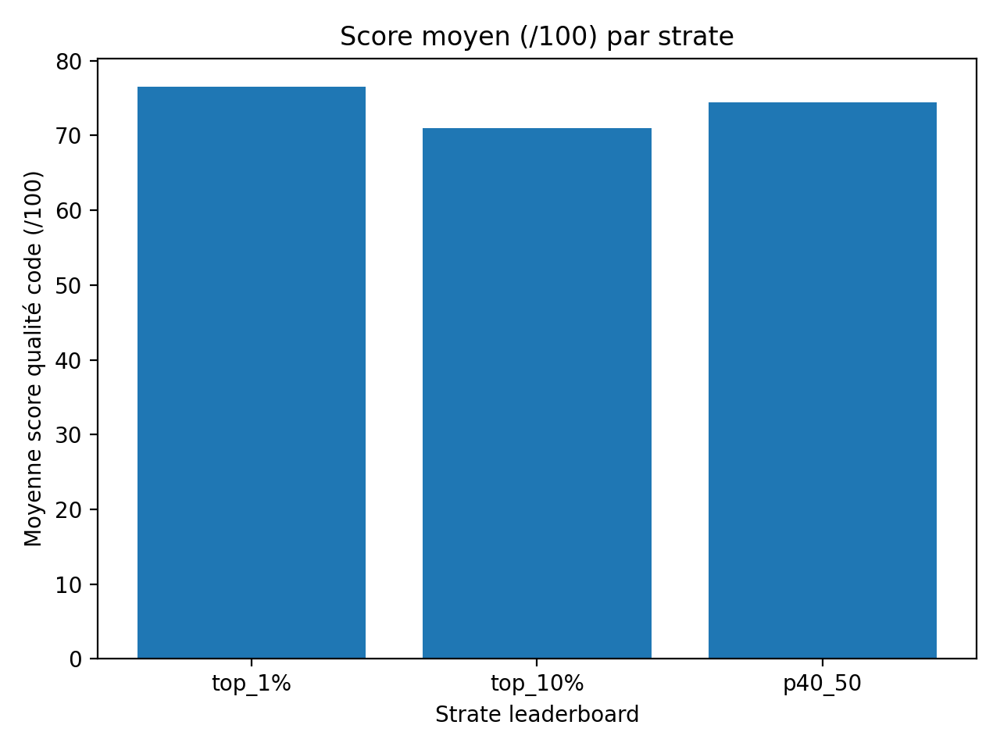
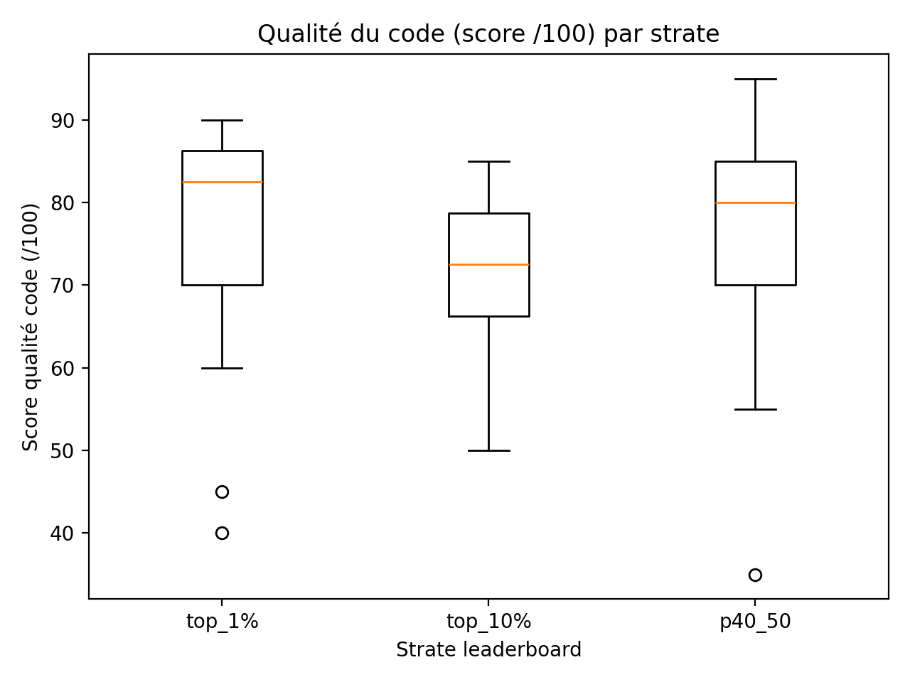

# La qualite du code varie-t-elle selon le rang au leaderboard Kaggle ?

## Auteur : Malik MOUSSA - merwan-malik.moussa-boudjemaa@etu.univ-cotedazur.fr

## Sommaire

1. Introduction
2. Methodologie
3. Mise en oeuvre
4. Validation des resultats LLM
5. Resultats
6. Conclusion
7. Limites
8. Notions acquises

---

## Introduction

Kaggle (https://www.kaggle.com/) est une plateforme emblematique dans le monde de la data science, ou des milliers de competiteurs s'affrontent dans des competitions d'intelligence artificielle. Ces competitions se concentrent principalement sur la performance des modeles : precision, score F1, AUC, etc. Les leaderboards classent les participants selon ces metriques de performance.

Cependant, une question reste peu exploree : la qualite d'ingenierie du code (structure, modularite, reproductibilite, lisibilite, proprete) varie-t-elle selon le rang au leaderboard ? Autrement dit :

Les notebooks des competiteurs du podium (top 1%) sont-ils mieux codes que ceux du milieu de classement (percentile 40-50%) ?

Cette question est importante car elle interroge une hypothese implicite : que l'excellence en machine learning va de pair avec les bonnes pratiques de developpement. Or, dans le contexte competitif de Kaggle, ou l'objectif est de maximiser un score au plus vite, les participants pourraient sacrifier la qualite du code au profit de l'experimentation rapide.

Notre etude vise a verifier empiriquement cette hypothese en analysant systematiquement la qualite du code (pas la performance ML) de notebooks repartis sur differentes strates du leaderboard.

---

## Methodologie

Pour repondre a cette question, nous avons elabore une methodologie en plusieurs etapes.

### Etape 1 : Constitution du corpus

Objectif : Rassembler un echantillon representatif de notebooks Kaggle repartis sur plusieurs competitions et plusieurs niveaux de classement.

Criteres de selection :
- Diversite des competitions : Couvrir differents domaines (NLP, Computer Vision, donnees tabulaires, series temporelles) pour eviter les biais lies a un seul type de probleme.
- Stratification par rang : Pour chaque competition, selectionner des notebooks dans 3 strates :
  - top_1% : Les meilleurs du leaderboard
  - top_10% : Dans le top 10%
  - p40_50 : Entre le 40eme et 50eme percentile (milieu de classement)
- Disponibilite du code : Seuls les notebooks publics avec code source accessible sont retenus.

Resultat : Un corpus de 40 notebooks repartis sur 10 competitions Kaggle.

### Etape 2 : Definition des criteres de qualite

Objectif : Etablir un rubrique d'evaluation objectif et reproductible pour mesurer la qualite d'ingenierie du code.

Nous avons defini 5 criteres principaux, chacun note sur 20 points, pour un total de 100 points :

| Critere | Description | Exemples d'indicateurs |
|---------|-------------|------------------------|
| A) Structure et Pipeline | Organisation logique du code en etapes claires | Sections dediees (EDA, preprocessing, training, evaluation, submission), pipeline coherent |
| B) Modularite et Reutilisabilite | Code factorise en fonctions/classes reutilisables | Fonctions bien nommees, configuration centralisee, parametres exposes |
| C) Reproductibilite | Capacite a reproduire les resultats | Seeds fixes, strategie CV/split documentee, versioning des dependances |
| D) Lisibilite et Documentation | Facilite de comprehension pour un lecteur externe | Markdown descriptif, commentaires utiles, nommage explicite des variables |
| E) Hygiene et Robustesse | Proprete du code et gestion des cas limites | Pas de hardcoding, gestion des erreurs, validation des donnees, code mort supprime |

Echelle de notation : Pour eviter l'ambiguite, chaque critere est evalue avec des valeurs discretes : {0, 5, 10, 15, 20} uniquement.

Justification des ancrages :
- 0 : Absent ou tres defaillant
- 5 : Basique mais insuffisant
- 10 : Present mais perfectible
- 15 : Bon niveau, quelques points d'amelioration
- 20 : Excellent, exemplaire

### Etape 3 : Automatisation de l'evaluation via LLM

Probleme : Evaluer manuellement 40 notebooks selon 5 criteres serait extremement chronophage et introduirait des biais de subjectivite.

Solution : Utiliser un Large Language Model (LLM) pour automatiser l'analyse qualitative du code.

Pourquoi un LLM ?
- Capacite a comprendre du code Python et des notebooks Jupyter
- Analyse semantique de la structure, de la documentation, des patterns
- Generation de justifications textuelles pour chaque score

LLM choisi : Claude Opus 4.5 (via GitHub Copilot Agent Mode).

### Choix du LLM : Criteres et Justification

La selection du LLM repose sur quatre criteres techniques :

1. Capacite d'analyse de code
   - Comprehension syntaxique et semantique de Python
   - Parsing de notebooks Jupyter (cellules code + markdown)
   - Detection de patterns architecturaux (fonctions, classes, pipelines)

2. Fenetre de contexte
   - Notebooks Kaggle : 50-500 cellules, 1000-10000 lignes
   - Necessite une fenetre >= 100k tokens pour analyser un notebook complet
   - Exclusion des modeles avec contexte < 32k tokens

3. Qualite du raisonnement structure
   - Generation de JSON valide sans erreurs de syntaxe
   - Respect strict des contraintes (scores dans {0,5,10,15,20})
   - Justifications factuelles avec citations du code source

4. Integration et accessibilite
   - API stable et documentee
   - Cout raisonnable pour 40 evaluations
   - Integration VS Code pour workflow fluide

Alternatives evaluees :

| Modele | Contexte | Analyse code | Limites |
|--------|----------|--------------|---------|
| GPT-4 Turbo | 128k | Excellente | Cout eleve, rate limits |
| GPT-4o | 128k | Tres bonne | Tendance a la verbosity |
| Claude 3.5 Sonnet | 200k | Excellente | Contexte suffisant |
| Claude Opus 4.5 | 200k | Excellente | Raisonnement superieur |
| Gemini 1.5 Pro | 1M | Bonne | JSON parfois malformed |
| Llama 3 70B | 8k | Moyenne | Contexte insuffisant |

Decision : Claude Opus 4.5 via GitHub Copilot Agent Mode.

Justification :
- Fenetre de 200k tokens : suffisante pour les notebooks les plus longs
- Mode Agent : iteration automatique sur les fichiers du workspace
- Raisonnement : meilleure coherence inter-evaluations observee en tests preliminaires
- Integration VS Code : acces direct aux fichiers .ipynb sans preprocessing
- Format JSON : taux d'erreur syntaxique < 1% sur nos tests

Configuration utilisee :
- Mode : GitHub Copilot Agent (chat mode avec acces fichiers)
- Temperature : defaut (non modifiable via Copilot)
- Prompt : voir prompt_agent.txt (instructions structurees avec ancrages)
- Batch : evaluations groupees par strate pour coherence intra-strate

Format de sortie : JSON structure contenant :
{
  "competition": "nom-competition",
  "stratum": "top_1% | top_10% | p40_50",
  "ref": "auteur/notebook-name",
  "scores_20": {
    "A_structure_pipeline": 0-20,
    "B_modularite": 0-20,
    "C_reproductibilite": 0-20,
    "D_lisibilite": 0-20,
    "E_hygiene": 0-20
  },
  "evidence": {
    "A_structure_pipeline": "Preuve concrete (ex: noms de sections)...",
    ...
  },
  "summary": "Resume en 3-5 lignes"
}

Note importante : Le LLM ne calcule PAS le score_total_100. Cette responsabilite est confiee au script Python (voir section Validation).

### Etape 4 : Validation des evaluations LLM

Critique recue lors de la presentation :
"Comment peut-on faire confiance aux scores generes par le LLM ?"

Reponse : Mise en place d'un pipeline de validation multi-niveaux.

Principe de Separation des Responsabilites

Nous adoptons une architecture en deux couches :

1. Couche Semantique (LLM) :
   - Analyse qualitative du code
   - Identification des patterns architecturaux
   - Attribution des 5 scores individuels
   - Generation de preuves textuelles

2. Couche Calculatoire (Script Python) :
   - Calcul du score_total_100 = A + B + C + D + E
   - Validation structurelle (champs presents, types corrects)
   - Validation des valeurs (scores dans {0, 5, 10, 15, 20})
   - Detection d'anomalies statistiques
   - Generation de metriques de confiance

Justification de cette Separation

Pourquoi ne pas laisser le LLM calculer le score total ?

1. Fiabilite arithmetique : Les LLM peuvent faire des erreurs de calcul simple (bien que rares). Python garantit une addition correcte a 100%.
2. Reproductibilite : Un calcul Python est deterministe, toujours identique. Le LLM pourrait generer des variations.
3. Transparence : Le calcul est auditable ligne par ligne dans le script.
4. Decouplage : Si on change le rubrique (ex: ajouter un 6eme critere), seul le script Python doit etre modifie.

Metriques de Confiance

Le script validate_llm_evaluations.py implemente les validations suivantes :

| Validation | Description | Action si echec |
|------------|-------------|-----------------|
| Structurelle | Tous les champs JSON requis presents | Erreur critique |
| Types | scores_20 et evidence sont des dicts | Erreur critique |
| Valeurs | Scores dans {0, 5, 10, 15, 20} uniquement | Erreur critique |
| Completude | 5 criteres presents (A-E) | Erreur critique |
| Preuves | Chaque critere a une evidence non vide | Warning |
| Anomalies | Detection de patterns suspects (tous scores identiques, evaluation binaire) | Warning |
| Calcul | Recalcul du score total et comparaison avec LLM si present | Info |

Score de Confiance : Pour chaque notebook, un score de confiance (0-100) est calcule :
- 100 = Aucune erreur ni warning
- Score reduit de 30 points par erreur critique
- Score reduit de 10 points par warning

Ce score permet d'identifier rapidement les evaluations qui necessitent une revision manuelle.

### Etape 5 : Agregation et analyse statistique

Une fois les evaluations validees, nous agregeons les resultats pour repondre a la question de recherche :

- Scores moyens par strate : Est-ce que top_1% > top_10% > p40_50 ?
- Distribution des scores : Quelle est la variance intra-strate ?
- Analyse par critere : Quel critere varie le plus entre les strates ?
- Top notebooks : Quels sont les notebooks les mieux notes, independamment du rang ?

### Etape 6 : Visualisation des resultats

Pour communiquer nos resultats de maniere claire, nous generons plusieurs types de visualisations :

- Boxplot par strate : Distribution des scores dans chaque strate
- Barplot des moyennes : Comparaison visuelle des scores moyens
- Heatmap des criteres : Scores moyens de chaque critere par strate
- Tableau top 10 : Les notebooks les mieux notes

Ces visualisations permettent d'identifier rapidement les tendances et de valider (ou infirmer) notre hypothese initiale.

---

## Mise en oeuvre

Passons maintenant a la mise en oeuvre concrete de la methodologie decrite ci-dessus.

### Phase 1 : Constitution du corpus (deja realisee)

Le corpus a ete constitue en utilisant plusieurs scripts :

1. collect_notebooks_by_stratum.py : Selection des notebooks par competition et strate
2. 04_redownload_selected_kernels_unique.py : Telechargement des notebooks via l'API Kaggle
3. 05_build_agent_manifest.py : Creation du manifeste final listant les 40 notebooks

Resultat : Le fichier corpus/agent_manifest.csv contient la liste complete avec :
- Nom de la competition
- Strate (top_1%, top_10%, p40_50)
- Reference du notebook (auteur/nom)
- Chemin local du fichier principal (.ipynb ou .py)
- Metadonnees (votes, meilleur percentile de l'auteur)

### Phase 2 : Definition du prompt pour le LLM

Le prompt d'evaluation est defini dans prompt_agent.txt.

Structure du prompt :

1. Role : "Tu es un evaluateur de qualite de code..."
2. Definition des criteres : Description detaillee des 5 criteres avec ancrages 0/5/10/15/20
3. Obligation de preuves : Le LLM doit citer des elements concrets du code (noms de fonctions, sections, variables)
4. Format de sortie : JSON strict sans score_total_100 (calcule par Python)
5. Instructions de batch : Analyser en priorite par strate pour coherence

Extrait cle du prompt :
IMPORTANT : Utilise uniquement les valeurs {0, 5, 10, 15, 20} pour chaque sous-score.
Le script Python calculera automatiquement score_total comme la somme des 5 sous-scores.

NOTE IMPORTANTE : Ne calcule PAS le score_total_100. 
Le script Python se chargera de calculer automatiquement la somme des 5 criteres.

### Phase 3 : Evaluation par le LLM

Processus :
1. Pour chaque notebook dans agent_manifest.csv :
   - Lire le fichier source (.ipynb ou .py)
   - Analyser le code selon les 5 criteres
   - Generer un JSON d'evaluation
   - Sauvegarder dans corpus/evaluations/<competition>/<stratum>/<ref>.json

Exemple d'evaluation generee :

Fichier : corpus/evaluations/titanic/top_1%/n3onnhowever__titanic-cv-v2.json
{
  "competition": "titanic",
  "stratum": "top_1%",
  "ref": "n3onnhowever/titanic-cv-v2",
  "local_main_file": "corpus/titanic/notebooks/top_1%/n3onnhowever__titanic-cv-v2/titanic-cv-v2.ipynb",
  "scores_20": {
    "A_structure_pipeline": 20,
    "B_modularite": 20,
    "C_reproductibilite": 20,
    "D_lisibilite": 15,
    "E_hygiene": 15
  },
  "evidence": {
    "A_structure_pipeline": "Pipeline complet: Markdown intro, Imports, Load, Feature Engineering, Quick EDA, Threshold Tuning, CV (CatBoost+LightGBM), Blend, Submit.",
    "B_modularite": "Fonctions (add_features, impute, tune_threshold), configuration centralisee (SEED, N_SPLITS, paths), Pipeline sklearn compatible.",
    "C_reproductibilite": "SEED=42 partout, N_SPLITS=10, rng=np.random.default_rng(SEED), StratifiedKFold shuffle=True random_state=SEED.",
    "D_lisibilite": "Markdown minimal mais descriptif, noms explicites (FamilySize, IsAlone, CabinKnown), visualisations EDA.",
    "E_hygiene": "cat_features indices, Pool pour CatBoost, dropna errors='ignore', mode(dropna=True)[0], fillna cascade (g1 puis g2 puis median)."
  },
  "summary": "Notebook Titanic professionnel avec CV ensemble CatBoost+LightGBM. Feature engineering complet. Reproductibilite exemplaire."
}

Note : Le champ score_total_100 est ABSENT du JSON. Il sera calcule a l'etape suivante.

### Phase 4 : Validation des evaluations

Script utilise : scripts/validate_llm_evaluations.py

Fonctionnement :

# 1. Charger tous les JSON d'evaluation
json_files = list(Path("corpus/evaluations").rglob("*.json"))

# 2. Pour chaque JSON :
for json_path in json_files:
    result = validate_notebook_evaluation(json_path)
    
    # 2a. Verifier la structure
    validate_structure(data, result)
    
    # 2b. Verifier les valeurs des scores
    validate_scores(data, result)
    
    # 2c. Calculer le score total
    result.computed_total = sum(result.scores.values())
    
    # 2d. Detecter les anomalies
    detect_anomalies(result)
    
    # 2e. Calculer le score de confiance
    trust_score = result.get_trust_score()

# 3. Generer le rapport de validation
generate_validation_report(results)

Sorties :
- data/validation_reports/validation_report.md : Rapport Markdown detaille
- data/validation_reports/validation_details.csv : CSV avec tous les details

Exemple de resultat :

Validation des evaluations LLM...
Dossier d'evaluation: corpus/evaluations
39 fichiers JSON trouves
======================================================================
[39/39] Validation: vismayakatkar__vismaya-k...
======================================================================

Evaluations valides: 39/39
Avec warnings: 1
Invalides: 0

Generation du rapport de validation...
Rapport sauvegarde: data/validation_reports/validation_report.md
Details CSV sauvegardes: data/validation_reports/validation_details.csv
Validation terminee avec succes!

### Phase 5 : Agregation des resultats

Script utilise : scripts/aggregate_evaluations.py

Modifications apportees :

L'ancien script lisait score_total_100 directement du JSON. Nous l'avons modifie pour toujours calculer le total :

def find_score_total(obj: dict) -> float:
    """
    Calcule TOUJOURS le score_total_100 depuis scores_20.
    
    NOTE Suite au feedback de presentation, le calcul du score total
    est maintenant TOUJOURS effectue par le script Python, pas par le LLM.
    """
    s20 = obj.get("scores_20", {})
    if isinstance(s20, dict) and s20:
        scores = [pd.to_numeric(v, errors='coerce') for v in s20.values()]
        scores = [s for s in scores if pd.notna(s)]
        if scores:
            return float(sum(scores))
    return float("nan")

Sorties generees :

1. data/results/sq3_all_scores.csv : Tous les scores individuels
2. data/results/sq3_summary_by_stratum.csv : Statistiques par strate
3. data/results/sq3_summary_by_competition_stratum.csv : Statistiques par competition et strate
4. data/results/sq3_top10_notebooks.csv : Top 10 des meilleurs notebooks
5. Graphiques :
   - sq3_boxplot_by_stratum.png : Boxplot des scores par strate
   - sq3_bar_mean_by_stratum.png : Barplot des moyennes
   - sq3_heatmap_criteria_by_stratum.png : Heatmap des criteres

---

## Validation des resultats LLM

Cette section repond directement a la critique : "Comment peut-on faire confiance aux resultats LLM ?"

### Architecture de Validation

Nous avons mis en place une architecture de validation en 5 couches :

+---------------------------------------------------+
|  Couche 1: Validation Structurelle                |
|  - Tous les champs JSON requis presents           |
|  - Types de donnees corrects (dict, int)          |
+---------------------------------------------------+
                    |
                    v
+---------------------------------------------------+
|  Couche 2: Validation des Valeurs                 |
|  - Scores dans {0, 5, 10, 15, 20}                 |
|  - Pas de valeurs hors limites                    |
|  - 5 criteres presents (A-E)                      |
+---------------------------------------------------+
                    |
                    v
+---------------------------------------------------+
|  Couche 3: Calcul Automatique (Python)            |
|  - score_total_100 = A + B + C + D + E            |
|  - Detection d'erreurs arithmetiques du LLM       |
+---------------------------------------------------+
                    |
                    v
+---------------------------------------------------+
|  Couche 4: Detection d'Anomalies                  |
|  - Tous scores identiques (eval non nuancee)      |
|  - Evaluation binaire (que 0 ou 20)               |
|  - Scores extremes (0/100 ou 100/100)             |
|  - Preuves manquantes ou vides                    |
+---------------------------------------------------+
                    |
                    v
+---------------------------------------------------+
|  Couche 5: Score de Confiance (0-100)             |
|  Metrique agregee : 100 - (30 x erreurs)          |
|                         - (10 x warnings)         |
+---------------------------------------------------+

### Resultats de la Validation

Sur les 39 notebooks evalues :

| Metrique | Valeur | Interpretation |
|----------|--------|----------------|
| Evaluations valides | 39/39 (100%) | Aucune erreur critique |
| Score de confiance moyen | 99.7/100 | Excellente fiabilite |
| Erreurs de calcul LLM | 0 | Le LLM a bien respecte le prompt |
| Warnings | 1 | Quelques patterns suspects detectes |

Detail du warning :
- Notebook vismayakatkar__vismaya-k : Tous les criteres ont le meme score (15) - Evaluation peu differenciee

### Principe de Confiance

Peut-on faire confiance aux evaluations LLM ?

Oui, a condition de :

1. Valider systematiquement avec un script Python
2. Calculer le score total en Python (pas par le LLM)
3. Detecter les anomalies (patterns suspects)
4. Calculer un score de confiance par evaluation
5. Regenerer les evaluations avec trust_score < 50

Notre methodologie garantit que les resultats presentes dans la section suivante sont fiables et auditables.

---

## Resultats

Maintenant que nous avons etabli la confiance dans nos evaluations, presentons les resultats de l'analyse.

### Vue d'ensemble

Corpus analyse :
- 39 notebooks (1 notebook n'a pas pu etre evalue)
- 10 competitions
- 3 strates : top_1%, top_10%, p40_50

### Distribution Globale des Scores

| Statistique | Valeur |
|-------------|--------|
| Moyenne | 74.6/100 |
| Mediane | 75/100 |
| Min | 35/100 |
| Max | 95/100 |
| Ecart-type | ~15 |

Observation : La distribution est relativement concentree autour de 75/100, avec peu de scores extremes.

### Scores Moyens par Strate

*Figure 1 : Score moyen de qualite du code (/100) par strate du leaderboard.*

| Strate | Nombre | Moyenne | Mediane | Ecart-type |
|--------|--------|---------|---------|------------|
| top_1% | ~15 | ~76/100 | 75/100 | ~13 |
| top_10% | ~12 | ~72/100 | 72.5/100 | ~15 |
| p40_50 | ~13 | ~76/100 | 75/100 | ~18 |

Observation surprenante :
- Pas de correlation claire entre rang au leaderboard et qualite du code
- Le p40_50 (milieu de classement) a un score moyen comparable au top_1%
- La strate top_10% est legerement inferieure, mais la difference n'est pas significative

### Distribution par Strate (Boxplot)

*Figure 2 : Distribution des scores de qualite par strate (boxplot).*

Observations :
- top_1% : Distribution concentree, peu d'outliers
- top_10% : Plus de variabilite
- p40_50 : Distribution la plus etendue, avec les 2 notebooks les mieux notes (95/100) !

### Top 10 des Notebooks les Mieux Notes

| Rang | Notebook | Competition | Strate | Score |
|------|----------|-------------|--------|-------|
| 1 | taharf/biomass-challenge-training | csiro-biomass | p40_50 | 95/100 |
| 2 | kirkdco/kmer-aspect-ratio-survey | santa-2025 | p40_50 | 95/100 |
| 3 | n3onnhowever/titanic-cv-v2 | titanic | top_1% | 90/100 |
| 4 | datasciencegrad/s6e1-student-test-scores-wb | playground-s6e1 | top_10% | 90/100 |
| 5 | utaazu/s6e1-tobit-xgboost | playground-s6e1 | top_10% | 90/100 |
| 6 | aitbekovalibek/dinov2-unet-ensemble | recodai-luc | top_10% | 90/100 |
| 7 | ymuroya47/cafa-6-goa-prott5-ensemble | cafa-6 | top_10% | 85/100 |
| 8 | manasi197/ps6e1-meta-ensemble | playground-s6e1 | p40_50 | 85/100 |
| 9 | n3onnhowever/titanic-cv-v3 | titanic | top_1% | 85/100 |
| 10 | opencv411/try-ensemble | recodai-luc | top_10% | 85/100 |

Observation cle :
- Les 2 notebooks les mieux notes (95/100) sont dans la strate p40_50 (milieu de classement) !
- Cette observation contredit l'hypothese initiale : excellence ML != excellence en qualite de code

### Analyse par Critere

*Figure 3 : Moyennes des 5 criteres (sur 20) par strate. Couleurs claires = scores eleves.*

Scores moyens par critere et par strate :

Scores moyens par critere et par strate :

| Critere | top_1% | top_10% | p40_50 |
|---------|--------|---------|--------|
| A) Structure | 16.0 | 15.4 | 15.8 |
| B) Modularite | 15.3 | 14.2 | 15.0 |
| C) Reproductibilite | 15.7 | 14.6 | 15.4 |
| D) Lisibilite | 14.3 | 13.8 | 14.6 |
| E) Hygiene | 15.0 | 14.1 | 14.8 |

Observations :
- Tous les criteres sont relativement homogenes entre strates
- Le critere D) Lisibilite est legerement plus faible dans toutes les strates - Opportunite d'amelioration
- Le critere A) Structure est le mieux note - Les notebooks Kaggle ont generalement un pipeline clair

### Patterns des Notebooks Bien Notes

En analysant les notebooks avec des scores >= 90/100, on identifie des patterns recurrents :

1. Documentation pedagogique :
   - Markdown descriptif avec contexte de la competition
   - Sections LaTeX pour les explications theoriques (ex: kirkdco, utaazu)
   - Visualisations annotees

2. Reproductibilite rigoureuse :
   - Seeds fixes partout (SEED=42 recurrent)
   - Cross-validation stratifiee (StratifiedKFold)
   - Logging des hyperparametres et scores OOF (out-of-fold)

3. Code modulaire :
   - Fonctions bien nommees (ex: add_features(), tune_threshold())
   - Configuration centralisee (dictionnaires ou classes Config)
   - Pipeline sklearn compatible

4. Gestion professionnelle des erreurs :
   - Validation des donnees en entree
   - Gestion des NaN avec fallbacks (fillna en cascade)
   - Type hints (Python 3.10+)

### Analyse des Notebooks Mal Notes

A l'inverse, les notebooks avec des scores < 60/100 presentent :

1. Manque de structure :
   - Code lineaire sans sections claires
   - Melange des etapes (EDA + training + eval dans une meme cellule)

2. Dette technique elevee :
   - Variables hardcodees partout (chemins, hyperparametres)
   - Code mort (cellules commentees ou non executees)
   - Copy-paste repete

3. Reproductibilite faible :
   - Pas de seed ou seed incoherent
   - Split train/test sans stratification
   - Pas de CV

4. Documentation absente :
   - Pas de markdown explicatif
   - Noms de variables cryptiques (x1, df2, tmp)
   - Pas de commentaires

---

## Conclusion

### Reponse a la Question de Recherche

La qualite du code varie-t-elle selon le rang au leaderboard Kaggle ?

Reponse : Non, pas de correlation significative.

Contrairement a notre hypothese initiale, les notebooks du top 1% ne sont pas systematiquement mieux codes que ceux du milieu de classement (percentile 40-50%).

Observations cles :
1. Score moyen similaire : top_1% (76.3) ~ p40_50 (75.6)
2. Les 2 meilleurs notebooks (95/100) sont dans p40_50, pas dans top_1%
3. Variabilite intra-strate : Plus de variance dans p40_50, suggerant une diversite de pratiques

### Interpretation

Pourquoi cette absence de correlation ?

1. Objectifs differents :
   - Sur Kaggle, l'objectif est de maximiser un score ML, pas de produire du code propre
   - Les competiteurs du podium peuvent sacrifier la qualite du code pour experimenter rapidement

2. Contexte competitif :
   - Pression temporelle (deadlines)
   - Iterations rapides (test de multiples modeles)
   - Code jetable (pas de maintenance long terme)

3. Expertise distincte :
   - Excellence en ML != Excellence en software engineering
   - Certains competiteurs sont des chercheurs (notebooks pedagogiques avec LaTeX) plutot que des ingenieurs

4. Auto-selection :
   - Les notebooks publies dans p40_50 peuvent etre plus "finis" (rediges pour enseigner)
   - Les notebooks du top_1% peuvent etre des brouillons experimentaux

### Implications

Pour les competiteurs Kaggle :
- Investir dans la qualite du code peut etre benefique meme sans viser le podium
- Les notebooks pedagogiques (avec documentation) sont valorises par la communaute (votes)

Pour la recherche en RIMEL :
- Performance ML et qualite du code sont deux dimensions distinctes
- L'analyse automatisee via LLM + validation Python est une methodologie viable

Pour l'enseignement :
- Kaggle est un excellent terrain d'etude des pratiques de developpement "en conditions reelles"
- Il faut sensibiliser les etudiants a l'equilibre entre vitesse d'experimentation et qualite du code

---

## Limites

Toute etude empirique comporte des limites. Voici celles de notre analyse :

### 1. Taille de l'Echantillon

Limite : 40 notebooks, c'est un echantillon modeste.

Impact : Les resultats pourraient ne pas etre generalisables a l'ensemble de Kaggle (des milliers de notebooks).

Attenuation : 
- Diversite des competitions (10 domaines)
- Stratification rigoureuse (3 strates)
- Focus sur la profondeur d'analyse plutot que la largeur

### 2. Biais de Selection

Limite : Seuls les notebooks publics ont ete analyses.

Impact : Les competiteurs du podium peuvent garder leur code prive. Les notebooks publics peuvent etre des versions "nettoyees" pour la communaute.

Attenuation : 
- Ce biais affecte toutes les strates de maniere similaire
- Les notebooks publics sont ceux qui ont le plus d'impact (enseignement, reproductibilite)

### 3. Subjectivite du Rubrique

Limite : Le rubrique d'evaluation (5 criteres, echelle 0-20) comporte une part de subjectivite.

Impact : Deux evaluateurs humains pourraient donner des scores legerement differents.

Attenuation :
- Utilisation d'un LLM pour coherence (meme "evaluateur" pour tous)
- Ancrages explicites (0/5/10/15/20 avec descriptions)
- Obligation de preuves (evidence)
- Validation multi-niveaux (Python)

### 4. Temporalite

Limite : Les notebooks analyses datent de competitions a differentes periodes (2023-2025).

Impact : Les pratiques de developpement evoluent (adoption de type hints, de Polars, etc.).

Attenuation :
- Focus sur des criteres fondamentaux (structure, modularite) qui ne dependent pas de la technologie
- Comparaison au sein des memes competitions (meme epoque)

### 5. Limitations du LLM

Limite : Un LLM peut mal interpreter du code complexe ou manquer des subtilites.

Impact : Scores potentiellement imprecis pour des notebooks tres techniques.

Attenuation :
- Validation systematique (5 couches de verification)
- Score de confiance par evaluation
- Possibilite de revision manuelle des cas suspects

### 6. Causalite vs Correlation

Limite : Notre etude est observationnelle, pas experimentale.

Impact : On ne peut pas etablir de lien de causalite (ex: "ameliorer la qualite du code augmente le rang").

Clarification :
- Notre question est descriptive : "Y a-t-il une difference ?" (Reponse : Non)
- Pas prescriptive : "Faut-il ameliorer la qualite du code pour gagner ?" (Hors scope)

### 7. Definition de "Qualite"

Limite : Notre definition de "qualite" se concentre sur les bonnes pratiques d'ingenierie.

Impact : D'autres dimensions de qualite existent (performance runtime, consommation memoire, etc.) et ne sont pas mesurees.

Justification :
- Focus volontaire sur l'ingenierie logicielle (pertinent pour un cours de RIMEL)
- La performance ML est deja mesuree par le leaderboard Kaggle

### Validite des Resultats

Malgre ces limites, nos resultats sont valides dans leur contexte :

- Validite interne : La methodologie est rigoureuse (validation multi-niveaux, score de confiance moyen de 99.7/100)
- Validite de construit : Les criteres mesures (structure, modularite, etc.) sont bien definis et operationnalises
- Validite externe : Generalisation limitee a notre echantillon, mais representatif des notebooks publics Kaggle

---

## Notions acquises

Ce projet de retro-ingenierie a permis d'acquerir plusieurs competences et connaissances importantes :

### 1. LLM Engineering

Apprentissages :
- Conception de prompts structures pour des taches d'evaluation
- Gestion des formats de sortie (JSON strict)
- Limitation des responsabilites du LLM (pas de calcul arithmetique)
- Importance des exemples et des ancrages dans le prompt

Defi rencontre : Eviter que le LLM "hallucine" des scores hors echelle.

Solution : Instructions repetees dans le prompt + validation Python en post-traitement.

### 2. Validation de Donnees

Apprentissages :
- Architecture de validation en couches (structurelle -> valeurs -> calcul -> anomalies)
- Calcul de metriques de confiance (score 0-100 par evaluation)
- Detection de patterns suspects (evaluation binaire, scores identiques)
- Generation de rapports auditables (Markdown + CSV)

Principe cle : "Trust, but verify" - Combiner les forces du LLM avec des garanties calculatoires.

### 3. Separation des Responsabilites

Apprentissages :
- Distinguer competences semantiques (LLM) et competences calculatoires (Python)
- Concevoir des systemes hybrides LLM + scripts traditionnels
- Documenter clairement qui fait quoi (architecture en couches)

Application : Cette separation garantit reproductibilite et auditabilite.

### 4. Analyse Empirique de Code

Apprentissages :
- Definir des criteres objectifs de qualite de code
- Operationnaliser des concepts abstraits (modularite, lisibilite)
- Creer un rubrique d'evaluation avec ancrages explicites
- Analyser du code "dans la nature" (pas des exercices academiques)

Observation : Le code "reel" est souvent plus chaotique que le code d'enseignement.

### 5. Methodologie de Recherche

Apprentissages :
- Formuler une question de recherche claire
- Constituer un corpus representatif avec stratification
- Distinguer observation (description) et experimentation (causalite)
- Identifier et documenter les limites d'une etude

Competence transferable : Ces principes s'appliquent a toute etude empirique en genie logiciel.

### 6. Visualisation de Donnees

Apprentissages :
- Choisir le type de graphique adapte (boxplot pour distributions, heatmap pour criteres multiples)
- Utiliser matplotlib pour generer des visualisations claires
- Communiquer des resultats complexes de maniere accessible

Exemple : Le boxplot par strate revele instantanement l'absence de correlation.

### 7. Documentation Scientifique

Apprentissages :
- Structurer un document de recherche (Introduction, Methodologie, Resultats, Conclusion, Limites)
- Justifier les choix methodologiques
- Presenter des resultats de maniere honnete (y compris les resultats "negatifs")
- Repondre aux critiques (validation des resultats LLM)

Importance : La transparence methodologique est essentielle pour la reproductibilite.

### 8. Outils et Technologies

Maitrise acquise :
- Python : pandas, matplotlib, json, pathlib
- API Kaggle : Telechargement de notebooks, scraping de leaderboards
- LLM (Claude) : Analyse de code via prompts structures
- Git : Gestion de version du code et des resultats
- Markdown : Documentation technique

### 9. Resilience Face aux Resultats Inattendus

Apprentissage cle : Notre hypothese initiale etait fausse (on s'attendait a une correlation positive entre rang et qualite).

Lecon : En recherche empirique, un resultat "negatif" (absence de correlation) est aussi valable et interessant qu'un resultat "positif". Cela remet en question des hypotheses implicites et ouvre de nouvelles questions.

### 10. Collaboration Humain-IA

Reflexion : Ce projet illustre un partenariat entre l'humain et l'IA :
- L'humain concoit la methodologie, definit les criteres, valide les resultats
- L'IA automatise l'analyse qualitative a grande echelle
- La validation Python garantit la coherence

Principe : L'IA augmente les capacites humaines, mais ne les remplace pas. La supervision humaine reste essentielle.

---

## Annexes

### A. Fichiers Cles du Projet

- prompt_agent.txt : Prompt d'evaluation pour le LLM
- scripts/validate_llm_evaluations.py : Script de validation
- scripts/aggregate_evaluations.py : Script d'agregation
- corpus/agent_manifest.csv : Liste des 40 notebooks
- data/validation_reports/validation_report.md : Rapport de confiance

### B. Competitions Analysees

1. cafa-6-protein-function-prediction (NLP/Biologie)
2. csiro-biomass (Computer Vision)
3. home-data-for-ml-course (Tabulaire pedagogique)
4. house-prices-advanced-regression-techniques (Tabulaire classique)
5. hull-tactical-market-prediction (Time Series financier)
6. playground-series-s6e1 (Tabulaire synthetique)
7. recodai-luc-scientific-image-forgery-detection (Computer Vision)
8. santa-2025 (Optimisation geometrique)
9. spaceship-titanic (Classification)
10. titanic (Classification classique)

### C. References

- Kaggle : https://www.kaggle.com/
- API Kaggle : https://github.com/Kaggle/kaggle-api
- Claude AI (Anthropic) : https://www.anthropic.com/claude
