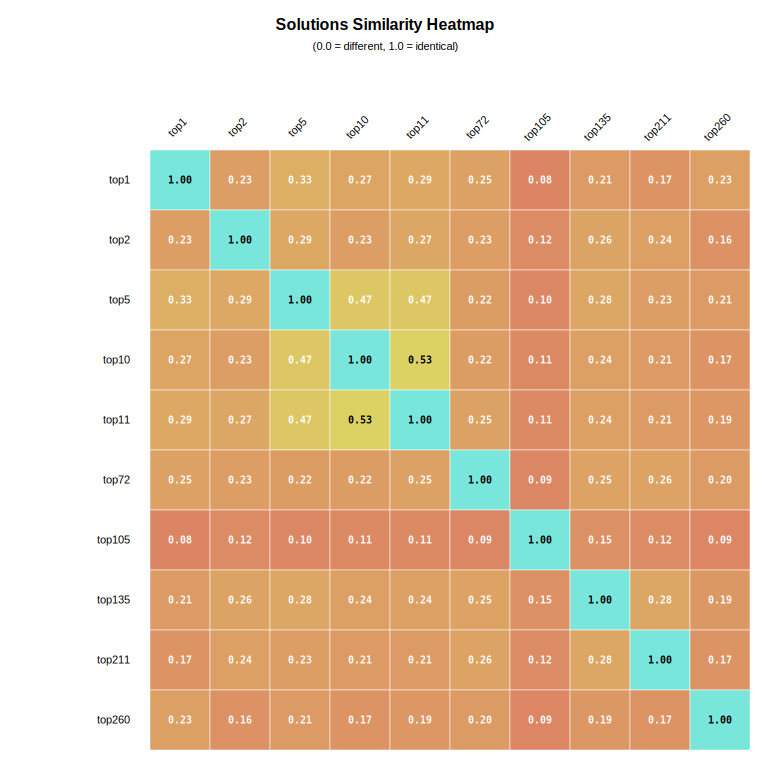
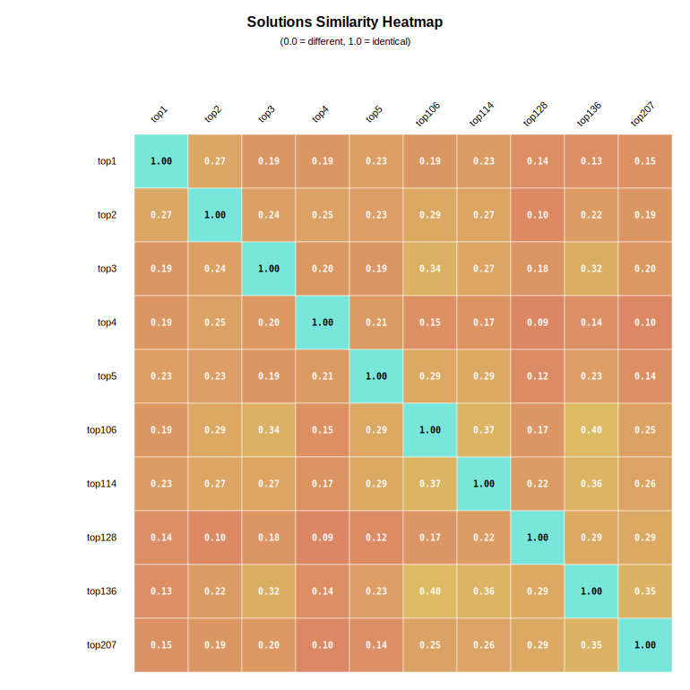

# Convergence architecturale des solutions dans les compétitions Kaggle
**Auteur : Baptiste Royer** · baptiste.royer@etu.univ-cotedazur.fr

La question centrale que nous abordons ici est la suivante : les solutions gagnantes présentent-elles une similarité architecturale entre elles, et se distinguent-elles des solutions moins performantes ? Cette problématique revêt un intérêt pratique important : elle permet de déterminer si la réussite dans ces compétitions repose davantage sur l'innovation architecturale ou sur la maîtrise et l'optimisation de composants techniques éprouvés (modèles établis, techniques de prétraitement standardisées, embeddings reconnus).

## Sommaire

1. [Hypothèses de recherche](#hypothèses-de-recherche)
   - [Opérationnalisation des hypothèses](#opérationnalisation-des-hypothèses)
2. [Méthodologie](#méthodologie)
   - [Sélection des compétitions](#sélection-des-compétitions)
   - [Sélection des solutions](#sélection-des-solutions)
   - [Sélection des critères architecturaux](#sélection-des-critères-architecturaux)
   - [Composition des prompts](#composition-des-prompts)
   - [Sélection du LLM](#sélection-du-llm)
   - [Calcul du score de similarité](#calcul-du-score-de-similarité)
3. [Menaces à la validité et stratégies d'atténuation](#menaces-à-la-validité-et-stratégies-datténuation)
   - [Normalisation des données extraites](#normalisation-des-données-extraites)
   - [Représentation structurée : approche booléenne](#représentation-structurée--approche-booléenne)
   - [Cross Validation LLM](#cross-validation-llm)
   - [Protocole de validation manuelle](#protocole-de-validation-manuelle)
4. [Résultats et interprétations](#résultats-et-interprétations)
   - [Visualisations](#visualisations)
   - [Validation des hypothèses](#validation-des-hypothèses)
   - [Limites](#limites)
   - [Conclusion](#conclusion)
5. [Ressources](#ressources)

## Hypothèses de recherche

Nous formulons deux hypothèses complémentaires pour guider notre étude :

**H1 (Convergence intra-groupe)** : Les solutions du top 5 se ressemblent architecturalement entre elles.

**H2 (Divergence inter-groupes)** : Les solutions du top 5 sont architecturalement différentes des solutions classées au-delà du rang 100.

### Opérationnalisation des hypothèses

Pour valider H1, nous calculons un score de similarité architecturale entre les solutions. L'hypothèse sera considérée comme validée si le score de similarité moyen intra-top 5 est significativement supérieur au score de similarité moyen intra-bottom 5, démontrant que les solutions performantes convergent davantage entre elles que les solutions faiblement classées.

Pour valider H2, nous procédons à une analyse comparative des distributions de similarité : le score de similarité moyen intra-groupe (top 5) doit être significativement supérieur au score de similarité moyen inter-groupes (top 5 versus bottom 5). Cette comparaison permet de quantifier la divergence architecturale entre solutions performantes et solutions faiblement classées.

## Méthodologie

Notre protocole expérimental repose sur une analyse comparative multi-domaines de solutions Kaggle. Trois compétitions représentant des domaines distincts sont sélectionnées : Natural Language Processing (NLP), données tabulaires, et Computer Vision. Pour chaque compétition, un échantillon de 10 solutions est constitué, comprenant les 5 solutions du podium et 5 solutions classées au-delà de la 100ème position. Chaque solution comprend une description fournie par son auteur et, lorsque disponible, un lien vers le notebook et/ou le dépôt GitHub associé.

Étant donné la nature hétérogène et non structurée des descriptions de solutions, l'extraction manuelle des critères architecturaux présente un coût prohibitif en termes de temps et d'effort. Cette étude utilise donc un Large Language Model (LLM) pour automatiser ce processus d'extraction selon un protocole itératif en cinq phases : (1) définition d'un schéma JSON de critères architecturaux, (2) extraction automatisée par LLM avec traçabilité des sources, (3) normalisation et validation des données extraites, (4) analyse du taux de complétion et raffinement itératif du schéma, (5) transformation en représentation booléenne et calcul des métriques de similarité.

La première phase consiste à définir une structure JSON initiale comportant des critères architecturaux fondamentaux issus de la littérature : bibliothèques utilisées, techniques d'embedding, modèles de Machine Learning, prétraitement, postprocessing, stratégies d'entraînement, et fonctions de perte. Cette structure initiale sert de base pour l'extraction automatisée.

La deuxième phase procède à l'extraction des caractéristiques architecturales de chaque solution via le LLM. Pour garantir la traçabilité et la vérifiabilité, le prompt d'extraction impose au modèle de fournir, pour chaque critère identifié, une justification comprenant la source exacte, un lien de vérification, et une citation textuelle. Cette information est structurée dans un fichier JSON de justification parallèle à la structure de données principale, permettant une vérification manuelle systématique de chaque assertion du modèle.

La troisième phase applique un pipeline de normalisation automatique aux données extraites pour garantir leur cohérence : conversion en minuscules avec trimming, uniformisation des séparateurs, suppression intelligente des doublons dans les listes (comparaison sans séparateurs), standardisation des valeurs vides différenciée par type (booléens à `false`, valeurs numériques à `null`, préservation des listes et chaînes vides), conversion automatique de types (strings booléennes et numériques), et validation structurelle (suppression des champs non conformes au schéma, ajout des champs manquants avec valeurs par défaut). Cette normalisation est suivie d'une vérification manuelle utilisant les fichiers de justification pour valider l'exactitude des extractions.

La quatrième phase évalue la pertinence du schéma via une analyse automatique via script du taux de complétion par champ. Si des champs présentent un taux de complétion nul (0%), le LLM est sollicité pour proposer un schéma amélioré remplaçant ces champs inutilisés par de nouveaux critères plus pertinents, avec justification bibliographique. Après vérification manuelle du schéma proposé, les solutions normalisées de l'itération précédente sont nettoyées (suppression des champs obsolètes, ajout des nouveaux champs vides) et une nouvelle itération d'extraction est lancée avec un prompt enrichi. Ce processus itératif se poursuit jusqu'à convergence, définie comme l'absence de champs à taux de complétion nul.

La cinquième phase transforme le schéma par listes convergé en une représentation booléenne structurée. Un script analyse l'ensemble des valeurs extraites dans chaque liste à travers toutes les solutions et génère un schéma où chaque valeur observée devient un champ booléen distinct. Cette transformation s'appuie exclusivement sur les données réellement extraites lors des itérations précédentes, complétées par des critères probables issus de la littérature. Le schéma booléen généré fait l'objet d'une vérification manuelle pour éliminer les champs redondants (ex: `transformer_models.mlm_pretraining` et `pretraining_methods.mlm_pretraining`), avec documentation de chaque suppression. Les solutions sont ensuite ré-extraites avec ce nouveau schéma : au lieu d'extraire des valeurs textuelles libres, le LLM effectue une tâche de classification binaire sur un ensemble prédéfini de critères, réduisant ainsi la complexité de la tâche et supprimant le risque de granularités de description différentes. Les solutions booléennes finales sont normalisées et vérifiées manuellement à l'aide des fichiers de justification.

Une fois les données architecturales extraites, validées et structurées, la comparaison des critères entre solutions permet de calculer plusieurs métriques de similarité. Une heatmap est générée pour visualiser l'ensemble des scores et identifier les patterns de convergence architecturale, permettant de valider ou d'infirmer les hypothèses H1 et H2. 

### Sélection des compétitions

La constitution du corpus de compétitions repose sur deux critères principaux : la diversité typologique des problèmes et la disponibilité quantitative des solutions.

La diversité typologique constitue une mesure de précaution méthodologique. Si l'étude se limitait à un seul type de compétition (NLP, vision par ordinateur, ou données tabulaires) et que ce domaine spécifique se prêtait mal à l'extraction de critères architecturaux par LLM, les résultats décevants pourraient être faussement attribués à l'absence de convergence architecturale, alors que le problème résiderait dans l'inadéquation entre le type de données et la méthodologie d'extraction. Pour éviter ce biais de validation, l'échantillon inclut des compétitions représentatives des trois grandes catégories de problèmes Kaggle : traitement du langage naturel (NLP), vision par ordinateur, et données tabulaires. Cette approche permet de distinguer les limites intrinsèques de la méthodologie des caractéristiques propres à chaque domaine.

Le critère quantitatif impose un seuil minimal de solutions disponibles pour garantir la robustesse statistique. Le corpus doit comprendre suffisamment de solutions classées dans le podium (top 10) et dans le segment élargi (top 100+) pour permettre une analyse comparative significative.

### Sélection des solutions

Au sein de chaque compétition retenue, la sélection des solutions individuelles s'appuie sur un critère de disponibilité documentaire. Seules les solutions accompagnées d'une documentation technique suffisante sont incluses dans le corpus d'analyse. Cette exigence se traduit par la présence obligatoire d'au moins l'un des éléments suivants :
- Une description textuelle détaillée de l'approche architecturale adoptée
- Un lien vers un dépôt GitHub contenant l'implémentation
- Un notebook Kaggle documenté exposant la solution
- Des références explicites aux notebooks ou implémentations tierces utilisés comme composants de la solution

Cette contrainte documentaire, bien qu'elle introduise un biais de sélection en faveur des solutions bien documentées, est nécessaire pour permettre l'extraction fiable des critères architecturaux par le LLM. Les solutions retenues pour chaque compétition sont répertoriées dans les dossiers [NLP](competitions/NLP_commonLit_readability_prize/solutions/), [Tabulaire](competitions/TABULAIRE_american_express_default_prediction/solutions/), et [Vision](competitions/VISION_cassava_leaf_disease_classification/solutions/).

### Sélection des critères architecturaux

La définition des critères architecturaux composant les structures JSON repose sur un processus itératif d'enrichissement. Dans une première phase, un ensemble de critères fondamentaux issus de la littérature en Machine Learning est défini ([schéma initial](competitions/NLP_commonLit_readability_prize/iteration-1/structure.json)) : embeddings, preprocessing, modèles transformers, fonctions de perte, stratégies d'entraînement, et postprocessing. Une première extraction effectuée par le LLM sur l'ensemble des solutions est suivie d'une normalisation automatique puis d'une analyse du taux de complétion par champ.

Lorsque l'analyse révèle des champs avec un taux de complétion nul (0%), le LLM est sollicité pour proposer des améliorations : "Remplacer les champs jamais remplis par de nouveaux champs plus pertinents, en citant les sources justifiant chaque ajout". La pertinence des nouveaux champs est vérifiée manuellement et un nouveau schéma est créé. Les solutions normalisées de l'itération précédente sont alors nettoyées selon le nouveau schéma, et une nouvelle itération d'extraction est lancée avec un prompt enrichi.

Le processus itératif se poursuit jusqu'à convergence, définie comme l'absence de champs à taux de complétion nul. À ce stade, la structure est considérée comme optimale pour l'extraction par liste. Les scripts d'analyse sont disponibles dans [scripts/field-completion-ratio/](scripts/field-completion-ratio/) et [scripts/normalize/](scripts/normalize/).

### Composition des prompts

Trois prompts distincts sont employés dans notre méthodologie : le [premier](prompts/instructions_basic.md) demande au LLM de remplir la structure JSON à partir des solutions, le [deuxième](prompts/instructions_enrich.md) effectue la même tâche avec des instructions différentes, et le [troisième](prompts/instructions_improvements.md) lui demande de proposer une structure JSON améliorée avec de nouveaux champs pour remplacer ceux dont le taux de complétion est nul.

Les instructions fournies au LLM, telles que "ne pas remplir les champs avec des valeurs not found, not used, etc. mais les laisser vides", servent à orienter le modèle vers les bonnes pratiques. Toutefois, elles ne garantissent pas une conformité systématique. Pour assurer la qualité des extractions, des scripts de vérification et des validations manuelles encadrent le travail du LLM.

### Sélection du LLM

La sélection du modèle de langage optimal nécessite d'abord l'identification d'un leaderboard approprié. Sur llm-stats.com, le SWE-Bench Verified leaderboard repose sur "un sous-ensemble vérifié de 500 problèmes de software engineering issus de véritables issues GitHub, validés par des annotateurs humains pour évaluer la capacité des modèles de langage à résoudre des problèmes de code réels en générant des patches pour des codebases Python". Les modèles les plus performants de ce leaderboard - Claude Opus 4.5, GPT-5.2 et Gemini 3 Flash - présentent les caractéristiques adéquates pour extraire les critères architecturaux dans nos solutions Python.

### Calcul du score de similarité

Le score de similarité entre deux solutions repose sur une comparaison champ par champ des structures JSON normalisées. Pour chaque critère architectural renseigné dans au moins l'une des deux solutions, une comparaison est effectuée : les champs vides (booléens `false`, listes vides, chaînes vides) sont considérés comme absents et ne produisent aucun point de similarité. Pour les listes de critères, la similarité de Jaccard mesure le chevauchement entre ensembles ($\frac{|A \cap B|}{|A \cup B|}$). Pour les valeurs scalaires, une comparaison d'égalité stricte est appliquée. Le score final correspond au nombre de points de similarité obtenus divisé par le nombre maximum de critères renseignés entre les deux solutions. Cette normalisation garantit que le score reflète la convergence architecturale réelle et non le niveau de documentation : une solution avec 10 critères renseignés comparée à une solution avec 8 critères génère un score sur 10. Cette méthodologie produit trois métriques principales : la similarité moyenne intra-groupe pour les solutions du top 5, la similarité moyenne intra-groupe pour les solutions du top 100+, et la similarité moyenne inter-groupes. L'implémentation complète avec des fichiers d'exemple est disponible dans [scripts/similarity/](scripts/similarity/).

## Menaces à la validité et stratégies d'atténuation

### Normalisation des données extraites

L'extraction automatisée via LLM présente des risques d'inconsistance dans la représentation des critères identiques. Cette variabilité s'observe à deux niveaux : la dénomination des champs et la représentation des valeurs. Par exemple, le modèle "XLNet" peut être extrait sous différentes formes lexicales ("XL Net", "Xlnet", "xlnet") et les champs peuvent présenter des variations syntaxiques ("patterns_transformers" vs "pattern_transformer").

Un pipeline de normalisation automatique est implémenté pour garantir la cohérence des données :
- Conversion en minuscules de l'ensemble des chaînes de caractères avec trimming des espaces
- Uniformisation des séparateurs (espaces, tirets, underscores, apostrophes, guillemets) par un tiret unique
- Suppression intelligente des doublons dans les listes : comparaison sans séparateurs pour identifier les variantes (`"XLNet"`, `"xlnet"`, `"XL Net"` considérés comme identiques)
- Standardisation des valeurs vides différenciée par type : valeurs booléennes vides converties en `false`, chaînes vides préservées, listes vides préservées, valeurs numériques vides converties en `null`
- Conversion automatique de types : strings booléennes (`"true"`, `"false"`, `"yes"`, `"no"`) et strings numériques (`"123"`) converties vers leurs types respectifs
- Validation structurelle : suppression des champs non conformes au schéma (hallucinations), ajout des champs manquants avec valeurs par défaut selon leur type

L'implémentation du pipeline de normalisation avec un exemple complet est disponible dans [scripts/normalize/](scripts/normalize/).

#### Transition entre itérations

Le script de normalisation joue également un rôle central lors de la transition entre itérations du processus de raffinement du schéma. Lorsque l'itération N+1 débute avec un schéma amélioré (champs à taux de complétion 0% remplacés par de nouveaux critères), les solutions extraites et normalisées de l'itération N constituent la base de départ. Le script applique le nouveau schéma sur ces solutions existantes : il supprime automatiquement les champs obsolètes, ajoute les nouveaux champs (initialisés à vides), et préserve l'ensemble des données valides déjà extraites. Cette approche évite de repartir de zéro et permet au LLM de se concentrer uniquement sur le remplissage des nouveaux critères lors de la ré-extraction, tout en bénéficiant du contexte des solutions déjà structurées.

#### Observations empiriques

L'analyse des rapports de normalisation de l'itération 1 ([NLP](competitions/NLP_commonLit_readability_prize/iteration-1/filled-structure/normalized/normalization_report.txt), [Tabulaire](competitions/TABULAIRE_american_express_default_prediction/iteration-1/filled-structure/normalized/normalization_report.txt), [Vision](competitions/VISION_cassava_leaf_disease_classification/iteration-1/filled-structure/normalized/normalization_report.txt)) révèle que les modifications les plus fréquentes concernent la conversion en minuscules (`lowercased`: 1-151 occurrences) et la normalisation des séparateurs (`separators_normalized`: 71-83 occurrences), témoignant de l'inconsistance typographique des extractions initiales du LLM. On observe aussi que le LLM a tendance à rajouter des champs indésirables qui sont donc nettoyés par le script.

À l'itération 2 ([NLP](competitions/NLP_commonLit_readability_prize/iteration-2/filled-structure/normalized/normalization_report.txt), [Tabulaire](competitions/TABULAIRE_american_express_default_prediction/iteration-2/filled-structure/normalized/normalization_report.txt), [Vision](competitions/VISION_cassava_leaf_disease_classification/iteration-2/filled-structure/normalized/normalization_report.txt)), le nombre de modifications chute drastiquement : le domaine Vision ne nécessite aucune modification, tandis que Tabulaire et NLP présentent respectivement 66 et 1 normalisations de séparateurs. Cette amélioration démontre que le LLM, en recevant les structures normalisées de l'itération précédente comme référence, assimile le format attendu et reproduit moins d'erreurs de casse et de séparation.

### Représentation structurée : approche booléenne

Bien que la normalisation atténue significativement les inconsistances, certaines ambiguïtés sémantiques persistent. Par exemple, les variantes "XLNet" et "XLNet transformer" peuvent désigner le même modèle mais avec des granularités de description différentes, rendant la comparaison lexicale insuffisante.

Une fois le schéma par listes convergé (absence de champs à 0%), une représentation booléenne est générée automatiquement à partir des solutions normalisées. Un script analyse l'ensemble des valeurs extraites dans chaque liste et génère un schéma booléen où chaque valeur observée devient un champ booléen distinct. Cette transformation s'appuie sur les données réellement extraites lors des itérations précédentes.

Représentation initiale (liste ouverte) :
```json
"patterns_transformers": {
    "transformer_models_used": ["XLNet"]
}
```

Représentation structurée (booléenne) :
```json
"patterns_transformers": {
    "xlnet": true,
    "albert": false,
    "electra": false
}
```

Le schéma booléen généré fait l'objet d'une vérification manuelle pour éliminer les champs redondants (ex: `transformer_models.mlm_pretraining` et `pretraining_methods.mlm_pretraining`). Les solutions sont ensuite ré-extraites avec ce nouveau schéma : au lieu d'extraire des valeurs textuelles libres, le LLM effectue une tâche de classification binaire sur un ensemble prédéfini de critères. Cette transformation réduit la complexité de la tâche d'extraction et supprime le risque de granularités de description différentes. Le script de conversion est disponible dans [scripts/list-to-boolean/](scripts/list-to-boolean/).

#### Observations empiriques

La vérification manuelle des schémas booléens générés automatiquement révèle des patterns de redondance systématiques documentés dans les fichiers de champs supprimés ([NLP](competitions/NLP_commonLit_readability_prize/final-iteration/removed-field.txt), [Tabulaire](competitions/TABULAIRE_american_express_default_prediction/final-iteration/removed-fields.txt), [Vision](competitions/VISION_cassava_leaf_disease_classification/final-iteration/removed-field.txt)).

Le nombre de suppressions varie selon les domaines : Vision présente 16 champs supprimés (augmentations, fonctions de perte, régularisations), NLP 5 champs (stratégies d'entraînement et architectures), et Tabulaire 7 champs (encodages et couches)

### Cross Validation LLM

Pour exclure le biais potentiel lié au choix du modèle de langage et valider la robustesse des résultats, une expérience de validation croisée a été envisagée : ré-extraire les critères architecturaux d'une compétition avec deux autres LLMs du SWE-Bench Verified leaderboard (GPT-5.2 et Gemini 3 Flash) et comparer les scores de similarité obtenus. Si les patterns de convergence architecturale observés avec Claude Opus 4.5 sont reproduits avec des modèles différents, cela constituerait une validation supplémentaire de la pertinence des données relevées et démontrerait que les conclusions ne dépendent pas d'un modèle spécifique.

Cependant, cette validation n'a pas pu être menée à terme pour plusieurs raisons pratiques. Le coût en tokens pour ré-extraire l'ensemble des solutions avec plusieurs LLMs est prohibitif, multipliant par trois le budget nécessaire. Au-delà des considérations financières, l'impact environnemental de l'inférence de tels modèles de langage n'est pas négligeable. Cette validation croisée reste néanmoins une perspective méthodologique pertinente pour de futures études.

### Protocole de validation manuelle

Malgré la représentation booléenne, le risque d'erreurs d'extraction persiste. Pour assurer la fiabilité des données, un protocole de validation manuelle est mis en place. Le prompt d'extraction est augmenté d'une exigence de traçabilité : pour chaque critère identifié, le LLM doit fournir une justification comprenant la source exacte, un lien de vérification, et une citation textuelle.

Cette information de traçabilité est structurée dans un second fichier JSON parallèle à la structure de données principale. Cette architecture permet une vérification systématique de chaque assertion du modèle.

Structure des données extraites :
```json
"patterns_transformers": {
    "xlnet": true,
    "albert": false,
    "electra": false
}
```

Structure de justification associée :
```json
"patterns_transformers": {
    "xlnet": {
        "source": "Kaggle discussion - 1st place solution",
        "link": "http://uri",
        "quote": "Model used in my final submission was xlnet"
    }
}
```

Cette approche facilite le processus de vérification manuelle en permettant un accès direct aux sources primaires via les liens fournis.

#### Observations empiriques

Le modèle utilise fréquemment des formulations telles que "It's a common practice in this context" pour justifier la présence d'un critère architectural, sans fournir de source primaire, de lien ou de citation textuelle. Ces justifications sont donc rejetées lors de la validation manuelle.

## Résultats et interprétations

Les résultats révèlent des patterns de convergence architecturale contrastés selon les domaines. Pour les données tabulaires (American Express, [métriques détaillées](competitions/TABULAIRE_american_express_default_prediction/final-iteration/filled-structure/normalized/metrics_report.txt)), la convergence est la plus marquée : similarité moyenne intra-top 5 de 33.76% (±10.55%) contre 18.02% (±6.56%) pour le bottom 5, avec un ratio de 1.87x. La similarité inter-groupes s'établit à 19.67% (±5.45%), démontrant une divergence significative de 14.09 points entre top 5 et inter-groupes.

Pour Computer Vision (Cassava Leaf, [métriques](competitions/VISION_cassava_leaf_disease_classification/final-iteration/filled-structure/normalized/metrics_report.txt)), la similarité intra-top 5 atteint 23.53% (±3.54%) comparée à 13.04% (±8.48%) pour le bottom 5, avec un ratio de 1.81x. La divergence inter-groupes (16.91% ±7.35%) confirme une séparation architecturale de 6.62 points entre solutions performantes et faiblement classées.

La compétition NLP (CommonLit, [métriques](competitions/NLP_commonLit_readability_prize/final-iteration/filled-structure/normalized/metrics_report.txt)) présente un pattern atypique : la similarité intra-top 5 (21.81% ±2.79%) est significativement inférieure à celle du bottom 5 (29.65% ±6.88%), avec un ratio inversé de 0.74x. La similarité inter-groupes (19.74% ±7.28%) reste inférieure à la convergence intra-bottom 5, mais l'écart est modeste (2.07 points). Ce résultat contre-intuitif révèle que les solutions faiblement classées convergent vers des approches standardisées, tandis que les solutions gagnantes explorent des espaces architecturaux diversifiés.

### Visualisations

Les heatmaps de similarité architecturale ci-dessous permettent de visualiser l'intensité des convergences entre solutions. Les scores varient de 0.0 (architectures totalement différentes) à 1.0 (architectures identiques). Les solutions sont ordonnées par rang de classement dans la compétition.

**Données tabulaires (American Express)**



La heatmap révèle une convergence forte dans le quadrant supérieur gauche (top 5 vs top 5) avec des scores atteignant 53.49%. Les solutions du bottom 5 (rangs 72-260) montrent une dispersion notable avec des scores inter-groupes faibles (minimum 7.89%), matérialisant une séparation architecturale nette entre groupes.

**Computer Vision (Cassava Leaf)**


Le pattern de convergence est similaire au domaine tabulaire : bloc de similarité dans le top 5 (maximum 30.77%) contrastant avec des scores inter-groupes faibles. Certaines solutions du bottom 5 (rangs 375-1284) présentent une similarité nulle (0.00%) entre elles, indiquant une extrême hétérogénéité architecturale ou une documentation lacunaire.

**Natural Language Processing (CommonLit)**



Le pattern s'inverse : le quadrant inférieur droit (bottom 5 vs bottom 5, rangs 106-207) forme un cluster de forte similarité (jusqu'à 40.00%), tandis que le quadrant supérieur gauche (top 5) présente une dispersion plus importante. Cette inversion visuelle corrobore le ratio inversé de 0.74x et suggère une standardisation des approches sous-optimales face à l'exploration architecturale des solutions gagnantes.

### Validation des hypothèses

**H1 (Convergence intra-groupe)** : Validée pour Tabulaire et Vision, où les moyennes intra-top 5 (33.76% et 23.53%) sont significativement supérieures aux moyennes intra-bottom 5 (18.02% et 13.04%), avec des ratios de 1.87x et 1.81x. Cette différence démontre que les solutions performantes convergent architecturalement entre elles de manière plus marquée que les solutions faiblement classées. Pour NLP, H1 est invalidée : la similarité intra-top 5 (21.81%) est inférieure à celle du bottom 5 (29.65%), avec un ratio inversé de 0.74x, révélant que les solutions gagnantes ne présentent pas de convergence supérieure aux solutions faiblement classées.

**H2 (Divergence inter-groupes)** : Validée pour les trois compétitions. Pour Tabulaire et Vision, les différences entre similarité intra-top 5 et inter-groupes atteignent respectivement 14.09 et 6.62 points, démontrant une divergence architecturale forte : les solutions performantes se ressemblent plus entre elles qu'avec les solutions faiblement classées. Pour NLP, bien que la divergence soit modeste (2.07 points), elle confirme que malgré la faible convergence intra-top 5, les solutions gagnantes partagent néanmoins plus de caractéristiques entre elles qu'avec le bottom 5.

### Limites

**Disponibilité documentaire** : Les solutions au-delà du top 20 sont rarement exhaustivement documentées. Seules 10 solutions par compétition disposaient d'une documentation technique suffisante (descriptions détaillées, notebooks publics, dépôts GitHub), limitant la taille des échantillons. Cette contrainte peut introduire un biais de sélection en faveur des solutions bien documentées et ne pas capturer la diversité architecturale complète des compétitions.

**Extraction automatisée par LLM** : Malgré le protocole de normalisation et de traçabilité, le risque d'omissions ou d'extractions imprécises persiste. Le LLM peut ne pas détecter tous les critères architecturaux mentionnés dans les descriptions, particulièrement lorsque celles-ci utilisent une terminologie non standard ou des schémas.

**Validation manuelle** : La vérification des champs extraits reste sujette aux erreurs humaines et à la fatigue cognitive, malgré la structure parallèle des fichiers de justification facilitant la traçabilité. Des erreurs peuvent échapper à la détection.

**Continuité contextuelle du LLM** : L'étude n'a pas évalué l'impact de la continuité contextuelle (sessions de chat uniques vs. multiples) sur la cohérence des extractions. Des sessions longues pourraient introduire des dérives dans la compréhension du schéma par le modèle, tandis que des sessions fragmentées pourraient générer des inconsistances terminologiques. L'étude ne se base que sur des sessions longues, unique à chaque compétition.

### Conclusion

**Les solutions gagnantes convergent-elles architecturalement ?** Oui, mais de manière domaine-dépendante. Cette étude révèle deux stratégies distinctes selon le type de compétition. Les hypothèses H1 et H2 sont validées pour Tabulaire et Vision, mais invalidées pour NLP. Pour Tabulaire et Vision, la stratégie optimale consiste à optimiser des architectures établies. Pour NLP, l'exploration architecturale diversifiée peut constituer un avantage compétitif.

## Ressources

> Voir [`README.md`](README.md) pour les instructions complètes de reproduction.

> Voir le dossier [`/scripts`](scripts) pour des exemples complets d'utilisation de chaque script.

### Benchmark

- **SWE-Bench Verified Leaderboard** : https://llm-stats.com/benchmarks/swe-bench-verified
  - "A verified subset of 500 software engineering problems from real GitHub issues, validated by human annotators for evaluating language models' ability to resolve real-world coding issues by generating patches for Python codebases."

### Compétitions Kaggle

- **CommonLit Readability Prize** (NLP) : https://www.kaggle.com/competitions/commonlitreadabilityprize
- **American Express - Default Prediction** (Tabulaire) : https://www.kaggle.com/competitions/amex-default-prediction
- **Cassava Leaf Disease Classification** (Vision) : https://www.kaggle.com/competitions/cassava-leaf-disease-classification
