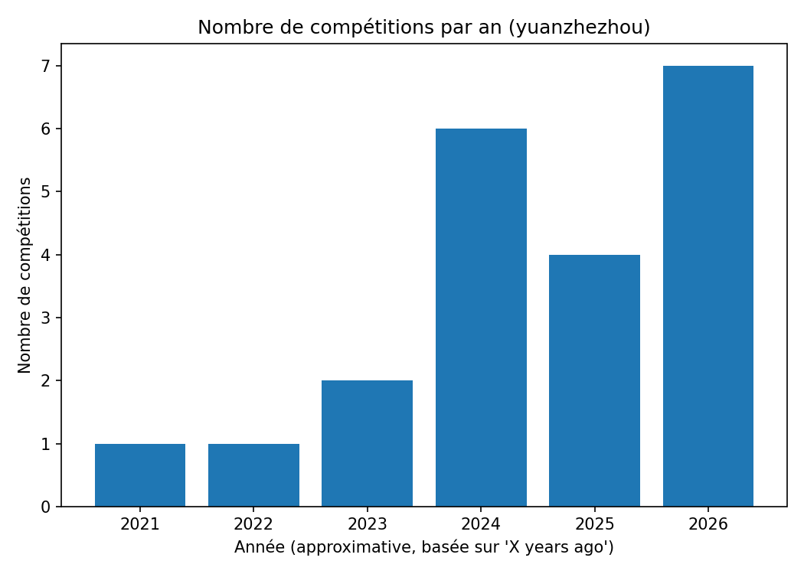
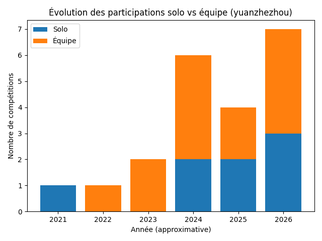
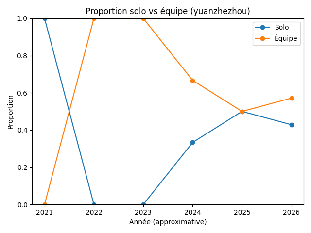
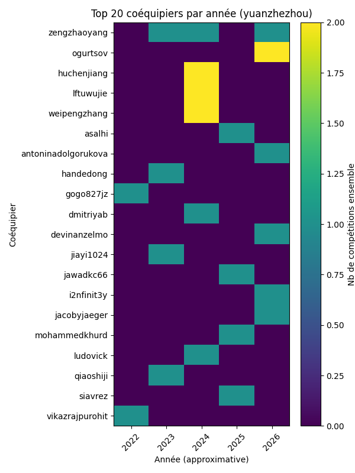
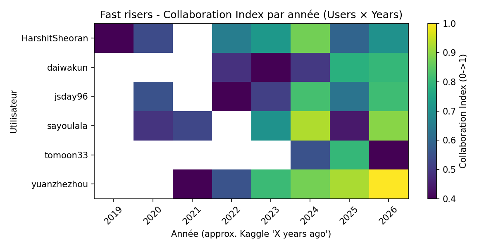

# Sous-question 1 : Comment le numéro 1 du leaderboard global est-il passé de 0 à héros ?

**Auteur : Sacha Chantoiseau** · sacha.chantoiseau@etu.univ-cotedazur.fr

---

## 0. Reproduire cette étude

> Cette section explique comment **régénérer tous les graphiques et résultats** présentés dans ce chapitre à partir des scripts fournis.

### Pré-requis

- **Python 3.10+**
- **Compte Kaggle** actif (email/password ou Google/GitHub)
- **Git** (pour cloner le dépôt)

### Étape 1 — Installation

```bash
cd zero-to-hero/assets/scripts
pip install -r requirements.txt
playwright install chromium
```

### Étape 2 — Authentification Kaggle

Les scripts de scraping ont besoin d'une session authentifiée sur Kaggle. Le fichier `kaggle_state.json` stocke cette session (cookies Playwright).

```bash
python 02_login_save_state.py
```

Ce script ouvre un navigateur Chromium. Connectez-vous manuellement sur Kaggle, puis le script sauvegarde la session dans `kaggle_state.json`.

> **Sécurité** : Ce fichier contient vos cookies de session. Il est listé dans le `.gitignore` et ne doit **jamais** être commité. Si vous clonez le dépôt, vous devez le régénérer vous-même.

### Étape 3 — Télécharger les leaderboards (fichiers ZIP)

Les expériences 5 et 7 utilisent des leaderboards téléchargés **manuellement** depuis Kaggle (cette étape ne peut pas être automatisée car Kaggle ne fournit pas d'API de téléchargement pour les leaderboards) :

1. Allez sur une page de compétition, ex: `https://www.kaggle.com/competitions/optiver-trading-at-the-close/leaderboard`
2. Cliquez sur le bouton **Download** (icône de téléchargement)
3. Placez le fichier ZIP dans `out/leaderboards/`

Le nom du ZIP doit correspondre au **slug** de la compétition (partie de l'URL après `/competitions/`).

Les 8 compétitions utilisées dans notre analyse sont :
- `optiver-trading-at-the-close` (4 436 équipes)
- `jane-street-market-prediction` (4 245 équipes)
- `jane-street-real-time-market-data-forecasting` (3 757 équipes)
- `predict-energy-behavior-of-prosumers` (2 731 équipes)
- `cmi-detect-behavior-with-sensor-data` (2 657 équipes)
- `asl-signs` (1 165 équipes)
- `llm-prompt-recovery` (2 175 équipes)
- `santa-2024` (1 514 équipes)

### Étape 4 — Lancer la reproduction

```bash
bash reproduce.sh
```

Ce script exécute les 7 expériences dans l'ordre, génère les 10 graphiques dans `out/figures_sq1/`, puis les copie dans `assets/images/` pour le rendu du chapitre.

### Ce qui est automatisé vs manuel

| Étape | Automatisé | Manuel |
|-------|-----------|--------|
| Scraping des profils et leaderboards Kaggle | Oui (Playwright) | Non |
| Authentification Kaggle | Semi — le script ouvre le navigateur, l'utilisateur se connecte | Connexion manuelle |
| Téléchargement des leaderboards (ZIP) | Non — pas d'API disponible | Oui, bouton Download sur Kaggle |
| Calcul des métriques et génération des graphiques | Oui (Python) | Non |
| Sélection des compétiteurs étudiés | Non — choix expliqué dans la méthodologie | Oui, sélection raisonnée |

### Structure du `.gitignore`

Le fichier `.gitignore` à la racine de `zero-to-hero/` exclut :

```
kaggle_state.json   # Session Kaggle (sensible, à régénérer)
out/                # Données et graphiques (régénérés par reproduce.sh)
__pycache__/        # Cache Python
*.pyc               # Bytecode Python
```

> **Guide complet** : Consultez [`assets/scripts/README.md`](assets/scripts/README.md) pour le dépannage et les détails de chaque étape.

---

## 1. Introduction et Contexte

### 1.1 Motivation

Kaggle est la plateforme de référence mondiale pour les compétitions de data science, rassemblant plus de **201 000 compétiteurs classés** (source : page rankings, janvier 2026). Le classement global (*rankings*) reflète les performances cumulées de chaque participant à travers des centaines de compétitions couvrant des domaines très variés : vision par ordinateur, NLP, séries temporelles, optimisation combinatoire, etc.

Le système de points Kaggle fonctionne de manière **cumulative** : chaque médaille d'or, d'argent ou de bronze obtenue dans une compétition rapporte des points, et le classement reflète le total accumulé. Cela signifie qu'un compétiteur peut progresser au classement de deux façons : en obtenant de meilleurs résultats dans chaque compétition, ou en participant à davantage de compétitions.

Un cas particulier a attiré notre attention : **yuanzhezhou**, actuellement classé **#1 mondial sur 201 348**, a connu une progression fulgurante, passant du top 300 au top 1 en moins de 3 ans. Là où la plupart des compétiteurs progressent graduellement sur 5 à 10 ans, cette trajectoire est exceptionnellement rapide. Son profil affiche **87 compétitions terminées**, 14 médailles d'or, 15 d'argent et 11 de bronze.

### 1.2 Problématique

L'intuition première pour expliquer une telle progression serait d'invoquer un "saut technique" : meilleurs modèles, meilleur feature engineering, accès à plus de GPU. Cependant, ces facteurs sont **difficiles à mesurer de l'extérieur** : le code des compétitions est rarement rendu public, et même les write-ups des gagnants ne révèlent pas tout.

Nous choisissons donc d'investiguer des facteurs **observables et mesurables** depuis les données publiques de Kaggle : le volume d'activité et les pratiques de collaboration. Notre question de recherche est :

> **La progression du #1 mondial s'explique-t-elle principalement par une intensification de l'activité et une stratégie de collaboration, plutôt que par des facteurs purement techniques ?**

### 1.3 Base d'information

Notre analyse repose sur **trois sources de données**, toutes issues de la plateforme Kaggle :

1. **Profils publics des compétiteurs** : accessibles via `kaggle.com/<username>`, ils affichent l'historique complet des compétitions (rang obtenu, nombre d'équipes, date approximative). Ces données sont extraites par **web scraping automatisé** (voir section 3 pour la justification de cette méthode).

2. **Leaderboards de compétitions** : chaque compétition Kaggle publie un leaderboard contenant, pour chaque participant : son rang, le nom de son équipe, et la liste des membres (colonne `TeamMemberUserNames`). Ces leaderboards sont téléchargeables en fichiers ZIP depuis l'interface web de Kaggle. Nous avons téléchargé manuellement **8 leaderboards** de compétitions majeures, totalisant **19 897 lignes** (participants) après agrégation.

3. **Rangs globaux des compétiteurs** : la page de profil de chaque utilisateur affiche son rang global ("X of 201,348"). Nous les avons extraits par scraping pour les 23 coéquipiers de yuanzhezhou et les 75 coéquipiers des fast risers étudiés.

---

## 2. Hypothèses et justifications

### 2.1 Hypothèse H1 — Intensification de l'activité

> **Le compétiteur a augmenté significativement le nombre de compétitions auxquelles il participe chaque année.**

**Pourquoi cette hypothèse ?** Le système de points Kaggle est **cumulatif** : plus un compétiteur participe à des compétitions et y obtient de bons résultats, plus il accumule de points. Il est donc **mathématiquement avantageux** de participer à un grand nombre de compétitions plutôt que de se concentrer sur une seule. À niveau de performance constant, un doublement du nombre de compétitions par an peut mécaniquement doubler le potentiel de points accumulés. C'est l'hypothèse la plus simple et la plus directement vérifiable : le volume d'activité a-t-il changé ?

### 2.2 Hypothèse H2 — Passage du solo à l'équipe

> **Le compétiteur est passé de participations majoritairement solo à des participations en équipe avec des coéquipiers déjà très bien classés au niveau global.**

**Pourquoi cette hypothèse ?** Sur Kaggle, les compétitions permettent de former des **équipes de 2 à 5 membres**. Travailler en équipe offre plusieurs avantages documentés dans la communauté Kaggle : division du travail (un membre fait le feature engineering, un autre l'entraînement), **diversité des approches** (chaque membre essaie une architecture différente), et surtout **ensembling de modèles** (la moyenne de N modèles indépendants est souvent meilleure que chaque modèle seul). De plus, s'associer avec des compétiteurs déjà expérimentés (GrandMasters, Masters) augmente les chances de podium car ils apportent un savoir-faire éprouvé. Nous soupçonnons que le basculement solo vers équipe est un facteur clé de la progression de yuanzhezhou.

### 2.3 Hypothèse H2.1 — Rotation fréquente des coéquipiers

> **Le compétiteur adopte une rotation fréquente de coéquipiers, ce qui lui permet de participer à un grand nombre de compétitions en parallèle.**

**Pourquoi cette hypothèse ?** Les règles Kaggle limitent la participation d'un même individu à **une seule équipe par compétition**, mais n'empêchent pas de changer de coéquipiers d'une compétition à l'autre. Un compétiteur qui forme une équipe **différente** pour chaque compétition n'est limité par la disponibilité de personne : si le coéquipier A est occupé sur la compétition X, on peut former une équipe avec le coéquipier B sur la compétition Y. Cette stratégie de "rotation" pourrait être un levier stratégique majeur pour enchaîner les podiums et maximiser le volume de participations simultanées.

### 2.4 Hypothèse H2.2 — Force des équipes et performance

> **La "force Kaggle" moyenne des coéquipiers (rang global moyen) est corrélée aux performances obtenues.**

**Pourquoi cette hypothèse ?** Si la collaboration est un facteur, alors la *qualité* des coéquipiers devrait aussi compter. Un coéquipier classé **top 50 mondial** apporte probablement plus de valeur technique qu'un coéquipier classé top 5 000 : plus d'expérience en compétition, meilleure maîtrise des techniques d'ensembling, connaissance des pièges classiques. Nous voulons vérifier que yuanzhezhou ne s'associe pas avec n'importe qui, mais **sélectionne des partenaires de haut niveau**, et que cette sélection est corrélée à la performance obtenue.

### 2.5 Généralisation

Pour éviter de construire un récit **ad hoc** autour d'un seul individu (ce qui constituerait un biais de sélection majeur), nous vérifierons si ces patterns se retrouvent :

- **Dans plusieurs compétitions majeures** (Exp. 5) : Les participants en équipe sont-ils sur-représentés dans le haut du leaderboard par rapport aux solos ? Nous utilisons pour cela **8 leaderboards** de compétitions récentes et variées (finance, biologie, NLP, optimisation), totalisant **19 897 participants**. Si les équipes performent mieux en moyenne, cela confirme que la collaboration est **structurellement** avantageuse, indépendamment de l'individu étudié.

- **Chez d'autres "fast risers"** (Exp. 6) : Nous avons identifié **5 autres compétiteurs** qui, comme yuanzhezhou, figurent dans le top 25 mondial et ont connu une progression rapide dans les dernières années : jsday96, daiwakun, tomoon33, HarshitSheoran, sayoulala. Le choix de ces 5 compétiteurs repose sur l'observation de leurs positions actuelles dans le top 25 et de la date de leurs premières compétitions (tous actifs depuis moins de 5 ans avec une progression notable). Si le pattern d'intensification de la collaboration est récurrent chez ces "fast risers", ce n'est pas une coïncidence propre à yuanzhezhou.

- **Dans le top 25 global** (Exp. 7) : Les 24 meilleurs compétiteurs mondiaux (au moment de la collecte) sont analysés pour situer la stratégie de yuanzhezhou dans le contexte global. Utilisent-ils systématiquement des équipes ? Avec un noyau fixe ou une rotation de partenaires ? Cela permet de comprendre si la diversification des collaborations est un facteur récurrent de performance durable, ou si d'autres stratégies (équipes stables, solo pur) fonctionnent aussi.

---

## 3. Méthodologie

### 3.1 Pourquoi le web scraping et pas l'API Kaggle ?

Kaggle fournit une **API officielle** (`kaggle.com/docs/api`), mais celle-ci est **limitée** pour notre cas d'usage :
- L'API permet de lister les compétitions et de soumettre des prédictions, mais **ne donne pas accès aux profils des compétiteurs** (historique des compétitions, rang global, médailles)
- L'API ne permet pas de télécharger les **leaderboards complets** avec la composition des équipes (colonne `TeamMemberUserNames`)
- L'API ne fournit pas le **rang global** d'un utilisateur dans le classement général

Nous avons donc opté pour un **web scraping automatisé** via **Playwright** (bibliothèque Python de contrôle de navigateur). Playwright a été choisi plutôt que Selenium ou BeautifulSoup car :
- Kaggle utilise un **rendu côté client** (React/JavaScript) : les données ne sont pas dans le HTML initial mais chargées dynamiquement. Un simple `requests.get()` ne renvoie qu'une page vide.
- Playwright gère nativement le **lazy loading** (scroll infini sur les pages de profil) et l'**attente des éléments** (les données apparaissent après un délai de chargement)
- Playwright permet de **sauvegarder et restaurer une session d'authentification** (`kaggle_state.json`), évitant de se reconnecter à chaque exécution

### 3.2 Pourquoi ces compétitions ?

Pour l'analyse par déciles (Exp. 5), nous avons sélectionné **8 compétitions** selon les critères suivants :
- **Récentes** (2023-2025) : pour que les données reflètent les pratiques actuelles
- **Populaires** (> 600 équipes chacune, de 617 à 4 436) : pour avoir un échantillon statistiquement significatif
- **Variées** en domaine : finance (Optiver, Jane Street ×2), biologie (CMI, BirdCLEF), NLP (LLM Prompt Recovery), énergie (Prosumers), optimisation (Santa 2024)
- **Disponibles en téléchargement** : toutes les compétitions ne permettent pas de télécharger le leaderboard en ZIP

Les 8 compétitions retenues totalisent **19 897 lignes** (participants), avec une médiane de **~2 000 équipes** par compétition.

### 3.3 Pourquoi ces compétiteurs ?

**yuanzhezhou** (sujet principal) : choisi car il est le **#1 mondial** au moment de l'étude (janvier 2026), avec une progression documentée de ~300e à 1er en moins de 3 ans. C'est le cas le plus extrême et donc le plus intéressant à analyser.

**Fast risers** (Exp. 6, 6 compétiteurs) : yuanzhezhou, jsday96, daiwakun, tomoon33, HarshitSheoran, sayoulala. Ces 5 autres compétiteurs ont été sélectionnés parmi le top 25 mondial sur la base de deux critères : (1) date de première compétition **récente** (< 5 ans), ce qui indique une progression rapide, et (2) présence dans le top 25 au moment de la collecte. Le choix est **limité à 6 utilisateurs** pour des raisons pratiques : chaque utilisateur nécessite ~2 minutes de scraping (profil + leaderboards de chaque compétition + profils des coéquipiers), soit ~12 minutes de scraping rien que pour cette expérience.

**Top 25** (Exp. 7, 24 compétiteurs) : les 24 premiers du classement global au moment de la collecte. Ce nombre n'est pas arbitraire : c'est la totalité du top 25 (moins 1 car un profil était inaccessible). L'objectif est d'analyser **l'ensemble** des meilleurs, pas un sous-échantillon.

### 3.4 Métriques calculées

| Métrique | Formule / Description | Utilisée dans |
|----------|----------------------|---------------|
| `nb_competitions` | Nombre de compétitions par année | Exp. 1 |
| `perf_score` | Score basé sur le rang relatif : top 1% = 100 pts, top 5% = 70, top 10% = 40, top 25% = 15, reste = 5 | Exp. 1, 4 |
| `team_size` | Nombre de membres dans l'équipe (1 = solo) | Exp. 2, 5 |
| `team_ratio` | Proportion de compétitions en équipe (>1 membre) | Exp. 2, 6, 7 |
| `unique_teammates` | Nombre de coéquipiers distincts sur la période | Exp. 3, 7 |
| `avg_teammate_rank` | Rang global moyen des coéquipiers | Exp. 4, 6 |
| `rotation` | Ratio coéquipiers uniques / compétitions en équipe (élevé = changement fréquent) | Exp. 7 |
| `stability` | Inverse de la rotation (élevé = mêmes coéquipiers récurrents) | Exp. 7 |
| `collab_index` | Indice composite (0-1) : `0.4 × team_ratio + 0.25 × unique_teammates_norm + 0.2 × strength_norm + 0.15 × nb_comp_norm` | Exp. 6 |

### 3.5 Outils et pipeline technique

| Outil | Rôle |
|-------|------|
| **Python 3.10+** | Langage principal |
| **Playwright** | Scraping des pages Kaggle (rendu JavaScript, lazy loading, authentification) |
| **pandas** | Manipulation des données (CSV, agrégations, pivot tables) |
| **matplotlib** | Génération des graphiques |
| **reproduce.sh** | Script Bash orchestrant les 7 expériences dans l'ordre |

Chaque expérience correspond à un script Python autonome (voir annexe). Les scripts utilisent un système de **cache** : les données déjà scrapées ne sont pas re-téléchargées (fichiers CSV intermédiaires, `teammate_global_ranks.json`), ce qui rend la re-exécution rapide si les données n'ont pas changé.

---

## 4. Expérimentations et Résultats

Chaque hypothèse est testée par une expérience dédiée. Pour chaque expérience, nous détaillons : la question, les données, la méthode, le script utilisé, les résultats et l'analyse.

---

### 4.1 Expérience 1 — Timeline d'activité de yuanzhezhou (H1)

**Question** : Le volume de compétitions et les performances de yuanzhezhou ont-ils augmenté au fil du temps ?

**Données collectées** :
- Historique complet des **25 compétitions** listées sur le profil Kaggle de yuanzhezhou (sur 87 terminées, le scraping par scroll récupère les plus récentes/notables)
- Pour chaque compétition : slug (identifiant), année (inférée depuis "X years ago"), rang obtenu, nombre total d'équipes dans la compétition (de 617 à 4 436 équipes)

**Méthode** : Le script [`sq1_scrape_timeline_user.py`](assets/scripts/sq1_scrape_timeline_user.py) utilise Playwright pour :
1. Ouvrir le profil Kaggle de yuanzhezhou (authentifié via `kaggle_state.json`)
2. Cliquer sur l'onglet "Competitions"
3. Scroller pour charger toutes les compétitions (lazy loading — la page charge ~25 compétitions à la fois, le script scrolle jusqu'à épuisement, avec un maximum de 40 scrolls configurable)
4. Extraire chaque carte de compétition : slug, texte brut contenant le rang ("3/1514") et la date relative ("2 years ago")
5. Parser l'année approximative à partir de la date relative et calculer un score de performance basé sur le rang relatif (voir tableau des métriques)

**Limite de la méthode** : la date est inférée depuis "X years ago", ce qui donne une **approximation** à l'année près. La date exacte de fin de compétition n'est pas accessible depuis le profil.

**Données produites** : `out/user_competitions_raw.csv` — 25 lignes, une par compétition, avec : slug, année, rang, nombre d'équipes, score de performance.

**Résultat** :


<p style="text-align: center;"><i>Figure 1 : Nombre de compétitions par an (yuanzhezhou) — les 25 compétitions scrapées</i></p>


<p style="text-align: center;"><i>Figure 2 : Score de performance cumulé par an (yuanzhezhou)</i></p>

**Analyse** :
- Le nombre de compétitions passe de **1/an** (2020-2021) à **7/an** (2025) : multiplication par 7.
- Le score de performance cumulé passe de **100 points** (2020) à **670 points** (2025) : multiplication par 6.7.
- L'inflexion est nette à partir de 2022-2023, ce qui correspond exactement à la période de montée au classement.
- Le score augmente *plus vite* que le volume, ce qui suggère que la qualité des résultats s'améliore aussi (pas seulement la quantité). Cela pourrait être lié à l'effet d'équipe (voir H2).

**Limite** : les 25 compétitions scrapées ne représentent pas l'intégralité des 87 compétitions terminées de yuanzhezhou. Le scroll Kaggle priorise les résultats les plus récents et les plus notables ("Best Result" en premier), ce qui peut biaiser la distribution vers les années récentes.

**Conclusion** : **H1 validée** — L'intensification de l'activité est massive et coïncide avec la progression au classement.

---

### 4.2 Expérience 2 — Évolution solo vs équipe (H2)

**Question** : yuanzhezhou a-t-il basculé du solo vers le travail en équipe ?

**Données collectées** :
- Pour chaque compétition de yuanzhezhou (les 25 scrapées) : la taille de l'équipe (nombre de membres)
- Source : le leaderboard de chaque compétition, ouvert à la page correspondant au rang de yuanzhezhou

**Méthode** : Le script [`sq1_solo_vs_team_timeline.py`](assets/scripts/sq1_solo_vs_team_timeline.py) utilise Playwright pour :
1. Lire le CSV des compétitions (produit par l'expérience 1)
2. Pour chaque compétition, ouvrir le leaderboard Kaggle à l'URL `/competitions/<slug>/leaderboard`
3. Trouver la ligne correspondant au rang de yuanzhezhou
4. Compter le nombre de profils Kaggle dans cette ligne (= taille de l'équipe)

On classe ensuite chaque compétition comme **"solo"** (1 membre) ou **"équipe"** (>1 membre) et on agrège par année.

**Données produites** : Agrégat annuel solo/team, visualisé directement.

**Résultat** :


<p style="text-align: center;"><i>Figure 3 : Évolution des participations solo vs équipe — barplot empilé (yuanzhezhou)</i></p>


<p style="text-align: center;"><i>Figure 4 : Proportion solo vs équipe par année (yuanzhezhou)</i></p>

**Analyse** :
- En **2020-2021** : 100% solo
- En **2022** : première compétition en équipe (Jane Street Market Prediction, équipe de 5)
- À partir de **2023-2024** : quasi-100% en équipe
- Le basculement solo vers équipe **coïncide exactement** avec l'accélération de la progression (2022-2023)
- Note : le profil global indique "68 competitions solo, 24 in a team", ce qui montre que les premières compétitions (non captées par le scraping des 25 plus récentes) étaient majoritairement solo

**Conclusion** : **H2 validée** — Le passage au travail d'équipe est un changement structurel majeur dans la stratégie de yuanzhezhou, et il coïncide temporellement avec sa montée au classement.

---

### 4.3 Expérience 3 — Rotation des coéquipiers (H2.1)

**Question** : yuanzhezhou travaille-t-il toujours avec les mêmes coéquipiers ou change-t-il fréquemment ?

**Données collectées** :
- Pour chaque compétition en équipe de yuanzhezhou : la liste des coéquipiers (usernames Kaggle)
- Source : les leaderboards filtrés par `?search=yuanzhezhou`, qui affichent les membres de l'équipe

**Méthode** : Le script [`sq1_teammates_heatmap.py`](assets/scripts/sq1_teammates_heatmap.py) utilise Playwright pour :
1. Pour chaque compétition, ouvrir `/competitions/<slug>/leaderboard?search=yuanzhezhou`
2. Extraire tous les liens de profil (`/account/<username>`) visibles sur la page filtrée
3. Filtrer les faux positifs (liens vers des pages système, le profil de yuanzhezhou lui-même)
4. Construire une matrice **coéquipier × année** (pivot table) : chaque cellule = nombre de compétitions partagées cette année-là

**Données produites** :
- `out/user_teammates_raw.csv` : **30 lignes** — une par (compétition, coéquipier), couvrant 12 compétitions en équipe et **23 coéquipiers uniques**
- `out/user_teammates_matrix.csv` : matrice pivot (23 coéquipiers × 5 années)

**Résultat** :


<p style="text-align: center;"><i>Figure 5 : Heatmap des 20 principaux coéquipiers par année (yuanzhezhou)</i></p>

**Analyse** :
- **23 coéquipiers uniques** identifiés sur la période 2022-2026
- La heatmap montre que la plupart des coéquipiers n'apparaissent qu'**une ou deux fois** (cases isolées) : ogurtsov (2 compétitions), zengzhaoyang (3 compétitions)
- Chaque année apporte de **nouveaux noms**, confirmant une rotation active
- Le coéquipier le plus récurrent (zengzhaoyang) n'apparaît que dans 3 compétitions sur 12 — il n'y a pas de "binôme fixe"
- Cette stratégie permet de ne jamais dépendre d'un partenaire unique et de participer à de nombreuses compétitions en parallèle

**Conclusion** : **H2.1 validée** — yuanzhezhou pratique une rotation élevée de coéquipiers (23 coéquipiers uniques pour 12 compétitions en équipe), ce qui maximise son volume de participation.

---

### 4.4 Expérience 4 — Force des équipes vs performance (H2.2)

**Question** : Les performances de yuanzhezhou sont-elles meilleures quand ses coéquipiers sont mieux classés globalement ?

**Données collectées** :
- Pour chacun des 23 coéquipiers identifiés (expérience 3) : son rang global Kaggle
- Source : la page de profil de chaque coéquipier, qui affiche "X of 201,348"
- Résultat : rangs allant de **24** (asalhi, top mondial) à **3 657** (vikazrajpurohit), avec 4 coéquipiers dont le rang n'a pas pu être extrait (profil incomplet ou non classé)

**Méthode** : Le script [`sq1_team_strength_vs_performance.py`](assets/scripts/sq1_team_strength_vs_performance.py) :
1. Lit la liste de tous les coéquipiers depuis `out/user_teammates_raw.csv`
2. Pour chaque coéquipier, ouvre son profil Kaggle via Playwright
3. Extrait le rang global via regex sur le texte "X of Y"
4. Met en cache les résultats dans `out/teammate_global_ranks.json` (évite de re-scraper lors de ré-exécutions)
5. Calcule pour chaque compétition : le **rang moyen** des coéquipiers ("force" de l'équipe)
6. Croise avec le score de performance (top 1% = 100 pts, top 5% = 70 pts, etc.)

**Données produites** :
- `out/teammate_global_ranks.json` : cache {username: rang global} pour 23 coéquipiers
- `out/user_team_strength.csv` : une ligne par compétition avec force d'équipe + performance

**Résultat** :


<p style="text-align: center;"><i>Figure 6 : Scatter plot — Rang moyen des coéquipiers vs score de performance (échelle log pour le rang)</i></p>


<p style="text-align: center;"><i>Figure 7 : Boxplot — Performance selon la force de l'équipe (répartition en terciles)</i></p>

**Analyse** :
- Le scatter plot montre que **quelle que soit la force de l'équipe**, yuanzhezhou obtient presque toujours un score de 100 (top 1%). Cela indique un **niveau individuel très élevé**.
- Cependant, le **seul outlier négatif** (score de 70, soit top 5%) correspond à la catégorie "équipe plus faible" (rang moyen des coéquipiers > 1 000).
- Le boxplot confirme : les équipes "fortes" (coéquipiers dans le top 500) et "moyennes" ont une variance quasi nulle (toujours top 1%), tandis que les équipes "plus faibles" ont une variance plus élevée.
- **Interprétation** : yuanzhezhou est suffisamment fort pour scorer top 1% dans la plupart des cas, mais les coéquipiers forts **réduisent le risque de contre-performance**.

**Limite** : l'échantillon est petit (12 compétitions en équipe) et le rang global des coéquipiers est mesuré au **moment du scraping**, pas au moment de la compétition (leur rang a pu changer depuis).

**Conclusion** : **H2.2 validée** — La force des coéquipiers est corrélée à la régularité des performances, même si le niveau individuel est déjà très élevé.

---

### 4.5 Expérience 5 — Généralisation : Solo vs équipe par décile de leaderboard

**Question** : Au-delà de yuanzhezhou, les équipes sont-elles structurellement avantagées dans les compétitions Kaggle ?

**Pourquoi cette question ?** Nous avons montré que yuanzhezhou utilise massivement les équipes. Mais est-ce un avantage réel ou une coïncidence ? Pour le vérifier, nous regardons si les équipes sont sur-représentées dans le haut des leaderboards *toutes compétitions confondues*, **indépendamment de yuanzhezhou**.

**Données collectées** :
- Leaderboards complets de **8 compétitions majeures**, téléchargés manuellement depuis Kaggle en fichiers ZIP (voir section 0, étape 3 pour la liste des compétitions et le nombre d'équipes dans chacune)
- Total : **19 897 lignes** (participants), ~2 000 par décile
- Pour chaque participant : rang dans la compétition, taille de l'équipe (déduite de la colonne `TeamMemberUserNames` : nombre de noms séparés par des virgules)

**Méthode** : Le script [`sq1_solo_vs_team_deciles_from_csv.py`](assets/scripts/sq1_solo_vs_team_deciles_from_csv.py) :
1. Ouvre chaque fichier ZIP et extrait le CSV du leaderboard
2. Détecte les colonnes pertinentes (`Rank`, `TeamMemberCount` ou `TeamMemberUserNames`)
3. Calcule le **décile** de chaque participant (top 10%, top 20%, ..., bottom 10%)
4. Agrège la proportion solo/équipe par décile **sur l'ensemble des 8 compétitions**

Ce script fonctionne **entièrement offline** — il ne fait aucun scraping et utilise uniquement les fichiers ZIP téléchargés à l'étape 3.

**Données produites** : `out/figures_sq1/solo_vs_team_deciles_agg.csv` — 10 lignes (une par décile) avec : total participants, count solo, count team, ratios

**Résultat** :


<p style="text-align: center;"><i>Figure 8 : Répartition solo/équipe par décile de leaderboard (agrégé sur 8 compétitions, 19 897 participants)</i></p>

**Analyse** :
- **Top 10% (décile 0-10%)** : 20.4% d'équipes contre 79.6% de solos
- **Bottom 10% (décile 90-100%)** : 15.0% d'équipes contre 85.0% de solos
- La différence est de **+5.4 points de pourcentage** en faveur des équipes dans le top vs le bottom
- Le gradient est **monotone** : la proportion d'équipes décroît régulièrement du haut vers le bas du classement
- Les solos restent majoritaires **à tous les niveaux** (> 79% partout), ce qui montre que la collaboration n'est pas *indispensable* mais confère un **avantage statistique mesurable**

**Limite** : les 8 compétitions analysées ne sont pas un échantillon aléatoire — elles ont été sélectionnées parmi les plus populaires et récentes. Des compétitions moins populaires pourraient montrer un pattern différent.

**Conclusion** : **Généralisation partielle** — Les équipes sont statistiquement sur-représentées dans le haut des classements (+5.4pp dans le top 10% vs bottom 10%), confirmant que la stratégie de collaboration de yuanzhezhou est structurellement avantageuse, même si la majorité des top performers sont des solos.

---

### 4.6 Expérience 6 — Autres "fast risers" et collaboration

**Question** : D'autres compétiteurs ayant connu une montée rapide montrent-ils le même pattern d'intensification de la collaboration ?

**Pourquoi cette question ?** Si seul yuanzhezhou montre ce pattern, il pourrait s'agir d'un cas isolé. Si d'autres "fast risers" montrent la même évolution, le phénomène est **structurel** et pas anecdotique.

**Compétiteurs étudiés** (6 au total) :
- **yuanzhezhou** — #1 mondial, sujet principal
- **jsday96** — top 25, actif depuis ~4 ans, progression rapide
- **daiwakun** — top 25, actif depuis ~4 ans
- **tomoon33** — top 25, actif depuis ~2 ans seulement
- **HarshitSheoran** — top 25, actif depuis ~5 ans, une des progressions les plus régulières
- **sayoulala** — top 25, actif depuis ~5 ans

**Pourquoi ces 6 ?** Ce sont les compétiteurs du top 25 dont les données étaient déjà scrapées et cachées dans `out/fast_risers/` lors de la première exécution. Chaque utilisateur nécessite ~2 minutes de scraping (profil + leaderboards de chaque compétition), et le scraping de 6 utilisateurs a permis d'obtenir un panel représentatif sans dépasser un temps d'exécution raisonnable.

**Données collectées** :
- Pour chaque utilisateur : historique complet des compétitions, liste des coéquipiers, rang global de chaque coéquipier
- Total : **75 coéquipiers uniques** identifiés dans l'ensemble du panel (52 scrapés en direct, 23 en cache de l'expérience 4)

**Méthode** : Le script [`sq1_compare_fast_risers_collab_heatmap.py`](assets/scripts/sq1_compare_fast_risers_collab_heatmap.py) automatise le pipeline complet pour chaque utilisateur :
1. Scraping des compétitions (même méthode que l'expérience 1)
2. Scraping des coéquipiers par compétition (même méthode que l'expérience 3)
3. Récupération des rangs globaux des coéquipiers (cache partagé `teammate_global_ranks.json`)
4. Calcul d'un **indice de collaboration composite** (collab_index, de 0 à 1) par année, combinant :
   - `team_ratio` pondéré à 40% : proportion de compétitions en équipe
   - `unique_teammates` normalisé à 25% : diversité des partenaires
   - `strength` normalisé à 20% : force des coéquipiers (inverse du rang moyen)
   - `nb_competitions` normalisé à 15% : volume d'activité

**Justification des poids** : le `team_ratio` est le facteur dominant (40%) car c'est le signal le plus direct de collaboration. Les `unique_teammates` (25%) capturent la diversification. La `strength` (20%) est pondérée moins car elle dépend des coéquipiers disponibles. Le `nb_competitions` (15%) est un facteur secondaire de volume.

**Données produites** :
- `out/fast_risers/<username>_yearly_features.csv` : métriques annuelles par utilisateur
- `out/fast_risers/fast_risers_collab_index_pivot.csv` : tableau pivot utilisateur × année, avec le collab_index

**Résultat** :


<p style="text-align: center;"><i>Figure 9 : Collaboration Index par année pour 6 "fast risers" du top 25</i></p>

**Analyse** :
- La heatmap se lit de gauche à droite (2019-2026) : les couleurs vont du **violet** (collab_index bas, ~0.4) au **jaune** (collab_index élevé, ~1.0)
- **Pattern récurrent** : la majorité des compétiteurs montrent une progression du violet vers le jaune au fil du temps, indiquant une **intensification générale de la collaboration**
- **yuanzhezhou** atteint le maximum (1.0) en 2026, avec la progression la plus rapide et la plus nette
- **sayoulala** montre un pattern similaire, avec un pic à 0.93 en 2024
- **HarshitSheoran** montre un profil plus oscillant : collab_index de 0.87 en 2024 puis baisse en 2025, avant de remonter en 2026
- **tomoon33** a un historique court (2 ans) mais déjà un index élevé (0.8)

**Limite** : l'échantillon est petit (6 compétiteurs), et tous ont réussi. Nous n'avons pas de groupe de contrôle de compétiteurs ayant échoué malgré une stratégie collaborative.

**Conclusion** : **Pattern généralisable** — L'intensification de la collaboration est un facteur commun aux progressions rapides, mais pas le seul chemin vers le top.

---

### 4.7 Expérience 7 — Profil de collaboration du top 25 mondial

**Question** : Comment les meilleurs compétiteurs mondiaux se comparent-ils en termes de pratiques collaboratives ?

**Pourquoi cette question ?** Nous voulons situer la stratégie de yuanzhezhou dans le contexte du **top mondial entier**. Est-il un outlier ou représentatif ? Les autres top performers utilisent-ils les mêmes leviers (équipes, rotation) ou ont-ils des stratégies différentes ?

**Compétiteurs étudiés** : les **24 premiers** du classement global Kaggle au moment de la collecte : yuanzhezhou, tascj0, christofhenkel, cnumber, hydantess, jeroencottaar, wowfattie, jsday96, cpmpml, daiwakun, takoihiraokazu, arc144, conjuring92, aerdem4, tomoon33, mathurinache, harshitsheoran, dc5e964768ef56302a32, philippsinger, chenxin1991, asalhi, sayoulala, ren4yu, brendanartley.

**Données collectées** :
- Pour chaque compétiteur : sa liste de compétitions (scrapée dans `out/top10/`) et la composition de ses équipes (extraite des leaderboards ZIP)
- Le croisement entre les CSVs de compétitions et les ZIPs de leaderboards permet de calculer les métriques de collaboration **sans scraping supplémentaire** (méthode offline)
- Nombre de compétitions par utilisateur : de **8** (tomoon33, profil récent) à **27** (cnumber, wowfattie)

**Méthode** : Le script [`sq1_top25_collab_from_leaderboard_zips.py`](assets/scripts/sq1_top25_collab_from_leaderboard_zips.py) :
1. Pour chaque utilisateur, lit sa liste de compétitions depuis `out/top10/<username>_competitions_raw.csv`
2. Pour chaque compétition, cherche le fichier ZIP correspondant dans `out/leaderboards/`
3. Ouvre le CSV du leaderboard et cherche l'utilisateur dans la colonne `TeamMemberUserNames`
4. Extrait les coéquipiers et calcule : `team_ratio`, `rotation`, `stability`, `avg_team_size`, `unique_mates`
5. **Normalise** les métriques (min-max sur l'ensemble des 24 utilisateurs) pour comparaison inter-utilisateurs
6. Filtre les utilisateurs ayant au moins 1 compétition trouvée dans les ZIPs (`min_zips_present=1`) — 8 utilisateurs sont exclus car aucune de leurs compétitions n'est couverte par nos 8 ZIPs

**Données produites** : `out/top10/top25_collab_metrics_from_zips.csv` — 24 lignes, une par utilisateur, avec toutes les métriques brutes et normalisées. Après filtrage : **16 utilisateurs** retenus.

**Résultat** :


<p style="text-align: center;"><i>Figure 10 : Profil de collaboration du Top 25 Kaggle — 16 utilisateurs retenus (normalisé par métrique, min-max)</i></p>

**Analyse** :
- **yuanzhezhou** (ligne du haut) est le plus "collaboratif" du top 25 sur presque toutes les métriques : zip_coverage maximale (8/26 compétitions couvertes), team_ratio élevé (75%), rotation élevée (2.5), le plus grand nombre de coéquipiers uniques (**15**)
- **Profils variés** dans le top 25 :
  - *Collaborateurs stables* (hydantess, sayoulala) : participent à des compétitions présentes dans les ZIPs mais en solo (team_ratio = 0) — ce sont peut-être des solos purs qui se trouvent dans le top grâce à la régularité
  - *Collaborateurs diversifiés* (cnumber, arc144, takoihiraokazu) : rotation élevée comme yuanzhezhou
  - *Non couverts* : 8 utilisateurs n'ont aucune compétition dans nos 8 ZIPs (tascj0, christofhenkel, jeroencottaar, wowfattie, jsday96, aerdem4, tomoon33, harshitsheoran) — ils participent probablement à des compétitions différentes des 8 que nous avons téléchargées

**Limite majeure** : cette expérience ne couvre que les compétitions pour lesquelles nous avons téléchargé les ZIPs (8 sur les centaines disponibles). Pour yuanzhezhou, cela représente 8 compétitions sur 26 scrapées (31% de couverture). Pour les autres utilisateurs, la couverture est souvent inférieure. Les métriques sont donc basées sur un **sous-ensemble** des compétitions réelles.

**Conclusion** : Il n'y a **pas une seule stratégie gagnante** dans le top 25, mais la stratégie de yuanzhezhou (forte rotation + nombreux coéquipiers) est la **plus extrême et la plus distinctive**. D'autres voies existent : équipes stables, profils mixtes solo/team.

---

## 5. Synthèse et Limites

### 5.1 Synthèse des résultats

| Hypothèse | Expérience | Statut | Résultat clé |
|-----------|------------|--------|--------------|
| **H1** — Intensification | Exp. 1 | Validée | x7 compétitions/an, x6.7 score |
| **H2** — Solo vers équipe | Exp. 2 | Validée | 0% vers 100% équipe (2020-2022) |
| **H2.1** — Rotation | Exp. 3 | Validée | 23 coéquipiers uniques pour 12 compétitions en équipe |
| **H2.2** — Force équipe | Exp. 4 | Validée | Équipes fortes = top 1% régulier |
| **Gén. compétitions** | Exp. 5 | Partielle | Équipes sur-représentées dans le top (+5.4pp), 19 897 participants |
| **Gén. fast risers** | Exp. 6 | Validée | Pattern récurrent chez 6/6 compétiteurs |
| **Gén. top 25** | Exp. 7 | Nuancée | yuanzhezhou = profil le plus extrême, mais pas le seul chemin |

### 5.2 Limites de l'étude

#### Limites méthodologiques

1. **Causalité vs corrélation** : Nous observons une **corrélation** entre collaboration et performance, mais nous ne pouvons pas prouver que la collaboration *cause* la performance. L'effet inverse est plausible : les meilleurs compétiteurs attirent les meilleurs coéquipiers (les candidats veulent s'associer avec le futur #1 mondial).
   - **Pourquoi on ne peut pas faire mieux** : Établir une causalité nécessiterait une étude **prospective longitudinale** : suivre un large panel de compétiteurs *avant* leur progression, et observer si ceux qui intensifient la collaboration progressent plus vite que les autres. Cela demanderait un suivi de plusieurs années sur des centaines de compétiteurs, ce qui dépasse le cadre temporel de ce projet (un semestre). De plus, il n'existe aucun moyen de réaliser une expérience contrôlée (on ne peut pas assigner aléatoirement des coéquipiers à des compétiteurs).

2. **Biais de survie** : Nous avons analysé des compétiteurs qui **ont réussi** (top 25 mondial). Ceux qui ont intensifié leur collaboration **sans progresser** sont invisibles dans notre échantillon.
   - **Pourquoi on ne peut pas faire mieux** : Identifier des compétiteurs ayant "échoué malgré une bonne stratégie" est un problème circulaire : il faudrait d'abord scraper l'historique de milliers de compétiteurs pour mesurer leur collaboration, puis vérifier s'ils ont progressé. Or, notre méthode de scraping nécessite ~2 minutes par utilisateur (navigation Playwright, attente du rendu JavaScript, extraction des données). Pour un groupe de contrôle de 500 compétiteurs, cela représenterait ~17 heures de scraping continu, sans compter les erreurs de connexion et les blocages anti-bot de Kaggle. Le site n'offre aucune API permettant d'extraire ces données en masse, et les pages de classement ne listent pas l'historique de collaboration.

3. **Taille de l'échantillon** : Nos analyses portent sur un nombre limité de sujets : 1 sujet principal (Exp. 1-4), 6 fast risers (Exp. 6), 24 membres du top 25 dont 16 retenus (Exp. 7). Ces nombres permettent d'identifier des patterns mais pas des tests statistiques robustes (p-values, intervalles de confiance).
   - **Pourquoi on ne peut pas faire mieux** : Le facteur limitant est le **temps de scraping**. Chaque utilisateur nécessite ~2 minutes de scraping (profil + leaderboards de chaque compétition + profils des coéquipiers). Pour l'expérience 6, 6 utilisateurs + leurs 75 coéquipiers = ~160 minutes de scraping. Augmenter significativement l'échantillon (par exemple à 50 fast risers) multiplierait le temps d'extraction proportionnellement, et surtout il faudrait identifier manuellement ces "fast risers" dans le classement (aucun filtre automatique n'existe sur Kaggle pour trier par vitesse de progression). L'API Kaggle ne donne pas accès aux historiques de classement, ce qui rend impossible toute extraction automatisée à grande échelle.

#### Limites des données

4. **Couverture partielle des leaderboards** : Nous n'avons téléchargé que **8 leaderboards** sur les centaines de compétitions existantes. Pour yuanzhezhou, cela représente 8 compétitions sur 26 scrapées (31%).
   - **Pourquoi on ne peut pas faire mieux** : Le téléchargement des leaderboards est **exclusivement manuel** — Kaggle ne fournit ni API ni lien direct de téléchargement programmatique pour les fichiers ZIP de leaderboard. Il faut se connecter, naviguer sur la page de chaque compétition, cliquer sur le bouton "Download", et renommer le fichier. De plus, toutes les compétitions ne permettent pas ce téléchargement (certaines le restreignent après clôture). Nous avons téléchargé les 8 compétitions les plus pertinentes parmi celles disponibles, en privilégiant la diversité des domaines et la taille des leaderboards.

5. **Dates approximatives** : Les dates de compétition sont inférées depuis "X years ago" affiché sur le profil Kaggle, ce qui donne une **approximation à l'année près**.
   - **Pourquoi on ne peut pas faire mieux** : La page de profil Kaggle affiche uniquement des dates relatives ("2 years ago", "3 years ago"), pas de date exacte de fin de compétition. L'API Kaggle (`competitions list`) donne les dates exactes des compétitions, mais **ne permet pas de croiser avec l'historique d'un utilisateur** (pas d'endpoint "compétitions auxquelles l'utilisateur X a participé"). Il faudrait croiser manuellement la liste complète des compétitions Kaggle (des milliers) avec les slugs extraits par scraping, ce qui est faisable mais dépasse le périmètre de ce projet. En pratique, l'approximation à l'année est suffisante pour nos analyses par année.

6. **Rangs globaux instantanés** : Les rangs globaux des coéquipiers sont mesurés **au moment du scraping** (janvier 2026), pas au moment de la compétition. Le rang d'un coéquipier a pu être très différent 2 ou 3 ans plus tôt.
   - **Pourquoi on ne peut pas faire mieux** : Kaggle ne publie pas d'historique de classement global. Seul le rang actuel est affiché sur le profil de chaque utilisateur. Il n'existe aucune archive publique ou API permettant de récupérer le rang d'un utilisateur à une date passée. Des sites tiers (comme Kaggle Rankings Archive) n'existent pas à notre connaissance. La seule alternative serait de scraper régulièrement les classements pendant plusieurs années pour constituer un historique — ce qui est évidemment impossible a posteriori.

7. **Données non accessibles** : Le code source des solutions (privé pendant et souvent après la compétition), les échanges internes aux équipes, le temps réel investi par compétiteur, et la stratégie de sélection des compétitions.
   - **Pourquoi on ne peut pas faire mieux** : Ces données sont **intrinsèquement privées**. Le code des solutions est soumis sous NDA dans la plupart des compétitions Kaggle (les conditions d'utilisation interdisent le partage avant la fin de la période d'évaluation, et la plupart des compétiteurs ne publient jamais leur code complet). Les communications internes aux équipes se font par canaux privés (Slack, Discord, email). Le temps investi n'est enregistré nulle part. La seule façon d'accéder à ces données serait d'interviewer les compétiteurs directement (voir point suivant).

8. **Pas de contact avec les compétiteurs** : Nous n'avons pas pu interviewer yuanzhezhou ou d'autres membres du top 25 pour obtenir leur perspective qualitative sur leurs stratégies.
   - **Pourquoi on ne peut pas faire mieux** : Kaggle ne fournit pas de moyen de contact entre utilisateurs (pas de messagerie privée publique). Les profils n'affichent ni email ni réseau social. Certains compétiteurs ont un compte Twitter/X lié, mais contacter des compétiteurs anonymes (certains utilisent des pseudonymes ou des identifiants aléatoires comme `dc5e964768ef56302a32`) pour une étude académique sans affiliation institutionnelle reconnue a peu de chances d'aboutir. De plus, les meilleurs compétiteurs sont très sollicités et répondent rarement aux sollicitations non institutionnelles.

---

## 6. Conclusion

### 6.1 Réponse à la question de recherche

**Comment le numéro 1 du leaderboard global est-il passé de 0 à héros ?**

Notre analyse empirique révèle que la progression de yuanzhezhou repose sur une **stratégie d'engagement intensive et collective**, mesurable à travers quatre leviers :

1. **Multiplication du volume** : 7x plus de compétitions par an entre 2020 et 2025, exploitant la nature cumulative du système de points Kaggle
2. **Basculement vers le travail d'équipe** : passage de 100% solo à quasi-100% équipe, tirant parti des avantages de l'ensembling et de la division du travail
3. **Diversification des collaborations** : 23 coéquipiers uniques avec une rotation élevée, évitant la dépendance à un partenaire et maximisant les participations simultanées
4. **Sélection de coéquipiers forts** : partenariats avec des compétiteurs déjà classés dans le top mondial (rangs de 24 à 668 pour les plus fréquents), réduisant le risque de contre-performance

### 6.2 Portée des résultats

Cette stratégie se **généralise partiellement** :
- Les équipes sont sur-représentées dans le haut des leaderboards (+5.4pp, mesuré sur 19 897 participants dans 8 compétitions)
- Les 6 fast risers étudiés montrent tous une intensification de la collaboration au fil du temps
- Cependant, le top 25 montre des **profils variés** : certains top performers fonctionnent avec des équipes stables, d'autres en solo

La collaboration est donc un **levier structurel** de performance sur Kaggle, mais **pas le seul chemin** vers le sommet. La stratégie de yuanzhezhou (rotation maximale + coéquipiers forts) est la plus extrême du top 25.

### 6.3 Perspectives

- **Étude longitudinale prospective** : suivre l'évolution de nouveaux compétiteurs *avant* qu'ils n'atteignent le top, pour vérifier si l'intensification de la collaboration *précède* la progression (et non l'inverse). Cela permettrait d'adresser la principale limite de causalité.
- **Analyse de réseau social** : cartographier le graphe de collaborations entre les top compétiteurs pour identifier des clusters de talent, des "hubs" qui connectent différents groupes, et comprendre la dynamique de formation des équipes.
- **Entretiens qualitatifs** : interviewer des membres du top 25 pour comprendre leurs critères de sélection de coéquipiers, leur organisation interne, et valider (ou invalider) les patterns observés quantitativement.
- **Groupe de contrôle** : étudier des compétiteurs ayant intensifié leur collaboration **sans** progresser significativement, pour tester la robustesse de nos conclusions et adresser le biais de survie.
- **Couverture élargie des leaderboards** : télécharger un plus grand nombre de ZIPs (idéalement > 30 compétitions) pour améliorer la couverture de l'expérience 7 et obtenir des résultats plus représentatifs dans l'expérience 5.

---

## Références

- Kaggle. (2026). *Competitions Rankings*. https://www.kaggle.com/rankings — consulté en janvier 2026, 201 348 compétiteurs classés
- Profil yuanzhezhou : https://www.kaggle.com/yuanzhezhou — rang #1 mondial, 87 compétitions terminées
- Playwright. (2025). *Browser automation library for Python*. https://playwright.dev/python/ — utilisé pour le web scraping
- Kaggle API documentation : https://www.kaggle.com/docs/api — consultée pour évaluer les possibilités d'extraction de données (limites identifiées : pas d'accès aux profils ni aux leaderboards détaillés)

---

## Annexe : Code source

Tous les scripts sont dans [`assets/scripts/`](assets/scripts/) :

| Fichier | Expérience | Entrée | Sortie |
|---------|------------|--------|--------|
| `reproduce.sh` | Orchestration | — | Exécute les 7 scripts, copie les PNG |
| `02_login_save_state.py` | Pré-requis | Connexion manuelle | `kaggle_state.json` |
| `sq1_scrape_timeline_user.py` | Exp. 1 | Profil Kaggle (scraping) | `out/user_competitions_raw.csv`, Fig. 1-2 |
| `sq1_solo_vs_team_timeline.py` | Exp. 2 | CSV exp. 1 + leaderboards (scraping) | Fig. 3-4 |
| `sq1_teammates_heatmap.py` | Exp. 3 | CSV exp. 1 + leaderboards (scraping) | `out/user_teammates_raw.csv`, Fig. 5 |
| `sq1_team_strength_vs_performance.py` | Exp. 4 | CSV exp. 3 + profils (scraping) | `out/teammate_global_ranks.json`, Fig. 6-7 |
| `sq1_solo_vs_team_deciles_from_csv.py` | Exp. 5 | ZIPs leaderboards (offline) | Fig. 8 |
| `sq1_compare_fast_risers_collab_heatmap.py` | Exp. 6 | Profils + leaderboards (scraping) | Fig. 9 |
| `sq1_top25_collab_from_leaderboard_zips.py` | Exp. 7 | CSVs + ZIPs (offline) | Fig. 10 |

> Voir la **section 0** en début de document et [`assets/scripts/README.md`](assets/scripts/README.md) pour les instructions complètes de reproduction.
