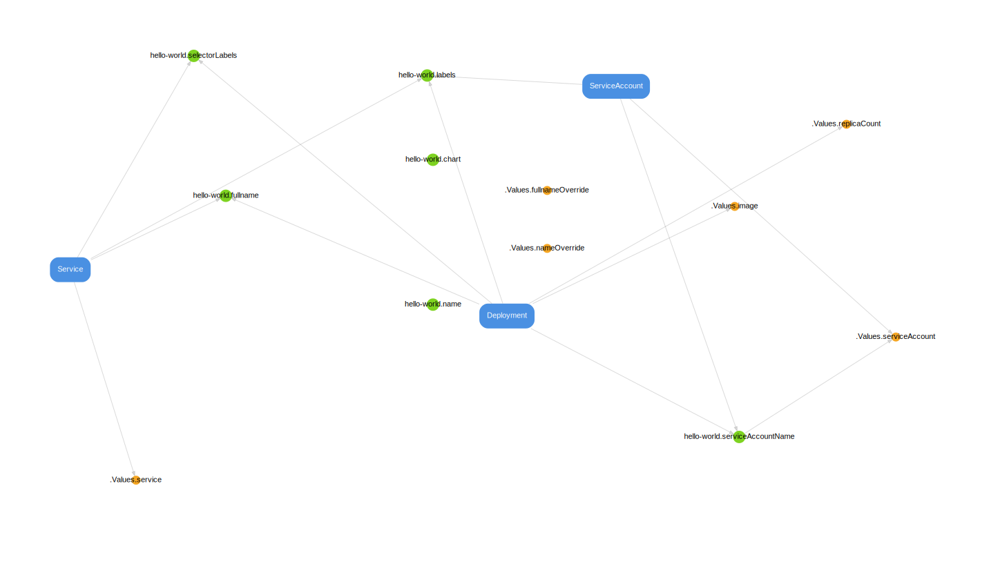
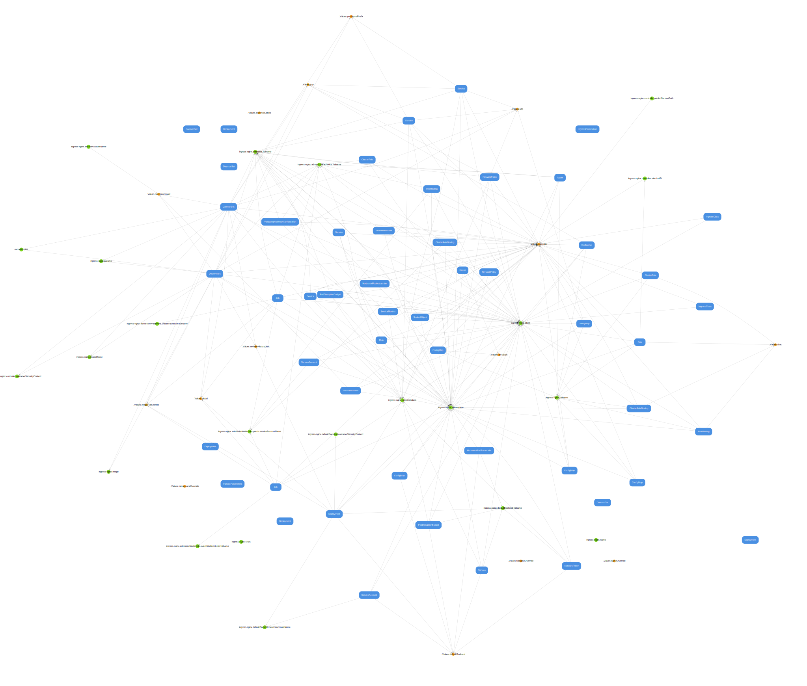
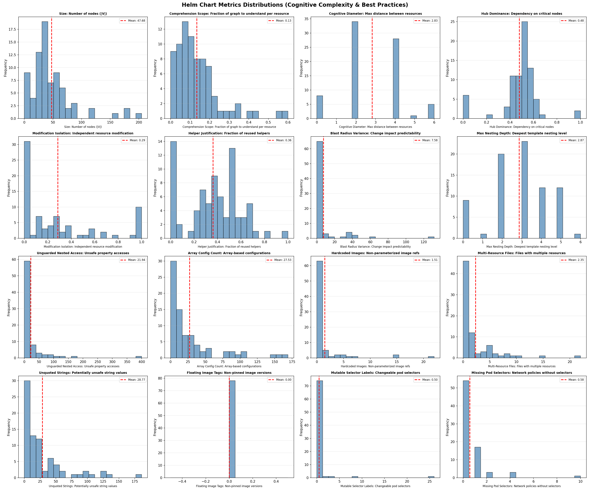

# Hell ou Helm : étude sur la complexité structurelle, cognitive et syntaxique des charts Helm.

## Auteurs
* AL Mounayar Mouhamad &lt;mouhamad.al-mounayar@etu.unice.fr&gt;
* Abi Habib Jim &lt;jim.abi-habib@etu.unice.fr&gt;
* Brunet Logan &lt;logan.brunet@etu.unice.fr&gt;
* Quelis Leo &lt;leo.quelis@etu.unice.fr&gt;

## I. Introduction
Kubernetes constitue aujourd'hui 92 % de la part de marché des outils servant à l'orchestration de conteneurs.

Le design de cet outil est basé sur des fichiers de configuration YAML statiques qui servent à définir de manière déclarative les différentes ressources à déployer. Ce choix trouve son origine dans la volonté des créateurs de Kubernetes de rendre le déploiement des ressources plus facile, en éliminant la nécessité de passer par un appel manuel à l'API de Kubernetes.

YAML fut la syntaxe choisie pour ces fichiers de configurations. Il possède, certes, des avantages : il est facile à utiliser, facile à lire (dans la plupart des cas) et, contrairement à un fichier JSON, il permet l'ajout de commentaires. Cependant, avec la naissance de répertoires contenant des centaines de fichiers de configuration, de nouveaux besoins émergent, notamment le besoin de réutiliser des configurations en changeant quelques paramètres (sans dupliquer ces fichiers), ainsi que le besoin de packager et versionner cet ensemble de fichiers pour faciliter la maintenance.

Helm est né afin de répondre à ces besoins émergents. Présenté comme le "gestionnaire de paquets" (package manager) pour Kubernetes, il s'appuie sur le système de templating de Go pour introduire une logique de réutilisation. En paramétrant les fichiers YAML, Helm permet de transformer des configurations statiques en modèles dynamiques et adaptables, facilitant ainsi la maintenance et le déploiement à grande échelle.

Cette étude vise à évaluer les promesses de Helm concernant la réduction de la complexité opérationnelle et la charge cognitive imposée à l'utilisateur. Si l'outil offre un avantage indéniable en matière de réutilisation, il introduit une couche de complexité supplémentaire : la gestion des dépendances.

Il est intuitif de considérer qu'avec des fichiers statiques, bien que nombreux, la compréhension d'une ressource est plus directe. L'utilisateur dispose de l'intégralité des informations nécessaires au sein d'un fichier unique. À l'inverse, avec Helm, cette unité d'information est fragmentée. Nous posons donc la question suivante :

**Quelle est la complexité structurelle réelle des charts Helm en pratique ?**

## II. Travaux Connexes
De nombreux travaux ont été menés sur la complexité des fichiers d'Infrastructure as Code (IaC), à l'instar de ceux de Rahman et al. (2019) ou de Zampetti et al. (2019). Toutefois, ces recherches se focalisent majoritairement sur l'aspect programmatique de ces langages, analysant des indicateurs tels que la complexité cyclomatique ou les *code smells* (défauts de conception) au sein des scripts.  

Bien que pertinents pour évaluer la qualité logicielle, ces travaux délaissent la complexité structurelle que nous souhaitons explorer. Pour évaluer cette complexité, nous nous sommes inspirés des travaux de Andaloussi et al. (2023), présentés dans leur article *"Complexity in declarative process models: Metrics and multi-modal assessment of cognitive load"*. Bien que leur étude porte sur les processus métiers déclaratifs, leur approche méthodologique est particulièrement transposable aux charts Helm. À l'instar de ces auteurs, nous utilisons des représentations sous forme de graphes pour modéliser les relations entre les ressources, les fichiers de valeurs et les templates.

## III. Un Chart Helm, Un Graphe
Nous proposons de modéliser un Helm chart sous forme de graphe de dépendances orienté. Ce graphe comporte trois types de nœuds :

- Les ressources Kubernetes (templates générant des objets avec `apiVersion` et `kind`).
- Les helpers (fonctions de template définies via `{{ define }}`).
- Les sections de valeurs (entrées de premier niveau dans `values.yaml`). 

Dans notre modèle, les arêtes représentent les relations de référencement entre ces éléments. L'intuition derrière cette modélisation est de capturer le degré d'indirection nécessaire à l'utilisateur pour appréhender l'état final d'une ressource. En effet, cette modélisation permet d'objectiver l'opacité structurelle de Helm, en transformant une sensation subjective de complexité en une distance topologique mesurable.

*Figure 1 : Représentation graphique du chart "Hello World" proposé par défaut par Helm.*

Ce chart déploie trois ressources : un Service, un Deployment et un ServiceAccount. Les nœuds en vert représentent les helpers, des fonctions qui génèrent des fragments de configuration selon une logique pouvant elle-même dépendre des valeurs définies dans le fichier values.yaml.

On observe d'abord que certains helpers comme `hello-world.labels` et `hello-world.selectorLabels` sont référencés par plusieurs ressources, ce qui suggère une réutilisation effective : leur existence en tant qu'abstraction se justifie par le fait qu'ils évitent la duplication de code à plusieurs endroits. En revanche, d'autres comme `hello-world.chart` apparaissent isolés, sans connexion visible vers les ressources, ce qui interroge leur justification. 

Un helper utilisé par une seule ressource, voire par aucune, n'apporte pas de bénéfice de factorisation et introduit un niveau d'indirection supplémentaire que le développeur doit traverser pour comprendre le chart. 

On remarque également que les ressources Service et Deployment partagent plusieurs dépendances communes, notamment `hello-world.fullname` et `hello-world.selectorLabels`. Ce partage a des implications directes sur la maintenance du chart : modifier le helper `hello-world.labels` pour ajouter un nouveau label affectera simultanément le Deployment, le Service et le ServiceAccount. Si cette propagation est parfois souhaitable (assurer la cohérence des labels à travers toutes les ressources), elle peut également introduire des effets de bord inattendus lorsque le développeur souhaite modifier le comportement d'une seule ressource.

Le rayon d'impact d'une modification dépend ainsi directement de la position du nœud modifié dans le graphe : une valeur comme `.Values.image` n'affecte que le Deployment, tandis qu'une modification de `.Values.serviceAccountName` se propage à travers `hello-world.serviceAccountName`, pour finalement toucher l'ensemble des ressources qui dépendent de ce dernier.

Cette organisation en couches (valeurs, helpers, ressources) constitue le fondement de l'architecture Helm et forme la base sur laquelle nous construisons nos métriques d'analyse.

Les graphes deviennent rapidement complexes pour des charts considérés comme modérés par l'industrie, comme le montre la Figure 2 représentant le chart ingress-nginx.

*Figure 2 : Graphe de dépendances du chart ingress-nginx.*

Ce chart est particulièrement intéressant car il est maintenu officiellement par la communauté Kubernetes et constitue l'une des solutions de référence pour exposer des services HTTP vers l'extérieur d'un cluster. À ce titre, il est raisonnable de supposer qu'il incarne les bonnes pratiques de structuration recommandées par l'écosystème Helm. Or, malgré la relative simplicité fonctionnelle de ce qu'il accomplit (déployer un contrôleur ingress et ses composants associés), le graphe de dépendances résultant révèle une structure dense et fortement interconnectée.

La lisibilité humaine atteint rapidement ses limites : identifier visuellement quelles ressources partagent des dépendances ou tracer le chemin d'une valeur jusqu'à son utilisation finale devient un exercice fastidieux.

Ce contraste entre la simplicité conceptuelle de la tâche ("je veux un ingress controller") et la complexité structurelle nécessaire pour l'exprimer en Helm suggère que cette dernière est un artefact de l'outil lui-même et non du problème associé. 

## IV. Sous Questions, Hypothèses et Métriques
Pour évaluer rigoureusement si les Helm charts dépassent les capacités cognitives humaines lors des tâches de maintenance, nous devons formuler des sous-questions précises et leur associer des métriques quantifiables. Nous structurons notre analyse autour de cinq scénarios d'usage représentatifs du quotidien d'un développeur : la découverte initiale d'un chart, l'ajout d'une nouvelle ressource, le débogage d'une erreur, le travail en équipe, et le respect des bonnes pratiques.

### La Découverte Initiale d'un Chart 
**SQ1: Dans quelle mesure un chart Helm est-il facile à comprendre pour un développeur qui le découvre pour la première fois ?**

Lorsqu'un développeur rejoint un projet ou doit intervenir sur un chart qu'il ne connaît pas, sa première tâche est de construire un modèle mental de la structure du chart. Cette sous-question évalue si cette découverte initiale peut se faire de manière progressive ou si elle nécessite d'appréhender l'ensemble du chart d'un seul bloc.

Trois métriques permettent de répondre à cette question :

Le **Size** compte le nombre total de nœuds dans le graphe. Les travaux fondateurs de Miller (1956) sur le "magical number seven" et leur raffinement par Cowan (2001) établissent que la mémoire de travail humaine peut maintenir simultanément 4 ± 1 éléments distincts. Des études empiriques sur la compréhension de code suggèrent qu'un développeur expérimenté peut manipuler efficacement des modules contenant jusqu'à 30 éléments interconnectés avant que la charge cognitive ne devienne prohibitive. Nous adoptons donc ce seuil de 30 nœuds comme limite au-delà de laquelle un chart ne peut plus être appréhendé globalement.

Le **Comprehension Scope** mesure, pour chaque ressource, la fraction du graphe qu'il faut parcourir pour comprendre l'ensemble de ses dépendances directes et transitives. Concrètement, cette métrique répond à la question : combien de helpers dois-je lire et combien de valeurs dois-je examiner pour comprendre ce que cette ressource va produire une fois rendue ? 
Nous fixons le seuil acceptable à 0.3 (30% du chart) en nous appuyant sur le principe de localité cognitive. Si comprendre l'état final d'une seule ressource nécessite d'examiner plus d'un tiers des helpers et des valeurs du chart, la charge cognitive devient disproportionnée par rapport à la tâche. 
Le développeur se retrouve à devoir assimiler une quantité significative de logique (conditionnels dans les helpers, valeurs par défaut, chaînes de substitution) avant même de pouvoir raisonner sur la ressource qui l'intéresse. 

Enfin, le **Cognitive Diameter** capture la distance maximale entre deux ressources dans le graphe. La recherche en navigation dans les graphes et en architecture logicielle suggère qu'au-delà de 3-4 niveaux d'indirection, la capacité humaine à maintenir le fil d'une chaîne de dépendances décroît significativement. Ce phénomène est analogue à la règle des "six degrés de séparation" mais appliqué à la compréhension de code. Chaque hop supplémentaire dans une chaîne de dépendances ajoute une charge cognitive et augmente le risque de perte de contexte. Un diamètre supérieur à 4 suggère que certaines paires de ressources sont si éloignées structurellement qu'un développeur ne peut pas raisonnablement anticiper leurs interactions.

**Hypothèse H1. Les Helm charts sont navigables de manière incrémentale. Un développeur peut comprendre une ressource sans devoir appréhender l'ensemble du chart au préalable.**  

Cette hypothèse sera validée si le Comprehension Scope moyen reste inférieur à 0.3 et si le Cognitive Diameter ne dépasse pas 4 hops.

###  L'Ajout d'une Nouvelle Ressource
**SQ2: Dans quelle mesure peut-on ajouter une nouvelle ressource à un chart Helm sans devoir comprendre l'ensemble du chart ni introduire d'effets de bord ?**

L'évolution d'un chart passe souvent par l'ajout de nouvelles ressources : un CronJob pour des tâches planifiées, un ConfigMap supplémentaire, ou un nouveau Service. Cette sous-question examine si un développeur peut effectuer cet ajout de manière ciblée, en ne touchant que les fichiers strictement nécessaires, ou s'il doit au contraire maîtriser l'ensemble du chart pour éviter d'introduire des régressions.

Le **Modification Isolation** quantifie directement cette capacité en mesurant, pour chaque ressource existante, la proportion d'autres ressources avec lesquelles elle ne partage aucune dépendance. Nous fixons le seuil acceptable à 0.7. En dessous de 0.7, le couplage devient suffisamment répandu pour que toute modification comporte un risque non négligeable d'effets de bord. 

Le **Hub Dominance** mesure la concentration des connexions dans les nœuds les plus connectés du graphe. Cette métrique complète cette analyse en révélant la structure sous-jacente qui cause le couplage. Une dominance élevée indique que les ressources partagent leurs dépendances non pas par accident, mais parce qu'elles convergent toutes vers les mêmes helpers centraux. Dans ce contexte, ajouter une nouvelle ressource "correctement" (c'est-à-dire en réutilisant les helpers existants) introduit mécaniquement un couplage avec toutes les ressources existantes qui utilisent ces mêmes helpers.  Le développeur fait alors face à un dilemme. Soit il réutilise les helpers standards et accepte le couplage, soit il crée ses propres helpers isolés et diverge des conventions du chart. Nous fixons le seuil d'alerte à 0.4 : au-delà, cette centralisation rend l'ajout isolé structurellement impossible sans violer les patterns établis.

**Hypothèse H2.** L'ajout d'une ressource à un chart existant peut se faire de manière isolée, sans introduire de couplage ni d'effets de bord. Cette hypothèse sera validée si le Modification Isolation moyen dépasse 0.7 et si le Hub Dominance reste inférieur à 0.4.

### Débogage
**SQ3 : Dans quelle mesure la structure d'un chart Helm facilite ou complique l'identification de l'origine d'une erreur et de sa propagation ?**

Le débogage d'un chart Helm survient généralement lorsqu'un déploiement échoue ou produit un comportement inattendu. Le développeur doit alors remonter de la manifestation de l'erreur (un pod qui ne démarre pas, un service inaccessible) jusqu'à sa cause racine dans les fichiers source. Cette sous-question évalue si la structure du chart facilite ou entrave ce processus de diagnostic.

Le **Cognitive Diameter** indique la distance maximale que le développeur pourrait devoir parcourir pour relier deux ressources potentiellement impliquées dans l'erreur. Comme discuté précédemment, un diamètre supérieur à 4 hops rend le traçage mental des dépendances difficile. 

Le **Blast Radius Variance** capture la prévisibilité de la propagation des erreurs en mesurant la variance du nombre de nœuds atteignables depuis chaque valeur. Nous fixons le seuil acceptable à 5, basé sur le principe que l'écart-type du rayon d'impact ne devrait pas dépasser 2-3 noeuds (variance de 5 à 9). Au-delà, certaines valeurs ont un impact dramatiquement plus large que d'autres, créant une asymétrie. Le développeur ne peut pas présumer que la modification d'une valeur aura un effet local sans vérification explicite.

Le **Hub Dominance** révèle un paradoxe dans le contexte du débogage. D'un côté, une dominance élevée peut faciliter la première étape du diagnostic : si quelque chose ne fonctionne pas, les helpers centraux (i.e. les hubs) sont les suspects les plus probables, offrant un point de départ évident pour l'investigation. Le développeur sait où chercher en premier. De l'autre côté, cette même centralisation complique la localisation précise de la cause racine : une erreur dans un hub se manifeste potentiellement dans de nombreuses ressources simultanément. Inversement, de nombreuses erreurs distinctes peuvent produire des symptômes similaires en convergeant vers les mêmes nœuds centraux.

Prenons un exemple concret. Un développeur constate que son Service Kubernetes ne route pas correctement le trafic vers ses pods. Le problème vient d'une incohérence entre les labels du selector du Service et ceux du Deployment. Dans un chart à forte Hub Dominance, ces deux ressources utilisent le même helper selectorLabels, ce qui oriente immédiatement le développeur vers ce fichier, c'est l'avantage de la centralisation. 

Cependant, une fois devant ce helper, plusieurs causes sont possibles : une faute de frappe dans la définition du helper lui-même, une valeur incorrecte dans `.Values.nameOverride` qui alimente le helper, ou encore une modification récente du helper ayant cassé la compatibilité avec l'une des ressources mais pas l'autre. Le développeur doit alors examiner toutes les ressources qui dépendent de ce hub pour comprendre laquelle a introduit le problème, et remonter toutes les valeurs qui l'alimentent pour identifier la source. Le hub devient un carrefour où convergent de multiples pistes, rendant le tri entre causes et symptômes plus difficile.

**Hypothèse H3.** La structure des Helm charts complique systématiquement le débogage en dispersant les causes d'erreurs à travers de nombreux fichiers.

Cette hypothèse sera validée si le Hub Dominance dépasse 0.4 (centralisation excessive créant des points de défaillance) combiné à une Blast Radius Variance supérieure à 5 (rendant l'impact des erreurs imprévisible).

### Collaboration

**SQ4 : Dans quelle mesure un chart Helm permet à plusieurs développeurs de travailler simultanément sans conflits ?**  

Dans un contexte d'équipe, plusieurs développeurs peuvent être amenés à modifier le même chart en parallèle. L'un ajuste la configuration du Deployment pendant qu'un autre modifie le Service. Cette sous-question évalue si la structure du chart permet ce travail concurrent ou si elle génère inévitablement des conflits.

Le **Modification Isolation** est ici la métrique centrale. Le seuil de 0.7 prend une signification particulière dans ce contexte : si deux développeurs choisissent chacun une ressource au hasard, la probabilité qu'ils n'aient aucune dépendance commune est approximativement le carré de l'isolation moyenne. Avec une isolation de 0.7, cette probabilité est d'environ 49%, soit une chance sur deux de travailler sans interférence. En dessous de 0.5, cette probabilité chute à 25 %, rendant les conflits plus probables que leur absence.

Le **Hub Dominance** aggrave ce phénomène. Si la majorité des modifications doivent transiter par quelques helpers centraux, ces fichiers deviennent des goulots d'étranglement où les contributions de différents développeurs entrent en collision.

**Hypothèse H4.** La structure des Helm charts décourage le travail parallèle car plusieurs développeurs travaillant sur des ressources différentes toucheront inévitablement aux mêmes fichiers partagés.

Cette hypothèse sera validée si le Modification Isolation moyen est inférieur à 0.5 et si le Hub Dominance dépasse 0.4, indiquant une centralisation excessive des dépendances.

### Respect des Bonnes Pratiques 
**SQ5: Dans quelle mesure les fichiers d'un chart Helm respectent-ils les bonnes pratiques syntaxiques de Helm ?**

La documentation officielle de Helm établit un ensemble de conventions destinées à améliorer la lisibilité, la robustesse et la maintenabilité des charts. Pour évaluer leur adoption, nous avons défini des métriques syntaxiques directement dérivées de ces recommandations, couvrant notamment la profondeur d'imbrication des structures, la protection des accès aux valeurs optionnelles, la configuration des images de conteneurs, l'organisation des ressources dans les fichiers, et la cohérence des selectors Kubernetes.

**Hypothèse H5.** Les Helm charts respectent globalement les bonnes pratiques syntaxiques recommandées par la documentation officielle.

Cette hypothèse sera validée si la majorité des charts analysés présentent un taux de conformité élevé sur l'ensemble de ces métriques.

| Scénario & Question de Recherche | Métrique (En gras = Partagée) | Seuil Critique / Cible | Interprétation pour l'Hypothèse |
| :--- | :--- | :--- | :--- |
| **SQ1: Découverte Initiale** *(Compréhension globale vs incrémentale)* | Size (Nodes) | > 30 nœuds | Limite de la mémoire de travail (chunking). |
| | Comprehension Scope | ≤ 0.3 (30%) | Seuil de localité cognitive (H1). |
| | **Cognitive Diameter** | ≤ 4 sauts | Capacité à suivre une chaîne de dépendances (H1). |
| **SQ2: Ajout d'une Ressource** *(Isolation et effets de bord)* | **Modification Isolation** | > 0.7 (70%) | Ajout possible sans risque de régression (H2). |
| | **Hub Dominance** | < 0.4 | Absence de centralisation bloquante (H2). |
| **SQ3: Débogage** *(Identification de la cause racine)* | **Cognitive Diameter** | > 4 sauts | Difficulté à tracer l'origine d'une erreur. |
| | Blast Radius Variance | > 5 | Imprévisibilité de la propagation des erreurs (H3). |
| | **Hub Dominance** | > 0.4 | Centralisation créant des "carrefours" de bugs (H3). |
| **SQ4: Collaboration** *(Travail parallèle en équipe)* | **Modification Isolation** | < 0.7 | Forte probabilité de conflits de fusion (Merge conflicts) (H4). |
| | **Hub Dominance** | > 0.4 | Goulot d'étranglement pour les contributions (H4). |
| **SQ5: Bonnes Pratiques** *(Qualité syntaxique)* | Métriques Syntaxiques | Taux de conformité élevé | Respect des standards officiels Helm (H5). |

## V. Méthodologie

L’étude s’appuie sur un corpus de 78 Helm Charts extraits de 30 dépôts GitHub publics, sélectionnés via Artifact Hub. Pour garantir la pertinence des analyses, chaque chart a été filtré selon des critères de complexité technique: un minimum de trois types d’objets Kubernetes, au moins 15 variables de configuration et l’usage de structures logiques (if, range).  

Le dataset est équilibré entre des Gold Standards (20 %, exemple : Prometheus), des projets Open Source matures (60 %) et des projets simples (20 %). Cette diversité permet de confronter les standards industriels à la réalité du terrain tout en assurant une base suffisante pour l'étude de la propagation des erreurs et des conflits de collaboration.  

Pour automatiser cette analyse, nous avons développé une suite logicielle intégrée.

1. **Moteur d'analyse (Rust).** Un outil performant chargé de la collecte des charts, de la construction des graphes de dépendance et du calcul des métriques structurelles.
2. **Module statistique (Python).** Un pipeline d'agrégation traitant les distributions de données et générant les visualisations statistiques nécessaires à la validation des hypothèses.
3. **Interface interactive (Angular).** Un tableau de bord permettant l'exploration visuelle des graphes individuels et la comparaison des métriques d'un chart par rapport à l'ensemble du dataset.

## VI. Résultats

Nous avons établi les distributions statistiques de chaque métrique sur l'intégralité du jeu de données (dataset). Nous avons trouver que le choix de nos seuils est validé par leur capacité à assurer une distinction nette au sein des distributions observées.

*Figure 3 : Distributions statistiques des métriques sur l'ensemble du jeu de données.*

### Retour sur les hypothèses

**SQ1 : Compréhension initiale. Hypothèse H1 partiellement validée**

Les résultats montrent que les Helm charts sont navigables de manière incrémentale, mais avec des réserves importantes. 
Le Comprehension Scope moyen de 0.13 est bien inférieur au seuil de 0.3, indiquant qu'un développeur n'a besoin de comprendre que 13 % du chart pour appréhender une ressource donnée. Une ressource typique ne dépend que d'une poignée de helpers et de valeurs, pas de l'ensemble du chart. Le Cognitive Diameter de 2.83 reste sous le seuil de 4 hops, confirmant une proximité structurelle entre ressources. Comprendre le Deployment aide à comprendre le Service car ils partagent des dépendances proches.

Cependant, le Size moyen de 47.68 nœuds dépasse significativement la limite cognitive de 30. Les charts sont localement compréhensibles mais globalement trop volumineux pour être appréhendés d'un seul tenant.

**SQ2 : Ajout de ressource. Hypothèse H2 infirmée**

L'ajout isolé de ressources s'avère structurellement difficile. Le Modification Isolation moyen de 0.29 est très inférieur au seuil de 0.7. En moyenne, une ressource partage des dépendances avec 71 % des autres ressources.

Le Hub Dominance de 0.48 confirme cette centralisation excessive : près de la moitié des connexions passent par quelques helpers centraux. Ajouter une nouvelle ressource en respectant les conventions du chart (réutilisation des helpers existants) introduit mécaniquement un couplage avec l'ensemble des ressources existantes qui utilisent ces mêmes helpers.

Le paradoxe encapsulation-isolation émerge ici clairement. Comment un chart peut-il avoir un Comprehension Scope faible (0.13, chaque ressource ne "voit" que 13 % du graphe) et simultanément un Modification Isolation faible (0.29, chaque ressource partage des dépendances avec 71 % des autres) ? La réponse réside dans la structure hub-and-spoke. Chaque ressource dépend d'un petit nombre de helpers (d'où le scope faible), mais ces helpers sont les mêmes pour toutes les ressources.

Chaque ressource a peu de dépendances (scope faible), mais elles pointent toutes vers le même noyau central (isolation faible). Le développeur peut comprendre une ressource en isolation, mais dès qu'il modifie l'un de ces helpers, il affecte toutes les ressources qui en dépendent. L'encapsulation cognitive (ce que je dois comprendre) est bonne, mais l'encapsulation fonctionnelle (ce que je risque d'affecter) est mauvaise.

**SQ3 : Débogage. Hypothèse H3 partiellement validée**

Le débogage présente un tableau contrasté. Le Cognitive Diameter faible (2.83) facilite le traçage des dépendances. La cause d'une erreur n'est jamais très éloignée de sa manifestation, généralement à 2 ou 3 hops maximum. Un développeur qui constate un problème sur un Service peut raisonnablement explorer ses dépendances immédiates sans se perdre dans une chaîne interminable.

Cependant, le Hub Dominance de 0.48 crée le paradoxe décrit précédemment : les hubs sont des suspects évidents (facilitant l'étape « où chercher ? ») mais aussi des carrefours où de multiples causes se superposent (compliquant l'étape « quoi chercher ? »). La Blast Radius Variance de 7.58, supérieure au seuil de 5, amplifie cette difficulté. Le développeur ne peut pas savoir a priori si la valeur qu'il examine appartient à la première ou à la seconde catégorie.

La structure ne disperse donc pas les erreurs à travers de nombreux fichiers éloignés, mais les entremêle dans des points centraux où la discrimination entre cause et symptôme devient difficile.

**SQ4 : Travail parallèle. Hypothèse H4 validée**

Les résultats confirment que la structure des Helm charts décourage le travail parallèle. Avec un Modification Isolation de 0.29, deux développeurs choisissant chacun une ressource au hasard vont toucher aux mêmes helpers partagés.

Le Hub Dominance de 0.48 aggrave cette situation : les helpers centraux comme `labels` ou `fullname` constituent des points de passage quasi obligés que toute modification significative devra traverser.

**SQ5 : Bonnes Pratiques. Hypothèse H5 infirmée**

L'analyse de la SQ5 infirme l'hypothèse H5 en révélant un décalage critique entre les standards officiels et les pratiques réelles. Le Helper Justification Ratio (0,36) montre que 64 % des abstractions ne sont jamais réutilisées, créant une indirection inutile qui complexifie le chart sans bénéfice de factorisation.

La robustesse est également sacrifiée. Avec plus de 21 accès non protégés par chart, le code est vulnérable au moindre manque dans le fichier de valeurs. Si les aspects opérationnels (images, sélecteurs) sont maîtrisés, l'organisation structurelle reste désordonnée (multiples ressources par fichier) et le templating manque de rigueur défensive. En résumé, les développeurs privilégient la fonctionnalité immédiate au détriment de la qualité logicielle et de la maintenabilité à long terme.

### Le Chart Moyen et Le Chart Idéal

L'analyse agrégée du jeu de données permet de dessiner le profil du « Chart Moyen » (Figure 4), dont la structure se caractérise par une forme de sablier composée d'environ 48 nœuds. En amont, on observe une large couche de Values, dont une part significative reste inutilisée, créant un bruit informationnel dès l'entrée du graphe. Cette configuration converge ensuite vers un goulot d'étranglement structurel constitué d'une dizaine de helpers. Ce nœud central est particulièrement rigide. Il se divise entre 3 et 4 "hubs" hautement connectés (assurant la cohérence globale comme les labels ou les noms) et 6 ou 7 fonctions à usage unique qui ajoutent de l'indirection sans bénéfice de mutualisation. Enfin, le graphe s'évase sur 5 à 8 ressources Kubernetes qui, bien que distinctes, se retrouvent systématiquement couplées entre elles par leur dépendance commune aux mêmes hubs centraux.

*Figure 4 : Structure type du "Chart Moyen" en forme de sablier.*

Le chart idéal (Figure 5) privilégie une **architecture en couches localisées** qui substitue le modèle monolithique actuel par une structure segmentée et modulaire. Contrairement au "Chart Moyen" en forme de sablier où les ressources sont couplées par des hubs centraux, le modèle idéal organise les valeurs par objet (exemple : `.Values.Service`, `.Values.Deployment`) pour rendre l'impact des modifications explicite et isolé. Les helpers y sont stratifiés : un socle minimal gère les éléments transversaux communs, tandis que des extensions spécifiques permettent de personnaliser chaque ressource sans affecter les autres. En limitant strictement la taille du graphe à 30 nœuds et en supprimant les abstractions injustifiées, cette approche garantit une compréhension incrémentale tout en préservant une isolation élevée des modifications.

*Figure 5 : Architecture en couches localisées du chart idéal.*

## VII. Conclusion
Cette étude a proposé une approche empirique pour évaluer la complexité cognitive des Helm charts à travers une modélisation en graphe de dépendances et un ensemble de sept métriques quantifiables. L'analyse de 78 charts révèle un paradoxe central. Les Helm charts sont faciles à lire mais difficiles à modifier. Les métriques de compréhension (Comprehension Scope = 0.13, Cognitive Diameter = 2.83) indiquent que les développeurs peuvent naviguer les charts de manière incrémentale, mais les métriques de maintenance (Modification Isolation = 0.29, Hub Dominance = 0.48, Helper Justification = 0.36) démontrent que cette lisibilité ne se traduit pas en maintenabilité. La structure hub-and-spoke, omniprésente dans les charts analysés, concentre les dépendances dans quelques helpers centraux qui deviennent simultanément des points d'entrée pour la compréhension et des goulots d'étranglement pour la modification.

Ces résultats suggèrent que Helm ne réduit pas la complexité de la configuration Kubernetes mais la redistribue. La duplication syntaxique du YAML brut cède la place à un couplage sémantique à travers des abstractions partagées. Cette redistribution peut être acceptable pour des charts stables et mono-développeur, mais devient problématique pour des projets en évolution active maintenus par des équipes.

### Contributions pratiques
Au-delà de l'analyse, l'outillage développé dans le cadre de cette étude constitue une contribution pratique pour la communauté. Le pipeline de parsing et de construction de graphes, ainsi que le calcul automatisé des métriques, peuvent être utilisés par les développeurs pour évaluer et améliorer la structure de leurs propres charts. En visualisant le graphe de dépendances et en identifiant les métriques problématiques (helpers non justifiés, isolation faible, hubs excessifs), un développeur peut cibler ses efforts de refactoring sur les points de friction réels plutôt que de procéder à l'aveugle. Cet outillage pourrait également être intégré dans des pipelines CI/CD pour surveiller l'évolution de la complexité au fil des commits et alerter lorsque des seuils critiques sont dépassés.

### Limites
Plusieurs limites doivent être prises en compte dans l'interprétation de ces résultats.

Premièrement, notre métrique de Hub Dominance traite tous les hubs de manière équivalente, sans distinguer leur nature sémantique. Or, une valeur globale comme `.Values.commonLabels` qui alimente l'ensemble des ressources n'est pas nécessairement problématique. C'est précisément son rôle d'être partagée et un développeur s'attend à ce qu'elle affecte tout le chart.

Deuxièmement, nos seuils sont dérivés de la littérature cognitive et des principes du génie logiciel, mais ils n'ont pas été validés empiriquement sur des développeurs travaillant avec des Helm charts. Une étude utilisateur mesurant le temps de compréhension, le taux d'erreurs ou la confiance perçue en fonction de nos métriques permettrait de calibrer ces seuils avec des données comportementales réelles.

Troisièmement, notre échantillon de 78 charts, bien que diversifié, peut ne pas être représentatif de l'ensemble de l'écosystème Helm. L'élargissement du dataset et la stratification par domaine (infrastructure, applications métier, outils) permettraient de nuancer nos conclusions.

### Perspectives 
Malgré ces limites, cette étude pose les bases d'une évaluation objective de la complexité des Helm charts. Les métriques proposées peuvent être intégrées dans des outils de linting pour alerter les développeurs en amont, ou servir de critères lors des revues de code. Plus largement, l'approche de modélisation en graphe est transposable à d'autres systèmes de templating (Kustomize, Jsonnet) pour une comparaison inter-outils de la complexité cognitive induite.

## Références

1. **Cowan, N.** (2001). The magical number 4 in short-term memory: A reconsideration of mental storage capacity. *Behavioral and Brain Sciences*, 24(1), 87-114.

2. **Miller, G. A.** (1956). The magical number seven, plus or minus two: Some limits on our capacity for processing information. *Psychological Review*, 63(2), 81-97.

3. **Rahman, A., Parnin, C., & Williams, L.** (2019). The Seven Sins: Security Smells in Infrastructure as Code Scripts. *Proceedings of the 41st International Conference on Software Engineering (ICSE)*, 164-175.

4. **Zampetti, F., Noiseux, C., Antoniol, G., Khomh, F., & Di Penta, M.** (2019). An empirical characterization of bad practices in continuous integration. *Empirical Software Engineering*, 25, 1095-1135.

5. **Andaloussi, A. A., Burattin, A., Slaats, T., Kindler, E., & Weber, B.** (2023). Complexity in declarative process models: Metrics and multi-modal assessment of cognitive load. *Expert Systems with Applications*, 233, 120924.

