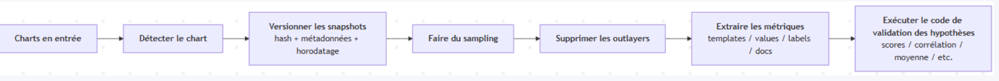
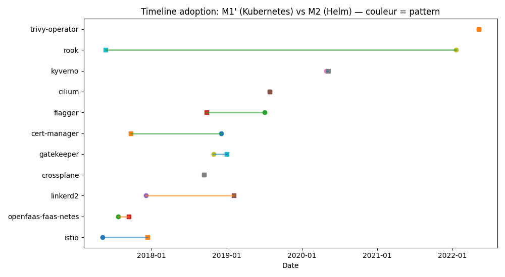
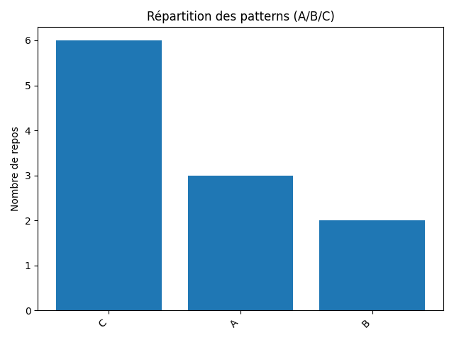
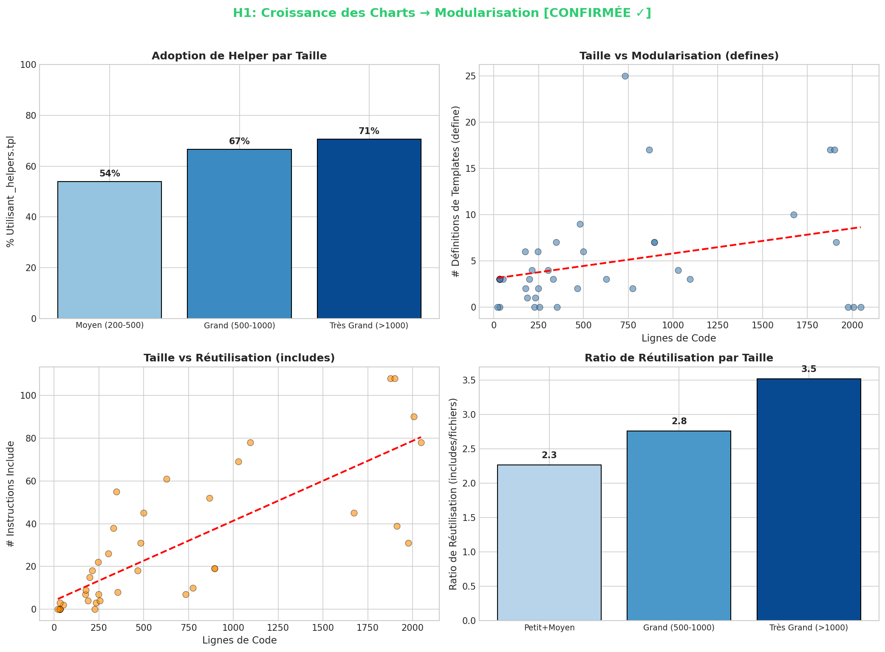
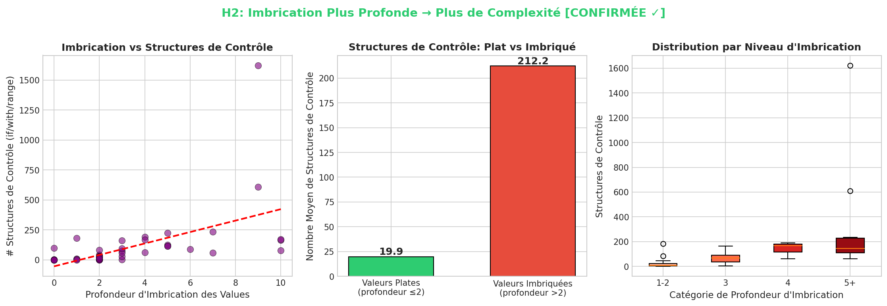
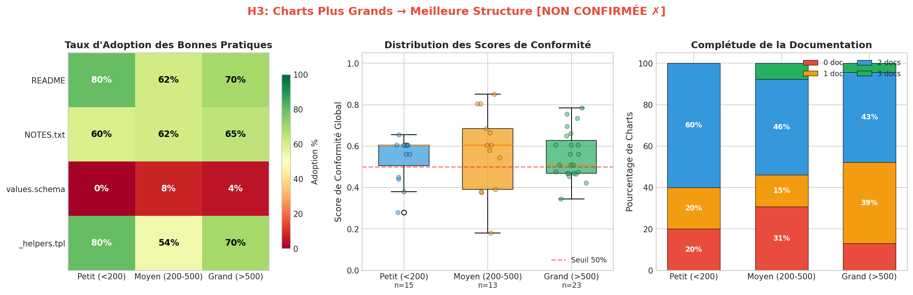
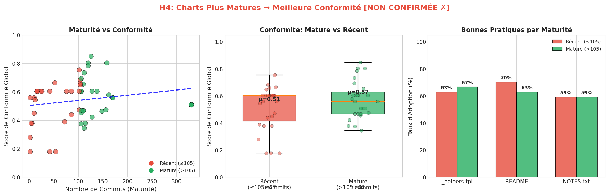
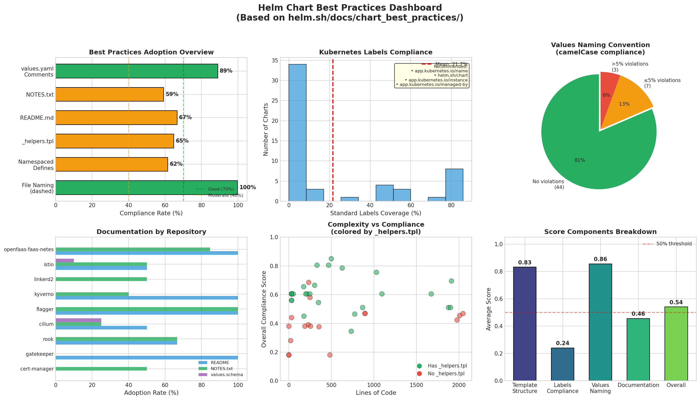

**_30 Janvier 2026_**

## Auteurs

Ce chapitre a été rédigé par quatre étudiants en dernière année du cursus Informatique à Polytech Nice Sophia, spécialisation Sustainable Software Engineering (SSE) :
- Sarra NAJAR — <sarra.najar1@etu.univ-cotedazur.fr>
- Walid EL AJI — <walid.el-aji@etu.univ-cotedazur.fr>
- Abderrahmen TLILI — <abderrahmen-errached.tlili@etu.univ-cotedazur.fr>
- Omar AMAADOR — <omar.amaador@etu.univ-cotedazur.fr>
## I. Projet et contexte de recherche

Avec l’essor du cloud, Kubernetes est devenu un outil central pour orchestrer des applications conteneurisées, en particulier dans les projets open-source où la portabilité, la reproductibilité et l’automatisation des déploiements sont des objectifs importants. Cependant, la configuration de Kubernetes repose souvent sur un grand nombre de fichiers YAML, dont la structure et la maintenance peuvent devenir plus difficiles à mesure que le projet évolue.

Dans ce contexte, Helm est fréquemment utilisé pour structurer ces déploiements sous forme de charts, en introduisant une logique de packaging, de templating et de paramétrisation. L’étude de Helm dans des dépôts open-source permet d’observer des approches variées, selon le moment d’adoption et la manière dont les charts sont organisés et maintenus dans le temps.

Ce projet s’intéresse donc à la manière dont Helm est utilisé dans des projets open-source, ainsi qu’à l’évolution des charts au fil des versions. Une des finalités qui nous motive est de mieux comprendre dans quelles situations Helm constitue un choix pertinent pour structurer un déploiement Kubernetes, et comment les pratiques associées évoluent avec la maturité du projet.


## II. Observations/Question Génerale
À partir de nos premières observations et de nos connaissances initiales, Helm apparaît comme un outil fréquemment utilisé pour structurer des déploiements Kubernetes dans des projets open-source, avec des modalités d’intégration et des niveaux d’usage variables selon les dépôts. Nous formulons ainsi la question générale suivante : **que change l’adoption de Helm dans un projet open-source, et comment l’évolution des charts influence-t-elle l’alignement avec les bonnes pratiques ?**

Pour répondre à cette question, nous adoptons une démarche exploratoire fondée sur l’analyse de projets open-source réels. Notre étude s’organise autour de deux axes :
- **(1)** la dynamique d’adoption de Helm, en cherchant à identifier ce qui existait avant son introduction (manifestes Kubernetes bruts, Kustomize, etc.) ainsi que les éventuelles évolutions de l’organisation du dépôt .
- **(2)** l’évolution des charts dans le temps, en observant comment leur croissance en fonctionnalités et en complexité se traduit au regard des bonnes pratiques officielles en suivant une demarche scientifique.


## III. Cadre d’analyse : sources, données et stratégie

### 1) Limitation de la zone de recherche (via des répertoires GitHub)

Notre étude se limite à des projets open-source hébergés sur GitHub, sélectionnés de manière à disposer d’un historique de développement exploitable et d’un usage explicite de Helm. Nous retenons uniquement les projets dont les charts Helm sont **présents dans le dépôt principal**, et non dans un repository séparé. Ce choix permet d’observer l’évolution des charts dans le même contexte que l’évolution du projet (organisation du dépôt, changements fonctionnels, releases).
#### 1.1 Les projets étudiés pour la premiére sous question 

Les **11 dépôts étudiés pour l'adoption de Helm** sont les suivants :
- `linkerd2`  https://github.com/linkerd/linkerd2.git  
- `cilium`  https://github.com/cilium/cilium.git  
- `crossplane`  https://github.com/crossplane/crossplane.git  
- `istio`  https://github.com/istio/istio.git  
- `gatekeeper`  https://github.com/open-policy-agent/gatekeeper.git  
- `rook`  https://github.com/rook/rook.git  
- `kyverno`  https://github.com/kyverno/kyverno.git  
- `flagger`  https://github.com/fluxcd/flagger.git  
- `cert-manager`  https://github.com/cert-manager/cert-manager.git  
- `trivy-operator`  https://github.com/aquasecurity/trivy-operator.git  
- `openfaas-faas-netes`  https://github.com/openfaas/faas-netes.git  
#### 1.2 Les projets étudiés pour la deuxime sous question 
En complément, nous exploitons un panel de plus de 50 charts parmi les plus populaires disponibles sur Artifact Hub (https://artifacthub.io/)
, une plateforme de référence pour la publication et la découverte de charts Helm utilisés dans des environnements Kubernetes. Une part importante de ces charts est liée à la CNCF (Cloud Native Computing Foundation), organisation qui regroupe et soutient de nombreux projets open-source majeurs du cloud-native (outillage Kubernetes, observabilité, sécurité, réseau, etc.).
Parmi les 72 dépôts analysés, voici quelques exemples représentatifs :

| Dépôt | Charts | Description |
|-------|--------|-------------|
| istio | 10 | Service mesh |
| openfaas-faas-netes | 13 | Serverless functions |
| linkerd2 | 8 | Service mesh |
| kyverno | 4 | Policy engine |
| cilium | 4 | eBPF networking |
| flagger | 3 | Progressive delivery |
| rook | 3 | Storage orchestration |
| cert-manager | 2 | Certificate management |
| crossplane | 1 | Infrastructure as code |
| gatekeeper | 1 | Policy controller |
| trivy-operator | 1 | Security scanning |

Ce choix permet de travailler sur un corpus composé de projets largement diffusés et activement maintenus, avec des pratiques de déploiement documentées et comparables. Il constitue ainsi un point d’appui pertinent pour observer des tendances d’usage de Helm et confronter l’évolution des charts à des recommandations considérées comme représentatives de l’écosystème cloud-native.


### 2) Métriques utilisées

Les métriques retenues dans cette étude ont été choisies afin de caractériser l’adoption de Kubernetes et de Helm de manière **mesurable** et **reproductible** à partir de l’historique Git. Elles permettent de situer l’introduction de Helm dans le cycle de vie du projet, puis d’estimer l’intensité de son usage dans le temps.

Les métriques utilisées sont les suivantes :

**M1 (Kubernetes)** : premier commit introduisant un manifeste Kubernetes “réel”  
(fichier YAML contenant `apiVersion` et `kind`, en excluant si possible `vendor/`, `tests/`, `docs/`).  

**M2 (Helm)** : premier commit introduisant un chart **_Helm_**  
(détection via la présence de `Chart.yaml`).  

**M3 :** : différence en jours entre l’introduction de Helm et celle de Kubernetes  
`M3 = date(M2) - date(M1)`  
→ permet de positionner Helm par rapport à Kubernetes dans l’historique du projet.

**Critère qualitatif** : classification du premier manifeste Kubernetes identifié  
(ex. installation, démonstration, test, exemple), selon le chemin du fichier et certains éléments du contenu, afin de limiter le bruit dans l’interprétation.


### 3) Outils

L’analyse repose sur une combinaison d’outils standards pour l’extraction et la validation des charts Helm :
- **Git** : exploration de l’historique (commits, tags, snapshots, comparaison avant/après adoption)
- **Scripts d’extraction / analyse** : Une partie de notre étude repose sur une analyse automatisée des charts Helm, réalisée via des scripts qui extraient des métriques de structure et de complexité à partir des fichiers du chart (notamment `values.yaml` et le dossier `templates/`). L’objectif est de produire des indicateurs quantifiables et comparables entre projets.Ces scripts permettent notamment :
     - de mesurer la **taille du chart** (ex. nombre de lignes de code / volume global),
     - de détecter des éléments de **modularisation** dans les templates (ex. nombre de `define` / helpers),
     - d’évaluer la **réutilisation** de templates via des appels `include`,
     - d’analyser la **structure des valeurs** (profondeur d’imbrication dans `values.yaml`),
     - de compter les **structures de contrôle** dans les templates (ex. `if`, `with`, `range`), afin d’estimer le niveau de complexité logique.

### 4) Méthodologies
Notre méthodologie combine une **analyse manuelle** et une **analyse automatisée**, en fonction des objectifs de chaque axe.


#### A. Analyse manuelle : Lever l'ambiguïté de l'adoption
Le choix d'une analyse manuelle pour la **dynamique d'adoption** est une nécessité technique. Les dépôts Git présentent souvent un "bruit" historique (migrations de CI, renommages de dossiers, commits de fusion) qu'un script automatisé ne peut interpréter avec certitude. L'intervention manuelle permet de :
* **Isoler le point de bascule réel** : Identifier le moment où Helm devient un choix structurel, en le distinguant des tests isolés ou des fichiers d'exemple.
* **Interpréter le contexte hybride** : Analyser comment Helm a supplanté ou complété les méthodes précédentes (YAML statique, Kustomize).
* **Valider la causalité** : Corréler l'introduction de Helm avec les réorganisations du dépôt grâce à la lecture des messages de commit et des Pull Requests.

#### B. Analyse automatisée : Mesurer la complexité à l'échelle
L’analyse automatisée est appliquée pour extraire des indicateurs **quantitatifs et reproductibles**. 
#### - Stratégie d'échantillonnage

Pour gérer la volumétrie des données tout en préservant la représentativité temporelle, nous avons mis en place une stratégie d'échantillonnage systématique :

#### Paramètres d'échantillonnage

| Paramètre | Valeur | Justification |
|-----------|--------|---------------|
| **Seuil d'échantillonnage** | 100 commits | Charts avec ≤100 commits : analyse complète |
| **Taux d'échantillonnage** | `len(commits) // 75` | Vise ~50-100 points par chart |
| **Commits obligatoires** | Premier + Dernier | Garantit la couverture temporelle complète |

#### Algorithme d'échantillonnage

```python
SAMPLING_THRESHOLD = 100

if len(commits) > SAMPLING_THRESHOLD:
    # Échantillonnage régulier pour obtenir ~50-100 points
    rate = len(commits) // 75
    sampled = commits[::rate]
    
    # Garantir premier et dernier commit inclus
    if commits[0] not in sampled:
        sampled.insert(0, commits[0])
    if commits[-1] not in sampled:
        sampled.append(commits[-1])
    
    commits = sorted(sampled, key=lambda c: c['date'])
```
#### Justification de l'approche

1. **Échantillonnage uniforme** : Sélection de 1 commit tous les N commits pour représenter uniformément l'évolution temporelle
2. **Bornes garanties** : Premier et dernier commits toujours inclus pour capturer l'état initial et final
3. **Seuil adaptatif** : Charts avec peu de commits (≤100) analysés intégralement, échantillonnage uniquement pour les très actifs
4. **Reproductibilité** : Algorithme déterministe basé sur l'index, pas de randomisation
#### - Scripts d'analyse
L’analyse repose sur une chaîne de scripts Python permettant d’extraire automatiquement des métriques structurelles et de complexité à partir de l’historique Git des charts Helm, puis de valider statistiquement les hypothèses formulées.

-`mine_fresh.py` : Ce script parcourt l'historique Git de chaque dépôt et extrait les métriques suivantes pour chaque commit touchant un chart (template_lines, template_files, has_helpers ,template_definitions , includes, values_nesting,control_structures, labels_compliance)

-`best_practices.py`  Règles de conformité:
Définit les règles de scoring pour évaluer la conformité aux bonnes pratiques .

-`validate_hypotheses.py`  Validation statistique :
Ce script charge les données et effectue :
- Tests de corrélation de Spearman (non-paramétrique)
- Tests de Mann-Whitney U pour comparaisons de groupes
- Génération des visualisations pour chaque hypothèse

-`generate_french_plots.py` : Génère les graphiques en français pour la présentation.

Ces scripts couvrent l’extraction des métriques (templates, values, modularisation), l’évaluation de la conformité aux bonnes pratiques Helm, ainsi que l’application de tests statistiques non paramétriques et la génération des visualisations associées.

Le détail de l’implémentation, des scripts et des fichiers de données est disponible dans le dossier `assets`.
## IV. Hypothèses et protocole expérimental
### 1) Dynamique d'Adoption (Analyse Manuelle)

Cet axe se concentre sur le "quand" et le "comment" de l'apparition de Helm.

#### A. Hypothèses
* **Hypothèse 1.1 (Seuil de complexité) :** L’adoption de Helm survient lorsqu'un projet franchit un seuil de complexité où la maintenance de manifests YAML statiques devient ingérable (besoin de factorisation).
* **Hypothèse 1.2 (Standardisation) :** Pour les projets "Kubernetes-native", Helm est adopté dès l'origine (J0) comme socle de distribution indispensable, et non comme une migration ultérieure.

#### B. Expérimentations et mesures
Afin de valider ces hypothèses, nous utilisons les métriques **M1, M2 et M3** (définies en section III) pour identifier le "point de bascule" dans l'historique Git. 
### 2)Évolution et Bonnes Pratiques (Analyse Automatisée)

Cet axe analyse la corrélation entre la croissance technique des charts et l'application des standards de développement officiels de Helm.L'analyse porte sur 6 376 commits

#### A. Hypothèses et métriques de qualité
Nous avons défini quatre hypothèses basées sur les piliers des "Best Practices" de Helm :

| Hypothèse | Idée directrice | Pratique cible | Indicateurs mesurés |
| :--- | :--- | :--- | :--- |
| **H1** | Croissance $\rightarrow$ Modularisation | **Templates** | Usage de `_helpers.tpl`, appels `include` et `define`. |
| **H2** | Données complexes $\rightarrow$ Logique | **Values** | Profondeur du `values.yaml`, structures `if/range/with`. |
| **H3** | Taille $\rightarrow$ Qualité | **Labels** | Présence de labels standards et richesse des métadonnées. |
| **H4** | Maturité $\rightarrow$ Conformité | **Conventions** | Usage de `values.schema.json`, hooks et library charts. |

### H1 :
> À mesure que les charts Helm grandissent en taille (lignes de code), les développeurs adoptent de plus en plus des patterns de modularisation comme les fichiers `_helpers.tpl` et la réutilisation de templates via `{{ include }}` et `{{ define }}`.

### Justification
Le Guide des Bonnes Pratiques Helm recommande :
- Utiliser `_helpers.tpl` pour les définitions de templates réutilisables
- Namespacer tous les templates définis
- Éviter la duplication de code via `{{ include }}`
### H2 :
> Les charts avec une imbrication plus profonde dans `values.yaml` nécessitent plus de structures de contrôle (`if`, `range`, `with`) dans les templates pour gérer la configuration imbriquée.

### Justification
Le Guide des Bonnes Pratiques Helm note :
- "Dans la plupart des cas, une structure plate devrait être préférée à une structure imbriquée"
- "Pour chaque niveau d'imbrication, une vérification d'existence doit être faite"
### H3 :
> Les charts plus grands et plus complexes suivent de meilleures pratiques de structure (documentation, organisation, labels standards) car ils reçoivent plus d'attention de développement.

### H4 :
> Les charts avec un historique de développement plus long (plus de commits) suivent de meilleures pratiques grâce aux améliorations et refactorisations accumulées au fil du temps.


### Justification
Le Guide des Bonnes Pratiques Helm recommande :
- Utiliser `_helpers.tpl` pour les définitions de templates réutilisables
- Namespacer tous les templates définis
- Éviter la duplication de code via `{{ include }}`
#### B. Expérimentations et mesures
Cet axe s'appuie sur nos scripts pour quantifier la complexité logique via le comptage des structures de contrôle et la détection d'artefacts de qualité (schémas, helpers).
Pour valider ces hypothèses nous avons mis en place la pipeline de traitement suivante :
<p align="center">

</p>

##  V. Analyse des résultats et conclusion

### 1. Analyse des résultats  Dynamique d’adoption de Helm


### 1.1 Résultat global : absence d’un schéma d’adoption unique
<p align="center">

</p>

L’analyse conjointe des timelines M1/M2 met en évidence qu’il n’existe **pas de trajectoire unique** d’adoption de Helm dans les projets Kubernetes open-source.  
Au contraire, les projets suivent des **logiques d’adoption distinctes**, fortement dépendantes :
- de la nature du projet (application, extension Kubernetes, outil plateforme),
- du rôle de Kubernetes dans l’architecture (support, mécanisme d’installation, API produit),
- et du public cible (utilisateurs finaux, opérateurs, équipes plateforme).

À partir de ces observations, trois **patterns temporels d’adoption** ont été identifiés.

### 1.2 Pattern A  Helm arrive tardivement (migration)

Le **pattern A** correspond aux projets où Kubernetes est utilisé **longuement** via des manifests YAML statiques avant l’introduction de Helm.  
Dans ce cas, le décalage temporel **M3 est important**, indiquant une adoption tardive de Helm.

Ces projets s’appuient initialement sur des manifests Kubernetes maintenus manuellement comme mécanisme principal d’installation. Helm est introduit ultérieurement dans une logique de **migration**, principalement motivée par des enjeux de :
- maintenabilité,
- réduction de duplication,
- gestion des variations (versions Kubernetes, options de configuration).

--> Dans ce pattern, Helm apparaît comme une **réponse à une dette technique** liée à la croissance du nombre de manifests et à la complexification des scénarios d’installation.  
L’adoption de Helm n’est pas fondatrice, mais corrective : elle vise à rationaliser un existant devenu difficile à maintenir.

**Exemples observés.**  
Des projets comme *Cilium* ou *Rook* illustrent cette trajectoire, avec une longue phase basée sur des YAML Kubernetes bruts avant une migration explicite vers Helm.


### 1.3 Pattern B  Helm comme premier mécanisme d’installation structuré

Le **pattern B** correspond aux projets dans lesquels Kubernetes est déjà présent dans le dépôt,
mais sans constituer une véritable solution d’installation pour les utilisateurs.
Les premiers fichiers Kubernetes observés sont principalement utilisés à des fins de
**démonstration, d’exemple ou de test**, et ne représentent pas un mode de déploiement
officiel ou maintenu.

Dans ce contexte, l’introduction de Helm marque un **changement de statut** du projet.
Helm devient le **premier mécanisme d’installation structuré**, en fournissant :
- une méthode d’installation claire et reproductible,
- un ensemble cohérent de ressources Kubernetes,
- un point central de configuration via `values.yaml`.

Même lorsque le décalage temporel entre l’apparition de Kubernetes (M1) et celle de Helm (M2)
est faible, le rôle de Kubernetes avant Helm reste qualitativement différent :
Kubernetes est utilisé comme **environnement d’expérimentation (test)**, et non comme
canal d’installation destiné aux utilisateurs finaux.

--> Dans ce pattern, Helm ne remplace pas une solution d’installation existante.
Il constitue au contraire la **première version stable et maintenable** du déploiement,
marquant le passage d’un projet expérimental à un projet **orienté utilisateurs**.

**Exemples observés.**  
Ce type de trajectoire est notamment observé dans des projets comme *Linkerd2* ou *Istio*,
où Helm devient le premier outil d’installation sérieux, souvent intégré à une interface
en ligne de commande (CLI).

### 1.4 Pattern C  Helm dès le départ (approche multi-modale)

Le **pattern C** correspond aux projets où Kubernetes et Helm sont introduits **simultanément**, dès les premiers commits significatifs.  
Dans ce cas, le décalage M3 est nul ou quasi nul.

Ces projets sont généralement Kubernetes-native : Kubernetes n’est pas seulement un support d’exécution, mais le cœur du produit, souvent via des **CRDs**.  
Helm n’est pas conçu pour remplacer les manifests Kubernetes, mais pour **coexister** avec eux.

--> Helm est utilisé comme un **outil de bootstrap et de configuration**, tandis que les manifests Kubernetes bruts restent indispensables pour la définition des ressources métier, l’audit ou l’intégration GitOps.  
Cette approche multi-modale reflète une maturité initiale élevée et des exigences fortes en matière de contrôle.

**Exemples observés.**  
Des projets comme *Crossplane* ou *Trivy Operator* adoptent dès l’origine plusieurs voies d’installation : Helm, manifests statiques et parfois Kustomize.
### 1.5 Répartition des patterns et résultat clé
<p align="center">
     
</p>

La répartition des projets étudiés montre que :
- le **pattern C** est majoritaire,
- le **pattern A** est fréquent,
- le **pattern B** est minoritaire.

Ce résultat suggère que Helm n’est pas systématiquement **une étape intermédiaire** entre Kubernetes et la maturité du projet.  
Au contraire, Helm est adopté **en réponse à un besoin précis**, qui peut survenir :
- tardivement, pour rembourser une dette de manifests,
- au moment où l’installation devient user-facing,
- ou dès le départ, dans des projets Kubernetes-native devant supporter plusieurs modes d’installation.

### 1.6 Résultat synthétique

Le résultat le plus robuste de cette analyse est le suivant :

> **Helm n’est pas adopté parce que Kubernetes est présent, mais parce qu’un projet franchit un seuil de complexité, de distribution ou de maintenabilité.**

Cette observation constitue une base solide pour la seconde partie de l’étude, qui analyse **comment les charts Helm évoluent ensuite** et dans quelle mesure cette évolution s’aligne avec les bonnes pratiques officielles.
### 2. De l’adoption de Helm à l’évolution des charts

L’adoption de Helm dans les projets open-source ne suit pas un schéma unique : elle répond à des besoins concrets de complexité, de distribution et de maintenabilité.

Une fois Helm introduit, la question centrale devient celle de l’évolution des charts dans le temps et de leur alignement réel avec les bonnes pratiques officielles.

Dans cette continuité, l’analyse automatisée complète l’analyse manuelle en étudiant les effets structurels de l’adoption de Helm sur les charts : modularisation des templates, complexité logique, documentation et conformité aux standards.

### 3. Analyse des résultats  Alignement avec les bonnes pratiques Helm
#### 3.1 Résultat de l'échantillonnage

- **Commits originaux** : ~15 000+ (avant échantillonnage)
- **Points de données finaux** : 6 376 commits (après échantillonnage)
- **Charts analysés** : 54 charts uniques
- **Couverture** : 100% des charts, ~30-100% des commits selon le chart
#### 3.2 Hypothèse 1 : La croissance des charts déclenche la modularisation
#### *Tests statistiques :*

1. **Corrélation de Spearman : LOC vs Définitions de templates**
   - r = 0.354, p = 0.0087
   - Interprétation : Corrélation positive modérée

2. **Corrélation de Spearman : LOC vs Includes**
   - r = 0.837, p < 0.0001
   - Interprétation : Forte corrélation positive

3. **Corrélation de Spearman : LOC vs Ratio de réutilisation**
   - r = 0.450, p = 0.0009
   - Interprétation : Corrélation modérée

#### --> Résultat :  CONFIRMÉE

**Évidence** : Les charts plus grands démontrent significativement plus de modularisation via l'usage accru de `{{ include }}` et des ratios de réutilisation plus élevés.

<p align="center">
     
</p>

#### 3.3 Hypothèse 2 : L'imbrication profonde des values → Plus de complexité de contrôle
#### *Tests statistiques:*

1. **Corrélation de Spearman : Imbrication vs Structures de contrôle**
   - r = 0.712, p < 0.0001
   - Interprétation : Forte corrélation positive

2. **Test de Mann-Whitney U : Plat vs Imbriqué**
   - Groupes : Plat (profondeur ≤2) vs Imbriqué (profondeur >2)
   - Plat : moyenne=19.9 structures, n=33
   - Imbriqué : moyenne=212.2 structures, n=21
   - p < 0.0001
   - Interprétation : Les charts imbriqués ont **10x plus** de structures de contrôle

#### --> Résultat :  CONFIRMÉE

**Évidence** : Il existe une relation forte et statistiquement significative entre la profondeur d'imbrication de values.yaml et la complexité de contrôle des templates.
<p align="center">
     
</p>


#### 3.4 Hypothèse 3 : Charts plus grands → Meilleure structure des templates

#### *Tests statistiques:*

1. **Corrélation de Spearman : LOC vs Score de structure**
   - r = 0.000, p = 0.9987
   - Interprétation : Aucune corrélation

2. **Corrélation de Spearman : LOC vs Score de documentation**
   - r = 0.115, p = 0.4070
   - Interprétation : Pas de corrélation significative

#### --> Résultat :  NON CONFIRMÉE

**Évidence** : La taille du chart n'a aucune relation avec la conformité aux bonnes pratiques. Les petits charts peuvent être bien structurés, et les grands charts peuvent avoir de mauvaises pratiques. L'adoption des bonnes pratiques semble être guidée par la culture du projet, pas par la complexité du chart.
<p align="center">
     
</p>

#### 3.5 Hypothèse 4 : Charts plus matures → Meilleure conformité
#### *Tests statistiques:*

1. **Corrélation de Spearman : Commits vs Score global**
   - r = 0.196, p = 0.1557
   - Interprétation : Tendance positive faible, non significative

2. **Test de Mann-Whitney U : Mature vs Récent**
   - Groupes : Mature (>105 commits) vs Récent (≤105 commits)
   - Mature : n=27, score moyen=0.567
   - Récent : n=27, score moyen=0.513
   - p = 0.3005
   - Interprétation : Non statistiquement significatif

#### --> Résultat :  NON CONFIRMÉE

**Évidence** : Bien que les charts matures montrent une légère tendance positive vers de meilleures pratiques (+10% de score), la différence n'est pas statistiquement significative. La maturité seule ne garantit pas l'adoption des bonnes pratiques — cela nécessite un effort intentionnel.
<p align="center">
     
</p>

#### 3.6 Tableau de bord de conformité aux bonnes pratiques

#### Taux de conformité globaux

| Bonne pratique | Conformité | Source |
|----------------|------------|--------|
| **Nommage fichiers (tirets)** | 99.7% | helm.sh/docs/chart_best_practices/templates |
| **Nommage camelCase values.yaml** | 99.5% | helm.sh/docs/chart_best_practices/values |
| **Commentaires values.yaml** | 88.9% | helm.sh/docs/chart_best_practices/values |
| **README.md présent** | 66.7% | helm.sh/docs/chart_best_practices/documentation |
| **_helpers.tpl présent** | 64.8% | helm.sh/docs/chart_best_practices/templates |
| **Defines namespacés** | 61.5% | helm.sh/docs/chart_best_practices/templates |
| **NOTES.txt présent** | 59.3% | helm.sh/docs/chart_best_practices/documentation |
| **Labels Kubernetes standards** | 24.1% | helm.sh/docs/chart_best_practices/labels |
| **values.schema.json présent** | 3.7% | helm.sh/docs/chart_best_practices/values |

### Décomposition des scores

| Composant | Score moyen |
|-----------|-------------|
| Structure des templates | 0.83 |
| Nommage des values | 0.86 |
| Documentation | 0.46 |
| Conformité des labels | 0.24 |
| **GLOBAL** | **0.54** |


<p align="center">
     
</p>

### 4. Conclusion générale  Retour à la question de recherche

En conclusion, adopter Helm change radicalement la gestion d'un projet open-source. L'outil agit comme un cadre structurant qui clarifie le mécanisme d'installation et centralise la configuration.

Nous avons démontré que l'alignement avec les bonnes pratiques n'est pas immédiat. C'est un processus qui accompagne la maturité du projet : les mécanismes de validation et de sécurité s'imposent d'eux-mêmes dès que l'échelle du déploiement l'exige. Helm transforme ainsi un ensemble de manifests disparates en un produit industriel cohérent.
### Limites et critiques 
Il convient toutefois de nuancer ces conclusions, car malgré la solidité des tendances observées, nos résultats comportent certaines limites :

- Biais de maturité : Notre échantillon est principalement composé de projets de la CNCF, qui appliquent des standards plus stricts que la moyenne des dépôts GitHub.

- Analyse statique : Nous avons analysé ce qui est écrit dans le code (Git), mais cela ne reflète pas nécessairement l'expérience vécue par l'utilisateur final ou les difficultés de configuration en conditions réelles.

- Échantillonnage : Une analyse étendue à plusieurs centaines de dépôts moins populaires permettrait d'affiner la représentativité du Pattern C.


## VI. Scripts
L’ensemble des scripts implémentant l’analyse est disponible dans le dossier `scripts` du projet.
## VII. Structure du livrable

```
livrable_partie2/
├── README.md                    ← Ce fichier
├── scripts/
│   ├── mine_fresh.py            ← Extraction des métriques depuis Git (406 lignes)
│   ├── best_practices.py        ← Définition des règles de scoring (273 lignes)
│   ├── validate_hypotheses.py   ← Validation statistique des hypothèses (1313 lignes)
│   └── generate_french_plots.py ← Génération des graphiques en français
├── data/
│   └── all_metrics.csv          ← Données brutes (6376 commits, 54 charts)
└── resultats/
    ├── french_graphs/           ← Graphiques en français
    │   ├── h1_modularisation.png
    │   ├── h2_complexite_imbrication.png
    │   ├── h3_organisation.png
    │   └── h4_maturite.png
    ├── h1_modularization.png
    ├── h2_nesting_complexity.png
    ├── h3_organization.png
    ├── h4_dependencies.png
    ├── h4_maturity.png
    ├── best_practices_dashboard.png
    └── summary.png
```

---

## Reproduction

```bash
# 1. Extraction des métriques (nécessite les repos clonés)
cd scripts
python mine_fresh.py

# 2. Validation des hypothèses
python validate_hypotheses.py

# 3. Génération des graphiques français
python generate_french_plots.py
```

**Dépendances Python** :
```
pandas
numpy
matplotlib
scipy
pyyaml
```


## VII. References
### Documentation officielle et Standards de l'industrie
 **[Helm Docs]** Projet Helm. *Documentation Helm : Charts et Bonnes Pratiques*. Disponible sur : https://helm.sh/docs/ 

 **[Kubernetes]** Contributeurs Kubernetes. 
 *Concepts : Gestion déclarative des objets Kubernetes*. Disponible sur : https://kubernetes.io/docs/concepts/ 

**[Artifact Hub]** Artifact Hub. *Découverte de packages Cloud Native*. Disponible sur : https://artifacthub.io/ 

**[CNCF]** Cloud Native Computing Foundation. *Rapport annuel et panorama des projets (Landscape)*. Disponible sur : https://www.cncf.io/ 
