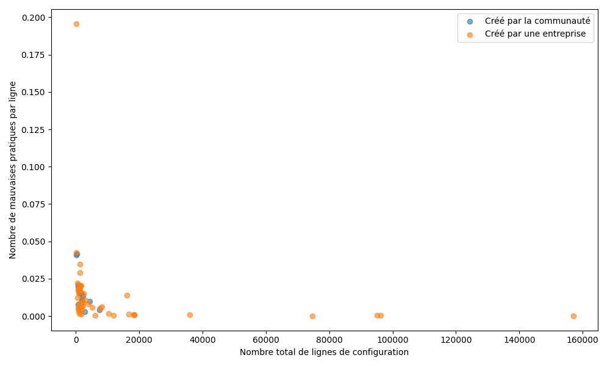
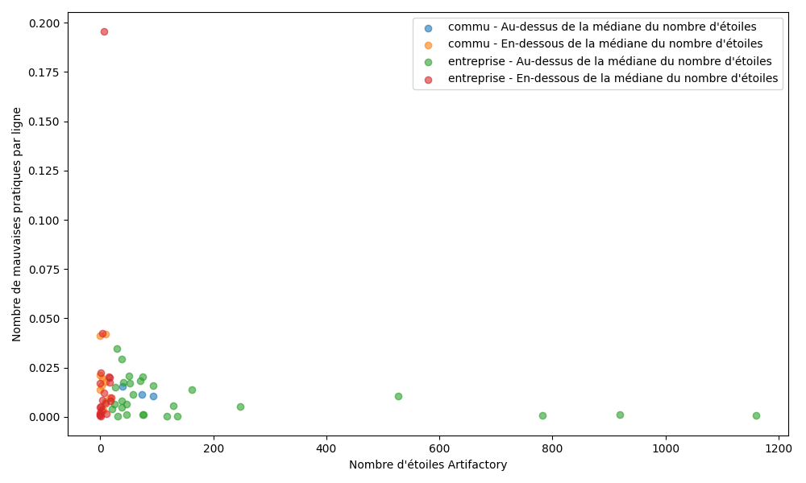
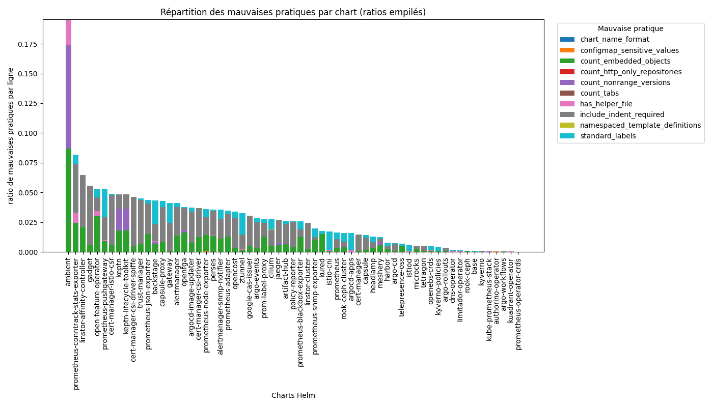
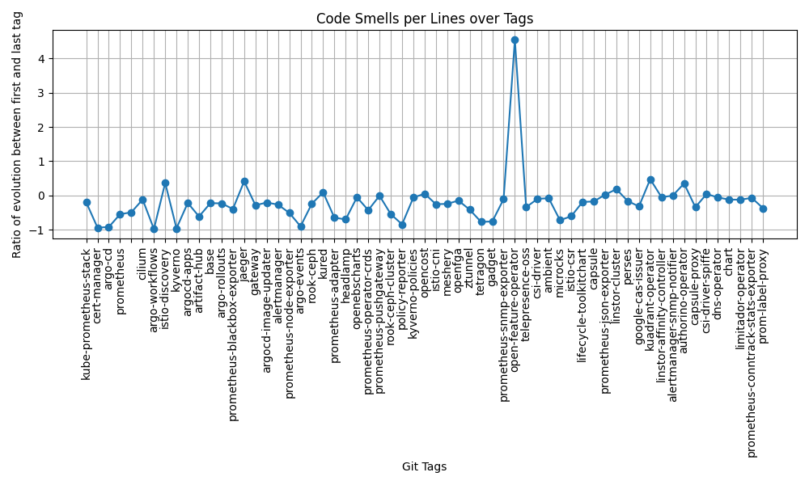
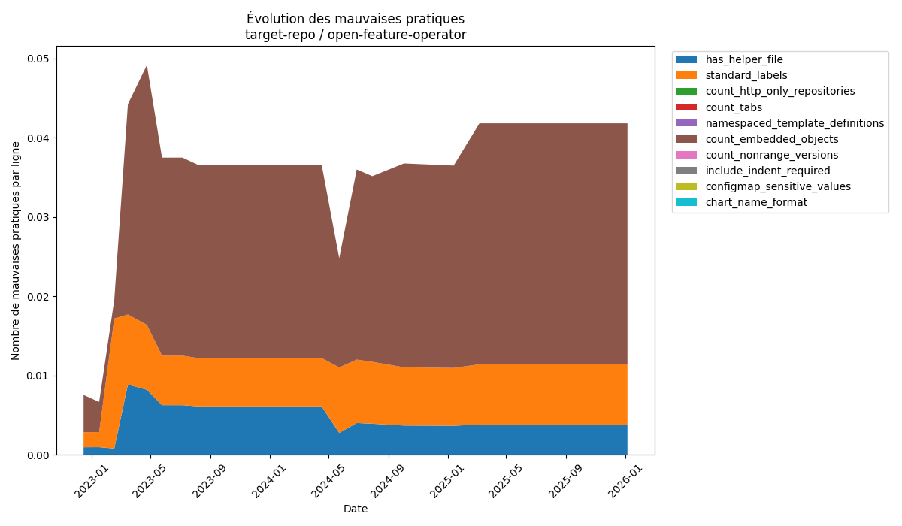

---

---

**_février 2026_**

## Auteurs

Nous sommes 4 étudiants en 5ème année à Polytech Nice Sophia de la mineure SSE en Informatique.

* Camille ANTONIOS &lt;camille.antonios@etu.unice.fr&gt;
* Amelie MULLER &lt;amelie.muller@etu.unice.fr&gt;
* Hajar ELGHOLABZOURI &lt;hajar.el-gholabzouri@etu.unice.fr&gt;
* Gauthier MARTIN &lt;gauthier.martin1@etu.unice.fr&gt;

## I. Contexte

Ces dernières années, l'évolution des applications modernes a été marquée par l’adoption croissante des architectures de microservices, de la conteneurisation et des pratiques DevOps. Cela a transformé les modes de déploiement et d'exploitation des logiciels. Ces applications, plus modulaires et dynamiques, nécessitent des mécanismes capables de gérer la scalabilité, la résilience, le déploiement fréquent et l’isolation des composants. Les conteneurs sont donc devenus une unité standard de déploiement, tandis que l’orchestration de ces conteneurs est devenue un problème central à résoudre dans les environnements de production. Dans ce contexte, Kubernetes s’est imposé comme la plateforme de référence pour l’orchestration des applications conteneurisées, en fournissant des abstractions et des mécaniques permettant d’automatiser le déploiement, la mise à l’échelle, la gestion du cycle de vie et la tolérance aux pannes des applications distribuées. 

Helm est un gestionnaire de paquet pour Kubernetes permettant le déploiement, la configuration et la gestion d’applications sur Kubernetes de manière simple et standardisée. Helm repose sur le concept de charts, qui sont des paquets regroupant des fichiers de configurations décrivant l’ensemble des ressources Kubernetes nécessaires au fonctionnement d’une application. Grâce à des mécanismes de paramétrage, Helm permet d’adapter une même application à différents environnements (développement, test, production) sans modifier sa structure, facilitant ainsi la réutilisation, la maintenance et l’automatisation des déploiements. Sur la plateforme Artifact Hub \[1\], de nombreuses charts Helm sont publiées, versionnées et rendues accessibles à une large communauté d’utilisateurs. Ces charts peuvent provenir d’entreprise tout comme de la communauté elle-même. 

## II. Choix de notre question 

Les charts Helm publiées sur ArtifactHub sont souvent conçues pour être téléchargées et réutilisées par d’autres utilisateurs dans différents contextes. Ce principe de réutilisation, bien que permettant la diffusion des pratiques et connaissances autour de Helm, soulève des questions sur la fiabilité de ces charts et leurs qualités, dans la mesure où une chart réutilisée peut ensuite être déployée à grande échelle et servir de base à de nombreux systèmes de production.

Sur la plateforme, certaines charts se distinguent par la présence de tags tels que “Verified publisher”, “CNCF”, ou encore “Chart Officielle”. Ces labels peuvent renforcer la confiance des utilisateurs dans la qualité et la fiabilité de ces charts, jusqu’au point où celles-ci pourraient être qualifiées de “charts de référence”. Toutefois, ces indicateurs ne constituent pas une garantie explicite de la conformité de la chart aux bonnes pratiques Helm. C’est pour cela que nous avons voulu étudier l'irréprochabilité des charts Helm dites “de référence” sur ArtifactHub. Notre question principale est donc : 

**Les charts de référence Helm sont-elles irréprochables ?**

Dans notre étude, nous avons définie l'irréprochabilité d’une chart Helm comme l’absence de mauvaise pratique dans les différents fichiers composant la chart. Nous avons considéré qu’une mauvaise pratique Helm est une pratique qui peut entraîner différents problèmes sur la chart, comme des problèmes de lisibilité, de performance, de maintenance et autres, sans impacter le bon fonctionnement de la chart.  
De plus, nous avons considéré une chart comme étant de référence si elle présentait les labels “Charte Officielle”, “CNCF”, et “Verified Publisher” sur sa page de publication sur la plateforme Artifact Hub : 
* **“Charte Officielle”** : Ce label  indique qu’une chart Helm est maintenue ou approuvée par les développeurs officiels de l’application qu’elle déploie. Cela signifie qu’elle est considérée comme la source de référence pour déployer cette application avec Helm, offrant en principe une meilleure adéquation avec son cycle de vie, ses versions et ses recommandations de configuration
* **“CNCF”** : La CNCF est la Cloud Native Computing Foundation, une fondation de la Linux Fondation qui soutient et gouverne de nombreux projets open source majeurs de l'écosystème cloud-native, dont Kubernetes mais aussi Helm. Une chart Helm portant un label CNCF sur ArtifactHub indique qu’elle est associée à un projet hébergé ou soutenu par la CNCF, ce qui suggère un certain niveau de maturité et de reconnaissance au sein de l’écosystème.
* **“Verified Publisher”** : ce label indique que l'éditeur de la chart Helm a été authentifié par ArtifactHub, il vise à garantir l'identité et la légitimité de la chart. 

L’étude de l’irréprochabilité des charts Helm dites de référence apparaît comme un enjeu central, dans la mesure où ces charts sont largement réutilisées au sein d’un grand nombre de projets. Lorsqu’une chart est identifiée comme fiable ou recommandée, elle tend à être adoptée telle quelle, puis intégrée dans des environnements de production ou des pipelines CI/CD. Dès lors, la présence de mauvaises pratiques au sein de ces charts peut conduire à un effet de reproduction par copie, propageant des erreurs de conception, des incohérences ou des configurations inadéquates à grande échelle. Ce phénomène est d’autant plus critique que ces charts servent souvent de point de départ à des déploiements automatisés.

Par ailleurs, les charts Helm de référence jouent fréquemment un rôle implicite de support pédagogique. Elles constituent, pour de nombreux utilisateurs, un exemple de la manière dont Helm et Kubernetes doivent être utilisés dans un contexte réel. À ce titre, elles contribuent à façonner les pratiques des ingénieurs DevOps et des développeurs, ce qui renforce la nécessité qu’elles soient conçues avec un haut niveau de qualité, de rigueur et de conformité aux bonnes pratiques attendues.

Dans ce contexte, notre étude vise à analyser l’irréprochabilité de ces charts au travers de deux questions de recherche principales.

La première question cherche à déterminer si des corrélations peuvent être établies entre certaines caractéristiques observables des charts et leur niveau l'irréprochabilité. Plus précisément, nous nous interrogeons sur la relation éventuelle entre la qualité d’une chart et des indicateurs tels que sa popularité sur ArtifactHub (nombre d’étoiles), sa taille ou sa complexité (nombre de lignes), sa date de publication, ou encore l’origine de son développement (projet communautaire ou industriel). L’objectif est d’évaluer dans quelle mesure ces caractéristiques peuvent constituer des signaux pertinents pour un utilisateur souhaitant estimer, en amont, la fiabilité d’une chart avant de l’adopter.

La seconde question porte sur l’évolution temporelle de l’irréprochabilité des charts Helm de référence. Elle vise à analyser si, au fil des versions et des mises à jour, ces charts tendent à corriger les mauvaises pratiques identifiées, à améliorer leur conception et à se rapprocher progressivement des recommandations établies. Cette analyse permet d’évaluer la capacité des charts de référence à s’améliorer dans le temps, ainsi que le rôle potentiel de la maintenance, de la communauté et des retours utilisateurs dans l’amélioration continue de leur qualité. Elle permet également de déterminer si la notion de chart de référence est associée à une dynamique d’amélioration durable, ou si certaines mauvaises pratiques persistent malgré l’évolution des versions.

Nous tenterons donc de répondre aux deux questions suivantes : 
1. **Des corrélations peuvent-elles être faites entre les caractéristiques des charts et leur irréprochabilité ?**
2. **Les charts Helm de référence présentent-elles moins de mauvaises pratiques au fil du temps ?**

## III. Récupération des informations

### Dataset de mauvaises pratiques
Dans un premier temps, nous avons cherché un ensemble de mauvaises pratiques à étudier sur les repositories de charts HELM. 

Les critères fixés pour le choix des mauvaises pratiques à étudier sont les suivants :
* La présence de la mauvaise pratique doit pouvoir être détectable automatiquement dans une chart
* La mauvaise pratique ne doit pas concerner des fichiers déployés uniquement en production (qui ne sont donc jamais accessibles sur des repos open-source)

Nous nous sommes basés sur les mauvaises pratiques décrites dans la documentation [HELM](https://helm.sh/docs/chart_best_practices/), et avons également cherché sur des blogs, comme LevelUp par exemple \[2\] ou des forums, mais cela ne nous a pas permis d’obtenir plus de mauvaises pratiques que celles données dans la documentation officielle, dû aux critères énoncés plus tôt.

Nous avons au final retenu un ensemble de 10 mauvaises pratiques à détecter dans les charts HELM :
* Un fichier ConfigMap contient des valeurs sensibles (mots de passe, token …)
* Un fichier manifest ne contient pas les labels recommandés
* Une définition de template n’utilise pas un nom namespaced
* Utilisation d’objets imbriqués
* Non-utilisation d’un fichier helper
* Utilisation de repositories utilisant HTTP (et non HTTPS)
* Utilisation de versions fixées, au lieu d’utiliser des plages de version
* Utilisation de tabulations pour les indentations, alors qu’il faut utiliser des espaces
* Non-indentation d’un “include”
* Le nom de la chart contient des caractères autres que alphanumériques et le tiret ‘-’

### Dataset de charts à étudier
Nous avons récupéré les charts sur [Artifact Hub](https://artifacthub.io/), un registre open source pour découvrir, partager et publier des paquets logiciels (comme des charts Helm, des opérateurs Kubernetes, des conteneurs OCI, etc.). 

Pour chaque chart, nous avons récupéré manuellement dans un tableur :
* Son nom
* La date de sa dernière mise à jour (information “Days Ago” sur Artifact Hub)
* Le nombre d’étoiles lui étant attribuées sur Artifact Hub
* Le lien vers le repository de la chart
* La provenance de son projet (communautaire, entreprise, ou impossible à déterminer)

Il n’a pas été possible de retrouver les sources de toutes les charts. Les liens des repos n’étant pas toujours indiqués sur Artifact Hub, nous avons dû chercher la majorité des repositories des charts à la main, et certains n’étaient pas trouvables, ce qui a limité notre dataset à 62 charts.

Les projets que nous étudions faisant tous partie de la CNCF, ils sont aujourd’hui tous communautaires. Nous aurions alors aimé savoir pour chaque chart une-à-une si celle-ci avait créé par la communauté, ou si celle-ci avait été créé par la potentielle entreprise possédant le projet avant la CNCF. Il s’est avéré qu’il était trop complexe de connaître cette information. L’information que nous avons donc choisi de récupérer est la provenance du projet avant la CNCF : communautaire, entreprise, ou impossible à déterminer. En pratique, nous avons pu déterminer cela à chaque fois. La liste des charts et des informations qui leur sont associées sont agrégées dans le fichier `chart_infos.csv`.

## IV. Hypothèses & expériences

### Hypothèses
1. Les charts avec beaucoup d’étoiles présentent une plus petite proportion de mauvaises pratiques que les charts avec peu d’étoiles

>La motivation pour cette hypothèse est l'idée qu'à première vue, le nombre d'étoiles semble être un indicateur de 'qualité' attribué par la communauté.
>Malgré tout, cela reste à démontrer car les étoiles sont une métrique à la fois peu précise, largement influencée simplement par la renommée du projet potentiellement au détriment de sa réelle qualité.

2. Les charts avec des releases plus récentes auront une plus grande proportion de mauvaises pratiques que des charts plus anciennes 

>Nous pensons que l'utilisation de l'IA générative dans le développement pourrait potentiellement mener à du code moins qualitatif, contenant plus de mauvaises pratiques. Malgré tout, même si l'hypothèse s'avérait validée, il serait difficile d'expliquer cela par cette seule justification.

3. La proportion de mauvaises pratiques par ligne de code, augmente avec le nombre de lignes de code liées à une Chart

>Ce qui motive cette hypothèse est l'idée que des Charts plus grandes représenteraient une plus grande difficulté à être maintenues.

4. Les charts provenant des entreprises présentent moins de mauvaises pratiques que les charts provenant de la communauté

>Cette dernière hypothèse est motivée par l'idée que les développeurs communautaires seraient potentiellement moins formés, et également moins poussés à développer du code qualitatif. Pour autant, il pourrait également être intéressant de se rendre compte de l'inverse, ce qui pourrait par exemple être justifié par l'idée que les entreprises imposent des deadlines pour le développement de fonctionnalités, ce qui n'est pas (ou largement moins) le cas des projets communautaires.

### Expériences
Nous avons constitué un ensemble de scripts permettant de détecter automatiquement la présence des mauvaises pratiques dans notre dataset de charts (les critères de sélection des mauvaises pratiques ayant été détaillés en amont).
Ces scripts sont développés en Python, et se basent pour la majorité sur des expressions régulières, permettant de détecter la présence des mauvaises pratiques dans un fichier donné.
Chaque script permet ainsi d'itérer sur tous les fichiers, YAML ou TPL, d'une chart donnée, et de récupérer pour chaque chart :
* Le nombre de fois où la mauvaise pratique a été détectée
* Le nombre de lignes de fichiers YAML au total
* Le nombre de fichiers YAML au total
> Ici, le nombre de lignes des fichiers YAML et le nombre de fichiers nous permettent de comparer le nombre de fois où la mauvaise pratique a été détectée par rapport à la taille de la chart. Il est important d’effectuer cette pondération afin de mesurer l’impact de la quantité de mauvaises pratiques détectées.

> Nous parlerons à partir de maintenant de "ratio de mauvaise pratique par ligne" ou "ratio de mauvaise pratique par fichier", pour évoquer la division du nombre de détections de mauvaise pratique par le nombre de lignes ou le nombre de fichiers de la chart.

#### Expérience pour répondre à la première question
Un script maître lance tous les scripts, sur toutes les charts, et agrège les données. Nous pouvons ainsi obtenir:
* Le nombre de mauvaises pratiques par ligne en fonction de la date de la dernière release
* Le nombre de mauvaises pratiques par ligne en fonction de l’origine du projet de la chart (communautaire ou entreprise)
* Le nombre de mauvaises pratiques par ligne en fonction du nombre de lignes constituant la chart
* Le nombre de mauvaises pratiques par ligne en fonction du nombre d’étoiles sur ArtifactHub

Et si des tendances se dégagent de ces graphiques, nous pourrons alors confirmer ou réfuter nos hypothèses.

En plus de ces graphiques, nous avons également obtenu pour chaque chart la répartition des mauvaises pratiques détectées. Cela nous permettra de vérifier que des tendances inattendues pouvant contraster les résultats de notre étude ne se présentent pas. Par exemple, si une seule mauvaise pratique est détectée sur les charts, cela pourrait influencer grandement notre analyse des résultats.

#### Expérience pour répondre à la deuxième question
Dans un deuxième temps, nous souhaitons pouvoir comparer le ratio de mauvaises pratiques par ligne pour chaque chart pour: 
* le premier commit portant sur la chart,
* et celui pour le dernier commit en date.

Ceci nous permettrait d’étudier l’évolution de l’irréprochabilité des charts au fil du temps.

Pour cela, nous reprenons un script similaire à celui utilisé pour répondre à la première question, mais au lieu de simplement calculer le nombre de mauvaises pratiques dans la chart, nous allons :
1. Récupérer tous les commits de la branche principale entre le premier commit portant sur des fichiers dans le dossier de la chart, et le dernier
2. Calculer le ratio de mauvaises pratiques par ligne au premier commit contenant la chart (sur la branche par défaut du repo, ‘master’ ou ‘main’)
3. Calculer le ratio de mauvaises pratiques par ligne au commit le plus récent
4. Calculer le taux d’évolution entre ces 2 ratios
5. Une fois ce taux calculé pour toutes les charts, afficher le graphique

Obtenir un tel graphique pourrait nous permettre de déduire des corrélations. Par exemple, si une majorité des charts ont un ratio négatif entre le commit le plus récent et le plus ancien, cela veut dire que leur ratio de mauvaises pratiques par ligne a globalement diminué au fil du temps (car le nombre le plus récent est inférieur au nombre le plus ancien).

En plus de cela, nous souhaiterions pouvoir faire l’analyse fine de certains projets au fil du temps. Pour se faire, nous avons développé un script d’analyse automatisée exécuté au sein d’une pipeline GitHub Actions. Le recours à une pipeline CI nous permet de disposer d’un environnement Linux contrôlé et reproductible, évitant les biais liés aux configurations locales.

La pipeline clone d’abord le dépôt GitHub contenant la chart à analyser, dont l’URL et le chemin sont définis dans un fichier de configuration. Le script parcourt ensuite un ensemble de commits échantillonnés à intervalle régulier de 1 commit par mois, afin d’obtenir une vision temporelle de l’évolution de la chart.

Pour chaque commit sélectionné, la chart est analysée à l’aide de scripts de détection de mauvaises pratiques. Ces scripts inspectent l’ensemble des fichiers YAML de la chart et comptabilisent les occurrences de chaque mauvaise pratique. En parallèle, le nombre total de lignes de configuration est calculé afin de normaliser les résultats sous forme de ratio de mauvaises pratiques par ligne, permettant de comparer des versions de tailles différentes.

Les résultats sont ensuite agrégés sous forme de séries temporelles, une par mauvaise pratique. Le script génère automatiquement des graphiques illustrant l’évolution de ces ratios dans le temps, ainsi qu’un graphique global présentant la répartition des mauvaises pratiques au fil des versions. Ces visualisations permettent d’identifier l’apparition, la correction ou la persistance de certaines mauvaises pratiques au cours du développement de la chart.

## V. Résultats & analyse
### 1. Présentation des résultats
#### Question 1 : Des corrélations peuvent-elles être faites entre les caractéristiques des charts et leur irréprochabilité ?
##### Résultat 1 : Date de la dernière release

Ratio de mauvaises pratiques par ligne en fonction de la date de la dernière release

Pour chaque chart, nous avons calculé le ratio de mauvaises pratiques par ligne de configuration, puis l’avons mis en relation avec la date de sa dernière release, exprimée en nombre de jours écoulés depuis cette release. Chaque point du graphique correspond à une chart Helm de référence.
Les ratios observés s’étendent d’environ 0,001 à 0,04, aussi bien pour des charts récemment mises à jour que pour des charts dont la dernière release remonte à plus de 100 jours.
Le nuage de points obtenu présente une forte dispersion, sans tendance monotone claire. Les charts récemment mises à jour comme celles dont la dernière release est plus ancienne peuvent présenter des ratios faibles ou élevés de mauvaises pratiques. Aucun lien évident n’apparaît entre l’ancienneté d’une chart et son niveau l'irréprochabilité.

##### Résultat 2: Origine du projet

 Ratio moyen de mauvaises pratiques par ligne selon l’origine du projet

Les charts ont été regroupées selon l’origine de leur projet : communautaire ou entreprise. Pour chaque groupe, nous avons calculé la moyenne du ratio de mauvaises pratiques par ligne afin de comparer globalement les deux catégories.
Les charts issues de projets communautaires présentent en moyenne un ratio légèrement plus élevé de mauvaises pratiques par ligne que celles provenant d’entreprises, environ 0,012 contre 0,009. Toutefois, l’écart observé reste modéré et ne permet pas de conclure à une différence marquée entre les deux origines.

##### Résultat 3 : Taille de la chart

Ratio de mauvaises pratiques par ligne en fonction du nombre total de lignes de configuration

Ce graphique met en relation le ratio de mauvaises pratiques par ligne avec la taille de la chart, mesurée par le nombre total de lignes de fichiers YAML. Les points sont distingués selon l’origine du projet (communautaire ou entreprise). 
Les charts analysées présentent des tailles très variables, allant de quelques centaines à plus de 70 000 lignes de configuration. Les ratios de mauvaises pratiques par ligne observés restent compris majoritairement entre 0,001 et 0,025, quelle que soit la taille de la chart.
Aucune corrélation nette n’apparaît entre la taille d’une chart et son niveau d’irréprochabilité. Les charts de petite comme de grande taille présentent des ratios très variables. La taille du projet ne semble donc pas constituer un indicateur pertinent de la qualité des charts Helm.

##### Résultat 4 : Nombre d'étoiles sur Artifact Hub

Ratio de mauvaises pratiques par ligne en fonction du nombre d’étoiles sur ArtifactHub

Pour chaque chart, le ratio de mauvaises pratiques par ligne a été comparé au nombre d’étoiles attribuées sur ArtifactHub. Une distinction par origine du projet est également représentée afin d’identifier d’éventuelles différences. Le nombre d’étoiles des charts varie de 0 à plus de 700 étoiles. Le graphique montre une dispersion importante des valeurs, indépendamment du nombre d’étoiles. Les charts les plus populaires ne présentent pas systématiquement moins de mauvaises pratiques que celles disposant de peu d’étoiles, suggérant que le nombre d’étoile n’est pas un indicateur fiable d’irréprochabilité pour les résultats trouvés.

##### Résultat 5: Répartition des mauvaises pratiques par chart

Répartition des mauvaises pratiques par chart

Le graphique présente, pour chacune des 62 charts Helm de référence, la répartition des mauvaises pratiques détectées, exprimée en ratio de mauvaises pratiques par ligne de configuration. Chaque barre correspond à une chart et est décomposée en segments colorés, chaque segment représentant une mauvaise pratique spécifique.

Sur les 62 charts analysées, 5 mauvaises pratiques sur 10 sont détectées dans au plus 2 charts chacune :
Mauvais format du nom de chart (0/62),
Dépendances utilisant uniquement HTTP (0/62),
Présence de données sensibles dans des ConfigMaps (2/62),
Templates non namespaced (2/62),
Utilisation de tabulations (2/62).

À l’inverse, certaines mauvaises pratiques sont largement répandues :
utilisation d’objets imbriqués (57/62 charts),
non-utilisation des labels standards recommandés (54/62 charts),
instructions include non indentées (48/62 charts).

Ces trois pratiques représentent la majorité des mauvaises pratiques détectées sur l’ensemble du dataset. Les pratiques associées à des risques de sécurité sont quant à elles très peu présentes.

Ainsi, nos résultats ne nous ont pas permis d’établir de corrélation significative entre les caractéristiques étudiées des charts Helm de référence (date de release, origine du projet, taille, nombre d’étoiles) et leur irréprochabilité. Afin de vérifier que cette absence de corrélation ne résulte pas d’un effet de valeurs extrêmes, plusieurs analyses complémentaires ont été menées, notamment en excluant les charts présentant des valeurs atypiques (fortes tailles, très grand nombre d’étoiles ou ratios extrêmes de mauvaises pratiques). Ces traitements n’ont pas modifié les tendances observées, et les graphiques obtenus conservent une dispersion similaire sans faire émerger de relation plus marquée.

#### Question 2 : Les charts Helm de référence présentent-elles moins de mauvaises pratiques au fil du temps ?

Évolution du ratio de mauvaises pratiques par ligne

Le graphique représente, pour chaque chart Helm de référence, l’évolution du ratio de mauvaises pratiques par ligne entre le premier et le dernier commit apportant des modifications à la chart. Chaque point correspond à une chart, identifiée sur l’axe des abscisses. L’axe des ordonnées représente le ratio d’évolution, calculé comme la différence entre le ratio mesuré au dernier commit et celui mesuré au premier commit. Une valeur négative indique une diminution du ratio de mauvaises pratiques par ligne, tandis qu’une valeur positive indique une augmentation.

La majorité des points se situe en dessous de zéro, traduisant une diminution du ratio de mauvaises pratiques par ligne pour la plupart des charts. Sur les 62 charts analysées, 82,25 % présentent une diminution de ce ratio, tandis que 16,13 % montrent une augmentation. Les variations observées sont généralement proches de zéro, indiquant des évolutions modérées dans la majorité des cas.

Ces résultats montrent que, dans la majorité des cas, les charts Helm de référence présentent une amélioration de leur irréprochabilité au cours du temps, en termes de ratio de mauvaises pratiques par ligne, malgré une augmentation globale de leur taille.

Nos données nous présentent donc une évolution majoritairement à la baisse des proportions de mauvaises pratiques au cours du temps. Nous avons par la suite décidé d’explorer plus en détail les différents pics présents sur le graphique, afin de chercher s’il existait des raisons communes à ces variations.

##### Les extremum en détail
###### La chart open-feature-operator

La première chart que nous avons décidé d’analyser est celle avec la plus forte augmentation de proportions de mauvaises pratiques, la chart open-feature-operator, avec une augmentation de 455%. La figure ci-dessous correspond au graphique généré par notre script d’analyse.

Évolution des mauvaises pratiques de open-feature-operator

Cette chart comporte 3 mauvaises pratiques. La première est l'absence d’un fichier `_helper.tpl` dans la template. La deuxième est la non utilisation des labels standards, dont l’utilisation est recommandée dans toutes les charts Helm, et la dernière est l’utilisation d’objets imbriqués.

Une analyse rapide nous permet rapidement de comprendre la forte évolution mesurée précédemment. En effet, on remarque que le premier commit contient très peu de mauvaises pratiques, et que très vite, la proportion grimpe, avant de se stabiliser. Le premier commit de la chart ne contenait en fait que très peu de lignes, et peu de mauvaises pratiques. Le développement de la chart a donc très vite introduit de nombreuses mauvaises pratiques, majoritairement l’utilisation d’objets imbriqués, ce qui a fait grimper la proportion en flèche.

Cette chart s’apparente donc plus à un cas particulier mesuré par notre script. Notre mesure aurait été différente si le premier commit mesuré avait été un commit de Mai 2023, où le ratio mesuré est quasi identique à celui du dernier commit mesuré.

###### La chart kuadrant-operator

Nous avons ensuite décidé de tourner notre attention vers la deuxième chart avec le plus grand taux d’évolution, la chart kuadrant-operator, qui présente elle une augmentation de 47%.

Évolution des mauvaises pratiques de kuadrant-operator

En termes de mauvaises pratiques mesurées, on en retrouve 2 communes à la chart open-feature-operator : la non utilisation des labels standards ainsi que le manque de fichier `_helper.tpl`. Cette chart comporte aussi une 3e mauvaise pratique : l’utilisation de versions fixes, et non des range de versions, ce qui peut poser un gros problème notamment lorsque l’on n’utilise pas que cette chart.

L’évolution de la proportion des mauvaises pratiques de cette chart est très intéressante à analyser. On remarque un premier pic, faisant doubler la proportion de mauvaises pratiques. Après cela, celle-ci ne fait que diminuer au cours du temps. 

Cette fluctuation s’explique par la façon dont la chart est écrite. En effet, la majorité des charts Helm sépare les responsabilités de leurs templates dans différents fichiers, tous regroupés dans le dossier templates de la chart. Ici, le dossier templates de la chart ne contient en fait qu’un seul fichier, nommé “manifests.yaml”, faisant actuellement 14 000 lignes de configuration. 

En explorant plus précisément les commits aux dates des fluctuations, on remarque que l’évolution de la proportion n’est pas dûe à l’introduction de mauvaises pratiques, mais bien à une fluctuation du nombre de lignes. La forte augmentation d’octobre 2024 s’explique en fait par la suppression de 6 400 lignes de configuration du fichier manifests.yaml.

###### La chart argo-workflow

La dernière chart que nous avons analysé est la chart argo-workflow, avec une diminution de 98% de la proportion de mauvaises pratiques au cours de son développement, faisant d’elle la chart avec la meilleure évolution.

Évolution des mauvaises pratiques de argo-workflow

Au cours de son développement, la chart argo-workflow n’a présenté que 2 mauvaises pratiques : l’utilisation d’objets imbriqués, et la non-utilisation de labels standards.

En observant ce graphique, on remarque 3 pics descendants. Le premier pic est le plus intéressant, car il vient rappeler directement l’intérêt d’un projet open source et communautaire. En effet,  en Juillet 2022, un contributeur remarque l'absence de labels standards dans certaines ressources de la chart argo-workflow, et décide alors spontanément d’ajouter une partie des labels standard manquant. 

Les autres pics, eux, correspondent à des ajouts fait à la chart. Les contributeurs, en ajoutant des templates, n’oublient pas de respecter les bonnes pratiques et d’ajouter les labels standards à leurs fichiers, ajoutant ainsi des lignes de configuration sans pour autant introduire de nouvelles mauvaises pratiques, ce qui a pour effet de faire chuter les proportions.

Cette analyse plus poussée  nous aura permis d’identifier quelques raisons d’augmentation et de diminution des proportions de mauvaises pratiques, comme  les  ajouts et suppressions de lignes de code ou  la volonté de certains contributeurs à vouloir respecter les bonnes pratiques d’implémentation. Cependant, il nous est encore impossible d’établir une généralité commune à toutes les charts.

### 2. Analyse en fonction des hypothèses

#### Hypothèse 1: Les charts avec beaucoup d’étoiles présentent une plus petite proportion de mauvaises pratiques que les charts avec peu d’étoiles.

Les résultats obtenus ne permettent pas de valider cette hypothèse.
L’analyse du ratio de mauvaises pratiques par ligne en fonction du nombre d’étoiles sur ArtifactHub met en évidence une forte dispersion des valeurs. Aucune tendance visuelle ou statistique ne suggère une diminution du ratio de mauvaises pratiques lorsque le nombre d’étoiles augmente.

Ces résultats indiquent que le nombre d’étoiles, bien qu’associé à la visibilité ou à l’adoption d’un projet, ne constitue pas un indicateur fiable de la qualité interne ou de l’irréprochabilité des charts Helm. Cette hypothèse ne peut être ni validé ni invalidé.

#### Hypothèse 2: Les charts avec des releases plus récentes présentent une plus grande proportion de mauvaises pratiques que les charts plus anciennes.

Les résultats ne confirment pas cette hypothèse. Le graphique mettant en relation le ratio de mauvaises pratiques par ligne et la date de la dernière release montre que des charts récemment mises à jour comme des charts avec des releases plus anciennes présentent des ratios faibles ou élevés. Aucune tendance monotone n’est observable, et la dispersion des points reste homogène sur l’ensemble de l’axe temporel. Ces résultats montrent que l’ancienneté ou la récence d’une chart Helm n’a pas d’impact direct mesurable sur son niveau d’irréprochabilité, au moins selon les critères analysés.  Cette hypothèse ne peut être ni validé ni invalidé.

#### Hypothèse 3: La proportion de mauvaises pratiques par ligne augmente avec la taille de la chart.

Cette hypothèse n’est pas validée par les résultats. Les charts analysées présentent des tailles très hétérogènes, allant de quelques centaines à plus de 70 000 lignes de configuration. Aucune corrélation claire n’apparaît entre le nombre total de lignes (ou le nombre de fichiers, utilisé comme métrique alternative) et le niveau d’irréprochabilité. Ces résultats montrent que la complexité liée à la taille d’une chart n’entraîne pas automatiquement une augmentation du ratio de mauvaises pratiques par ligne. Cette hypothèse ne peut être ni validé ni invalidé.

#### Hypothèse 4: Les charts provenant des entreprises présentent moins de mauvaises pratiques que celles provenant de la communauté.

Les résultats montrent une différence moyenne limitée entre les deux catégories. Les charts issues de projets communautaires présentent un ratio moyen de mauvaises pratiques par ligne d’environ 0,012, contre 0,009 pour les charts issues d’entreprises. Bien que cette différence aille dans le sens de l’hypothèse, son amplitude reste faible.
Compte tenu de la dispersion observée au sein de chaque groupe et de l’absence de seuil discriminant clair, cette différence ne permet pas de conclure à une influence déterminante de l’origine du projet sur l’irréprochabilité des charts Helm. Cette hypothèse ne peut être ni validé ni invalidé.

## Conclusion
L’objectif de cette étude était d’évaluer l’irréprochabilité des charts Helm dites de référence publiées sur Artifact Hub, en analysant la présence de mauvaises pratiques détectables automatiquement, ainsi que leur évolution dans le temps. Pour cela, nous avons formulé deux sous-questions de recherche et mené une analyse empirique sur un ensemble de 62 charts Helm associées à des projets CNCF.

Concernant la première sous-question — des corrélations peuvent-elles être établies entre les caractéristiques des charts et leur irréprochabilité ? — les résultats obtenus ne mettent en évidence aucune corrélation significative entre le niveau d’irréprochabilité d’une chart et les caractéristiques étudiées. Ni le nombre d’étoiles sur Artifact Hub, ni la taille de la chart, ni l’ancienneté de la dernière release, ni l’origine du projet (communautaire ou entreprise) ne semblent constituer des indicateurs fiables de la présence ou de l’absence de mauvaises pratiques.

Les ratios de mauvaises pratiques par ligne observés varient entre 0 et environ 0,035, soit en moyenne une mauvaise pratique toutes les 28 lignes de configuration, avec une moyenne de 3,29 mauvaises pratiques par chart. Il apparaît également que quasiment aucune chart de référence n’est totalement exempte de mauvaises pratiques. Néanmoins, l’analyse fine montre que la majorité des pratiques détectées relèvent de problèmes de lisibilité, de structuration ou de maintenabilité, et non de failles critiques affectant directement la sécurité ou les performances.

La seconde sous-question — les charts Helm de référence présentent-elles moins de mauvaises pratiques au fil du temps ? — met en évidence une tendance plus nette. Dans une large majorité des cas, les charts étudiées voient leur ratio de mauvaises pratiques par ligne diminuer au cours du temps, alors même que leur volume de configuration augmente. Cette observation suggère que, malgré l’ajout progressif de nouvelles fonctionnalités et de nouveaux templates, les mainteneurs tendent globalement à améliorer la qualité structurelle de leurs charts. Les analyses détaillées de certains cas extrêmes montrent toutefois que ces évolutions peuvent être fortement influencées par des facteurs techniques, tels que de fortes variations du nombre de lignes ou des restructurations de fichiers, plutôt que par la correction explicite de mauvaises pratiques.

Au regard de ces résultats, aucune de nos hypothèses initiales n’a pu être clairement validée ni infirmée. Les indicateurs étudiés ne permettent pas de prédire l’irréprochabilité d’une chart à un instant donné, tandis que l’évolution temporelle montre une amélioration globale, mais hétérogène, de la qualité des charts de référence.

## Limites de notre étude
Cette étude présente plusieurs limites qu’il convient de souligner afin de contextualiser les résultats obtenus.

Tout d’abord, notre analyse repose exclusivement sur des mauvaises pratiques détectables automatiquement. De nombreuses pratiques problématiques, notamment celles liées à la logique métier, à la cohérence fonctionnelle ou à l’usage réel des charts dans des environnements de production, ne peuvent pas être identifiées par des scripts statiques. En conséquence, notre mesure de l’irréprochabilité ne reflète qu’une vision partielle de la qualité réelle des charts Helm.

Par ailleurs, toutes les mauvaises pratiques n’ont pas le même impact. Certaines concernent des aspects de sécurité, d’autres uniquement la lisibilité ou la maintenabilité ; certaines ont une portée globale sur l’ensemble de la chart, tandis que d’autres restent très localisées. Dans notre étude, chaque mauvaise pratique est comptabilisée de manière uniforme, sans pondération selon sa gravité ou son impact potentiel, ce qui limite la précision de l’évaluation globale de la qualité.

La prise en compte de la taille des charts pour relativiser le nombre de mauvaises pratiques constitue une difficulté méthodologique. La normalisation par le nombre de lignes ou par le nombre de fichiers de configuration a été envisagée, mais ces deux approches présentent des limites et peuvent introduire des biais dans l’interprétation des résultats.

Enfin, l’identification de l’origine des charts (communautaire ou entreprise) s’est révélée complexe. Les informations disponibles sur Artifact Hub et dans les dépôts GitHub ne permettent pas toujours de déterminer clairement l’origine initiale d’un projet, ce qui peut affecter la fiabilité de cette variable dans nos analyses.

Plusieurs pistes peuvent être envisagées pour approfondir et améliorer cette étude. Une première amélioration consisterait à élargir le dataset de charts analysées, en assouplissant certains critères de sélection. Cela permettrait d’augmenter la diversité des projets étudiés et de renforcer la portée statistique des analyses, notamment pour la recherche de corrélations faibles ou indirectes.

Une seconde piste concerne l’amélioration du jeu de mauvaises pratiques. Il serait pertinent d’introduire une pondération des mauvaises pratiques en fonction de leur impact potentiel (sécurité, performance, maintenabilité, lisibilité), afin de mieux refléter leur gravité réelle. De plus, l’intégration de pratiques moins connues ou plus spécifiques, issues de retours d’expérience industriels ou communautaires, permettrait d’enrichir l’analyse au-delà des recommandations officielles.

## VI. Outils
L’ensemble des scripts mentionnés dans ce chapitre, ainsi que notre dataset, sont accessibles sur notre dépôt GitHub : https://github.com/CamilleAntonios/helm-best-practices

Scripts développés en Python
* Création des graphes utilisant matplotlib
* Utilisation de Git et Github pour cloner les divers repos de charts
* Utilisation d’Artifact Hub pour récupérer les charts

## VI. Références
[1] ArtifactHub : https://artifacthub.io/ (en particulier, lien permettant de retrouver notre Dataset :  https://artifacthub.io/packages/search?kind=0&verified_publisher=true&official=true&cncf=true&sort=relevance&page=1)

[2] Article LevelUp : https://levelup.gitconnected.com/helms-horrible-hyphens-of-hell-3713c6d989bf

Documentation Officielle des Bonnes Pratiques Helm : https://helm.sh/fr/docs/chart_best_practices/

Pull Request ajoutant les labels standards à la chart argo-workflows: 
https://github.com/argoproj/argo-helm/pull/1369 

