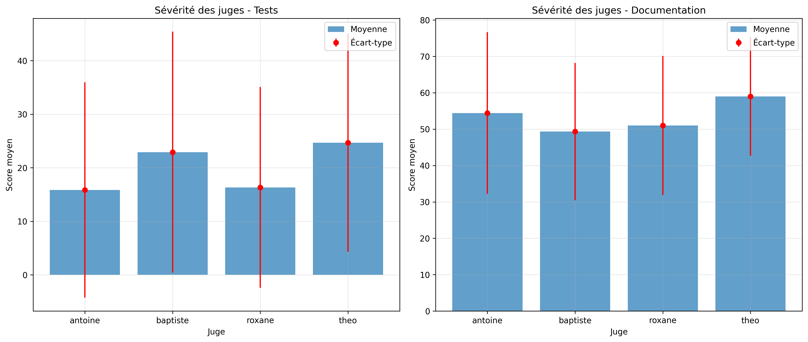
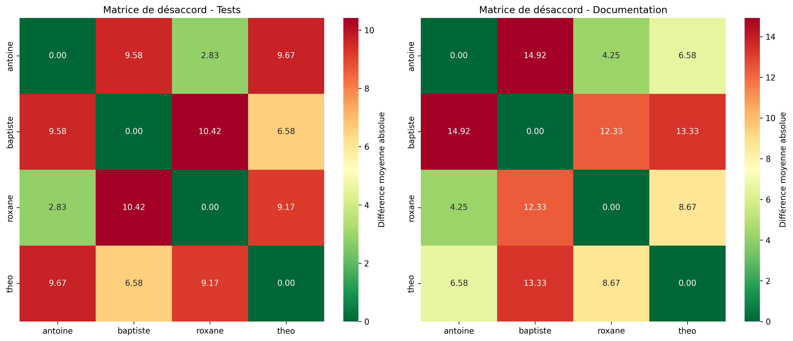
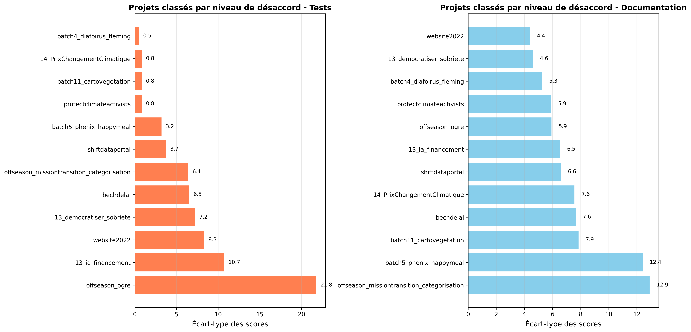

# Chapitre de livre

> Dans le rendu sur moodle, un étudiant du groupe, met uniquement le lien vers le chapitre de son équipe sous https://rimel-uca.github.io/
> 

> Voici quelques-uns des critères utilisés pour évaluer les chapitres
> 

> Critères d'évaluation :
> 
> 1. Format : structure, forme adaptée au contenu d'un livre en ligne…
> 2. Contexte dont la motivation
> 3. Observations/Question générale : formulation, intérêt, limites éventuelles.
> 4. Quelle est votre base d'information
> 5. Quelles sous-questions et hypothèses et expériences, vous allez mener
>     1. Quelles expérimentations, démarches choisies pour vérifier ou non vos hypothèses, justifications.
>     2. Quels outils sont utilisés (référence si besoin aux scripts)
>     3. Justification des choix
> 6. Résultats
>     1. visualisations
>     2. Analyse des résultats (et des limites si nécessaires)
>     3. conclusion relativement aux hypothèses
> 7. Conclusion globale intégrant les perspectives à ce travail

# Introduction

Ce chapitre présente notre étude de la maintenabilité sur les projets de dataforgoodfr. Nous étudierons celle-ci à travers deux axes : la qualité des tests et la qualité de la documentation. Ces 2 axes sont primordiaux pour assurer la qualité et donc la continuité d’un projet.  

Nous analyserons les deux axes mentionnés en nous interrogeant sur les critères qui peuvent les impacter. Cela sera fait dans le but de proposer des recommandations visant à aider les développeurs de projets à améliorer la qualité de leur test et la qualité de leur documentation. 

Nous nous sommes donc fixé la problématique suivante :

> Comment varie la qualité de tests & de la documentation du code dans les projets de Data For Good ?
> 

Le premier critère  de variation auquel nous avons pensé, dû à notre domaine d’étude et à la tendance du moment, est l’IA générative. Celle-ci est depuis maintenant plusieurs années capable d’écrire du texte, notamment du code et de la documentation, dont la qualité ne cesse de croître. Nous pensons donc que son émergence peut avoir un impact sur nos deux axes d’étude : la qualité des tests et la qualité de la documentation.

Le deuxième critère repose sur la nature de l’organisation dataforgood. Celle-ci met en avant la collaboration entre développeur. Nous sommes donc en position de nous demander si l’identité de développeur contribuant à chaque projet à un impact sur nos axes d’analyse. Malheureusement, nous sommes limité techniquement car il est difficile voire impossible de connaître le niveau ou l’expérience de n’importe quel contributeur dans n’importe quel domaine. Nous sommes donc retourner vers un critère plus concret et plus simple : le nombre de contributeurs. En effet, il nous semble naturel qu’un projet réunissant de nombreux individus sera mieux documenté pour assurer la collaboration qu’un projet développé par un seul ou deux contributeur. Ce sera donc notre deuxième critère d’étude.

Enfin, en explorant un peu les projet de dataforgoodfr, nous avons remarqué que de nombreux projet étaient liés à l’IA. Nous avons donc souhaité nous pensé sur cas particulier, en comparant les projet AI-related et ceux non AI-related. 

Nous répondrons donc aux questions suivantes :

1. L’entrée de l’IA générative dans le quotidien a-t-elle eu un impact dans ces deux domaines ?
2. Quel impact le nombre de collaborateurs a-t-il sur la qualité des tests et la documentation ?
3. Quelles différences de qualité de tests sont présentes entre les projets incluant des composants d'IA et les autres ?

# Objectifs

- Définir une méthodologie pour analyser les tests et la documentation d’un projet,
- Appliquer cette méthodologie aux dépôts de Data For Good,
- Poser des hypothèses concernant l’ensemble des projets des projets de DFG basées sur les dépôts analysés
- Produire des recommandations dédiées à chaque problèmes repérés dans l’interprétation.

# Méthodologie

## Choix des dépôts

Les dépôts à analyser ont été choisis de manière aléatoire tout en s’assurant d’avoir un projet par triplet de catégorie : réalisation par rapport à la sortie public de l’IA générative, nombre de collaborateurs, lien avec des composants d’IA.

### Catégories de la question 1

La première question cherche à étudier l’impact de l’IA générative sur les projets de dataforgoodfr. À défaut de pouvoir analyser précisément quels projets ont utilisé de tels outils, nous nous sommes basé pour cette étude sur la capacité des développeurs à utiliser l’IA générative. En nous basant sur la courbe [trends.google.com](http://trends.google.com) des termes “chatgpt", “chat gpt” et “gpt” disponible ci-dessous. Ces termes concernent tous l’outil leader de l’IA générative ChatGPT.com. 

Celle-ci met en évidence deux dates : novembre 2022, date de publication du site [ChatGPT.com](http://ChatGPT.com) et août 2024 qui semble correspondre à une nouvelle hause d’utilisation de la plateforme. Ces dates, par extension, indiquent les phases qu’à connu l’IA générative : avant l’entrée dans le quotidien de la GenAI, pendant cette entrée et après l’admission à grande échelle de cette technologie.

Après vérification de la répartition de l’ensemble des projets de dataforgoodfr projets, nous avons pu observer que leurs dates d’activités sont quasiment répartie avec un tier des projets avant l’émergence de l’IA générative, un tier pendant son émergence et un dernier tier après celle-ci. Cette répartition justifie ainsi de prendre le même nombre de projet pour chacune de ses catégories dans notre échantillon.

### Catégories de la question 2

La deuxième question permet de se pencher sur l’impact du nombre de contributeurs sur les projets. Nous avons développer un script python (‼️disponible ici ‼️) qui nous a permis de calculer des statistiques sur le nombre de contributeurs des projet de l’organisation dataforgoodfr. les résultats sont présents ci-dessous.

On peut voir que la moyenne du nombre de contributeurs sur un dépôt est de 5.54. Nous considérons donc les projet ayant 5 contributeurs ou moins comme des petits projets et ceux ayant 6 ou plus comme des gros projets.

### Catégories de la question 3

La dernière question concerne la proximité du projet avec des composant d’IA. Les dépots peuvent ainsi être AI-related ou ne pas l’être. Sont définis comme en rapport avec l’IA les projets permettant d’entraîner des réseaux de neurones, ceux utilisant des APIs d’IA, ou encore ceux qui concerne des RAGs.

Ainsi nous avons choisi 12 dépôts car chaque projet peut : 

- s’être passé avant/pendant/après la sortie de l’IA générative (trois possibilités),
- avoir été réalisé par peu ou beaucoup de contributeurs (deux possibilités),
- concerner ou pas des composants d’IA (deux possibilités).

Nous aurons donc 4 projets par catégorie de la question 1, 6 par catégorie de la question 2 et 6 par catégorie de la question 3. 

### Projets choisis

- **Avant GenAI (… < 12/2022 )**

|  | **Peu de contributeurs** | **Beaucoup de contributeurs** |
| --- | --- | --- |
| **AI-related** | [offseason_missiontransition_categorisation](https://github.com/dataforgoodfr/offseason_missiontransition_categorisation/tree/main) | [batch4_diafoirus_fleming](https://github.com/dataforgoodfr/batch4_diafoirus_fleming) |
| **Non AI-related** | [website2022](https://github.com/dataforgoodfr/website2022) | [batch5_phenix_happymeal](https://github.com/dataforgoodfr/batch5_phenix_happymeal) |
- **Pendant GenAI (12/2022 < … < 08/2024 )**

|  | **Peu de contributeurs** | **Beaucoup de contributeurs** |
| --- | --- | --- |
| **AI-related** | [batch11_cartovegetation](https://github.com/dataforgoodfr/batch11_cartovegetation)  | [bechdelai](https://github.com/dataforgoodfr/bechdelai) |
| **Non AI-related** | [protectclimateactivists](https://github.com/dataforgoodfr/protectclimateactivists) | [offseason_ogre](https://github.com/dataforgoodfr/offseason_ogre) |
- **Après GenAI ( 08/2024 < … )**

|  | **Peu de contributeurs** | **Beaucoup de contributeurs** |
| --- | --- | --- |
| **AI-related** | [13_ia_financement](https://github.com/dataforgoodfr/13_ia_financement) | [13_democratiser_sobriete](https://github.com/dataforgoodfr/13_democratiser_sobriete) |
| **Non AI-related** | [14_PrixChangementClimatique](https://github.com/dataforgoodfr/14_PrixChangementClimatique/tree/main)  | [shiftdataportal](https://github.com/dataforgoodfr/shiftdataportal) |

## Notation

Chaque projet est noté selon la qualité de sa notation et selon la qualité de ses tests. Nous sommes 4 jury, nous utiliserons tous les 4 les mêmes grilles de notations décrite ci-dessous.

### **Description des critères**

Afin d’assurer la qualité des notes et la reproductibilité de notre protocoles, nous avons fixé ensemble des définitions claires et précises des nos axes d’études : la qualité des tests et la qualité de la documentation. 

**Critères de la qualité de la documentation**

- Présence d’un README.md incluant
    - **Description fonctionnelle du projet** permettant de comprendre l'intérêt du repo
    - **Explication de l’architecture du repo** justifiant l'arborescence des fichiers
    - **Des instructions d’installation** mentionnant potentiellement la configuration requise et surtout le protocole pour exécuter le projet
    - **Les cordonnées des contributeurs** pour permettre d'avoir des informations supplémentaires
- Un **CHANGELOG.md** traçant l'historique des modifications faites sur le depot
- Un **CONTRIBUTING.md** expliquant la stratégie de branche, la convention de commit, les règles de pull request/fork
- Un fichier **LICENCE.md est présent** et décrit la licence protégeant le projet

**Critères de la qualité de tests**

- Des **tests sont présents**, dans un dossier tests, des fichiers avec l'extension de test selon le langage utilisé
- Des test de **niveaux de test pertinent sont présents** selon les besoins (unitaires, intégration, de bout en bout)
- Les **tests sont de bonne qualité** s’ils sont :
    - Lisibles
    - Bien nommés
    - Pertinents
    - Utiles
- Le pourcentage de **coverage des test est indiqué** (5 points), la couverture des tests (si indiqué ou mesurable) **est bon (**de 0 à 20)
- Les **tests sont entretenus dans le temps**, la date de modification d'un fichier de tests est égale ou ultérieure à celle du fichier testé

### **Barèmes de notation**

Une fois les définitions fixée, nous avons attribué un nombre de point maximal à chacun des critères en fonction de leur importance et la profondeur attendue en nous basant sur nos avis de futurs ingénieurs logiciels.

**Barème de la qualité de la documentation**

| **Critère** | **Nombre de point** |
| --- | --- |
| README description fonctionnelle du projet | 25 |
| README Explication architecture technique | 20 |
| README instruction installation | 25 |
| README nom et contact des contributeurs | 5 |
| CHANGELOG à jour | 10 |
| CONTRIBUTING complet | 10 |
| LICENCE présente | 5 |

**Barème de la qualité des tests**

| Critères | Poids |
| --- | --- |
| Présence de tests | 15 |
| Niveaux présents (UT/IT/E2E) | 25 |
| Qualité des tests | 25 |
| Coverage dispo + couverture | 25 |
| Entretien dans le temps (Git) | 10 |

## Moyennage des notes

Une fois chaque projet noté par chaque jury selon les critères définis nous avons pu construire les tableaux récapitulatif de nos notes brutes (disponible ici).

À partir des fichiers mentionnés ci-dessus, nous avons calculé et agrégé les moyennes des jurys afin d’obtenir, pour chaque projet, une note de qualité des tests et de la documentation. Dans un même temps, nous avons calculer le [coefficient de corrélation intraclasse](https://en.wikipedia.org/wiki/Intraclass_correlation) de chaque projet pour chaque axe ainsi que son interprétation selon la table 7 du papier de HAN, Xiaoxia. On statistical measures for data quality evaluation. *Journal of Geographic Information System*, 2020, vol. 12, no 3, p. 178-187.  Ce coefficient nous permet de mesurer l’accord entre les notation des jurys. Nous avons donc développé un script python disponible ici, qui traite les 4 fichiers CSV de notation de chaque jury pour générer un csv présenter dans le tableau suivant. 

| **Projet** | **Moyenne test** | **ICC test** | **Interprétation ICC test** | **Moyenne doc** | **ICC doc** | **Interprétation ICC doc** |
| --- | --- | --- | --- | --- | --- | --- |
| 13_ia_financement | 11.5 | 0.245 | poor | 79.5 | 0.83 | good |
| 13_democratiser_sobriete | 52.5 | 0.8 | good | 66.25 | 0.731 | moderate |
| offseason_missiontransition_categorisation | 30.75 | 0.749 | moderate | 63.75 | 0.959 | excellent |
| shiftdataportal | 36.0 | 0.869 | good | 41.0 | 0.765 | good |
| batch4_diafoirus_fleming | 0.5 | 0.333 | poor | 25.25 | 0.925 | excellent |
| website2022 | 5.75 | -0.263 | poor | 62.5 | 0.832 | good |
| batch5_phenix_happymeal | 31.5 | 0.808 | good | 53.5 | 0.77 | good |
| batch11_cartovegetation | 0.75 | 0.267 | poor | 53.25 | 0.932 | excellent |
| bechdelai | 45.25 | 0.818 | good | 69.0 | 0.843 | good |
| protectclimateactivists | 0.75 | 0.267 | poor | 30.25 | 0.851 | good |
| offseason_ogre | 23.25 | 0.172 | poor | 67.25 | 0.864 | good |
| 14_PrixChangementClimatique | 0.75 | 0.267 | poor | 29.75 | 0.832 | good |

À partir de ces données traitées, nous avons pu groupé les projet selon les différentes catégories pour chacun des question

## Limites

### Portée de l’étude

On ne peut pas analyser l’intégralité des dépôts pour produire des conclusion visant l’ensemble des projets de Data For Good France par manque de temps dans le cadre de cette étude. Plusieurs aspects de notre méthodologie doivent être automatiser pour atteindre un tel but :

- La classification de chaque projet selon les critères mentionnés dans chaque question (avant/pendant/après l’entrée de l’IA générative dans le quotidien, le nombre de collaborateur, le lien du projet avec l’IA)
- L’application de la notation de la qualité de la documentation
- L’application de la notation de la qualité des tests

### Comptage du nombre de contributeurs

Notre script de comptage du nombre de contributeurs par projet ne prend malheureusement pas en compte les contributeurs utilisant plusieurs comptes différents, car en effet le script compte le nombre de compte différents ayant commit sur le dépôt.

### Limites liées à la fiabilité inter-juge et aux itérations de notation

Afin d’évaluer la fiabilité des notations produites par les quatre membres du jury, nous avons calculé, pour chaque projet et pour chacun des deux axes (tests et documentation), un coefficient de corrélation intraclasse (ICC). Comme expliqué précédemment.

Lors de la première itération de notation, nous avons observé pour plusieurs projets des valeurs d’ICC faibles, montrant un désaccord important entre les jurys. Cette situation nous a amenés à discuter nos résultats collectivement afin d’identifier les sources de divergence dans l’interprétation des critères de la grille de notation.

À l’issue de ces échanges, certaines ambiguïtés ont été mises en évidence, notamment :

- la frontière entre documentation minimale et exploitable
- l’évaluation de la qualité intrinsèque des tests lorsque leur couverture ou leur exécution n’était pas explicitement documentée
- l’interprétation de l’entretien dans le temps des tests à partir de l’historique Git

Nous avons alors procédé à une seconde itération de notation, en conservant les mêmes critères et barèmes, mais avec une compréhension partagée plus précise de ceux-ci. Toutefois, cette nouvelle itération a également révélé l’arrivée de nouvelles problématiques d’interprétation, notamment liées à l’hétérogénéité des projets analysés (langages, objectifs, contraintes techniques).

En conséquence, malgré ces itérations successives, certains projets présentent encore des ICC faibles, en particulier pour l’axe qualité des tests. Cela montre à la fois :

- la part de subjectivité inhérente à l’évaluation qualitative de dépôts logiciels
- la difficulté à normaliser des critères applicables à des projets très différents
- et les limites d’une grille de notation manuelle, même partagée entre évaluateurs

### Analyse détaillée des désaccords entre juges

Pour mieux comprendre les divergences dans les notations, nous avons analysé statistiquement les désaccords entre les quatre juges à l'aide d'un script Python ([analyse_desaccords_juges.py](assets/codes/analyse_desaccords_juges.py)).

#### Sévérité des juges

L'analyse révèle des différences notables de sévérité entre les juges :

- **Tests** : Théo (moyenne 24.7) et Baptiste (22.9) sont les plus généreux, tandis qu'Antoine (15.8) et Roxane (16.3) sont plus sévères.
- **Documentation** : Théo (moyenne 59.0) reste le plus généreux, Baptiste (49.3) est le plus strict.

#### Accord entre juges

L'analyse des différences entre paires de juges montre que :

- **Meilleur accord** : Antoine et Roxane s'accordent le mieux sur les tests (différence moyenne de 2.8 points) et la documentation (4.3 points)
- **Plus grand désaccord** : Baptiste et Roxane divergent le plus sur les tests (10.4 points), Antoine et Baptiste sur la documentation (14.9 points)

#### Projets controversés

Certains projets ont généré des désaccords importants, notamment :

1. **offseason_ogre** : écart de 45 points sur les tests (de 0 à 45)
2. **13_ia_financement** : écart de 25 points sur les tests
3. **offseason_missiontransition_categorisation** : écart de 33 points sur la documentation

Ces désaccords s'expliquent principalement par des interprétations différentes sur :
- La présence effective de tests dans le projet
- Le niveau de qualité minimal acceptable
- L'évaluation de l'entretien des tests dans le temps

Malgré une grille commune et des calibrations, une part de subjectivité persiste. Le bon accord entre certaines paires de juges et les ICC acceptables pour la documentation valident néanmoins la robustesse globale de la méthodologie. Pour améliorer la reproductibilité future, l'automatisation partielle de l'évaluation des tests serait bénéfique.

# Résultats

L’ensemble des notes brutes sont disponibles ici.

Les notes moyennes de chaque dépôts sont été calculées et sont disponibles ici. 

## Question 1

## Question 2

## Question 3

[statistiques_par_projet.csv](https://www.notion.so/2eebce6c27f980ada27dd37c38e6159f?pvs=21)